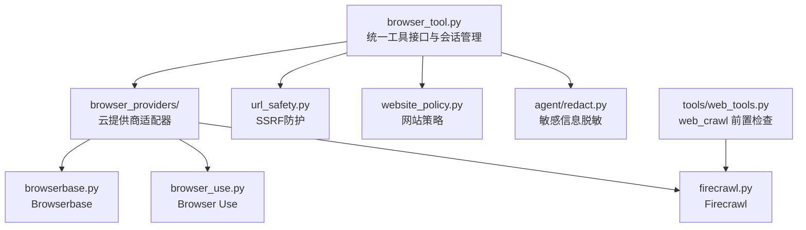
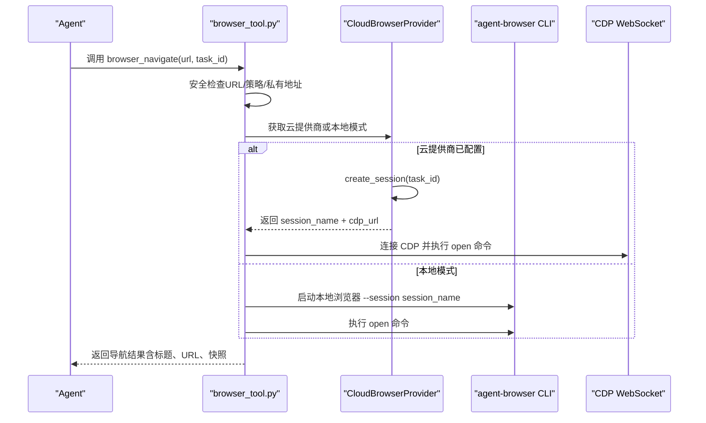
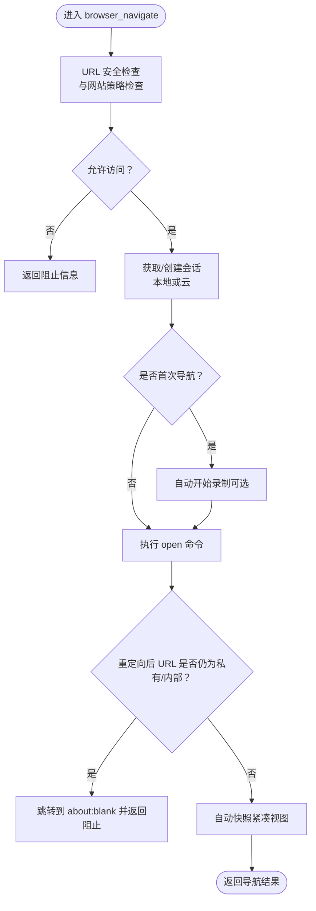
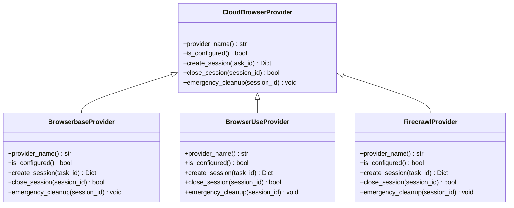
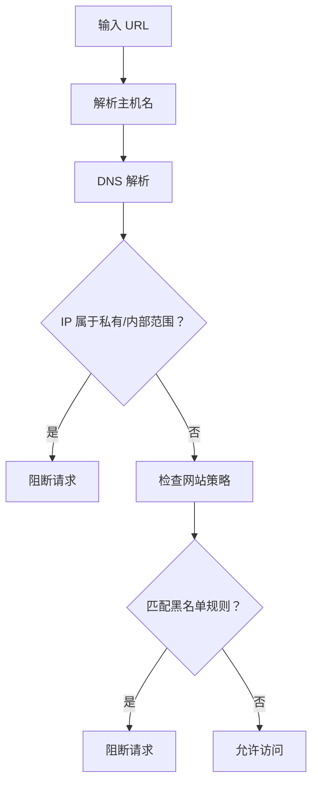
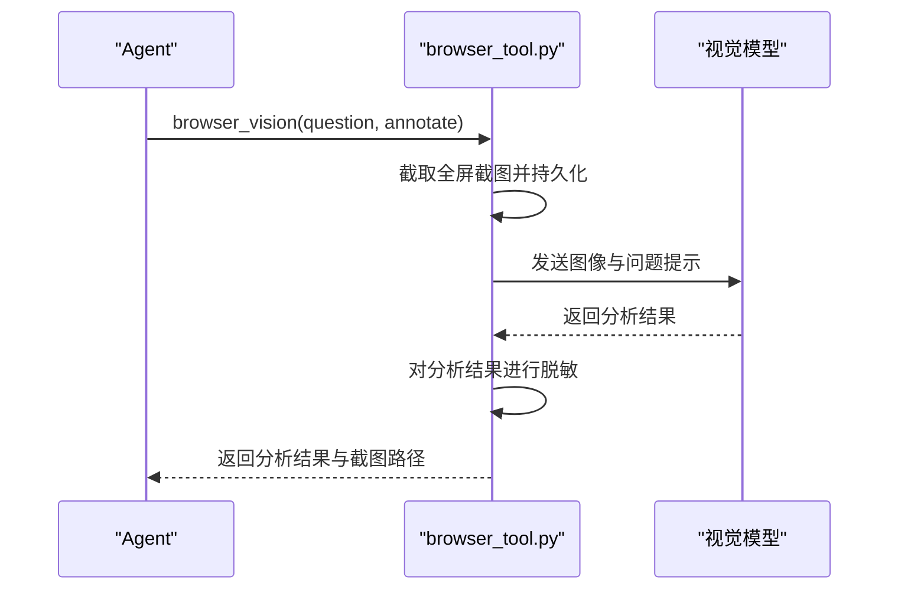
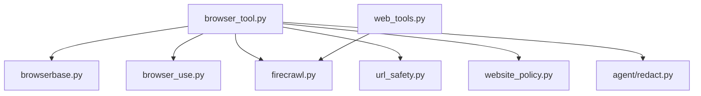

# 浏览器工具系统

<cite>
**本文档引用的文件**
- [browser_tool.py](file://tools/browser_tool.py)
- [base.py](file://tools/browser_providers/base.py)
- [browserbase.py](file://tools/browser_providers/browserbase.py)
- [browser_use.py](file://tools/browser_providers/browser_use.py)
- [firecrawl.py](file://tools/browser_providers/firecrawl.py)
- [url_safety.py](file://tools/url_safety.py)
- [website_policy.py](file://tools/website_policy.py)
- [redact.py](file://agent/redact.py)
- [web_tools.py](file://tools/web_tools.py)
- [config.py](file://hermes_cli/config.py)
</cite>

## 目录
1. [简介](#简介)
2. [项目结构](#项目结构)
3. [核心组件](#核心组件)
4. [架构总览](#架构总览)
5. [详细组件分析](#详细组件分析)
6. [依赖分析](#依赖分析)
7. [性能考虑](#性能考虑)
8. [故障排除指南](#故障排除指南)
9. [结论](#结论)

## 简介
本文件面向Hermes Agent的浏览器工具系统，系统性阐述浏览器自动化架构、多提供商适配器设计与会话管理机制，详解Browserbase、Browser Use（Nous）与Firecrawl等第三方提供商的集成方式与配置选项；覆盖安全限制、隐私保护与数据脱敏机制；解释页面抓取、内容提取与交互模拟的实现细节；并提供性能优化、缓存策略与错误恢复机制，以及调试技巧与故障排除指南。

## 项目结构
浏览器工具系统主要由以下模块组成：
- 工具层：browser_tool.py 提供统一的浏览器工具接口与会话生命周期管理
- 云提供商适配器：browser_providers 目录下的 Browserbase、Browser Use、Firecrawl 实现
- 安全与隐私：url_safety.py（SSRF防护）、website_policy.py（网站访问策略）、agent/redact.py（敏感信息脱敏）
- 集成工具：web_tools.py（如 web_crawl 的前置检查）

**图表来源**
- [browser_tool.py](file://tools/browser_tool.py)
- [browserbase.py](file://tools/browser_providers/browserbase.py)
- [browser_use.py](file://tools/browser_providers/browser_use.py)
- [firecrawl.py](file://tools/browser_providers/firecrawl.py)
- [url_safety.py](file://tools/url_safety.py)
- [website_policy.py](file://tools/website_policy.py)
- [redact.py](file://agent/redact.py)
- [web_tools.py](file://tools/web_tools.py)

**章节来源**
- [browser_tool.py](file://tools/browser_tool.py)
- [base.py](file://tools/browser_providers/base.py)

## 核心组件
- 统一工具接口与会话管理：browser_tool.py 提供 browser_navigate、browser_snapshot、browser_click、browser_type、browser_scroll、browser_back、browser_press、browser_console、browser_get_images、browser_vision 等工具函数，封装 agent-browser CLI 调用与云提供商 CDP 连接。
- 云提供商适配器：通过 CloudBrowserProvider 抽象，实现 Browserbase、Browser Use、Firecrawl 的会话创建、关闭与紧急清理。
- 安全与隐私：url_safety.py 阻断私有/内部地址；website_policy.py 支持用户自定义网站黑名单；agent/redact.py 对输出进行敏感信息脱敏。
- 集成工具：web_tools.py 在使用 Firecrawl 的 web_crawl 前进行 API Key 检查与 URL 安全校验。

**章节来源**
- [browser_tool.py](file://tools/browser_tool.py)
- [base.py](file://tools/browser_providers/base.py)
- [url_safety.py](file://tools/url_safety.py)
- [website_policy.py](file://tools/website_policy.py)
- [redact.py](file://agent/redact.py)
- [web_tools.py](file://tools/web_tools.py)

## 架构总览
浏览器工具系统采用“统一接口 + 多提供商适配”的架构：
- 本地模式：直接调用 agent-browser 启动本地 headless Chromium
- 云模式：根据配置选择 Browserbase、Browser Use 或 Firecrawl，通过其 API 创建会话并返回 CDP URL，再由工具连接
- 会话隔离：每个任务 ID 对应独立会话，支持自动清理与后台空闲回收
- 安全前置：导航前执行 URL 安全检查与网站策略检查，防止 SSRF 与违规访问

**图表来源**
- [browser_tool.py](file://tools/browser_tool.py)
- [browserbase.py](file://tools/browser_providers/browserbase.py)
- [browser_use.py](file://tools/browser_providers/browser_use.py)
- [firecrawl.py](file://tools/browser_providers/firecrawl.py)

## 详细组件分析

### 组件A：统一工具接口与会话管理（browser_tool.py）
- 会话注册与并发安全：使用线程锁保护活动会话字典与最后活跃时间映射，支持多子任务并发调用
- 会话生命周期：
  - 自动启动后台空闲清理线程，按超时阈值回收不活跃会话
  - 支持主动清理与进程退出时的紧急清理
  - 支持自动录制（可选），在首次导航时启动，结束时保存
- 命令执行：
  - 通过 agent-browser CLI 执行 open、snapshot、click、fill、scroll、back、press、console、eval、screenshot、close 等命令
  - 使用临时 socket 目录避免并发冲突；超时控制与非 JSON 输出解析增强鲁棒性
- 页面内容处理：
  - 快照长度超过阈值时进行截断或基于任务的摘要抽取
  - 对快照文本与视觉分析结果进行敏感信息脱敏
- 安全与策略：
  - 导航前对 URL 进行 SSRF 检查与网站策略检查
  - 阻止包含密钥/令牌的 URL 参数
  - 首次导航后检测常见“机器人验证”页面并给出提示

**图表来源**
- [browser_tool.py](file://tools/browser_tool.py)

**章节来源**
- [browser_tool.py](file://tools/browser_tool.py)

### 组件B：云提供商适配器（CloudBrowserProvider 抽象与实现）
- 抽象接口：provider_name、is_configured、create_session、close_session、emergency_cleanup
- BrowserbaseProvider：
  - 支持代理、高级隐身、保活、自定义超时等特性开关
  - 402 错误时自动降级（移除付费功能）并重试
  - 返回 session_name、bb_session_id、cdp_url 与启用特性
- BrowserUseProvider：
  - 支持直连 API Key 或通过 Nous 管理网关
  - 管理模式下使用幂等键避免重复创建
  - 返回 session_name、bb_session_id、cdp_url 与外部调用 ID
- FirecrawlProvider：
  - 通过 /v2/browser 创建浏览器会话，返回 id 与 cdpUrl
  - 支持自定义 API URL 与 TTL

**图表来源**
- [base.py](file://tools/browser_providers/base.py)
- [browserbase.py](file://tools/browser_providers/browserbase.py)
- [browser_use.py](file://tools/browser_providers/browser_use.py)
- [firecrawl.py](file://tools/browser_providers/firecrawl.py)

**章节来源**
- [base.py](file://tools/browser_providers/base.py)
- [browserbase.py](file://tools/browser_providers/browserbase.py)
- [browser_use.py](file://tools/browser_providers/browser_use.py)
- [firecrawl.py](file://tools/browser_providers/firecrawl.py)

### 组件C：安全限制、隐私保护与数据脱敏
- SSRF 防护（url_safety.py）：
  - 拦截私有/回环/链路本地/保留/组播/未指定地址与 CGNAT（100.64.0.0/10）
  - 基于主机名解析后的 IP 地址判断，失败即阻断
- 网站策略（website_policy.py）：
  - 支持用户配置域名黑名单与共享文件列表，带缓存与 TTL
  - 支持通配符匹配与来源标注
- 敏感信息脱敏（agent/redact.py）：
  - 对输出中的 API Key、Token、授权头、环境变量赋值、私钥块等进行掩码
  - 可通过配置禁用/启用
- 工具侧防护（browser_tool.py）：
  - 导航前禁止 URL 中出现密钥/令牌前缀
  - 对快照与视觉分析结果进行二次脱敏

**图表来源**
- [url_safety.py](file://tools/url_safety.py)
- [website_policy.py](file://tools/website_policy.py)
- [browser_tool.py](file://tools/browser_tool.py)

**章节来源**
- [url_safety.py](file://tools/url_safety.py)
- [website_policy.py](file://tools/website_policy.py)
- [redact.py](file://agent/redact.py)
- [browser_tool.py](file://tools/browser_tool.py)

### 组件D：页面抓取、内容提取与交互模拟
- 页面抓取与交互：
  - browser_navigate：导航并返回标题、URL、快照
  - browser_snapshot：紧凑/完整两种视图；长快照自动截断或摘要抽取
  - browser_click/browser_type：基于 ref 选择器点击与输入
  - browser_scroll/back/press：滚动、后退、按键
  - browser_console：读取控制台消息与 JS 异常；支持表达式求值
  - browser_get_images：提取页面图片信息
  - browser_vision：截图并调用视觉模型分析，支持标注与注释返回
- 内容提取：
  - 当快照过长且提供用户任务描述时，使用辅助 LLM 进行任务感知的摘要抽取
  - 对快照与摘要结果进行敏感信息脱敏
- 第三方集成：
  - web_crawl 前置检查：要求 FIRECRAWL_API_KEY 或网关可用，否则返回错误

**图表来源**
- [browser_tool.py](file://tools/browser_tool.py)

**章节来源**
- [browser_tool.py](file://tools/browser_tool.py)
- [web_tools.py](file://tools/web_tools.py)

## 依赖分析
- 组件耦合：
  - browser_tool.py 依赖各云提供商适配器与安全模块；通过抽象接口解耦具体实现
  - 会话管理与清理逻辑集中于 browser_tool.py，避免跨模块重复实现
- 外部依赖：
  - agent-browser CLI（本地模式）
  - 各云提供商 API（Browserbase、Browser Use、Firecrawl）
  - LLM 辅助摘要与视觉分析（通过辅助模型配置）
- 循环依赖：
  - 未发现循环导入；模块职责清晰

**图表来源**
- [browser_tool.py](file://tools/browser_tool.py)
- [browserbase.py](file://tools/browser_providers/browserbase.py)
- [browser_use.py](file://tools/browser_providers/browser_use.py)
- [firecrawl.py](file://tools/browser_providers/firecrawl.py)
- [url_safety.py](file://tools/url_safety.py)
- [website_policy.py](file://tools/website_policy.py)
- [redact.py](file://agent/redact.py)
- [web_tools.py](file://tools/web_tools.py)

**章节来源**
- [browser_tool.py](file://tools/browser_tool.py)

## 性能考虑
- 会话复用与空闲回收：通过后台线程定期清理不活跃会话，减少资源占用
- 快照优化：长快照自动截断或摘要抽取，降低 LLM 输入成本
- 视觉分析优化：对过大截图自动缩放后重试，提升成功率
- 命令超时与临时文件：使用固定超时与临时文件避免管道阻塞
- 缓存策略：网站策略带 TTL 缓存，避免频繁读取配置文件

[本节为通用性能建议，无需特定文件引用]

## 故障排除指南
- agent-browser CLI 未找到或安装失败
  - 现象：工具不可用或报“CLI 未找到”
  - 排查：确认已安装 agent-browser；Termux 下需真实安装而非仅 npx 回退
- 云提供商认证失败
  - 现象：创建会话时报错或 402
  - 排查：核对 BROWSERBASE_API_KEY/BROWSERBASE_PROJECT_ID、BROWSER_USE_API_KEY、FIRECRAWL_API_KEY；Browserbase 付费功能降级后仍可继续
- 私有/内部地址被阻断
  - 现象：返回“私有或内部地址”被阻止
  - 排查：检查 allow_private_urls 配置；确认 URL 不包含敏感参数
- 网站策略拦截
  - 现象：返回“被网站策略拦截”
  - 排查：检查 config.yaml 中 website_blocklist 配置与共享文件
- 截图/录制异常
  - 现象：截图未生成或录制失败
  - 排查：检查 macOS socket 路径限制、Chromium 安装状态、旧守护进程残留；查看临时目录权限
- 会话泄漏或僵尸进程
  - 现象：退出后仍有浏览器进程或 socket 目录
  - 排查：确认 atexit 清理是否触发；手动清理 socket 目录与对应 PID

**章节来源**
- [browser_tool.py](file://tools/browser_tool.py)
- [browserbase.py](file://tools/browser_providers/browserbase.py)
- [browser_use.py](file://tools/browser_providers/browser_use.py)
- [firecrawl.py](file://tools/browser_providers/firecrawl.py)
- [url_safety.py](file://tools/url_safety.py)
- [website_policy.py](file://tools/website_policy.py)

## 结论
Hermes Agent 的浏览器工具系统以统一接口为核心，通过 CloudBrowserProvider 抽象实现对 Browserbase、Browser Use、Firecrawl 的无缝适配；结合本地 agent-browser CLI，既满足零成本本地使用，又提供云端高可用能力。系统内置完善的 SSRF 防护、网站策略与敏感信息脱敏机制，确保安全与合规；通过会话管理、快照优化与视觉分析缓存等手段保障性能与稳定性。配合详尽的故障排除指南，可有效支撑复杂网页自动化任务的生产化落地。