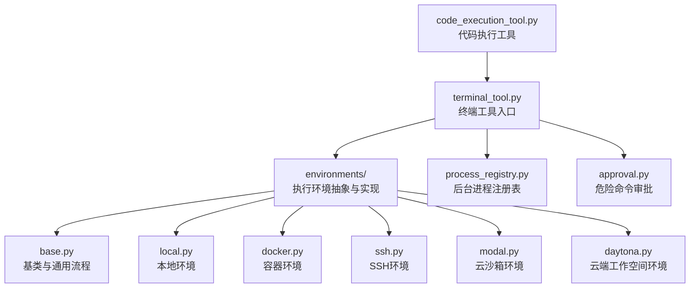
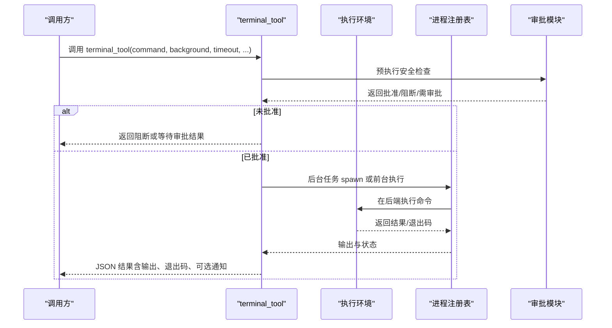
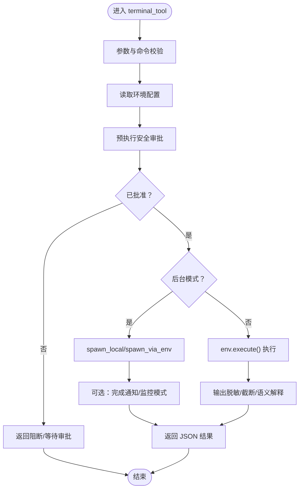
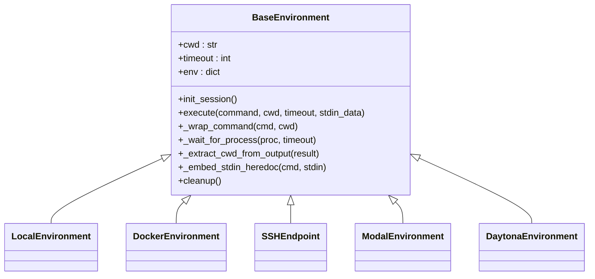
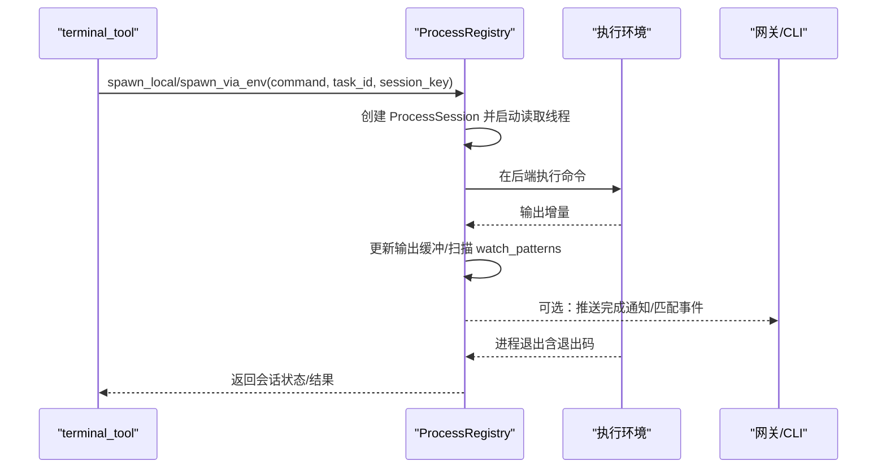
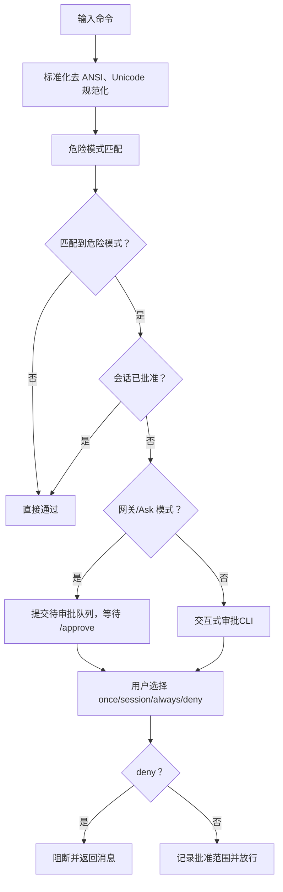
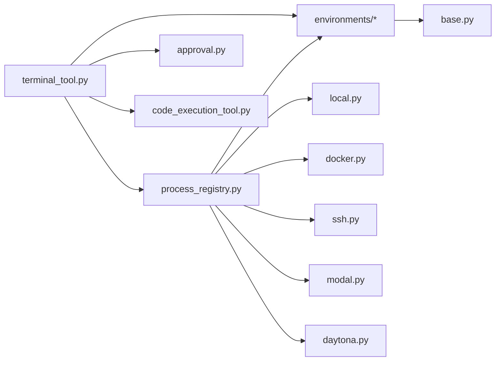

# 终端工具系统

<cite>
**本文档引用的文件**
- [tools/terminal_tool.py](file://tools/terminal_tool.py)
- [tools/environments/base.py](file://tools/environments/base.py)
- [tools/environments/local.py](file://tools/environments/local.py)
- [tools/environments/docker.py](file://tools/environments/docker.py)
- [tools/environments/ssh.py](file://tools/environments/ssh.py)
- [tools/environments/modal.py](file://tools/environments/modal.py)
- [tools/environments/daytona.py](file://tools/environments/daytona.py)
- [tools/process_registry.py](file://tools/process_registry.py)
- [tools/approval.py](file://tools/approval.py)
- [tools/code_execution_tool.py](file://tools/code_execution_tool.py)
- [tests/tools/test_daytona_environment.py](file://tests/tools/test_daytona_environment.py)
- [tests/integration/test_modal_terminal.py](file://tests/integration/test_modal_terminal.py)
- [tests/tools/test_process_registry.py](file://tests/tools/test_process_registry.py)
- [tests/tools/test_windows_compat.py](file://tests/tools/test_windows_compat.py)
- [website/docs/user-guide/security.md](file://website/docs/user-guide/security.md)
- [hermes_cli/setup.py](file://hermes_cli/setup.py)
</cite>

## 目录
1. [简介](#简介)
2. [项目结构](#项目结构)
3. [核心组件](#核心组件)
4. [架构总览](#架构总览)
5. [详细组件分析](#详细组件分析)
6. [依赖关系分析](#依赖关系分析)
7. [性能考虑](#性能考虑)
8. [故障排除指南](#故障排除指南)
9. [结论](#结论)
10. [附录](#附录)

## 简介
本文件为 Hermes Agent 终端工具系统的综合技术文档，面向开发者与运维人员，系统性阐述终端工具的架构设计、命令执行管道、安全沙箱机制与权限控制、参数验证与输出捕获、错误处理流程、进程管理与资源清理策略，并提供性能优化建议与安全最佳实践。终端工具支持本地、Docker、Singularity、Modal、Daytona、SSH 多种执行后端，具备危险命令审批、超时控制、资源配额、持久化工作区、后台任务跟踪与通知等能力。

## 项目结构
终端工具系统主要由以下模块构成：
- 核心入口与编排：tools/terminal_tool.py
- 执行环境抽象与实现：tools/environments/*（base、local、docker、ssh、modal、daytona）
- 后台进程注册与监控：tools/process_registry.py
- 危险命令审批与智能审核：tools/approval.py
- 代码执行工具桥接：tools/code_execution_tool.py
- 测试与基准：tests/tools/*、tests/integration/*

图表来源
- [tools/terminal_tool.py:1106-1535](file://tools/terminal_tool.py#L1106-L1535)
- [tools/environments/base.py:252-600](file://tools/environments/base.py#L252-L600)
- [tools/process_registry.py:106-200](file://tools/process_registry.py#L106-L200)
- [tools/approval.py:694-800](file://tools/approval.py#L694-L800)
- [tools/code_execution_tool.py:431-462](file://tools/code_execution_tool.py#L431-L462)

章节来源
- [tools/terminal_tool.py:1-1757](file://tools/terminal_tool.py#L1-L1757)
- [tools/environments/base.py:1-600](file://tools/environments/base.py#L1-L600)

## 核心组件
- 终端工具入口（terminal_tool）：负责环境选择、参数校验、安全审批、超时与重试、输出截断与脱敏、结果封装与返回。
- 执行环境抽象（BaseEnvironment）：统一命令包装、会话快照、CWD 跟踪、进程等待与中断、stdin heredoc 嵌入等。
- 后台进程注册表（ProcessRegistry）：管理后台任务生命周期、输出缓冲、轮询与通知、崩溃恢复、速率限制与过载保护。
- 危险命令审批（Approval）：模式匹配检测、会话状态管理、网关异步审批、智能审核（LLM 辅助）、永久允许列表。
- 代码执行工具（Code Execution Tool）：在终端环境中执行 Python 代码，支持远程/本地后端分发、超时与调用次数限制。

章节来源
- [tools/terminal_tool.py:1106-1535](file://tools/terminal_tool.py#L1106-L1535)
- [tools/environments/base.py:252-600](file://tools/environments/base.py#L252-L600)
- [tools/process_registry.py:106-200](file://tools/process_registry.py#L106-L200)
- [tools/approval.py:694-800](file://tools/approval.py#L694-L800)
- [tools/code_execution_tool.py:910-944](file://tools/code_execution_tool.py#L910-L944)

## 架构总览
终端工具采用“统一入口 + 多后端适配 + 注册表管理”的分层架构：
- 入口层：terminal_tool 提供统一 API，解析环境配置、任务隔离、安全审批、超时与重试。
- 环境层：BaseEnvironment 定义统一接口，各后端实现具体执行细节（本地、容器、云沙箱、SSH、工作空间）。
- 进程层：ProcessRegistry 统一管理后台任务，屏蔽后端差异，提供轮询、通知、崩溃恢复。
- 审批层：Approval 模块集中处理危险命令检测与审批决策，支持智能审核与永久允许列表。

图表来源
- [tools/terminal_tool.py:1106-1535](file://tools/terminal_tool.py#L1106-L1535)
- [tools/process_registry.py:106-200](file://tools/process_registry.py#L106-L200)
- [tools/approval.py:694-800](file://tools/approval.py#L694-L800)

## 详细组件分析

### 终端工具入口（terminal_tool）
- 环境配置与选择：通过环境变量 TERMINAL_ENV 选择后端；支持默认镜像、工作目录、超时、生命周期、容器资源、持久化等配置。
- 参数验证：对命令类型、工作目录路径进行严格校验，防止注入与非法路径。
- 安全审批：集成危险命令检测与网关审批流程，支持智能审核与永久允许列表。
- 执行模式：前台即时返回（短命令），后台任务跟踪（长任务/守护进程），支持 PTY 模式与 stdin 注入。
- 超时与重试：前台命令带指数退避重试；超时统一返回 124 退出码；后台任务通过注册表轮询。
- 输出处理：ANSI 脱敏、敏感信息脱敏、输出截断（头尾保留）、非错误退出码语义解释。
- 资源清理：后台清理线程按生命周期回收闲置环境；手动清理与 atexit 收尾。

图表来源
- [tools/terminal_tool.py:1106-1535](file://tools/terminal_tool.py#L1106-L1535)

章节来源
- [tools/terminal_tool.py:1106-1535](file://tools/terminal_tool.py#L1106-L1535)

### 执行环境抽象（BaseEnvironment）
- 会话快照：初始化时捕获登录 shell 环境（变量、函数、别名、选项），后续命令复用以保持一致性。
- 命令包装：统一将命令包裹为“源会话快照 → 切换工作目录 → 执行 → 重新导出快照 → 写入 CWD 标记”的脚本。
- 进程等待：轮询进程状态，支持中断（SIGINT）与超时（返回 124），周期性触发活动回调。
- stdin 处理：支持 heredoc 嵌入（SDK 后端）与异步写入（避免管道死锁）。
- CWD 管理：本地通过文件读取，远端通过 stdout 标记提取，确保跨调用工作目录一致。

图表来源
- [tools/environments/base.py:252-600](file://tools/environments/base.py#L252-L600)
- [tools/environments/local.py:216-246](file://tools/environments/local.py#L216-L246)
- [tools/environments/docker.py:235-245](file://tools/environments/docker.py#L235-L245)

章节来源
- [tools/environments/base.py:252-600](file://tools/environments/base.py#L252-L600)

### 后台进程注册表（ProcessRegistry）
- 生命周期管理：spawn_local/spawn_via_env 创建会话，记录命令、任务键、会话键、PID、输出缓冲。
- 输出缓冲：滚动窗口（默认 200KB）保存最新输出，支持清理 shell 启动噪声。
- 轮询与通知：定期轮询进程状态，支持 watch_patterns 匹配触发通知；完成时可自动通知代理。
- 崩溃恢复：checkpoint 文件（gateway 场景）持久化会话状态，重启后可恢复。
- 速率限制与过载保护：watch 模式匹配按时间窗口限流，持续过载将禁用 watch 以防干扰。

图表来源
- [tools/process_registry.py:106-200](file://tools/process_registry.py#L106-L200)
- [tests/tools/test_process_registry.py:371-407](file://tests/tools/test_process_registry.py#L371-L407)

章节来源
- [tools/process_registry.py:106-200](file://tools/process_registry.py#L106-L200)

### 危险命令审批（Approval）
- 检测规则：内置大量危险模式（删除、权限修改、系统服务、fork bomb、远程管道执行、覆盖敏感路径等）。
- 会话状态：基于 session_key 的线程安全状态机，支持一次性、会话级、永久允许。
- 网关审批：在网关模式下阻塞等待 /approve 或 /deny，同步 CLI 行为。
- 智能审核：通过辅助 LLM 对复杂命令进行风险评估，降低误报与漏报。
- 永久允许列表：支持从配置加载与保存，兼容历史键别名。

图表来源
- [tools/approval.py:694-800](file://tools/approval.py#L694-L800)

章节来源
- [tools/approval.py:694-800](file://tools/approval.py#L694-L800)

### 代码执行工具（Code Execution Tool）
- 后端分发：根据终端配置选择本地（UDS）或远程（文件 RPC）路径。
- 配置与限制：超时、最大工具调用次数、可用工具集合（与沙箱允许工具交集）。
- 错误处理：空代码、平台不支持（Windows）等情况的明确返回。

章节来源
- [tools/code_execution_tool.py:910-944](file://tools/code_execution_tool.py#L910-L944)

### 环境隔离与持久化
- 本地：直接在宿主机执行，适合开发与受信任环境。
- 容器（Docker/Singularity）：硬核安全边界，资源限制与持久化绑定卷；支持 overlay2 + pquota 的磁盘配额探测。
- 云沙箱（Modal/Daytona）：隔离且可扩展，支持持久文件系统与跨回合存活。
- SSH：在远端机器执行，适合独立服务器场景。

章节来源
- [tools/environments/docker.py:511-541](file://tools/environments/docker.py#L511-L541)
- [website/docs/user-guide/security.md:313-340](file://website/docs/user-guide/security.md#L313-L340)

## 依赖关系分析
- 组件耦合：
  - terminal_tool 依赖 environments/*、process_registry、approval、interrupt、ansi_strip、redact。
  - environments/base.py 为所有后端提供统一接口，Local/Docker/SSH/Modal/Daytona 实现差异化。
  - process_registry 与 environments 解耦，通过 env.execute 接口驱动。
- 外部依赖：
  - Docker/Singularity/Modal/Daytona SDK（按需导入）。
  - 网关平台（HERMES_GATEWAY_SESSION）用于审批与通知路由。
- 循环依赖：
  - 未发现循环导入；各模块职责清晰，通过接口解耦。

图表来源
- [tools/terminal_tool.py:502-510](file://tools/terminal_tool.py#L502-L510)
- [tools/environments/base.py:1-600](file://tools/environments/base.py#L1-L600)
- [tools/process_registry.py:106-200](file://tools/process_registry.py#L106-L200)

章节来源
- [tools/terminal_tool.py:502-510](file://tools/terminal_tool.py#L502-L510)
- [tools/environments/base.py:1-600](file://tools/environments/base.py#L1-L600)

## 性能考虑
- 启动开销：
  - 本地：无额外网络/SDK 开销，延迟最低。
  - 容器/云沙箱：冷启动需要拉取镜像/创建实例，可通过持久化文件系统与会话快照减少重复初始化成本。
- 并发执行：
  - 后台任务通过注册表统一管理，避免主线程阻塞；前台命令带指数退避重试，降低瞬时失败影响。
- 输出与内存：
  - 后台输出采用滚动缓冲（默认 200KB），避免内存膨胀；前台输出截断（头 40% + 尾 60%）兼顾可观测性。
- 资源配额：
  - 容器后端支持 CPU/内存/磁盘配额；Modal/Daytona 通过 SDK 参数传递；Singularity 使用 scratch 目录与缓存管理。
- 清理策略：
  - 后台清理线程按生命周期回收闲置环境；手动清理与 atexit 收尾，避免资源泄漏。

章节来源
- [tools/process_registry.py:56-64](file://tools/process_registry.py#L56-L64)
- [tools/terminal_tool.py:819-890](file://tools/terminal_tool.py#L819-L890)
- [hermes_cli/setup.py:573-612](file://hermes_cli/setup.py#L573-L612)

## 故障排除指南
- 常见问题与定位：
  - 超时：前台命令超时统一返回 124；后台任务通过轮询与通知确认完成。
  - 输出异常：二进制输出会被替换为提示；ANSI/敏感信息被脱敏；必要时调整输出截断阈值。
  - 权限与 sudo：在交互模式下可缓存密码；消息网关中 sudo 失败会附加提示信息。
  - Windows 兼容：进程管理使用平台守卫，避免无条件调用 os.setsid/os.killpg。
- 回收与清理：
  - 使用 cleanup_all_environments()/cleanup_vm(task_id) 主动清理；清理线程按生命周期回收。
- 测试验证：
  - Daytona 环境重启与超时行为测试；Modal 环境隔离测试；后台任务路径带空格转义测试；Windows 进程管理平台守卫测试。

章节来源
- [tools/terminal_tool.py:1440-1535](file://tools/terminal_tool.py#L1440-L1535)
- [tests/tools/test_daytona_environment.py:221-319](file://tests/tools/test_daytona_environment.py#L221-L319)
- [tests/integration/test_modal_terminal.py:208-237](file://tests/integration/test_modal_terminal.py#L208-L237)
- [tests/tools/test_process_registry.py:371-407](file://tests/tools/test_process_registry.py#L371-L407)
- [tests/tools/test_windows_compat.py:1-64](file://tests/tools/test_windows_compat.py#L1-L64)

## 结论
终端工具系统通过“统一入口 + 多后端适配 + 注册表管理 + 审批与安全”的设计，在保证易用性的同时实现了强隔离、强可控与高可靠性。其特性覆盖了从开发到生产的多种场景，既满足本地快速迭代，也支持生产级网关部署与云沙箱扩展。建议在生产环境优先使用容器/云沙箱后端，并结合危险命令审批与智能审核机制，最大化安全性与稳定性。

## 附录

### 环境变量与配置要点
- TERMINAL_ENV：选择后端（local/docker/singularity/modal/daytona/ssh）
- TERMINAL_TIMEOUT/LIFETIME_SECONDS：命令超时与环境生命周期
- TERMINAL_CWD/TERMINAL_DOCKER_MOUNT_CWD_TO_WORKSPACE：工作目录与容器挂载策略
- TERMINAL_CONTAINER_CPU/MEMORY/DISK/PERSISTENT：容器资源与持久化
- SUDO_PASSWORD/HERMES_INTERACTIVE：sudo 密码与交互提示
- HERMES_GATEWAY_SESSION/HERMES_EXEC_ASK：网关审批与 Ask 模式

章节来源
- [tools/terminal_tool.py:598-674](file://tools/terminal_tool.py#L598-L674)
- [hermes_cli/setup.py:573-612](file://hermes_cli/setup.py#L573-L612)