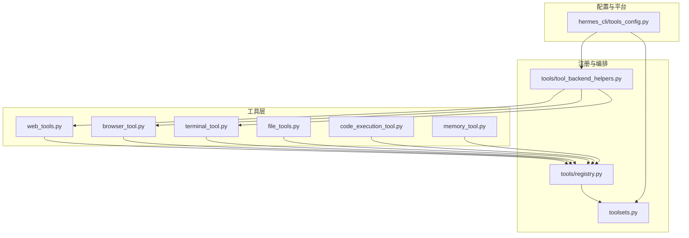
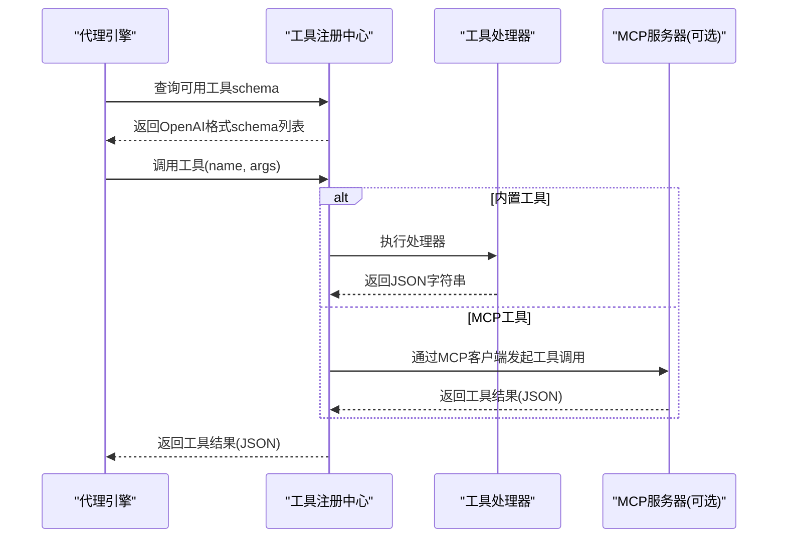
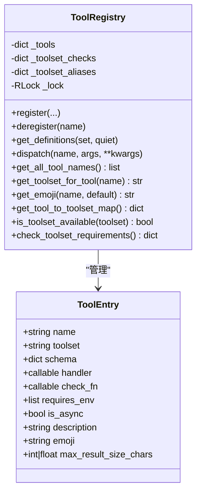
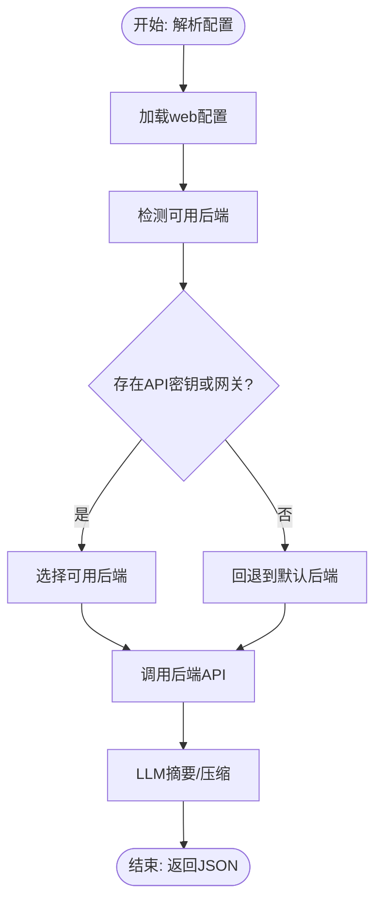
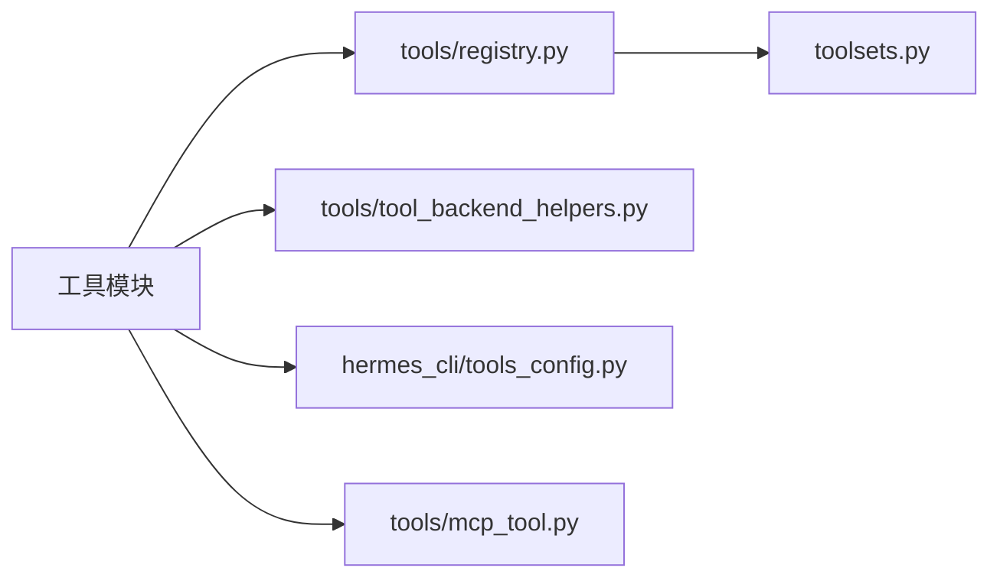

# 自定义工具开发

<cite>
**本文档引用的文件**
- [tools/__init__.py](file://tools/__init__.py)
- [tools/registry.py](file://tools/registry.py)
- [tools/tool_backend_helpers.py](file://tools/tool_backend_helpers.py)
- [tools/mcp_tool.py](file://tools/mcp_tool.py)
- [hermes_cli/tools_config.py](file://hermes_cli/tools_config.py)
- [tools/web_tools.py](file://tools/web_tools.py)
- [tools/browser_tool.py](file://tools/browser_tool.py)
- [tools/terminal_tool.py](file://tools/terminal_tool.py)
- [tools/file_tools.py](file://tools/file_tools.py)
- [toolsets.py](file://toolsets.py)
- [tools/code_execution_tool.py](file://tools/code_execution_tool.py)
- [tools/memory_tool.py](file://tools/memory_tool.py)
- [website/docs/developer-guide/adding-tools.md](file://website/docs/developer-guide/adding-tools.md)
- [tests/tools/test_registry.py](file://tests/tools/test_registry.py)
- [tests/tools/test_mcp_dynamic_discovery.py](file://tests/tools/test_mcp_dynamic_discovery.py)
</cite>

## 目录
1. [简介](#简介)
2. [项目结构](#项目结构)
3. [核心组件](#核心组件)
4. [架构总览](#架构总览)
5. [详细组件分析](#详细组件分析)
6. [依赖分析](#依赖分析)
7. [性能考虑](#性能考虑)
8. [故障排查指南](#故障排查指南)
9. [结论](#结论)
10. [附录](#附录)

## 简介
本指南面向希望在 Hermes Agent 中开发自定义工具的开发者，系统讲解工具开发标准流程、模板使用、注册接口、参数校验与返回值规范、安全设计、错误处理与日志记录、测试与调试、性能优化、打包与分发、版本管理以及与代理引擎的集成与通信协议。文档基于仓库现有实现进行提炼，确保内容可操作且与实际代码一致。

## 项目结构
Hermes 的工具体系由“工具模块 + 注册中心 + 工具集编排 + 配置与平台适配”四部分构成：
- 工具模块：每个工具以独立模块存在，遵循统一的注册与返回值约定
- 注册中心：集中收集工具的 schema、处理器、可用性检查与元数据
- 工具集：对工具进行组合与别名映射，支持按平台/场景选择启用
- 配置与平台：通过 CLI 统一配置工具集、提供商与后端参数

**图表来源**
- [tools/web_tools.py:1-200](file://tools/web_tools.py#L1-L200)
- [tools/browser_tool.py:1-200](file://tools/browser_tool.py#L1-L200)
- [tools/terminal_tool.py:1-200](file://tools/terminal_tool.py#L1-L200)
- [tools/file_tools.py:1-200](file://tools/file_tools.py#L1-L200)
- [tools/code_execution_tool.py:1-200](file://tools/code_execution_tool.py#L1-L200)
- [tools/memory_tool.py:1-200](file://tools/memory_tool.py#L1-L200)
- [tools/registry.py:1-483](file://tools/registry.py#L1-L483)
- [toolsets.py:1-703](file://toolsets.py#L1-L703)
- [tools/tool_backend_helpers.py:1-122](file://tools/tool_backend_helpers.py#L1-L122)
- [hermes_cli/tools_config.py:1-800](file://hermes_cli/tools_config.py#L1-L800)

**章节来源**
- [tools/__init__.py:1-26](file://tools/__init__.py#L1-L26)
- [tools/registry.py:1-483](file://tools/registry.py#L1-L483)
- [toolsets.py:1-703](file://toolsets.py#L1-L703)
- [hermes_cli/tools_config.py:1-800](file://hermes_cli/tools_config.py#L1-L800)

## 核心组件
- 工具注册中心（ToolRegistry）：负责工具注册、可用性检查、动态刷新、调度与返回值封装
- 工具集（toolsets）：对工具进行分组、组合与别名映射，支持跨平台场景
- 工具后端辅助（tool_backend_helpers）：提供浏览器云厂商、Modal 后端、网关偏好等通用逻辑
- 平台工具配置（hermes_cli/tools_config）：提供工具集清单、提供商选择、环境变量提示与令牌估算
- 典型工具实现：web、browser、terminal、file、code_execution、memory 等

**章节来源**
- [tools/registry.py:100-437](file://tools/registry.py#L100-L437)
- [toolsets.py:66-397](file://toolsets.py#L66-L397)
- [tools/tool_backend_helpers.py:1-122](file://tools/tool_backend_helpers.py#L1-L122)
- [hermes_cli/tools_config.py:1-800](file://hermes_cli/tools_config.py#L1-L800)

## 架构总览
Hermes 的工具调用链路如下：
- 工具模块在导入时通过注册中心完成注册
- 代理引擎根据当前会话启用的工具集生成 OpenAI 格式 schema 列表
- 当模型决定调用某个工具时，引擎通过注册中心调度对应处理器
- 处理器执行业务逻辑并返回 JSON 字符串
- 注册中心统一捕获异常并格式化错误响应

**图表来源**
- [tools/registry.py:292-310](file://tools/registry.py#L292-L310)
- [tools/mcp_tool.py:774-800](file://tools/mcp_tool.py#L774-L800)

**章节来源**
- [tools/registry.py:258-324](file://tools/registry.py#L258-L324)
- [tools/mcp_tool.py:1-800](file://tools/mcp_tool.py#L1-L800)

## 详细组件分析

### 工具注册中心（ToolRegistry）
- 注册接口：register(name, toolset, schema, handler, check_fn, requires_env, is_async, description, emoji, max_result_size_chars)
- 可用性检查：支持 per-toolset check_fn，线程安全快照读取，避免并发冲突
- 动态刷新：支持 MCP 工具发现与注销，自动清理别名与检查函数
- 调度与错误处理：统一捕获异常并返回 JSON 错误；支持异步处理器桥接
- 返回值封装：提供 tool_error/tool_result 辅助函数，减少重复序列化

**图表来源**
- [tools/registry.py:76-252](file://tools/registry.py#L76-L252)

**章节来源**
- [tools/registry.py:176-252](file://tools/registry.py#L176-L252)
- [tests/tools/test_registry.py:91-267](file://tests/tools/test_registry.py#L91-L267)
- [tests/tools/test_mcp_dynamic_discovery.py:130-160](file://tests/tools/test_mcp_dynamic_discovery.py#L130-L160)

### 工具模板与开发流程
- 模板要点：提供 check_fn、handler、schema 三要素；必要时声明 requires_env
- 注册步骤：在模块末尾调用 registry.register 完成注册
- 返回值规范：必须返回 JSON 字符串；推荐使用 tool_error/tool_result
- 参数校验：在 handler 内部进行参数类型与范围校验，必要时抛出异常由注册中心统一捕获

参考官方模板示例路径：
- [website/docs/developer-guide/adding-tools.md:24-98](file://website/docs/developer-guide/adding-tools.md#L24-L98)

**章节来源**
- [website/docs/developer-guide/adding-tools.md:24-98](file://website/docs/developer-guide/adding-tools.md#L24-L98)

### Web 工具（web_tools）
- 支持多后端：Exa、Firecrawl、Parallel、Tavily
- 后端选择：优先从配置读取，其次根据环境变量回退
- 网关支持：支持 Nous 订阅用户的托管工具网关
- 安全与合规：URL 安全检查、网站访问策略、调试模式与日志

**图表来源**
- [tools/web_tools.py:75-121](file://tools/web_tools.py#L75-L121)

**章节来源**
- [tools/web_tools.py:1-200](file://tools/web_tools.py#L1-L200)

### 浏览器自动化工具（browser_tool）
- 多后端：本地 Chromium、Browserbase、Browser Use、Firecrawl、Camofox
- 会话隔离：按 task_id 管理会话生命周期
- 安全控制：URL 安全检查、命令超时、会话清理
- 云端与本地协同：通过配置与环境变量自动选择执行后端

**章节来源**
- [tools/browser_tool.py:1-200](file://tools/browser_tool.py#L1-L200)

### 终端工具（terminal_tool）
- 多后端：local、docker、modal（直连/托管网关）
- 安全与审计：危险命令审批、sudo 密码回调、磁盘用量告警
- 资源限制：前台执行最大超时、后台任务支持
- 环境管理：容器/VM 生命周期、空闲清理、工作目录校验

**章节来源**
- [tools/terminal_tool.py:1-200](file://tools/terminal_tool.py#L1-L200)

### 文件工具（file_tools）
- 读写保护：设备路径黑名单、敏感路径拒绝、权限异常分类
- 读取上限：可配置的最大字符数，避免上下文膨胀
- 去重与缓存：同一任务内重复读取去重，变更检测

**章节来源**
- [tools/file_tools.py:1-200](file://tools/file_tools.py#L1-L200)

### 代码执行工具（code_execution_tool）
- 两种传输：本地 UDS、远程文件轮询
- 工具白名单：仅允许有限工具进入沙箱，降低风险
- 输出截断：限制 stdout/stderr 长度，避免泄露中间结果

**章节来源**
- [tools/code_execution_tool.py:1-200](file://tools/code_execution_tool.py#L1-L200)

### 内存工具（memory_tool）
- 双存储：个人记忆 MEMORY.md 与用户画像 USER.md
- 冻结快照：系统提示注入冻结，工具响应实时更新
- 安全扫描：内存内容注入前的安全扫描与威胁模式匹配

**章节来源**
- [tools/memory_tool.py:1-200](file://tools/memory_tool.py#L1-L200)

### 工具集与平台配置（toolsets + hermes_cli/tools_config）
- 工具集：内置常用场景组合（如 hermes-cli、hermes-telegram 等），支持组合与别名
- 平台配置：提供工具集清单、提供商选择、API Key 输入、令牌估算与后置安装脚本

**章节来源**
- [toolsets.py:66-397](file://toolsets.py#L66-L397)
- [hermes_cli/tools_config.py:1-800](file://hermes_cli/tools_config.py#L1-L800)

## 依赖分析
- 工具模块对注册中心的依赖是单向的：导入即注册，不反向依赖引擎
- 注册中心对工具模块采用延迟导入策略，避免循环依赖
- MCP 工具通过可选依赖 mcp 包接入，未安装时模块为无操作状态
- 工具后端辅助模块被多个工具共享，提供跨工具的通用逻辑

**图表来源**
- [tools/registry.py:1-483](file://tools/registry.py#L1-L483)
- [toolsets.py:1-703](file://toolsets.py#L1-L703)
- [tools/tool_backend_helpers.py:1-122](file://tools/tool_backend_helpers.py#L1-L122)
- [hermes_cli/tools_config.py:1-800](file://hermes_cli/tools_config.py#L1-L800)
- [tools/mcp_tool.py:1-800](file://tools/mcp_tool.py#L1-L800)

**章节来源**
- [tools/registry.py:1-483](file://tools/registry.py#L1-L483)

## 性能考虑
- 令牌估算：通过工具 schema 的 JSON 序列长度估算上下文开销，避免过度启用工具集
- 结果大小限制：每工具可设置 max_result_size_chars，默认来自预算配置
- 异步处理：注册中心对异步处理器提供桥接，避免阻塞
- 缓存与去重：文件读取去重、工具令牌缓存、会话级快照
- 超时与资源：终端命令超时、MCP 连接/工具调用超时、磁盘用量告警

**章节来源**
- [hermes_cli/tools_config.py:699-738](file://hermes_cli/tools_config.py#L699-L738)
- [tools/registry.py:315-323](file://tools/registry.py#L315-L323)
- [tools/terminal_tool.py:75-108](file://tools/terminal_tool.py#L75-L108)

## 故障排查指南
- 工具不可用：检查 check_fn 是否返回 True；查看工具集可用性检查结果
- 返回错误：统一格式为 JSON 字符串，包含 error 字段；注册中心会捕获异常并格式化
- MCP 连接问题：查看连接错误信息与可执行文件缺失提示；确认环境变量与 PATH
- 安全拦截：浏览器 URL、文件路径、内存内容均有限制与扫描，遇到拦截需调整输入
- 日志定位：开启调试模式（如 WEB_TOOLS_DEBUG），查看工具调用与压缩指标

**章节来源**
- [tools/registry.py:292-310](file://tools/registry.py#L292-L310)
- [tools/mcp_tool.py:324-382](file://tools/mcp_tool.py#L324-L382)
- [tools/browser_tool.py:71-80](file://tools/browser_tool.py#L71-L80)
- [tools/file_tools.py:74-90](file://tools/file_tools.py#L74-L90)
- [tools/web_tools.py:25-28](file://tools/web_tools.py#L25-L28)

## 结论
Hermes 的工具体系以注册中心为核心，结合工具集编排与平台配置，提供了标准化、可扩展、安全可控的工具开发框架。开发者只需遵循统一的注册与返回值规范，即可快速将新能力接入代理引擎，并通过 MCP 机制扩展外部工具生态。

## 附录

### 开发最佳实践清单
- 使用统一模板：check_fn + handler + schema + requires_env
- 返回值必须为 JSON 字符串；优先使用 tool_error/tool_result
- 在 handler 内进行参数校验与边界检查
- 为工具设置合理的 max_result_size_chars
- 对外部依赖与网络调用设置超时与重试
- 严格遵循安全扫描与路径/URL 白名单
- 提供清晰的描述与 emoji，便于 UI 展示
- 通过 hermes_cli/tools_config 提供提供商选择与环境变量提示

### 测试与调试建议
- 单元测试：覆盖注册、可用性检查、调度与错误路径
- 集成测试：MCP 动态发现与注销、工具集解析
- 调试技巧：开启工具调试日志、使用最小化参数复现问题
- 性能测试：评估工具调用耗时、结果大小与上下文影响

**章节来源**
- [tests/tools/test_registry.py:91-267](file://tests/tools/test_registry.py#L91-L267)
- [tests/tools/test_mcp_dynamic_discovery.py:130-160](file://tests/tools/test_mcp_dynamic_discovery.py#L130-L160)