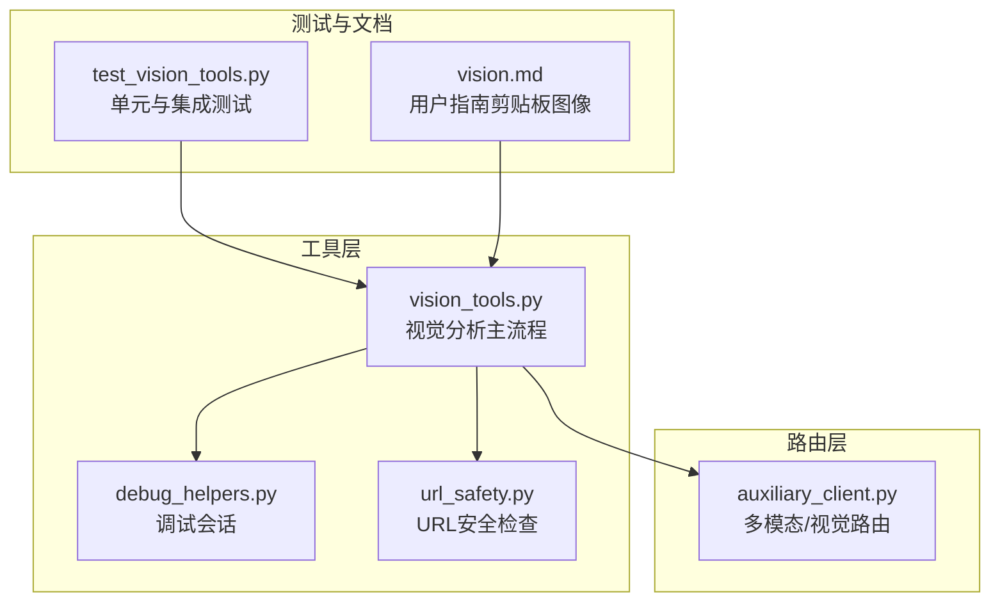
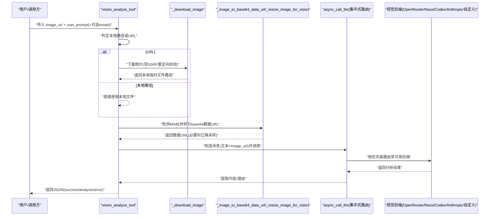
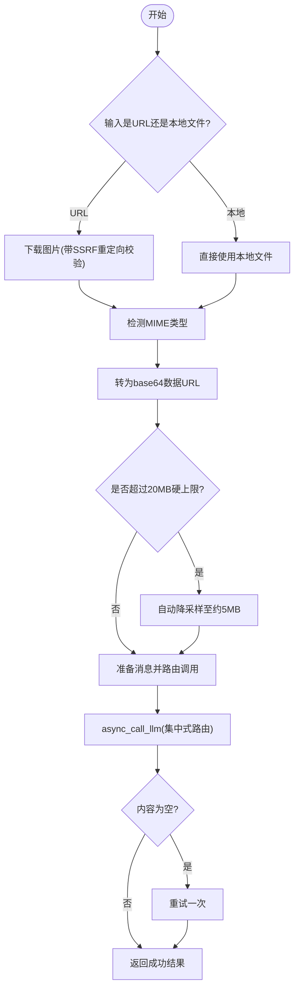
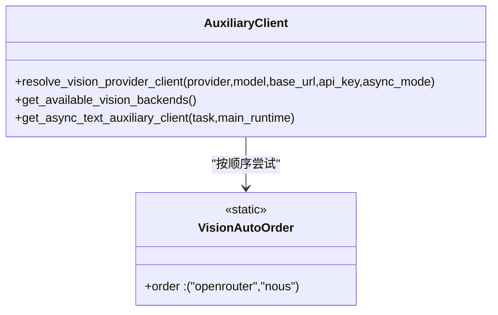
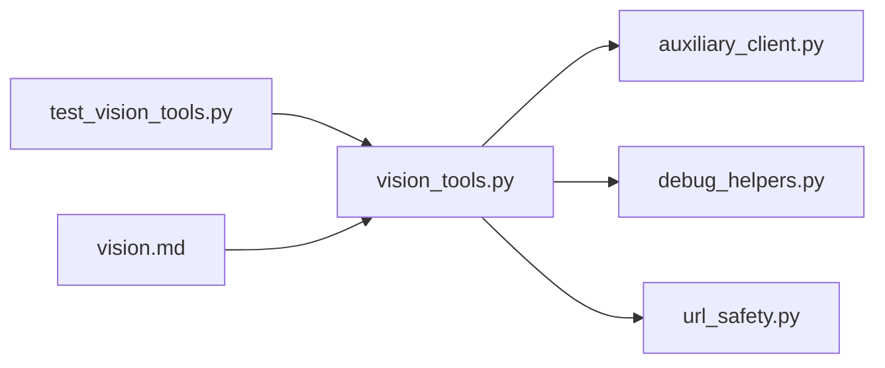

# 视觉分析工具

<cite>
**本文引用的文件**
- [tools/vision_tools.py](file://tools/vision_tools.py)
- [agent/auxiliary_client.py](file://agent/auxiliary_client.py)
- [tools/debug_helpers.py](file://tools/debug_helpers.py)
- [tools/url_safety.py](file://tools/url_safety.py)
- [tests/tools/test_vision_tools.py](file://tests/tools/test_vision_tools.py)
- [website/docs/user-guide/features/vision.md](file://website/docs/user-guide/features/vision.md)
</cite>

## 目录
1. [简介](#简介)
2. [项目结构](#项目结构)
3. [核心组件](#核心组件)
4. [架构总览](#架构总览)
5. [详细组件分析](#详细组件分析)
6. [依赖关系分析](#依赖关系分析)
7. [性能考量](#性能考量)
8. [故障排查指南](#故障排查指南)
9. [结论](#结论)
10. [附录](#附录)

## 简介
本文件面向Hermes Agent视觉分析工具，系统性阐述其图像处理架构、多模态输入处理与视觉推理机制；详解视觉工具的参数配置、分辨率处理与质量优化策略；覆盖图像识别、OCR识别与视觉内容分析的实现细节；并给出性能优化、内存管理与并发处理机制，以及错误处理、结果验证与输出格式标准化的实践建议。本文同时提供使用指南与最佳实践，帮助用户在不同平台与场景下稳定高效地使用视觉分析能力。

## 项目结构
视觉分析工具位于tools子模块中，围绕以下关键文件展开：
- 视觉主流程：tools/vision_tools.py
- 多模态路由与调用：agent/auxiliary_client.py
- 调试日志：tools/debug_helpers.py
- 安全检查（SSRF防护）：tools/url_safety.py
- 测试用例：tests/tools/test_vision_tools.py
- 用户指南（剪贴板图像粘贴）：website/docs/user-guide/features/vision.md

**图表来源**
- [tools/vision_tools.py:1-790](file://tools/vision_tools.py#L1-L790)
- [agent/auxiliary_client.py:1700-1899](file://agent/auxiliary_client.py#L1700-L1899)
- [tools/debug_helpers.py:1-106](file://tools/debug_helpers.py#L1-L106)
- [tools/url_safety.py:1-98](file://tools/url_safety.py#L1-L98)
- [tests/tools/test_vision_tools.py:1-861](file://tests/tools/test_vision_tools.py#L1-L861)
- [website/docs/user-guide/features/vision.md:1-188](file://website/docs/user-guide/features/vision.md#L1-L188)

**章节来源**
- [tools/vision_tools.py:1-790](file://tools/vision_tools.py#L1-L790)
- [agent/auxiliary_client.py:1700-1899](file://agent/auxiliary_client.py#L1700-L1899)
- [tools/debug_helpers.py:1-106](file://tools/debug_helpers.py#L1-L106)
- [tools/url_safety.py:1-98](file://tools/url_safety.py#L1-L98)
- [tests/tools/test_vision_tools.py:1-861](file://tests/tools/test_vision_tools.py#L1-L861)
- [website/docs/user-guide/features/vision.md:1-188](file://website/docs/user-guide/features/vision.md#L1-L188)

## 核心组件
- 视觉分析主流程（vision_analyze_tool）
  - 支持本地路径与远程URL两种输入源；对URL进行下载、临时文件清理；对本地文件直接使用并避免删除。
  - 基于MIME类型检测与自动格式推断，将图像转换为base64数据URL。
  - 预检与硬限制（20MB）、自动降采样（目标约5MB）以适配API限制。
  - 通过集中式路由调用多模态后端（OpenRouter、Nous、Codex、Anthropic、自定义端点等）。
  - 对空内容进行一次重试，并对常见错误进行可读化提示。
- 多模态/视觉路由（auxiliary_client）
  - 统一解析任务（vision）的提供商与模型，按优先级自动选择可用后端。
  - 提供严格模式与自动模式，支持主提供商优先、已知可用聚合器回退。
- 调试与日志（debug_helpers）
  - 通过环境变量启用调试会话，记录每次调用的参数、耗时、结果长度等，保存为JSON文件。
- 安全防护（url_safety）
  - SSRF防护：阻断私有/环回/保留地址与特定内部主机名，DNS失败即阻断。
  - 下载阶段对重定向目标再次校验，防止基于重定向的绕过。

**章节来源**
- [tools/vision_tools.py:405-679](file://tools/vision_tools.py#L405-L679)
- [agent/auxiliary_client.py:1722-1866](file://agent/auxiliary_client.py#L1722-L1866)
- [tools/debug_helpers.py:36-106](file://tools/debug_helpers.py#L36-L106)
- [tools/url_safety.py:51-98](file://tools/url_safety.py#L51-L98)

## 架构总览
视觉分析从“输入源”到“多模态后端”的整体链路如下：

**图表来源**
- [tools/vision_tools.py:405-679](file://tools/vision_tools.py#L405-L679)
- [agent/auxiliary_client.py:1776-1866](file://agent/auxiliary_client.py#L1776-L1866)

## 详细组件分析

### 视觉分析主流程（vision_analyze_tool）
- 输入与预处理
  - 支持HTTP/HTTPS URL与本地文件路径（含file://与~展开），对非图像文件拒绝进入LLM调用。
  - 下载阶段启用follow_redirects并拦截重定向，对每个重定向目标再次执行URL安全检查。
  - 限制单次下载最大字节数（50MB），并在Content-Length与实际大小双重校验。
- 编码与尺寸控制
  - 先尝试完整分辨率编码；若超过硬上限（20MB），则自动降采样至目标（约5MB）并重试。
  - 降采样策略：按比例缩小（LANCZOS插值）、JPEG质量阶梯（85→70→50）、PNG仅尺寸压缩。
  - 若Pillow不可用，则回退为原图编码并由上层抛出超限错误。
- 多模态调用
  - 通过集中式路由async_call_llm发起请求，设置温度、最大token、超时等参数。
  - 对“过大/无效请求”等特定错误进行二次降采样重试；对空内容再试一次。
- 错误分类与提示
  - 针对计费不足、模型不支持视觉、非法请求等错误，生成可读化提示，便于用户自助修复。
- 清理与调试
  - 仅清理临时下载文件，不删除本地缓存文件。
  - 可选调试会话记录调用详情，保存为JSON文件。

**图表来源**
- [tools/vision_tools.py:405-679](file://tools/vision_tools.py#L405-L679)

**章节来源**
- [tools/vision_tools.py:75-126](file://tools/vision_tools.py#L75-L126)
- [tools/vision_tools.py:128-229](file://tools/vision_tools.py#L128-L229)
- [tools/vision_tools.py:231-278](file://tools/vision_tools.py#L231-L278)
- [tools/vision_tools.py:289-403](file://tools/vision_tools.py#L289-L403)
- [tools/vision_tools.py:405-679](file://tools/vision_tools.py#L405-L679)

### 多模态/视觉路由（auxiliary_client）
- 自动检测顺序
  - 主提供商（若为已知视觉后端）→ OpenRouter → Nous Portal → 停止。
  - 对非标准提供商，优先使用其专用视觉模型映射，否则回退为主模型。
- 严格模式与自定义端点
  - 显式base_url/api_key可强制走自定义端点；未显式时按任务自动解析。
- 返回值
  - 返回最终使用的提供商、异步客户端与模型，供上层调用。

**图表来源**
- [agent/auxiliary_client.py:1722-1866](file://agent/auxiliary_client.py#L1722-L1866)

**章节来源**
- [agent/auxiliary_client.py:1722-1866](file://agent/auxiliary_client.py#L1722-L1866)

### 调试与日志（DebugSession）
- 启用方式：通过环境变量开启，生成唯一会话ID并写入logs目录下的JSON文件。
- 记录内容：时间戳、调用名称、参数摘要、结果长度、是否成功等。
- 适合定位网络问题、编码异常、降采样行为与路由选择。

**章节来源**
- [tools/debug_helpers.py:36-106](file://tools/debug_helpers.py#L36-L106)
- [tools/vision_tools.py:442-453](file://tools/vision_tools.py#L442-L453)

### 安全防护（URL安全检查）
- 拦截私有/环回/保留/组播/未指定地址与CGNAT范围；阻断特定内部主机名。
- DNS失败即阻断；对httpx重定向事件钩子再次校验下一跳URL。
- 与下载流程结合，确保从任意CDN/重定向链路均无法逃逸到内网。

**章节来源**
- [tools/url_safety.py:51-98](file://tools/url_safety.py#L51-L98)
- [tools/vision_tools.py:148-163](file://tools/vision_tools.py#L148-L163)

### OCR与视觉内容分析
- 剪贴板图像粘贴
  - 用户可在CLI中通过多种方式将剪贴板中的图像作为附件发送，工具自动保存为PNG并以base64数据块形式提交给视觉模型。
  - 平台兼容性与依赖差异详见用户指南。
- OCR能力
  - 仓库中包含OCR相关技能与脚本（如marker-pdf、pymupdf），可用于扫描版PDF与图像的高精度文字提取。
  - 视觉分析工具本身聚焦“理解与描述”，OCR提取可作为独立流程配合使用。

**章节来源**
- [website/docs/user-guide/features/vision.md:1-188](file://website/docs/user-guide/features/vision.md#L1-L188)

## 依赖关系分析
- 模块耦合
  - vision_tools.py依赖auxiliary_client进行多模态后端解析与调用，耦合度低、职责清晰。
  - 依赖debug_helpers进行调试日志，url_safety用于安全校验，测试用例覆盖核心路径。
- 外部依赖
  - Pillow（PIL）：用于图像降采样与格式转换；缺失时回退为原图编码。
  - httpx：异步HTTP客户端，支持重定向与事件钩子。
  - OpenAI SDK：通过集中式路由封装调用。

**图表来源**
- [tools/vision_tools.py:1-790](file://tools/vision_tools.py#L1-L790)
- [agent/auxiliary_client.py:1700-1899](file://agent/auxiliary_client.py#L1700-L1899)
- [tools/debug_helpers.py:1-106](file://tools/debug_helpers.py#L1-L106)
- [tools/url_safety.py:1-98](file://tools/url_safety.py#L1-L98)
- [tests/tools/test_vision_tools.py:1-861](file://tests/tools/test_vision_tools.py#L1-L861)
- [website/docs/user-guide/features/vision.md:1-188](file://website/docs/user-guide/features/vision.md#L1-L188)

**章节来源**
- [tools/vision_tools.py:1-790](file://tools/vision_tools.py#L1-L790)
- [agent/auxiliary_client.py:1700-1899](file://agent/auxiliary_client.py#L1700-L1899)
- [tests/tools/test_vision_tools.py:1-861](file://tests/tools/test_vision_tools.py#L1-L861)

## 性能考量
- I/O与网络
  - 下载超时与最大字节限制（默认30秒/50MB）可配置，避免慢连接与大体积文件导致的资源占用。
  - follow_redirects与重定向校验在保证安全的同时增加一次网络往返，建议合理设置超时。
- 编码与传输
  - base64开销约为原始大小的4/3；先估算再决定是否降采样，减少不必要的重试。
  - 20MB硬上限与5MB目标上限平衡了通用性与成功率。
- 降采样策略
  - 比例缩放+LANCZOS插值优先；JPEG质量阶梯与PNG尺寸压缩组合，兼顾体积与质量。
  - 当Pillow不可用时，回退策略明确，但可能触发API拒绝，需提前压缩或安装依赖。
- 并发与线程
  - 辅助客户端与AIAgent在适配器中使用线程池与事件循环桥接，视觉分析主流程为异步函数，避免阻塞主线程。
- 内存管理
  - 临时文件在使用后清理；对超大响应体采用流式写入与一次性读取结合，避免峰值内存过高。

**章节来源**
- [tools/vision_tools.py:48-68](file://tools/vision_tools.py#L48-L68)
- [tools/vision_tools.py:289-403](file://tools/vision_tools.py#L289-L403)
- [agent/auxiliary_client.py:1700-1720](file://agent/auxiliary_client.py#L1700-L1720)

## 故障排查指南
- 常见错误与处理
  - “图片过大”：检查是否超过20MB硬上限；若已降采样仍失败，确认Pillow安装与磁盘空间。
  - “模型不支持视觉”：切换到支持视觉的模型或后端；检查AUXILIARY_VISION_MODEL环境变量。
  - “计费不足/支付问题”：根据提示充值或更换账户；工具会生成可读化提示。
  - “非法请求/图像格式问题”：确认图像可被Pillow打开、MIME类型正确、未被API拒绝。
- 日志与调试
  - 开启VISION_TOOLS_DEBUG后，查看logs目录下的JSON文件，定位失败环节与参数。
- 安全相关
  - SSRF防护导致访问被拒：检查域名解析、重定向链路与内部主机名白名单。
- 测试验证
  - 使用测试用例覆盖URL校验、MIME推断、base64大小限制、降采样行为、错误分类与清理逻辑。

**章节来源**
- [tools/vision_tools.py:620-668](file://tools/vision_tools.py#L620-L668)
- [tools/debug_helpers.py:70-89](file://tools/debug_helpers.py#L70-L89)
- [tools/url_safety.py:51-98](file://tools/url_safety.py#L51-L98)
- [tests/tools/test_vision_tools.py:266-367](file://tests/tools/test_vision_tools.py#L266-L367)
- [tests/tools/test_vision_tools.py:581-620](file://tests/tools/test_vision_tools.py#L581-L620)
- [tests/tools/test_vision_tools.py:838-861](file://tests/tools/test_vision_tools.py#L838-L861)

## 结论
Hermes Agent视觉分析工具通过“安全前置+智能降采样+集中路由”的设计，在多模态后端与复杂网络环境下实现了稳健的图像理解能力。其参数化配置、可读化错误提示与调试日志体系，使用户能够在不同平台与场景下获得一致且可诊断的体验。配合OCR与剪贴板图像粘贴能力，可覆盖从静态图像到文档扫描的广泛视觉需求。

## 附录

### 参数与配置清单
- 环境变量
  - VISION_TOOLS_DEBUG：启用调试会话
  - AUXILIARY_VISION_MODEL：覆盖默认视觉模型
  - HERMES_VISION_DOWNLOAD_TIMEOUT：下载超时（秒）
- 配置文件（config.yaml）
  - auxiliary.vision.timeout：视觉API调用超时（秒）
  - auxiliary.vision.download_timeout：下载超时（秒，优先于环境变量）
- 运行时行为
  - 硬上限：20MB（base64）
  - 目标上限：5MB（降采样后）
  - 最大下载：50MB（防止攻击与内存压力）

**章节来源**
- [tools/vision_tools.py:48-68](file://tools/vision_tools.py#L48-L68)
- [tools/vision_tools.py:555-570](file://tools/vision_tools.py#L555-L570)
- [agent/auxiliary_client.py:1776-1866](file://agent/auxiliary_client.py#L1776-L1866)