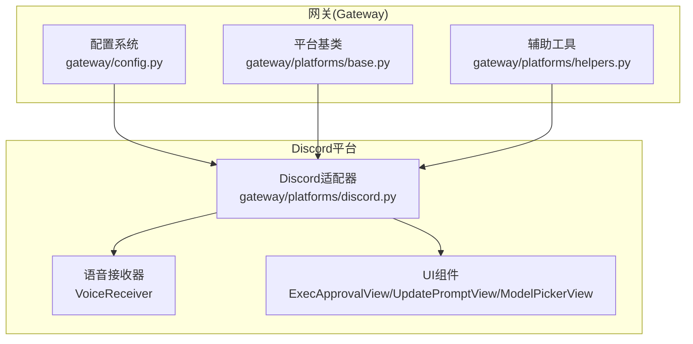
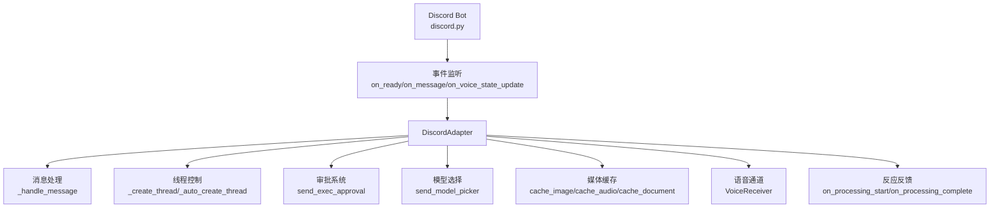
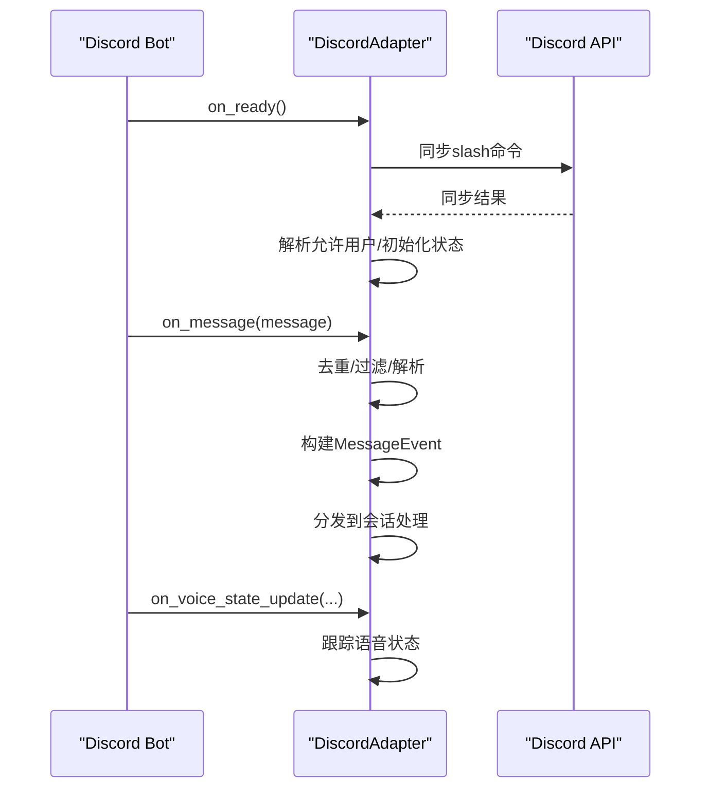
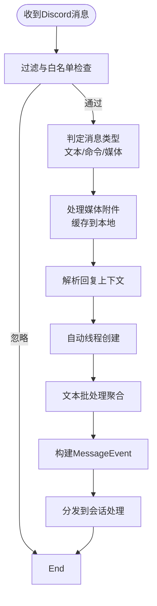
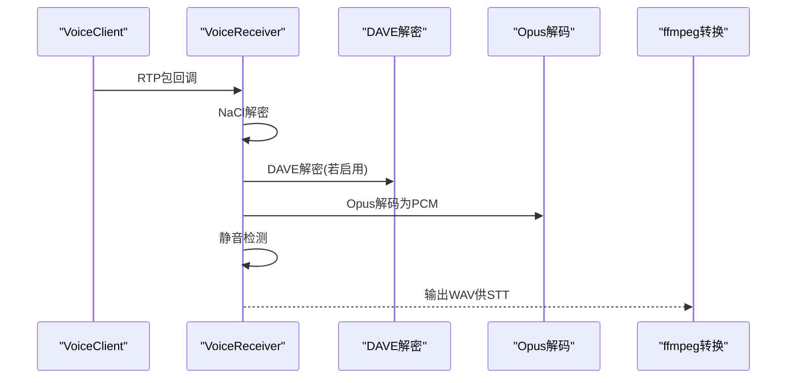
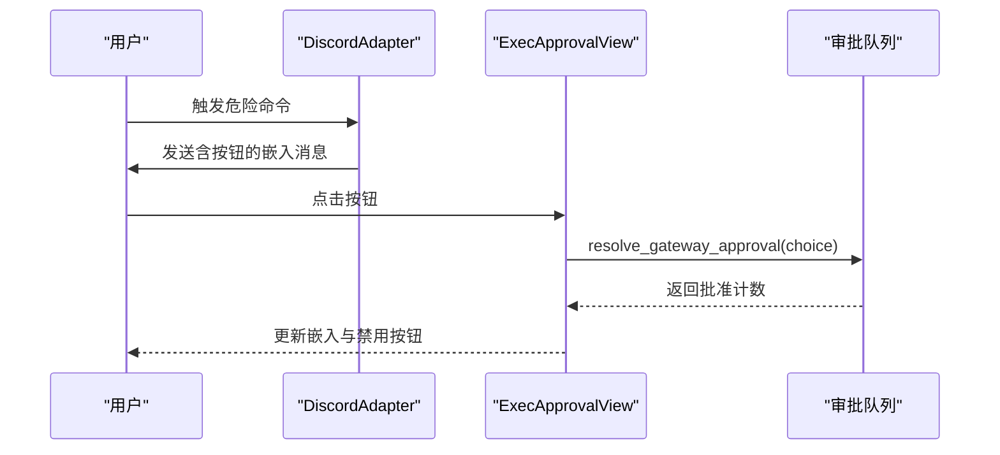
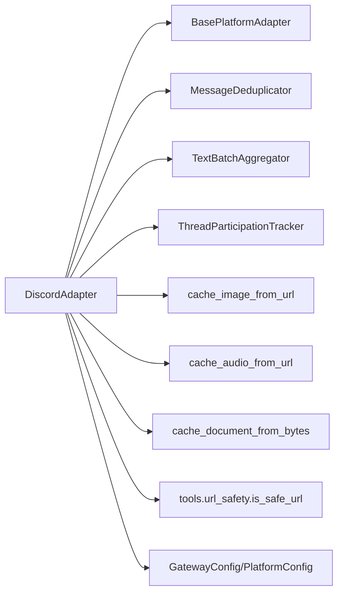

# Discord平台集成

<cite>
**本文档引用的文件**
- [gateway/platforms/discord.py](file://gateway/platforms/discord.py)
- [gateway/platforms/base.py](file://gateway/platforms/base.py)
- [gateway/platforms/helpers.py](file://gateway/platforms/helpers.py)
- [gateway/config.py](file://gateway/config.py)
- [tools/url_safety.py](file://tools/url_safety.py)
- [tests/gateway/test_discord_channel_controls.py](file://tests/gateway/test_discord_channel_controls.py)
</cite>

## 目录
1. [简介](#简介)
2. [项目结构](#项目结构)
3. [核心组件](#核心组件)
4. [架构总览](#架构总览)
5. [详细组件分析](#详细组件分析)
6. [依赖关系分析](#依赖关系分析)
7. [性能考虑](#性能考虑)
8. [故障排除指南](#故障排除指南)
9. [结论](#结论)
10. [附录](#附录)

## 简介
本文件面向Hermes Agent在Discord平台的集成与使用，系统性阐述其架构设计、WebSocket事件管理、消息处理流程、媒体附件与文档处理、语音通道集成、权限与审批系统、线程持久化与频道控制等关键能力。同时覆盖API限制、错误处理与重连策略、配置参数与权限设置、以及性能优化建议，帮助开发者与运维人员快速上手并稳定运行。

## 项目结构
Discord平台适配器位于gateway子模块中，采用“平台适配器 + 基类 + 辅助工具”的分层组织方式：
- 平台适配器：负责与Discord API交互、事件监听、消息发送、线程与频道控制、按钮式审批与模型选择等
- 基类与通用工具：提供统一的消息事件模型、媒体缓存、去重、文本批处理、Markdown剥离等
- 配置系统：集中管理平台开关、令牌、代理、频道控制、回复模式等

图表来源
- [gateway/platforms/discord.py:435-799](file://gateway/platforms/discord.py#L435-L799)
- [gateway/platforms/base.py:634-731](file://gateway/platforms/base.py#L634-L731)
- [gateway/platforms/helpers.py:22-153](file://gateway/platforms/helpers.py#L22-L153)

章节来源
- [gateway/platforms/discord.py:1-120](file://gateway/platforms/discord.py#L1-L120)
- [gateway/platforms/base.py:1-120](file://gateway/platforms/base.py#L1-L120)
- [gateway/platforms/helpers.py:1-40](file://gateway/platforms/helpers.py#L1-L40)

## 核心组件
- DiscordAdapter：Discord平台适配器，封装连接、事件处理、消息发送、线程与频道控制、按钮式审批与模型选择等
- VoiceReceiver：语音接收与解码组件，支持DAVE端到端加密音频的解密与静音检测
- MessageEvent：标准化消息事件载体，承载文本、媒体、回复上下文、自动技能绑定与频道提示词
- MessageDeduplicator：基于TTL的消息去重缓存，避免断线重连后重复处理事件
- TextBatchAggregator：文本批处理聚合器，合并Discord客户端侧2000字符拆分的多段消息
- ThreadParticipationTracker：线程参与跟踪器，持久化记录机器人已参与的线程，减少后续@提及需求
- 缓存工具：图像、音频、文档本地缓存，保障视觉与STT工具可用性

章节来源
- [gateway/platforms/discord.py:435-520](file://gateway/platforms/discord.py#L435-L520)
- [gateway/platforms/discord.py:83-160](file://gateway/platforms/discord.py#L83-L160)
- [gateway/platforms/base.py:634-731](file://gateway/platforms/base.py#L634-L731)
- [gateway/platforms/helpers.py:22-153](file://gateway/platforms/helpers.py#L22-L153)

## 架构总览
下图展示Discord平台适配器的整体架构与关键交互：

图表来源
- [gateway/platforms/discord.py:568-682](file://gateway/platforms/discord.py#L568-L682)
- [gateway/platforms/discord.py:2443-2799](file://gateway/platforms/discord.py#L2443-L2799)
- [gateway/platforms/discord.py:2258-2392](file://gateway/platforms/discord.py#L2258-L2392)
- [gateway/platforms/discord.py:2803-3192](file://gateway/platforms/discord.py#L2803-L3192)

## 详细组件分析

### 连接与事件管理（WebSocket）
- 使用discord.py建立Bot连接，配置Intents以启用消息内容、私信、服务器消息、成员状态、语音状态等
- 支持通过环境变量设置代理（HTTP/SOCKS），并在连接时注入
- on_ready触发后进行命令同步与允许用户解析；on_message处理入站消息；on_voice_state_update跟踪语音加入/离开
- 连接超时与异常捕获，失败时释放平台锁并返回False

图表来源
- [gateway/platforms/discord.py:568-682](file://gateway/platforms/discord.py#L568-L682)
- [gateway/platforms/discord.py:646-679](file://gateway/platforms/discord.py#L646-L679)

章节来源
- [gateway/platforms/discord.py:523-698](file://gateway/platforms/discord.py#L523-L698)

### 消息处理流程
- 入站消息过滤：忽略系统消息、非允许用户、按配置忽略的频道、未@提及且不在自由响应频道或机器人已参与线程的情况
- 自动线程：在@提及且未在禁用线程频道时，自动为消息创建线程并路由至线程
- 文本批处理：对Discord客户端侧拆分的多段消息进行聚合，提升用户体验
- 媒体处理：图片/音频/文档下载并缓存到本地，支持直接供视觉与STT工具使用；对不支持的文档类型与过大文件进行告警与跳过
- 回复上下文：解析引用消息，保留被回复文本作为上下文注入
- 频道技能绑定与提示词：从配置中解析频道级自动技能与临时系统提示词

图表来源
- [gateway/platforms/discord.py:2443-2799](file://gateway/platforms/discord.py#L2443-L2799)
- [gateway/platforms/base.py:634-731](file://gateway/platforms/base.py#L634-L731)

章节来源
- [gateway/platforms/discord.py:2443-2799](file://gateway/platforms/discord.py#L2443-L2799)

### 媒体附件与文档处理
- 图像缓存：根据Content-Type推断扩展名，优先使用.jpg/.png/.gif/.webp，失败回退至CDN URL
- 音频缓存：根据Content-Type推断扩展名，优先使用.ogg/mp3/wav/webm/m4a
- 文档缓存：仅支持PDF/MD/TXT/LOG/ZIP DOCX XLSX PPTX，超过32MB的文档跳过；对.md/.txt/.log在100KB内可注入文本内容
- SSRF防护：所有外部URL访问均通过安全校验与重定向防护
- 代理支持：通过resolve_proxy_url与proxy_kwargs_for_aiohttp注入HTTP/SOCKS代理

章节来源
- [gateway/platforms/discord.py:2583-2680](file://gateway/platforms/discord.py#L2583-L2680)
- [gateway/platforms/base.py:371-433](file://gateway/platforms/base.py#L371-L433)
- [gateway/platforms/base.py:490-552](file://gateway/platforms/base.py#L490-L552)
- [gateway/platforms/base.py:581-632](file://gateway/platforms/base.py#L581-L632)
- [tools/url_safety.py](file://tools/url_safety.py)

### 语音通道集成
- VoiceReceiver负责：
  - 从VoiceClient的SocketListener接收RTP包，完成NaCl传输解密与DAVE端到端解密
  - 通过SPEAKING事件映射SSRC到用户ID，静音检测后输出PCM音频
  - 将PCM转换为16kHz单声道WAV供Whisper STT使用
- 语音状态跟踪：on_voice_state_update记录加入/离开/切换，用于断线清理与超时断开
- 语音文本通道：支持将特定文本频道与语音频道绑定，语音活动期间视为自由响应

图表来源
- [gateway/platforms/discord.py:83-160](file://gateway/platforms/discord.py#L83-L160)
- [gateway/platforms/discord.py:205-433](file://gateway/platforms/discord.py#L205-L433)

章节来源
- [gateway/platforms/discord.py:83-433](file://gateway/platforms/discord.py#L83-L433)

### 审批系统与交互式UI
- 执行审批：send_exec_approval发送带按钮的嵌入消息，支持“一次允许/会话允许/永久允许/拒绝”，仅允许用户列表内的用户点击
- 更新提示：send_update_prompt提供Yes/No按钮，写入更新响应文件供后台进程读取
- 模型选择：send_model_picker提供两步下拉菜单（提供商→模型），编辑原消息展示选择结果
- 权限控制：所有视图均在构造时传入允许用户ID集合，点击前进行鉴权

图表来源
- [gateway/platforms/discord.py:2258-2302](file://gateway/platforms/discord.py#L2258-L2302)
- [gateway/platforms/discord.py:2805-2898](file://gateway/platforms/discord.py#L2805-L2898)

章节来源
- [gateway/platforms/discord.py:2258-2392](file://gateway/platforms/discord.py#L2258-L2392)
- [gateway/platforms/discord.py:2805-3192](file://gateway/platforms/discord.py#L2805-L3192)

### 线程持久化与频道控制
- 线程持久化：ThreadParticipationTracker将机器人参与过的线程ID持久化到磁盘JSON文件，重启后仍有效
- 频道控制：
  - 允许频道白名单：仅在白名单内响应
  - 忽略频道黑名单：即使@提及也不响应
  - 自由响应频道：无需@提及即可响应
  - 禁用线程频道：在这些频道不自动创建线程
  - 自动线程：默认开启，@提及后自动创建线程
- 论坛主题继承：线程继承父论坛的主题，便于在会话上下文中携带说明信息

章节来源
- [gateway/platforms/helpers.py:190-249](file://gateway/platforms/helpers.py#L190-L249)
- [gateway/platforms/discord.py:2470-2527](file://gateway/platforms/discord.py#L2470-L2527)
- [gateway/platforms/discord.py:2418-2442](file://gateway/platforms/discord.py#L2418-L2442)

### 配置参数与权限设置
- 平台令牌与代理：DISCORD_BOT_TOKEN、DISCORD_PROXY
- 频道控制：DISCORD_REQUIRE_MENTION、DISCORD_FREE_RESPONSE_CHANNELS、DISCORD_IGNORED_CHANNELS、DISCORD_ALLOWED_CHANNELS、DISCORD_NO_THREAD_CHANNELS、DISCORD_AUTO_THREAD
- 用户授权：DISCORD_ALLOWED_USERS（支持用户名与ID混用，启动时解析为数值ID）
- 反馈与批处理：DISCORD_REACTIONS、HERMES_DISCORD_TEXT_BATCH_DELAY_SECONDS、HERMES_DISCORD_TEXT_BATCH_SPLIT_DELAY_SECONDS
- 频道技能绑定与提示词：在平台extra中配置channel_skill_bindings与channel_prompts

章节来源
- [gateway/config.py:589-620](file://gateway/config.py#L589-L620)
- [gateway/platforms/discord.py:532-538](file://gateway/platforms/discord.py#L532-L538)
- [gateway/platforms/discord.py:2113-2142](file://gateway/platforms/discord.py#L2113-L2142)

## 依赖关系分析

图表来源
- [gateway/platforms/discord.py:435-520](file://gateway/platforms/discord.py#L435-L520)
- [gateway/platforms/base.py:371-433](file://gateway/platforms/base.py#L371-L433)
- [gateway/platforms/base.py:490-552](file://gateway/platforms/base.py#L490-L552)
- [gateway/platforms/base.py:581-632](file://gateway/platforms/base.py#L581-L632)
- [gateway/platforms/helpers.py:22-153](file://gateway/platforms/helpers.py#L22-L153)
- [gateway/config.py:144-188](file://gateway/config.py#L144-L188)

章节来源
- [gateway/platforms/discord.py:435-520](file://gateway/platforms/discord.py#L435-L520)
- [gateway/platforms/base.py:371-632](file://gateway/platforms/base.py#L371-L632)
- [gateway/platforms/helpers.py:22-153](file://gateway/platforms/helpers.py#L22-L153)
- [gateway/config.py:144-188](file://gateway/config.py#L144-L188)

## 性能考虑
- 文本批处理：通过环境变量调整批处理延迟与分割阈值，降低Discord客户端侧拆分带来的多次渲染成本
- 媒体缓存：将CDN链接转为本地缓存，避免过期与二次下载，提高视觉与STT工具吞吐
- Opus解码与静音检测：在VoiceReceiver中按需创建解码器实例，避免重复初始化
- 代理与网络：优先使用SOCKS代理绕过DNS污染，必要时降级HTTP代理，减少连接失败率
- 语音通道：合理设置VOICE_TIMEOUT，避免长时间空闲占用资源

## 故障排除指南
- 连接失败
  - 检查DISCORD_BOT_TOKEN是否正确且未使用占位符
  - 确认Intents配置（消息内容、私信、服务器消息、成员、语音状态）与开发者门户一致
  - 如使用代理，确认代理URL格式正确，SOCKS需安装aiohttp-socks
- 重复消息/掉线重连
  - 使用MessageDeduplicator避免RESUME重放导致的重复处理
  - on_ready后执行命令同步，确保slash命令可用
- 媒体无法加载
  - 检查URL安全策略与SSRF防护日志
  - 对于大文档（>32MB）与不支持类型将被跳过，属于预期行为
- 语音问题
  - 确认系统已加载Opus库；在macOS Homebrew环境下自动查找libopus路径
  - 若DAVE解密失败，可能为未加密音频或缺少用户映射，系统会回退到NaCl解密
- 审批与模型选择
  - 确保允许用户ID列表包含实际操作者；按钮超时后将自动禁用
  - 模型选择视图最多显示25个选项，超出部分可通过直接输入命令切换

章节来源
- [gateway/platforms/discord.py:492-698](file://gateway/platforms/discord.py#L492-L698)
- [gateway/platforms/discord.py:2805-3192](file://gateway/platforms/discord.py#L2805-L3192)
- [gateway/platforms/base.py:290-305](file://gateway/platforms/base.py#L290-L305)

## 结论
Hermes Agent的Discord平台集成通过模块化设计实现了高可用的消息处理、媒体与文档缓存、语音通道解码、线程与频道控制、以及交互式审批与模型选择。配合完善的配置体系与错误处理机制，可在复杂场景下保持稳定与高性能。建议在生产环境中结合代理、严格的频道控制与用户授权策略，持续监控媒体缓存与语音解码性能，以获得最佳体验。

## 附录

### 关键配置项速查
- 平台令牌与代理
  - DISCORD_BOT_TOKEN：Discord Bot令牌
  - DISCORD_PROXY：HTTP或SOCKS代理URL
- 频道控制
  - DISCORD_REQUIRE_MENTION：是否要求@提及（默认true）
  - DISCORD_FREE_RESPONSE_CHANNELS：自由响应频道ID列表
  - DISCORD_IGNORED_CHANNELS：忽略频道ID列表
  - DISCORD_ALLOWED_CHANNELS：允许频道白名单
  - DISCORD_NO_THREAD_CHANNELS：禁用自动线程的频道
  - DISCORD_AUTO_THREAD：是否自动创建线程（默认true）
- 用户授权
  - DISCORD_ALLOWED_USERS：允许的用户ID或用户名（启动时解析为数值ID）
- 反馈与批处理
  - DISCORD_REACTIONS：是否启用消息反应反馈（默认true）
  - HERMES_DISCORD_TEXT_BATCH_DELAY_SECONDS：文本批处理延迟（默认0.6s）
  - HERMES_DISCORD_TEXT_BATCH_SPLIT_DELAY_SECONDS：接近拆分阈值时的延迟（默认2.0s）
- 频道技能绑定与提示词
  - 在平台extra中配置channel_skill_bindings与channel_prompts

章节来源
- [gateway/config.py:589-620](file://gateway/config.py#L589-L620)
- [gateway/platforms/discord.py:532-538](file://gateway/platforms/discord.py#L532-L538)
- [gateway/platforms/discord.py:2113-2142](file://gateway/platforms/discord.py#L2113-L2142)