# Telegram平台集成

<cite>
**本文档引用的文件**
- [gateway/platforms/telegram.py](file://gateway/platforms/telegram.py)
- [gateway/platforms/telegram_network.py](file://gateway/platforms/telegram_network.py)
- [gateway/sticker_cache.py](file://gateway/sticker_cache.py)
</cite>

## 目录
1. [简介](#简介)
2. [项目结构](#项目结构)
3. [核心组件](#核心组件)
4. [架构概览](#架构概览)
5. [详细组件分析](#详细组件分析)
6. [依赖关系分析](#依赖关系分析)
7. [性能考虑](#性能考虑)
8. [故障排除指南](#故障排除指南)
9. [结论](#结论)

## 简介

Hermes Agent的Telegram平台集成为用户提供了完整的AI代理服务体验。该集成基于python-telegram-bot库构建，支持多种消息类型处理、内联键盘交互、DM主题系统和网络适配器等功能。

本集成实现了以下关键特性：
- 完整的消息路由机制，支持文本、媒体、命令等多种消息类型
- 内联键盘和审批按钮系统
- DM主题系统（私聊话题）
- 高级网络适配器，支持备用IP连接
- 消息格式转换和多媒体内容处理
- 文件下载缓存机制
- 速率限制处理和错误恢复策略
- 安全防护措施

## 项目结构

Telegram平台集成主要由三个核心文件组成：

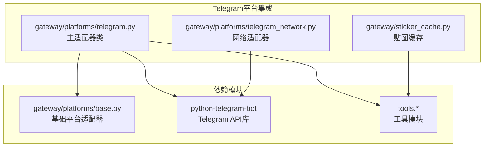

**图表来源**
- [gateway/platforms/telegram.py:1-100](file://gateway/platforms/telegram.py#L1-L100)
- [gateway/platforms/telegram_network.py:1-50](file://gateway/platforms/telegram_network.py#L1-L50)
- [gateway/sticker_cache.py:1-50](file://gateway/sticker_cache.py#L1-L50)

**章节来源**
- [gateway/platforms/telegram.py:1-100](file://gateway/platforms/telegram.py#L1-L100)
- [gateway/platforms/telegram_network.py:1-50](file://gateway/platforms/telegram_network.py#L1-L50)
- [gateway/sticker_cache.py:1-50](file://gateway/sticker_cache.py#L1-L50)

## 核心组件

### TelegramAdapter类

TelegramAdapter是整个集成的核心类，继承自BasePlatformAdapter，负责处理所有Telegram相关的操作。

**主要功能特性：**
- 消息接收和发送处理
- 内联键盘和审批按钮
- DM主题系统管理
- 多媒体内容处理
- 网络连接管理和错误恢复
- 消息格式转换

**关键属性：**
- `MAX_MESSAGE_LENGTH`: 最大消息长度限制（4096字符）
- `_SPLIT_THRESHOLD`: 消息分割阈值（4000字符）
- `_media_batch_delay_seconds`: 媒体批处理延迟
- `_text_batch_delay_seconds`: 文本批处理延迟

**章节来源**
- [gateway/platforms/telegram.py:121-173](file://gateway/platforms/telegram.py#L121-L173)

### TelegramFallbackTransport类

这是一个专门设计的HTTP传输层，用于处理Telegram API连接问题。

**核心功能：**
- 主机名保持的备用IP重试
- TLS SNI保留
- 自动IP发现和验证
- 连接超时处理

**章节来源**
- [gateway/platforms/telegram_network.py:52-120](file://gateway/platforms/telegram_network.py#L52-L120)

### StickerCache类

负责Telegram贴图的描述缓存系统。

**功能特性：**
- 基于file_unique_id的贴图描述缓存
- 视觉分析结果存储
- 缓存文件管理
- 描述注入构建

**章节来源**
- [gateway/sticker_cache.py:46-80](file://gateway/sticker_cache.py#L46-L80)

## 架构概览

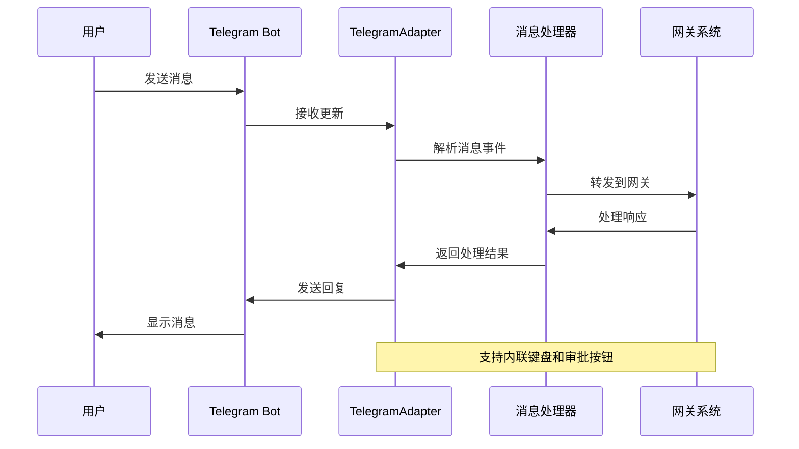

**图表来源**
- [gateway/platforms/telegram.py:538-791](file://gateway/platforms/telegram.py#L538-L791)

### 网络架构

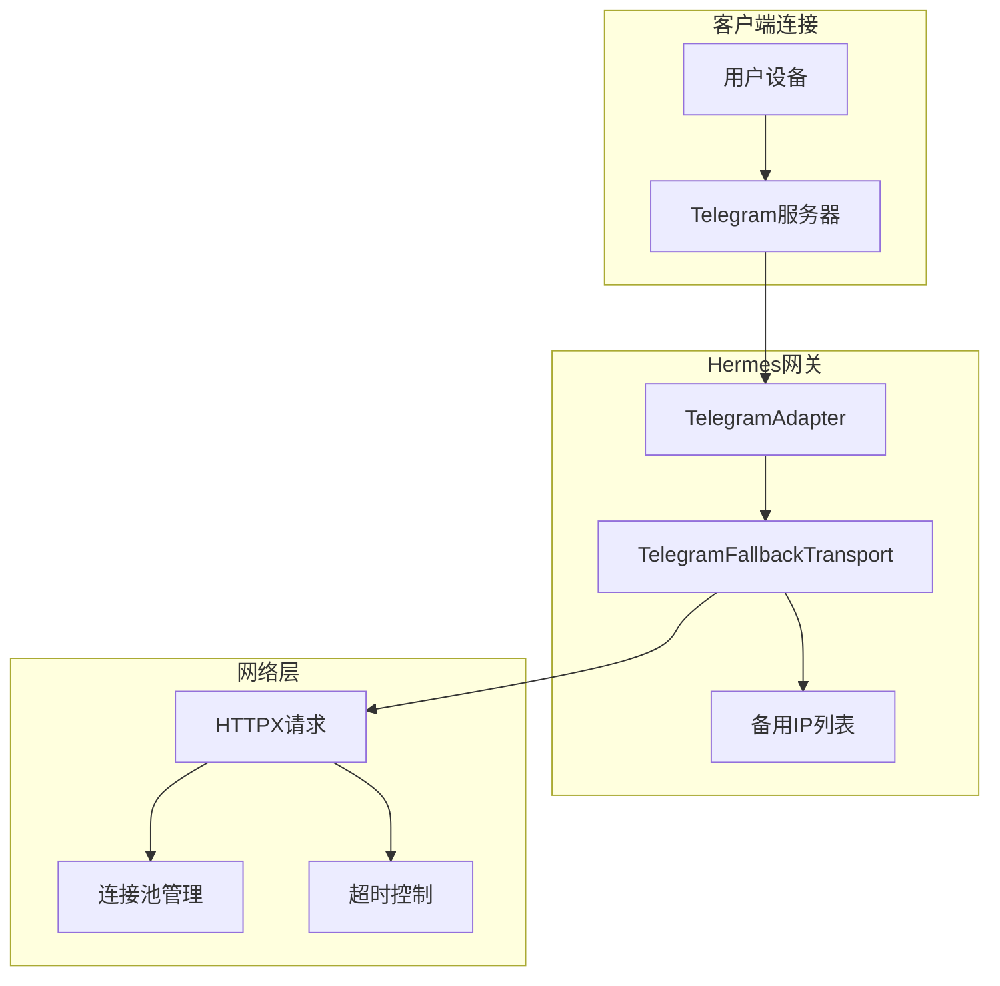

**图表来源**
- [gateway/platforms/telegram_network.py:52-120](file://gateway/platforms/telegram_network.py#L52-L120)
- [gateway/platforms/telegram.py:605-640](file://gateway/platforms/telegram.py#L605-L640)

## 详细组件分析

### 消息路由机制

TelegramAdapter实现了复杂的消息路由系统，能够处理各种类型的消息：

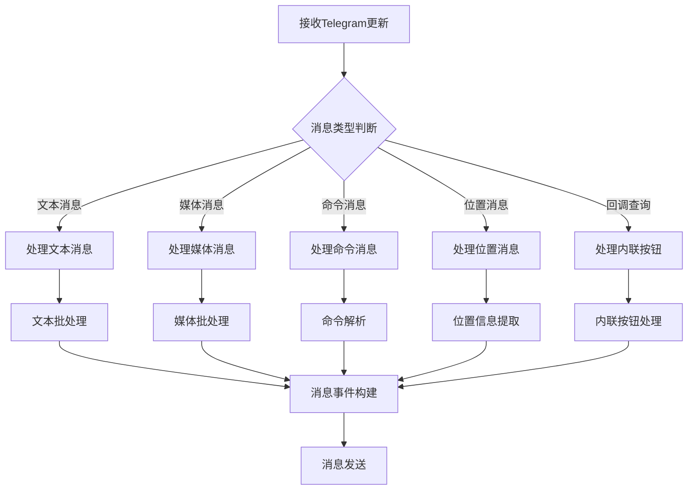

**图表来源**
- [gateway/platforms/telegram.py:2233-2294](file://gateway/platforms/telegram.py#L2233-L2294)
- [gateway/platforms/telegram.py:2418-2583](file://gateway/platforms/telegram.py#L2418-L2583)

#### 文本消息批处理

系统实现了智能的文本消息批处理机制，能够合并Telegram客户端侧的消息分割：

**处理流程：**
1. 检测消息是否来自群组聊天
2. 应用触发规则检查
3. 清理机器人触发文本
4. 合并连续的文本块
5. 设置适应性延迟时间
6. 分发聚合后的消息

**章节来源**
- [gateway/platforms/telegram.py:2299-2369](file://gateway/platforms/telegram.py#L2299-L2369)

#### 媒体消息处理

媒体消息处理包含复杂的下载和缓存机制：

**处理流程：**
1. 识别媒体类型（照片、视频、音频等）
2. 下载文件到本地缓存
3. 应用适当的扩展名
4. 缓存媒体文件供后续使用
5. 处理贴图的视觉分析
6. 合并媒体组消息

**章节来源**
- [gateway/platforms/telegram.py:2418-2583](file://gateway/platforms/telegram.py#L2418-L2583)

### 内联键盘和审批按钮系统

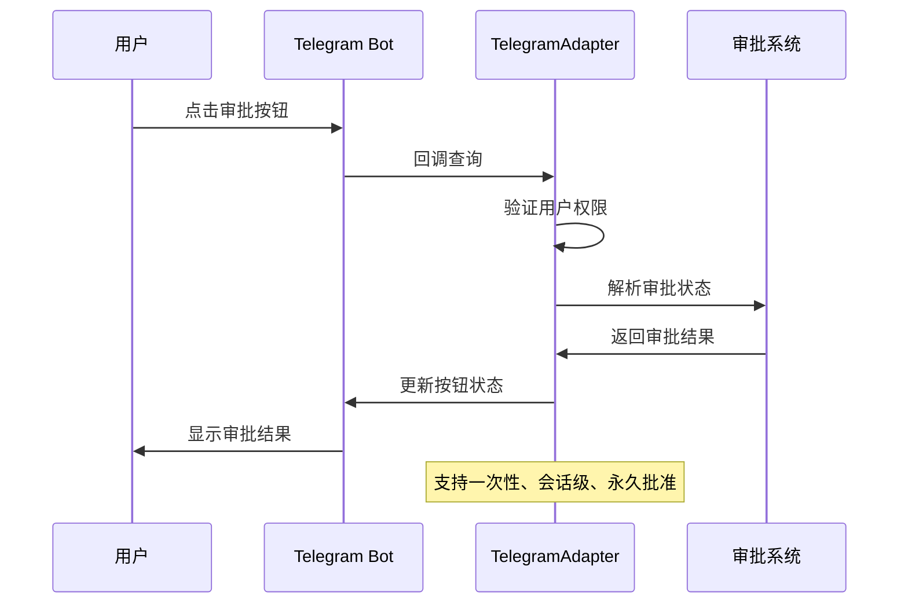

**图表来源**
- [gateway/platforms/telegram.py:1478-1581](file://gateway/platforms/telegram.py#L1478-L1581)

#### 审批按钮功能

系统提供了三种级别的命令审批：
- **一次性批准**：仅对当前命令有效
- **会话批准**：在整个会话期间有效
- **永久批准**：长期有效

**权限验证机制：**
- 支持TELEGRAM_ALLOWED_USERS环境变量
- 支持用户ID白名单
- 支持通配符(*)授权

**章节来源**
- [gateway/platforms/telegram.py:1118-1180](file://gateway/platforms/telegram.py#L1118-L1180)
- [gateway/platforms/telegram.py:1494-1548](file://gateway/platforms/telegram.py#L1494-L1548)

### DM主题系统

DM主题系统允许在私聊中创建和管理多个话题：

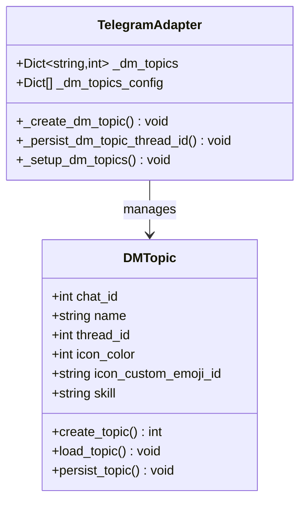

**图表来源**
- [gateway/platforms/telegram.py:381-537](file://gateway/platforms/telegram.py#L381-L537)

#### 主题配置

DM主题支持以下配置选项：
- `chat_id`: 聊天ID
- `name`: 主题名称
- `icon_color`: 图标颜色
- `icon_custom_emoji_id`: 自定义表情符号ID
- `thread_id`: 线程ID（可选，自动生成）
- `skill`: 绑定的技能

**章节来源**
- [gateway/platforms/telegram.py:468-537](file://gateway/platforms/telegram.py#L468-L537)

### 网络适配器

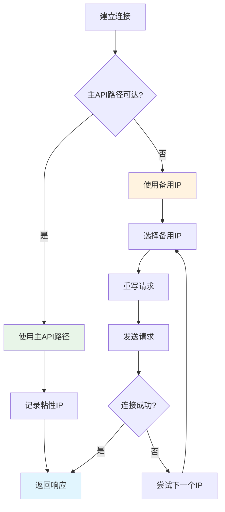

**图表来源**
- [gateway/platforms/telegram_network.py:73-114](file://gateway/platforms/telegram_network.py#L73-L114)

#### 备用IP发现机制

网络适配器支持多种备用IP发现方式：

**自动发现流程：**
1. 查询DNS-over-HTTPS提供商
2. 排除系统DNS解析的IP
3. 验证IP地址有效性
4. 使用种子备用IP作为最后手段

**支持的DoH提供商：**
- Google DNS: `https://dns.google/resolve`
- Cloudflare DNS: `https://cloudflare-dns.com/dns-query`

**章节来源**
- [gateway/platforms/telegram_network.py:185-226](file://gateway/platforms/telegram_network.py#L185-L226)

### 消息格式转换

系统实现了从标准Markdown到Telegram MarkdownV2的完整转换：

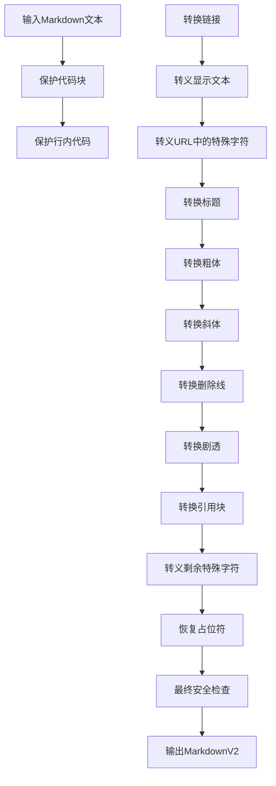

**图表来源**
- [gateway/platforms/telegram.py:1895-2061](file://gateway/platforms/telegram.py#L1895-L2061)

#### 特殊字符转义规则

系统使用正则表达式模式来转义MarkdownV2中的特殊字符：

**转义模式：**
- `_`, `*`, `[`, `]`, `(`, `)`, `~`, `` ` ``, `>`, `#`, `+`, `-`, `=`, `|`, `{`, `}`, `.`, `!`
- 链接URL中的`)`和`\`需要特殊处理

**章节来源**
- [gateway/platforms/telegram.py:91-98](file://gateway/platforms/telegram.py#L91-L98)

### 多媒体内容处理

系统支持多种媒体类型的处理和缓存：

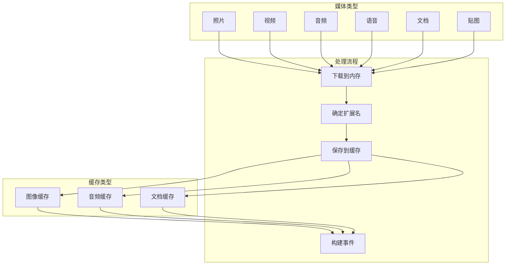

**图表来源**
- [gateway/platforms/telegram.py:2455-2577](file://gateway/platforms/telegram.py#L2455-L2577)

#### 贴图处理机制

贴图处理包含视觉分析和缓存：

**处理流程：**
1. 检查贴图类型（静态vs动画）
2. 静态贴图：下载、分析、缓存
3. 动画贴图：直接注入表情符号描述
4. 缓存描述信息

**视觉分析提示：**
- "描述这个贴图1-2句话。专注于它描绘的内容——角色、动作、情感。"

**章节来源**
- [gateway/platforms/telegram.py:2621-2687](file://gateway/platforms/telegram.py#L2621-L2687)

## 依赖关系分析

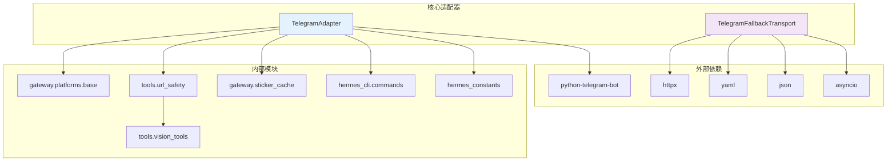

**图表来源**
- [gateway/platforms/telegram.py:64-83](file://gateway/platforms/telegram.py#L64-L83)
- [gateway/platforms/telegram_network.py:18-23](file://gateway/platforms/telegram_network.py#L18-L23)

### 错误处理和恢复策略

系统实现了多层次的错误处理机制：

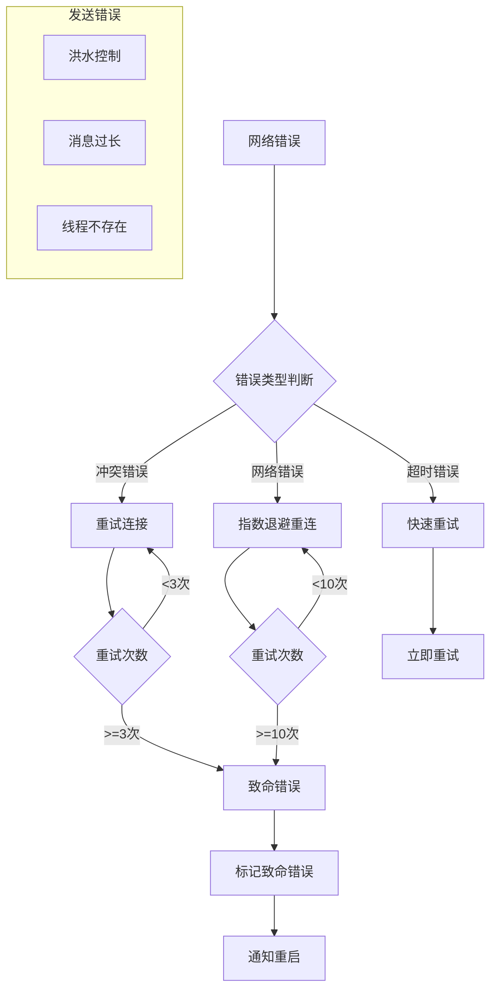

**图表来源**
- [gateway/platforms/telegram.py:256-380](file://gateway/platforms/telegram.py#L256-L380)

#### 速率限制处理

系统针对Telegram的速率限制实现了智能处理：

**洪水控制处理：**
- 检测`retry_after`参数
- 短等待（<=5秒）：自动重试
- 长等待（>5秒）：返回失败给流消费者
- 避免重复消息发送风险

**消息长度限制：**
- 4096字符限制
- 自动分片处理
- MarkdownV2特殊字符转义

**章节来源**
- [gateway/platforms/telegram.py:970-983](file://gateway/platforms/telegram.py#L970-L983)
- [gateway/platforms/telegram.py:1054-1076](file://gateway/platforms/telegram.py#L1054-L1076)

## 性能考虑

### 连接池优化

系统使用了优化的HTTP连接池配置：

**连接池参数：**
- `connection_pool_size`: 512（默认）
- `pool_timeout`: 8.0秒（默认）
- `connect_timeout`: 10.0秒（默认）
- `read_timeout`: 20.0秒（默认）
- `write_timeout`: 20.0秒（默认）

**网络适配器优化：**
- 主连接池和获取更新连接池分离
- 减少轮询重连和API调用之间的竞争
- 支持备用IP传输以提高可靠性

### 缓存策略

系统实现了多层缓存机制：

**内存缓存：**
- DM主题映射缓存
- 审批状态缓存
- 模型选择器状态缓存

**磁盘缓存：**
- 贴图描述缓存
- 媒体文件缓存
- 配置文件缓存

**章节来源**
- [gateway/platforms/telegram.py:595-601](file://gateway/platforms/telegram.py#L595-L601)
- [gateway/platforms/telegram_network.py:66-69](file://gateway/platforms/telegram_network.py#L66-L69)

## 故障排除指南

### 常见问题诊断

**连接问题：**
1. 检查Telegram令牌配置
2. 验证网络连接和防火墙设置
3. 查看备用IP发现日志
4. 确认代理设置正确

**消息处理问题：**
1. 检查消息格式转换日志
2. 验证MarkdownV2特殊字符转义
3. 确认媒体文件缓存可用
4. 检查贴图分析结果

**章节来源**
- [gateway/platforms/telegram.py:552-561](file://gateway/platforms/telegram.py#L552-L561)
- [gateway/platforms/telegram_network.py:103-114](file://gateway/platforms/telegram_network.py#L103-L114)

### 环境变量配置

**核心配置：**
- `TELEGRAM_WEBHOOK_URL`: Webhook URL（HTTPS）
- `TELEGRAM_WEBHOOK_PORT`: Webhook端口（默认8443）
- `TELEGRAM_WEBHOOK_SECRET`: Webhook密钥
- `TELEGRAM_ALLOWED_USERS`: 允许的用户ID列表

**网络配置：**
- `TELEGRAM_PROXY`: 代理服务器URL
- `HERMES_TELEGRAM_DISABLE_FALLBACK_IPS`: 禁用备用IP
- `HERMES_TELEGRAM_HTTP_POOL_SIZE`: 连接池大小
- `HERMES_TELEGRAM_MEDIA_BATCH_DELAY_SECONDS`: 媒体批处理延迟

**章节来源**
- [gateway/platforms/telegram.py:546-551](file://gateway/platforms/telegram.py#L546-L551)
- [gateway/platforms/telegram.py:603-604](file://gateway/platforms/telegram.py#L603-L604)

### 日志和调试

系统提供了详细的日志记录：

**日志级别：**
- `INFO`: 连接状态、配置加载
- `WARNING`: 可恢复错误、配置警告
- `ERROR`: 致命错误、异常情况
- `DEBUG`: 详细调试信息

**调试建议：**
1. 启用详细日志记录
2. 检查网络连接状态
3. 验证API响应
4. 监控资源使用情况

## 结论

Hermes Agent的Telegram平台集成为用户提供了企业级的即时通讯AI代理服务。通过精心设计的架构和全面的功能实现，该集成支持：

- **高可靠性的消息路由**：支持多种消息类型和复杂的批处理逻辑
- **丰富的交互功能**：内联键盘、审批按钮、DM主题系统
- **强大的网络适配**：备用IP连接和智能重连机制
- **完善的缓存策略**：多层缓存确保性能和用户体验
- **全面的安全防护**：权限验证、SSRF保护、速率限制

该集成的设计充分考虑了生产环境的需求，提供了灵活的配置选项和强大的错误恢复能力，能够满足各种规模的应用场景。