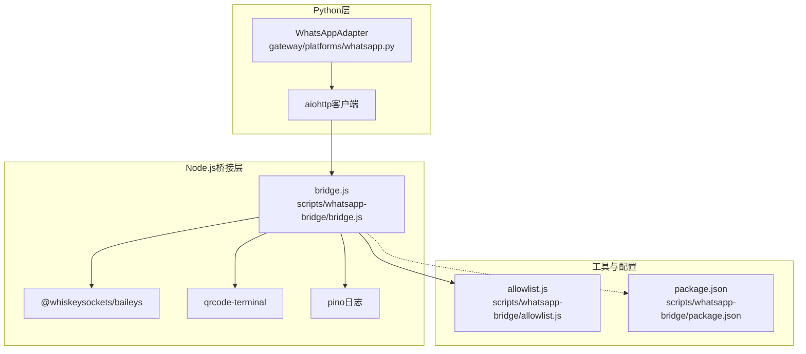
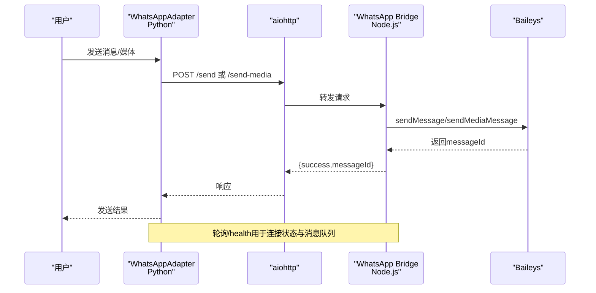
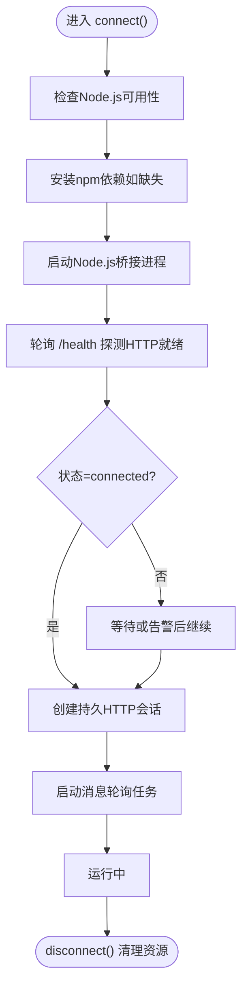
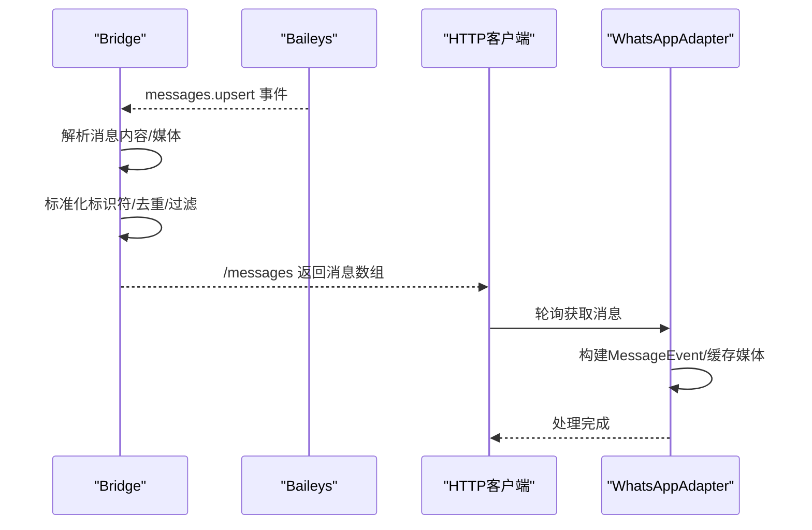
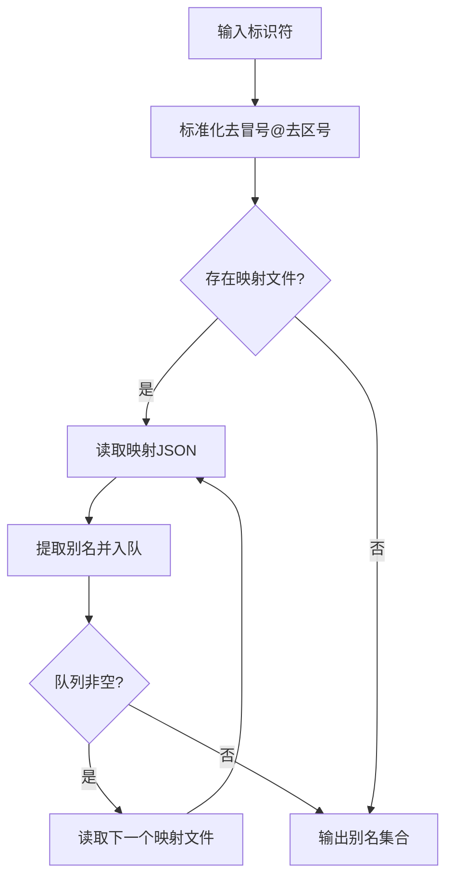
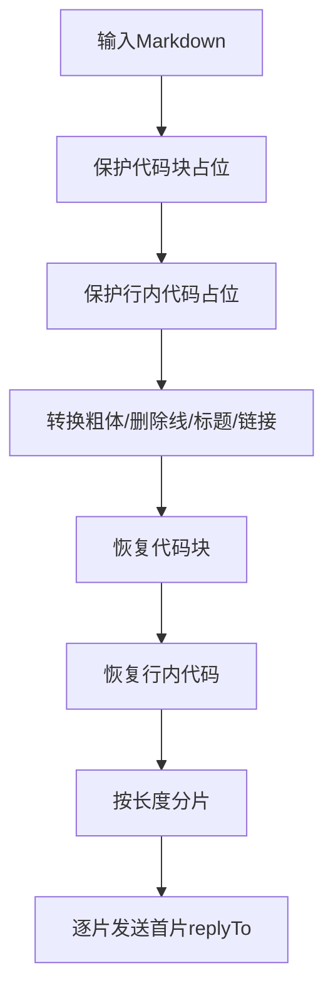
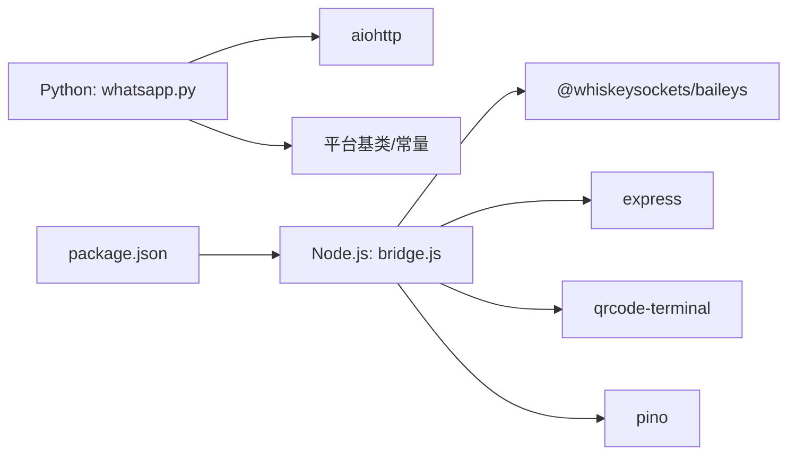

# WhatsApp平台集成

<cite>
**本文档引用的文件**
- [gateway/platforms/whatsapp.py](file://gateway/platforms/whatsapp.py)
- [scripts/whatsapp-bridge/bridge.js](file://scripts/whatsapp-bridge/bridge.js)
- [scripts/whatsapp-bridge/allowlist.js](file://scripts/whatsapp-bridge/allowlist.js)
- [scripts/whatsapp-bridge/package.json](file://scripts/whatsapp-bridge/package.json)
- [tests/gateway/test_whatsapp_connect.py](file://tests/gateway/test_whatsapp_connect.py)
- [tests/gateway/test_whatsapp_group_gating.py](file://tests/gateway/test_whatsapp_group_gating.py)
- [tests/gateway/test_whatsapp_formatting.py](file://tests/gateway/test_whatsapp_formatting.py)
- [tests/gateway/test_whatsapp_reply_prefix.py](file://tests/gateway/test_whatsapp_reply_prefix.py)
- [website/docs/user-guide/messaging/whatsapp.md](file://website/docs/user-guide/messaging/whatsapp.md)
- [hermes_cli/main.py](file://hermes_cli/main.py)
</cite>

## 目录
1. [简介](#简介)
2. [项目结构](#项目结构)
3. [核心组件](#核心组件)
4. [架构总览](#架构总览)
5. [详细组件分析](#详细组件分析)
6. [依赖关系分析](#依赖关系分析)
7. [性能考虑](#性能考虑)
8. [故障排除指南](#故障排除指南)
9. [结论](#结论)
10. [附录](#附录)

## 简介
本文件面向Hermes Agent的WhatsApp平台集成，系统性阐述基于Node.js桥接的WhatsApp Business API与个人账号（web自动化）集成方案。文档覆盖消息处理机制、群组管理、联系人验证、消息状态跟踪、语音消息与多媒体处理、文件传输、API限制与错误处理、连接稳定性保障、群组门禁与回复模式、消息去重策略，以及配置要求、认证流程与部署指南。

## 项目结构
WhatsApp集成由三层组成：
- Python网关适配器：负责会话管理、消息格式化、发送/编辑、轮询、媒体缓存、错误处理与连接生命周期管理。
- Node.js桥接进程：通过Baileys连接WhatsApp，提供HTTP接口供Python适配器调用；负责媒体下载、消息去重、群组元数据查询与健康检查。
- 允许列表工具：解析与展开WhatsApp标识符别名，支持LID与手机号映射，实现跨模式的访问控制。

**图表来源**
- [gateway/platforms/whatsapp.py](file://gateway/platforms/whatsapp.py)
- [scripts/whatsapp-bridge/bridge.js](file://scripts/whatsapp-bridge/bridge.js)
- [scripts/whatsapp-bridge/allowlist.js](file://scripts/whatsapp-bridge/allowlist.js)
- [scripts/whatsapp-bridge/package.json](file://scripts/whatsapp-bridge/package.json)

**章节来源**
- [gateway/platforms/whatsapp.py](file://gateway/platforms/whatsapp.py)
- [scripts/whatsapp-bridge/bridge.js](file://scripts/whatsapp-bridge/bridge.js)
- [scripts/whatsapp-bridge/allowlist.js](file://scripts/whatsapp-bridge/allowlist.js)
- [scripts/whatsapp-bridge/package.json](file://scripts/whatsapp-bridge/package.json)

## 核心组件
- WhatsAppAdapter（Python）
  - 连接管理：启动/停止Node.js桥接进程，健康检查，持久HTTP会话，轮询消息。
  - 消息处理：Markdown到WhatsApp语法转换，长文本分片发送，回复模式与前缀注入，群组门禁与提及匹配。
  - 媒体处理：图片/视频/音频/文档的本地缓存与转发，内联文本注入（小文档），语音转码提示。
  - 错误处理：致命错误标记与通知，文件句柄清理，端口占用清理，进程退出检测。
- WhatsApp Bridge（Node.js）
  - Baileys会话：多文件认证状态存储，自动重连与重启处理，消息去重（最近发送ID集合）。
  - HTTP接口：/messages轮询、/send发送、/edit编辑、/send-media原生媒体发送、/typing输入指示、/chat/:id查询、/health健康检查。
  - 访问控制：允许用户白名单解析与别名展开（含LID映射），自定义回复前缀。
- 允许列表工具（Node.js）
  - 解析WHATSAPP_ALLOWED_USERS，标准化标识符，读取LID映射文件，递归展开别名集合，匹配发送者。

**章节来源**
- [gateway/platforms/whatsapp.py](file://gateway/platforms/whatsapp.py)
- [scripts/whatsapp-bridge/bridge.js](file://scripts/whatsapp-bridge/bridge.js)
- [scripts/whatsapp-bridge/allowlist.js](file://scripts/whatsapp-bridge/allowlist.js)

## 架构总览
WhatsApp集成采用“Python适配器 + Node.js桥接”的桥接模式，通过HTTP通信实现解耦。Python侧专注业务逻辑与平台抽象，Node.js侧专注与WhatsApp协议交互与媒体处理。

**图表来源**
- [gateway/platforms/whatsapp.py](file://gateway/platforms/whatsapp.py)
- [scripts/whatsapp-bridge/bridge.js](file://scripts/whatsapp-bridge/bridge.js)

## 详细组件分析

### 组件A：WhatsAppAdapter（Python）
- 连接与生命周期
  - 启动Node.js桥接进程，自动安装依赖，健康检查，持久HTTP会话，消息轮询任务。
  - 断开时清理进程组、取消轮询任务、关闭HTTP会话与日志文件句柄。
- 消息处理
  - Markdown到WhatsApp语法转换，保留代码块与行内代码占位，标题转粗体，链接转纯文本URL。
  - 长文本按最大长度分片发送，首片设置replyTo，后续片断延时避免限流。
- 媒体处理
  - 图片：缓存URL到本地，优先使用桥接已下载的绝对路径。
  - 语音：缓存URL到本地（.ogg），桥接侧自动识别ptt与audio类型。
  - 文档：对小尺寸文本/JSON/XML等注入内容到消息正文，便于Agent直接阅读。
- 安全与门禁
  - 支持require_mention、mention_patterns、free_response_chats等策略组合。
  - 群组消息中清理机器人提及，避免循环触发。
- 错误处理
  - 桥接进程退出检测与致命错误上报，文件句柄泄漏修复，端口占用清理。

**图表来源**
- [gateway/platforms/whatsapp.py](file://gateway/platforms/whatsapp.py)

**章节来源**
- [gateway/platforms/whatsapp.py](file://gateway/platforms/whatsapp.py)
- [tests/gateway/test_whatsapp_connect.py](file://tests/gateway/test_whatsapp_connect.py)

### 组件B：WhatsApp Bridge（Node.js）
- Baileys会话与重连
  - 多文件认证状态，getMessage回调用于E2EE握手，连接状态事件处理，515重启自动重连。
- HTTP接口
  - /messages：长轮询返回消息队列。
  - /send：发送文本消息，注入回复前缀（self-chat模式）。
  - /edit：编辑已发送消息。
  - /send-media：原生发送图片/视频/音频/文档，自动推断MIME类型。
  - /typing：发送输入指示。
  - /chat/:id：查询群组名称与成员（仅群组）。
  - /health：返回连接状态、队列长度与时长。
- 消息去重
  - 维护最近发送ID集合，忽略来自自身的echo回包，避免循环。
- 访问控制
  - 解析WHATSAPP_ALLOWED_USERS，标准化标识符，读取lid-mapping-*映射文件，展开别名匹配。

**图表来源**
- [scripts/whatsapp-bridge/bridge.js](file://scripts/whatsapp-bridge/bridge.js)

**章节来源**
- [scripts/whatsapp-bridge/bridge.js](file://scripts/whatsapp-bridge/bridge.js)
- [scripts/whatsapp-bridge/allowlist.js](file://scripts/whatsapp-bridge/allowlist.js)

### 组件C：允许列表与标识符展开
- 标识符标准化：去除前缀冒号与后缀域，统一国家码格式。
- 映射文件：lid-mapping-<phone>.json与lid-mapping-<phone>_reverse.json双向映射。
- 别名展开：广度优先遍历映射文件，形成可匹配的别名集合。

**图表来源**
- [scripts/whatsapp-bridge/allowlist.js](file://scripts/whatsapp-bridge/allowlist.js)

**章节来源**
- [scripts/whatsapp-bridge/allowlist.js](file://scripts/whatsapp-bridge/allowlist.js)

### 组件D：消息格式化与分片发送
- 格式转换：保护代码块与行内代码，转换粗体/删除线，标题转粗体，链接转纯文本URL。
- 分片策略：按最大长度切分，保持代码边界，首片设置replyTo，后续延时发送。
- 测试覆盖：短消息单次发送，长消息分片发送，最大长度限制。

**图表来源**
- [gateway/platforms/whatsapp.py](file://gateway/platforms/whatsapp.py)

**章节来源**
- [gateway/platforms/whatsapp.py](file://gateway/platforms/whatsapp.py)
- [tests/gateway/test_whatsapp_formatting.py](file://tests/gateway/test_whatsapp_formatting.py)

### 组件E：群组门禁与回复模式
- 门禁策略
  - require_mention：是否必须提及机器人。
  - mention_patterns：正则模式匹配消息正文。
  - free_response_chats：白名单群组免提及自由响应。
- 回复模式
  - reply_prefix：在self-chat模式下自动添加前缀，区分机器人回复与用户消息。
- 测试覆盖
  - 门禁策略组合生效，群组消息自由响应，reply_prefix从配置桥接。

**章节来源**
- [gateway/platforms/whatsapp.py](file://gateway/platforms/whatsapp.py)
- [tests/gateway/test_whatsapp_group_gating.py](file://tests/gateway/test_whatsapp_group_gating.py)
- [tests/gateway/test_whatsapp_reply_prefix.py](file://tests/gateway/test_whatsapp_reply_prefix.py)

## 依赖关系分析
- Python依赖
  - aiohttp：HTTP客户端与服务端（桥接进程内部使用）。
  - hermes_constants：获取Hermes目录路径。
  - 平台基类：MessageEvent、MessageType、SendResult等抽象。
- Node.js依赖
  - @whiskeysockets/baileys：核心WhatsApp协议库。
  - express：HTTP服务端。
  - qrcode-terminal：终端二维码显示。
  - pino：轻量日志。
- 包管理
  - package.json声明依赖版本与启动脚本。

**图表来源**
- [gateway/platforms/whatsapp.py](file://gateway/platforms/whatsapp.py)
- [scripts/whatsapp-bridge/bridge.js](file://scripts/whatsapp-bridge/bridge.js)
- [scripts/whatsapp-bridge/package.json](file://scripts/whatsapp-bridge/package.json)

**章节来源**
- [gateway/platforms/whatsapp.py](file://gateway/platforms/whatsapp.py)
- [scripts/whatsapp-bridge/bridge.js](file://scripts/whatsapp-bridge/bridge.js)
- [scripts/whatsapp-bridge/package.json](file://scripts/whatsapp-bridge/package.json)

## 性能考虑
- 消息分片与限流
  - 长文本分片发送，首片replyTo，后续片断间延时，降低API限流风险。
- 媒体缓存
  - 图片/音频/视频/文档缓存至本地，减少URL过期影响，加速工具链访问。
- 轮询与队列
  - 消息队列上限与轮询间隔平衡实时性与CPU占用。
- 连接稳定性
  - 自动重连与515重启处理，健康检查与进程退出检测，文件句柄与端口清理。

[本节为通用指导，无需特定文件来源]

## 故障排除指南
- 依赖缺失
  - Node.js未安装：检查环境变量与PATH，确保node --version可用。
  - npm依赖未安装：首次启动自动安装，若失败查看bridge.log。
- 连接问题
  - 无法启动桥接：检查端口占用，必要时使用内置端口清理函数；查看bridge.log。
  - WhatsApp未连接：等待认证完成，或重新配对；检查session目录权限。
- 桥接进程异常
  - 进程退出：适配器记录致命错误并通知；检查日志文件句柄是否正确关闭。
- 媒体发送失败
  - 文件不存在：确认文件路径与权限；文档类型MIME推断与扩展名对应。
- 群组与门禁
  - 未收到消息：检查WHATSAPP_ALLOWED_USERS与free_response_chats配置；确认mention_patterns匹配。

**章节来源**
- [gateway/platforms/whatsapp.py](file://gateway/platforms/whatsapp.py)
- [tests/gateway/test_whatsapp_connect.py](file://tests/gateway/test_whatsapp_connect.py)

## 结论
WhatsApp集成通过Python适配器与Node.js桥接的清晰分层，实现了对WhatsApp协议的稳定接入。桥接层负责复杂的消息与媒体处理、去重与访问控制，Python适配器聚焦于平台抽象与业务逻辑。该设计兼顾了可维护性、可扩展性与安全性，适合在生产环境中长期演进。

[本节为总结，无需特定文件来源]

## 附录

### 配置要求与认证流程
- 启用平台
  - 设置环境变量WHATSAPP_ENABLED=true，或通过CLI启用。
- 模式选择
  - WHATSAPP_MODE：bot（独立号码）或self-chat（同一号码）。
- 访问控制
  - WHATSAPP_ALLOWED_USERS：逗号分隔的手机号（不含+），或*表示允许所有人。
- 回复前缀
  - config.yaml中whatsapp.reply_prefix可传递到Node.js环境变量。
- 认证与配对
  - Node.js桥接显示二维码，扫描后保存会话凭证；支持配对模式仅生成凭证。
- 日志与调试
  - WHATSAPP_DEBUG开启后输出详细事件日志；bridge.log记录桥接进程输出。

**章节来源**
- [website/docs/user-guide/messaging/whatsapp.md](file://website/docs/user-guide/messaging/whatsapp.md)
- [hermes_cli/main.py](file://hermes_cli/main.py)
- [scripts/whatsapp-bridge/bridge.js](file://scripts/whatsapp-bridge/bridge.js)

### API限制与错误处理要点
- 消息长度
  - 实际UI限制约4096字符，适配器按此分片发送。
- 媒体类型
  - 图片/视频/音频/文档分别处理，MIME类型自动推断。
- 错误分类
  - 连接失败（503）、参数缺失（400）、文件不存在（404）、内部错误（500）。
- 致命错误
  - 桥接进程退出标记为致命错误，支持重试策略与通知。

**章节来源**
- [gateway/platforms/whatsapp.py](file://gateway/platforms/whatsapp.py)
- [scripts/whatsapp-bridge/bridge.js](file://scripts/whatsapp-bridge/bridge.js)

### 群组管理与消息去重
- 群组信息
  - 通过/chat/:id查询群组主题与成员列表（仅群组）。
- 去重策略
  - 最近发送ID集合限制大小，忽略来自自身的echo回包，避免循环。
- 门禁策略
  - require_mention、mention_patterns、free_response_chats三者组合决定是否处理群组消息。

**章节来源**
- [gateway/platforms/whatsapp.py](file://gateway/platforms/whatsapp.py)
- [scripts/whatsapp-bridge/bridge.js](file://scripts/whatsapp-bridge/bridge.js)