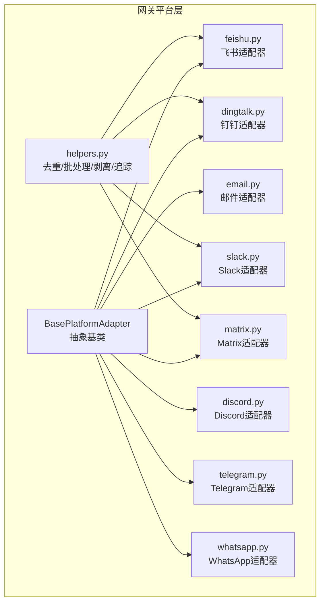
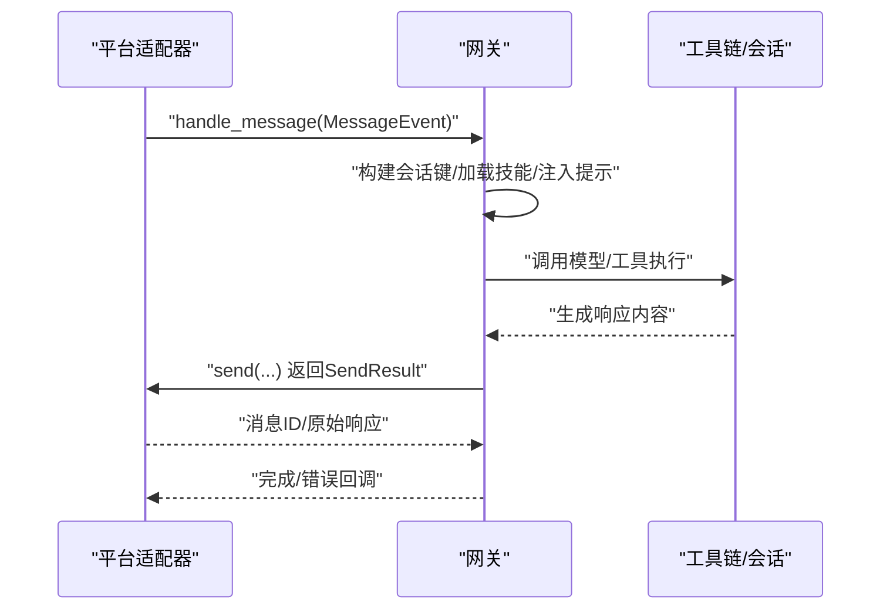
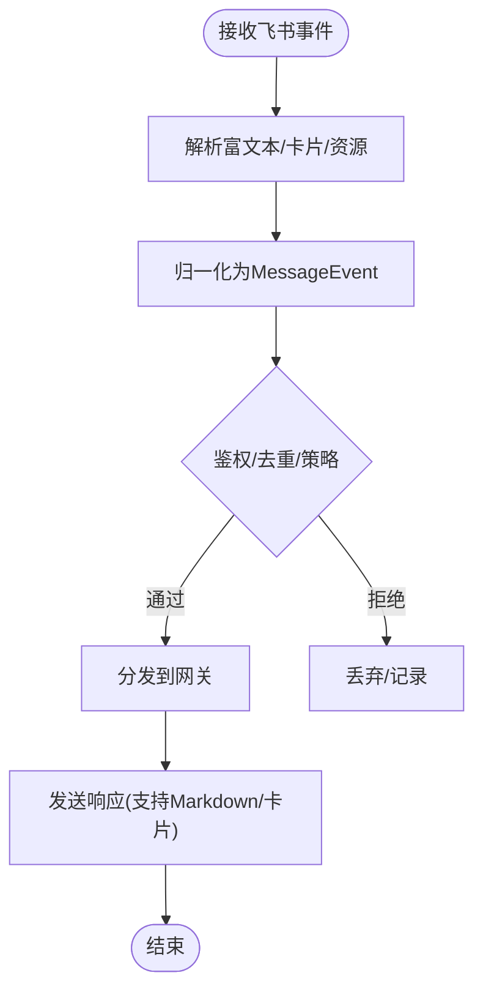
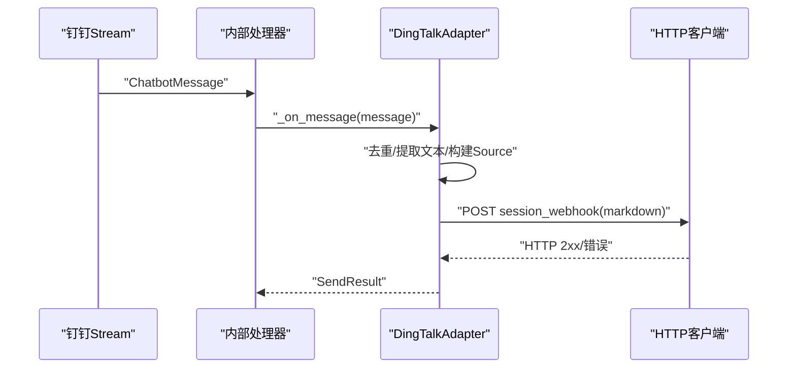
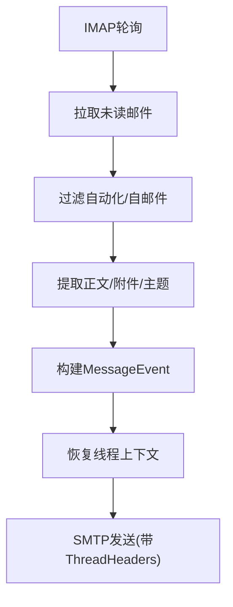
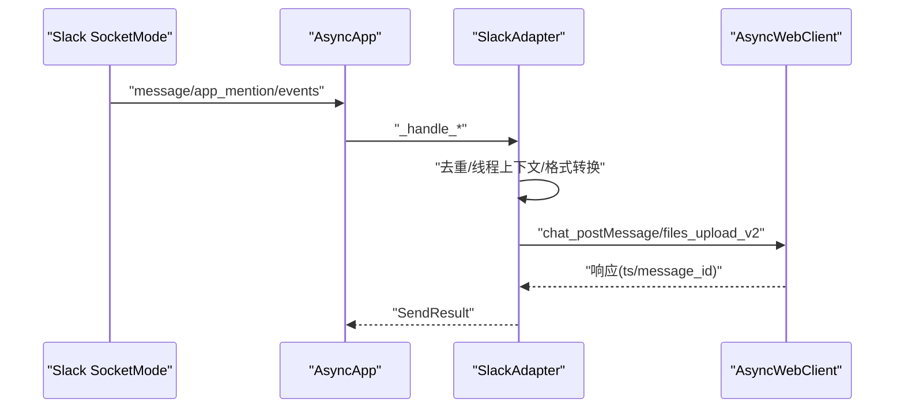
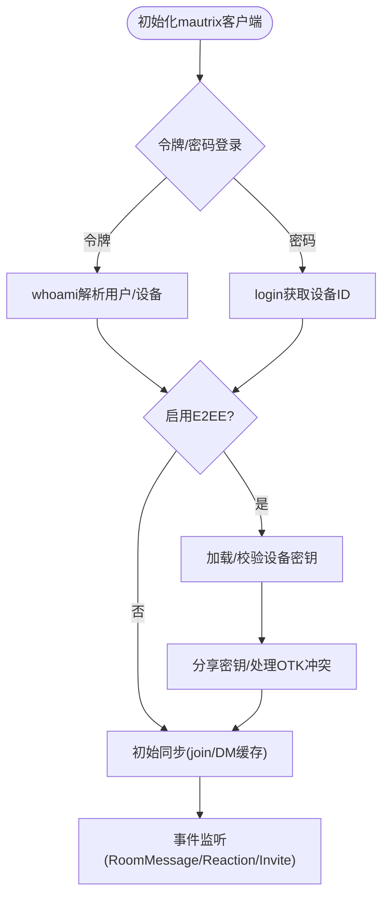
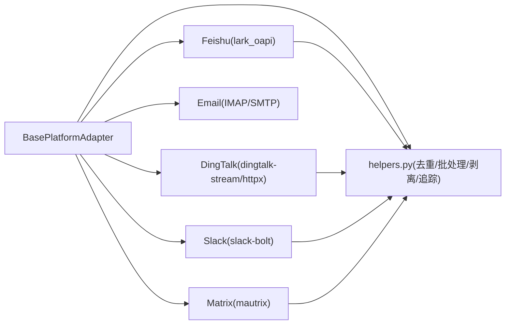

# 其他平台集成

<cite>
**本文档引用的文件**
- [gateway/platforms/feishu.py](file://gateway/platforms/feishu.py)
- [gateway/platforms/dingtalk.py](file://gateway/platforms/dingtalk.py)
- [gateway/platforms/email.py](file://gateway/platforms/email.py)
- [gateway/platforms/slack.py](file://gateway/platforms/slack.py)
- [gateway/platforms/matrix.py](file://gateway/platforms/matrix.py)
- [gateway/platforms/base.py](file://gateway/platforms/base.py)
- [gateway/platforms/helpers.py](file://gateway/platforms/helpers.py)
- [gateway/platforms/ADDING_A_PLATFORM.md](file://gateway/platforms/ADDING_A_PLATFORM.md)
- [gateway/platforms/discord.py](file://gateway/platforms/discord.py)
- [gateway/platforms/telegram.py](file://gateway/platforms/telegram.py)
- [gateway/platforms/whatsapp.py](file://gateway/platforms/whatsapp.py)
</cite>

## 目录
1. [简介](#简介)
2. [项目结构](#项目结构)
3. [核心组件](#核心组件)
4. [架构总览](#架构总览)
5. [详细组件分析](#详细组件分析)
6. [依赖分析](#依赖分析)
7. [性能考虑](#性能考虑)
8. [故障排除指南](#故障排除指南)
9. [结论](#结论)
10. [附录](#附录)

## 简介
本文件面向Hermes Agent的“其他平台”集成，系统梳理飞书(Feishu)、钉钉(DingTalk)、邮件、Slack、Matrix等平台的适配器架构与共同特性，重点说明消息格式转换、权限管理与安全策略、平台特定功能限制与API注意事项，并给出平台选择指南、部署要求与维护建议，以及新平台适配器开发的通用模板与集成步骤。

## 项目结构
Hermes Gateway通过统一的平台适配器接口对接不同消息平台，核心位于gateway/platforms目录：
- 平台适配器：每个平台一个文件（如feishu.py、dingtalk.py、email.py、slack.py、matrix.py）
- 基类与通用工具：base.py定义抽象基类与通用数据结构；helpers.py提供去重、文本批处理、Markdown剥离、线程参与追踪等共享能力
- 新平台接入指南：ADDING_A_PLATFORM.md提供从零到一的完整清单与检查点

图示来源
- [gateway/platforms/base.py:1-200](file://gateway/platforms/base.py#L1-L200)
- [gateway/platforms/helpers.py:1-120](file://gateway/platforms/helpers.py#L1-L120)
- [gateway/platforms/feishu.py:1-120](file://gateway/platforms/feishu.py#L1-L120)
- [gateway/platforms/dingtalk.py:1-120](file://gateway/platforms/dingtalk.py#L1-L120)
- [gateway/platforms/email.py:1-120](file://gateway/platforms/email.py#L1-L120)
- [gateway/platforms/slack.py:1-120](file://gateway/platforms/slack.py#L1-L120)
- [gateway/platforms/matrix.py:1-120](file://gateway/platforms/matrix.py#L1-L120)
- [gateway/platforms/discord.py:1-120](file://gateway/platforms/discord.py#L1-L120)
- [gateway/platforms/telegram.py:1-120](file://gateway/platforms/telegram.py#L1-L120)
- [gateway/platforms/whatsapp.py:1-120](file://gateway/platforms/whatsapp.py#L1-L120)

章节来源
- [gateway/platforms/base.py:1-200](file://gateway/platforms/base.py#L1-L200)
- [gateway/platforms/helpers.py:1-120](file://gateway/platforms/helpers.py#L1-L120)
- [gateway/platforms/ADDING_A_PLATFORM.md:1-120](file://gateway/platforms/ADDING_A_PLATFORM.md#L1-L120)

## 核心组件
- 抽象基类BasePlatformAdapter
  - 统一的生命周期：connect/disconnect
  - 统一的发送接口：send、send_image、send_document、send_voice、send_video等
  - 统一的事件模型：MessageEvent、MessageType、SendResult
  - 附件缓存：图片/音频/文档本地缓存与清理
  - 安全与代理：URL安全校验、SSRF重定向二次校验、代理配置解析
- 通用辅助模块helpers.py
  - 消息去重：MessageDeduplicator
  - 文本批处理：TextBatchAggregator
  - Markdown剥离：strip_markdown
  - 线程参与追踪：ThreadParticipationTracker
  - 电话号码脱敏：redact_phone
- 平台适配器
  - 飞书：支持WebSocket与Webhook、富文本解析、卡片按钮、交互式卡片、去重与持久化
  - 钉钉：Stream Mode长连接、会话Webhook回复、消息去重、长度限制
  - 邮件：IMAP轮询、SMTP发送、自动跳过自动化邮件、附件缓存
  - Slack：Socket Mode、多工作区、线程上下文、Block Kit动作、typing模拟
  - Matrix：mautrix SDK、可选端到端加密、房间/DM识别、线程与反应处理

章节来源
- [gateway/platforms/base.py:634-800](file://gateway/platforms/base.py#L634-L800)
- [gateway/platforms/helpers.py:22-120](file://gateway/platforms/helpers.py#L22-L120)
- [gateway/platforms/feishu.py:1-120](file://gateway/platforms/feishu.py#L1-L120)
- [gateway/platforms/dingtalk.py:1-120](file://gateway/platforms/dingtalk.py#L1-L120)
- [gateway/platforms/email.py:1-120](file://gateway/platforms/email.py#L1-L120)
- [gateway/platforms/slack.py:1-120](file://gateway/platforms/slack.py#L1-L120)
- [gateway/platforms/matrix.py:1-120](file://gateway/platforms/matrix.py#L1-L120)

## 架构总览
平台适配器遵循统一的抽象基类，通过以下关键机制实现跨平台一致性：
- 事件归一化：所有平台输出MessageEvent，包含文本、媒体、回复上下文、时间戳等
- 发送结果标准化：SendResult统一返回成功/失败、错误信息、可重试标记
- 附件缓存：图片/音频/文档统一落地缓存，便于后续工具链处理
- 安全与代理：内置URL安全校验与SSRF防护，支持代理环境
- 可插拔扩展：新增平台只需实现必要方法并通过工厂注册

图示来源
- [gateway/platforms/base.py:655-731](file://gateway/platforms/base.py#L655-L731)
- [gateway/platforms/base.py:723-731](file://gateway/platforms/base.py#L723-L731)

章节来源
- [gateway/platforms/base.py:634-800](file://gateway/platforms/base.py#L634-L800)

## 详细组件分析

### 飞书(Feishu)适配器
- 连接与传输
  - 支持WebSocket长连与Webhook两种入口，具备异常追踪与速率限制
  - 依赖lark_oapi SDK进行消息收发与卡片交互
- 消息格式转换
  - 富文本(post)解析为纯文本，保留链接、代码块、表情等元素
  - 交互式卡片事件转为命令事件，支持按钮点击审批
- 权限与安全
  - 支持允许/禁止用户列表、管理员策略
  - 验证令牌作为第二层鉴权
  - 去重缓存与持久化，避免重复处理
- 功能特性
  - 图片/文件/音频/视频资源缓存
  - 消息批处理与序列化处理
  - 反馈反应与ACK表情持久化

图示来源
- [gateway/platforms/feishu.py:450-788](file://gateway/platforms/feishu.py#L450-L788)

章节来源
- [gateway/platforms/feishu.py:1-200](file://gateway/platforms/feishu.py#L1-L200)
- [gateway/platforms/feishu.py:450-788](file://gateway/platforms/feishu.py#L450-L788)

### 钉钉(DingTalk)适配器
- 连接与传输
  - 使用dingtalk-stream SDK维持长连接，回调线程调度到事件循环
  - 通过incoming message的session_webhook进行回复
- 消息处理
  - 文本提取优先级：rich_text > text.content
  - 去重与会话路由（按chat_id映射session_webhook）
- 安全与限制
  - 回复目标URL白名单正则匹配，防止SSRF
  - 单次消息最大长度限制
- 不支持特性
  - typing指示不支持

图示来源
- [gateway/platforms/dingtalk.py:176-294](file://gateway/platforms/dingtalk.py#L176-L294)

章节来源
- [gateway/platforms/dingtalk.py:1-200](file://gateway/platforms/dingtalk.py#L1-L200)
- [gateway/platforms/dingtalk.py:176-294](file://gateway/platforms/dingtalk.py#L176-L294)

### 邮件(Email)适配器
- 连接与传输
  - IMAP轮询接收，SMTP发送
  - 自动跳过noreply/自动化邮件头
- 内容处理
  - 提取纯文本正文，HTML退化为纯文本
  - 附件缓存：图片/文档，支持跳过附件
- 会话与线程
  - 基于发送者地址的DM会话
  - 基于Message-ID/In-Reply-To的回复线程
- 安全与限制
  - 环境变量驱动：IMAP/SMTP主机、凭据、轮询间隔
  - 跳过自身邮件，避免回环

图示来源
- [gateway/platforms/email.py:331-463](file://gateway/platforms/email.py#L331-L463)
- [gateway/platforms/email.py:465-563](file://gateway/platforms/email.py#L465-L563)

章节来源
- [gateway/platforms/email.py:1-200](file://gateway/platforms/email.py#L1-L200)
- [gateway/platforms/email.py:331-463](file://gateway/platforms/email.py#L331-L463)
- [gateway/platforms/email.py:465-563](file://gateway/platforms/email.py#L465-L563)

### Slack适配器
- 连接与传输
  - 使用slack-bolt + Socket Mode，支持多工作区
  - 支持Slash命令、Block Kit动作、线程上下文
- 消息格式转换
  - 标准markdown转Slack mrkdwn，保护代码块与链接
- 安全与特性
  - 去重缓存、机器人消息ts跟踪、提及线程缓存
  - typing模拟通过assistant.threads.setStatus（需scope）
  - 文件上传支持图片/音频/视频/文档
- 配置项
  - reply_broadcast、reply_in_thread、dm_top_level_threads_as_sessions等

图示来源
- [gateway/platforms/slack.py:183-312](file://gateway/platforms/slack.py#L183-L312)
- [gateway/platforms/slack.py:437-545](file://gateway/platforms/slack.py#L437-L545)

章节来源
- [gateway/platforms/slack.py:1-200](file://gateway/platforms/slack.py#L1-L200)
- [gateway/platforms/slack.py:183-312](file://gateway/platforms/slack.py#L183-L312)
- [gateway/platforms/slack.py:437-545](file://gateway/platforms/slack.py#L437-L545)

### Matrix适配器
- 连接与传输
  - 使用mautrix SDK，支持访问令牌或密码登录
  - 可选端到端加密（需要额外依赖），设备密钥验证与轮换处理
- 消息与线程
  - m.text + HTML格式化，支持threaded回复
  - 房间/DM识别、线程参与追踪、反应处理
- 安全与配置
  - 设备ID稳定化、交叉签名恢复、一次性密钥冲突检测
  - 环境变量：homeserver、access_token、password、encryption、device_id等

图示来源
- [gateway/platforms/matrix.py:409-671](file://gateway/platforms/matrix.py#L409-L671)

章节来源
- [gateway/platforms/matrix.py:1-200](file://gateway/platforms/matrix.py#L1-L200)
- [gateway/platforms/matrix.py:409-671](file://gateway/platforms/matrix.py#L409-L671)

### 共同特性与差异对比
- 共性
  - 统一的MessageEvent/MessageType/ SendResult
  - 附件缓存与清理策略
  - 去重与批处理（部分平台）
  - Markdown剥离与格式转换
- 差异
  - 传输方式：WebSocket(Stream)/Socket Mode/长轮询/回调
  - 线程/DM支持程度与策略
  - 多工作区/多租户支持
  - E2EE支持与依赖差异
  - 会话Webhook/回复路由差异

章节来源
- [gateway/platforms/base.py:634-800](file://gateway/platforms/base.py#L634-L800)
- [gateway/platforms/helpers.py:22-120](file://gateway/platforms/helpers.py#L22-L120)
- [gateway/platforms/feishu.py:1-120](file://gateway/platforms/feishu.py#L1-L120)
- [gateway/platforms/dingtalk.py:1-120](file://gateway/platforms/dingtalk.py#L1-L120)
- [gateway/platforms/email.py:1-120](file://gateway/platforms/email.py#L1-L120)
- [gateway/platforms/slack.py:1-120](file://gateway/platforms/slack.py#L1-L120)
- [gateway/platforms/matrix.py:1-120](file://gateway/platforms/matrix.py#L1-L120)

## 依赖分析
- 平台适配器对基类与通用工具的依赖
  - 所有平台均继承BasePlatformAdapter并使用MessageEvent/SendResult
  - 大多数平台使用helpers中的去重与批处理
- 第三方SDK依赖
  - 飞书：lark_oapi
  - 钉钉：dingtalk-stream + httpx
  - Slack：slack-bolt + slack_sdk
  - Matrix：mautrix + 可选E2EE依赖
  - 邮件：标准库imaplib/smtp
- 代理与安全
  - 统一代理解析与SOCKS支持
  - URL安全校验与SSRF重定向二次校验

图示来源
- [gateway/platforms/base.py:1-200](file://gateway/platforms/base.py#L1-L200)
- [gateway/platforms/helpers.py:1-120](file://gateway/platforms/helpers.py#L1-L120)
- [gateway/platforms/feishu.py:55-91](file://gateway/platforms/feishu.py#L55-L91)
- [gateway/platforms/dingtalk.py:28-42](file://gateway/platforms/dingtalk.py#L28-L42)
- [gateway/platforms/slack.py:20-30](file://gateway/platforms/slack.py#L20-L30)
- [gateway/platforms/matrix.py:37-90](file://gateway/platforms/matrix.py#L37-L90)

章节来源
- [gateway/platforms/base.py:1-200](file://gateway/platforms/base.py#L1-L200)
- [gateway/platforms/helpers.py:1-120](file://gateway/platforms/helpers.py#L1-L120)
- [gateway/platforms/feishu.py:55-91](file://gateway/platforms/feishu.py#L55-L91)
- [gateway/platforms/dingtalk.py:28-42](file://gateway/platforms/dingtalk.py#L28-L42)
- [gateway/platforms/slack.py:20-30](file://gateway/platforms/slack.py#L20-L30)
- [gateway/platforms/matrix.py:37-90](file://gateway/platforms/matrix.py#L37-L90)

## 性能考虑
- 文本批处理
  - Matrix/Telegram/Slack等平台采用文本批处理减少API调用频率
- 附件缓存
  - 图片/音频/文档落地缓存，避免重复下载与提高后续工具链效率
- 去重与内存控制
  - 去重缓存大小与TTL限制，避免无限增长
- 代理与网络
  - 统一代理解析，支持SOCKS与HTTP，降低网络延迟与合规风险
- 重连与退避
  - 钉钉Stream模式指数退避+抖动，提升稳定性

章节来源
- [gateway/platforms/helpers.py:70-153](file://gateway/platforms/helpers.py#L70-L153)
- [gateway/platforms/base.py:316-453](file://gateway/platforms/base.py#L316-L453)
- [gateway/platforms/dingtalk.py:130-151](file://gateway/platforms/dingtalk.py#L130-L151)
- [gateway/platforms/matrix.py:273-282](file://gateway/platforms/matrix.py#L273-L282)

## 故障排除指南
- 常见问题定位
  - 依赖缺失：检查对应平台SDK是否安装（如lark_oapi、dingtalk-stream、slack-bolt、mautrix等）
  - 凭据错误：核对TOKEN/HOST/USER_ID/PASSWORD等环境变量
  - URL安全：确认外部URL通过安全校验，避免SSRF
  - 代理问题：确认代理URL格式正确，SOCKS需aiohttp_socks支持
- 日志与调试
  - 各平台日志级别与关键路径已在适配器中记录
  - 可结合SendResult.retryable字段判断是否应自动重试
- 平台特有问题
  - Slack：assistant.threads.setStatus需相应scope
  - Matrix：E2EE依赖缺失时拒绝连接；一次性密钥冲突需删除设备后重启
  - 钉钉：session_webhook白名单校验失败导致无法回复

章节来源
- [gateway/platforms/slack.py:341-368](file://gateway/platforms/slack.py#L341-L368)
- [gateway/platforms/matrix.py:494-610](file://gateway/platforms/matrix.py#L494-L610)
- [gateway/platforms/dingtalk.py:199-208](file://gateway/platforms/dingtalk.py#L199-L208)
- [gateway/platforms/base.py:290-305](file://gateway/platforms/base.py#L290-L305)

## 结论
Hermes Agent通过统一的平台适配器架构，实现了飞书、钉钉、邮件、Slack、Matrix等多平台的一致体验。其核心在于：
- 明确的抽象基类与通用工具
- 严格的安全与代理策略
- 面向平台差异的灵活实现
- 完整的新平台接入清单

在实际部署中，应根据平台特性选择合适的传输方式、配置权限与安全策略，并关注附件缓存、批处理与去重等性能优化点。

## 附录

### 平台选择指南
- 需要企业内网/合规与强权限控制：飞书、钉钉
- 需要多工作区协作与Block Kit生态：Slack
- 需要隐私优先与端到端加密：Matrix
- 需要低门槛与广泛覆盖：邮件
- 选择依据：团队现有基础设施、合规要求、开发与运维成本

### 部署要求与维护建议
- 依赖安装：按平台SDK要求安装第三方库
- 环境变量：按平台文档设置TOKEN/HOST/USER_ID等
- 安全加固：启用URL安全校验、代理、最小权限原则
- 监控与告警：关注连接状态、重连次数、错误率
- 版本升级：关注SDK版本兼容性与安全补丁

### 新平台适配器开发模板与步骤
- 必备步骤
  - 实现Adapter类，继承BasePlatformAdapter，实现connect/disconnect/send等
  - 实现check_platform_requirements函数
  - 在工厂与授权映射中注册
  - 补充系统提示词、工具集、状态显示、网关向导、测试用例与文档
- 推荐实践
  - 使用helpers中的去重/批处理/剥离/追踪
  - 严格遵循MessageEvent/SendResult规范
  - 实现SSRF防护与代理支持
  - 提供最小可运行示例与测试

章节来源
- [gateway/platforms/ADDING_A_PLATFORM.md:1-314](file://gateway/platforms/ADDING_A_PLATFORM.md#L1-L314)