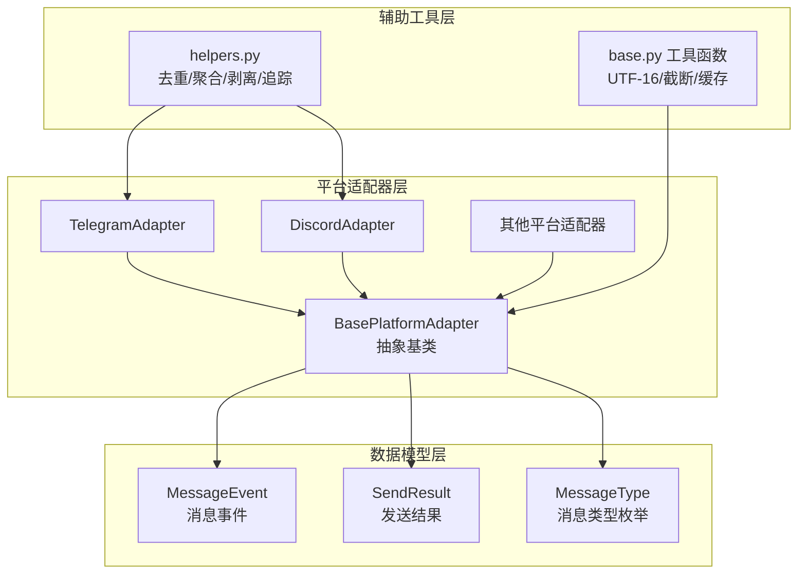
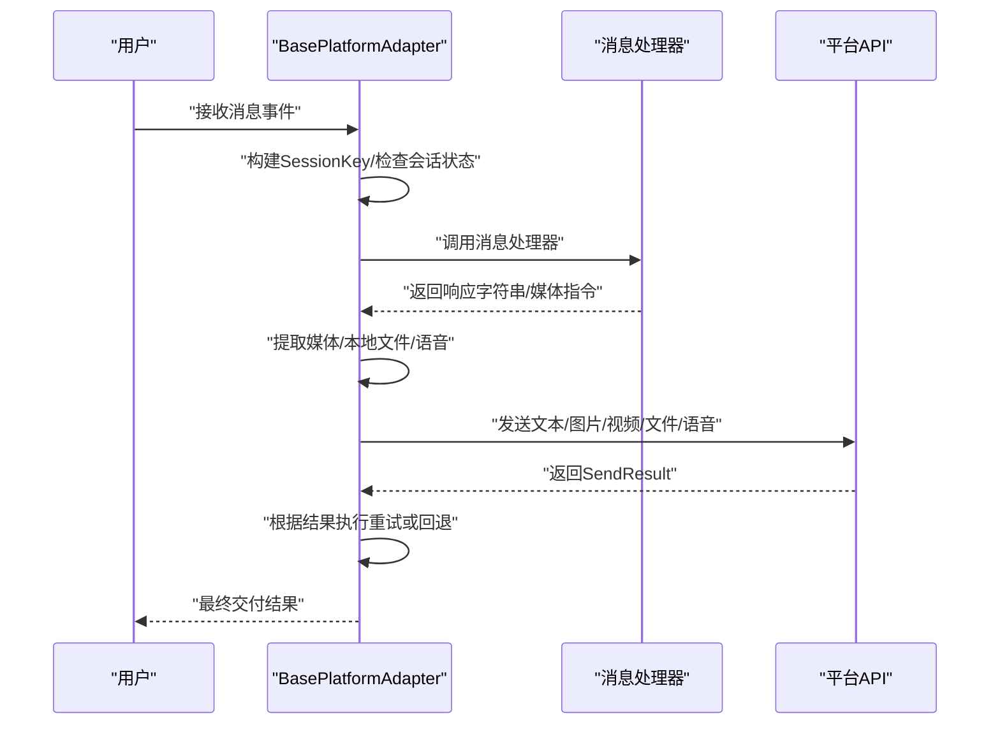
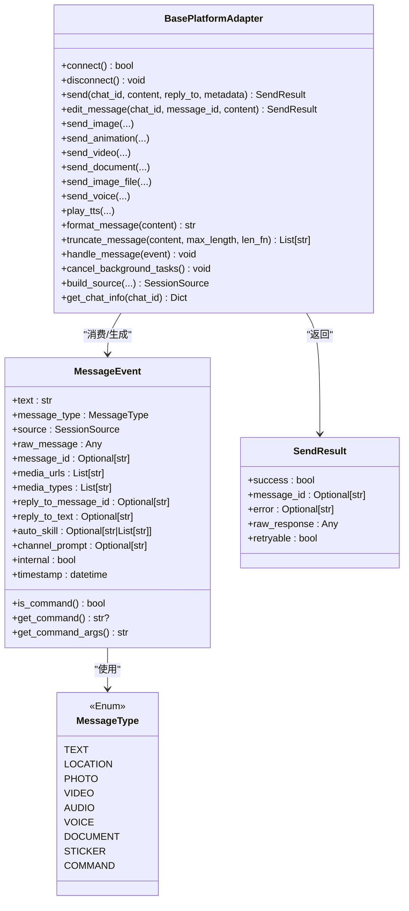
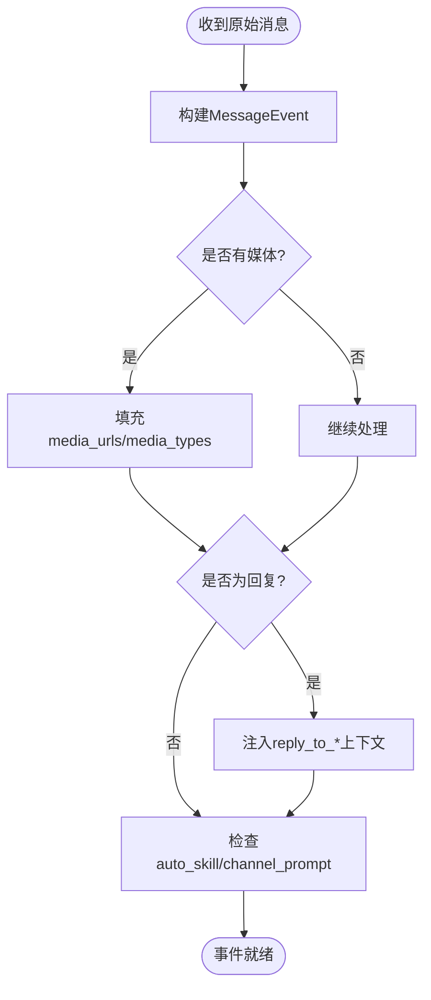
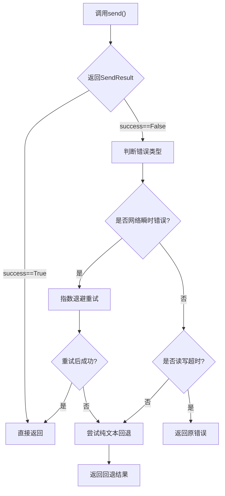
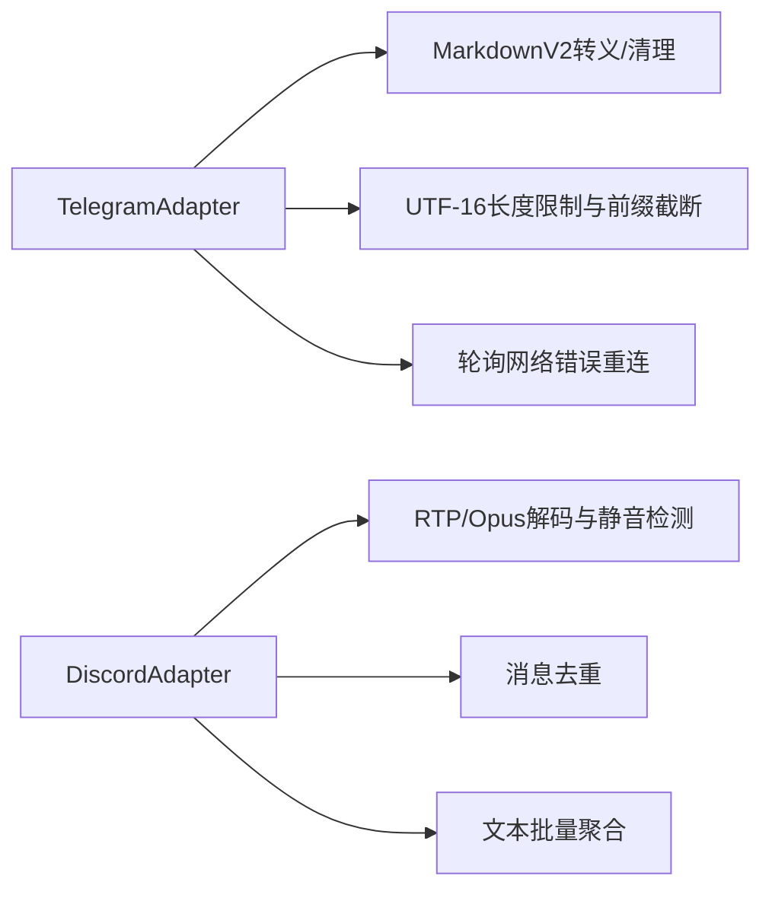
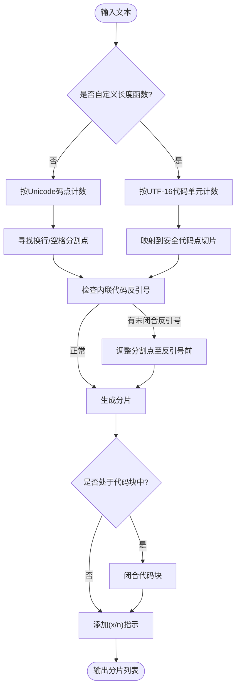
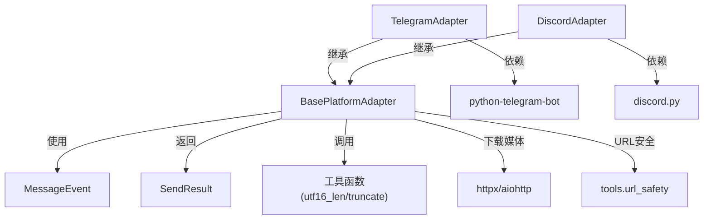

# 基础平台适配器

<cite>
**本文档引用的文件**
- [gateway/platforms/base.py](file://gateway/platforms/base.py)
- [gateway/platforms/__init__.py](file://gateway/platforms/__init__.py)
- [gateway/platforms/helpers.py](file://gateway/platforms/helpers.py)
- [gateway/platforms/telegram.py](file://gateway/platforms/telegram.py)
- [gateway/platforms/discord.py](file://gateway/platforms/discord.py)
</cite>

## 目录
1. [简介](#简介)
2. [项目结构](#项目结构)
3. [核心组件](#核心组件)
4. [架构总览](#架构总览)
5. [详细组件分析](#详细组件分析)
6. [依赖分析](#依赖分析)
7. [性能考虑](#性能考虑)
8. [故障排查指南](#故障排查指南)
9. [结论](#结论)
10. [附录：平台适配器开发指南](#附录平台适配器开发指南)

## 简介
本文件面向Hermes Agent基础平台适配器，系统性阐述抽象基类的设计理念与统一接口规范，详解消息事件模型MessageEvent的数据结构与字段语义（文本内容、媒体附件、回复上下文等），解释发送结果SendResult的标准化返回格式与错误处理机制；同时覆盖消息类型枚举MessageType的定义及平台特定媒体处理策略，包含消息长度计算、UTF-16编码处理与字符边界保护，以及平台适配器开发的基础框架与最佳实践。

## 项目结构
Hermes Agent的平台适配器位于gateway/platforms目录，采用“抽象基类 + 具体平台实现”的分层设计：
- 抽象基类：统一接口、通用工具函数、消息处理流程与错误重试策略
- 平台实现：Telegram、Discord等具体适配器继承抽象基类，实现平台特定逻辑
- 辅助模块：helpers.py提供消息去重、文本聚合、Markdown剥离、线程参与追踪等可复用能力

**图表来源**
- [gateway/platforms/base.py:634-731](file://gateway/platforms/base.py#L634-L731)
- [gateway/platforms/telegram.py:121-200](file://gateway/platforms/telegram.py#L121-L200)
- [gateway/platforms/discord.py:1-60](file://gateway/platforms/discord.py#L1-L60)
- [gateway/platforms/helpers.py:1-60](file://gateway/platforms/helpers.py#L1-L60)

**章节来源**
- [gateway/platforms/__init__.py:1-20](file://gateway/platforms/__init__.py#L1-L20)
- [gateway/platforms/base.py:844-1046](file://gateway/platforms/base.py#L844-L1046)

## 核心组件
本节聚焦抽象基类提供的统一接口与通用能力，包括：
- 统一的消息发送接口与扩展媒体发送方法
- 消息事件模型MessageEvent的字段与语义
- 发送结果SendResult的标准化返回
- 消息类型枚举MessageType与平台特定媒体处理
- 消息长度计算、UTF-16编码处理与字符边界保护
- 错误分类与自动重试策略

要点摘要：
- 抽象基类定义了connect/disconnect/send/edit_message等统一接口，子类按需覆盖
- MessageEvent标准化所有平台的输入，包含文本、媒体、回复上下文、通道提示等
- SendResult统一承载成功/失败、错误信息、是否可重试等元信息
- truncate_message支持按平台自定义长度单位（如UTF-16）进行安全截断
- _send_with_retry提供网络瞬时错误的指数退避重试与格式化回退

**章节来源**
- [gateway/platforms/base.py:1012-1068](file://gateway/platforms/base.py#L1012-L1068)
- [gateway/platforms/base.py:655-721](file://gateway/platforms/base.py#L655-L721)
- [gateway/platforms/base.py:723-731](file://gateway/platforms/base.py#L723-L731)
- [gateway/platforms/base.py:634-645](file://gateway/platforms/base.py#L634-L645)
- [gateway/platforms/base.py:2034-2165](file://gateway/platforms/base.py#L2034-L2165)
- [gateway/platforms/base.py:1454-1534](file://gateway/platforms/base.py#L1454-L1534)

## 架构总览
抽象基类作为核心枢纽，向上承接消息处理器，向下对接各平台SDK，提供统一的生命周期钩子、媒体处理、重试与错误处理能力。

**图表来源**
- [gateway/platforms/base.py:1552-1957](file://gateway/platforms/base.py#L1552-L1957)

## 详细组件分析

### 抽象基类：BasePlatformAdapter
- 设计目标：为不同平台提供一致的连接、认证、消息收发、媒体处理与错误处理接口
- 关键职责：
  - 生命周期管理：connect/disconnect、运行状态标记、致命错误上报
  - 消息处理：handle_message调度、会话并发控制、中断与挂起消息队列
  - 发送封装：send/edit_message、媒体发送（图片/动画/视频/文档/语音）、TTS播放
  - 可靠性：_send_with_retry自动重试、错误模式识别、格式化回退
  - 工具函数：truncate_message（含UTF-16边界保护）、extract_images/extract_media/extract_local_files

**图表来源**
- [gateway/platforms/base.py:844-1046](file://gateway/platforms/base.py#L844-L1046)
- [gateway/platforms/base.py:655-721](file://gateway/platforms/base.py#L655-L721)
- [gateway/platforms/base.py:723-731](file://gateway/platforms/base.py#L723-L731)
- [gateway/platforms/base.py:634-645](file://gateway/platforms/base.py#L634-L645)

**章节来源**
- [gateway/platforms/base.py:844-1046](file://gateway/platforms/base.py#L844-L1046)
- [gateway/platforms/base.py:1454-1534](file://gateway/platforms/base.py#L1454-L1534)
- [gateway/platforms/base.py:2034-2165](file://gateway/platforms/base.py#L2034-L2165)

### 消息事件模型：MessageEvent
- 字段语义：
  - 文本内容与类型：text、message_type
  - 来源信息：source（包含平台、聊天ID、线程ID、话题等）
  - 原始数据与消息ID：raw_message、message_id
  - 媒体附件：media_urls（本地路径供视觉/语音工具访问）、media_types
  - 回复上下文：reply_to_message_id、reply_to_text（用于注入上下文）
  - 自动技能与通道提示：auto_skill、channel_prompt
  - 内部事件标志：internal（用于后台通知等）
  - 时间戳：timestamp
- 行为方法：
  - is_command/get_command/get_command_args用于命令解析与参数提取

**图表来源**
- [gateway/platforms/base.py:655-721](file://gateway/platforms/base.py#L655-L721)

**章节来源**
- [gateway/platforms/base.py:655-721](file://gateway/platforms/base.py#L655-L721)

### 发送结果：SendResult
- 字段语义：
  - success：是否成功
  - message_id：平台返回的消息ID（若可用）
  - error：错误描述（若存在）
  - raw_response：底层响应对象（调试用）
  - retryable：是否为瞬时连接错误（可自动重试）
- 错误处理：
  - _is_retryable_error识别网络瞬时错误模式
  - _send_with_retry对可重试错误进行指数退避重试
  - 对非网络/超时错误尝试纯文本回退

**图表来源**
- [gateway/platforms/base.py:1434-1534](file://gateway/platforms/base.py#L1434-L1534)

**章节来源**
- [gateway/platforms/base.py:723-731](file://gateway/platforms/base.py#L723-L731)
- [gateway/platforms/base.py:1434-1534](file://gateway/platforms/base.py#L1434-L1534)

### 消息类型枚举：MessageType
- 定义：TEXT、LOCATION、PHOTO、VIDEO、AUDIO、VOICE、DOCUMENT、STICKER、COMMAND
- 用途：统一平台间的消息类型映射，便于在抽象层进行分支处理与媒体路由

**章节来源**
- [gateway/platforms/base.py:634-645](file://gateway/platforms/base.py#L634-L645)

### 平台特定媒体处理
- TelegramAdapter：
  - 支持MarkdownV2转义与清理、链接预览控制、轮询网络错误重连、DM主题线程管理
  - 长消息截断遵循Telegram UTF-16限制，避免字符边界破坏
- DiscordAdapter：
  - 提供语音接收器（RTP解密、Opus解码、静音检测）与线程参与追踪
  - 去重器与文本聚合器减少重复与碎片化消息

**图表来源**
- [gateway/platforms/telegram.py:96-118](file://gateway/platforms/telegram.py#L96-L118)
- [gateway/platforms/telegram.py:256-380](file://gateway/platforms/telegram.py#L256-L380)
- [gateway/platforms/discord.py:83-400](file://gateway/platforms/discord.py#L83-L400)
- [gateway/platforms/helpers.py:25-153](file://gateway/platforms/helpers.py#L25-L153)

**章节来源**
- [gateway/platforms/telegram.py:96-118](file://gateway/platforms/telegram.py#L96-L118)
- [gateway/platforms/telegram.py:256-380](file://gateway/platforms/telegram.py#L256-L380)
- [gateway/platforms/discord.py:83-400](file://gateway/platforms/discord.py#L83-L400)
- [gateway/platforms/helpers.py:25-153](file://gateway/platforms/helpers.py#L25-L153)

### 消息长度计算、UTF-16编码与字符边界保护
- utf16_len：以UTF-16代码单元计数，确保与Telegram等平台长度限制一致
- _prefix_within_utf16_limit：二分查找最长安全前缀，避免代理对被截断
- truncate_message：
  - 支持自定义长度函数（默认len，Telegram传入utf16_len）
  - 保持代码块闭合与语言标签一致性
  - 避免内联代码反引号被截断导致解析错误
  - 多段响应添加“(x/n)”指示

**图表来源**
- [gateway/platforms/base.py:24-74](file://gateway/platforms/base.py#L24-L74)
- [gateway/platforms/base.py:2034-2165](file://gateway/platforms/base.py#L2034-L2165)

**章节来源**
- [gateway/platforms/base.py:24-74](file://gateway/platforms/base.py#L24-L74)
- [gateway/platforms/base.py:2034-2165](file://gateway/platforms/base.py#L2034-L2165)

## 依赖分析
- 组件耦合：
  - BasePlatformAdapter与MessageEvent/SendResult强耦合，保证输入输出一致
  - 各平台适配器通过继承获得统一能力，仅在平台差异处覆写
- 外部依赖：
  - Telegram：python-telegram-bot（消息、媒体、回调）
  - Discord：discord.py（消息、语音、线程）
  - HTTP/代理：aiohttp/aiohttp_socks（下载媒体、代理支持）
  - URL安全：tools.url_safety（SSRF防护）

**图表来源**
- [gateway/platforms/base.py:1-240](file://gateway/platforms/base.py#L1-L240)
- [gateway/platforms/telegram.py:20-84](file://gateway/platforms/telegram.py#L20-L84)
- [gateway/platforms/discord.py:27-60](file://gateway/platforms/discord.py#L27-L60)

**章节来源**
- [gateway/platforms/base.py:1-240](file://gateway/platforms/base.py#L1-L240)
- [gateway/platforms/telegram.py:20-84](file://gateway/platforms/telegram.py#L20-L84)
- [gateway/platforms/discord.py:27-60](file://gateway/platforms/discord.py#L27-L60)

## 性能考虑
- 文本批处理：TextBatchAggregator在高延迟平台（如Telegram）合并快速文本，降低API调用次数
- 媒体缓存：图片/音频/文档本地缓存，避免过期URL与重复下载
- Typing指示：持续发送typing刷新，提升交互体验并缩短感知延迟
- 语音处理：Discord语音接收器在解码前严格处理RTP头、Padding与DAVE加密，避免无效负载
- 重试策略：对瞬时网络错误进行指数退避，避免雪崩效应

[本节为通用指导，无需具体文件分析]

## 故障排查指南
- 连接错误与重试：
  - 检查_send_with_retry日志，确认是否为网络瞬时错误
  - 若为超时且非网络错误，避免重试以防止重复投递
- Telegram轮询冲突：
  - 观察“另一个进程正在轮询”错误，等待旧实例释放后重试
  - 超过最大重试次数后标记可重试致命错误
- Discord语音问题：
  - 关注RTP/Opus解码异常与SSRC映射缺失，检查SPEAKING事件与频道成员
- URL安全与SSRF：
  - 下载媒体前校验URL，拦截私网地址与重定向绕过
- 命令与权限：
  - Telegram允许按钮调用者授权白名单配置

**章节来源**
- [gateway/platforms/base.py:1434-1534](file://gateway/platforms/base.py#L1434-L1534)
- [gateway/platforms/telegram.py:256-380](file://gateway/platforms/telegram.py#L256-L380)
- [gateway/platforms/discord.py:205-400](file://gateway/platforms/discord.py#L205-L400)

## 结论
Hermes Agent基础平台适配器通过抽象基类实现了跨平台的一致性与可扩展性：统一的事件模型与发送结果、完善的媒体处理与错误重试、严谨的字符边界保护与平台特性适配。开发者只需继承抽象基类并在必要处覆写平台特定逻辑，即可快速接入新平台并享受统一的工具链与可靠性保障。

[本节为总结，无需具体文件分析]

## 附录：平台适配器开发指南
- 开发步骤
  - 继承BasePlatformAdapter，实现connect/disconnect/send等抽象方法
  - 在handle_message中调用消息处理器，使用_send_with_retry发送响应
  - 如需平台特定功能（如Typing、语音、线程），覆写对应方法
  - 使用truncate_message并传入平台长度函数（如utf16_len）
- 最佳实践
  - 明确消息类型与媒体路由，优先使用平台原生媒体API
  - 合理设置批处理与去重策略，优化用户体验
  - 严格区分网络瞬时错误与格式/权限错误，避免不当重试
  - 使用本地缓存处理易过期URL，降低外部依赖风险
  - 为命令与敏感操作提供权限控制与审批流程

**章节来源**
- [gateway/platforms/base.py:1012-1068](file://gateway/platforms/base.py#L1012-L1068)
- [gateway/platforms/base.py:1454-1534](file://gateway/platforms/base.py#L1454-L1534)
- [gateway/platforms/helpers.py:70-153](file://gateway/platforms/helpers.py#L70-L153)