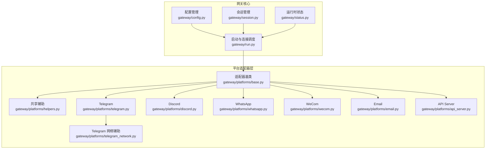
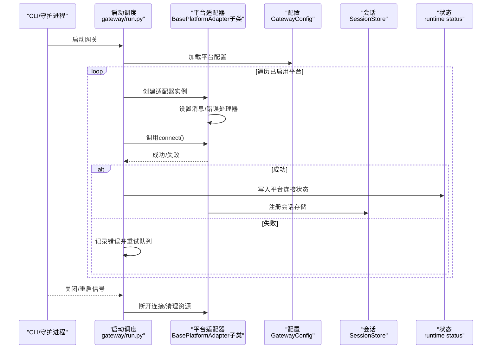
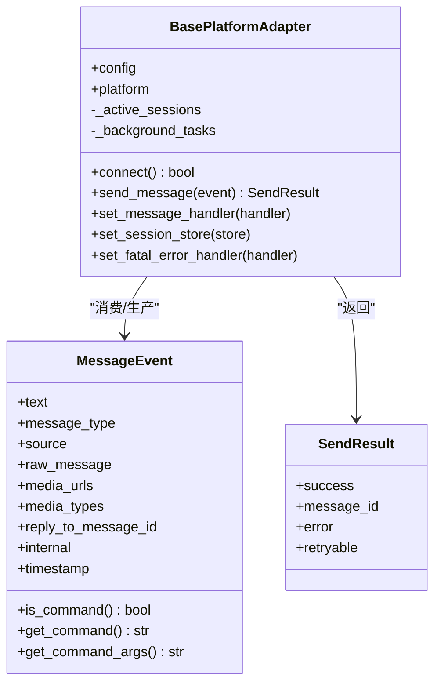
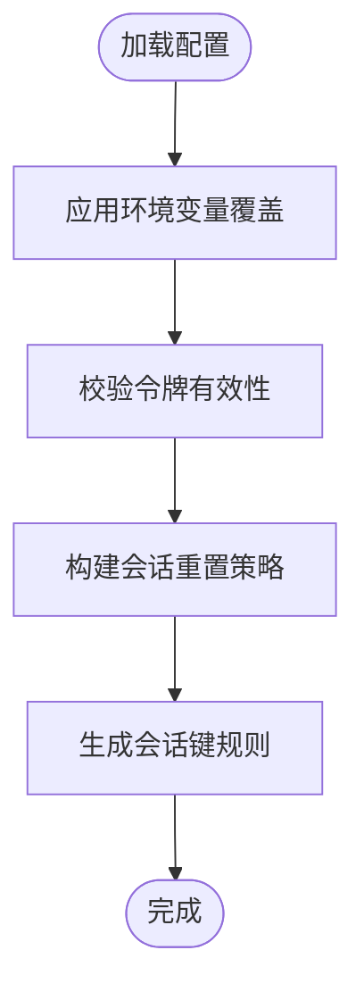
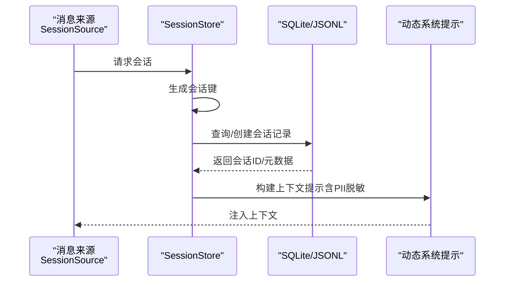
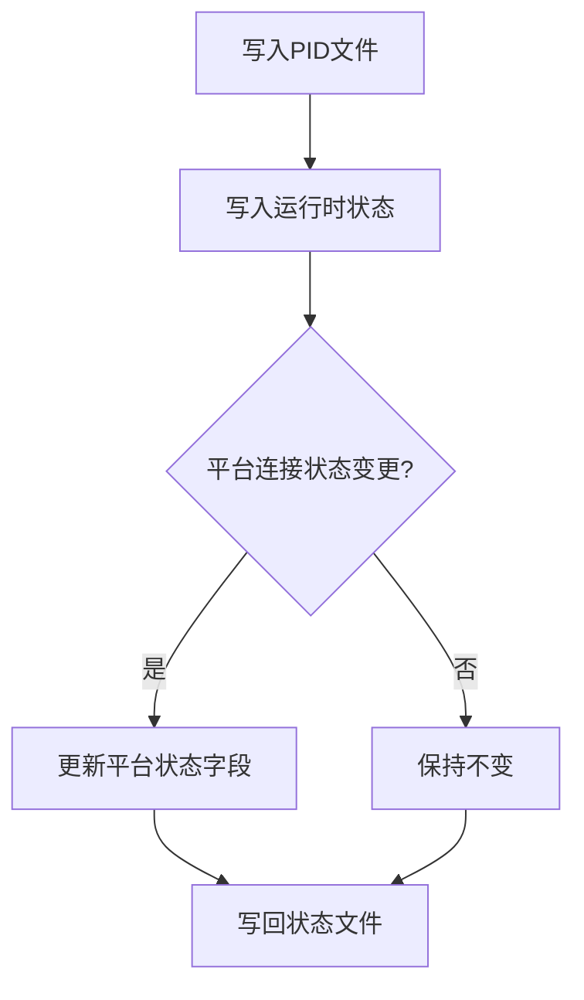
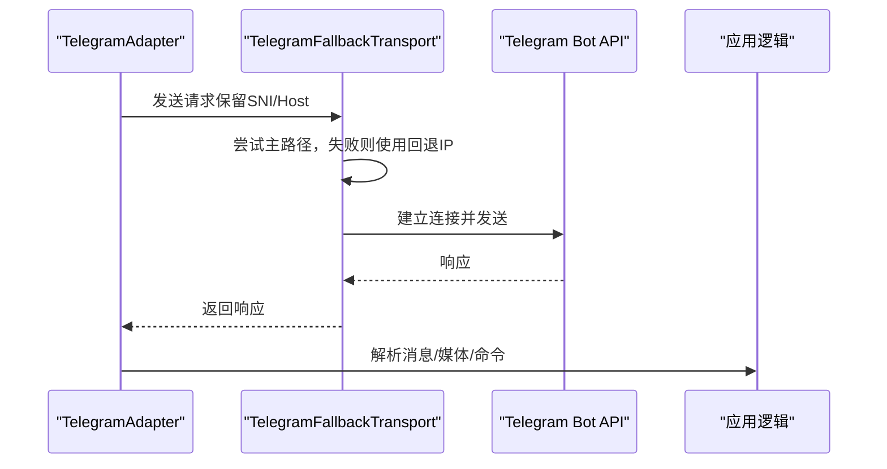
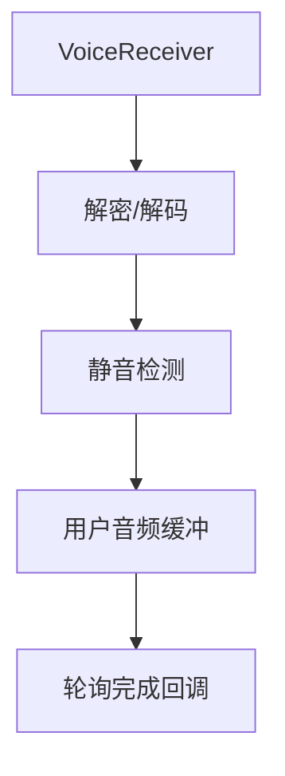
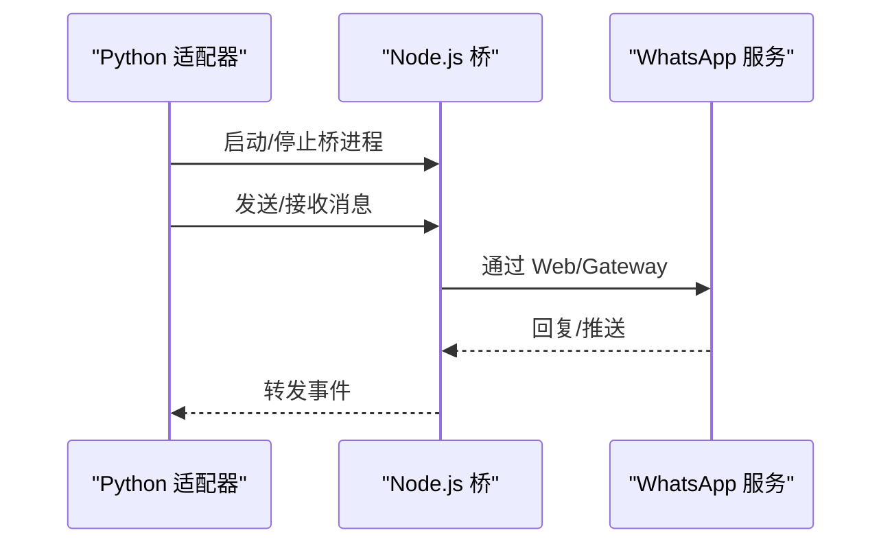
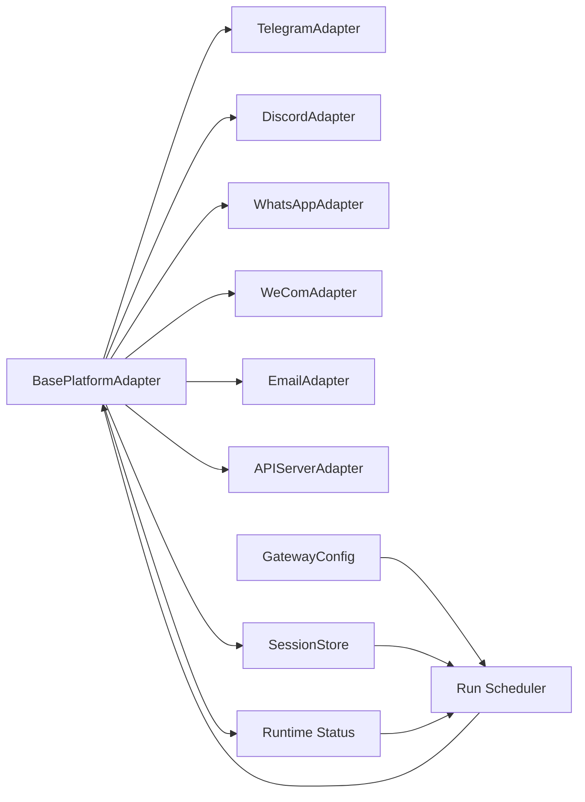

# 平台集成架构

<cite>
**本文档引用的文件**
- [gateway/platforms/base.py](file://gateway/platforms/base.py)
- [gateway/platforms/__init__.py](file://gateway/platforms/__init__.py)
- [gateway/config.py](file://gateway/config.py)
- [gateway/session.py](file://gateway/session.py)
- [gateway/status.py](file://gateway/status.py)
- [gateway/platforms/telegram.py](file://gateway/platforms/telegram.py)
- [gateway/platforms/discord.py](file://gateway/platforms/discord.py)
- [gateway/platforms/whatsapp.py](file://gateway/platforms/whatsapp.py)
- [gateway/platforms/helpers.py](file://gateway/platforms/helpers.py)
- [gateway/platforms/api_server.py](file://gateway/platforms/api_server.py)
- [gateway/platforms/telegram_network.py](file://gateway/platforms/telegram_network.py)
- [gateway/platforms/wecom.py](file://gateway/platforms/wecom.py)
- [gateway/platforms/email.py](file://gateway/platforms/email.py)
- [gateway/run.py](file://gateway/run.py)
- [gateway/pairing.py](file://gateway/pairing.py)
</cite>

## 目录
1. [引言](#引言)
2. [项目结构](#项目结构)
3. [核心组件](#核心组件)
4. [架构总览](#架构总览)
5. [详细组件分析](#详细组件分析)
6. [依赖关系分析](#依赖关系分析)
7. [性能考虑](#性能考虑)
8. [故障排查指南](#故障排查指南)
9. [结论](#结论)
10. [附录](#附录)

## 引言
本文件系统性阐述 Hermes Agent 平台集成架构，重点解析网关系统的整体设计理念与适配器模式的应用，覆盖统一接口设计、消息路由机制、状态同步、认证与安全策略、速率限制与错误恢复，以及新平台适配器开发指南与最佳实践。文档面向不同技术背景的读者，既提供高层概览，也包含代码级细节与可视化图示。

## 项目结构
Hermes Agent 的平台集成位于 gateway 子系统中，采用“统一基类 + 多平台适配器”的架构。核心模块包括：
- 平台适配器基类：定义统一接口与通用能力（消息事件、发送结果、媒体缓存、代理与网络工具等）
- 平台配置管理：集中管理各平台连接参数、会话重置策略、流式传输等
- 会话管理：会话键生成、过期策略、上下文注入与持久化
- 运行时状态：进程 PID 文件、运行健康状态、锁机制
- 具体平台适配器：Telegram、Discord、WhatsApp、WeCom、Email、API Server 等
- 辅助工具：消息去重、文本批聚合、Markdown 去除、线程参与追踪等

**图表来源**
- [gateway/config.py:1-120](file://gateway/config.py#L1-L120)
- [gateway/session.py:1-120](file://gateway/session.py#L1-L120)
- [gateway/status.py:1-120](file://gateway/status.py#L1-L120)
- [gateway/run.py:1857-1920](file://gateway/run.py#L1857-L1920)
- [gateway/platforms/base.py:844-924](file://gateway/platforms/base.py#L844-L924)
- [gateway/platforms/telegram.py:121-173](file://gateway/platforms/telegram.py#L121-L173)
- [gateway/platforms/discord.py:1-120](file://gateway/platforms/discord.py#L1-L120)
- [gateway/platforms/whatsapp.py:103-150](file://gateway/platforms/whatsapp.py#L103-L150)
- [gateway/platforms/wecom.py:141-200](file://gateway/platforms/wecom.py#L141-L200)
- [gateway/platforms/email.py:1-120](file://gateway/platforms/email.py#L1-L120)
- [gateway/platforms/api_server.py:1-120](file://gateway/platforms/api_server.py#L1-L120)
- [gateway/platforms/telegram_network.py:52-120](file://gateway/platforms/telegram_network.py#L52-L120)

**章节来源**
- [gateway/platforms/__init__.py:1-20](file://gateway/platforms/__init__.py#L1-L20)

## 核心组件
本节聚焦网关系统的关键构件及其职责边界。

- 适配器基类（BasePlatformAdapter）
  - 统一抽象：连接/认证、接收消息、发送响应、处理媒体、错误与致命错误上报
  - 通用工具：消息事件模型、发送结果封装、媒体缓存（图片/音频/文档）、代理与网络工具、UTF-16 长度计算与截断
  - 会话与并发：活动会话跟踪、后台任务集合、挂起/中断支持
- 配置管理（GatewayConfig）
  - 平台开关与凭据、Home Channel 默认投递目标、会话重置策略（按日/空闲）、快速命令、流式传输配置
  - 环境变量覆盖与校验（令牌占位符检测、空令牌警告）
- 会话管理（SessionStore）
  - 会话键生成规则（DM/群组/线程/用户隔离）、过期策略（空闲/每日）、SQLite/JSONL 双存储回退
  - 上下文注入（动态系统提示），PII 脱敏策略
- 运行时状态（Gateway Runtime Status）
  - PID 文件与健康状态持久化、平台级状态写入、作用域锁防止多实例冲突

**章节来源**
- [gateway/platforms/base.py:844-924](file://gateway/platforms/base.py#L844-L924)
- [gateway/config.py:221-421](file://gateway/config.py#L221-L421)
- [gateway/session.py:498-771](file://gateway/session.py#L498-L771)
- [gateway/status.py:215-290](file://gateway/status.py#L215-L290)

## 架构总览
Hermes Agent 的平台集成采用“单网关多适配器”模式。启动流程由 run.py 驱动，按配置逐个创建适配器实例，设置消息处理器与错误回调，尝试连接；成功后进入运行态并通过状态文件记录健康信息。平台适配器通过统一基类提供的能力完成消息收发、媒体处理与会话管理。

**图表来源**
- [gateway/run.py:1857-1920](file://gateway/run.py#L1857-L1920)
- [gateway/status.py:220-260](file://gateway/status.py#L220-L260)
- [gateway/platforms/base.py:844-924](file://gateway/platforms/base.py#L844-L924)

## 详细组件分析

### 适配器基类与统一接口
- 接口契约
  - connect(): 异步建立连接，返回布尔值
  - set_message_handler(handler): 注入消息处理回调
  - set_session_store(store): 注入会话存储
  - send_message(event): 发送消息，返回 SendResult
  - set_fatal_error_handler(handler): 注入致命错误回调
- 消息事件与发送结果
  - MessageEvent：统一承载文本、类型、来源、媒体、回复上下文、内部标记、时间戳等
  - SendResult：封装成功/失败、错误码、是否可重试等
- 媒体与缓存
  - 图片/音频/文档本地缓存，支持从字节或URL下载，带SSRF防护与重试
  - 支持 UTF-16 长度计算与前缀截断，满足 Telegram 等平台长度限制
- 代理与网络
  - 通用代理解析（环境变量/macOS系统代理），支持 SOCKS/HTTP
  - Telegram 特殊网络传输：主机名保留的回退IP连接，避免 DNS 污染导致不可达

**图表来源**
- [gateway/platforms/base.py:655-731](file://gateway/platforms/base.py#L655-L731)
- [gateway/platforms/base.py:844-924](file://gateway/platforms/base.py#L844-L924)

**章节来源**
- [gateway/platforms/base.py:24-80](file://gateway/platforms/base.py#L24-L80)
- [gateway/platforms/base.py:315-453](file://gateway/platforms/base.py#L315-L453)
- [gateway/platforms/base.py:554-631](file://gateway/platforms/base.py#L554-L631)
- [gateway/platforms/base.py:634-721](file://gateway/platforms/base.py#L634-L721)
- [gateway/platforms/base.py:723-731](file://gateway/platforms/base.py#L723-L731)

### 配置管理与会话策略
- 平台配置
  - 平台枚举、Home Channel、回复线程模式、额外扩展字段
  - 环境变量覆盖与校验（令牌占位符检测、空令牌警告）
- 会话重置策略
  - 按日/空闲/两者皆可/不自动重置
  - 会话键生成规则：DM/群组/线程/用户隔离
- 流式传输
  - 编辑式增量更新、编辑间隔、缓冲阈值、光标样式

**图表来源**
- [gateway/config.py:435-499](file://gateway/config.py#L435-L499)
- [gateway/config.py:700-767](file://gateway/config.py#L700-L767)
- [gateway/session.py:439-495](file://gateway/session.py#L439-L495)

**章节来源**
- [gateway/config.py:48-187](file://gateway/config.py#L48-L187)
- [gateway/config.py:221-421](file://gateway/config.py#L221-L421)
- [gateway/session.py:439-495](file://gateway/session.py#L439-L495)

### 会话管理与状态同步
- 会话键生成
  - DM：chat_id/thread_id 优先，否则回退到 thread_id 或共享会话
  - 群组/频道：chat_id/thread_id，可按用户隔离或共享线程
- 过期与重置
  - 基于空闲分钟数与每日边界检查，支持主动暂停与历史计数
- 上下文注入
  - 动态系统提示：来源平台/聊天/话题、Home Channel、交付选项、平台行为说明
- PII 脱敏
  - 对 Telegram/Signal/WhatsApp 等平台脱敏用户/聊天 ID，保留路由原始值

**图表来源**
- [gateway/session.py:439-495](file://gateway/session.py#L439-L495)
- [gateway/session.py:186-328](file://gateway/session.py#L186-L328)
- [gateway/session.py:686-771](file://gateway/session.py#L686-L771)

**章节来源**
- [gateway/session.py:65-137](file://gateway/session.py#L65-L137)
- [gateway/session.py:186-328](file://gateway/session.py#L186-L328)
- [gateway/session.py:439-495](file://gateway/session.py#L439-L495)
- [gateway/session.py:686-771](file://gateway/session.py#L686-L771)

### 运行时状态与健康监控
- PID 文件与进程存在性验证
- 运行时状态持久化（gateway_state、平台状态、错误码/消息、更新时间）
- 作用域锁：防止同一外部身份在不同工作目录重复运行

**图表来源**
- [gateway/status.py:215-260](file://gateway/status.py#L215-L260)
- [gateway/status.py:292-378](file://gateway/status.py#L292-L378)

**章节来源**
- [gateway/status.py:32-120](file://gateway/status.py#L32-L120)
- [gateway/status.py:215-260](file://gateway/status.py#L215-L260)
- [gateway/status.py:292-378](file://gateway/status.py#L292-L378)

### 平台适配器：Telegram
- 能力要点
  - 使用 python-telegram-bot，支持论坛主题（线程）、MarkdownV2 转义/还原、媒体组合并、链接预览控制
  - 文本批聚合（长消息拆分）、相册批聚合（防自我中断）、DM Topics 映射
  - Telegram 网络回退：DoH 解析、主机名保留的回退IP连接
- 安全与限流
  - UTF-16 长度限制与截断、SSRF 防护、代理支持
  - 文本批延迟与分割阈值，避免客户端侧拆分造成的多次触发

**图表来源**
- [gateway/platforms/telegram.py:121-173](file://gateway/platforms/telegram.py#L121-L173)
- [gateway/platforms/telegram_network.py:52-120](file://gateway/platforms/telegram_network.py#L52-L120)

**章节来源**
- [gateway/platforms/telegram.py:121-200](file://gateway/platforms/telegram.py#L121-L200)
- [gateway/platforms/telegram_network.py:185-226](file://gateway/platforms/telegram_network.py#L185-L226)

### 平台适配器：Discord
- 能力要点
  - 使用 discord.py，支持语音接收（DAVE E2EE 解密、Opus 解码、静音检测）
  - 线程参与追踪、消息去重、提及/自由回复/忽略通道等策略
- 安全与限流
  - URL 安全检查、SSRF 防护、代理支持
  - 线程归档时长限制、提及模式匹配

**图表来源**
- [gateway/platforms/discord.py:83-159](file://gateway/platforms/discord.py#L83-L159)

**章节来源**
- [gateway/platforms/discord.py:1-120](file://gateway/platforms/discord.py#L1-L120)
- [gateway/platforms/discord.py:83-159](file://gateway/platforms/discord.py#L83-L159)

### 平台适配器：WhatsApp
- 能力要点
  - 通过 Node.js 桥接（whatsapp-web.js/Baileys/Business API）实现 HTTP/IPC 通信
  - 会话数据持久化、回复前缀、提及模式、端口占用清理
- 安全与限流
  - Node.js 可执行性检查、端口占用清理、SSRF 防护（媒体下载）

**图表来源**
- [gateway/platforms/whatsapp.py:103-150](file://gateway/platforms/whatsapp.py#L103-L150)

**章节来源**
- [gateway/platforms/whatsapp.py:84-150](file://gateway/platforms/whatsapp.py#L84-L150)

### 平台适配器：WeCom（企业微信）
- 能力要点
  - WebSocket 持久连接，订阅/回调/上传媒体/心跳
  - 允许列表策略（DM/群组/指定群组）、消息去重、文本批聚合
- 安全与限流
  - 严格媒体大小限制、分片上传、心跳保活、重连退避

**章节来源**
- [gateway/platforms/wecom.py:141-200](file://gateway/platforms/wecom.py#L141-L200)

### 平台适配器：Email
- 能力要点
  - IMAP 接收、SMTP 发送、自动化邮件识别与忽略、HTML/纯文本提取、附件缓存
- 安全与限流
  - 自动化邮件头识别、附件缓存、SSRF 防护

**章节来源**
- [gateway/platforms/email.py:1-120](file://gateway/platforms/email.py#L1-L120)

### 平台适配器：API Server（OpenAI 兼容）
- 能力要点
  - 提供 /v1/chat/completions、/v1/responses、/v1/models、/v1/runs 等端点
  - 响应存储（SQLite LRU）、内容规范化（数组/文本）、SSE 事件流
- 安全与限流
  - 请求体大小限制、内容深度/列表/长度限制、SQLite 存储回退

**章节来源**
- [gateway/platforms/api_server.py:1-120](file://gateway/platforms/api_server.py#L1-L120)

### 共享辅助模块
- 消息去重：基于 TTL 的消息 ID 缓存
- 文本批聚合：将快速连续文本事件合并为单次处理
- Markdown 去除：为不支持富文本的平台剥离格式
- 线程参与追踪：持久化记录参与过的线程

**章节来源**
- [gateway/platforms/helpers.py:25-153](file://gateway/platforms/helpers.py#L25-L153)
- [gateway/platforms/helpers.py:169-184](file://gateway/platforms/helpers.py#L169-L184)
- [gateway/platforms/helpers.py:190-249](file://gateway/platforms/helpers.py#L190-L249)

### 认证与配对机制
- 平台配对与授权
  - 生成一次性配对码、速率限制与锁定策略、批准/撤销用户
- 运行时错误与致命错误
  - 适配器可设置致命错误处理器，上报错误码与消息，决定是否可重试

**章节来源**
- [gateway/pairing.py:150-285](file://gateway/pairing.py#L150-L285)
- [gateway/platforms/base.py:902-924](file://gateway/platforms/base.py#L902-L924)

## 依赖关系分析
- 组件耦合
  - 适配器基类与具体平台适配器：继承关系，低耦合高内聚
  - 配置与会话：通过接口注入，运行时解耦
  - 状态模块：仅通过约定文件与写入接口交互，避免循环依赖
- 外部依赖
  - 平台库（python-telegram-bot、discord.py、aiohttp/httpx 等）
  - 系统工具（Node.js、netstat/fuser、macOS scutil）
- 潜在风险
  - 网络不可达（Telegram 回退）、代理配置缺失、令牌占位符、媒体下载失败

**图表来源**
- [gateway/platforms/base.py:844-924](file://gateway/platforms/base.py#L844-L924)
- [gateway/run.py:1857-1920](file://gateway/run.py#L1857-L1920)
- [gateway/config.py:221-421](file://gateway/config.py#L221-L421)
- [gateway/session.py:498-573](file://gateway/session.py#L498-L573)
- [gateway/status.py:215-260](file://gateway/status.py#L215-L260)

**章节来源**
- [gateway/run.py:1857-1920](file://gateway/run.py#L1857-L1920)

## 性能考虑
- 媒体缓存与重试
  - 图片/音频/文档本地缓存，支持指数退避重试，降低上游不稳定影响
- 文本批聚合
  - 长消息拆分与静默合并，减少平台侧多次触发
- 会话键与存储
  - 合理的会话隔离策略，避免不必要的上下文膨胀
- 网络回退
  - Telegram DoH 解析与回退IP，提升网络受限场景可用性

**章节来源**
- [gateway/platforms/base.py:371-432](file://gateway/platforms/base.py#L371-L432)
- [gateway/platforms/base.py:490-551](file://gateway/platforms/base.py#L490-L551)
- [gateway/platforms/telegram_network.py:185-226](file://gateway/platforms/telegram_network.py#L185-L226)

## 故障排查指南
- 常见问题定位
  - 令牌无效/占位符：查看配置校验日志与空令牌警告
  - 网络不可达：检查代理配置、Telegram 回退IP发现、SSRF 防护
  - 媒体下载失败：确认 URL 安全性、重试次数与超时
  - 会话重置异常：核对重置策略（空闲/每日）、会话键生成规则
- 运行时诊断
  - 查看 PID 文件与运行时状态文件，确认平台连接状态
  - 使用作用域锁排查多实例冲突
- 错误恢复
  - 适配器致命错误回调用于上报与重试决策
  - 启动重试队列与平台断线重连

**章节来源**
- [gateway/config.py:700-767](file://gateway/config.py#L700-L767)
- [gateway/status.py:215-290](file://gateway/status.py#L215-L290)
- [gateway/run.py:2199-2226](file://gateway/run.py#L2199-L2226)

## 结论
Hermes Agent 的平台集成以适配器模式为核心，通过统一基类抽象平台差异，结合配置驱动、会话管理与运行时状态，实现了跨平台的一致体验。Telegram 的网络回退、Discord 的语音接收、WhatsApp 的桥接模式、WeCom 的企业级特性与 Email/API Server 的开放接口，共同构成了灵活、可扩展且安全的集成体系。建议在新增平台时遵循统一接口、共享工具与测试规范，确保一致性与可维护性。

## 附录

### 新平台适配器开发指南
- 必备步骤
  - 实现 BasePlatformAdapter 子类，完成 connect()/send_message() 等方法
  - 在 gateway/platforms/__init__.py 中导出适配器
  - 在 GatewayConfig.Platform 中注册平台枚举
  - 编写测试（构造、消息事件、发送、平台特性）
- 最佳实践
  - 使用共享工具（媒体缓存、代理解析、UTF-16 截断）
  - 明确错误分类（可重试/致命），合理设置重试与告警
  - 遵循会话键规则，避免上下文泄露与歧义
  - 文档与环境变量齐备，便于用户部署与排障

**章节来源**
- [gateway/platforms/__init__.py:11-19](file://gateway/platforms/__init__.py#L11-L19)
- [gateway/config.py:48-70](file://gateway/config.py#L48-L70)
- [gateway/platforms/base.py:844-924](file://gateway/platforms/base.py#L844-L924)