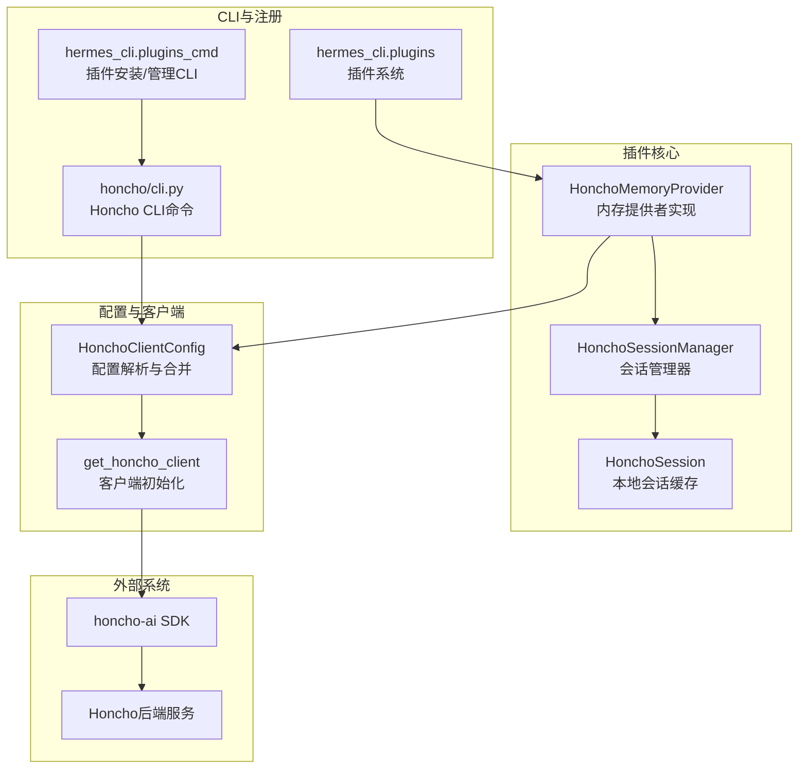
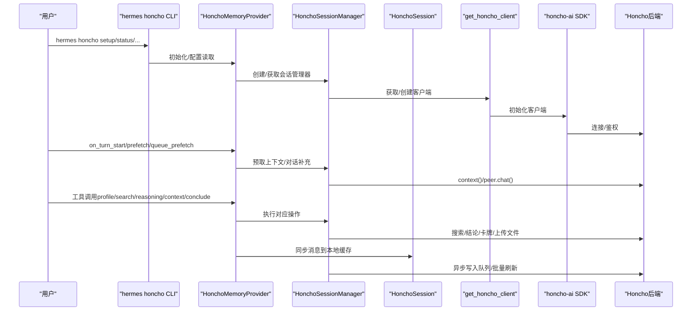
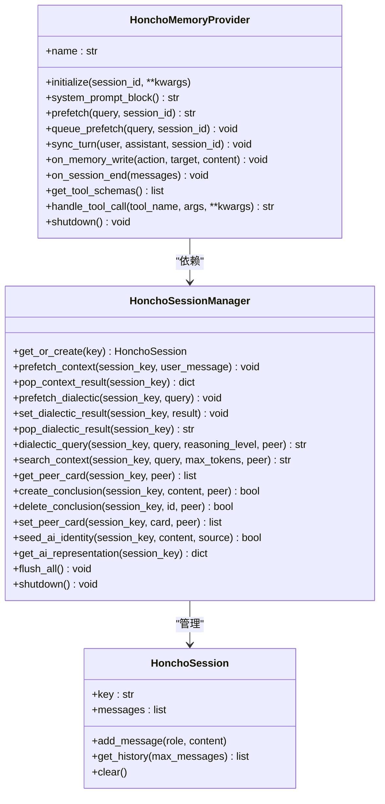
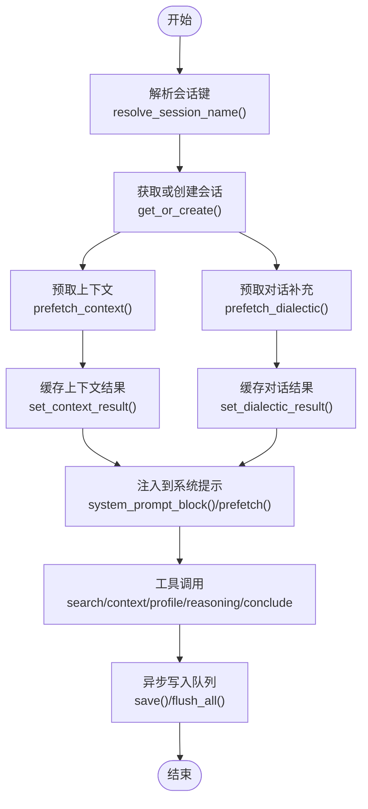
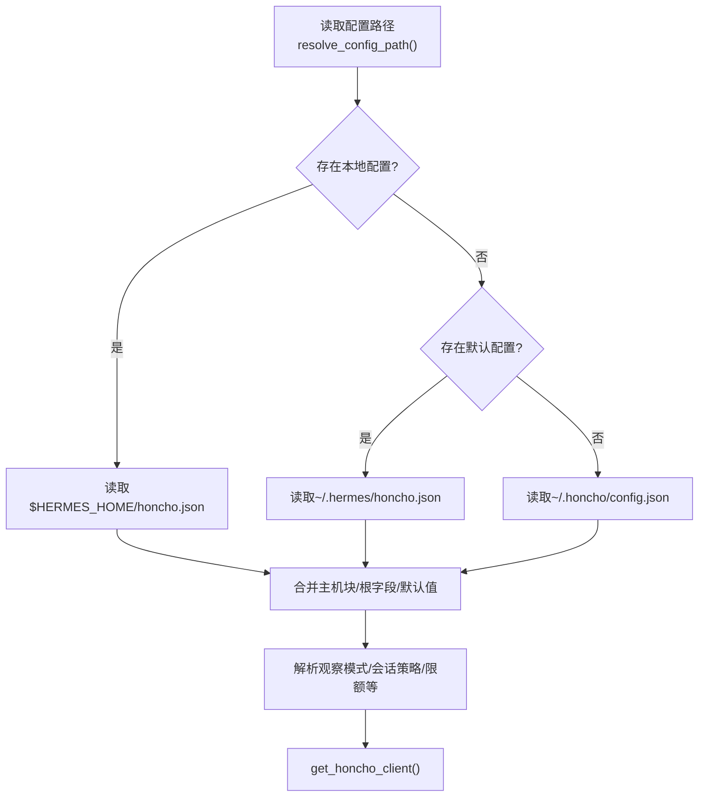
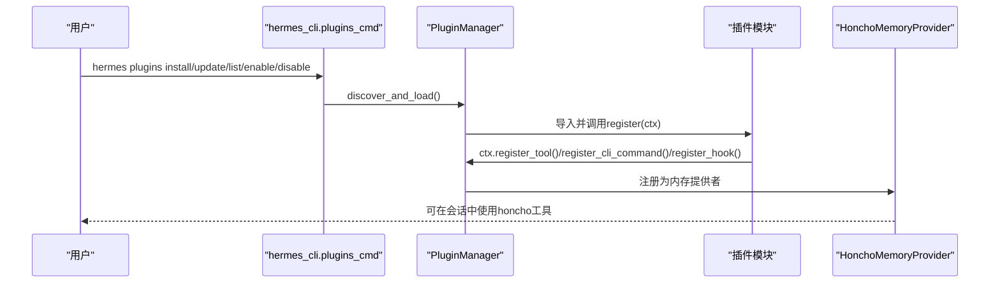
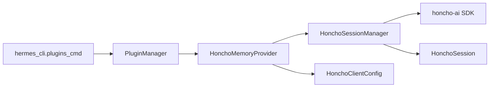

# Honcho插件系统

<cite>
**本文档引用的文件**
- [plugins/memory/honcho/__init__.py](file://plugins/memory/honcho/__init__.py)
- [plugins/memory/honcho/client.py](file://plugins/memory/honcho/client.py)
- [plugins/memory/honcho/session.py](file://plugins/memory/honcho/session.py)
- [plugins/memory/honcho/cli.py](file://plugins/memory/honcho/cli.py)
- [plugins/memory/honcho/plugin.yaml](file://plugins/memory/honcho/plugin.yaml)
- [hermes_cli/plugins.py](file://hermes_cli/plugins.py)
- [hermes_cli/plugins_cmd.py](file://hermes_cli/plugins_cmd.py)
</cite>

## 目录
1. [简介](#简介)
2. [项目结构](#项目结构)
3. [核心组件](#核心组件)
4. [架构总览](#架构总览)
5. [详细组件分析](#详细组件分析)
6. [依赖关系分析](#依赖关系分析)
7. [性能考虑](#性能考虑)
8. [故障排除指南](#故障排除指南)
9. [结论](#结论)

## 简介
本文件面向Hermes Agent的Honcho插件系统，系统性阐述其企业级架构与实现细节，覆盖插件配置、客户端API、会话管理、认证与权限、CLI集成、持久化与状态同步、与外部系统的集成模式、部署与监控、故障恢复、开发调试与性能优化，以及多租户隔离与资源管理。目标是帮助开发者与运维人员快速理解并高效使用该插件。

## 项目结构
Honcho插件位于内存插件子系统中，采用“内存提供者”（MemoryProvider）接口与Hermes Agent深度集成；同时通过独立的CLI命令与配置文件实现用户交互与配置管理。整体结构如下：

图表来源
- [plugins/memory/honcho/__init__.py:186-1055](file://plugins/memory/honcho/__init__.py#L186-L1055)
- [plugins/memory/honcho/session.py:68-1256](file://plugins/memory/honcho/session.py#L68-L1256)
- [plugins/memory/honcho/client.py:214-677](file://plugins/memory/honcho/client.py#L214-L677)
- [hermes_cli/plugins.py:396-800](file://hermes_cli/plugins.py#L396-L800)
- [hermes_cli/plugins_cmd.py:284-595](file://hermes_cli/plugins_cmd.py#L284-L595)
- [plugins/memory/honcho/cli.py:1-800](file://plugins/memory/honcho/cli.py#L1-L800)

章节来源
- [plugins/memory/honcho/__init__.py:1-1055](file://plugins/memory/honcho/__init__.py#L1-L1055)
- [plugins/memory/honcho/session.py:1-1256](file://plugins/memory/honcho/session.py#L1-L1256)
- [plugins/memory/honcho/client.py:1-677](file://plugins/memory/honcho/client.py#L1-L677)
- [hermes_cli/plugins.py:1-844](file://hermes_cli/plugins.py#L1-L844)
- [hermes_cli/plugins_cmd.py:1-1129](file://hermes_cli/plugins_cmd.py#L1-L1129)
- [plugins/memory/honcho/cli.py:1-800](file://plugins/memory/honcho/cli.py#L1-L800)

## 核心组件
- HonchoMemoryProvider：实现MemoryProvider接口，负责插件生命周期、工具schema暴露、上下文预取、对话同步、工具调用处理等。
- HonchoSessionManager：封装与Honcho后端的交互，管理会话、消息缓存、异步写入队列、预取缓存、观察模式、迁移与结论管理等。
- HonchoSession：本地会话缓存，承载消息历史、时间戳与元数据。
- HonchoClientConfig：集中解析与合并配置来源（本地/全局配置、环境变量），并提供会话名解析、观察模式解析等。
- CLI模块：提供hermes honcho子命令，支持设置、状态查询、映射、同伴身份管理等；插件系统支持目录/入口点插件发现与加载。

章节来源
- [plugins/memory/honcho/__init__.py:186-1055](file://plugins/memory/honcho/__init__.py#L186-L1055)
- [plugins/memory/honcho/session.py:68-1256](file://plugins/memory/honcho/session.py#L68-L1256)
- [plugins/memory/honcho/client.py:214-677](file://plugins/memory/honcho/client.py#L214-L677)
- [plugins/memory/honcho/cli.py:1-800](file://plugins/memory/honcho/cli.py#L1-L800)
- [hermes_cli/plugins.py:396-844](file://hermes_cli/plugins.py#L396-L844)
- [hermes_cli/plugins_cmd.py:284-595](file://hermes_cli/plugins_cmd.py#L284-L595)

## 架构总览
下图展示Honcho插件在Hermes中的运行时交互与数据流：

图表来源
- [plugins/memory/honcho/__init__.py:506-1035](file://plugins/memory/honcho/__init__.py#L506-L1035)
- [plugins/memory/honcho/session.py:324-452](file://plugins/memory/honcho/session.py#L324-L452)
- [plugins/memory/honcho/client.py:583-677](file://plugins/memory/honcho/client.py#L583-L677)
- [plugins/memory/honcho/cli.py:327-536](file://plugins/memory/honcho/cli.py#L327-L536)

## 详细组件分析

### HonchoMemoryProvider组件
- 职责
  - 插件生命周期管理：初始化、可用性检查、配置保存、工具schema暴露、会话结束清理。
  - 上下文注入：根据recall_mode决定是否自动注入上下文，支持按cadence与注入频率控制。
  - 对话同步：将用户与助手消息分块并异步写入后端，支持turn/session/自定义频率。
  - 工具调用：实现profile/search/reasoning/context/conclude五个工具，支持懒初始化与错误处理。
  - 多租户与策略：支持per-session/per-directory/per-repo/global等会话策略，支持peer前缀与会话映射。
- 关键特性
  - 成本感知：通过context_cadence/dialectic_cadence/dialectic_depth等参数控制调用频率与深度。
  - 安全与合规：对输入进行长度截断与结构化输出检测，避免过长响应；支持PII删除结论。
  - 性能优化：预取线程、后台同步线程、结果缓存、token预算控制。

图表来源
- [plugins/memory/honcho/__init__.py:186-1055](file://plugins/memory/honcho/__init__.py#L186-L1055)
- [plugins/memory/honcho/session.py:24-486](file://plugins/memory/honcho/session.py#L24-L486)

章节来源
- [plugins/memory/honcho/__init__.py:186-1055](file://plugins/memory/honcho/__init__.py#L186-L1055)

### HonchoSessionManager组件
- 会话管理
  - 本地缓存：会话、同伴、会话对象三类缓存，减少重复网络请求。
  - 观察模式：支持“统一/方向性”两种观察模式，可细粒度配置每个同伴的观察开关。
  - 异步写入：后台队列与重试逻辑，确保高吞吐下的可靠性。
- 数据访问
  - 上下文预取：并发获取session摘要、peer表示与卡牌，支持后续注入。
  - 对话补充：基于dialectic推理生成补充内容，支持多轮pass与信号强度判断。
  - 搜索与结论：语义搜索、结论增删、卡牌更新、AI身份种子注入。
- 迁移与兼容
  - 历史迁移：将本地JSONL转XML格式上传为文件，保留时间范围与上下文。
  - 内存文件迁移：将MEMORY.md/USER.md/SOUL.md作为记忆文件上传。

图表来源
- [plugins/memory/honcho/session.py:510-624](file://plugins/memory/honcho/session.py#L510-L624)
- [plugins/memory/honcho/__init__.py:506-675](file://plugins/memory/honcho/__init__.py#L506-L675)

章节来源
- [plugins/memory/honcho/session.py:68-1256](file://plugins/memory/honcho/session.py#L68-L1256)

### HonchoClientConfig与客户端初始化
- 配置来源与优先级
  - 本地配置：$HERMES_HOME/honcho.json（实例隔离）
  - 全局配置：~/.honcho/config.json（跨应用互操作）
  - 环境变量：HONCHO_API_KEY/HONCHO_BASE_URL/HONCHO_TIMEOUT等
  - 主机块：hosts.hermes或hermes.<profile>主机块覆盖
- 关键能力
  - 会话名解析：支持per-session/per-repo/per-directory/global策略，支持peer前缀与手动映射。
  - 观察模式解析：从字符串模式或细粒度对象解析为布尔开关。
  - 客户端初始化：延迟初始化单例，支持本地/云环境切换与超时配置。

图表来源
- [plugins/memory/honcho/client.py:56-492](file://plugins/memory/honcho/client.py#L56-L492)
- [plugins/memory/honcho/client.py:583-677](file://plugins/memory/honcho/client.py#L583-L677)

章节来源
- [plugins/memory/honcho/client.py:1-677](file://plugins/memory/honcho/client.py#L1-L677)

### CLI与插件系统集成
- 插件系统
  - 发现与加载：支持用户插件目录、项目插件目录、pip入口点三种来源。
  - 生命周期钩子：支持pre/post工具调用、LLM调用、会话开始/结束/重置等。
  - 工具与命令注册：向全局工具注册表注册工具，向CLI注册子命令与斜杠命令。
- Honcho CLI
  - setup：交互式配置，支持云/本地部署、API密钥、同伴身份、观察模式、写入频率、召回模式、上下文预算、对话周期等。
  - status：显示当前配置、连接状态、同伴卡牌与AI表示。
  - sessions/map/peers：会话映射、同伴身份查看与更新。
  - 同步：将配置同步到所有已知profile。

图表来源
- [hermes_cli/plugins_cmd.py:284-595](file://hermes_cli/plugins_cmd.py#L284-L595)
- [hermes_cli/plugins.py:396-844](file://hermes_cli/plugins.py#L396-L844)
- [plugins/memory/honcho/__init__.py:1052-1055](file://plugins/memory/honcho/__init__.py#L1052-L1055)

章节来源
- [hermes_cli/plugins.py:1-844](file://hermes_cli/plugins.py#L1-L844)
- [hermes_cli/plugins_cmd.py:1-1129](file://hermes_cli/plugins_cmd.py#L1-L1129)
- [plugins/memory/honcho/cli.py:1-800](file://plugins/memory/honcho/cli.py#L1-L800)

## 依赖关系分析
- 组件耦合
  - HonchoMemoryProvider强依赖HonchoSessionManager与HonchoClientConfig，形成清晰的职责边界。
  - HonchoSessionManager依赖honcho-ai SDK与后端，内部维护多级缓存与异步队列。
- 外部依赖
  - honcho-ai：用于与后端通信、会话与同伴管理、结论与卡牌操作。
  - PyYAML：用于解析插件清单（在插件系统中）。
- 循环依赖
  - 未见循环导入；各模块通过函数/类接口解耦。

图表来源
- [plugins/memory/honcho/__init__.py:186-1055](file://plugins/memory/honcho/__init__.py#L186-L1055)
- [plugins/memory/honcho/session.py:68-1256](file://plugins/memory/honcho/session.py#L68-L1256)
- [plugins/memory/honcho/client.py:214-677](file://plugins/memory/honcho/client.py#L214-L677)
- [hermes_cli/plugins_cmd.py:284-595](file://hermes_cli/plugins_cmd.py#L284-L595)
- [hermes_cli/plugins.py:396-844](file://hermes_cli/plugins.py#L396-L844)

章节来源
- [plugins/memory/honcho/__init__.py:186-1055](file://plugins/memory/honcho/__init__.py#L186-L1055)
- [plugins/memory/honcho/session.py:68-1256](file://plugins/memory/honcho/session.py#L68-L1256)
- [plugins/memory/honcho/client.py:214-677](file://plugins/memory/honcho/client.py#L214-L677)
- [hermes_cli/plugins.py:396-844](file://hermes_cli/plugins.py#L396-L844)
- [hermes_cli/plugins_cmd.py:284-595](file://hermes_cli/plugins_cmd.py#L284-L595)

## 性能考虑
- 预取与缓存
  - 上下文与对话补充分别缓存，按cadence定期刷新，避免每次请求阻塞响应。
- 异步写入
  - 异步队列与重试机制降低写入延迟与失败率；turn/session/自定义频率策略平衡成本与一致性。
- 成本控制
  - dialectic_depth、dialectic_cadence、context_tokens、message_max_chars等参数可调，以控制后端调用与传输成本。
- 并发与线程
  - 预取与同步均使用守护线程，避免阻塞主流程；线程间通过锁与队列保证一致性。

## 故障排除指南
- 常见问题
  - 无法连接后端：检查API密钥或base_url配置，确认网络可达；查看CLI status输出。
  - 工具不可用：确认recall_mode非context-only；检查插件是否启用。
  - 写入失败：查看异步队列重试日志；检查后端限流或配额。
  - 结论删除失败：确认结论ID正确且具备删除权限。
- 调试建议
  - 使用CLI status查看配置与连接状态。
  - 在工具调用返回错误时，记录tool_name与参数，结合后端日志定位。
  - 在会话结束时调用flush_all确保未同步消息被提交。

章节来源
- [plugins/memory/honcho/cli.py:577-694](file://plugins/memory/honcho/cli.py#L577-L694)
- [plugins/memory/honcho/session.py:424-452](file://plugins/memory/honcho/session.py#L424-L452)
- [plugins/memory/honcho/__init__.py:909-922](file://plugins/memory/honcho/__init__.py#L909-L922)

## 结论
Honcho插件系统通过清晰的内存提供者接口、健壮的会话管理器与灵活的配置体系，实现了企业级的跨会话用户建模与对话记忆。其多租户策略、观察模式、成本控制与异步写入机制，使其既能满足高性能场景，又能兼顾安全与合规。配合完善的CLI与插件系统，用户可以便捷地完成部署、配置、监控与故障排查。