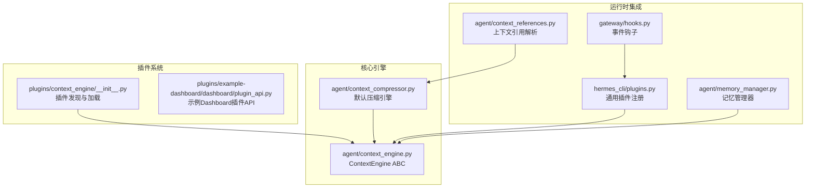
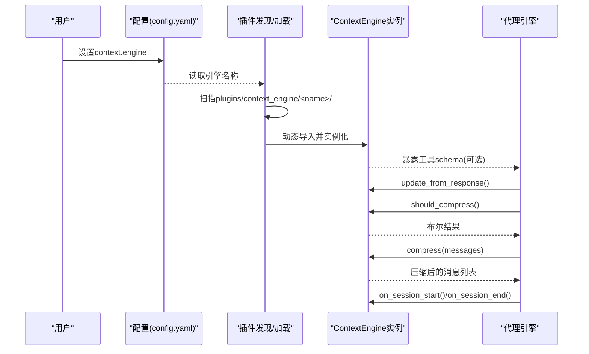
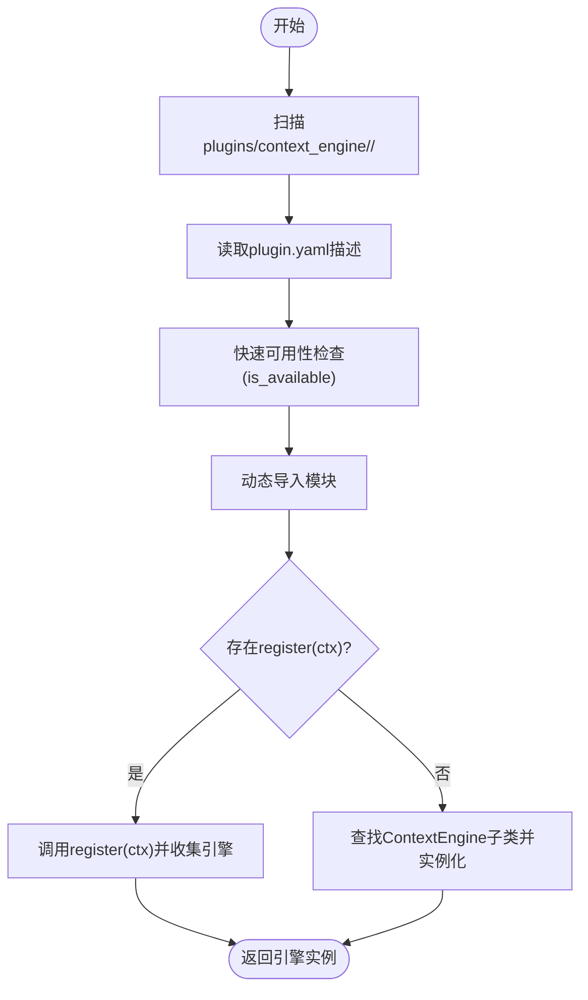
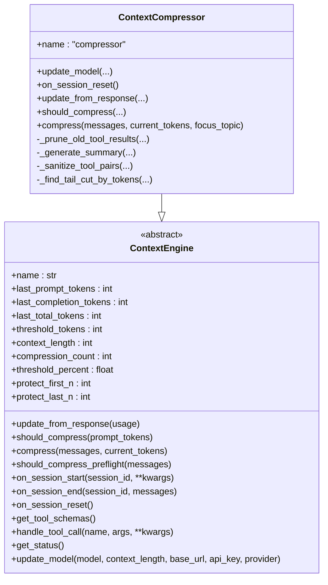
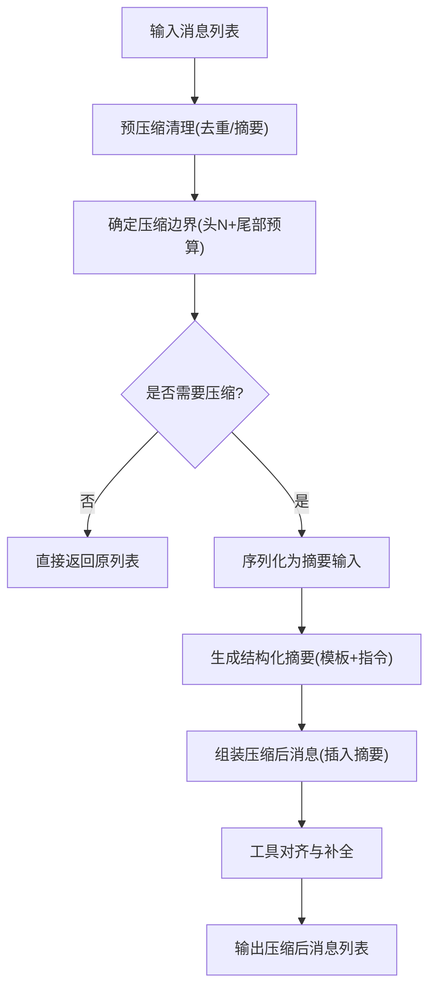
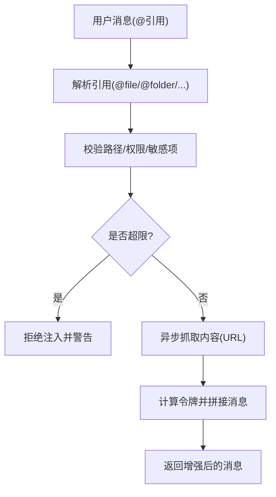
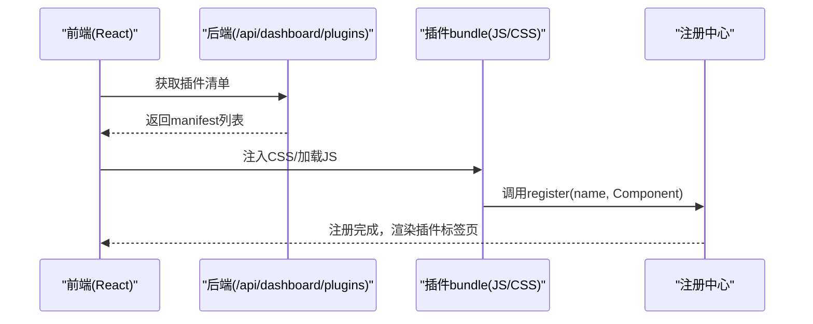
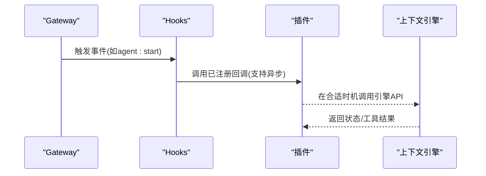
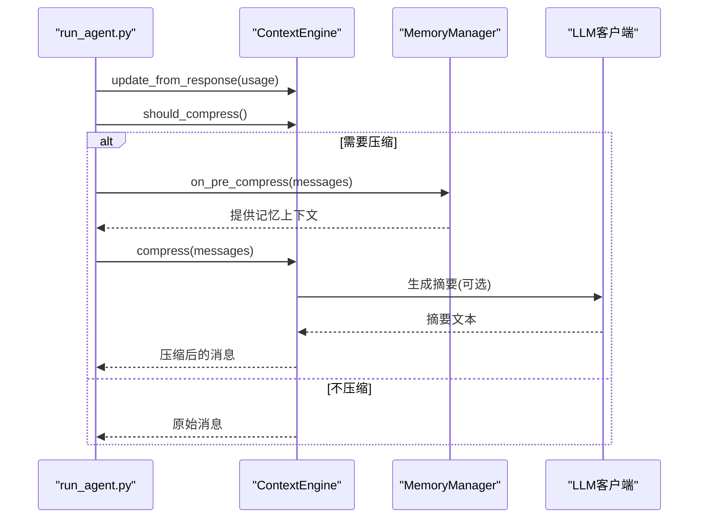
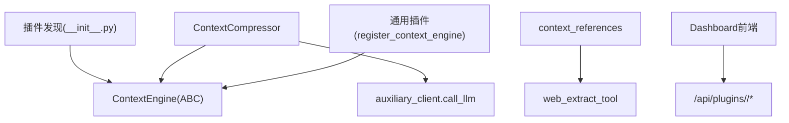

# 上下文引擎插件

<cite>
**本文档引用的文件**
- [plugins/context_engine/__init__.py](file://plugins/context_engine/__init__.py)
- [agent/context_engine.py](file://agent/context_engine.py)
- [agent/context_compressor.py](file://agent/context_compressor.py)
- [plugins/example-dashboard/dashboard/plugin_api.py](file://plugins/example-dashboard/dashboard/plugin_api.py)
- [tests/agent/test_context_engine.py](file://tests/agent/test_context_engine.py)
- [website/docs/developer-guide/context-engine-plugin.md](file://website/docs/developer-guide/context-engine-plugin.md)
- [hermes_cli/plugins.py](file://hermes_cli/plugins.py)
- [gateway/hooks.py](file://gateway/hooks.py)
- [agent/context_references.py](file://agent/context_references.py)
- [agent/memory_manager.py](file://agent/memory_manager.py)
</cite>

## 目录
1. [简介](#简介)
2. [项目结构](#项目结构)
3. [核心组件](#核心组件)
4. [架构总览](#架构总览)
5. [详细组件分析](#详细组件分析)
6. [依赖分析](#依赖分析)
7. [性能考虑](#性能考虑)
8. [故障排除指南](#故障排除指南)
9. [结论](#结论)
10. [附录](#附录)

## 简介
本文件面向Hermes Agent的上下文引擎插件体系，系统性阐述其架构设计、扩展机制与实现细节。重点覆盖以下方面：
- 插件接口定义与生命周期管理
- 配置驱动的动态加载与选择
- 上下文压缩、信息提取与语义理解的职责边界
- 插件API规范、事件处理与回调系统
- dashboard插件的实现模式与UI集成方式
- 性能优化、缓存策略与并发处理
- 开发模板、调试工具与测试方法
- 上下文引擎与代理引擎的协作模式与数据流转

## 项目结构
上下文引擎插件位于独立目录中，与通用插件系统解耦，采用“内置可用、用户显式选择”的模式：
- 插件发现与加载：通过扫描plugins/context_engine/<name>/目录，读取元数据并动态导入
- 引擎实例化：支持两种注册路径（目录导出类或通用插件register）
- 生命周期钩子：会话开始/结束、模型切换、工具调用等

**图表来源**
- [plugins/context_engine/__init__.py:1-220](file://plugins/context_engine/__init__.py#L1-L220)
- [agent/context_engine.py:1-185](file://agent/context_engine.py#L1-L185)
- [agent/context_compressor.py:1-1164](file://agent/context_compressor.py#L1-L1164)
- [plugins/example-dashboard/dashboard/plugin_api.py:1-15](file://plugins/example-dashboard/dashboard/plugin_api.py#L1-L15)
- [hermes_cli/plugins.py:295-328](file://hermes_cli/plugins.py#L295-L328)
- [gateway/hooks.py:147-170](file://gateway/hooks.py#L147-L170)
- [agent/memory_manager.py:1-374](file://agent/memory_manager.py#L1-L374)
- [agent/context_references.py:1-521](file://agent/context_references.py#L1-L521)

**章节来源**
- [plugins/context_engine/__init__.py:1-220](file://plugins/context_engine/__init__.py#L1-L220)
- [website/docs/developer-guide/context-engine-plugin.md:1-190](file://website/docs/developer-guide/context-engine-plugin.md#L1-L190)

## 核心组件
- ContextEngine ABC：定义上下文引擎的统一接口，包含令牌状态、压缩判定、压缩执行、可选工具、状态展示与模型切换等能力
- ContextCompressor：内置默认引擎，实现基于LLM的结构化摘要与迭代更新
- 插件发现与加载：扫描目录、读取元数据、动态导入模块并实例化引擎
- 通用插件注册：允许第三方插件以register方式注入上下文引擎
- 事件钩子与生命周期：会话开始/结束、响应更新、预检压缩、工具调用等

**章节来源**
- [agent/context_engine.py:1-185](file://agent/context_engine.py#L1-L185)
- [agent/context_compressor.py:1-1164](file://agent/context_compressor.py#L1-L1164)
- [plugins/context_engine/__init__.py:1-220](file://plugins/context_engine/__init__.py#L1-L220)
- [hermes_cli/plugins.py:295-328](file://hermes_cli/plugins.py#L295-L328)

## 架构总览
上下文引擎插件体系遵循“单引擎激活、配置驱动”的原则，既可通过目录自动发现，也可由通用插件系统注册。引擎负责在接近上下文阈值时触发压缩，并维护令牌统计与压缩计数；同时可暴露工具供代理直接调用。

**图表来源**
- [plugins/context_engine/__init__.py:33-97](file://plugins/context_engine/__init__.py#L33-L97)
- [agent/context_engine.py:65-126](file://agent/context_engine.py#L65-L126)
- [agent/context_compressor.py:305-331](file://agent/context_compressor.py#L305-L331)

## 详细组件分析

### 插件发现与加载机制
- 发现流程：遍历plugins/context_engine/下的子目录，读取plugin.yaml中的描述信息，进行轻量可用性检查
- 加载流程：优先尝试register(ctx)模式（模拟ctx），否则查找顶层继承自ContextEngine的类并实例化
- 安全与容错：捕获导入异常，记录日志，避免影响主流程

**图表来源**
- [plugins/context_engine/__init__.py:33-196](file://plugins/context_engine/__init__.py#L33-L196)

**章节来源**
- [plugins/context_engine/__init__.py:33-196](file://plugins/context_engine/__init__.py#L33-L196)

### ContextEngine ABC与默认实现
- 接口职责
  - 必需：name、update_from_response、should_compress、compress
  - 可选：会话生命周期钩子、预检压缩、工具schema与处理、状态展示、模型切换
- 默认行为
  - 工具schema为空列表，未知工具调用返回错误JSON
  - 状态展示包含最近提示令牌、阈值、上下文长度、使用百分比与压缩次数
  - 模型切换时更新上下文长度与阈值

**图表来源**
- [agent/context_engine.py:32-184](file://agent/context_engine.py#L32-L184)
- [agent/context_compressor.py:188-1164](file://agent/context_compressor.py#L188-L1164)

**章节来源**
- [agent/context_engine.py:1-185](file://agent/context_engine.py#L1-L185)
- [agent/context_compressor.py:1-1164](file://agent/context_compressor.py#L1-L1164)

### 压缩算法与信息提取
- 预压缩清理：对旧工具结果进行去重与摘要化，降低后续LLM负担
- 边界保护：头部固定保护N条，尾部按令牌预算保护，避免任务丢失
- 结构化摘要：使用模板与前置指令，生成包含目标、进展、决策、问题、文件、剩余工作等字段的摘要
- 迭代更新：基于前一次摘要增量更新，保留跨轮次信息
- 工具对齐：压缩后修复或补充工具调用与结果的配对，确保API一致性

**图表来源**
- [agent/context_compressor.py:336-468](file://agent/context_compressor.py#L336-L468)
- [agent/context_compressor.py:474-756](file://agent/context_compressor.py#L474-L756)
- [agent/context_compressor.py:999-1164](file://agent/context_compressor.py#L999-L1164)

**章节来源**
- [agent/context_compressor.py:336-1164](file://agent/context_compressor.py#L336-L1164)

### 语义理解与上下文引用
- 上下文引用解析：支持@file/@folder/@diff/@staged/@git/@url等语法，异步解析并注入到消息中
- 安全与限制：路径白名单、敏感文件阻断、令牌上限控制（硬/软阈值）
- URL抓取：默认通过web_extract_tool抽取内容，可注入自定义URL提取器

**图表来源**
- [agent/context_references.py:62-203](file://agent/context_references.py#L62-L203)
- [agent/context_references.py:206-326](file://agent/context_references.py#L206-L326)

**章节来源**
- [agent/context_references.py:1-521](file://agent/context_references.py#L1-L521)

### dashboard插件实现模式与UI集成
- 后端API路由：在插件目录下提供FastAPI路由，挂载于/api/plugins/<name>/前缀
- 前端注册：前端通过usePlugins与registry系统发现、加载CSS与JS资源，等待插件调用register完成注册
- Manifest约定：包含插件标识、标签、描述、图标、版本、标签页位置、入口文件、API开关等

**图表来源**
- [plugins/example-dashboard/dashboard/plugin_api.py:1-15](file://plugins/example-dashboard/dashboard/plugin_api.py#L1-L15)
- [hermes_cli/web_server.py:2175-2207](file://hermes_cli/web_server.py#L2175-L2207)
- [web/src/plugins/usePlugins.ts:1-34](file://web/src/plugins/usePlugins.ts#L1-L34)
- [web/src/plugins/registry.ts:1-40](file://web/src/plugins/registry.ts#L1-L40)

**章节来源**
- [plugins/example-dashboard/dashboard/plugin_api.py:1-15](file://plugins/example-dashboard/dashboard/plugin_api.py#L1-L15)
- [hermes_cli/web_server.py:2175-2207](file://hermes_cli/web_server.py#L2175-L2207)
- [web/src/plugins/usePlugins.ts:1-34](file://web/src/plugins/usePlugins.ts#L1-L34)
- [web/src/plugins/registry.ts:1-40](file://web/src/plugins/registry.ts#L1-L40)

### 事件处理机制与回调系统
- 通用事件钩子：支持精确匹配与通配符匹配，同步/异步回调均兼容
- 插件注册：通用插件系统提供register_hook/register_context_engine等能力
- 生命周期：上下文引擎与记忆管理器均提供turn/session级别的通知

**图表来源**
- [gateway/hooks.py:147-170](file://gateway/hooks.py#L147-L170)
- [hermes_cli/plugins.py:295-328](file://hermes_cli/plugins.py#L295-L328)

**章节来源**
- [gateway/hooks.py:147-170](file://gateway/hooks.py#L147-L170)
- [hermes_cli/plugins.py:295-328](file://hermes_cli/plugins.py#L295-L328)

### 与代理引擎的协作模式与数据流转
- 令牌跟踪：引擎通过update_from_response更新最近提示/完成/总计令牌
- 压缩触发：should_compress根据阈值判断是否压缩
- 压缩执行：compress返回新的消息列表，可能包含结构化摘要
- 工具集成：get_tool_schemas与handle_tool_call为代理提供额外能力
- 记忆协同：MemoryManager在压缩前后与引擎交互，注入/合并上下文

**图表来源**
- [agent/context_engine.py:65-126](file://agent/context_engine.py#L65-L126)
- [agent/context_compressor.py:305-331](file://agent/context_compressor.py#L305-L331)
- [agent/context_compressor.py:999-1164](file://agent/context_compressor.py#L999-L1164)
- [agent/memory_manager.py:296-313](file://agent/memory_manager.py#L296-L313)

**章节来源**
- [agent/context_engine.py:1-185](file://agent/context_engine.py#L1-L185)
- [agent/context_compressor.py:1-1164](file://agent/context_compressor.py#L1-L1164)
- [agent/memory_manager.py:1-374](file://agent/memory_manager.py#L1-L374)

## 依赖分析
- 组件内聚与耦合
  - ContextEngine ABC提供稳定契约，ContextCompressor实现具体算法
  - 插件发现与加载模块与引擎实现弱耦合，仅依赖接口
  - 通用插件系统与上下文引擎通过register_context_engine强绑定，保证单一实例
- 外部依赖
  - LLM摘要调用依赖auxiliary_client
  - URL抓取依赖web_extract_tool
  - 前端dashboard依赖React生态与API路由

**图表来源**
- [plugins/context_engine/__init__.py:100-196](file://plugins/context_engine/__init__.py#L100-L196)
- [agent/context_engine.py:32-184](file://agent/context_engine.py#L32-L184)
- [agent/context_compressor.py:683-756](file://agent/context_compressor.py#L683-L756)
- [agent/context_references.py:317-326](file://agent/context_references.py#L317-L326)
- [plugins/example-dashboard/dashboard/plugin_api.py:6-14](file://plugins/example-dashboard/dashboard/plugin_api.py#L6-L14)

**章节来源**
- [plugins/context_engine/__init__.py:1-220](file://plugins/context_engine/__init__.py#L1-L220)
- [agent/context_engine.py:1-185](file://agent/context_engine.py#L1-L185)
- [agent/context_compressor.py:1-1164](file://agent/context_compressor.py#L1-L1164)
- [agent/context_references.py:1-521](file://agent/context_references.py#L1-L521)
- [plugins/example-dashboard/dashboard/plugin_api.py:1-15](file://plugins/example-dashboard/dashboard/plugin_api.py#L1-L15)

## 性能考虑
- 预压缩清理：通过工具结果摘要与去重，显著减少LLM输入规模
- 令牌预算尾保护：按令牌预算而非固定消息数保护尾部，避免任务丢失且提升稳定性
- 抗抖动策略：连续低效压缩时跳过压缩，防止无限循环
- 摘要失败降级：摘要生成失败时插入静态占位标记，保证上下文完整性
- 并发与异步：URL抓取与内存预取采用异步与线程池，避免阻塞主线程

**章节来源**
- [agent/context_compressor.py:336-468](file://agent/context_compressor.py#L336-L468)
- [agent/context_compressor.py:310-331](file://agent/context_compressor.py#L310-L331)
- [agent/context_compressor.py:757-756](file://agent/context_compressor.py#L757-L756)
- [agent/context_references.py:105-203](file://agent/context_references.py#L105-L203)

## 故障排除指南
- 引擎未加载：检查插件目录结构与__init__.py导出，确认plugin.yaml元数据正确
- 工具调用失败：确认get_tool_schemas返回的名称与handle_tool_call分支一致
- 摘要生成异常：关注摘要失败冷却时间与模型可用性，必要时回退至主模型
- 令牌统计异常：确保update_from_response正确更新last_prompt_tokens等字段
- 会话状态异常：使用on_session_reset清理状态，避免跨会话污染

**章节来源**
- [plugins/context_engine/__init__.py:79-97](file://plugins/context_engine/__init__.py#L79-L97)
- [agent/context_engine.py:137-147](file://agent/context_engine.py#L137-L147)
- [agent/context_compressor.py:717-755](file://agent/context_compressor.py#L717-L755)
- [tests/agent/test_context_engine.py:1-251](file://tests/agent/test_context_engine.py#L1-L251)

## 结论
上下文引擎插件体系以ContextEngine ABC为核心契约，结合默认的ContextCompressor实现，提供了灵活、可扩展且高性能的长上下文管理方案。通过配置驱动的单引擎激活、严格的生命周期钩子与工具接口，以及与记忆管理器、事件系统和dashboard的深度集成，该体系既能满足通用场景，也为高级定制提供了清晰的扩展点。

## 附录
- 开发模板与规范
  - 目录结构：plugins/context_engine/<name>/包含__init__.py与plugin.yaml
  - 接口实现：至少实现name、update_from_response、should_compress、compress
  - 工具接口：get_tool_schemas与handle_tool_call（可选）
  - 生命周期：on_session_start/on_session_end/on_session_reset
  - 配置选择：在config.yaml中设置context.engine为插件名
- 测试建议
  - 单元测试：验证ABC契约满足度、工具schema与调用、状态展示
  - 集成测试：模拟压缩触发、摘要生成、工具调用与会话边界
- 调试工具
  - 日志级别：INFO/WARNING用于观察压缩触发与失败冷却
  - 状态查询：get_status输出最近令牌、阈值、使用率与压缩次数

**章节来源**
- [website/docs/developer-guide/context-engine-plugin.md:1-190](file://website/docs/developer-guide/context-engine-plugin.md#L1-L190)
- [tests/agent/test_context_engine.py:1-251](file://tests/agent/test_context_engine.py#L1-L251)