# 内存插件系统

<cite>
**本文档引用的文件**
- [plugins/memory/__init__.py](file://plugins/memory/__init__.py)
- [agent/memory_manager.py](file://agent/memory_manager.py)
- [agent/memory_provider.py](file://agent/memory_provider.py)
- [plugins/memory/byterover/__init__.py](file://plugins/memory/byterover/__init__.py)
- [plugins/memory/holographic/__init__.py](file://plugins/memory/holographic/__init__.py)
- [plugins/memory/mem0/__init__.py](file://plugins/memory/mem0/__init__.py)
- [plugins/memory/openviking/__init__.py](file://plugins/memory/openviking/__init__.py)
- [plugins/memory/supermemory/__init__.py](file://plugins/memory/supermemory/__init__.py)
- [plugins/memory/holographic/store.py](file://plugins/memory/holographic/store.py)
- [plugins/memory/holographic/retrieval.py](file://plugins/memory/holographic/retrieval.py)
- [plugins/memory/honcho/cli.py](file://plugins/memory/honcho/cli.py)
</cite>

## 目录
1. [简介](#简介)
2. [项目结构](#项目结构)
3. [核心组件](#核心组件)
4. [架构总览](#架构总览)
5. [详细组件分析](#详细组件分析)
6. [依赖关系分析](#依赖关系分析)
7. [性能考虑](#性能考虑)
8. [故障排除指南](#故障排除指南)
9. [结论](#结论)

## 简介
本文件面向Hermes Agent内存插件系统的开发者与使用者，系统性阐述其设计理念、架构模式与实现细节。系统通过统一的MemoryProvider抽象接口，将内置内存与外部插件（如byterover、holographic、mem0、openviking、supermemory等）整合到同一运行时，实现可插拔的记忆后端选择、生命周期管理、配置发现与工具路由。本文同时覆盖各插件的实现特色、安全与可靠性设计，并提供开发与运维的最佳实践。

## 项目结构
内存插件系统主要由以下层次构成：
- 插件发现与加载层：负责扫描内置与用户安装的插件目录，解析插件入口，构建MemoryProvider实例。
- 抽象接口层：定义MemoryProvider生命周期钩子、工具schema与配置接口。
- 管理器层：集中编排多个Provider，处理工具路由、上下文注入、会话结束与关闭流程。
- 具体插件层：按功能特性实现不同记忆后端，如高性能本地CLI、结构化事实库、云端平台、企业知识库与分布式长程记忆。

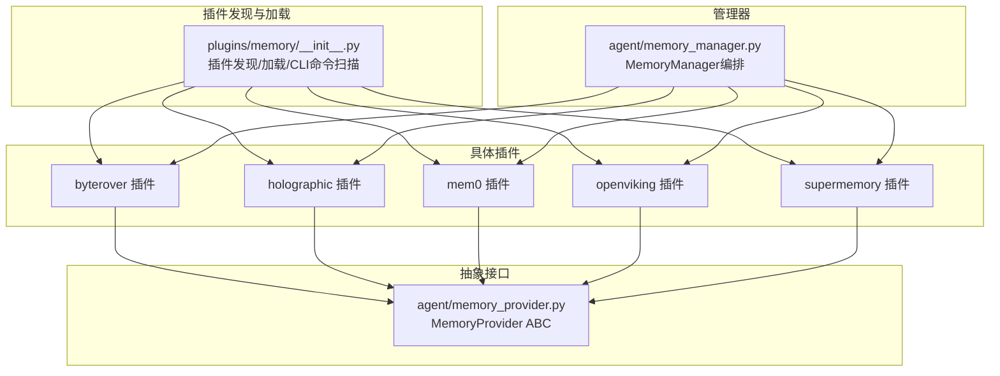

**图表来源**
- [plugins/memory/__init__.py:122-182](file://plugins/memory/__init__.py#L122-L182)
- [agent/memory_provider.py:42-232](file://agent/memory_provider.py#L42-L232)
- [agent/memory_manager.py:83-142](file://agent/memory_manager.py#L83-L142)

**章节来源**
- [plugins/memory/__init__.py:1-407](file://plugins/memory/__init__.py#L1-L407)
- [agent/memory_manager.py:1-374](file://agent/memory_manager.py#L1-L374)
- [agent/memory_provider.py:1-232](file://agent/memory_provider.py#L1-L232)

## 核心组件
- MemoryProvider抽象类：定义插件必须实现的生命周期方法（initialize、system_prompt_block、prefetch、sync_turn、get_tool_schemas、handle_tool_call、shutdown），以及可选钩子（on_turn_start、on_session_end、on_pre_compress、on_memory_write、on_delegation）。该接口确保所有插件以一致方式接入代理引擎。
- MemoryManager编排器：维护Provider列表，建立工具名到Provider的路由映射；在每轮对话中执行预取、同步、会话结束处理与关闭流程；支持多Provider并行但限制外部Provider数量为1，避免冲突。
- 插件发现与加载：扫描内置与用户安装目录，识别符合约定的插件包，动态导入并提取Provider实例；支持仅对当前激活的插件注册CLI命令，降低启动开销。

关键职责与约束：
- 一个会话中仅允许一个外部Provider（内置Provider始终存在且不可移除）。
- Provider的工具schema需唯一，重复名称会被忽略并记录警告。
- 生命周期钩子失败不会阻断其他Provider，保证系统鲁棒性。

**章节来源**
- [agent/memory_provider.py:42-232](file://agent/memory_provider.py#L42-L232)
- [agent/memory_manager.py:83-374](file://agent/memory_manager.py#L83-L374)
- [plugins/memory/__init__.py:122-182](file://plugins/memory/__init__.py#L122-L182)

## 架构总览
下图展示从配置到运行时调用的关键路径：配置选择Provider → 发现与加载 → 初始化 → 预取/同步/工具调用 → 关闭。

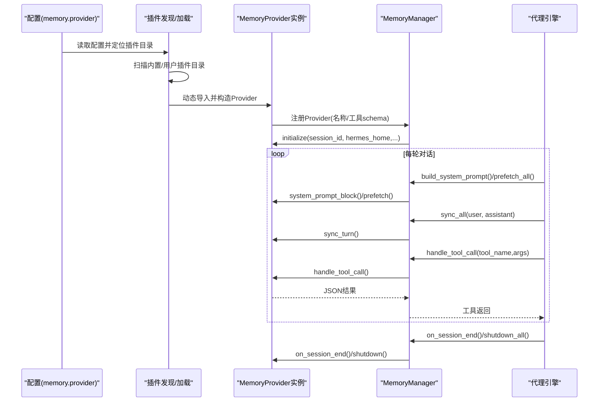

**图表来源**
- [plugins/memory/__init__.py:307-320](file://plugins/memory/__init__.py#L307-L320)
- [agent/memory_manager.py:157-374](file://agent/memory_manager.py#L157-L374)
- [agent/memory_provider.py:61-137](file://agent/memory_provider.py#L61-L137)

## 详细组件分析

### 插件发现与加载机制
- 目录扫描优先级：内置plugins/memory/<name>/优先于$HERMES_HOME/plugins/<name>/，同名时内置优先。
- 可用性检查：通过调用Provider.is_available()进行轻量检测，避免网络请求。
- 动态导入：支持register(ctx)与直接实例化两种方式；为用户插件设置独立命名空间避免sys.modules冲突。
- CLI命令扫描：仅对当前激活的Provider加载其cli.py中的命令注册函数，避免全量导入。

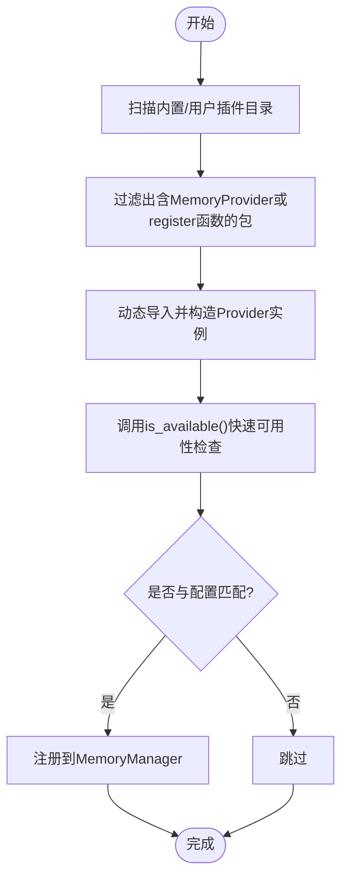

**图表来源**
- [plugins/memory/__init__.py:66-156](file://plugins/memory/__init__.py#L66-L156)

**章节来源**
- [plugins/memory/__init__.py:100-182](file://plugins/memory/__init__.py#L100-L182)

### MemoryProvider接口规范
- 必须实现：name、is_available、initialize、get_tool_schemas、handle_tool_call（若提供工具）、shutdown。
- 建议实现：system_prompt_block、prefetch、queue_prefetch、sync_turn、on_turn_start、on_session_end、on_pre_compress、on_memory_write、on_delegation。
- 配置接口：get_config_schema用于hermes memory setup向导；save_config持久化非敏感配置。

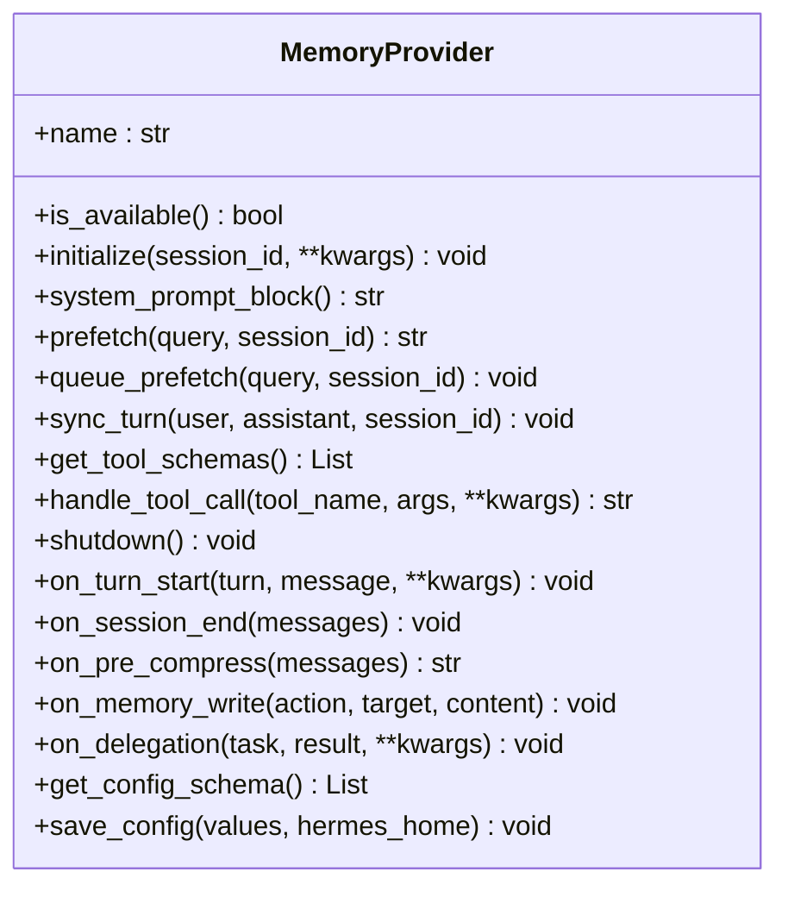

**图表来源**
- [agent/memory_provider.py:42-232](file://agent/memory_provider.py#L42-L232)

**章节来源**
- [agent/memory_provider.py:1-232](file://agent/memory_provider.py#L1-L232)

### MemoryManager编排逻辑
- 注册与路由：维护Provider列表与工具名到Provider的映射；重复工具名发出警告并忽略。
- 上下文注入：build_system_prompt聚合各Provider的静态提示块；prefetch_all合并各Provider的召回文本。
- 同步与清理：sync_all在每轮结束后异步写入；on_session_end触发会话结束处理；shutdown_all逆序关闭。
- 容错设计：各Provider的异常不阻断其他Provider，日志记录错误信息。

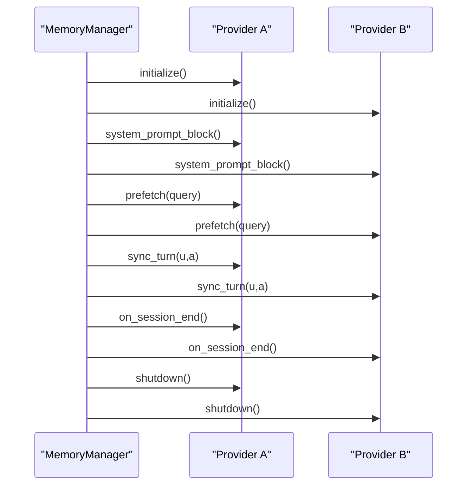

**图表来源**
- [agent/memory_manager.py:83-374](file://agent/memory_manager.py#L83-L374)

**章节来源**
- [agent/memory_manager.py:83-374](file://agent/memory_manager.py#L83-L374)

### 具体插件实现特点

#### ByteRover（高性能本地CLI）
- 设计理念：基于brv CLI的层级上下文树，先关键字搜索再LLM精炼，兼顾速度与语义。
- 实现要点：预取同步阻塞等待，确保模型调用前上下文就绪；后台线程异步curate；镜像内置记忆写入；压缩前flush上下文。
- 配置：BRV_API_KEY（可选云同步）；工作目录$HERMES_HOME/byterover。
- 工具：brv_query、brv_curate、brv_status。

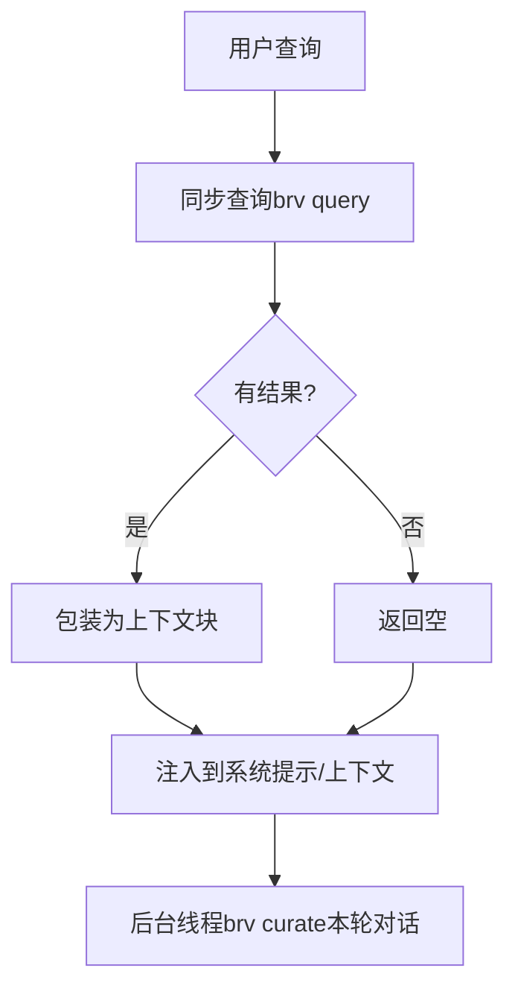

**图表来源**
- [plugins/memory/byterover/__init__.py:215-263](file://plugins/memory/byterover/__init__.py#L215-L263)

**章节来源**
- [plugins/memory/byterover/__init__.py:1-384](file://plugins/memory/byterover/__init__.py#L1-L384)

#### Holographic（全息记忆/结构化事实库）
- 设计理念：SQLite事实存储+实体解析+信任评分+HRR向量检索，支持组合式推理与矛盾检测。
- 实现要点：FTS5全文检索+Jaccard重排+信任加权+可选时间衰减；支持自动抽取用户偏好与决策；提供fact_store与fact_feedback工具。
- 存储与检索：MemoryStore管理facts/entities/fact_entities表与FTS触发器；FactRetriever实现多策略融合检索。
- 配置：plugins.hermes-memory-store（db_path、auto_extract、default_trust、hrr_dim等）。

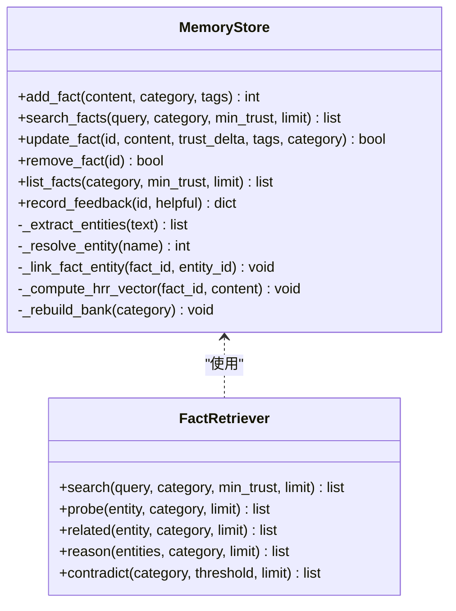

**图表来源**
- [plugins/memory/holographic/store.py:98-575](file://plugins/memory/holographic/store.py#L98-L575)
- [plugins/memory/holographic/retrieval.py:22-594](file://plugins/memory/holographic/retrieval.py#L22-L594)

**章节来源**
- [plugins/memory/holographic/__init__.py:1-408](file://plugins/memory/holographic/__init__.py#L1-L408)
- [plugins/memory/holographic/store.py:1-575](file://plugins/memory/holographic/store.py#L1-L575)
- [plugins/memory/holographic/retrieval.py:1-594](file://plugins/memory/holographic/retrieval.py#L1-L594)

#### Mem0（去中心化存储）
- 设计理念：服务端LLM抽取+重排语义检索+自动去重，强调“结论”而非“转述”。
- 实现要点：电路 breaker保护（连续失败后冷却）；队列化预取与同步；按user_id+agent_id过滤；工具：mem0_profile、mem0_search、mem0_conclude。
- 配置：MEM0_API_KEY（必填）、MEM0_USER_ID、MEM0_AGENT_ID；或$HERMES_HOME/mem0.json。

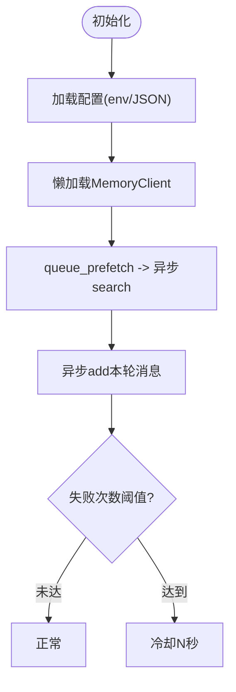

**图表来源**
- [plugins/memory/mem0/__init__.py:168-202](file://plugins/memory/mem0/__init__.py#L168-L202)

**章节来源**
- [plugins/memory/mem0/__init__.py:1-374](file://plugins/memory/mem0/__init__.py#L1-L374)

#### OpenViking（企业级知识库）
- 设计理念：Volcengine上下文数据库，分层上下文（L0/L1/L2）、会话管理、资源入库与URI浏览。
- 实现要点：HTTP客户端封装；会话提交触发自动记忆抽取；工具：viking_search、viking_read、viking_browse、viking_remember、viking_add_resource；进程退出安全网关确保会话提交。
- 配置：OPENVIKING_ENDPOINT（必填）、OPENVIKING_API_KEY、OPENVIKING_ACCOUNT、OPENVIKING_USER、OPENVIKING_AGENT。

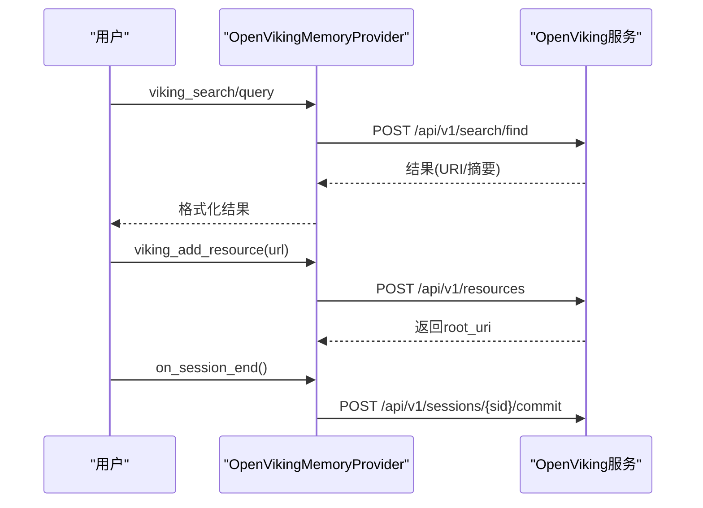

**图表来源**
- [plugins/memory/openviking/__init__.py:448-471](file://plugins/memory/openviking/__init__.py#L448-L471)

**章节来源**
- [plugins/memory/openviking/__init__.py:1-675](file://plugins/memory/openviking/__init__.py#L1-L675)

#### Supermemory（分布式长程记忆）
- 设计理念：容器化标签、混合检索（记忆/文档）、显式工具、会话结束批量摄入、多容器支持。
- 实现要点：超时与长度控制、实体上下文模板、容器标签白名单校验、工具：supermemory_store、supermemory_search、supermemory_forget、supermemory_profile。
- 配置：SUPERMEMORY_API_KEY（必填）；$HERMES_HOME/supermemory.json（容器标签、召回/捕获策略、搜索模式、实体上下文等）。

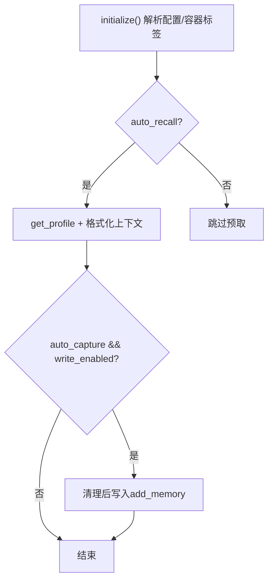

**图表来源**
- [plugins/memory/supermemory/__init__.py:527-594](file://plugins/memory/supermemory/__init__.py#L527-L594)

**章节来源**
- [plugins/memory/supermemory/__init__.py:1-792](file://plugins/memory/supermemory/__init__.py#L1-L792)

### 插件注册机制、依赖注入与状态同步
- 注册机制：插件包内提供register(ctx)或顶层类继承MemoryProvider，发现模块后通过ctx.register_memory_provider注入。
- 依赖注入：MemoryManager在initialize阶段自动注入hermes_home、platform、agent_context、agent_identity、agent_workspace、parent_session_id、user_id等参数。
- 状态同步：prefetch/queue_prefetch在每轮开始前准备上下文；sync_turn在每轮结束后异步写入；on_session_end在会话边界触发；on_memory_write镜像内置记忆变更。

**章节来源**
- [plugins/memory/__init__.py:184-284](file://plugins/memory/__init__.py#L184-L284)
- [agent/memory_manager.py:356-374](file://agent/memory_manager.py#L356-L374)
- [agent/memory_provider.py:61-81](file://agent/memory_provider.py#L61-L81)

### 安全沙箱、数据加密与访问控制
- 进程隔离：各Provider在独立线程中运行，异常不影响主流程；OpenViking提供进程退出安全网关，确保会话提交。
- 访问控制：Mem0与OpenViking通过filters（user_id/agent_id）限定读写范围；Supermemory支持容器标签白名单。
- 配置安全：MemoryProvider.save_config用于写入非敏感配置；敏感字段通过.env或环境变量注入；部分插件要求SDK安装（如Mem0、Supermemory）。
- 数据最小化：Supermemory在捕获前清理上下文标记与容器标签，避免污染；OpenViking与Supermemory均对长内容进行截断。

**章节来源**
- [plugins/memory/mem0/__init__.py:212-218](file://plugins/memory/mem0/__init__.py#L212-L218)
- [plugins/memory/openviking/__init__.py:448-471](file://plugins/memory/openviking/__init__.py#L448-L471)
- [plugins/memory/supermemory/__init__.py:617-637](file://plugins/memory/supermemory/__init__.py#L617-L637)

### 开发指南与最佳实践
- 新插件开发步骤
  - 在plugins/memory/<name>/创建包，实现MemoryProvider或提供register(ctx)函数。
  - 实现必要方法：is_available、initialize、get_tool_schemas、handle_tool_call。
  - 提供get_config_schema/save_config，便于hermes memory setup自动化配置。
  - 使用线程池或队列处理高延迟后端，避免阻塞主线程。
  - 在on_session_end/on_memory_write中实现幂等与去重策略。
- 性能优化建议
  - 预取与缓存：在queue_prefetch中发起异步检索，在prefetch中返回缓存结果。
  - 背压与节流：为外部API设置超时与重试上限，必要时引入电路 breaker。
  - 数据裁剪：对长上下文进行截断与摘要，避免token溢出。
- 集成与测试
  - 通过MemoryManager.add_provider注册，验证工具schema唯一性。
  - 使用discover_memory_providers确认可用性与描述。
  - 在CLI中通过discover_plugin_cli_commands验证仅激活插件的命令可见。

**章节来源**
- [agent/memory_provider.py:188-221](file://agent/memory_provider.py#L188-L221)
- [plugins/memory/__init__.py:122-156](file://plugins/memory/__init__.py#L122-L156)

## 依赖关系分析
- 组件耦合
  - 插件与抽象接口：强依赖MemoryProvider接口，确保行为一致性。
  - 管理器与插件：弱耦合，通过工具schema路由与生命周期钩子交互。
  - 外部SDK：Mem0/Supermemory/OpenViking分别依赖对应SDK；缺失时提供降级提示。
- 循环依赖
  - 插件发现模块与管理器无循环依赖；插件内部模块（如holographic的store/retrieval）通过相对导入组织。
- 外部依赖
  - httpx（OpenViking）、supermemory SDK（Supermemory）、mem0 SDK（Mem0）、sqlite3（Holographic）。

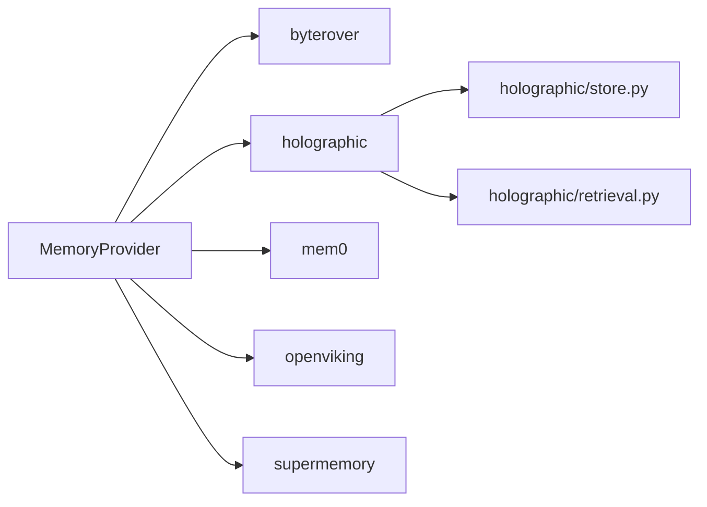

**图表来源**
- [agent/memory_provider.py:42-232](file://agent/memory_provider.py#L42-L232)
- [plugins/memory/holographic/store.py:1-575](file://plugins/memory/holographic/store.py#L1-L575)
- [plugins/memory/holographic/retrieval.py:1-594](file://plugins/memory/holographic/retrieval.py#L1-L594)

**章节来源**
- [plugins/memory/__init__.py:1-407](file://plugins/memory/__init__.py#L1-L407)
- [agent/memory_manager.py:1-374](file://agent/memory_manager.py#L1-L374)

## 性能考虑
- I/O与并发
  - 将网络/磁盘操作放入后台线程，避免阻塞主推理线程。
  - 对外部API设置合理超时与重试，必要时引入退避与熔断。
- 上下文注入
  - 控制预取上下文长度与条数，结合令牌预算进行裁剪。
  - 对频繁调用的检索接口采用缓存与增量更新策略。
- 存储与索引
  - Holographic使用SQLite+FTS5与触发器，注意WAL模式与事务粒度。
  - Supermemory与Mem0通过容器标签/过滤器减少无关数据扫描。

[本节为通用指导，无需特定文件引用]

## 故障排除指南
- 插件未被发现
  - 检查插件目录命名与__init__.py是否存在；确认包含MemoryProvider或register函数标识。
  - 查看discover_memory_providers输出与日志，确认is_available返回值。
- Provider不可用
  - 检查环境变量/配置文件是否正确；确认SDK已安装（如mem0、supermemory、httpx）。
- 工具调用失败
  - 确认工具名在get_tool_schemas中唯一；查看handle_tool_call返回的错误信息。
- 会话结束未写入
  - 检查on_session_end实现与write_enabled标志；OpenViking需确保会话提交成功。
- 性能问题
  - 分析后台线程是否堆积；调整超时、重试与结果限制；评估预取策略与缓存命中率。

**章节来源**
- [plugins/memory/__init__.py:122-156](file://plugins/memory/__init__.py#L122-L156)
- [agent/memory_manager.py:209-220](file://agent/memory_manager.py#L209-L220)
- [plugins/memory/openviking/__init__.py:448-471](file://plugins/memory/openviking/__init__.py#L448-L471)

## 结论
Hermes Agent内存插件系统通过统一的MemoryProvider接口与MemoryManager编排，实现了从本地CLI到云端平台、从结构化事实库到企业知识库的多样化记忆后端选择。各插件在性能、可用性与功能上各有侧重：byterover强调本地高性能与CLI集成；holographic聚焦结构化事实与组合推理；mem0提供去中心化抽取与检索；openviking满足企业级知识库与会话管理需求；supermemory提供分布式长程记忆与容器化组织。通过严格的生命周期管理、容错设计与安全控制，系统在灵活性与稳定性之间取得平衡，适合在不同场景下灵活部署与扩展。