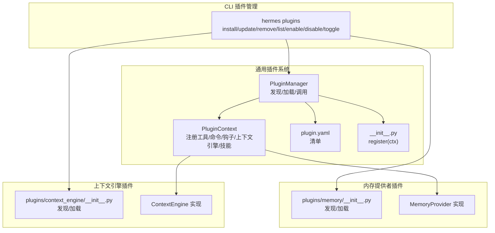
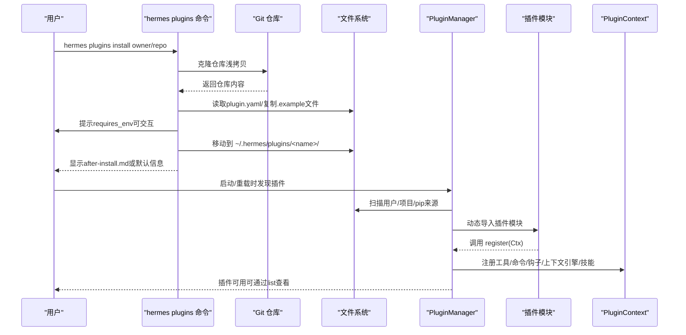
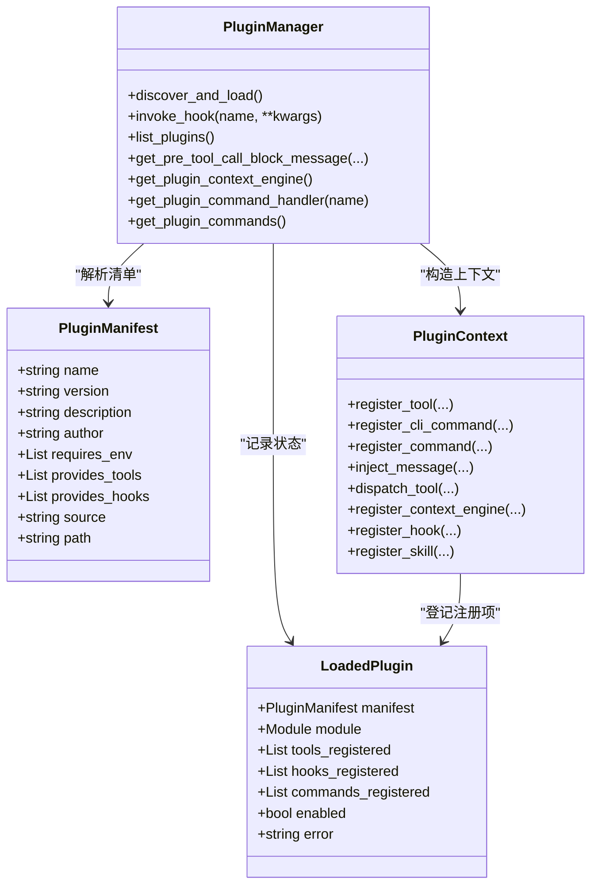
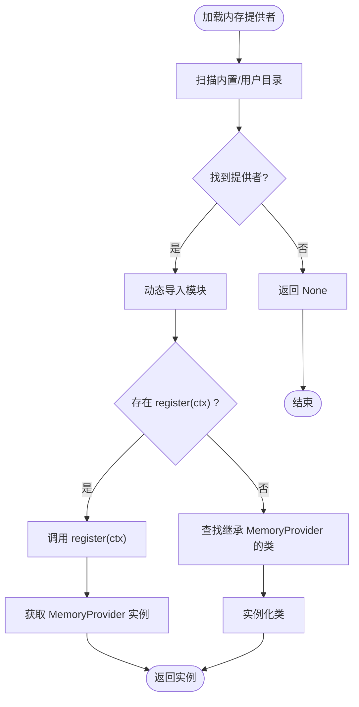
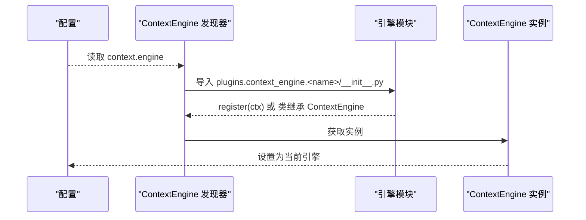
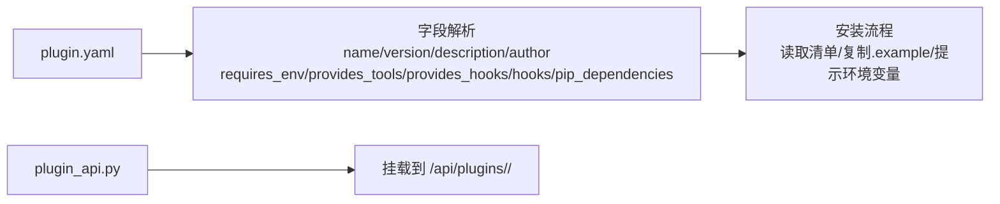
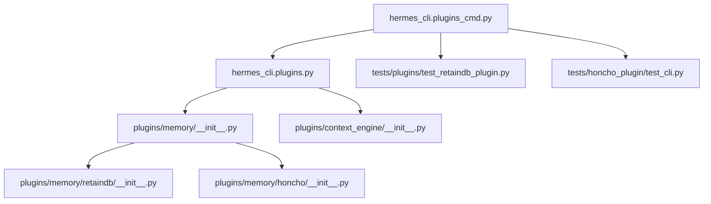

# 插件开发指南

<cite>
**本文档引用的文件**
- [plugins/__init__.py](file://plugins/__init__.py)
- [plugins/example-dashboard/dashboard/manifest.json](file://plugins/example-dashboard/dashboard/manifest.json)
- [plugins/example-dashboard/dashboard/plugin_api.py](file://plugins/example-dashboard/dashboard/plugin_api.py)
- [hermes_cli/plugins.py](file://hermes_cli/plugins.py)
- [hermes_cli/plugins_cmd.py](file://hermes_cli/plugins_cmd.py)
- [plugins/memory/__init__.py](file://plugins/memory/__init__.py)
- [plugins/context_engine/__init__.py](file://plugins/context_engine/__init__.py)
- [plugins/memory/retaindb/plugin.yaml](file://plugins/memory/retaindb/plugin.yaml)
- [plugins/memory/retaindb/__init__.py](file://plugins/memory/retaindb/__init__.py)
- [plugins/memory/honcho/plugin.yaml](file://plugins/memory/honcho/plugin.yaml)
- [plugins/memory/honcho/__init__.py](file://plugins/memory/honcho/__init__.py)
- [tests/plugins/test_retaindb_plugin.py](file://tests/plugins/test_retaindb_plugin.py)
- [tests/honcho_plugin/test_cli.py](file://tests/honcho_plugin/test_cli.py)
</cite>

## 目录
1. [简介](#简介)
2. [项目结构](#项目结构)
3. [核心组件](#核心组件)
4. [架构总览](#架构总览)
5. [详细组件分析](#详细组件分析)
6. [依赖关系分析](#依赖关系分析)
7. [性能考量](#性能考量)
8. [故障排查指南](#故障排查指南)
9. [结论](#结论)
10. [附录](#附录)

## 简介
本指南面向Hermes Agent插件开发者，系统阐述从项目结构设计、清单与配置管理、生命周期与初始化到API设计、错误处理、测试策略、打包分发与版本管理、安全与权限控制、以及调试与性能分析的完整流程与最佳实践。文档以仓库现有插件系统为依据，结合CLI插件子命令与内存/上下文引擎插件发现机制，帮助你快速构建稳定、可维护且可扩展的Hermes插件。

## 项目结构
Hermes插件体系由“通用插件系统”“内存提供者插件”“上下文引擎插件”三部分组成，并通过CLI子命令进行安装、启用/禁用与列表管理。

- 通用插件系统
  - 发现来源：用户目录、项目目录（可选）、pip入口点
  - 清单文件：plugin.yaml（或plugin.yml）
  - 必备文件：__init__.py，包含register(ctx)函数
  - 生命周期钩子：pre_tool_call/post_tool_call/pre_llm_call/post_llm_call/pre_api_request/post_api_request/on_session_start/on_session_end/on_session_finalize/on_session_reset
  - 上下文能力：注册工具、命令、消息注入、上下文引擎替换、技能注册等

- 内存提供者插件
  - 发现方式：扫描plugins/memory/内置目录与用户插件目录
  - 仅允许一个活动提供者，通过配置项memory.provider选择
  - 支持register_memory_provider注册或直接类继承MemoryProvider

- 上下文引擎插件
  - 发现方式：扫描plugins/context_engine/目录
  - 仅允许一个活动引擎，通过配置项context.engine选择
  - 支持register_context_engine注册或直接类继承ContextEngine

- CLI插件管理
  - hermes plugins install/update/remove/list/enable/disable/toggle
  - 安装时读取plugin.yaml，支持requires_env提示输入、.example文件复制、after-install.md展示
  - 支持manifest_version兼容性检查

**图表来源**
- [hermes_cli/plugins.py:415-579](file://hermes_cli/plugins.py#L415-L579)
- [hermes_cli/plugins_cmd.py:284-397](file://hermes_cli/plugins_cmd.py#L284-L397)
- [plugins/memory/__init__.py:122-182](file://plugins/memory/__init__.py#L122-L182)
- [plugins/context_engine/__init__.py:33-98](file://plugins/context_engine/__init__.py#L33-L98)

**章节来源**
- [hermes_cli/plugins.py:1-120](file://hermes_cli/plugins.py#L1-L120)
- [hermes_cli/plugins_cmd.py:29-128](file://hermes_cli/plugins_cmd.py#L29-L128)
- [plugins/memory/__init__.py:1-31](file://plugins/memory/__init__.py#L1-L31)
- [plugins/context_engine/__init__.py:1-17](file://plugins/context_engine/__init__.py#L1-L17)

## 核心组件
- 插件清单与清单字段
  - name、version、description、author（可选）
  - requires_env：环境变量需求列表（字符串或字典{name, description, url, secret}）
  - provides_tools：声明提供的工具名列表
  - provides_hooks：声明提供的生命周期钩子列表
  - hooks：声明插件使用的钩子（如内存插件声明使用on_session_end）
  - pip_dependencies：pip安装依赖（用于安装后自动安装）

- 插件上下文对象PluginContext
  - register_tool：注册工具到全局注册表
  - register_cli_command/register_command：注册CLI子命令与会话内斜杠命令
  - inject_message：向当前会话注入消息
  - dispatch_tool：通过注册表调度工具调用
  - register_context_engine：注册上下文引擎（仅允许一个）
  - register_hook/register_skill：注册生命周期钩子与插件技能

- 插件管理器PluginManager
  - discover_and_load：扫描三种来源并加载插件
  - invoke_hook：调用所有已注册回调，异常隔离
  - list_plugins：列出插件信息
  - get_pre_tool_call_block_message：在工具调用前检查阻断指令
  - get_plugin_context_engine/get_plugin_command_handler/get_plugin_commands：查询插件注册结果

- CLI插件命令
  - install：克隆Git仓库，读取plugin.yaml，校验manifest_version，复制.example文件，提示requires_env，显示after-install.md
  - update：拉取最新代码，复制新增.example文件
  - remove：删除插件目录
  - enable/disable：写入配置禁用列表
  - list/toggle：展示与交互式切换

**章节来源**
- [hermes_cli/plugins.py:92-118](file://hermes_cli/plugins.py#L92-L118)
- [hermes_cli/plugins.py:124-391](file://hermes_cli/plugins.py#L124-L391)
- [hermes_cli/plugins.py:396-740](file://hermes_cli/plugins.py#L396-L740)
- [hermes_cli/plugins_cmd.py:115-225](file://hermes_cli/plugins_cmd.py#L115-L225)
- [hermes_cli/plugins_cmd.py:284-397](file://hermes_cli/plugins_cmd.py#L284-L397)

## 架构总览
Hermes插件系统采用“清单驱动 + 动态加载 + 钩子扩展”的架构。通用插件通过register(ctx)注册能力；内存/上下文引擎插件通过专用发现模块被加载；CLI负责插件的安装、更新与状态管理。

**图表来源**
- [hermes_cli/plugins_cmd.py:284-397](file://hermes_cli/plugins_cmd.py#L284-L397)
- [hermes_cli/plugins.py:415-579](file://hermes_cli/plugins.py#L415-L579)

**章节来源**
- [hermes_cli/plugins_cmd.py:284-397](file://hermes_cli/plugins_cmd.py#L284-L397)
- [hermes_cli/plugins.py:415-579](file://hermes_cli/plugins.py#L415-L579)

## 详细组件分析

### 通用插件系统（PluginManager/PluginContext）
- 插件发现与加载
  - 用户插件：~/.hermes/plugins/<name>/
  - 项目插件：./.hermes/plugins/<name>（需开启环境变量开关）
  - Pip插件：通过entry_points组hermes_agent.plugins发现
  - 加载顺序：先解析plugin.yaml，再执行register(ctx)，记录注册的工具/钩子/命令

- 生命周期钩子
  - pre_tool_call：可返回阻断指令（{"action":"block","message": "..."}）
  - post_tool_call：工具调用后
  - pre_llm_call/post_llm_call：大模型调用前后
  - pre_api_request/post_api_request：HTTP请求前后
  - on_session_start/on_session_end/on_session_finalize/on_session_reset：会话级事件

- 上下文引擎替换
  - 仅允许一个插件注册上下文引擎，否则警告并拒绝
  - 引擎必须继承agent.context_engine.ContextEngine

**图表来源**
- [hermes_cli/plugins.py:92-118](file://hermes_cli/plugins.py#L92-L118)
- [hermes_cli/plugins.py:124-391](file://hermes_cli/plugins.py#L124-L391)
- [hermes_cli/plugins.py:396-740](file://hermes_cli/plugins.py#L396-L740)

**章节来源**
- [hermes_cli/plugins.py:54-65](file://hermes_cli/plugins.py#L54-L65)
- [hermes_cli/plugins.py:124-391](file://hermes_cli/plugins.py#L124-L391)
- [hermes_cli/plugins.py:632-667](file://hermes_cli/plugins.py#L632-L667)

### 内存提供者插件（Memory Provider）
- 发现与加载
  - 先扫描内置plugins/memory/<name>/，再扫描用户$HERMES_HOME/plugins/<name>/，内置优先
  - 模块需包含register(ctx)或顶层类继承MemoryProvider
  - 只允许一个活动提供者，通过配置memory.provider选择

- CLI命令集成
  - 仅对当前激活的提供者注册CLI命令
  - 通过cli.py中的register_cli(subparser)函数注册

- 示例：RetainDB/Honcho
  - RetainDB：提供profile/search/context/remember/forget及文件工具，带SQLite写队列、预取与线程管理
  - Honcho：提供profile/search/reasoning/context/conclude工具，支持会话结束钩子

**图表来源**
- [plugins/memory/__init__.py:184-284](file://plugins/memory/__init__.py#L184-L284)

**章节来源**
- [plugins/memory/__init__.py:122-182](file://plugins/memory/__init__.py#L122-L182)
- [plugins/memory/retaindb/plugin.yaml:1-8](file://plugins/memory/retaindb/plugin.yaml#L1-L8)
- [plugins/memory/honcho/plugin.yaml:1-8](file://plugins/memory/honcho/plugin.yaml#L1-L8)

### 上下文引擎插件（Context Engine）
- 发现与加载
  - 仅扫描plugins/context_engine/<name>/目录
  - 支持register_context_engine注册或直接类继承ContextEngine
  - 默认引擎为"compressor"，通过配置context.engine选择

**图表来源**
- [plugins/context_engine/__init__.py:79-196](file://plugins/context_engine/__init__.py#L79-L196)

**章节来源**
- [plugins/context_engine/__init__.py:33-98](file://plugins/context_engine/__init__.py#L33-L98)

### 插件清单与示例
- 清单字段
  - name、version、description、author（可选）
  - requires_env：环境变量需求
  - provides_tools/provides_hooks：声明提供的能力
  - hooks：声明使用的钩子（如内存插件声明使用on_session_end）
  - pip_dependencies：pip依赖（安装时自动安装）

- 示例清单与后端API
  - 示例仪表板插件：包含name/label/description/icon/version/tab/entry/api等字段
  - 后端API：FastAPI路由，挂载在/api/plugins/<name>/路径下

**图表来源**
- [plugins/example-dashboard/dashboard/manifest.json:1-14](file://plugins/example-dashboard/dashboard/manifest.json#L1-L14)
- [plugins/example-dashboard/dashboard/plugin_api.py:1-15](file://plugins/example-dashboard/dashboard/plugin_api.py#L1-L15)

**章节来源**
- [plugins/example-dashboard/dashboard/manifest.json:1-14](file://plugins/example-dashboard/dashboard/manifest.json#L1-L14)
- [plugins/example-dashboard/dashboard/plugin_api.py:1-15](file://plugins/example-dashboard/dashboard/plugin_api.py#L1-L15)

## 依赖关系分析
- 插件系统依赖
  - hermes_cli.plugins：通用插件管理器与上下文
  - hermes_cli.plugins_cmd：CLI插件安装/更新/移除/列表/启用/禁用/交互界面
  - plugins.memory：内存提供者发现与加载
  - plugins.context_engine：上下文引擎发现与加载

- 外部依赖
  - PyYAML：解析plugin.yaml
  - requests：内存插件HTTP客户端（如RetainDB）
  - honcho-ai：Honcho SDK（如Honcho）

**图表来源**
- [hermes_cli/plugins_cmd.py:284-397](file://hermes_cli/plugins_cmd.py#L284-L397)
- [hermes_cli/plugins.py:415-579](file://hermes_cli/plugins.py#L415-L579)
- [plugins/memory/__init__.py:122-182](file://plugins/memory/__init__.py#L122-L182)
- [plugins/context_engine/__init__.py:33-98](file://plugins/context_engine/__init__.py#L33-L98)
- [plugins/memory/retaindb/__init__.py:1-200](file://plugins/memory/retaindb/__init__.py#L1-L200)
- [plugins/memory/honcho/__init__.py:1-200](file://plugins/memory/honcho/__init__.py#L1-L200)

**章节来源**
- [hermes_cli/plugins_cmd.py:284-397](file://hermes_cli/plugins_cmd.py#L284-L397)
- [hermes_cli/plugins.py:415-579](file://hermes_cli/plugins.py#L415-L579)

## 性能考量
- 写队列与异步写入
  - RetainDB内存插件使用SQLite写队列，后台线程异步写入，失败重试与崩溃恢复
  - 预取与线程池：每轮预取启动多个线程，但有线程回收保护，避免线程堆积

- 线程与锁
  - 使用threading.Lock保护共享状态
  - 预取结果消费后清空，避免重复计算

- I/O与网络
  - HTTP请求设置超时与降级（如RetainDB的回退路径）
  - 文件上传/下载/读取需校验本地路径存在性

- 配置与缓存
  - 通过配置项选择内存提供者与上下文引擎，减少不必要的模块加载
  - 预取结果在会话内复用，降低重复请求成本

**章节来源**
- [plugins/memory/retaindb/__init__.py:1-200](file://plugins/memory/retaindb/__init__.py#L1-L200)
- [tests/plugins/test_retaindb_plugin.py:182-277](file://tests/plugins/test_retaindb_plugin.py#L182-L277)

## 故障排查指南
- 安装阶段
  - Git克隆失败：检查git是否安装、网络可达、URL格式正确
  - 清单版本不兼容：根据提示升级CLI或降级插件
  - 环境变量缺失：按提示输入或在~/.hermes/.env中设置

- 运行阶段
  - 工具调用阻断：检查pre_tool_call钩子返回的阻断消息
  - 上下文引擎冲突：仅允许一个上下文引擎，确认register_context_engine调用次数
  - 内存提供者不可用：检查环境变量与is_available返回值

- 测试验证
  - 单元测试覆盖：RetainDB插件的HTTP客户端、写队列、预取与线程管理、工具调用与错误包装
  - CLI测试：Honcho插件CLI状态命令在会话配置失败时的错误报告

**章节来源**
- [hermes_cli/plugins_cmd.py:284-397](file://hermes_cli/plugins_cmd.py#L284-L397)
- [hermes_cli/plugins.py:743-780](file://hermes_cli/plugins.py#L743-L780)
- [tests/plugins/test_retaindb_plugin.py:1-120](file://tests/plugins/test_retaindb_plugin.py#L1-L120)
- [tests/honcho_plugin/test_cli.py:1-56](file://tests/honcho_plugin/test_cli.py#L1-L56)

## 结论
Hermes插件体系提供了清晰的清单驱动与动态加载机制，配合丰富的生命周期钩子与上下文能力，使开发者能够以最小侵入的方式扩展Agent功能。通过CLI统一管理插件的安装、启用/禁用与状态展示，结合内存/上下文引擎的专用发现机制，形成完整的插件生态闭环。遵循本文档的结构设计、清单规范、生命周期管理与测试策略，可显著提升插件质量与可维护性。

## 附录

### 插件清单字段参考
- name：插件名称（必填）
- version：版本号
- description：描述
- author：作者
- requires_env：环境变量需求（字符串或字典{name, description, url, secret}）
- provides_tools：声明提供的工具名列表
- provides_hooks：声明提供的生命周期钩子列表
- hooks：声明使用的钩子（如内存插件声明使用on_session_end）
- pip_dependencies：pip依赖（安装时自动安装）

**章节来源**
- [plugins/example-dashboard/dashboard/manifest.json:1-14](file://plugins/example-dashboard/dashboard/manifest.json#L1-L14)
- [plugins/memory/retaindb/plugin.yaml:1-8](file://plugins/memory/retaindb/plugin.yaml#L1-L8)
- [plugins/memory/honcho/plugin.yaml:1-8](file://plugins/memory/honcho/plugin.yaml#L1-L8)

### 插件生命周期与初始化流程
- 发现与加载
  - 解析plugin.yaml
  - 动态导入模块并调用register(ctx)
  - 记录注册的工具/钩子/命令/上下文引擎/技能
- 初始化
  - 在需要时调用register_*完成能力注册
  - 通过配置项选择内存提供者/上下文引擎
- 运行期
  - invoke_hook触发生命周期钩子
  - 工具调用通过注册表分发
- 资源清理
  - 通过上下文引擎/内存提供者的shutdown或异步关闭机制释放资源

**章节来源**
- [hermes_cli/plugins.py:415-579](file://hermes_cli/plugins.py#L415-L579)
- [hermes_cli/plugins.py:632-667](file://hermes_cli/plugins.py#L632-L667)

### 插件API设计原则
- 清单驱动：通过plugin.yaml声明能力与依赖
- 最小暴露：仅注册必要的工具/命令/钩子
- 错误隔离：钩子回调异常不中断主循环
- 可观测性：提供系统状态与错误信息（如after-install.md）

**章节来源**
- [hermes_cli/plugins.py:54-65](file://hermes_cli/plugins.py#L54-L65)
- [hermes_cli/plugins_cmd.py:227-254](file://hermes_cli/plugins_cmd.py#L227-L254)

### 插件测试策略
- 单元测试
  - RetainDB：HTTP客户端、写队列、预取与线程管理、工具调用与错误包装
  - Honcho：CLI状态命令在会话配置失败时的行为
- 集成测试
  - 通过CLI安装/更新/移除插件，验证清单解析、环境变量提示与after-install展示
  - 验证内存/上下文引擎发现与加载

**章节来源**
- [tests/plugins/test_retaindb_plugin.py:1-120](file://tests/plugins/test_retaindb_plugin.py#L1-L120)
- [tests/honcho_plugin/test_cli.py:1-56](file://tests/honcho_plugin/test_cli.py#L1-L56)
- [hermes_cli/plugins_cmd.py:284-397](file://hermes_cli/plugins_cmd.py#L284-L397)

### 插件打包、分发与版本管理
- 分发方式
  - 用户插件：~/.hermes/plugins/<name>/
  - 项目插件：./.hermes/plugins/<name>（需开启环境变量）
  - Pip插件：通过entry_points组hermes_agent.plugins发布
- 版本管理
  - 清单支持manifest_version字段，安装器会检查兼容性
  - 更新：通过git pull获取最新代码

**章节来源**
- [hermes_cli/plugins.py:5-11](file://hermes_cli/plugins.py#L5-11)
- [hermes_cli/plugins_cmd.py:342-361](file://hermes_cli/plugins_cmd.py#L342-L361)

### 插件安全与权限控制
- 环境变量管理
  - requires_env声明敏感变量，安装时可交互提示输入
  - .env文件保存与覆盖保护
- 权限与沙箱
  - 插件通过register(ctx)获得有限上下文能力，无法直接访问Agent内部状态
  - 钩子回调异常隔离，避免破坏主循环

**章节来源**
- [hermes_cli/plugins_cmd.py:151-225](file://hermes_cli/plugins_cmd.py#L151-L225)
- [hermes_cli/plugins.py:632-667](file://hermes_cli/plugins.py#L632-L667)

### 插件开发工具链与调试
- 开发工具链
  - Git：插件安装基于Git仓库
  - PyYAML：解析plugin.yaml
  - requests：HTTP客户端（如RetainDB）
  - honcho-ai：Honcho SDK（如Honcho）
- 调试方法
  - CLI日志输出与after-install.md展示
  - 单元测试覆盖关键路径（HTTP、队列、线程、工具调用）
  - 钩子异常隔离，便于定位问题

**章节来源**
- [hermes_cli/plugins_cmd.py:284-397](file://hermes_cli/plugins_cmd.py#L284-L397)
- [tests/plugins/test_retaindb_plugin.py:1-120](file://tests/plugins/test_retaindb_plugin.py#L1-L120)