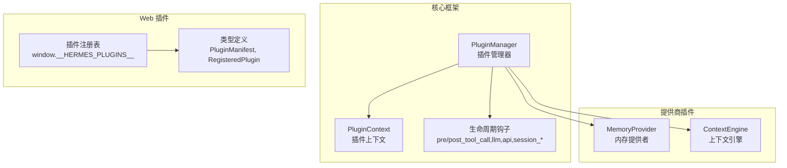
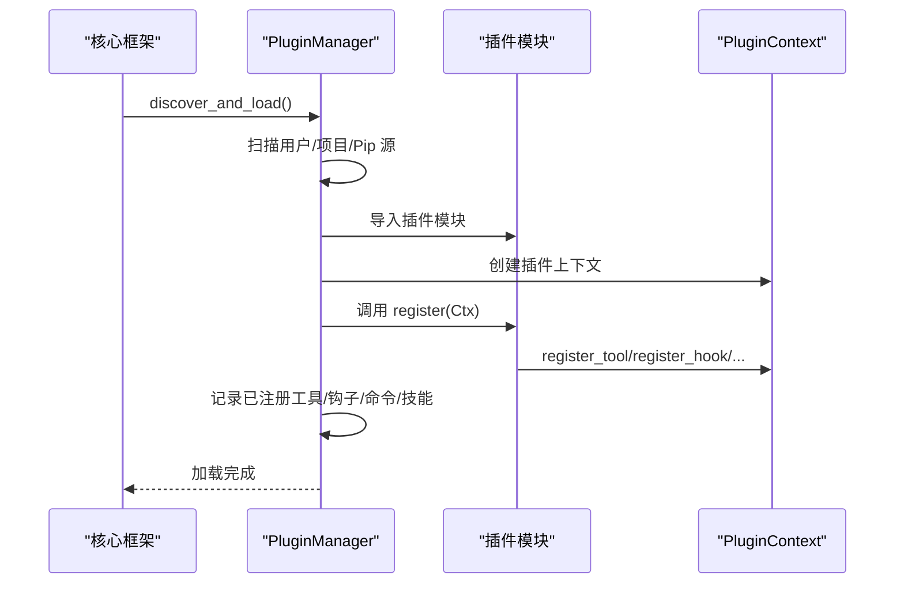
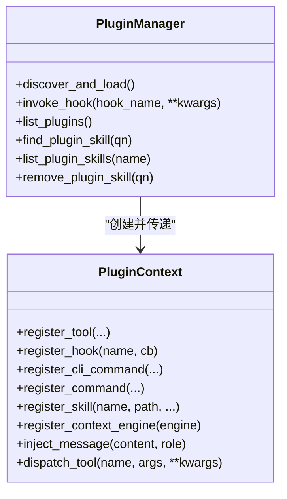
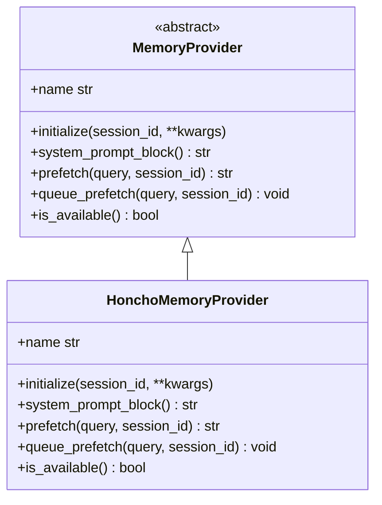
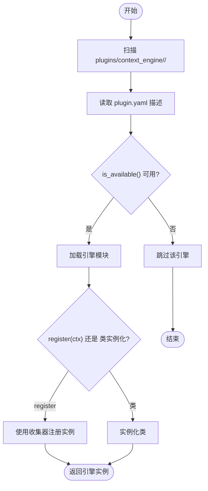
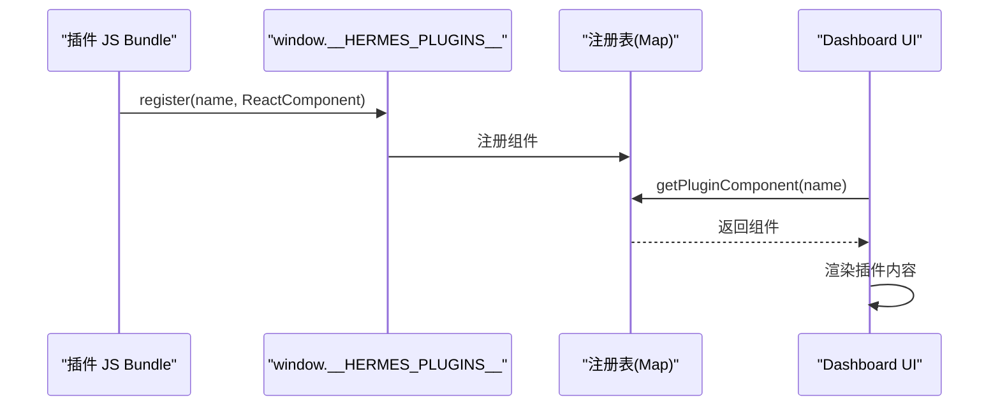
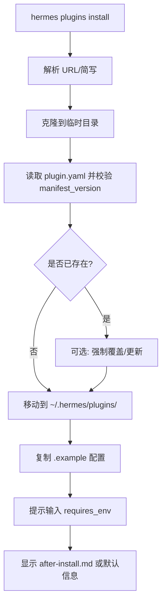
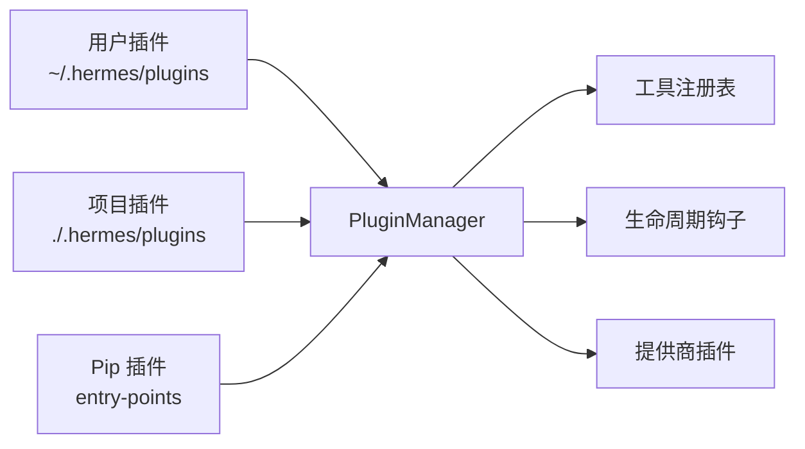

# 插件系统架构

<cite>
**本文档引用的文件**
- [plugins/__init__.py](file://plugins/__init__.py)
- [plugins/context_engine/__init__.py](file://plugins/context_engine/__init__.py)
- [plugins/memory/__init__.py](file://plugins/memory/__init__.py)
- [hermes_cli/plugins.py](file://hermes_cli/plugins.py)
- [hermes_cli/plugins_cmd.py](file://hermes_cli/plugins_cmd.py)
- [plugins/memory/honcho/__init__.py](file://plugins/memory/honcho/__init__.py)
- [plugins/memory/honcho/plugin.yaml](file://plugins/memory/honcho/plugin.yaml)
- [web/src/plugins/registry.ts](file://web/src/plugins/registry.ts)
- [web/src/plugins/types.ts](file://web/src/plugins/types.ts)
- [web/src/plugins/index.ts](file://web/src/plugins/index.ts)
- [web/src/plugins/usePlugins.ts](file://web/src/plugins/usePlugins.ts)
- [plugins/example-dashboard/dashboard/manifest.json](file://plugins/example-dashboard/dashboard/manifest.json)
- [plugins/example-dashboard/dashboard/plugin_api.py](file://plugins/example-dashboard/dashboard/plugin_api.py)
- [hermes_cli/plugins_cmd.py](file://hermes_cli/plugins_cmd.py)
- [hermes_cli/plugins.py](file://hermes_cli/plugins.py)
- [plugins/context_engine/__init__.py](file://plugins/context_engine/__init__.py)
- [plugins/memory/__init__.py](file://plugins/memory/__init__.py)
</cite>

## 目录
1. [简介](#简介)
2. [项目结构](#项目结构)
3. [核心组件](#核心组件)
4. [架构总览](#架构总览)
5. [详细组件分析](#详细组件分析)
6. [依赖分析](#依赖分析)
7. [性能考虑](#性能考虑)
8. [故障排除指南](#故障排除指南)
9. [结论](#结论)
10. [附录](#附录)

## 简介
本文件系统性阐述 Hermes Agent 的插件系统架构，覆盖设计理念、模块化组织、注册机制、生命周期管理、依赖注入与隔离、内存插件与上下文引擎插件的实现模式、接口规范、配置与状态同步、安全沙箱与资源隔离、性能监控、开发调试与发布流程，以及与核心系统的集成与扩展点。

## 项目结构
Hermes 插件系统由三层构成：
- 核心插件框架：负责发现、加载、生命周期调度与工具注册（Python）。
- 提供商插件：内存提供者与上下文引擎两类，分别管理记忆与上下文压缩策略。
- Web 前端插件：仪表盘类插件通过 Manifest 驱动前端注册与渲染。

图示来源
- [hermes_cli/plugins.py:396-800](file://hermes_cli/plugins.py#L396-L800)
- [plugins/memory/__init__.py:1-407](file://plugins/memory/__init__.py#L1-L407)
- [plugins/context_engine/__init__.py:1-220](file://plugins/context_engine/__init__.py#L1-L220)
- [web/src/plugins/registry.ts:39-86](file://web/src/plugins/registry.ts#L39-L86)

章节来源
- [hermes_cli/plugins.py:1-844](file://hermes_cli/plugins.py#L1-L844)
- [plugins/memory/__init__.py:1-407](file://plugins/memory/__init__.py#L1-L407)
- [plugins/context_engine/__init__.py:1-220](file://plugins/context_engine/__init__.py#L1-L220)
- [web/src/plugins/registry.ts:39-86](file://web/src/plugins/registry.ts#L39-L86)

## 核心组件
- 插件管理器（PluginManager）：扫描用户/项目/Pip 三类来源，解析 plugin.yaml，调用 register(ctx)，维护钩子回调、工具注册、命令注册、技能注册与上下文引擎注册。
- 插件上下文（PluginContext）：向插件暴露 register_tool/register_hook/register_cli_command/register_command/register_skill/register_context_engine 等能力，并支持消息注入与工具分发。
- 生命周期钩子（VALID_HOOKS）：包含 pre_tool_call/post_tool_call/pre_llm_call/post_llm_call/pre_api_request/post_api_request/on_session_start/on_session_end/on_session_finalize/on_session_reset。
- 提供商插件发现器：内存提供者与上下文引擎各自独立发现器，支持可用性检查、加载与 CLI 注册。

章节来源
- [hermes_cli/plugins.py:54-66](file://hermes_cli/plugins.py#L54-L66)
- [hermes_cli/plugins.py:124-391](file://hermes_cli/plugins.py#L124-L391)
- [hermes_cli/plugins.py:396-800](file://hermes_cli/plugins.py#L396-L800)
- [plugins/memory/__init__.py:122-182](file://plugins/memory/__init__.py#L122-L182)
- [plugins/context_engine/__init__.py:33-98](file://plugins/context_engine/__init__.py#L33-L98)

## 架构总览
Hermes 插件系统采用“声明式清单 + 动态加载 + 面向接口”的设计。插件以目录或入口点形式存在，通过 plugin.yaml 提供元数据；运行时由 PluginManager 解析清单、导入模块并调用 register(ctx) 完成注册。提供商插件（内存/上下文引擎）遵循各自抽象基类，统一对外暴露能力。

图示来源
- [hermes_cli/plugins.py:415-579](file://hermes_cli/plugins.py#L415-L579)

章节来源
- [hermes_cli/plugins.py:415-579](file://hermes_cli/plugins.py#L415-L579)

## 详细组件分析

### 核心插件框架（Python）
- 发现与加载
  - 用户插件：~/.hermes/plugins/<name>/
  - 项目插件：./.hermes/plugins/<name>（需启用环境变量）
  - Pip 插件：通过 hermes_agent.plugins 入口组发现
- 清单解析与校验
  - 支持 plugin.yaml 与 plugin.yml
  - 字段：name/version/description/author/requires_env/provides_tools/provides_hooks
- 生命周期钩子
  - 统一在 PluginManager 中维护回调列表，按名称分发
  - 回调异常被隔离，避免影响主循环
- 工具与命令注册
  - register_tool：注册到全局工具注册表
  - register_cli_command/register_command：注册 CLI 与会话内斜杠命令
  - register_skill：注册插件技能（命名空间自动派生）
- 上下文引擎注册
  - 仅允许一个上下文引擎插件注册，冲突时拒绝

图示来源
- [hermes_cli/plugins.py:396-800](file://hermes_cli/plugins.py#L396-L800)

章节来源
- [hermes_cli/plugins.py:1-844](file://hermes_cli/plugins.py#L1-L844)

### 内存提供商插件体系
- 发现与加载
  - 搜索顺序：内置 plugins/memory/<name>/ 优先于用户 $HERMES_HOME/plugins/<name>/
  - 可通过 plugin.yaml 获取描述；可用性检查通过 is_available()
  - 支持仅加载当前激活的内存提供商 CLI 子命令（轻量扫描 cli.py）
- 实现模式
  - 必须实现 MemoryProvider 抽象基类
  - 提供工具 schema（如 profile/search/reasoning/context/conclude）
  - 初始化阶段处理会话管理、成本感知参数、预热与迁移
- 示例：Honcho 提供者
  - 支持三种回忆模式：context、tools、hybrid
  - 提供方言式推理、语义搜索、结论持久化等工具
  - 支持懒初始化、后台预取、注入频率与轮询节流

图示来源
- [plugins/memory/honcho/__init__.py:186-800](file://plugins/memory/honcho/__init__.py#L186-L800)

章节来源
- [plugins/memory/__init__.py:1-407](file://plugins/memory/__init__.py#L1-L407)
- [plugins/memory/honcho/__init__.py:1-1055](file://plugins/memory/honcho/__init__.py#L1-L1055)
- [plugins/memory/honcho/plugin.yaml:1-8](file://plugins/memory/honcho/plugin.yaml#L1-L8)

### 上下文引擎插件体系
- 设计理念
  - 与通用插件系统分离，位于仓库内且始终可用
  - 同一时刻仅允许一个上下文引擎被激活
  - 默认引擎为内置 ContextCompressor
- 发现与加载
  - 扫描 plugins/context_engine/<name>/ 目录
  - 读取 plugin.yaml 获取描述；通过 is_available() 进行可用性检查
  - 支持 register(ctx) 或直接实例化类两种加载路径

图示来源
- [plugins/context_engine/__init__.py:33-196](file://plugins/context_engine/__init__.py#L33-L196)

章节来源
- [plugins/context_engine/__init__.py:1-220](file://plugins/context_engine/__init__.py#L1-L220)

### Web 前端插件系统
- 注册表与 SDK
  - 在 window 上暴露 __HERMES_PLUGINS__ 与 __HERMES_PLUGIN_SDK__
  - 通过 register(name, component) 注册插件组件
- 类型与集成
  - PluginManifest 定义插件元数据（标签、图标、版本、入口、CSS、API 等）
  - RegisteredPlugin 将 Manifest 与 React 组件绑定
- 使用方式
  - usePlugins 钩子监听注册变化并解析已注册插件
  - 仪表盘插件通过 manifest.json 配置路由与位置

图示来源
- [web/src/plugins/registry.ts:39-86](file://web/src/plugins/registry.ts#L39-L86)
- [web/src/plugins/types.ts:1-22](file://web/src/plugins/types.ts#L1-L22)
- [web/src/plugins/usePlugins.ts:67-90](file://web/src/plugins/usePlugins.ts#L67-L90)
- [plugins/example-dashboard/dashboard/manifest.json:1-13](file://plugins/example-dashboard/dashboard/manifest.json#L1-L13)

章节来源
- [web/src/plugins/registry.ts:39-86](file://web/src/plugins/registry.ts#L39-L86)
- [web/src/plugins/types.ts:1-22](file://web/src/plugins/types.ts#L1-L22)
- [web/src/plugins/index.ts:1-3](file://web/src/plugins/index.ts#L1-L3)
- [web/src/plugins/usePlugins.ts:67-90](file://web/src/plugins/usePlugins.ts#L67-L90)
- [plugins/example-dashboard/dashboard/manifest.json:1-13](file://plugins/example-dashboard/dashboard/manifest.json#L1-L13)

### 插件安装与配置（CLI）
- 安装
  - 支持 Git URL 与 owner/repo 简写
  - 从临时目录克隆后读取 plugin.yaml，校验 manifest_version，再移动至目标目录
  - 自动复制 .example 文件为真实配置
  - 引导用户输入 requires_env 中声明的环境变量
- 更新/移除/启用/禁用/列表
  - 支持 git 拉取更新、强制重装、删除、交互式启用/禁用
  - 列表展示名称、状态、版本、描述、来源
- 提供商插件配置
  - 交互式选择当前内存提供者与上下文引擎
  - 写回 config.yaml

图示来源
- [hermes_cli/plugins_cmd.py:284-396](file://hermes_cli/plugins_cmd.py#L284-L396)

章节来源
- [hermes_cli/plugins_cmd.py:1-1129](file://hermes_cli/plugins_cmd.py#L1-L1129)

## 依赖分析
- 插件发现与加载
  - 用户/项目/Pip 三源并行扫描，避免重复与冲突
  - 用户禁用列表通过 config.yaml 控制
- 插件间耦合
  - PluginManager 与各插件通过 PluginContext 解耦
  - 提供商插件与核心工具注册表解耦，仅通过抽象基类对接
- 外部依赖
  - YAML 解析（可选）
  - 入口点组 hermes_agent.plugins
  - Web 插件依赖浏览器全局对象 window

图示来源
- [hermes_cli/plugins.py:415-523](file://hermes_cli/plugins.py#L415-L523)

章节来源
- [hermes_cli/plugins.py:415-523](file://hermes_cli/plugins.py#L415-L523)

## 性能考虑
- 插件加载
  - 仅在需要时导入模块，避免启动时全量加载
  - 对提供商插件的 CLI 扫描采用轻量导入（仅导入 cli.py）
- 上下文引擎
  - 仅一个引擎生效，减少切换开销
- 内存插件
  - 后台线程预取与缓存，结合注入频率与轮询节流控制成本
  - 首次调用同步拉取，后续异步刷新，避免阻塞首响应
- 钩子执行
  - 回调独立 try/except 包裹，单个插件异常不影响整体循环

章节来源
- [plugins/context_engine/__init__.py:33-98](file://plugins/context_engine/__init__.py#L33-L98)
- [plugins/memory/__init__.py:322-407](file://plugins/memory/__init__.py#L322-L407)
- [plugins/memory/honcho/__init__.py:506-675](file://plugins/memory/honcho/__init__.py#L506-L675)
- [hermes_cli/plugins.py:632-667](file://hermes_cli/plugins.py#L632-L667)

## 故障排除指南
- 插件未加载
  - 检查 plugin.yaml 是否存在且格式正确
  - 确认 register() 函数存在且签名正确
  - 查看日志中的错误信息（如缺少 register()、导入失败）
- 提供商插件不可用
  - 使用 discover_memory_providers/discover_context_engines 检查可用性
  - 确认 is_available() 返回值与配置项（memory.provider/context.engine）
- 钩子异常
  - 单个回调异常会被隔离，查看警告日志定位问题插件
- Web 插件不显示
  - 确认插件 JS Bundle 已在 window.__HERMES_PLUGINS__ 上注册
  - 检查 manifest.json 的入口与路由配置

章节来源
- [hermes_cli/plugins.py:528-579](file://hermes_cli/plugins.py#L528-L579)
- [plugins/memory/__init__.py:122-156](file://plugins/memory/__init__.py#L122-L156)
- [plugins/context_engine/__init__.py:33-76](file://plugins/context_engine/__init__.py#L33-L76)
- [web/src/plugins/registry.ts:39-86](file://web/src/plugins/registry.ts#L39-L86)

## 结论
Hermes 插件系统通过清晰的抽象、严格的生命周期管理与灵活的发现机制，实现了对工具、命令、技能与提供商能力的统一接入。内存与上下文引擎两类提供商插件在保证单一激活的前提下，提供了高可扩展的记忆与上下文处理能力。Web 插件体系则通过 Manifest 与注册表，为仪表盘类扩展提供了标准化入口。整体设计兼顾易用性、安全性与性能。

## 附录

### 插件接口规范
- 清单字段
  - name/version/description/author/requires_env/provides_tools/provides_hooks/pip_dependencies/hooks
- 注册函数
  - register(ctx)：接收 PluginContext，用于注册工具、钩子、命令、技能与上下文引擎
- 提供商插件
  - MemoryProvider：initialize/system_prompt_block/prefetch/queue_prefetch/is_available/name
  - ContextEngine：由上下文引擎发现器加载，遵循相应抽象

章节来源
- [hermes_cli/plugins.py:92-118](file://hermes_cli/plugins.py#L92-L118)
- [plugins/memory/honcho/__init__.py:186-227](file://plugins/memory/honcho/__init__.py#L186-L227)
- [plugins/context_engine/__init__.py:100-196](file://plugins/context_engine/__init__.py#L100-L196)

### 配置与状态同步
- 插件禁用：plugins.disabled 列表
- 内存提供者：memory.provider
- 上下文引擎：context.engine
- Web 插件：通过 manifest.json 配置入口与路由

章节来源
- [hermes_cli/plugins_cmd.py:470-489](file://hermes_cli/plugins_cmd.py#L470-L489)
- [hermes_cli/plugins_cmd.py:620-658](file://hermes_cli/plugins_cmd.py#L620-L658)
- [plugins/example-dashboard/dashboard/manifest.json:1-13](file://plugins/example-dashboard/dashboard/manifest.json#L1-L13)

### 安全与资源隔离
- 代码执行沙箱
  - 代码执行工具对环境变量进行白名单过滤，仅注入必要变量
  - 设置 PYTHONPATH 使仓库根可导入，确保脚本可见性
- 进程与时间设置
  - 注入 RPC 套接字路径与 PYTHONDONTWRITEBYTECODE
  - 同步用户时区 TZ，避免泄漏内部设置

章节来源
- [tools/code_execution_tool.py:1016-1036](file://tools/code_execution_tool.py#L1016-L1036)

### 开发指南与发布流程
- 开发步骤
  - 创建目录 ~/.hermes/plugins/<your-plugin>/
  - 编写 plugin.yaml 与 __init__.py，实现 register(ctx)
  - 如需 CLI，提供 cli.py 并在 register 中注册命令
- 调试
  - 使用 hermes plugins list 查看状态
  - 通过日志定位加载与注册问题
- 发布
  - 通过 hermes plugins install <owner/repo> 安装
  - 更新使用 hermes plugins update <name>
  - 禁用/启用通过 hermes plugins disable/enable

章节来源
- [hermes_cli/plugins_cmd.py:284-396](file://hermes_cli/plugins_cmd.py#L284-L396)
- [hermes_cli/plugins_cmd.py:399-452](file://hermes_cli/plugins_cmd.py#L399-L452)
- [hermes_cli/plugins_cmd.py:514-535](file://hermes_cli/plugins_cmd.py#L514-L535)