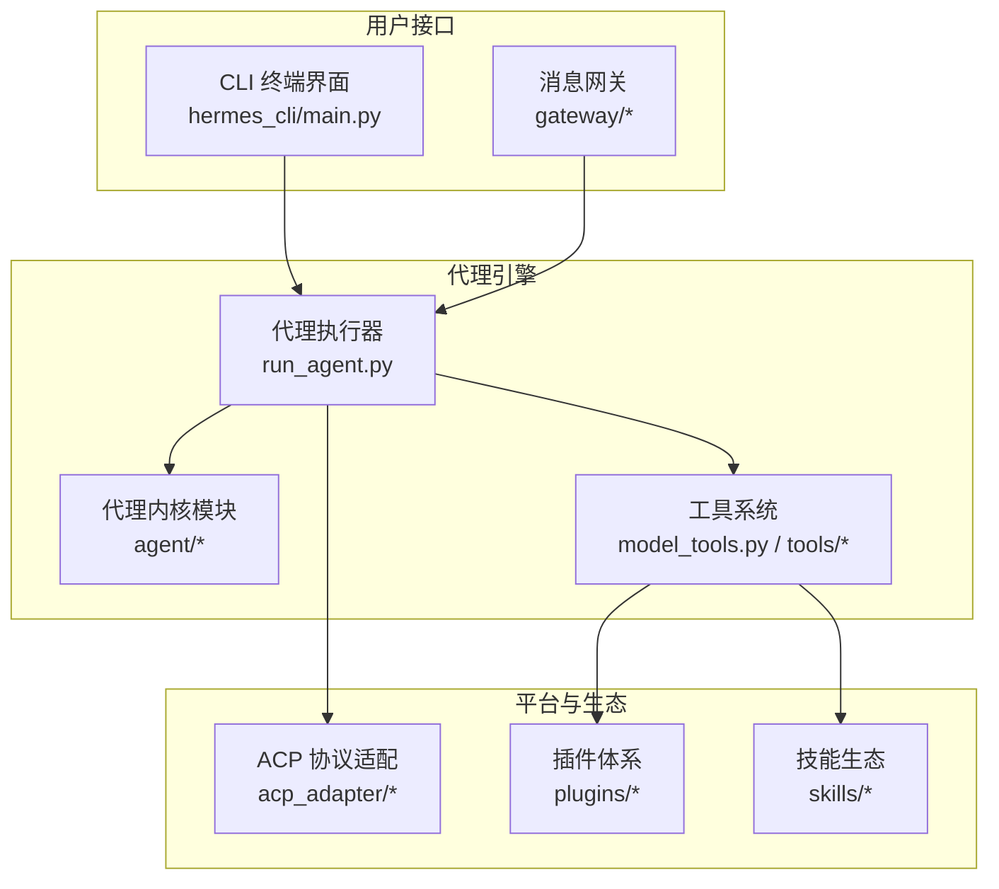
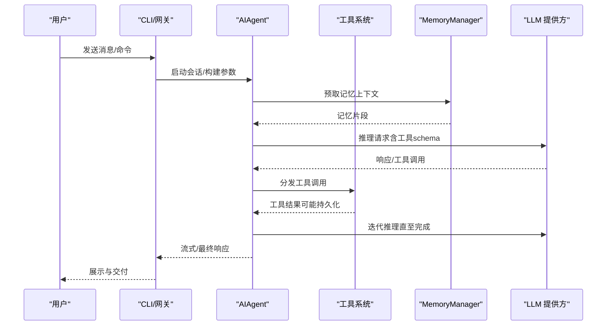
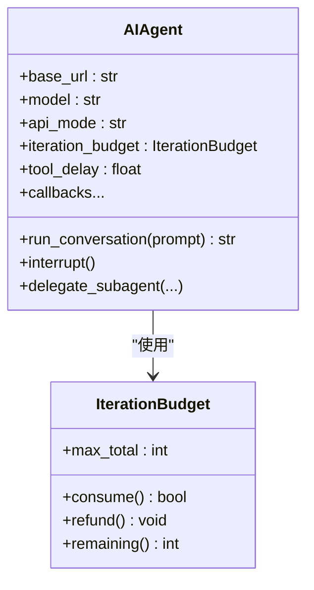
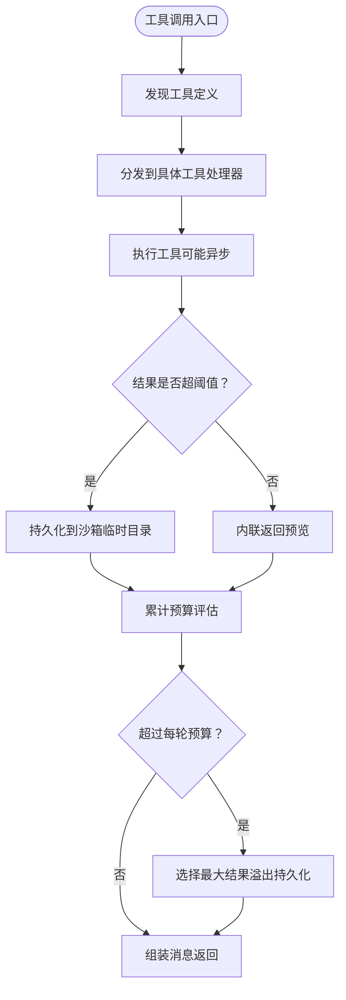
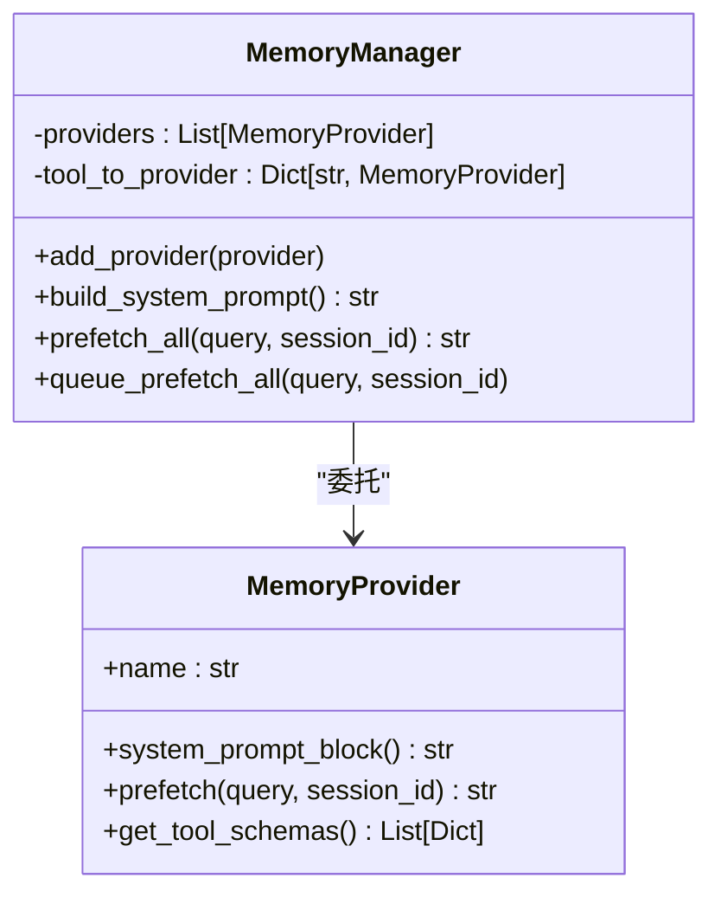
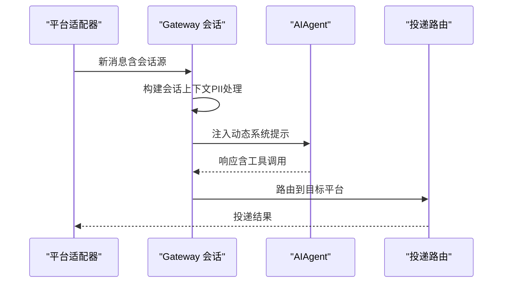
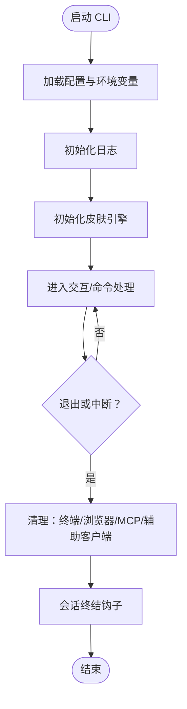
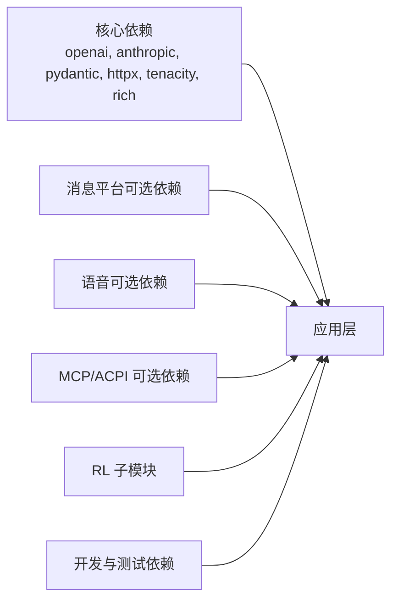

# 核心架构

<cite>
**本文引用的文件**
- [README.md](file://README.md)
- [pyproject.toml](file://pyproject.toml)
- [requirements.txt](file://requirements.txt)
- [run_agent.py](file://run_agent.py)
- [cli.py](file://cli.py)
- [agent/__init__.py](file://agent/__init__.py)
- [agent/memory_manager.py](file://agent/memory_manager.py)
- [model_tools.py](file://model_tools.py)
- [tools/__init__.py](file://tools/__init__.py)
- [tools/tool_result_storage.py](file://tools/tool_result_storage.py)
- [gateway/__init__.py](file://gateway/__init__.py)
- [gateway/session.py](file://gateway/session.py)
- [hermes_cli/__init__.py](file://hermes_cli/__init__.py)
- [hermes_cli/main.py](file://hermes_cli/main.py)
- [acp_adapter/__init__.py](file://acp_adapter/__init__.py)
</cite>

## 目录
1. [引言](#引言)
2. [项目结构](#项目结构)
3. [核心组件](#核心组件)
4. [架构总览](#架构总览)
5. [详细组件分析](#详细组件分析)
6. [依赖关系分析](#依赖关系分析)
7. [性能考量](#性能考量)
8. [故障排查指南](#故障排查指南)
9. [结论](#结论)
10. [附录](#附录)

## 引言
本文件面向Hermes Agent的核心架构文档，聚焦于高层设计、架构模式与系统边界，系统化阐述组件交互、数据流与集成模式，解释技术决策、权衡与约束，并覆盖基础设施需求、可扩展性与部署拓扑。文档同时梳理安全、监控与灾难恢复等横切关注点，记录技术栈、第三方依赖与版本兼容性，重点说明代理引擎、工具系统、平台集成等核心模块的设计理念与实现方式。

## 项目结构
Hermes Agent采用分层与功能域结合的组织方式：
- 运行时与入口
  - hermes_cli：统一命令行入口与子命令（聊天、网关、配置、迁移等）
  - run_agent：独立运行的代理执行器，负责对话循环、工具调用与响应管理
  - cli：交互式终端界面，提供TUI、命令补全与富文本展示
- 核心能力域
  - agent：代理内核与工具编排（记忆、压缩、提示构建、定价与用量统计、显示与轨迹）
  - tools：工具注册、发现与结果持久化（含预算控制与溢出处理）
  - gateway：多平台消息网关（会话、投递、平台适配）
  - acp_adapter：ACP协议适配器（编辑器集成）
- 可选能力与生态
  - plugins：插件体系（内存、仪表盘等）
  - optional-skills：技能生态（按领域划分）
  - skills：内置技能集合
  - cron：定时任务调度（与网关联动）

图表来源
- [hermes_cli/main.py:1-200](file://hermes_cli/main.py#L1-L200)
- [run_agent.py:535-800](file://run_agent.py#L535-L800)
- [agent/__init__.py:1-7](file://agent/__init__.py#L1-L7)
- [model_tools.py:1-200](file://model_tools.py#L1-L200)
- [tools/__init__.py:1-26](file://tools/__init__.py#L1-L26)
- [gateway/__init__.py:1-36](file://gateway/__init__.py#L1-L36)
- [acp_adapter/__init__.py:1-2](file://acp_adapter/__init__.py#L1-L2)

章节来源
- [README.md:1-179](file://README.md#L1-L179)
- [pyproject.toml:1-137](file://pyproject.toml#L1-L137)

## 核心组件
- 代理执行器（AIAgent）
  - 职责：驱动模型推理、工具调用循环、错误分类与回退、上下文压缩、记忆注入、显示与轨迹保存
  - 关键特性：迭代预算、并发工具批处理、安全IO写入、代理内中断传播、子代理委派
- 工具系统（model_tools + tools）
  - 职责：工具发现与注册、异步桥接、结果持久化与预算控制、工具集过滤与要求检查
  - 关键特性：线程本地事件循环、溢出持久化、逐工具阈值与全局预算
- 记忆管理（MemoryManager）
  - 职责：内置与外部记忆提供者编排、预取与同步、上下文围栏与净化
  - 关键特性：单内置提供者 + 最多一个外部提供者；失败隔离
- 网关（Gateway）
  - 职责：会话管理、动态系统提示注入、平台投递路由、平台特定工具集
  - 关键特性：会话源信息、PII脱敏策略、重置策略评估
- CLI
  - 职责：交互式TUI、配置加载与环境变量桥接、资源清理、工作树隔离
  - 关键特性：命令补全、皮肤引擎、异步HTTP客户端中和

章节来源
- [run_agent.py:535-800](file://run_agent.py#L535-L800)
- [model_tools.py:1-200](file://model_tools.py#L1-L200)
- [agent/memory_manager.py:83-200](file://agent/memory_manager.py#L83-L200)
- [gateway/session.py:65-200](file://gateway/session.py#L65-L200)
- [cli.py:192-534](file://cli.py#L192-L534)

## 架构总览
Hermes Agent采用“运行器 + 内核 + 工具 + 平台”的分层架构：
- 运行器层：CLI与网关作为入口，分别面向终端与多平台消息
- 代理内核层：AIAgent封装推理、工具调用、上下文与记忆
- 工具层：统一注册与发现、异步桥接、结果持久化与预算控制
- 平台层：网关抽象不同平台的消息语义与交付

图表来源
- [run_agent.py:535-800](file://run_agent.py#L535-L800)
- [model_tools.py:196-200](file://model_tools.py#L196-L200)
- [agent/memory_manager.py:178-200](file://agent/memory_manager.py#L178-L200)

## 详细组件分析

### 代理执行器（AIAgent）类图
AIAgent是代理引擎的核心编排者，负责：
- 模型适配与API模式自动检测
- 工具调用批处理与并发控制
- 上下文压缩与令牌估算
- 中断机制与子代理委派
- 日志前缀、回调钩子与轨迹保存

图表来源
- [run_agent.py:535-800](file://run_agent.py#L535-L800)
- [run_agent.py:170-212](file://run_agent.py#L170-L212)

章节来源
- [run_agent.py:535-800](file://run_agent.py#L535-L800)

### 工具系统与结果持久化
工具系统通过注册表进行发现与分发，支持：
- 工具定义生成与工具集过滤
- 异步工具处理器的同步桥接
- 大结果持久化与预算控制（逐工具阈值 + 全局预算）

图表来源
- [model_tools.py:1-200](file://model_tools.py#L1-L200)
- [tools/tool_result_storage.py:116-200](file://tools/tool_result_storage.py#L116-L200)

章节来源
- [model_tools.py:1-200](file://model_tools.py#L1-L200)
- [tools/tool_result_storage.py:1-200](file://tools/tool_result_storage.py#L1-L200)

### 记忆管理（MemoryManager）
MemoryManager负责：
- 注册内置与外部记忆提供者（最多一个外部）
- 预取与同步、上下文围栏与净化
- 工具Schema路由与冲突告警

图表来源
- [agent/memory_manager.py:83-200](file://agent/memory_manager.py#L83-L200)

章节来源
- [agent/memory_manager.py:1-200](file://agent/memory_manager.py#L1-L200)

### 网关会话与平台集成
网关负责：
- 会话源信息（平台、聊天类型、线程等）
- 动态系统提示注入（包含可用平台与投递通道）
- PII脱敏策略与会话重置策略

图表来源
- [gateway/session.py:65-200](file://gateway/session.py#L65-L200)
- [gateway/__init__.py:1-36](file://gateway/__init__.py#L1-L36)

章节来源
- [gateway/session.py:1-200](file://gateway/session.py#L1-L200)
- [gateway/__init__.py:1-36](file://gateway/__init__.py#L1-L36)

### CLI 生命周期与资源清理
CLI在启动时加载配置、设置日志与皮肤，退出时进行资源清理（终端环境、浏览器会话、MCP服务器、辅助客户端等），并支持工作树隔离以保障项目安全。

图表来源
- [cli.py:192-534](file://cli.py#L192-L534)
- [hermes_cli/main.py:1-200](file://hermes_cli/main.py#L1-L200)

章节来源
- [cli.py:1-800](file://cli.py#L1-L800)
- [hermes_cli/main.py:1-200](file://hermes_cli/main.py#L1-L200)

## 依赖关系分析
- 技术栈与依赖
  - 核心库：OpenAI、Anthropic、Pydantic、Jinja2、HTTPX、Tenacity、Prompt Toolkit、Rich
  - 可选生态：消息平台（Telegram、Discord、Slack等）、语音（ElevenLabs、Edge TTS）、矩阵、MCP、ACPI、Voice（本地STT）、Modal/Daytona等
  - 开发与测试：pytest、pytest-asyncio、pytest-xdist、RL相关子模块（Atropos/Tinker）
- 版本与兼容性
  - Python 3.11+
  - 通过可选依赖区分平台与功能，避免不必要的安装负担
  - 通过extra标记与条件安装满足不同部署场景（Linux/macOS/Android/WSL）

图表来源
- [pyproject.toml:13-115](file://pyproject.toml#L13-L115)

章节来源
- [pyproject.toml:1-137](file://pyproject.toml#L1-L137)
- [requirements.txt:1-37](file://requirements.txt#L1-L37)

## 性能考量
- 工具并发与批处理
  - 支持只读工具与路径作用域工具的并发批处理，避免破坏性命令与路径冲突
  - 线程池上限与路径不重叠校验降低竞争与资源冲突
- 结果持久化与预算控制
  - 三层防御：逐工具阈值、单结果持久化、每轮聚合预算，防止上下文溢出
  - 沙箱写入保证跨后端一致性
- 事件循环与异步桥接
  - 主线程与工作线程各自持有长生命周期事件循环，避免“事件循环已关闭”问题
- IO安全与编码健壮性
  - 安全stdio包装、代理字符替换与ASCII剥离，提升在非UTF-8环境下的稳定性

## 故障排查指南
- 常见问题定位
  - 代理崩溃或输出异常：检查安全stdio包装与surrogate字符净化逻辑
  - 事件循环错误：确认异步桥接使用线程本地事件循环
  - 工具结果过大导致上下文溢出：核查工具阈值与全局预算配置
  - 网关会话PII泄露风险：确认平台白名单与脱敏策略
- 资源清理
  - CLI退出时确保终端VM、浏览器会话、MCP服务器与辅助客户端被正确关闭
- 日志与诊断
  - CLI集中初始化日志；使用doctor命令检查配置与依赖

章节来源
- [run_agent.py:113-168](file://run_agent.py#L113-L168)
- [model_tools.py:44-126](file://model_tools.py#L44-L126)
- [tools/tool_result_storage.py:116-200](file://tools/tool_result_storage.py#L116-L200)
- [gateway/session.py:175-200](file://gateway/session.py#L175-L200)
- [cli.py:611-652](file://cli.py#L611-L652)

## 结论
Hermes Agent通过清晰的分层架构与模块化设计，在代理引擎、工具系统与平台集成之间建立了高内聚、低耦合的协作关系。其在并发工具批处理、结果持久化与预算控制、异步桥接与事件循环管理、以及安全与编码健壮性方面体现了工程化考量。配合可选依赖与多平台网关，系统具备良好的可扩展性与部署灵活性，适合从个人终端到多平台消息网关的多样化场景。

## 附录
- 基础设施需求
  - Python 3.11+，按需安装可选依赖（消息平台、语音、MCP、ACPI、RL等）
  - 支持本地、Docker、SSH、Modal、Daytona、Singularity等多种终端后端
- 部署拓扑
  - 单机终端：本地后端或容器后端
  - 消息网关：多平台适配器（Telegram、Discord、Slack等）+ 投递路由
  - 扩展：Modal/Daytona无服务器持久化、MCP/ACPI生态集成
- 横切关注点
  - 安全：PII脱敏、命令审批、容器隔离、代理内中断传播
  - 监控：用量与成本估算、日志集中化、状态命令与健康检查
  - 灾难恢复：会话重置策略、轨迹保存、资源清理钩子