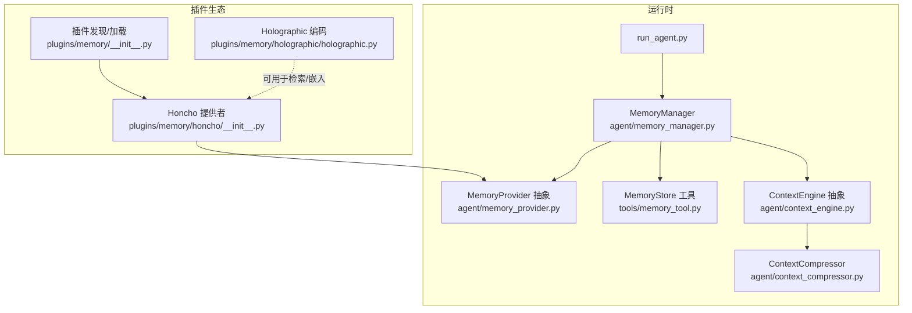
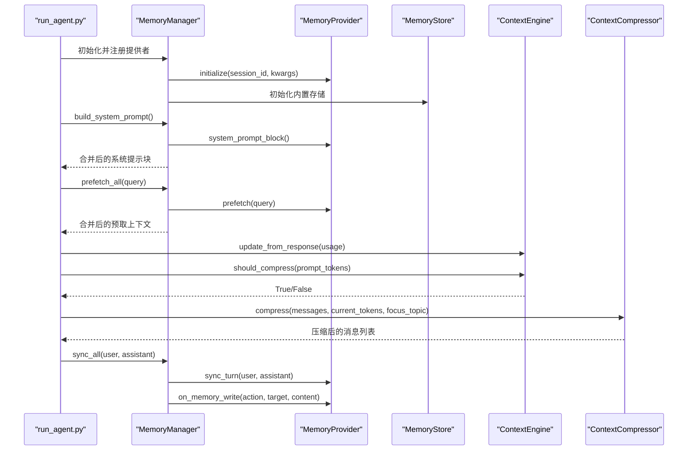
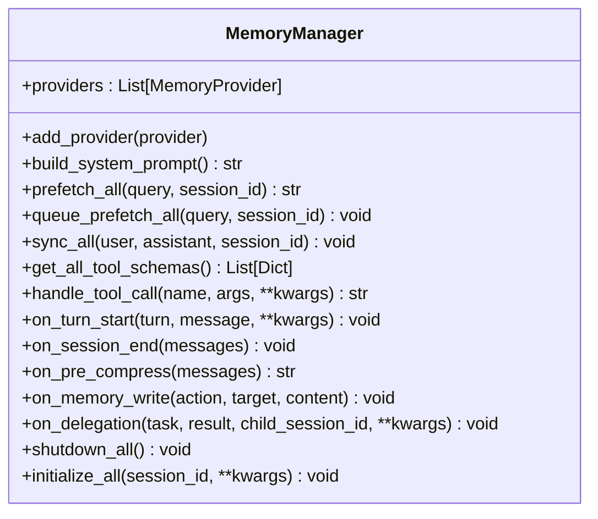
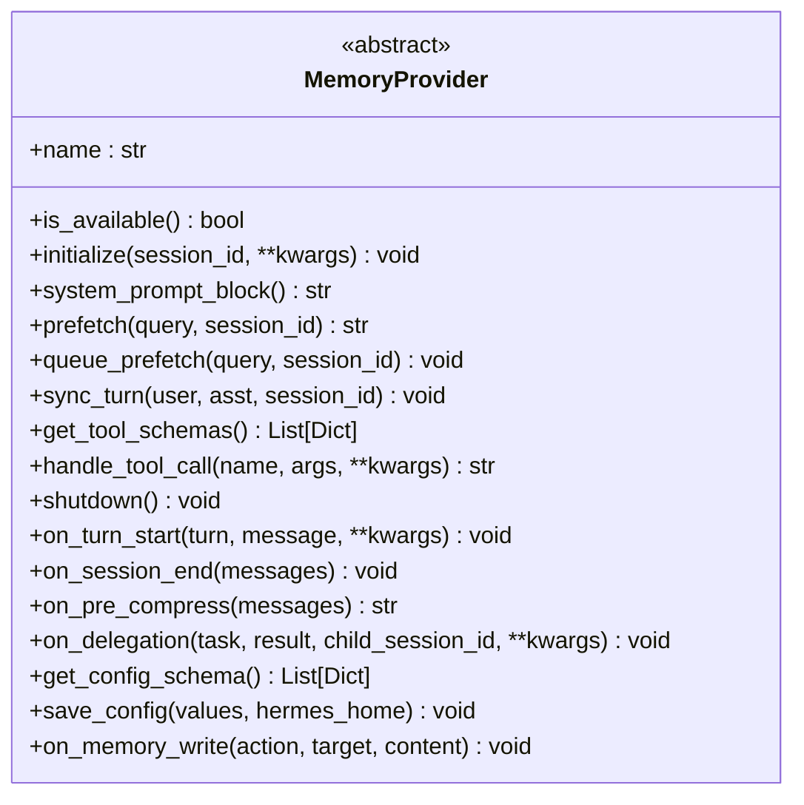
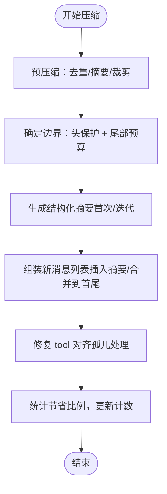
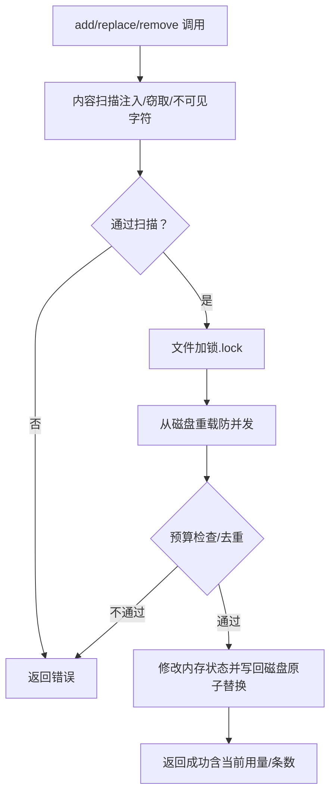
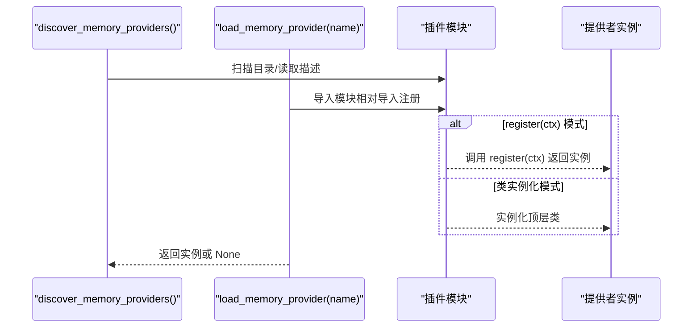
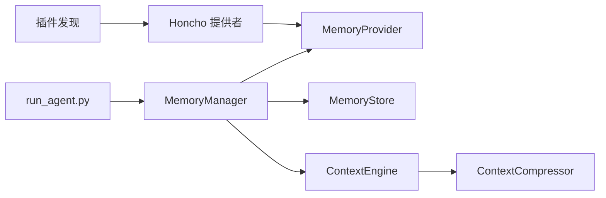

# 记忆管理架构

<cite>
**本文引用的文件**
- [agent/memory_manager.py](file://agent/memory_manager.py)
- [agent/memory_provider.py](file://agent/memory_provider.py)
- [agent/context_engine.py](file://agent/context_engine.py)
- [agent/context_compressor.py](file://agent/context_compressor.py)
- [plugins/memory/__init__.py](file://plugins/memory/__init__.py)
- [plugins/memory/honcho/__init__.py](file://plugins/memory/honcho/__init__.py)
- [plugins/memory/holographic/holographic.py](file://plugins/memory/holographic/holographic.py)
- [tools/memory_tool.py](file://tools/memory_tool.py)
- [run_agent.py](file://run_agent.py)
- [website/docs/developer-guide/memory-provider-plugin.md](file://website/docs/developer-guide/memory-provider-plugin.md)
- [tests/agent/test_memory_provider.py](file://tests/agent/test_memory_provider.py)
</cite>

## 目录
1. [简介](#简介)
2. [项目结构](#项目结构)
3. [核心组件](#核心组件)
4. [架构总览](#架构总览)
5. [详细组件分析](#详细组件分析)
6. [依赖分析](#依赖分析)
7. [性能考虑](#性能考虑)
8. [故障排查指南](#故障排查指南)
9. [结论](#结论)
10. [附录：内存提供者开发指南](#附录内存提供者开发指南)

## 简介
本文件系统性阐述 Hermes Agent 的记忆管理架构，覆盖以下主题：
- 持久化记忆系统的设计理念与数据结构组织
- 用户画像管理、对话历史存储与上下文压缩机制
- 内存提供者的插件化架构、工具模式与生命周期
- 上下文引擎工作原理、检索算法与相关性评分机制
- 内存优化策略、缓存管理与性能调优
- 自定义存储后端的集成方法与开发指南

## 项目结构
围绕记忆管理的关键模块分布如下：
- 记忆管理器与抽象接口：agent/memory_manager.py、agent/memory_provider.py
- 上下文引擎与压缩器：agent/context_engine.py、agent/context_compressor.py
- 内存工具（内置持久化）：tools/memory_tool.py
- 插件发现与加载：plugins/memory/__init__.py
- 典型外部提供者示例：plugins/memory/honcho/__init__.py
- 可选向量编码工具：plugins/memory/holographic/holographic.py
- 启动集成点：run_agent.py
- 开发者文档：website/docs/developer-guide/memory-provider-plugin.md
- 测试用例：tests/agent/test_memory_provider.py

图示来源
- [run_agent.py:1283-1306](file://run_agent.py#L1283-L1306)
- [agent/memory_manager.py:83-147](file://agent/memory_manager.py#L83-L147)
- [agent/memory_provider.py:42-232](file://agent/memory_provider.py#L42-L232)
- [agent/context_engine.py:32-185](file://agent/context_engine.py#L32-L185)
- [agent/context_compressor.py:188-1164](file://agent/context_compressor.py#L188-L1164)
- [plugins/memory/__init__.py:159-182](file://plugins/memory/__init__.py#L159-L182)
- [plugins/memory/honcho/__init__.py:186-800](file://plugins/memory/honcho/__init__.py#L186-L800)
- [plugins/memory/holographic/holographic.py:1-204](file://plugins/memory/holographic/holographic.py#L1-L204)
- [tools/memory_tool.py:105-585](file://tools/memory_tool.py#L105-L585)

章节来源
- [agent/memory_manager.py:1-374](file://agent/memory_manager.py#L1-L374)
- [agent/memory_provider.py:1-232](file://agent/memory_provider.py#L1-L232)
- [agent/context_engine.py:1-185](file://agent/context_engine.py#L1-L185)
- [agent/context_compressor.py:1-1164](file://agent/context_compressor.py#L1-L1164)
- [plugins/memory/__init__.py:1-407](file://plugins/memory/__init__.py#L1-L407)
- [plugins/memory/honcho/__init__.py:1-1055](file://plugins/memory/honcho/__init__.py#L1-L1055)
- [plugins/memory/holographic/holographic.py:1-204](file://plugins/memory/holographic/holographic.py#L1-L204)
- [tools/memory_tool.py:1-585](file://tools/memory_tool.py#L1-L585)
- [run_agent.py:1283-1306](file://run_agent.py#L1283-L1306)
- [website/docs/developer-guide/memory-provider-plugin.md:1-52](file://website/docs/developer-guide/memory-provider-plugin.md#L1-L52)
- [tests/agent/test_memory_provider.py:131-348](file://tests/agent/test_memory_provider.py#L131-L348)

## 核心组件
- MemoryManager：统一编排内置与外部内存提供者，负责注册、系统提示拼接、预取、同步、工具路由与生命周期钩子。
- MemoryProvider 抽象：定义提供者生命周期与可选钩子，约束外部提供者实现。
- ContextEngine 抽象与 ContextCompressor：控制上下文压缩阈值、保护首尾消息、生成摘要并进行工具对齐与边界修正。
- MemoryStore（内置）：基于文件的持久化存储，支持原子写入、并发锁、内容扫描与系统提示快照冻结。
- 插件发现与加载：扫描内置与用户插件目录，按名称加载提供者实例。

章节来源
- [agent/memory_manager.py:83-374](file://agent/memory_manager.py#L83-L374)
- [agent/memory_provider.py:42-232](file://agent/memory_provider.py#L42-L232)
- [agent/context_engine.py:32-185](file://agent/context_engine.py#L32-L185)
- [agent/context_compressor.py:188-1164](file://agent/context_compressor.py#L188-L1164)
- [tools/memory_tool.py:105-585](file://tools/memory_tool.py#L105-L585)
- [plugins/memory/__init__.py:159-182](file://plugins/memory/__init__.py#L159-L182)

## 架构总览
Hermes Agent 的记忆管理采用“内置优先 + 外部插件”的双层架构：
- 内置提供者始终激活，不可移除，负责系统提示快照、持久化存储与基础工具。
- 外部提供者（如 Honcho）可选启用，同一时刻仅允许一个非内置提供者，避免工具冲突与后端竞争。
- 上下文引擎在接近上下文阈值时触发压缩，保护首尾消息，通过结构化摘要保留关键信息。

图示来源
- [run_agent.py:1283-1306](file://run_agent.py#L1283-L1306)
- [agent/memory_manager.py:157-220](file://agent/memory_manager.py#L157-L220)
- [agent/context_engine.py:65-90](file://agent/context_engine.py#L65-L90)
- [agent/context_compressor.py:999-1164](file://agent/context_compressor.py#L999-L1164)
- [tools/memory_tool.py:463-501](file://tools/memory_tool.py#L463-L501)

## 详细组件分析

### MemoryManager：多提供者编排与工具路由
- 注册与约束：内置提供者总是第一个；最多仅允许一个非内置提供者，重复注册会警告并拒绝。
- 系统提示拼接：收集所有提供者的静态提示块，按提供者标注合并。
- 预取与队列：逐个提供者执行 prefetch 并合并结果；queue_prefetch 支持后台预取。
- 同步与生命周期：逐个提供者执行 sync_turn、on_turn_start、on_session_end、on_pre_compress、on_memory_write、on_delegation 等钩子。
- 工具路由：根据工具名映射到具体提供者，冲突时记录警告并忽略重复项。
- 初始化：自动注入 hermes_home、platform 等参数，逐个初始化。

图示来源
- [agent/memory_manager.py:83-374](file://agent/memory_manager.py#L83-L374)

章节来源
- [agent/memory_manager.py:97-147](file://agent/memory_manager.py#L97-L147)
- [agent/memory_manager.py:157-220](file://agent/memory_manager.py#L157-L220)
- [agent/memory_manager.py:249-268](file://agent/memory_manager.py#L249-L268)
- [agent/memory_manager.py:271-354](file://agent/memory_manager.py#L271-L354)
- [agent/memory_manager.py:356-374](file://agent/memory_manager.py#L356-L374)
- [tests/agent/test_memory_provider.py:138-156](file://tests/agent/test_memory_provider.py#L138-L156)

### MemoryProvider 抽象：生命周期与可选钩子
- 必须实现：name、is_available、initialize、get_tool_schemas。
- 可选实现：system_prompt_block、prefetch、queue_prefetch、sync_turn、handle_tool_call、shutdown。
- 可选钩子：on_turn_start、on_session_end、on_pre_compress、on_delegation、on_memory_write。
- 配置能力：get_config_schema、save_config，支持环境变量或原生配置文件。

图示来源
- [agent/memory_provider.py:42-232](file://agent/memory_provider.py#L42-L232)

章节来源
- [agent/memory_provider.py:52-137](file://agent/memory_provider.py#L52-L137)
- [agent/memory_provider.py:144-231](file://agent/memory_provider.py#L144-L231)

### 上下文引擎与压缩器：阈值、保护与摘要
- ContextEngine：定义名称、令牌状态字段、压缩参数（阈值百分比、保护首尾条数）、核心接口 update_from_response、should_compress、compress，以及可选工具与状态展示。
- ContextCompressor（默认实现）：
  - 预压缩：对旧工具结果进行“信息性摘要”替换，去重与裁剪长参数，降低后续 LLM 摘要成本。
  - 保护策略：固定保护前 N 条与尾部预算保护（按令牌预算而非固定条数），确保最新用户消息进入尾部。
  - 结构化摘要：使用模板化的摘要提示，包含目标任务、已完成动作、阻塞问题、关键决策等，支持首次与迭代更新两种路径。
  - 工具对齐：压缩后修复孤立的 tool_call 与 tool_result，保证 API 一致性。
  - 抗抖动：统计压缩节省比例，连续低效时跳过压缩以避免无限循环。

图示来源
- [agent/context_compressor.py:336-468](file://agent/context_compressor.py#L336-L468)
- [agent/context_compressor.py:932-994](file://agent/context_compressor.py#L932-L994)
- [agent/context_compressor.py:545-756](file://agent/context_compressor.py#L545-L756)
- [agent/context_compressor.py:778-836](file://agent/context_compressor.py#L778-L836)
- [agent/context_compressor.py:999-1164](file://agent/context_compressor.py#L999-L1164)

章节来源
- [agent/context_engine.py:32-185](file://agent/context_engine.py#L32-L185)
- [agent/context_compressor.py:188-1164](file://agent/context_compressor.py#L188-L1164)

### 内置持久化存储：MemoryStore
- 文件布局：$HERMES_HOME/memories/MEMORY.md 与 USER.md，分段符为“§”，支持多行条目。
- 并发安全：使用独立 .lock 文件与平台特定锁（fcntl/msvcrt），写入采用临时文件 + 原子替换，避免读到中间态。
- 系统提示冻结：加载时捕获快照，会话期间不随变更而变化，保持前缀缓存稳定。
- 内容扫描：检测潜在注入/窃取模式与不可见字符，阻止高风险内容进入系统提示。
- 字符限制：分别针对 MEMORY 与 USER 设定上限，添加/替换前进行预算检查。
- 工具接口：统一的 memory 工具 schema，支持 add、replace、remove 动作。

图示来源
- [tools/memory_tool.py:222-357](file://tools/memory_tool.py#L222-L357)
- [tools/memory_tool.py:410-461](file://tools/memory_tool.py#L410-L461)
- [tools/memory_tool.py:359-408](file://tools/memory_tool.py#L359-L408)

章节来源
- [tools/memory_tool.py:105-585](file://tools/memory_tool.py#L105-L585)

### 插件化内存提供者：发现、加载与示例
- 发现与加载：扫描 plugins/memory 与 $HERMES_HOME/plugins，支持 register(ctx) 或直接类实例化两种方式；内置优先于用户插件。
- CLI 命令：仅对当前激活的提供者暴露命令。
- 示例：Honcho 提供者支持三种回忆模式（context、tools、hybrid），具备成本感知的注入频率、上下文刷新与多轮对话推理（dialectic depth）。

图示来源
- [plugins/memory/__init__.py:122-182](file://plugins/memory/__init__.py#L122-L182)
- [plugins/memory/__init__.py:184-284](file://plugins/memory/__init__.py#L184-L284)
- [plugins/memory/honcho/__init__.py:186-428](file://plugins/memory/honcho/__init__.py#L186-L428)

章节来源
- [plugins/memory/__init__.py:1-407](file://plugins/memory/__init__.py#L1-L407)
- [plugins/memory/honcho/__init__.py:1-1055](file://plugins/memory/honcho/__init__.py#L1-L1055)

### 可选检索增强：Holographic Reduced Representations
- 使用相位向量编码概念，支持绑定（bind）、解绑（unbind）、打包（bundle）与相似度计算，适合构建稳定的语义表示与检索。
- 提供序列化/反序列化接口，便于持久化与跨进程复现。

章节来源
- [plugins/memory/holographic/holographic.py:1-204](file://plugins/memory/holographic/holographic.py#L1-L204)

## 依赖分析
- 运行时集成点：run_agent.py 在启动阶段解析配置、初始化 MemoryManager，并将内置与外部提供者串联起来。
- 提供者耦合：MemoryManager 与 MemoryProvider 为强契约关系，提供者间互不影响；外部提供者数量受控。
- 引擎耦合：ContextEngine 与 ContextCompressor 解耦，可通过插件替换默认压缩器。
- 存储耦合：内置 MemoryStore 与 MemoryManager 的 on_memory_write 钩子配合，实现对内置存储的镜像写入。

图示来源
- [run_agent.py:1283-1306](file://run_agent.py#L1283-L1306)
- [agent/memory_manager.py:83-147](file://agent/memory_manager.py#L83-L147)
- [plugins/memory/__init__.py:159-182](file://plugins/memory/__init__.py#L159-L182)

章节来源
- [run_agent.py:1283-1306](file://run_agent.py#L1283-L1306)
- [agent/memory_manager.py:83-147](file://agent/memory_manager.py#L83-L147)
- [plugins/memory/__init__.py:159-182](file://plugins/memory/__init__.py#L159-L182)

## 性能考虑
- 预取与后台线程：外部提供者可在 queue_prefetch 中异步拉取，prefetch 返回缓存结果，减少每次请求延迟。
- 预压缩与摘要成本：先对工具结果做“信息性摘要”与去重，显著降低摘要模型输入规模。
- 尾部预算保护：按令牌预算而非固定条数保护尾部，兼顾最新上下文完整性与压缩效率。
- 抗抖动：当连续两次压缩节省不足 10% 时跳过压缩，避免陷入无效循环。
- 原子写入与锁：内置存储采用原子替换与文件锁，降低并发写入的可见性问题与 IO 成本。
- 缓存与冻结：系统提示冻结快照保持前缀缓存稳定，提升推理速度。

## 故障排查指南
- 外部提供者未激活
  - 检查 is_available 与 initialize 是否抛出异常；确认配置中 memory.provider 设置正确。
  - 查看日志中“Rejected memory provider”警告，确认是否已存在非内置提供者。
- 预取失败
  - prefetch/queue_prefetch 的异常会被记录为调试日志；检查网络与凭据配置。
- 工具调用失败
  - handle_tool_call 返回错误字符串；检查工具 schema 名称与参数。
- 压缩失败
  - 摘要生成失败会进入冷却期；检查摘要模型可用性与降级逻辑。
- 内置存储写入失败
  - 检查文件锁、磁盘权限与原子写入过程中的异常；确认内容扫描未拦截高风险文本。

章节来源
- [agent/memory_manager.py:176-220](file://agent/memory_manager.py#L176-L220)
- [agent/memory_manager.py:249-268](file://agent/memory_manager.py#L249-L268)
- [agent/context_compressor.py:709-755](file://agent/context_compressor.py#L709-L755)
- [tools/memory_tool.py:222-265](file://tools/memory_tool.py#L222-L265)

## 结论
Hermes Agent 的记忆管理架构通过“内置优先 + 外部插件”的设计，在保证系统稳定性的同时提供了强大的扩展能力。内置 MemoryStore 提供可靠的持久化与系统提示冻结；MemoryManager 统一编排多提供者并屏蔽差异；ContextCompressor 则在长上下文场景下通过结构化摘要与尾部预算保护实现高效压缩。插件体系简化了第三方存储后端的接入，开发者可快速实现自定义提供者并融入整体工作流。

## 附录：内存提供者开发指南
- 目录结构
  - plugins/memory/<name>/ 下包含 __init__.py（实现 MemoryProvider）、plugin.yaml（元数据）、README.md（使用说明）。
- 实现要点
  - 必须实现：name、is_available、initialize、get_tool_schemas。
  - 可选实现：prefetch、queue_prefetch、sync_turn、handle_tool_call、on_* 生命周期钩子。
  - 配置：get_config_schema 与 save_config，优先使用环境变量或原生配置文件。
- 注册与加载
  - 支持 register(ctx) 或直接类实例化；内置提供者优先于用户插件。
- 测试与验证
  - 使用测试用例验证注册、系统提示合并、预取合并、生命周期钩子与关闭顺序等行为。

章节来源
- [website/docs/developer-guide/memory-provider-plugin.md:15-52](file://website/docs/developer-guide/memory-provider-plugin.md#L15-L52)
- [agent/memory_provider.py:188-231](file://agent/memory_provider.py#L188-L231)
- [plugins/memory/__init__.py:184-284](file://plugins/memory/__init__.py#L184-L284)
- [tests/agent/test_memory_provider.py:138-156](file://tests/agent/test_memory_provider.py#L138-L156)