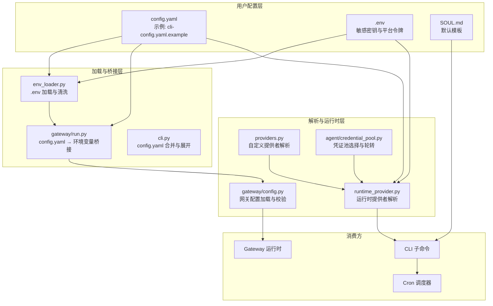
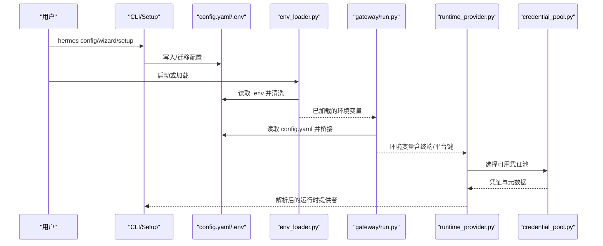
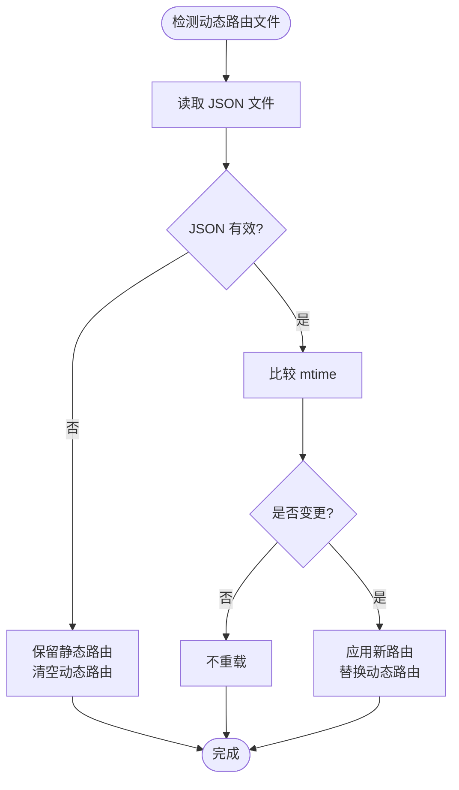
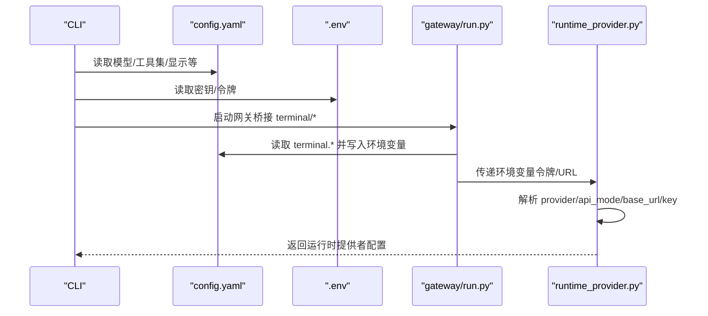
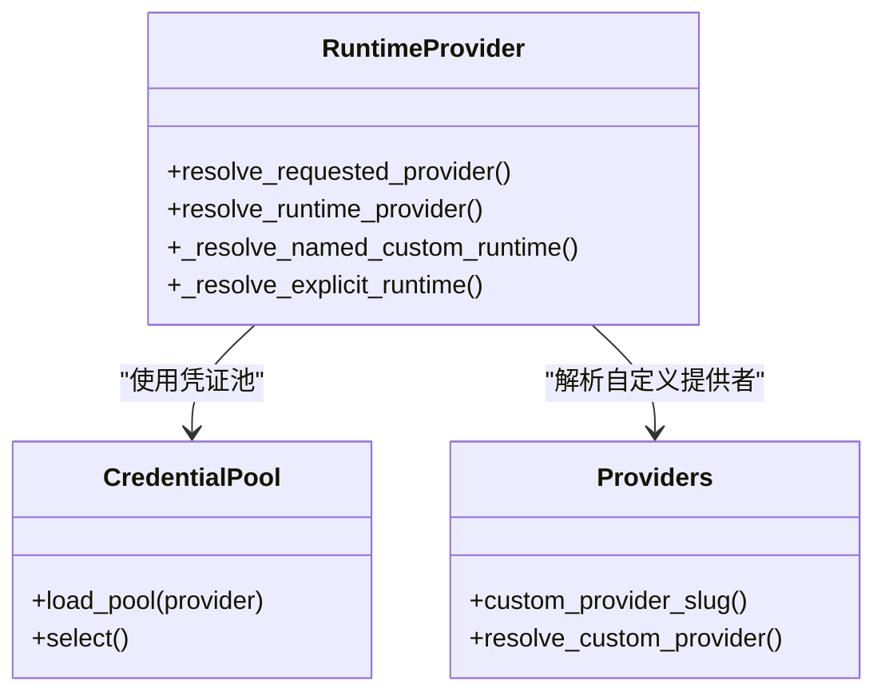
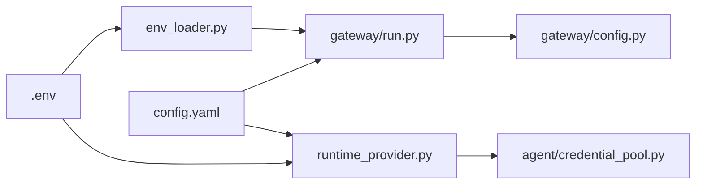

# 配置系统架构

<cite>
**本文引用的文件**
- [cli-config.yaml.example](file://cli-config.yaml.example)
- [hermes_cli/config.py](file://hermes_cli/config.py)
- [hermes_cli/env_loader.py](file://hermes_cli/env_loader.py)
- [hermes_cli/runtime_provider.py](file://hermes_cli/runtime_provider.py)
- [gateway/config.py](file://gateway/config.py)
- [gateway/run.py](file://gateway/run.py)
- [cli.py](file://cli.py)
- [hermes_cli/providers.py](file://hermes_cli/providers.py)
- [agent/credential_pool.py](file://agent/credential_pool.py)
- [hermes_cli/default_soul.py](file://hermes_cli/default_soul.py)
- [tests/gateway/test_webhook_dynamic_routes.py](file://tests/gateway/test_webhook_dynamic_routes.py)
- [website/docs/user-guide/security.md](file://website/docs/user-guide/security.md)
</cite>

## 目录
1. [简介](#简介)
2. [项目结构](#项目结构)
3. [核心组件](#核心组件)
4. [架构总览](#架构总览)
5. [详细组件分析](#详细组件分析)
6. [依赖关系分析](#依赖关系分析)
7. [性能考量](#性能考量)
8. [故障排查指南](#故障排查指南)
9. [结论](#结论)
10. [附录](#附录)

## 简介
本文件系统化阐述 Hermes Agent 的配置系统架构，覆盖配置文件层次结构与优先级、环境变量管理、动态配置更新、配置验证流程、CLI/环境/运行时配置的集成模式、热重载与变更通知、回滚策略、安全与敏感信息保护、配置模板系统，以及扩展开发与自定义配置提供者实现方法。目标是帮助开发者与运维人员在不深入源码的前提下理解并高效使用配置系统。

## 项目结构
Hermes 配置体系由“用户配置文件”“环境变量”“运行时桥接”三部分构成，并通过多处入口点加载与合并，最终服务于 CLI、网关（Gateway）、任务调度等子系统。

图示来源
- [gateway/run.py:90-115](file://gateway/run.py#L90-L115)
- [cli.py:366-388](file://cli.py#L366-L388)
- [hermes_cli/env_loader.py:92-124](file://hermes_cli/env_loader.py#L92-L124)
- [hermes_cli/runtime_provider.py:660-800](file://hermes_cli/runtime_provider.py#L660-L800)
- [gateway/config.py:435-697](file://gateway/config.py#L435-L697)
- [hermes_cli/providers.py:473-511](file://hermes_cli/providers.py#L473-L511)
- [agent/credential_pool.py:278-310](file://agent/credential_pool.py#L278-L310)

章节来源
- [cli-config.yaml.example:1-800](file://cli-config.yaml.example#L1-L800)
- [hermes_cli/env_loader.py:1-124](file://hermes_cli/env_loader.py#L1-L124)
- [gateway/run.py:90-115](file://gateway/run.py#L90-L115)
- [cli.py:366-388](file://cli.py#L366-L388)
- [hermes_cli/runtime_provider.py:1-800](file://hermes_cli/runtime_provider.py#L1-L800)
- [gateway/config.py:1-800](file://gateway/config.py#L1-L800)
- [hermes_cli/providers.py:473-511](file://hermes_cli/providers.py#L473-L511)
- [agent/credential_pool.py:278-310](file://agent/credential_pool.py#L278-L310)

## 核心组件
- 用户配置文件
  - config.yaml：主配置入口，包含模型、终端、工具集、平台、流式传输、会话重置策略、显示行为等。
  - 示例参考：cli-config.yaml.example 提供字段说明与注释。
- 环境变量与 .env
  - .env：存放敏感密钥与平台令牌；env_loader.py 负责清洗与加载。
  - 环境变量桥接：gateway/run.py 将 config.yaml 中的部分键映射到环境变量，确保终端设置以 config.yaml 为准。
- 运行时配置解析
  - runtime_provider.py：统一解析请求的推理提供者、API 模式、Base URL、API Key，支持凭证池与自定义提供者。
  - gateway/config.py：加载并校验网关相关配置（平台、会话重置策略、流式传输等），支持环境变量覆盖与默认值。
- 配置模板与迁移
  - default_soul.py：首次运行时生成 SOUL.md 默认模板。
  - hermes_cli/config.py：提供配置版本检查、迁移、结构校验、警告提示与 .env 清洗。

章节来源
- [cli-config.yaml.example:1-800](file://cli-config.yaml.example#L1-L800)
- [hermes_cli/env_loader.py:1-124](file://hermes_cli/env_loader.py#L1-L124)
- [gateway/run.py:90-115](file://gateway/run.py#L90-L115)
- [hermes_cli/runtime_provider.py:1-800](file://hermes_cli/runtime_provider.py#L1-L800)
- [gateway/config.py:1-800](file://gateway/config.py#L1-L800)
- [hermes_cli/default_soul.py:1-12](file://hermes_cli/default_soul.py#L1-L12)

## 架构总览
配置系统采用“分层优先级 + 动态桥接 + 结构化校验”的设计，确保：
- 用户配置优先于环境变量；
- 网关运行时可从 config.yaml 直接读取并桥接到环境变量；
- 运行时按需解析提供者与凭证，支持凭证池轮转与自定义提供者；
- 配置迁移与结构校验保障升级与健壮性；
- 安全策略贯穿凭证清洗、最小暴露与错误脱敏。

图示来源
- [hermes_cli/env_loader.py:92-124](file://hermes_cli/env_loader.py#L92-L124)
- [gateway/run.py:90-115](file://gateway/run.py#L90-L115)
- [hermes_cli/runtime_provider.py:660-800](file://hermes_cli/runtime_provider.py#L660-L800)
- [agent/credential_pool.py:278-310](file://agent/credential_pool.py#L278-L310)

## 详细组件分析

### 配置文件层次结构与优先级
- 层次与来源
  - 用户主配置：~/.hermes/config.yaml（示例见 cli-config.yaml.example）
  - 敏感密钥：~/.hermes/.env（由 env_loader.py 加载与清洗）
  - 网关历史配置：~/.hermes/gateway.json（兼容降级）
  - 环境变量：覆盖 config.yaml 中的对应键（如平台令牌、终端参数）
- 优先级规则
  - 环境变量 > config.yaml > gateway.json（降级） > 内置默认值
  - config.yaml 中的简单键（非嵌套）仅在 .env 未设置时才写入环境变量，避免覆盖用户显式设置
  - 终端配置（terminal.*）通过 config.yaml 显式桥接为环境变量（如 TERMINAL_*），且优先于 .env

章节来源
- [cli-config.yaml.example:1-800](file://cli-config.yaml.example#L1-L800)
- [hermes_cli/env_loader.py:92-124](file://hermes_cli/env_loader.py#L92-L124)
- [gateway/run.py:90-115](file://gateway/run.py#L90-L115)
- [gateway/config.py:435-697](file://gateway/config.py#L435-L697)

### 环境变量管理与桥接
- .env 加载与清洗
  - 自动修复拼接的 KEY=VALUE 行，避免解析异常
  - 对以 _API_KEY/_TOKEN/_SECRET 结尾的变量进行 ASCII 清洗，防止非 ASCII 字符导致 HTTP 头部编码问题
- config.yaml → 环境变量桥接
  - 将 terminal.*、平台特定键映射为环境变量，确保终端设置以 config.yaml 为准
  - 支持从 config.yaml 注入平台令牌、提及模式、自由回复通道等

章节来源
- [hermes_cli/env_loader.py:18-90](file://hermes_cli/env_loader.py#L18-L90)
- [gateway/run.py:90-115](file://gateway/run.py#L90-L115)

### 动态配置更新与热重载
- 网关动态路由热重载
  - 基于文件时间戳门控（mtime）的动态路由文件监控，支持新增/更新/删除触发重载
  - 当文件损坏时保留静态路由，避免服务中断
- CLI/网关配置变更通知
  - 迁移与校验阶段输出明确提示，引导用户执行重启或刷新操作
  - 网关启动时对无效/占位令牌进行告警，避免连接失败

图示来源
- [tests/gateway/test_webhook_dynamic_routes.py:42-87](file://tests/gateway/test_webhook_dynamic_routes.py#L42-L87)

章节来源
- [tests/gateway/test_webhook_dynamic_routes.py:42-87](file://tests/gateway/test_webhook_dynamic_routes.py#L42-L87)

### 配置验证与迁移
- 结构校验
  - 检查 custom_providers、fallback_model 等关键字段的完整性与位置正确性
  - 对误放字段给出迁移建议，避免运行期错误
- 版本迁移
  - 自动迁移 .env 到 config.yaml 的旧字段（如工具进度）
  - 添加新版本字段（如 timezone），并记录变更
- 启动前警告
  - 在 CLI/Gateway 初始化早期打印配置问题，便于快速定位

章节来源
- [hermes_cli/config.py:2000-2200](file://hermes_cli/config.py#L2000-L2200)
- [hermes_cli/config.py:2143-2200](file://hermes_cli/config.py#L2143-L2200)
- [hermes_cli/config.py:2074-2095](file://hermes_cli/config.py#L2074-L2095)

### CLI、环境与运行时配置集成
- CLI 启动时合并 config.yaml 与默认值，展开 ${ENV_VAR} 占位符
- 网关启动时优先加载 config.yaml，再应用环境变量覆盖
- 运行时解析提供者时，优先使用凭证池中的可用凭证，其次回退到环境变量或内置逻辑

图示来源
- [cli.py:366-388](file://cli.py#L366-L388)
- [gateway/run.py:90-115](file://gateway/run.py#L90-L115)
- [hermes_cli/runtime_provider.py:660-800](file://hermes_cli/runtime_provider.py#L660-L800)

章节来源
- [cli.py:366-388](file://cli.py#L366-L388)
- [gateway/run.py:90-115](file://gateway/run.py#L90-L115)
- [hermes_cli/runtime_provider.py:1-800](file://hermes_cli/runtime_provider.py#L1-L800)

### 回滚策略
- 运行时提供者解析具备“自动回退”能力：当检测到自动推断的提供者凭证失效或不可用时，会回退到下一个可用提供者或环境变量提供者，避免完全中断
- 网关动态路由在文件损坏时保留静态路由，确保服务稳定

章节来源
- [hermes_cli/runtime_provider.py:750-792](file://hermes_cli/runtime_provider.py#L750-L792)
- [tests/gateway/test_webhook_dynamic_routes.py:82-87](file://tests/gateway/test_webhook_dynamic_routes.py#L82-L87)

### 配置安全机制与敏感信息保护
- 凭证清洗
  - 仅对以 _API_KEY/_TOKEN/_SECRET 结尾的变量进行 ASCII 清洗，避免非 ASCII 导致的头部编码问题
- 最小暴露
  - MCP 子进程仅传递安全的 PATH/HOME 等基础变量，其他凭据被剥离
- 错误脱敏
  - 对错误消息中的敏感参数（如 PAT、Bearer Token、API_KEY/password 等）进行脱敏处理
- 生产最佳实践
  - .env 设置适当权限（600），避免明文泄露
  - 使用容器后端、限制资源、启用 DM 配对、定期审计命令白名单

章节来源
- [hermes_cli/env_loader.py:18-44](file://hermes_cli/env_loader.py#L18-L44)
- [website/docs/user-guide/security.md:416-545](file://website/docs/user-guide/security.md#L416-L545)

### 配置模板系统
- SOUL.md 模板
  - 首次运行时由 default_soul.py 生成默认模板，作为系统提示词的基础
- CLI 配置示例
  - cli-config.yaml.example 提供字段注释与示例，便于用户理解各配置项含义与取值范围

章节来源
- [hermes_cli/default_soul.py:1-12](file://hermes_cli/default_soul.py#L1-L12)
- [cli-config.yaml.example:1-800](file://cli-config.yaml.example#L1-L800)

### 扩展开发与自定义配置提供者
- 自定义提供者注册
  - 在 config.yaml 的 providers 字段中定义名称、URL、API Key 来源（key_env 或内联 api_key）
  - 运行时通过 runtime_provider.py 解析名称，匹配 custom:slug 或显示名
- 凭证池集成
  - 可为自定义提供者建立凭证池，支持同提供者内的轮转策略（填充优先/轮询/随机）
- 提供者解析一致性
  - providers.py 提供 slug 规范化与解析逻辑，确保 CLI/Gateway/Agent 一致

图示来源
- [hermes_cli/runtime_provider.py:218-426](file://hermes_cli/runtime_provider.py#L218-L426)
- [agent/credential_pool.py:278-310](file://agent/credential_pool.py#L278-L310)
- [hermes_cli/providers.py:473-511](file://hermes_cli/providers.py#L473-L511)

章节来源
- [hermes_cli/runtime_provider.py:218-426](file://hermes_cli/runtime_provider.py#L218-L426)
- [agent/credential_pool.py:278-310](file://agent/credential_pool.py#L278-L310)
- [hermes_cli/providers.py:473-511](file://hermes_cli/providers.py#L473-L511)

## 依赖关系分析
- 配置加载链路
  - env_loader.py → gateway/run.py（桥接）→ gateway/config.py（网关配置）→ runtime_provider.py（运行时解析）
- 关键耦合点
  - 环境变量桥接：terminal.* → 环境变量（TERMINAL_*）
  - 提供者解析：providers/providers.py 与 runtime_provider.py 共用解析逻辑
  - 凭证池：runtime_provider.py 与 agent/credential_pool.py 协作

图示来源
- [hermes_cli/env_loader.py:92-124](file://hermes_cli/env_loader.py#L92-L124)
- [gateway/run.py:90-115](file://gateway/run.py#L90-L115)
- [gateway/config.py:435-697](file://gateway/config.py#L435-L697)
- [hermes_cli/runtime_provider.py:660-800](file://hermes_cli/runtime_provider.py#L660-L800)
- [agent/credential_pool.py:278-310](file://agent/credential_pool.py#L278-L310)

章节来源
- [hermes_cli/env_loader.py:92-124](file://hermes_cli/env_loader.py#L92-L124)
- [gateway/run.py:90-115](file://gateway/run.py#L90-L115)
- [gateway/config.py:435-697](file://gateway/config.py#L435-L697)
- [hermes_cli/runtime_provider.py:660-800](file://hermes_cli/runtime_provider.py#L660-L800)
- [agent/credential_pool.py:278-310](file://agent/credential_pool.py#L278-L310)

## 性能考量
- 配置加载
  - 采用延迟加载与缓存策略（如凭证池加载），避免重复网络请求
- 环境变量桥接
  - 仅在启动阶段一次性桥接，减少运行时开销
- 动态路由
  - 基于 mtime 的轻量监控，避免频繁 IO；损坏文件场景下快速失败并回退

## 故障排查指南
- 常见问题
  - 占位令牌导致连接失败：启动日志会拒绝弱占位令牌并禁用对应平台适配器
  - .env 行拼接导致解析异常：env_loader.py 会预清洗并修复
  - config.yaml 语法错误：gateway/run.py 会在解析失败时回退至 .env/gateway.json 并输出警告
- 建议步骤
  - 使用 hermes config check 检查缺失的必需环境变量
  - 运行 hermes doctor 获取结构问题与修复建议
  - 查看 ~/.hermes/logs/ 中的错误日志定位问题

章节来源
- [gateway/config.py:700-767](file://gateway/config.py#L700-L767)
- [hermes_cli/env_loader.py:47-90](file://hermes_cli/env_loader.py#L47-L90)
- [gateway/run.py:681-687](file://gateway/run.py#L681-L687)
- [hermes_cli/config.py:3570-3592](file://hermes_cli/config.py#L3570-L3592)

## 结论
Hermes 配置系统通过清晰的层次与严格的优先级、完善的环境变量桥接、结构化校验与迁移、以及安全与热重载机制，实现了高可用、易维护、可扩展的配置管理。对于扩展开发者而言，遵循 providers 与 credential_pool 的解析与轮转约定，即可无缝接入自定义提供者与凭证池，获得与内置提供者一致的体验。

## 附录
- 配置示例与字段说明：参见 cli-config.yaml.example
- 网关配置加载与校验：参见 gateway/config.py
- 运行时提供者解析：参见 runtime_provider.py
- 环境变量加载与清洗：参见 env_loader.py
- 动态路由热重载测试：参见 tests/gateway/test_webhook_dynamic_routes.py
- 安全与生产最佳实践：参见 website/docs/user-guide/security.md