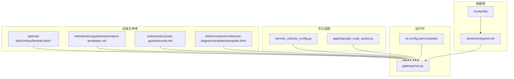
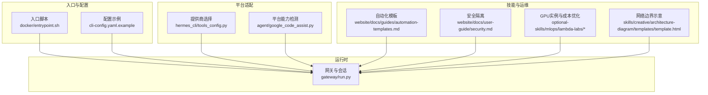
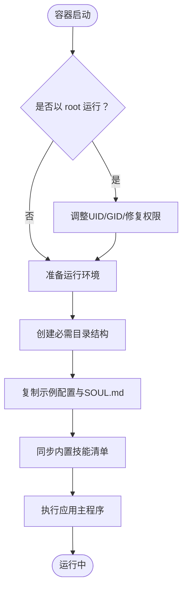
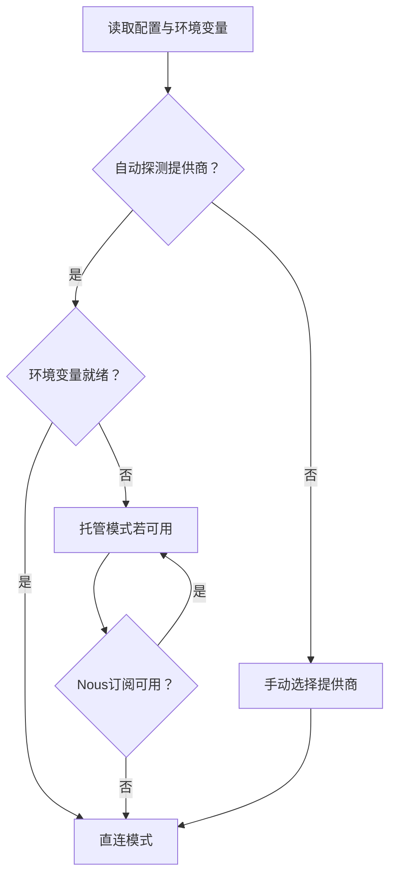
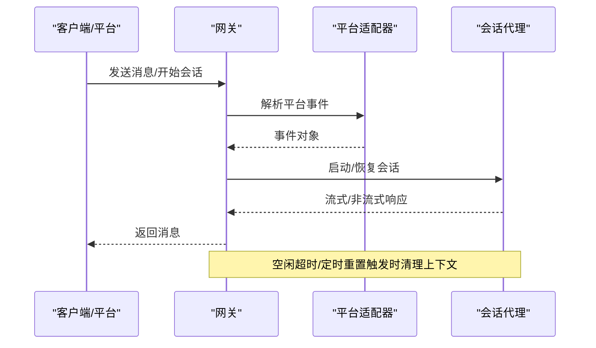
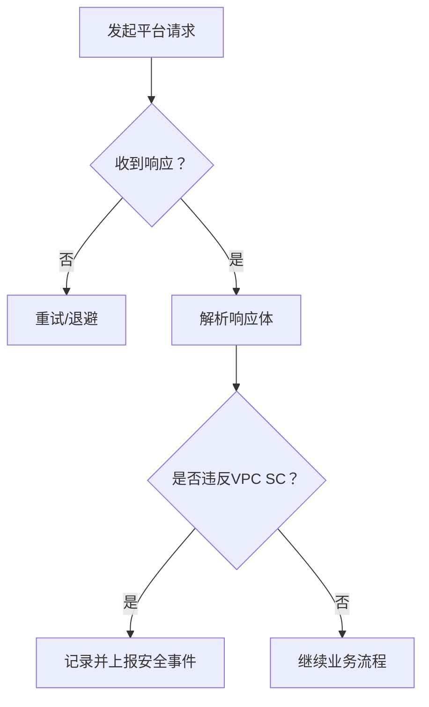
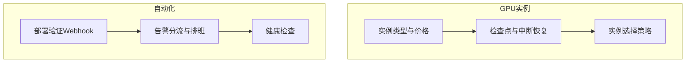
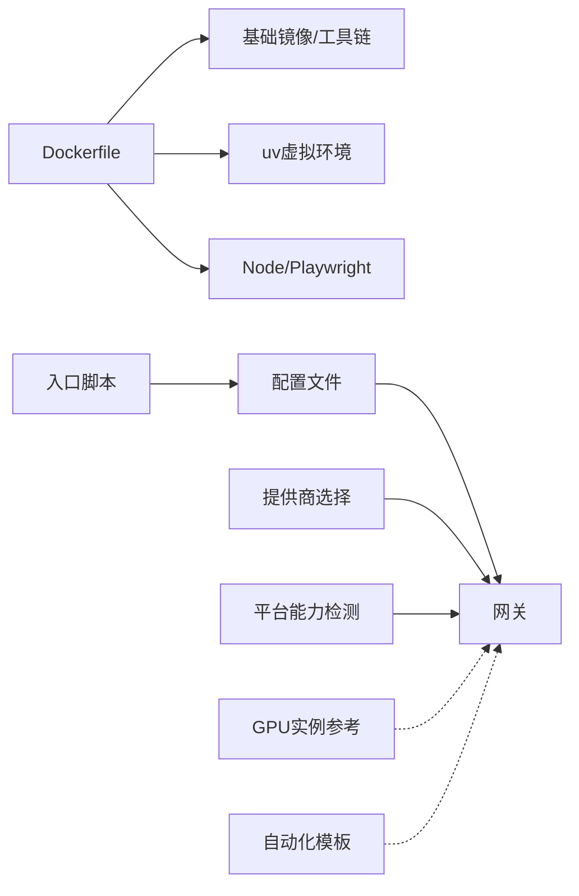

# 云平台部署

<cite>
**本文引用的文件**
- [README.md](file://README.md)
- [Dockerfile](file://Dockerfile)
- [docker/entrypoint.sh](file://docker/entrypoint.sh)
- [cli-config.yaml.example](file://cli-config.yaml.example)
- [gateway/run.py](file://gateway/run.py)
- [hermes_cli/tools_config.py](file://hermes_cli/tools_config.py)
- [agent/google_code_assist.py](file://agent/google_code_assist.py)
- [optional-skills/mlops/lambda-labs/SKILL.md](file://optional-skills/mlops/lambda-labs/SKILL.md)
- [optional-skills/mlops/lambda-labs/references/advanced-usage.md](file://optional-skills/mlops/lambda-labs/references/advanced-usage.md)
- [website/docs/guides/automation-templates.md](file://website/docs/guides/automation-templates.md)
- [website/docs/user-guide/security.md](file://website/docs/user-guide/security.md)
- [skills/creative/architecture-diagram/templates/template.html](file://skills/creative/architecture-diagram/templates/template.html)
</cite>

## 目录
1. [简介](#简介)
2. [项目结构](#项目结构)
3. [核心组件](#核心组件)
4. [架构总览](#架构总览)
5. [详细组件分析](#详细组件分析)
6. [依赖关系分析](#依赖关系分析)
7. [性能与成本优化](#性能与成本优化)
8. [故障排查指南](#故障排查指南)
9. [结论](#结论)
10. [附录](#附录)

## 简介
本指南面向在主流云平台（AWS、GCP、Azure）上部署 Hermes Agent 的工程团队，提供从基础设施选型、托管服务配置、高可用与负载均衡、自动化与CI/CD、成本优化、安全与网络隔离、监控与日志、灾备与多区域到数据同步的完整落地方法。文档以仓库中的配置示例、入口脚本与平台适配代码为依据，结合技能系统与网关运行时行为，给出可操作的部署蓝图。

## 项目结构
Hermes Agent 提供容器化运行方式与多种终端后端（本地、SSH、Docker、Modal、Daytona），其核心运行路径由容器镜像与入口脚本负责初始化配置与启动应用；网关模块负责消息平台接入与会话管理；配置文件提供模型、工具集、会话重置策略等运行参数；部分技能与辅助模块提供云厂商特定能力与运维建议。

图示来源
- [Dockerfile:1-47](file://Dockerfile#L1-L47)
- [docker/entrypoint.sh:1-72](file://docker/entrypoint.sh#L1-L72)
- [cli-config.yaml.example:1-890](file://cli-config.yaml.example#L1-L890)
- [gateway/run.py:9168-9256](file://gateway/run.py#L9168-L9256)
- [hermes_cli/tools_config.py:930-1188](file://hermes_cli/tools_config.py#L930-L1188)
- [agent/google_code_assist.py:148-260](file://agent/google_code_assist.py#L148-L260)
- [optional-skills/mlops/lambda-labs/SKILL.md:1-136](file://optional-skills/mlops/lambda-labs/SKILL.md#L1-L136)
- [website/docs/guides/automation-templates.md:187-225](file://website/docs/guides/automation-templates.md#L187-L225)
- [website/docs/user-guide/security.md:547-560](file://website/docs/user-guide/security.md#L547-L560)
- [skills/creative/architecture-diagram/templates/template.html:170-199](file://skills/creative/architecture-diagram/templates/template.html#L170-L199)

章节来源
- [README.md:1-179](file://README.md#L1-L179)
- [Dockerfile:1-47](file://Dockerfile#L1-L47)
- [docker/entrypoint.sh:1-72](file://docker/entrypoint.sh#L1-L72)
- [cli-config.yaml.example:1-890](file://cli-config.yaml.example#L1-L890)
- [gateway/run.py:9168-9256](file://gateway/run.py#L9168-L9256)

## 核心组件
- 容器与入口：通过容器镜像安装运行环境与依赖，并在首次启动时将示例配置复制到挂载卷中，随后以非 root 用户执行应用。
- 配置系统：提供模型提供商、终端后端、工具集、会话重置策略、流式传输、语音转写等运行参数，支持按平台定制。
- 网关与会话：负责消息平台接入、会话生命周期管理、超时与中断检测、重启与优雅停机。
- 平台适配：根据环境变量与凭证自动选择直连或托管模式，支持多提供商路由与凭据注入。
- 技能与参考：提供云厂商GPU实例使用建议、成本优化策略与自动化模板，以及安全隔离与网络边界示例。

章节来源
- [Dockerfile:1-47](file://Dockerfile#L1-L47)
- [docker/entrypoint.sh:1-72](file://docker/entrypoint.sh#L1-L72)
- [cli-config.yaml.example:1-890](file://cli-config.yaml.example#L1-L890)
- [gateway/run.py:9168-9256](file://gateway/run.py#L9168-L9256)
- [hermes_cli/tools_config.py:930-1188](file://hermes_cli/tools_config.py#L930-L1188)
- [agent/google_code_assist.py:148-260](file://agent/google_code_assist.py#L148-L260)
- [optional-skills/mlops/lambda-labs/SKILL.md:1-136](file://optional-skills/mlops/lambda-labs/SKILL.md#L1-L136)
- [website/docs/guides/automation-templates.md:187-225](file://website/docs/guides/automation-templates.md#L187-L225)
- [website/docs/user-guide/security.md:547-560](file://website/docs/user-guide/security.md#L547-L560)
- [skills/creative/architecture-diagram/templates/template.html:170-199](file://skills/creative/architecture-diagram/templates/template.html#L170-L199)

## 架构总览
下图展示在云平台部署时的典型分层：入口与配置层（容器与配置文件）、运行时层（网关与会话）、平台适配层（提供商与凭证）、技能与运维层（自动化模板、安全隔离、成本优化）。

图示来源
- [docker/entrypoint.sh:1-72](file://docker/entrypoint.sh#L1-L72)
- [cli-config.yaml.example:1-890](file://cli-config.yaml.example#L1-L890)
- [gateway/run.py:9168-9256](file://gateway/run.py#L9168-L9256)
- [hermes_cli/tools_config.py:930-1188](file://hermes_cli/tools_config.py#L930-L1188)
- [agent/google_code_assist.py:148-260](file://agent/google_code_assist.py#L148-L260)
- [website/docs/guides/automation-templates.md:187-225](file://website/docs/guides/automation-templates.md#L187-L225)
- [website/docs/user-guide/security.md:547-560](file://website/docs/user-guide/security.md#L547-L560)
- [optional-skills/mlops/lambda-labs/SKILL.md:1-136](file://optional-skills/mlops/lambda-labs/SKILL.md#L1-L136)
- [skills/creative/architecture-diagram/templates/template.html:170-199](file://skills/creative/architecture-diagram/templates/template.html#L170-L199)

## 详细组件分析

### 容器与入口脚本
- 镜像基础：使用多阶段构建，包含Python虚拟环境、Node/Playwright依赖与gosu权限降级工具。
- 入口脚本职责：在容器内以非 root 身份运行，确保挂载卷权限正确；首次启动时复制示例配置到用户目录；同步内置技能清单；最终调用应用主程序。
- 数据卷与环境：通过环境变量指定工作目录并挂载至容器，确保会话、日志、技能等持久化。

图示来源
- [Dockerfile:1-47](file://Dockerfile#L1-L47)
- [docker/entrypoint.sh:1-72](file://docker/entrypoint.sh#L1-L72)

章节来源
- [Dockerfile:1-47](file://Dockerfile#L1-L47)
- [docker/entrypoint.sh:1-72](file://docker/entrypoint.sh#L1-L72)

### 配置系统与提供商选择
- 模型与提供商：支持自动探测、OpenRouter、Nous Portal、Anthropic、Google AI Studio、z.ai、Kimi、MiniMax、Hugging Face、Xiaomi、Ollama Cloud、Vercel AI Gateway等；可通过环境变量覆盖默认值。
- 终端后端：支持本地、SSH、Docker、Singularity、Modal、Daytona，便于在不同云环境中隔离命令执行。
- 工具集与平台：可按平台定制工具集（如CLI、Telegram、Discord等），并支持复合工具集组合。
- 会话与流式：提供会话重置策略、流式传输开关与编辑间隔等参数，平衡用户体验与成本。

图示来源
- [cli-config.yaml.example:1-890](file://cli-config.yaml.example#L1-L890)
- [hermes_cli/tools_config.py:930-1188](file://hermes_cli/tools_config.py#L930-L1188)

章节来源
- [cli-config.yaml.example:1-890](file://cli-config.yaml.example#L1-L890)
- [hermes_cli/tools_config.py:930-1188](file://hermes_cli/tools_config.py#L930-L1188)

### 网关与会话管理
- 会话生命周期：支持按空闲时间与每日边界自动重置，避免无限增长导致的成本上升；支持重启前的优雅停机与中断检测。
- 中断与超时：在长时间无响应时触发警告与最终超时，同时具备备用中断检测机制，确保会话可控。
- 平台集成：通过统一的适配器接口对接Telegram、Discord、Slack、WhatsApp、Signal、QQ等平台。

图示来源
- [gateway/run.py:9168-9256](file://gateway/run.py#L9168-L9256)

章节来源
- [gateway/run.py:9168-9256](file://gateway/run.py#L9168-L9256)

### 平台能力与安全检测
- VPC Service Controls检测：对Google平台返回的错误体进行解析，识别安全策略违规，帮助定位网络隔离问题。
- 安全隔离建议：推荐将网关运行在独立机器或VM上，通过SSH后端执行命令，实现消息连接与命令执行的网络隔离。

图示来源
- [agent/google_code_assist.py:148-260](file://agent/google_code_assist.py#L148-L260)
- [website/docs/user-guide/security.md:547-560](file://website/docs/user-guide/security.md#L547-L560)

章节来源
- [agent/google_code_assist.py:148-260](file://agent/google_code_assist.py#L148-L260)
- [website/docs/user-guide/security.md:547-560](file://website/docs/user-guide/security.md#L547-L560)

### 技能与运维参考
- GPU实例与成本优化：提供Lambda Labs GPU云实例的快速入门、实例类型与价格对比、检查点与实例选择策略，便于训练与推理场景的成本控制。
- 自动化模板：提供CI/CD部署验证、告警分流与排班、健康检查等Webhook模板，便于与监控系统联动。

图示来源
- [optional-skills/mlops/lambda-labs/SKILL.md:1-136](file://optional-skills/mlops/lambda-labs/SKILL.md#L1-L136)
- [optional-skills/mlops/lambda-labs/references/advanced-usage.md:489-544](file://optional-skills/mlops/lambda-labs/references/advanced-usage.md#L489-L544)
- [website/docs/guides/automation-templates.md:187-225](file://website/docs/guides/automation-templates.md#L187-L225)

章节来源
- [optional-skills/mlops/lambda-labs/SKILL.md:1-136](file://optional-skills/mlops/lambda-labs/SKILL.md#L1-L136)
- [optional-skills/mlops/lambda-labs/references/advanced-usage.md:489-544](file://optional-skills/mlops/lambda-labs/references/advanced-usage.md#L489-L544)
- [website/docs/guides/automation-templates.md:187-225](file://website/docs/guides/automation-templates.md#L187-L225)

## 依赖关系分析
- 容器镜像依赖：Python、Node/Playwright、系统工具链；gosu用于权限降级；uv用于Python虚拟环境与依赖安装。
- 运行时依赖：配置文件驱动运行参数；网关模块依赖平台适配器；提供商选择依赖环境变量与凭证状态。
- 技能与参考：GPU实例与自动化模板作为外部能力补充，不改变核心运行时耦合度。

图示来源
- [Dockerfile:1-47](file://Dockerfile#L1-L47)
- [docker/entrypoint.sh:1-72](file://docker/entrypoint.sh#L1-L72)
- [cli-config.yaml.example:1-890](file://cli-config.yaml.example#L1-L890)
- [gateway/run.py:9168-9256](file://gateway/run.py#L9168-L9256)
- [hermes_cli/tools_config.py:930-1188](file://hermes_cli/tools_config.py#L930-L1188)
- [agent/google_code_assist.py:148-260](file://agent/google_code_assist.py#L148-L260)
- [optional-skills/mlops/lambda-labs/SKILL.md:1-136](file://optional-skills/mlops/lambda-labs/SKILL.md#L1-L136)
- [website/docs/guides/automation-templates.md:187-225](file://website/docs/guides/automation-templates.md#L187-L225)

章节来源
- [Dockerfile:1-47](file://Dockerfile#L1-L47)
- [docker/entrypoint.sh:1-72](file://docker/entrypoint.sh#L1-L72)
- [cli-config.yaml.example:1-890](file://cli-config.yaml.example#L1-L890)
- [gateway/run.py:9168-9256](file://gateway/run.py#L9168-L9256)
- [hermes_cli/tools_config.py:930-1188](file://hermes_cli/tools_config.py#L930-L1188)
- [agent/google_code_assist.py:148-260](file://agent/google_code_assist.py#L148-L260)
- [optional-skills/mlops/lambda-labs/SKILL.md:1-136](file://optional-skills/mlops/lambda-labs/SKILL.md#L1-L136)
- [website/docs/guides/automation-templates.md:187-225](file://website/docs/guides/automation-templates.md#L187-L225)

## 性能与成本优化
- 会话重置策略：通过空闲超时与每日边界重置，降低长对话带来的API成本与内存占用。
- 流式传输：在支持的平台上启用流式传输，改善交互体验，但需权衡实时性与带宽消耗。
- 终端后端选择：在云环境中优先使用SSH/Docker后端隔离命令执行，减少对网关主机的资源竞争。
- GPU实例与检查点：在Lambda Labs等GPU云上采用检查点与实例选择策略，缩短中断恢复时间并降低空闲成本。
- 成本优化：结合任务规模与模型参数量选择合适实例规格，定期清理未使用镜像与容器，利用云厂商的预留实例或批量折扣。

章节来源
- [cli-config.yaml.example:411-420](file://cli-config.yaml.example#L411-L420)
- [cli-config.yaml.example:428-434](file://cli-config.yaml.example#L428-L434)
- [optional-skills/mlops/lambda-labs/references/advanced-usage.md:489-544](file://optional-skills/mlops/lambda-labs/references/advanced-usage.md#L489-L544)

## 故障排查指南
- 网络隔离与安全：当平台返回安全策略违规时，检查VPC Service Controls配置与网络边界；必要时启用安全扫描工具进行预执行检测。
- 会话超时与中断：关注网关的空闲超时与警告机制，确认会话上下文是否被意外清理；在重启过程中启用优雅停机与中断检测。
- 配置与凭证：核对提供商选择逻辑与环境变量，确保直连或托管模式的凭证齐全且有效；在Nous订阅不可用时回退到直连模式。
- 日志与追踪：启用会话日志记录，定位异常回话与工具调用失败原因；结合自动化模板中的健康检查与告警分流进行快速排障。

章节来源
- [agent/google_code_assist.py:148-260](file://agent/google_code_assist.py#L148-L260)
- [website/docs/user-guide/security.md:547-560](file://website/docs/user-guide/security.md#L547-L560)
- [gateway/run.py:9168-9256](file://gateway/run.py#L9168-L9256)
- [hermes_cli/tools_config.py:930-1188](file://hermes_cli/tools_config.py#L930-L1188)
- [website/docs/guides/automation-templates.md:187-225](file://website/docs/guides/automation-templates.md#L187-L225)

## 结论
Hermes Agent 提供了容器化、可配置、可扩展的部署基线。结合平台适配与技能系统，可在AWS、GCP、Azure等主流云平台上实现高可用、低成本、可审计的Agent服务。通过合理的会话重置策略、流式传输、GPU实例与检查点、自动化模板与安全隔离，能够满足生产环境的稳定性与可维护性要求。

## 附录
- 网络边界示意：可参考架构图中的安全组与CDN/负载均衡边界，结合云厂商安全组规则与WAF策略进行细化。
- 多区域与数据同步：建议在多区域部署时，将共享数据（如技能、配置）置于低延迟的跨区域存储，并通过只读副本与增量同步策略保障一致性。

章节来源
- [skills/creative/architecture-diagram/templates/template.html:170-199](file://skills/creative/architecture-diagram/templates/template.html#L170-L199)