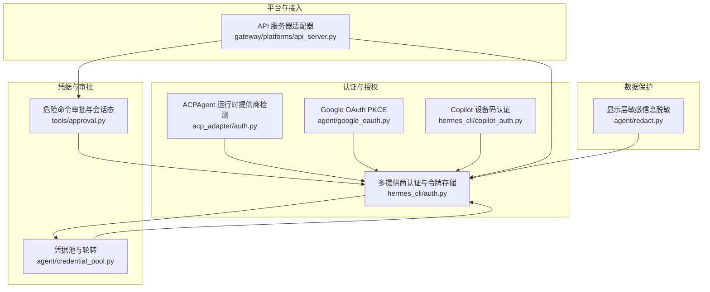
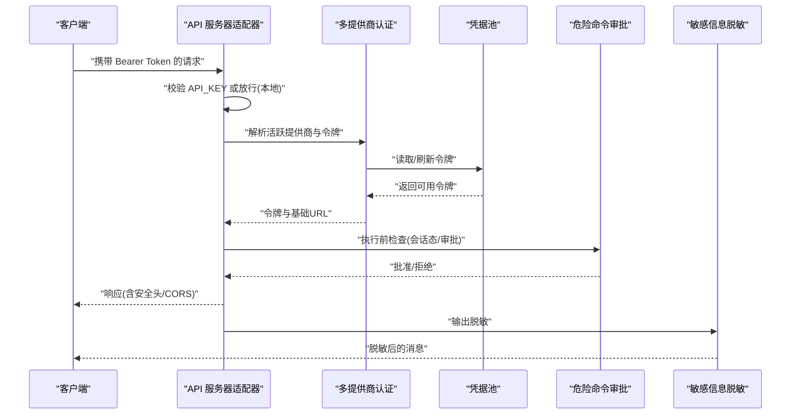
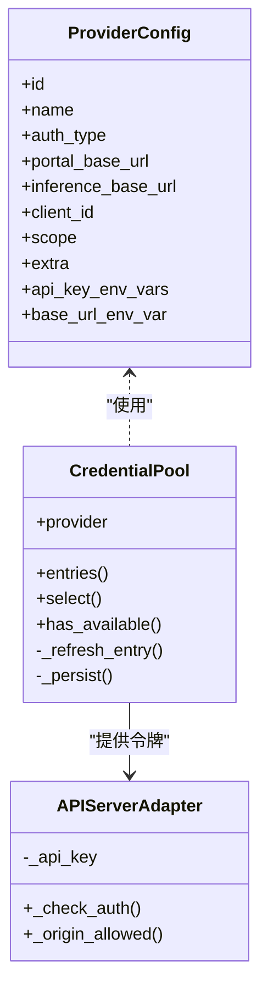
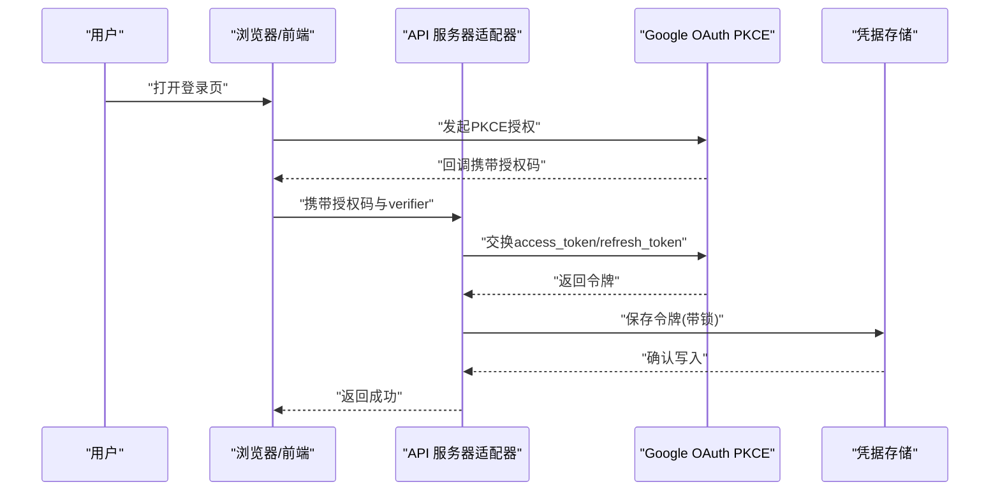
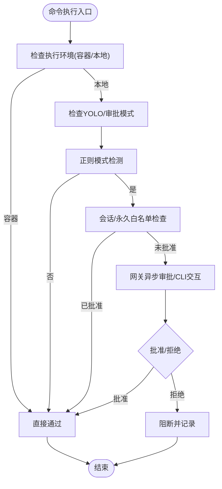
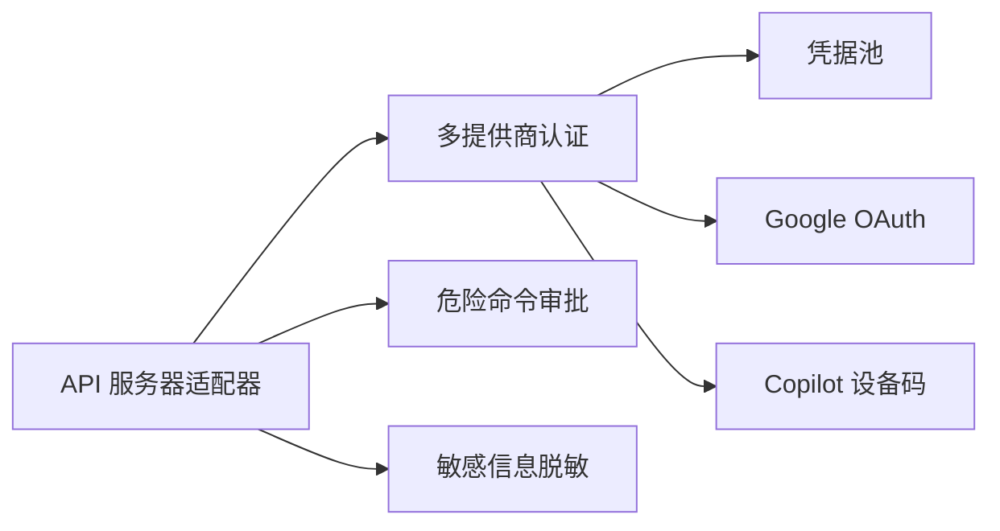

# 安全配置

<cite>
**本文引用的文件**
- [SECURITY.md](file://SECURITY.md)
- [auth.py](file://acp_adapter/auth.py)
- [google_oauth.py](file://agent/google_oauth.py)
- [auth.py](file://hermes_cli/auth.py)
- [api_server.py](file://gateway/platforms/api_server.py)
- [credential_pool.py](file://agent/credential_pool.py)
- [approval.py](file://tools/approval.py)
- [redact.py](file://agent/redact.py)
- [copilot_auth.py](file://hermes_cli/copilot_auth.py)
</cite>

## 目录
1. [简介](#简介)
2. [项目结构](#项目结构)
3. [核心组件](#核心组件)
4. [架构总览](#架构总览)
5. [详细组件分析](#详细组件分析)
6. [依赖分析](#依赖分析)
7. [性能考量](#性能考量)
8. [故障排查指南](#故障排查指南)
9. [结论](#结论)
10. [附录](#附录)

## 简介
本文件面向Hermes Agent的安全配置与部署，系统化阐述身份认证与授权、API密钥与OAuth流程、数据与传输安全、访问控制与权限策略、网络安全与TLS、敏感数据保护与PII处理、审计与合规、安全扫描与漏洞评估、安全事件响应与应急处置，以及第三方集成的安全与风险评估要点。内容基于仓库中现有实现进行归纳总结，并提供可操作的配置建议与最佳实践。

## 项目结构
围绕安全主题的关键模块分布如下：
- 身份认证与授权：多提供商OAuth与API密钥解析、令牌刷新与持久化、Copilot专用认证
- 认证适配器：ACPAgent运行时提供商检测与可用性判定
- 平台接入：API服务器适配器的鉴权、CORS与安全头、请求体限制
- 凭据池：多凭据轮转、过期冷却、刷新与持久化
- 危险命令审批：模式匹配、会话态、网关异步审批、永久白名单
- 敏感信息脱敏：显示层输出脱敏、日志格式化器
- 第三方集成：Google OAuth PKCE、Copilot设备码流

图表来源
- [auth.py:1-25](file://acp_adapter/auth.py#L1-L25)
- [auth.py:1-304](file://hermes_cli/auth.py#L1-L304)
- [copilot_auth.py:1-300](file://hermes_cli/copilot_auth.py#L1-L300)
- [google_oauth.py:1-1049](file://agent/google_oauth.py#L1-L1049)
- [api_server.py:1-2437](file://gateway/platforms/api_server.py#L1-L2437)
- [credential_pool.py:1-1419](file://agent/credential_pool.py#L1-L1419)
- [approval.py:1-958](file://tools/approval.py#L1-L958)
- [redact.py:1-199](file://agent/redact.py#L1-L199)

章节来源
- [SECURITY.md:1-85](file://SECURITY.md#L1-L85)

## 核心组件
- 多提供商认证与令牌存储：统一注册表、令牌刷新与持久化、跨进程锁、端点探测与缓存
- 认证适配器：运行时提供商检测、可用性判定
- API服务器适配器：Bearer鉴权、CORS、安全头、请求体大小限制、会话续传
- 凭据池：多凭据轮转、过期冷却、刷新与持久化、自定义提供商池键
- 危险命令审批：正则模式检测、会话态、网关异步审批、永久白名单
- 敏感信息脱敏：前缀匹配、环境变量赋值、JSON字段、Authorization头、私钥块、数据库连接串、JWT、Discord提及、电话号码等
- 第三方集成：Google OAuth PKCE、Copilot设备码流

章节来源
- [auth.py:107-304](file://hermes_cli/auth.py#L107-L304)
- [auth.py:8-24](file://acp_adapter/auth.py#L8-L24)
- [api_server.py:468-489](file://gateway/platforms/api_server.py#L468-L489)
- [credential_pool.py:365-748](file://agent/credential_pool.py#L365-L748)
- [approval.py:76-139](file://tools/approval.py#L76-L139)
- [redact.py:20-114](file://agent/redact.py#L20-L114)
- [google_oauth.py:115-134](file://agent/google_oauth.py#L115-L134)
- [copilot_auth.py:32-44](file://hermes_cli/copilot_auth.py#L32-L44)

## 架构总览
下图展示从客户端到平台适配器、再到推理后端的认证与授权路径，以及关键安全边界（审批、脱敏、令牌刷新与持久化）：

图表来源
- [api_server.py:468-489](file://gateway/platforms/api_server.py#L468-L489)
- [auth.py:107-304](file://hermes_cli/auth.py#L107-L304)
- [credential_pool.py:365-748](file://agent/credential_pool.py#L365-L748)
- [approval.py:587-661](file://tools/approval.py#L587-L661)
- [redact.py:124-187](file://agent/redact.py#L124-L187)

## 详细组件分析

### 身份认证与授权机制
- 多提供商注册与解析
  - 提供商注册表包含OAuth设备码、外部OAuth、API Key等多种类型，支持环境变量覆盖与端点探测
  - 支持特定提供商（如Nous、OpenAI Codex）的令牌刷新与持久化
- 认证状态存储
  - 使用原子写入与跨进程锁保护的auth.json，确保并发安全
  - 提供者状态按提供商维度持久化，支持端点探测结果缓存
- 运行时提供商检测
  - ACP适配器可检测当前运行时提供商与API Key可用性，用于条件启用或降级

图表来源
- [auth.py:90-304](file://hermes_cli/auth.py#L90-L304)
- [credential_pool.py:365-748](file://agent/credential_pool.py#L365-L748)
- [api_server.py:382-489](file://gateway/platforms/api_server.py#L382-L489)

章节来源
- [auth.py:107-304](file://hermes_cli/auth.py#L107-L304)
- [auth.py:8-24](file://acp_adapter/auth.py#L8-L24)
- [credential_pool.py:365-748](file://agent/credential_pool.py#L365-L748)
- [api_server.py:468-489](file://gateway/platforms/api_server.py#L468-L489)

### API密钥管理与OAuth流程
- API密钥管理
  - API服务器适配器支持Bearer鉴权；未配置时仅允许本地使用
  - 安全头与CORS策略仅在明确允许的浏览器源时生效
- OAuth流程
  - Google OAuth PKCE：Authorization Code + PKCE（S256），支持刷新令牌轮换、跨进程锁保护凭据文件
  - Copilot设备码流：支持多种令牌类型校验与gh CLI回退
  - 多提供商OAuth：统一注册表与令牌刷新，支持端点探测与缓存

图表来源
- [google_oauth.py:565-612](file://agent/google_oauth.py#L565-L612)
- [google_oauth.py:468-522](file://agent/google_oauth.py#L468-L522)
- [api_server.py:468-489](file://gateway/platforms/api_server.py#L468-L489)

章节来源
- [google_oauth.py:115-134](file://agent/google_oauth.py#L115-L134)
- [google_oauth.py:468-522](file://agent/google_oauth.py#L468-L522)
- [google_oauth.py:565-612](file://agent/google_oauth.py#L565-L612)
- [copilot_auth.py:155-276](file://hermes_cli/copilot_auth.py#L155-L276)

### 数据加密与传输安全配置
- 传输安全
  - API服务器中间件添加安全头（如X-Content-Type-Options、Referrer-Policy）
  - CORS中间件仅对允许的Origin返回完整头部，OPTIONS预检受控
  - 请求体大小限制，防止超大载荷
- 存储安全
  - 凭据文件与auth.json采用原子写入、临时文件替换、权限修正，避免竞态与泄露
  - Google OAuth凭据文件使用0o600权限与跨进程锁

章节来源
- [api_server.py:295-311](file://gateway/platforms/api_server.py#L295-L311)
- [api_server.py:242-265](file://gateway/platforms/api_server.py#L242-L265)
- [api_server.py:280-294](file://gateway/platforms/api_server.py#L280-L294)
- [auth.py:678-711](file://hermes_cli/auth.py#L678-L711)
- [google_oauth.py:488-510](file://agent/google_oauth.py#L488-L510)

### 访问控制列表（ACL）与权限管理策略
- 危险命令审批
  - 基于正则的模式匹配检测潜在破坏性命令
  - 会话级与永久级白名单，支持智能审批（辅助LLM风险评估）
  - 网关异步审批队列，支持/FIFO与批量批准
- 模式与白名单
  - 包含文件系统、网络服务、脚本执行、Git破坏性操作等模式
  - 永久白名单持久化至配置，兼容历史键别名

图表来源
- [approval.py:587-661](file://tools/approval.py#L587-L661)
- [approval.py:76-139](file://tools/approval.py#L76-L139)
- [approval.py:300-370](file://tools/approval.py#L300-L370)

章节来源
- [approval.py:76-139](file://tools/approval.py#L76-L139)
- [approval.py:300-370](file://tools/approval.py#L300-L370)
- [approval.py:587-661](file://tools/approval.py#L587-L661)

### 网络安全配置指南（防火墙与TLS）
- API服务器
  - 默认绑定127.0.0.1，端口可配置；未设置API_KEY时仅允许本地访问
  - CORS仅对显式允许的Origin开放，OPTIONS预检严格校验
  - 安全头强制启用，减少常见Web攻击面
- TLS与证书
  - 代码库未发现内置TLS终止逻辑；建议通过反向代理（如Nginx/Traefik）启用HTTPS与证书管理
  - 若需内联TLS，请结合平台适配器扩展与证书路径配置，确保文件权限与链路完整性

章节来源
- [api_server.py:52-60](file://gateway/platforms/api_server.py#L52-L60)
- [api_server.py:382-463](file://gateway/platforms/api_server.py#L382-L463)
- [api_server.py:295-311](file://gateway/platforms/api_server.py#L295-L311)

### 敏感数据保护与PII处理
- 显示层脱敏
  - 前缀匹配、环境变量赋值、JSON字段、Authorization头、私钥块、数据库连接串、JWT、Discord提及、电话号码等
  - 日志格式化器自动脱敏，避免凭证泄露到日志
- 配置与凭据
  - API密钥与令牌仅存放于~/.hermes/.env，不写入config.yaml
  - 凭据池与auth.json采用原子写入与权限修正，降低泄露风险

章节来源
- [redact.py:20-114](file://agent/redact.py#L20-L114)
- [redact.py:124-187](file://agent/redact.py#L124-L187)
- [auth.py:678-711](file://hermes_cli/auth.py#L678-L711)
- [SECURITY.md:74-77](file://SECURITY.md#L74-L77)

### 审计日志与合规要求
- 审计与披露
  - 仓库提供安全政策与披露流程，明确漏洞上报渠道、披露窗口与沟通方式
- 平台与API审计
  - API服务器中间件统一注入安全头，便于下游监控与合规审计
  - 凭据存储与令牌刷新具备版本化与更新时间戳，便于追踪

章节来源
- [SECURITY.md:80-85](file://SECURITY.md#L80-L85)
- [api_server.py:295-311](file://gateway/platforms/api_server.py#L295-L311)
- [auth.py:678-711](file://hermes_cli/auth.py#L678-L711)

### 安全扫描与漏洞评估流程
- 内置扫描与审批联动
  - 结合tirith安全扫描结果与危险命令检测，统一进入审批流程
  - 支持智能审批（辅助LLM）与永久白名单，减少误报与漏报
- 供应链与CI/CD
  - CI工作流固定提交SHA，阻止可疑模式与恶意文件

章节来源
- [approval.py:694-800](file://tools/approval.py#L694-L800)
- [SECURITY.md:69-73](file://SECURITY.md#L69-L73)

### 安全事件响应与应急处理预案
- 危险命令阻断
  - 拒绝执行并返回明确阻断信息，避免重复尝试
- 凭据失效与重登
  - Google OAuth刷新失败时清除凭据并触发重新登录流程
- 审批模式与Break-Glass
  - 支持禁用审批模式（仅在紧急情况下使用），并配合日志与告警

章节来源
- [approval.py:642-661](file://tools/approval.py#L642-L661)
- [google_oauth.py:674-686](file://agent/google_oauth.py#L674-L686)
- [SECURITY.md:27-31](file://SECURITY.md#L27-L31)

### 第三方集成的安全考虑与风险评估
- Google OAuth PKCE
  - 使用公有客户端ID与PKCE，避免客户端密钥泄露；支持从本地gemini-cli二进制回退提取凭据
- Copilot认证
  - 严格区分令牌类型，拒绝经典PAT；支持gh CLI回退与设备码流
- MCP与技能
  - 技能与MCP服务器采用受限环境变量传递，减少凭据暴露；代码执行工具剥离环境变量中的密钥

章节来源
- [google_oauth.py:82-108](file://agent/google_oauth.py#L82-L108)
- [copilot_auth.py:46-96](file://hermes_cli/copilot_auth.py#L46-L96)
- [SECURITY.md:36-46](file://SECURITY.md#L36-L46)

## 依赖分析
- 组件耦合
  - API服务器适配器依赖认证模块解析令牌与基础URL
  - 凭据池为多提供商提供统一的令牌轮转与持久化
  - 危险命令审批与会话态贯穿平台与工具层
- 外部依赖
  - aiohttp用于API服务器；httpx用于提供商探测
  - 平台适配器依赖会话数据库以支持会话续传

图表来源
- [api_server.py:512-563](file://gateway/platforms/api_server.py#L512-L563)
- [auth.py:107-304](file://hermes_cli/auth.py#L107-L304)
- [credential_pool.py:365-748](file://agent/credential_pool.py#L365-L748)
- [approval.py:587-661](file://tools/approval.py#L587-L661)
- [redact.py:124-187](file://agent/redact.py#L124-L187)
- [google_oauth.py:565-612](file://agent/google_oauth.py#L565-L612)
- [copilot_auth.py:155-276](file://hermes_cli/copilot_auth.py#L155-L276)

章节来源
- [api_server.py:512-563](file://gateway/platforms/api_server.py#L512-L563)
- [auth.py:107-304](file://hermes_cli/auth.py#L107-L304)
- [credential_pool.py:365-748](file://agent/credential_pool.py#L365-L748)
- [approval.py:587-661](file://tools/approval.py#L587-L661)
- [redact.py:124-187](file://agent/redact.py#L124-L187)
- [google_oauth.py:565-612](file://agent/google_oauth.py#L565-L612)
- [copilot_auth.py:155-276](file://hermes_cli/copilot_auth.py#L155-L276)

## 性能考量
- 凭据池选择策略与并发限制
  - 支持填充优先、轮询、随机、最少使用等策略，结合并发上限避免令牌争用
- 刷新去重与缓存
  - 对同一刷新令牌的并发刷新进行去重，减少重复网络开销
- 请求体限制与中间件开销
  - 合理设置请求体上限与中间件数量，平衡安全与性能

章节来源
- [credential_pool.py:365-374](file://agent/credential_pool.py#L365-L374)
- [credential_pool.py:750-768](file://agent/credential_pool.py#L750-L768)
- [api_server.py:280-294](file://gateway/platforms/api_server.py#L280-L294)

## 故障排查指南
- API鉴权失败
  - 确认API_SERVER_KEY是否正确配置；检查Authorization头格式
- CORS被拒绝
  - 校验API_SERVER_CORS_ORIGINS配置；确认浏览器Origin是否在允许列表
- 凭据写入失败
  - 检查~/.hermes目录权限；确认auth.json锁文件可创建
- Google OAuth刷新错误
  - 刷新返回invalid_grant时，清理凭据文件并重新登录
- 审批阻断
  - 查看审批模式与会话态；必要时使用永久白名单或调整审批策略

章节来源
- [api_server.py:468-489](file://gateway/platforms/api_server.py#L468-L489)
- [api_server.py:434-463](file://gateway/platforms/api_server.py#L434-L463)
- [auth.py:678-711](file://hermes_cli/auth.py#L678-L711)
- [google_oauth.py:674-686](file://agent/google_oauth.py#L674-L686)
- [approval.py:610-661](file://tools/approval.py#L610-L661)

## 结论
Hermes Agent在安全方面提供了完善的认证与授权、令牌管理、危险命令审批、敏感信息脱敏与平台接入安全中间件。建议在生产环境中：
- 通过反向代理启用TLS与严格的防火墙策略
- 将API密钥与令牌置于独立的凭据文件，避免硬编码
- 启用审批模式与智能审批，结合永久白名单降低误报
- 定期进行安全扫描与漏洞评估，完善事件响应流程

## 附录
- 参考安全政策与披露流程：[SECURITY.md:1-85](file://SECURITY.md#L1-L85)
- 认证与令牌存储：[hermes_cli/auth.py:589-711](file://hermes_cli/auth.py#L589-L711)
- Google OAuth PKCE：[agent/google_oauth.py:468-522](file://agent/google_oauth.py#L468-L522)
- API服务器适配器：[gateway/platforms/api_server.py:468-489](file://gateway/platforms/api_server.py#L468-L489)
- 凭据池：[agent/credential_pool.py:365-748](file://agent/credential_pool.py#L365-L748)
- 危险命令审批：[tools/approval.py:587-661](file://tools/approval.py#L587-L661)
- 敏感信息脱敏：[agent/redact.py:124-187](file://agent/redact.py#L124-L187)
- Copilot认证：[hermes_cli/copilot_auth.py:155-276](file://hermes_cli/copilot_auth.py#L155-L276)