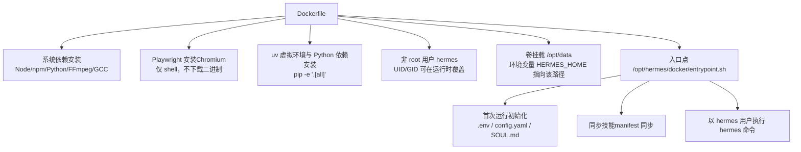
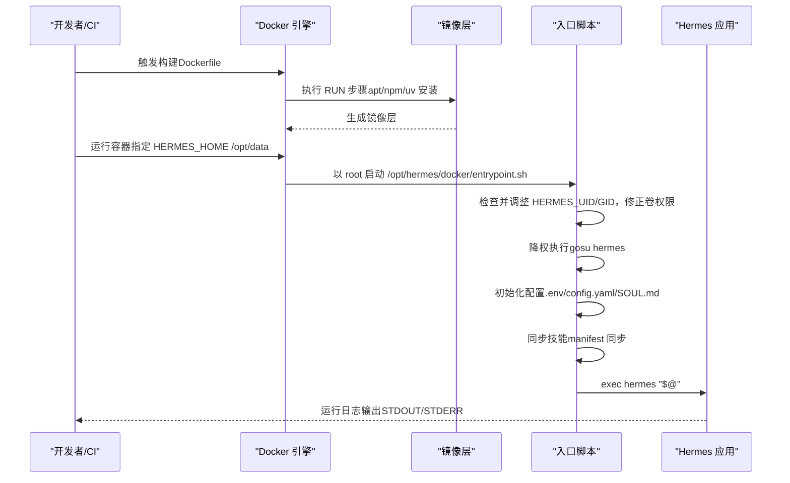
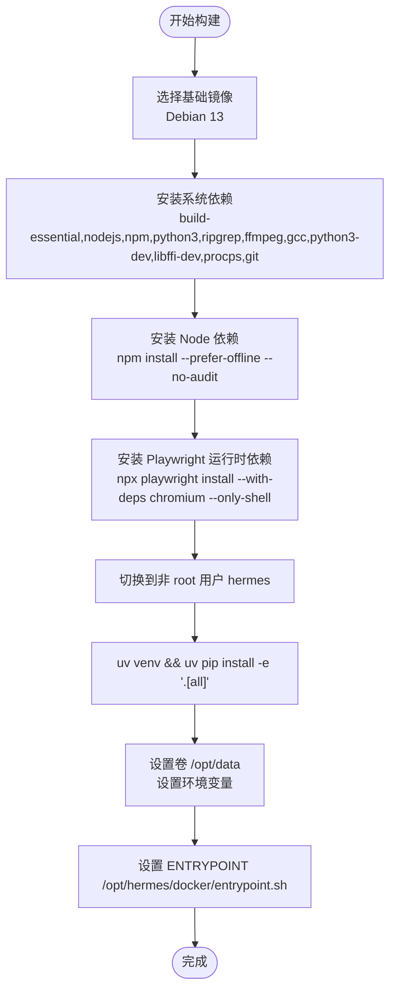
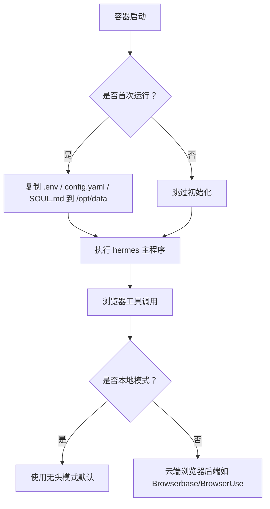
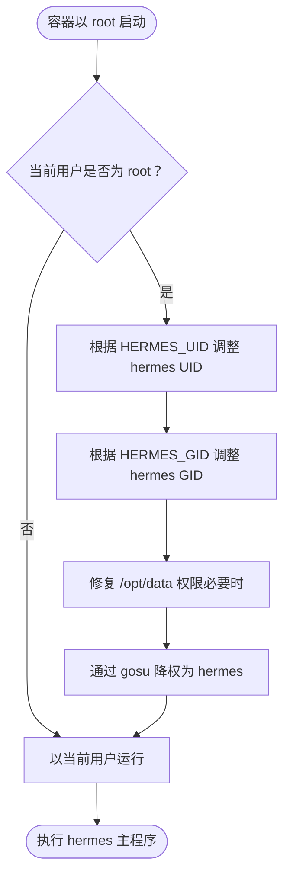
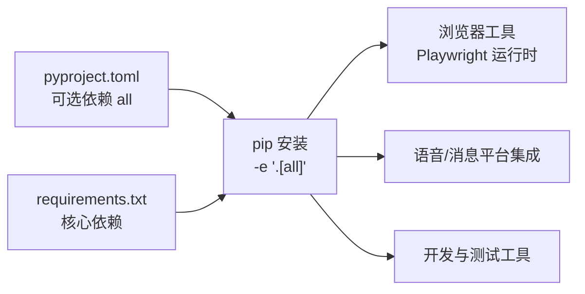

# 容器化部署

<cite>
**本文引用的文件**
- [Dockerfile](file://Dockerfile)
- [.dockerignore](file://.dockerignore)
- [docker/entrypoint.sh](file://docker/entrypoint.sh)
- [docker/SOUL.md](file://docker/SOUL.md)
- [cli-config.yaml.example](file://cli-config.yaml.example)
- [requirements.txt](file://requirements.txt)
- [pyproject.toml](file://pyproject.toml)
- [scripts/install.sh](file://scripts/install.sh)
- [tools/browser_tool.py](file://tools/browser_tool.py)
</cite>

## 目录
1. [简介](#简介)
2. [项目结构](#项目结构)
3. [核心组件](#核心组件)
4. [架构总览](#架构总览)
5. [详细组件分析](#详细组件分析)
6. [依赖关系分析](#依赖关系分析)
7. [性能与资源优化](#性能与资源优化)
8. [故障排查指南](#故障排查指南)
9. [结论](#结论)
10. [附录](#附录)

## 简介
本文件面向在容器环境中部署 Hermes Agent 的工程实践，系统性阐述镜像构建（含多阶段策略）、容器运行时配置（环境变量、卷挂载、网络）、Playwright 浏览器安装与配置（无头/显示模式）、非 root 用户安全运行与权限管理、容器编排示例（Docker Compose 与 Kubernetes 部署清单）、监控与日志管理、数据持久化与备份策略，以及性能优化与资源限制建议。内容基于仓库中实际的 Dockerfile、入口脚本、配置样例与浏览器工具实现进行归纳总结。

## 项目结构
与容器化部署直接相关的目录与文件如下：
- 构建与运行时入口
  - Dockerfile：定义镜像构建流程与运行时行为
  - docker/entrypoint.sh：容器启动引导脚本，负责初始化配置、权限降级与执行主程序
  - docker/SOUL.md：可选的人格文件模板
- 配置与依赖
  - cli-config.yaml.example：CLI 运行时配置示例（模型、工具集、会话、日志等）
  - requirements.txt：依赖清单（供参考）
  - pyproject.toml：项目元数据与可选依赖集合
- 浏览器与系统依赖
  - scripts/install.sh：本地安装脚本中的 Playwright 安装逻辑
  - tools/browser_tool.py：浏览器工具的后端选择与本地/云端模式判断

图表来源
- [Dockerfile:1-47](file://Dockerfile#L1-L47)
- [docker/entrypoint.sh:1-72](file://docker/entrypoint.sh#L1-L72)

章节来源
- [Dockerfile:1-47](file://Dockerfile#L1-L47)
- [.dockerignore:1-17](file://.dockerignore#L1-L17)
- [docker/entrypoint.sh:1-72](file://docker/entrypoint.sh#L1-L72)

## 核心组件
- 多阶段构建与基础镜像
  - 使用官方 uv 基础镜像与 tianon/gosu 镜像作为中间层来源，最终在 Debian 13 上构建运行时镜像，确保 Python 包管理与权限降级工具可用。
- 系统依赖与运行时准备
  - 安装构建工具、Node/npm、Python、ripgrep、FFmpeg、GCC、Python 开发头文件、libffi、procps、git；随后安装 Node 依赖与 Playwright Chromium（仅安装运行时依赖，不下载浏览器二进制）。
- Python 环境与应用安装
  - 切换到非 root 用户，使用 uv 创建虚拟环境并安装项目可选依赖集合（all），满足浏览器、语音、消息平台等能力。
- 运行时安全与权限
  - 默认以非 root 用户 hermes 运行；支持通过 HERMES_UID/HERMES_GID 在容器启动时动态调整用户/组 ID，保证与宿主机挂载目录权限一致。
- 数据持久化与配置
  - 卷挂载 /opt/data，环境变量 HERMES_HOME 指向该目录；首次运行自动复制 .env、config.yaml、SOUL.md 至挂载目录，便于持久化与自定义。
- 入口脚本职责
  - 若以 root 启动，则根据 HERMES_UID/HERMES_GID 调整 hermes 用户属性与家目录权限，必要时通过 gosu 降权后重执行；随后创建必要的子目录、复制模板文件、同步技能并启动 hermes 主程序。

章节来源
- [Dockerfile:1-47](file://Dockerfile#L1-L47)
- [docker/entrypoint.sh:1-72](file://docker/entrypoint.sh#L1-L72)

## 架构总览
下图展示从镜像构建到容器运行的关键步骤与交互：

图表来源
- [Dockerfile:1-47](file://Dockerfile#L1-L47)
- [docker/entrypoint.sh:1-72](file://docker/entrypoint.sh#L1-L72)

## 详细组件分析

### Dockerfile 构建流程与多阶段策略
- 分层设计
  - 第一阶段：使用 uv 与 gosu 镜像提取工具，避免在最终镜像中携带额外层。
  - 第二阶段：在 Debian 13 上安装系统依赖、Node/npm、Playwright 运行时依赖，再切换到非 root 用户安装 Python 依赖。
- 关键环境变量
  - PYTHONUNBUFFERED=1：禁用 Python 输出缓冲，确保日志实时打印。
  - PLAYWRIGHT_BROWSERS_PATH=/opt/hermes/.playwright：将 Playwright 浏览器缓存置于镜像内，避免被 /opt/data 卷覆盖。
- 卷与入口点
  - VOLUME ["/opt/data"]：声明持久化卷。
  - ENTRYPOINT ["/opt/hermes/docker/entrypoint.sh"]：统一启动引导。
- 多平台兼容
  - 通过 apt 安装系统依赖，适配 Debian/Ubuntu 生态；Playwright 安装采用“仅安装运行时依赖”的方式，减少体积与构建时间。

图表来源
- [Dockerfile:1-47](file://Dockerfile#L1-L47)

章节来源
- [Dockerfile:1-47](file://Dockerfile#L1-L47)

### 容器配置选项（环境变量、卷挂载、网络）
- 环境变量
  - HERMES_HOME：应用主目录，默认 /opt/data；用于存放 .env、config.yaml、SOUL.md、日志、技能、工作区等。
  - HERMES_UID / HERMES_GID：在容器启动时动态调整 hermes 用户的 UID/GID，确保与宿主机挂载目录所有者一致。
  - PYTHONUNBUFFERED=1：强制 Python 输出无缓冲，便于日志实时查看。
  - PLAYWRIGHT_BROWSERS_PATH：Playwright 浏览器缓存目录，位于镜像内，避免被卷覆盖。
- 卷挂载
  - /opt/data：持久化存储，包含配置、日志、技能、工作区、钩子、记忆体等。
- 网络
  - 默认桥接网络；若需要访问外部服务（如模型 API、消息平台、Web 工具），需按需开放出站连接或使用代理。

章节来源
- [Dockerfile:6-10](file://Dockerfile#L6-L10)
- [Dockerfile:44-46](file://Dockerfile#L44-L46)
- [docker/entrypoint.sh:5-6](file://docker/entrypoint.sh#L5-L6)

### Playwright 浏览器安装与配置
- 安装策略
  - 构建阶段仅安装 Playwright 运行时依赖（不下载浏览器二进制），并将缓存目录置于镜像内，确保容器运行时可复用。
- 运行时行为
  - 入口脚本在首次运行时复制模板文件至挂载卷，确保配置与数据持久化；浏览器工具在本地模式下默认使用无头模式运行（由工具实现决定）。
- 平台差异
  - 本地安装脚本展示了不同发行版的系统依赖安装方式，容器内已通过 apt 安装必要依赖，无需再次手动安装。

图表来源
- [docker/entrypoint.sh:50-69](file://docker/entrypoint.sh#L50-L69)
- [Dockerfile:28-32](file://Dockerfile#L28-L32)
- [tools/browser_tool.py:354-371](file://tools/browser_tool.py#L354-L371)

章节来源
- [Dockerfile:8-10](file://Dockerfile#L8-L10)
- [Dockerfile:28-32](file://Dockerfile#L28-L32)
- [scripts/install.sh:1107-1164](file://scripts/install.sh#L1107-L1164)
- [tools/browser_tool.py:354-371](file://tools/browser_tool.py#L354-L371)

### 非 root 用户运行与权限管理
- 用户与权限
  - 构建阶段创建非 root 用户 hermes（UID 默认 10000），容器启动时入口脚本可按需调整 hermes 的 UID/GID，使挂载卷权限与宿主机一致。
- 权限降级
  - 入口脚本检测是否以 root 启动，若是则通过 gosu 将进程切换到 hermes 用户继续执行，确保最小权限原则。
- 卷权限修复
  - 若挂载卷归属与当前 hermes 用户不一致，入口脚本尝试修复权限；在 rootless 容器场景下可能因权限映射失败而跳过，脚本会发出警告并继续。

图表来源
- [docker/entrypoint.sh:12-37](file://docker/entrypoint.sh#L12-L37)

章节来源
- [docker/entrypoint.sh:8-37](file://docker/entrypoint.sh#L8-L37)

### 容器编排示例（Docker Compose 与 Kubernetes）
以下为通用编排思路与关键配置项，便于在 Docker Compose 或 Kubernetes 中落地：
- Docker Compose 关键点
  - 服务定义：镜像来源（本地构建或远程仓库）、端口映射（如需要）、环境变量（HERMES_HOME、HERMES_UID、HERMES_GID、API 密钥等）、卷挂载（/opt/data）、重启策略、健康检查。
  - 示例要点：depends_on 与健康检查可用于数据库或上游服务的依赖顺序；资源限制（memory、cpus）可按需添加。
- Kubernetes 关键点
  - Deployment/StatefulSet：选择合适的控制器；Pod 安全策略（runAsUser、fsGroup、allowPrivilegeEscalation）；ConfigMap/Secret 管理配置与密钥；PersistentVolumeClaim 绑定 /opt/data。
  - 资源限制与亲和性：通过 LimitRange/LimitRange 与节点选择器控制资源与位置。
说明：本节为概念性编排指导，未直接对应具体源码文件，故不附加“章节来源”。

### 容器监控与日志管理
- 日志输出
  - 由于设置了 PYTHONUNBUFFERED=1，Python 应用的标准输出/错误流为实时刷新，便于容器日志收集。
- 日志位置
  - 应用日志写入 HERMES_HOME/logs 下的会话轨迹文件；容器标准输出/错误亦可由容器运行时收集。
- 监控建议
  - 结合容器运行时的日志驱动与外部日志系统（如 ELK、Loki）采集；结合资源指标（CPU/内存/卷使用）进行告警。

章节来源
- [Dockerfile:6-6](file://Dockerfile#L6-L6)
- [cli-config.yaml.example:716-729](file://cli-config.yaml.example#L716-L729)

### 数据持久化策略与备份方案
- 持久化目录
  - /opt/data 下包含：.env、config.yaml、SOUL.md、logs、sessions、hooks、memories、skills、skins、plans、workspace、home 等。
- 首次运行初始化
  - 入口脚本在 /opt/data 不存在对应文件时，从镜像模板复制；后续编辑将保存在挂载卷中。
- 备份建议
  - 对 /opt/data 进行定期快照或归档；对 .env 与 config.yaml 建议纳入版本控制或安全密文管理；对 logs 与 sessions 可按保留策略清理。

章节来源
- [docker/entrypoint.sh:49-69](file://docker/entrypoint.sh#L49-L69)

### 性能优化与资源限制
- 构建期优化
  - 多阶段使用中间层镜像（uv、gosu）减少最终镜像体积；apt 清理缓存；npm 缓存清理。
- 运行期优化
  - 通过环境变量与配置文件控制模型路由、压缩阈值、会话重置策略等，降低不必要的 API 调用与上下文开销。
- 资源限制
  - 在 Docker Compose/Kubernetes 中设置 memory、cpus、restartPolicy 等参数，保障稳定性与公平性。

章节来源
- [Dockerfile:13-16](file://Dockerfile#L13-L16)
- [Dockerfile:30-32](file://Dockerfile#L30-L32)
- [Dockerfile:42-42](file://Dockerfile#L42-L42)
- [cli-config.yaml.example:288-307](file://cli-config.yaml.example#L288-L307)
- [cli-config.yaml.example:411-421](file://cli-config.yaml.example#L411-L421)

## 依赖关系分析
- Python 依赖来源
  - 推荐安装方式为 pip install -e ".[all]"，可一次性安装全部可选依赖，满足浏览器、语音、消息平台、RL 等功能。
- 可选依赖集合
  - pyproject.toml 定义了 all 组合，包含 modal、daytona、messaging、matrix、cron、cli、dev、tts-premium、slack、pty、honcho、mcp、homeassistant、sms、acp、voice、dingtalk、feishu、mistral、bedrock、web 等。
- 本地依赖
  - requirements.txt 提供了核心依赖列表，便于理解项目对第三方库的依赖范围。

图表来源
- [pyproject.toml:90-115](file://pyproject.toml#L90-L115)
- [requirements.txt:1-37](file://requirements.txt#L1-L37)

章节来源
- [pyproject.toml:39-115](file://pyproject.toml#L39-L115)
- [requirements.txt:1-37](file://requirements.txt#L1-L37)

## 性能与资源优化
- 构建层优化
  - apt 与 npm 安装合并为单一层，减少层数；安装完成后清理缓存。
- 运行时优化
  - 通过配置文件调整上下文压缩阈值、会话重置策略、工具集启用范围，降低长对话与复杂任务的资源消耗。
- 资源限制
  - 在编排层设置 memory、cpus、restartPolicy，避免资源争用与单点故障。

章节来源
- [Dockerfile:13-16](file://Dockerfile#L13-L16)
- [cli-config.yaml.example:288-307](file://cli-config.yaml.example#L288-L307)
- [cli-config.yaml.example:411-421](file://cli-config.yaml.example#L411-L421)

## 故障排查指南
- Playwright 浏览器无法使用
  - 现象：浏览器工具报错或无法启动。
  - 排查：确认构建阶段已安装 Playwright 运行时依赖；运行时 Playwright 缓存位于镜像内（PLAYWRIGHT_BROWSERS_PATH），不会被卷覆盖；若宿主机需要显示模式，请在宿主机安装对应系统依赖。
  - 参考：本地安装脚本展示了不同发行版的系统依赖安装方式。
- 权限问题（卷不可写或权限不匹配）
  - 现象：容器内无法写入 /opt/data。
  - 排查：通过 HERMES_UID/HERMES_GID 调整 hermes 用户的 UID/GID；入口脚本会尝试修复卷权限；在 rootless 容器场景可能因权限映射失败而跳过，需在宿主机侧调整目录归属。
- 日志不实时
  - 现象：日志延迟或不出现。
  - 排查：确认已设置 PYTHONUNBUFFERED=1；检查容器日志驱动与外部日志系统配置。
- 首次运行缺少配置文件
  - 现象：启动后缺少 .env、config.yaml、SOUL.md。
  - 排查：入口脚本会在 /opt/data 下缺失这些文件时自动复制模板；请检查卷挂载与权限。

章节来源
- [Dockerfile:6-10](file://Dockerfile#L6-L10)
- [Dockerfile:28-32](file://Dockerfile#L28-L32)
- [scripts/install.sh:1107-1164](file://scripts/install.sh#L1107-L1164)
- [docker/entrypoint.sh:12-37](file://docker/entrypoint.sh#L12-L37)
- [docker/entrypoint.sh:49-69](file://docker/entrypoint.sh#L49-L69)

## 结论
Hermes Agent 的容器化部署以多阶段构建为基础，结合非 root 用户运行、明确的卷挂载策略与入口脚本的初始化流程，实现了可移植、可维护且安全的运行环境。通过合理配置环境变量、卷与资源限制，并配合日志与监控体系，可在生产环境中稳定运行浏览器自动化、多平台消息集成与多模态工具链等能力。

## 附录
- 关键配置文件与用途
  - cli-config.yaml.example：定义模型、工具集、会话、日志、压缩、语音识别等运行时行为。
  - docker/SOUL.md：可选的人格文件模板，随 /opt/data 持久化。
- 依赖与安装
  - 推荐使用 pip install -e ".[all]" 安装完整依赖集合；requirements.txt 提供核心依赖清单。

章节来源
- [cli-config.yaml.example:1-800](file://cli-config.yaml.example#L1-L800)
- [docker/SOUL.md:1-15](file://docker/SOUL.md#L1-L15)
- [pyproject.toml:90-115](file://pyproject.toml#L90-L115)
- [requirements.txt:1-37](file://requirements.txt#L1-L37)