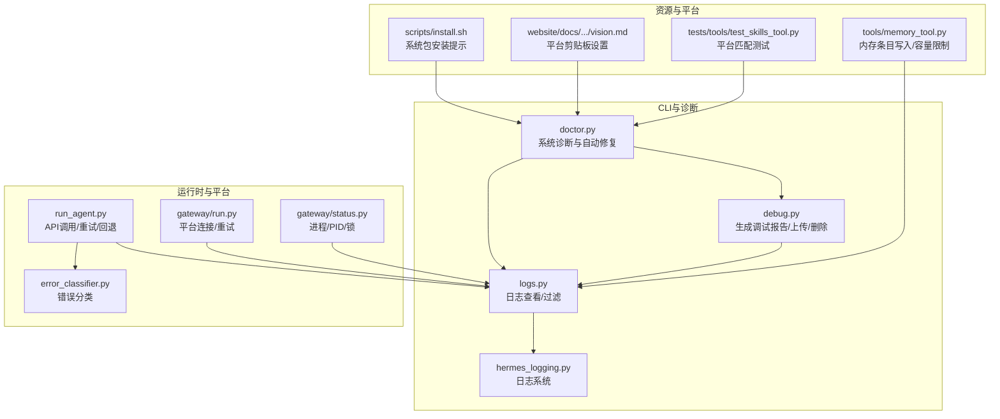
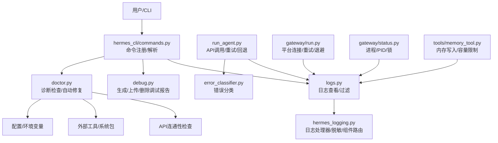
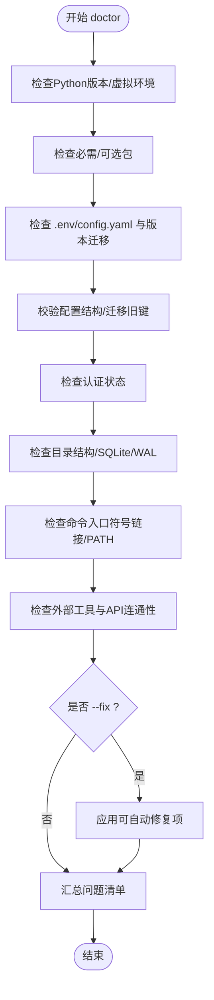
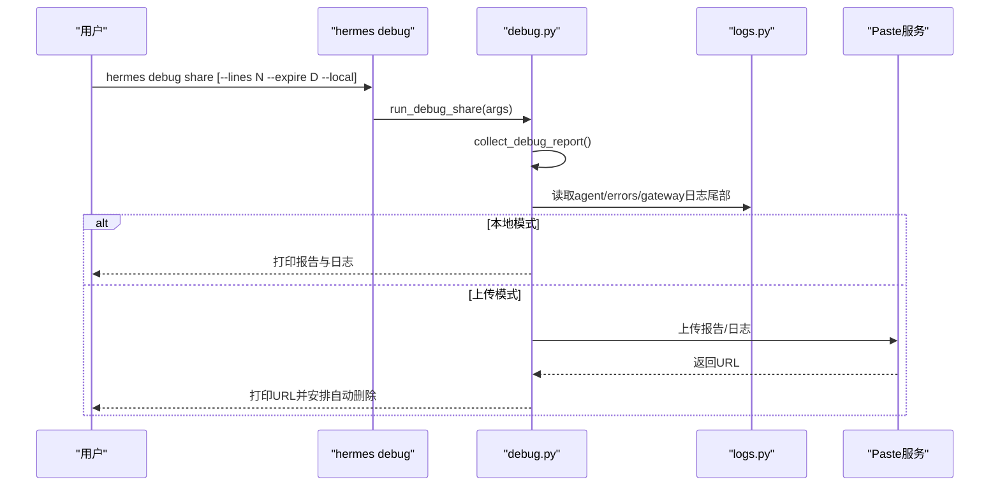
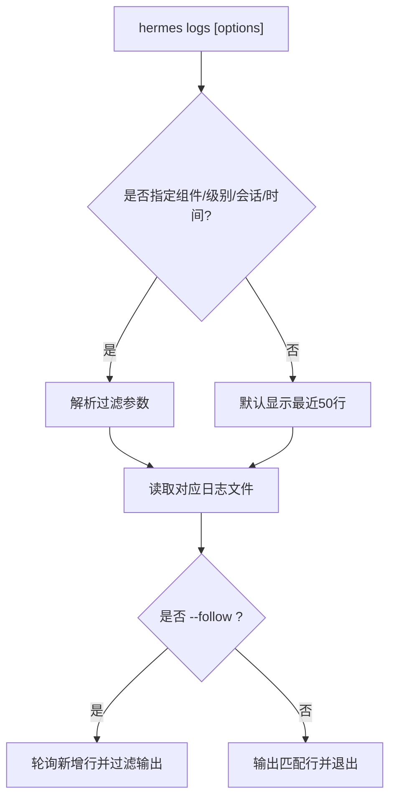
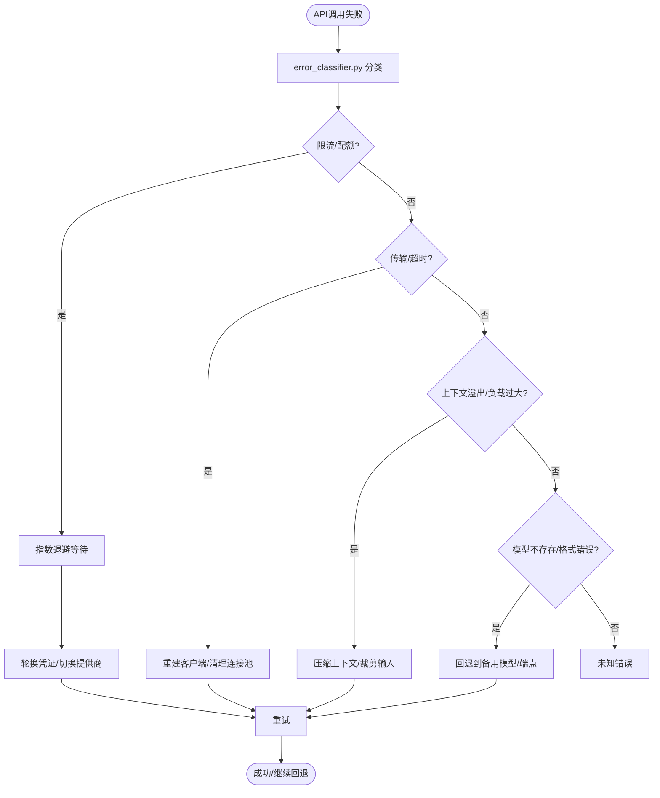
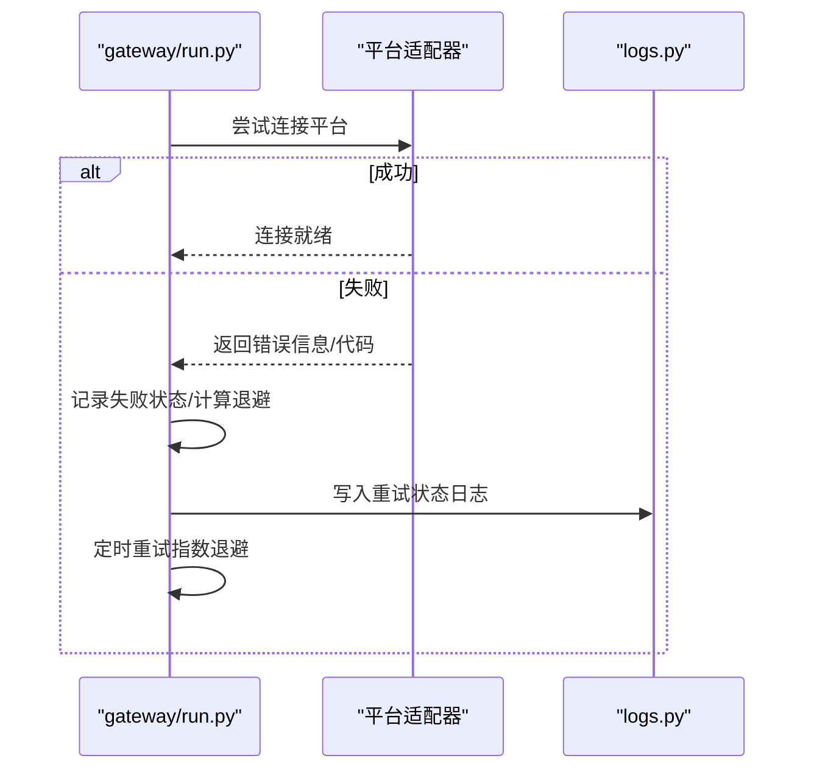
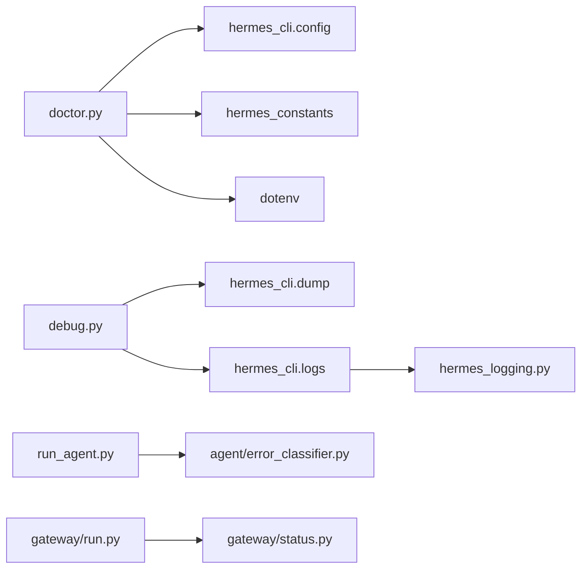

# 故障排除

<cite>
**本文引用的文件**
- [hermes_cli/doctor.py](file://hermes_cli/doctor.py)
- [hermes_cli/debug.py](file://hermes_cli/debug.py)
- [hermes_cli/logs.py](file://hermes_cli/logs.py)
- [hermes_logging.py](file://hermes_logging.py)
- [run_agent.py](file://run_agent.py)
- [agent/error_classifier.py](file://agent/error_classifier.py)
- [gateway/run.py](file://gateway/run.py)
- [gateway/status.py](file://gateway/status.py)
- [hermes_cli/commands.py](file://hermes_cli/commands.py)
- [tools/memory_tool.py](file://tools/memory_tool.py)
- [skills/software-development/systematic-debugging/SKILL.md](file://skills/software-development/systematic-debugging/SKILL.md)
- [tests/hermes_cli/test_debug.py](file://tests/hermes_cli/test_debug.py)
- [website/docs/user-guide/features/vision.md](file://website/docs/user-guide/features/vision.md)
- [scripts/install.sh](file://scripts/install.sh)
- [tests/tools/test_skills_tool.py](file://tests/tools/test_skills_tool.py)
- [tests/tools/test_tirith_security.py](file://tests/tools/test_tirith_security.py)
- [skills/mlops/training/unsloth/references/llms-txt.md](file://skills/mlops/training/unsloth/references/llms-txt.md)
</cite>

## 目录
1. [简介](#简介)
2. [项目结构](#项目结构)
3. [核心组件](#核心组件)
4. [架构总览](#架构总览)
5. [详细组件分析](#详细组件分析)
6. [依赖分析](#依赖分析)
7. [性能考虑](#性能考虑)
8. [故障排除指南](#故障排除指南)
9. [结论](#结论)
10. [附录](#附录)

## 简介
本指南面向Hermes Agent用户与维护者，提供系统化的故障排除流程与检查清单，覆盖安装问题、运行时错误、性能问题、网络连接问题、API调用失败、内存泄漏与资源耗尽检测、日志分析与错误定位策略，并给出平台特定问题的解决方案与问题报告/反馈机制。

## 项目结构
围绕故障排除的关键模块与文件：
- 命令行诊断与修复：hermes_cli/doctor.py（系统环境、配置、认证、目录结构、外部工具、API连通性等）
- 调试与报告：hermes_cli/debug.py（生成系统信息与日志摘要，上传/删除paste链接）
- 日志查看与过滤：hermes_cli/logs.py（tail/follow、按级别/组件/会话/时间过滤）
- 日志系统：hermes_logging.py（统一日志格式、处理器、组件路由、脱敏）
- 运行时错误分类与恢复：run_agent.py（重试回退）、agent/error_classifier.py（错误分类）
- 网关状态与平台适配：gateway/run.py（平台连接重试/退避）、gateway/status.py（进程/PID/锁）
- 平台与技能匹配：hermes_cli/commands.py（命令注册）、tests/tools/test_skills_tool.py（平台匹配）
- 内存与资源：tools/memory_tool.py（内存条目写入与容量限制）、tests/tools/test_tirith_security.py（失败缓存）
- 性能参考：skills/mlops/training/unsloth/references/llms-txt.md（CUDA内存占用示例）

图表来源
- [hermes_cli/doctor.py:164-1149](file://hermes_cli/doctor.py#L164-L1149)
- [hermes_cli/debug.py:351-478](file://hermes_cli/debug.py#L351-L478)
- [hermes_cli/logs.py:138-391](file://hermes_cli/logs.py#L138-L391)
- [hermes_logging.py:156-294](file://hermes_logging.py#L156-L294)
- [run_agent.py:9692-10291](file://run_agent.py#L9692-L10291)
- [agent/error_classifier.py:24-200](file://agent/error_classifier.py#L24-L200)
- [gateway/run.py:1912-2275](file://gateway/run.py#L1912-L2275)
- [gateway/status.py:32-200](file://gateway/status.py#L32-L200)
- [tools/memory_tool.py:222-246](file://tools/memory_tool.py#L222-L246)
- [scripts/install.sh:610-638](file://scripts/install.sh#L610-L638)
- [website/docs/user-guide/features/vision.md:75-130](file://website/docs/user-guide/features/vision.md#L75-L130)
- [tests/tools/test_skills_tool.py:538-597](file://tests/tools/test_skills_tool.py#L538-L597)

章节来源
- [hermes_cli/doctor.py:164-1149](file://hermes_cli/doctor.py#L164-L1149)
- [hermes_cli/debug.py:351-478](file://hermes_cli/debug.py#L351-L478)
- [hermes_cli/logs.py:138-391](file://hermes_cli/logs.py#L138-L391)
- [hermes_logging.py:156-294](file://hermes_logging.py#L156-L294)

## 核心组件
- Doctor命令：自动化检查Python版本/虚拟环境、必需包、配置文件/版本迁移、认证状态、目录结构、SQLite WAL、命令入口符号链接、外部工具（git/ripgrep/docker/ssh/daytona/node/agent-browser/npm审计）、API连通性（OpenRouter/Anthropic），支持--fix自动修复可处理项并汇总剩余问题。
- Debug命令：收集系统dump与最近日志尾部，支持上传到paste服务或本地打印；可删除paste.rs粘贴以保护隐私。
- 日志系统：统一输出agent.log/errors.log/gateway.log，支持组件过滤、会话过滤、时间范围、级别过滤、实时follow。
- 错误分类与恢复：对API错误进行结构化分类（鉴权/账单/限流/过载/超时/上下文溢出/负载过大/模型不存在/格式错误/未知），指导重试、压缩上下文、轮换凭证、回退到其他提供商。
- 网关状态：通过PID文件与runtime状态文件管理网关进程，支持终止、重启、锁管理，用于CLI侧可用性判断。
- 平台与技能：平台命令注册与自动补全；技能按平台过滤加载；平台差异导致的故障需结合平台文档与安装脚本。

章节来源
- [hermes_cli/doctor.py:164-1149](file://hermes_cli/doctor.py#L164-L1149)
- [hermes_cli/debug.py:351-478](file://hermes_cli/debug.py#L351-L478)
- [hermes_cli/logs.py:138-391](file://hermes_cli/logs.py#L138-L391)
- [hermes_logging.py:156-294](file://hermes_logging.py#L156-L294)
- [run_agent.py:9692-10291](file://run_agent.py#L9692-L10291)
- [agent/error_classifier.py:24-200](file://agent/error_classifier.py#L24-L200)
- [gateway/status.py:32-200](file://gateway/status.py#L32-L200)
- [hermes_cli/commands.py:59-169](file://hermes_cli/commands.py#L59-L169)

## 架构总览
下图展示故障排除相关组件之间的交互关系与数据流向。

图表来源
- [hermes_cli/commands.py:59-169](file://hermes_cli/commands.py#L59-L169)
- [hermes_cli/doctor.py:164-1149](file://hermes_cli/doctor.py#L164-L1149)
- [hermes_cli/debug.py:351-478](file://hermes_cli/debug.py#L351-L478)
- [hermes_cli/logs.py:138-391](file://hermes_cli/logs.py#L138-L391)
- [hermes_logging.py:156-294](file://hermes_logging.py#L156-L294)
- [run_agent.py:9692-10291](file://run_agent.py#L9692-L10291)
- [agent/error_classifier.py:24-200](file://agent/error_classifier.py#L24-L200)
- [gateway/run.py:1912-2275](file://gateway/run.py#L1912-L2275)
- [gateway/status.py:32-200](file://gateway/status.py#L32-L200)
- [tools/memory_tool.py:222-246](file://tools/memory_tool.py#L222-L246)

## 详细组件分析

### Doctor命令：系统化诊断与自动修复
- 检查点
  - Python版本与虚拟环境
  - 必需/可选包存在性
  - ~/.hermes/.env与config.yaml存在性与版本迁移
  - 配置结构有效性与旧键迁移
  - 认证状态（Nous/Codex/Gemini）
  - 目录结构与SQLite状态.db/WAL大小
  - 命令入口符号链接与PATH
  - 外部工具（git/ripgrep/docker/ssh/daytona/node/agent-browser/npm审计）
  - API连通性（OpenRouter/Anthropic）
- 自动修复
  - 创建缺失的.env/config.yaml
  - 迁移配置版本
  - 移动旧键到新位置
  - WAL检查点
  - 修复符号链接
  - 提示添加PATH
- 输出
  - 成功/警告/失败计数
  - 可自动修复项与需要人工干预项的清单

图表来源
- [hermes_cli/doctor.py:164-1149](file://hermes_cli/doctor.py#L164-L1149)

章节来源
- [hermes_cli/doctor.py:164-1149](file://hermes_cli/doctor.py#L164-L1149)

### Debug命令：调试报告与隐私控制
- 功能
  - 收集系统dump与最近日志尾部
  - 可选上传至paste.rs/dpaste.com或本地打印
  - 支持删除paste.rs粘贴
  - 自动6小时后删除paste.rs粘贴
- 使用建议
  - 优先使用--local仅在本地查看，确认无敏感信息后再上传
  - 上传前阅读隐私声明，了解内容范围

图表来源
- [hermes_cli/debug.py:351-478](file://hermes_cli/debug.py#L351-L478)
- [hermes_cli/logs.py:219-344](file://hermes_cli/logs.py#L219-L344)

章节来源
- [hermes_cli/debug.py:351-478](file://hermes_cli/debug.py#L351-L478)
- [tests/hermes_cli/test_debug.py:228-301](file://tests/hermes_cli/test_debug.py#L228-L301)

### 日志系统与查看：快速定位问题
- 统一日志
  - agent.log：主活动日志（INFO+）
  - errors.log：错误告警（WARNING+）
  - gateway.log：网关组件（INFO+，按组件过滤）
- 过滤能力
  - 级别过滤（DEBUG/INFO/WARNING/ERROR/CRITICAL）
  - 组件过滤（gateway/agent/tools/cli/cron）
  - 会话过滤（会话ID子串）
  - 时间范围（相对时间如1h/30m/2d）
  - 实时follow（Ctrl+C停止）
- 日志文件位置
  - ~/.hermes/logs/ 下的agent.log、errors.log、gateway.log

图表来源
- [hermes_cli/logs.py:138-391](file://hermes_cli/logs.py#L138-L391)
- [hermes_logging.py:156-294](file://hermes_logging.py#L156-L294)

章节来源
- [hermes_cli/logs.py:138-391](file://hermes_cli/logs.py#L138-L391)
- [hermes_logging.py:156-294](file://hermes_logging.py#L156-L294)

### API调用失败：分类与恢复策略
- 错误分类
  - 鉴权/授权（401/403/无效密钥/永久失败）
  - 账单/配额（402/信用耗尽/计划上限）
  - 限流（429/配额/速率限制）
  - 服务器错误（500/502/503/529）
  - 传输错误（超时/连接异常）
  - 上下文溢出/负载过大（413/上下文窗口超限）
  - 模型不存在/请求格式错误
  - 未知错误
- 恢复策略
  - 重试（指数退避+抖动）
  - 压缩上下文/减少负载
  - 轮换凭证/切换提供商
  - 回退到备用模型/端点
  - 重建客户端/清理连接池
- 关键实现
  - run_agent.py中的重试循环与回退逻辑
  - error_classifier.py中的分类器

图表来源
- [run_agent.py:9692-10291](file://run_agent.py#L9692-L10291)
- [agent/error_classifier.py:24-200](file://agent/error_classifier.py#L24-L200)

章节来源
- [run_agent.py:9692-10291](file://run_agent.py#L9692-L10291)
- [agent/error_classifier.py:24-200](file://agent/error_classifier.py#L24-L200)

### 网络连接问题：平台适配与重试
- 平台连接失败
  - 初次启动失败：区分致命错误与可重试错误，记录重试时间戳与退避
  - 运行中断开：指数退避重连，记录错误码/消息
- 网关健康
  - PID文件与runtime状态文件用于进程存活与状态判断
  - 支持终止/重启/锁管理

图表来源
- [gateway/run.py:1912-2275](file://gateway/run.py#L1912-L2275)
- [hermes_cli/logs.py:138-391](file://hermes_cli/logs.py#L138-L391)

章节来源
- [gateway/run.py:1912-2275](file://gateway/run.py#L1912-L2275)
- [gateway/status.py:32-200](file://gateway/status.py#L32-L200)

### 平台特定问题：剪贴板与系统包
- 剪贴板（视觉功能）
  - macOS：osascript内置；可选pngpaste加速
  - Linux X11/Wayland：xclip/wl-clipboard
  - WSL2：自动检测Windows互操作，必要时使用PowerShell桥接
- 系统包安装
  - install.sh提供可选系统包安装提示（ripgrep/ffmpeg等）

章节来源
- [website/docs/user-guide/features/vision.md:75-130](file://website/docs/user-guide/features/vision.md#L75-L130)
- [scripts/install.sh:610-638](file://scripts/install.sh#L610-L638)

### 内存泄漏与资源耗尽：检测与缓解
- 内存写入容量限制
  - tools/memory_tool.py对内存条目写入进行容量检查与重复检测
- 失败缓存
  - tests/tools/test_tirith_security.py展示失败标记与TTL忽略逻辑，避免重复尝试
- CUDA内存参考
  - skills/mlops/training/unsloth/references/llms-txt.md提供CUDA内存占用示例，可用于对比与优化

章节来源
- [tools/memory_tool.py:222-246](file://tools/memory_tool.py#L222-L246)
- [tests/tools/test_tirith_security.py:340-727](file://tests/tools/test_tirith_security.py#L340-L727)
- [skills/mlops/training/unsloth/references/llms-txt.md:1902-2004](file://skills/mlops/training/unsloth/references/llms-txt.md#L1902-L2004)

## 依赖分析
- Doctor命令依赖
  - hermes_cli.config/get_project_root/get_hermes_home/get_env_path
  - hermes_constants（路径/常量）
  - dotenv加载环境变量
  - 平台检测（Termux）
  - 插件/Honcho可用性调整
- Debug命令依赖
  - hermes_cli.dump（系统dump）
  - hermes_cli.logs（日志读取）
  - paste服务上传/删除
- 日志系统依赖
  - hermes_constants（路径）
  - agent.redact.RedactingFormatter（脱敏）
  - logging.handlers.RotatingFileHandler（轮转）
- 运行时与平台
  - run_agent.py与error_classifier.py协作
  - gateway/run.py与gateway/status.py协作

图表来源
- [hermes_cli/doctor.py:13-32](file://hermes_cli/doctor.py#L13-L32)
- [hermes_cli/debug.py:16-31](file://hermes_cli/debug.py#L16-L31)
- [hermes_cli/logs.py:27-31](file://hermes_cli/logs.py#L27-L31)
- [hermes_logging.py:33-34](file://hermes_logging.py#L33-L34)
- [run_agent.py:9692-10291](file://run_agent.py#L9692-L10291)
- [agent/error_classifier.py:24-200](file://agent/error_classifier.py#L24-L200)
- [gateway/run.py:1912-2275](file://gateway/run.py#L1912-L2275)
- [gateway/status.py:22-28](file://gateway/status.py#L22-L28)

章节来源
- [hermes_cli/doctor.py:13-32](file://hermes_cli/doctor.py#L13-L32)
- [hermes_cli/debug.py:16-31](file://hermes_cli/debug.py#L16-L31)
- [hermes_cli/logs.py:27-31](file://hermes_cli/logs.py#L27-L31)
- [hermes_logging.py:33-34](file://hermes_logging.py#L33-L34)

## 性能考虑
- 日志轮转与大小控制：避免日志文件无限增长导致磁盘压力
- 过滤与tail：在大规模日志中使用级别/组件/会话/时间过滤，减少I/O与CPU消耗
- API重试退避：指数退避+抖动降低雪崩风险
- 上下文压缩：针对上下文溢出场景，优先压缩而非直接失败
- 资源监控：参考CUDA内存占用示例，评估显存使用与峰值，避免OOM

## 故障排除指南

### 通用诊断流程
- 第一步：运行Doctor
  - hermes doctor
  - hermes doctor --fix（仅自动修复可处理项）
  - 记录“剩余问题”清单
- 第二步：查看日志
  - hermes logs 或 hermes logs --level WARNING
  - hermes logs --component gateway/tools/cli
  - hermes logs --session <id>
  - hermes logs --since 1h -f
- 第三步：生成调试报告
  - hermes debug share --local 查看本地报告
  - hermes debug share 上传后分享URL给支持团队
  - hermes debug delete <url> 删除paste.rs粘贴

章节来源
- [hermes_cli/doctor.py:164-1149](file://hermes_cli/doctor.py#L164-L1149)
- [hermes_cli/logs.py:138-391](file://hermes_cli/logs.py#L138-L391)
- [hermes_cli/debug.py:351-478](file://hermes_cli/debug.py#L351-L478)

### 安装问题
- 缺失必需包
  - 症状：doctor列出缺失
  - 处理：根据提示安装（pip/uv）或doctor --fix
- .env/config.yaml缺失
  - 症状：doctor提示缺失
  - 处理：doctor --fix创建空文件或运行hermes setup
- 目录结构不完整
  - 症状：memories/state.db等目录缺失
  - 处理：doctor --fix创建或等待首次使用自动生成
- 命令入口符号链接
  - 症状：hermes命令不可用
  - 处理：doctor --fix修复符号链接或手动添加~/.local/bin到PATH

章节来源
- [hermes_cli/doctor.py:266-615](file://hermes_cli/doctor.py#L266-L615)

### 运行时错误
- API调用失败
  - 步骤：查看errors.log与agent.log，定位错误分类
  - 处理：根据分类执行重试/压缩/轮换/回退
- 平台连接失败
  - 步骤：查看gateway.log，确认重试退避与错误码
  - 处理：检查网络/凭据/平台配置，等待退避后重试
- 网关进程异常
  - 步骤：检查PID文件与runtime状态
  - 处理：必要时终止/重启网关

章节来源
- [run_agent.py:9692-10291](file://run_agent.py#L9692-L10291)
- [agent/error_classifier.py:24-200](file://agent/error_classifier.py#L24-L200)
- [gateway/run.py:1912-2275](file://gateway/run.py#L1912-L2275)
- [gateway/status.py:32-200](file://gateway/status.py#L32-L200)

### 性能问题
- 日志过大
  - 步骤：hermes logs list 查看日志大小
  - 处理：doctor --fix执行WAL检查点，或调整logging配置
- 上下文溢出
  - 步骤：查看上下文溢出错误分类
  - 处理：启用压缩/减少历史/分段对话
- 资源耗尽（显存/CPU）
  - 步骤：参考CUDA内存示例对比当前使用
  - 处理：降低批大小/切换BF16/梯度累积/回退模型

章节来源
- [hermes_cli/doctor.py:509-532](file://hermes_cli/doctor.py#L509-L532)
- [skills/mlops/training/unsloth/references/llms-txt.md:1902-2004](file://skills/mlops/training/unsloth/references/llms-txt.md#L1902-L2004)

### 网络连接问题
- API连通性
  - 步骤：doctor检查OpenRouter/Anthropic连通性
  - 处理：检查代理/防火墙/证书/超时设置
- 平台连接
  - 步骤：gateway.log查看重试与退避
  - 处理：检查平台凭据/网络/重试策略

章节来源
- [hermes_cli/doctor.py:760-800](file://hermes_cli/doctor.py#L760-L800)
- [gateway/run.py:1912-2275](file://gateway/run.py#L1912-L2275)

### API调用失败排查
- 步骤
  - 查看错误分类（error_classifier.py）
  - 应用对应恢复策略（run_agent.py）
  - 记录重试次数/退避/回退
- 常见原因
  - 限流/配额：指数退避+轮换
  - 超时/传输：重建客户端
  - 上下文/负载过大：压缩/裁剪
  - 模型不存在/格式错误：回退/修正

章节来源
- [agent/error_classifier.py:24-200](file://agent/error_classifier.py#L24-L200)
- [run_agent.py:9692-10291](file://run_agent.py#L9692-L10291)

### 内存泄漏与资源耗尽检测
- 内存写入
  - 使用tools/memory_tool.py写入时进行容量检查与去重
- 失败缓存
  - 避免重复尝试失败的安装/下载
- 显存监控
  - 对照CUDA内存示例，评估峰值与稳定性

章节来源
- [tools/memory_tool.py:222-246](file://tools/memory_tool.py#L222-L246)
- [tests/tools/test_tirith_security.py:340-727](file://tests/tools/test_tirith_security.py#L340-L727)
- [skills/mlops/training/unsloth/references/llms-txt.md:1902-2004](file://skills/mlops/training/unsloth/references/llms-txt.md#L1902-L2004)

### 日志分析技巧与错误定位
- 使用hermes logs的过滤组合快速缩小范围
- 结合会话ID与组件过滤定位具体模块
- 使用--since限定时间窗口，配合--follow观察动态变化
- errors.log适合快速定位严重问题

章节来源
- [hermes_cli/logs.py:138-391](file://hermes_cli/logs.py#L138-L391)
- [hermes_logging.py:156-294](file://hermes_logging.py#L156-L294)

### 平台特定问题
- 剪贴板
  - macOS：osascript内置；可选pngpaste
  - Linux X11/Wayland：xclip/wl-clipboard
  - WSL2：PowerShell桥接
- 系统包
  - install.sh提供ripgrep/ffmpeg等可选包安装提示

章节来源
- [website/docs/user-guide/features/vision.md:75-130](file://website/docs/user-guide/features/vision.md#L75-L130)
- [scripts/install.sh:610-638](file://scripts/install.sh#L610-L638)

### 问题报告与反馈机制
- 生成本地报告：hermes debug share --local
- 上传报告：hermes debug share（自动6小时删除paste.rs）
- 删除粘贴：hermes debug delete <url>
- 提交问题：附带doctor输出、最近日志尾部、调试报告URL

章节来源
- [hermes_cli/debug.py:351-478](file://hermes_cli/debug.py#L351-L478)
- [tests/hermes_cli/test_debug.py:228-301](file://tests/hermes_cli/test_debug.py#L228-L301)

## 结论
通过Doctor命令进行系统化诊断、Debug命令生成标准化报告、日志系统的多维过滤与脱敏输出，以及API错误分类与重试回退机制，Hermes Agent提供了完整的故障排除闭环。结合平台特定配置与资源监控，可高效定位并解决问题，同时保障隐私与安全。

## 附录

### 常用命令速查
- hermes doctor
- hermes doctor --fix
- hermes logs
- hermes logs --level WARNING
- hermes logs --component gateway
- hermes logs --session <id>
- hermes logs --since 1h -f
- hermes debug share
- hermes debug share --local
- hermes debug delete <url>

章节来源
- [hermes_cli/commands.py:59-169](file://hermes_cli/commands.py#L59-L169)
- [hermes_cli/doctor.py:164-1149](file://hermes_cli/doctor.py#L164-L1149)
- [hermes_cli/logs.py:138-391](file://hermes_cli/logs.py#L138-L391)
- [hermes_cli/debug.py:351-478](file://hermes_cli/debug.py#L351-L478)