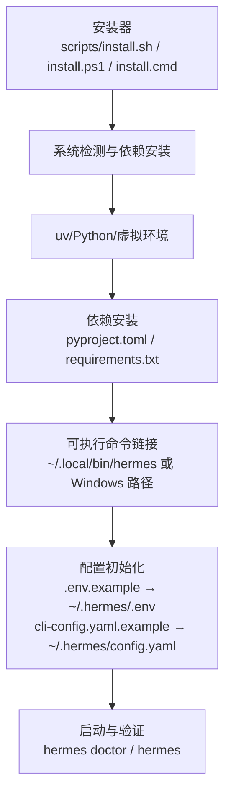
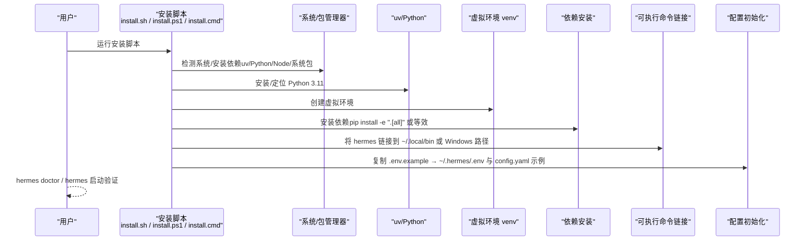
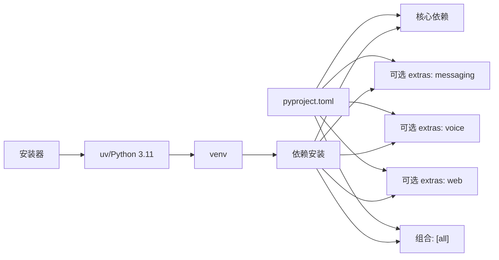

# 本地部署

<cite>
**本文引用的文件**
- [README.md](file://README.md)
- [pyproject.toml](file://pyproject.toml)
- [requirements.txt](file://requirements.txt)
- [setup-hermes.sh](file://setup-hermes.sh)
- [scripts/install.sh](file://scripts/install.sh)
- [scripts/install.ps1](file://scripts/install.ps1)
- [scripts/install.cmd](file://scripts/install.cmd)
- [Dockerfile](file://Dockerfile)
- [.env.example](file://.env.example)
- [cli-config.yaml.example](file://cli-config.yaml.example)
- [constraints-termux.txt](file://constraints-termux.txt)
- [AGENTS.md](file://AGENTS.md)
- [CONTRIBUTING.md](file://CONTRIBUTING.md)
</cite>

## 目录
1. [简介](#简介)
2. [项目结构](#项目结构)
3. [核心组件](#核心组件)
4. [架构总览](#架构总览)
5. [详细组件分析](#详细组件分析)
6. [依赖关系分析](#依赖关系分析)
7. [性能考虑](#性能考虑)
8. [故障排查指南](#故障排查指南)
9. [结论](#结论)
10. [附录](#附录)

## 简介
本文件面向在本地部署 Hermes Agent 的用户，提供从系统要求、前置条件、安装步骤、环境配置到多平台安装指南与性能优化的完整说明。内容基于仓库中的安装脚本、包管理配置与示例配置文件整理而成，确保读者能够以最小成本完成本地部署并稳定运行。

## 项目结构
Hermes Agent 的本地部署涉及以下关键要素：
- 安装器：支持 Linux/macOS/Android/Termux 与 Windows（PowerShell/CMD），自动处理 uv、Python、虚拟环境、依赖安装与可执行命令链接。
- 包管理与依赖：通过 pyproject.toml 声明核心与可选依赖；requirements.txt 提供便捷安装参考。
- 配置体系：.env.example 提供环境变量模板；cli-config.yaml.example 提供 CLI 行为配置模板。
- 平台差异：Linux/macOS/Windows/Android/Termux 各有特定安装路径与依赖约束。
- 可选子模块：如 tinker-atropos（RL 训练）等，按需安装。

图表来源
- [scripts/install.sh:1-120](file://scripts/install.sh#L1-L120)
- [scripts/install.ps1:1-120](file://scripts/install.ps1#L1-L120)
- [pyproject.toml:1-137](file://pyproject.toml#L1-L137)
- [requirements.txt:1-37](file://requirements.txt#L1-L37)

章节来源
- [README.md:30-63](file://README.md#L30-L63)
- [pyproject.toml:1-137](file://pyproject.toml#L1-L137)
- [requirements.txt:1-37](file://requirements.txt#L1-L37)

## 核心组件
- 安装器
  - Linux/macOS/Android/Termux：使用 scripts/install.sh，自动检测系统、安装 uv、Python 3.11、依赖，并创建 venv 与可执行链接。
  - Windows：提供 PowerShell 脚本 scripts/install.ps1 与 CMD 包装 scripts/install.cmd，处理 uv、Python、PATH、HERMES_HOME 等。
- 包管理与依赖
  - pyproject.toml 定义核心依赖与可选 extras（如 [all]、[dev]、[messaging]、[voice] 等），并声明入口命令 hermes。
  - requirements.txt 提供便捷安装参考（推荐使用 pip install -e ".[all]"）。
- 配置
  - .env.example：API 密钥与平台集成所需的环境变量模板。
  - cli-config.yaml.example：模型、终端后端、工具集、压缩策略、显示与行为等配置模板。
- 平台差异
  - Dockerfile 展示了 Debian 基础镜像、非 root 用户、系统依赖安装与 uv 安装流程，便于理解容器化部署思路。
  - constraints-termux.txt 为 Android/Termux 提供稳定的依赖约束。

章节来源
- [scripts/install.sh:1-120](file://scripts/install.sh#L1-L120)
- [scripts/install.ps1:1-120](file://scripts/install.ps1#L1-L120)
- [scripts/install.cmd:1-29](file://scripts/install.cmd#L1-L29)
- [pyproject.toml:117-129](file://pyproject.toml#L117-L129)
- [requirements.txt:1-37](file://requirements.txt#L1-L37)
- [.env.example:1-60](file://.env.example#L1-L60)
- [cli-config.yaml.example:1-60](file://cli-config.yaml.example#L1-L60)
- [Dockerfile:1-47](file://Dockerfile#L1-L47)
- [constraints-termux.txt:1-16](file://constraints-termux.txt#L1-L16)

## 架构总览
下图展示了本地安装与启动的关键流程，覆盖系统检测、依赖安装、虚拟环境、可执行命令与配置初始化：

图表来源
- [scripts/install.sh:159-194](file://scripts/install.sh#L159-L194)
- [scripts/install.ps1:129-192](file://scripts/install.ps1#L129-L192)
- [scripts/install.cmd:1-29](file://scripts/install.cmd#L1-L29)
- [pyproject.toml:117-129](file://pyproject.toml#L117-L129)

章节来源
- [scripts/install.sh:159-194](file://scripts/install.sh#L159-L194)
- [scripts/install.ps1:129-192](file://scripts/install.ps1#L129-L192)
- [scripts/install.cmd:1-29](file://scripts/install.cmd#L1-L29)

## 详细组件分析

### 系统要求与前置条件
- Python 版本
  - 推荐/最低：Python 3.11（安装器会自动安装或提示安装）。
  - 开发文档也明确 Python 3.11+ 的要求。
- 操作系统兼容性
  - Linux、macOS、Android/Termux（tested path）、WSL2（通过 Linux 路径安装）。
  - Windows：原生不支持，需使用 PowerShell 安装器或 WSL2。
- 硬件要求
  - 仓库未给出具体硬件指标；实际资源需求取决于所选模型与工具集大小。建议至少保留足够的磁盘空间用于缓存与日志。
- 可选系统依赖
  - ripgrep（加速文件搜索）、ffmpeg（语音消息相关功能）在安装器中作为可选依赖检查与提示。

章节来源
- [README.md:36-41](file://README.md#L36-L41)
- [CONTRIBUTING.md:54-62](file://CONTRIBUTING.md#L54-L62)
- [scripts/install.sh:489-660](file://scripts/install.sh#L489-L660)
- [scripts/install.ps1:289-406](file://scripts/install.ps1#L289-L406)

### 安装步骤（通用流程）
- 获取安装脚本并运行
  - Linux/macOS/Android/Termux：直接执行 curl 命令获取安装脚本并运行。
  - Windows：使用 PowerShell 安装器或 CMD 包装器。
- 自动化流程
  - 检测系统类型与架构，安装 uv 与 Python 3.11。
  - 创建虚拟环境 venv，安装依赖（优先使用 uv 锁定安装，失败时回退 pip）。
  - 在用户可访问的 bin 目录创建 hermes 可执行链接。
  - 初始化配置目录与文件（~/.hermes/.env、~/.hermes/config.yaml）。
  - 可选：运行交互式 setup 向导进行配置。
- 验证
  - 使用 hermes doctor 检查环境与配置状态，再运行 hermes 启动交互式会话。

章节来源
- [README.md:30-63](file://README.md#L30-L63)
- [scripts/install.sh:1-120](file://scripts/install.sh#L1-L120)
- [scripts/install.ps1:1-120](file://scripts/install.ps1#L1-L120)
- [scripts/install.cmd:1-29](file://scripts/install.cmd#L1-L29)

### 环境配置
- 环境变量设置
  - 复制 .env.example 到 ~/.hermes/.env，填入所需 API 密钥与平台令牌。
  - 支持多种推理提供商与工具 API（如 OpenRouter、Google AI Studio、Ollama Cloud、Qwen OAuth、Browserbase、Honcho 等）。
- 配置文件定制
  - 复制 cli-config.yaml.example 到 ~/.hermes/config.yaml，调整模型、终端后端、工具集、上下文压缩、显示与行为等。
- 初始设置
  - 运行 hermes setup 或 hermes doctor 进行交互式诊断与配置。

章节来源
- [.env.example:1-120](file://.env.example#L1-L120)
- [cli-config.yaml.example:1-120](file://cli-config.yaml.example#L1-L120)
- [README.md:42-63](file://README.md#L42-L63)

### 不同操作系统安装指南

#### Linux（桌面/服务器）
- 使用 curl 获取安装脚本并运行，脚本会自动：
  - 安装/定位 Python 3.11（通过 uv）。
  - 创建 venv 并安装依赖（优先 uv 锁定安装）。
  - 在 ~/.local/bin 下创建 hermes 链接。
  - 初始化 ~/.hermes/.env 与 config.yaml 示例。
- 如需可选系统依赖（ripgrep、ffmpeg），安装器会提示并尝试自动安装。

章节来源
- [scripts/install.sh:159-194](file://scripts/install.sh#L159-L194)
- [scripts/install.sh:489-660](file://scripts/install.sh#L489-L660)

#### macOS
- 与 Linux 类似，安装器会检测 macOS 并处理依赖安装与 PATH 设置。
- 若需要可选系统包，安装器会提示通过 Homebrew 或其他方式安装。

章节来源
- [scripts/install.sh:159-194](file://scripts/install.sh#L159-L194)
- [scripts/install.sh:556-569](file://scripts/install.sh#L556-L569)

#### Android/Termux
- 安装器检测 Termux 环境并采用替代路径：
  - 使用 Python 标准库 venv 与 pip 安装。
  - 使用 constraints-termux.txt 固定依赖版本，保证可安装性。
  - 安装 tested bundle（termux extra）。
- 安装完成后，可通过 hermes doctor 与 hermes 进行验证。

章节来源
- [scripts/install.sh:125-127](file://scripts/install.sh#L125-L127)
- [scripts/install.sh:166-178](file://scripts/install.sh#L166-L178)
- [constraints-termux.txt:1-16](file://constraints-termux.txt#L1-L16)

#### Windows（PowerShell/CMD）
- PowerShell 安装器：
  - 检测/安装 uv 与 Python 3.11。
  - 在用户 PATH 中添加 venv Scripts 目录，设置 HERMES_HOME。
  - 安装主包与可选子模块（如 tinker-atropos）。
- CMD 包装器：
  - 直接调用 PowerShell 安装器，失败时提示手动运行 PowerShell 命令。

章节来源
- [scripts/install.ps1:129-192](file://scripts/install.ps1#L129-L192)
- [scripts/install.ps1:580-618](file://scripts/install.ps1#L580-L618)
- [scripts/install.cmd:1-29](file://scripts/install.cmd#L1-L29)

### 虚拟环境与依赖管理
- 虚拟环境
  - Linux/macOS/Android：默认使用 uv venv 创建 Python 3.11 虚拟环境。
  - Windows：同样创建 venv 并将 Scripts 目录加入 PATH。
- 依赖安装
  - 优先使用 uv sync --all-extras --locked（若存在 uv.lock）进行哈希校验安装。
  - 若锁文件不可用或过期，则回退到 pip install -e ".[all]"。
  - Android/Termux 使用 constraints-termux.txt 限定依赖版本。
- 入口命令
  - pyproject.toml 中定义 hermes 为入口命令，指向 hermes_cli.main。

章节来源
- [setup-hermes.sh:180-194](file://setup-hermes.sh#L180-L194)
- [scripts/install.sh:799-806](file://scripts/install.sh#L799-L806)
- [scripts/install.ps1:543-578](file://scripts/install.ps1#L543-L578)
- [pyproject.toml:117-129](file://pyproject.toml#L117-L129)
- [constraints-termux.txt:1-16](file://constraints-termux.txt#L1-L16)

### 容器化部署参考（Docker）
- Dockerfile 展示了 Debian 基础镜像、非 root 用户、系统依赖安装、Playwright 浏览器安装、uv 安装与 venv 创建、Python 依赖安装、入口脚本挂载与数据卷。
- 该文件可用于理解如何在容器环境中复现本地安装流程。

章节来源
- [Dockerfile:1-47](file://Dockerfile#L1-L47)

## 依赖关系分析
- 依赖来源
  - 核心依赖：openai、anthropic、httpx、rich、pyyaml、requests、jinja2、pydantic、prompt_toolkit 等。
  - 可选 extras：messaging（Telegram/Discord/Slack/Webhook）、cron、voice（faster-whisper）、web（FastAPI/Uvicorn）、acp、mcp、homeassistant、sms、honcho、bedrock、mistral、web 等。
  - [all] 组合包含大多数常用可选依赖。
- 依赖安装顺序
  - 安装器先安装 uv 与 Python 3.11，再创建 venv，最后安装依赖（优先 uv 锁定安装）。
- 平台差异
  - Android/Termux 使用 constraints-termux.txt 固定依赖版本，避免上游包更新导致的不可安装问题。

图表来源
- [pyproject.toml:13-115](file://pyproject.toml#L13-L115)
- [scripts/install.sh:159-194](file://scripts/install.sh#L159-L194)
- [scripts/install.ps1:543-578](file://scripts/install.ps1#L543-L578)

章节来源
- [pyproject.toml:13-115](file://pyproject.toml#L13-L115)
- [requirements.txt:1-37](file://requirements.txt#L1-L37)

## 性能考虑
- 上下文压缩
  - cli-config.yaml.example 提供上下文压缩阈值、目标比例与保护最近消息数量等参数，有助于在长对话中控制 token 使用。
- 模型与输出限制
  - 可在配置中设置 context_length 与 max_tokens，避免不必要的超大请求。
- 终端后端与资源
  - 不同终端后端（local/ssh/docker/modal/singularity/daytona）对资源占用影响不同，建议根据任务复杂度选择合适后端并设置容器资源上限。
- 语音与浏览器工具
  - 语音转写与浏览器自动化可能消耗较多资源，建议在需要时启用并合理配置超时与代理。

章节来源
- [cli-config.yaml.example:288-310](file://cli-config.yaml.example#L288-L310)
- [cli-config.yaml.example:120-220](file://cli-config.yaml.example#L120-L220)

## 故障排查指南
- hermes doctor
  - 使用 hermes doctor 运行内置诊断，检查配置、依赖与环境变量是否正确。
- 常见问题与解决
  - Python 版本不符：安装器会自动安装/定位 Python 3.11，若失败请手动安装。
  - uv 未找到：安装器会尝试安装 uv 并将其加入 PATH；若仍失败，请手动安装并确保 PATH 正确。
  - Windows 原生不支持：请使用 PowerShell 安装器或 WSL2。
  - Android/Termux 依赖不可安装：使用 constraints-termux.txt 并确保 Termux 包可用。
  - 可选系统依赖缺失：ripgrep/ffmpeg 缺失不会阻止核心功能，但会影响搜索与语音消息；安装器会提示安装。
- 日志与会话
  - 会话轨迹保存在 ~/.hermes/sessions/，可据此定位问题。

章节来源
- [README.md:42-63](file://README.md#L42-L63)
- [scripts/install.sh:196-255](file://scripts/install.sh#L196-L255)
- [scripts/install.ps1:72-130](file://scripts/install.ps1#L72-L130)
- [scripts/install.sh:489-660](file://scripts/install.sh#L489-L660)
- [AGENTS.md:720-730](file://AGENTS.md#L720-L730)

## 结论
通过安装器与配置模板，Hermes Agent 能够在 Linux、macOS、Android/Termux 与 Windows（PowerShell/WSL2）上快速完成本地部署。建议优先使用 uv 与 venv，按需启用可选 extras，并结合 cli-config.yaml 与 .env.example 进行个性化配置。遇到问题时，使用 hermes doctor 与会话日志进行定位，必要时参考各平台安装器的提示与回退策略。

## 附录

### 快速开始清单
- Linux/macOS/Android/Termux：运行 curl 获取安装脚本并执行。
- Windows：运行 PowerShell 安装器或 CMD 包装器。
- 配置 API 密钥与平台令牌于 ~/.hermes/.env。
- 复制 cli-config.yaml.example 至 ~/.hermes/config.yaml 并按需修改。
- 运行 hermes doctor 与 hermes 验证部署。

章节来源
- [README.md:30-63](file://README.md#L30-L63)
- [scripts/install.sh:1-120](file://scripts/install.sh#L1-L120)
- [scripts/install.ps1:1-120](file://scripts/install.ps1#L1-L120)
- [scripts/install.cmd:1-29](file://scripts/install.cmd#L1-L29)