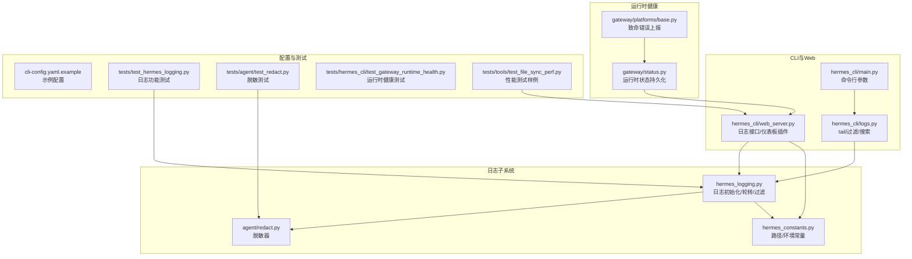
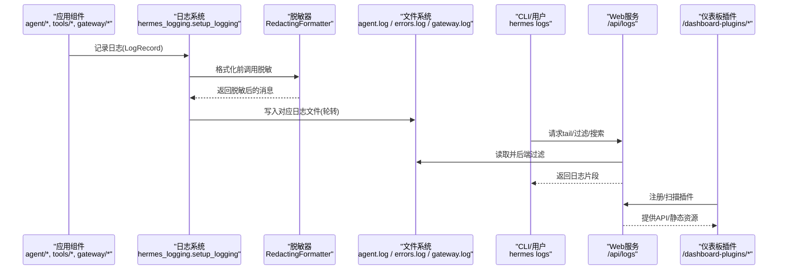
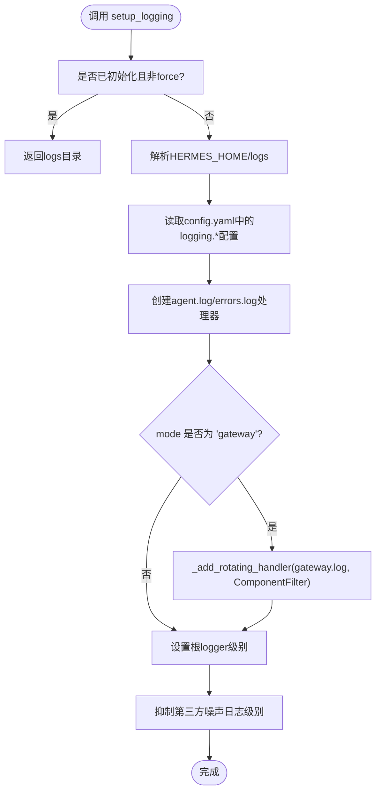
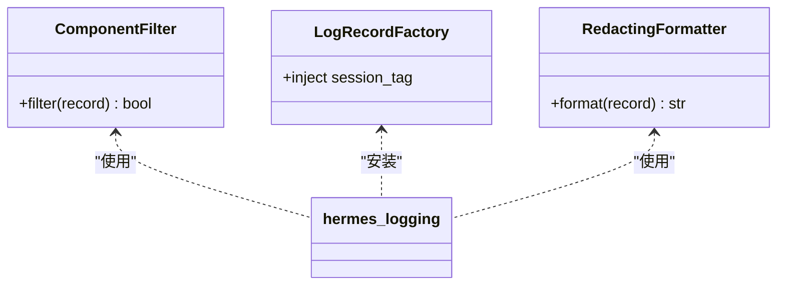
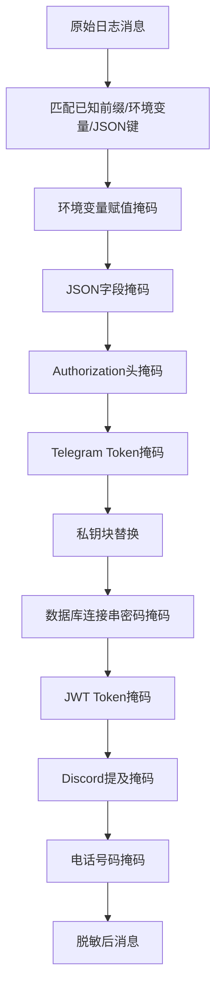
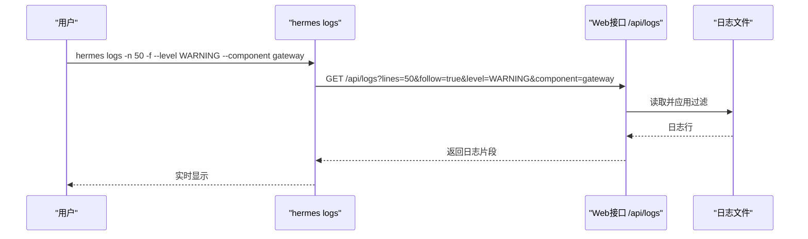
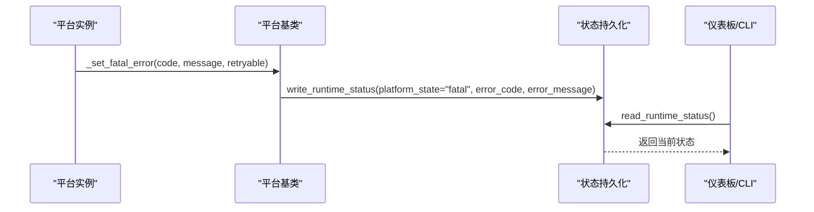
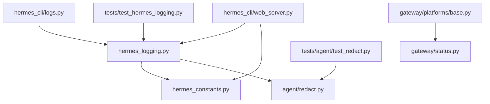

# 监控与日志

<cite>
**本文引用的文件**
- [hermes_logging.py](file://hermes_logging.py)
- [hermes_constants.py](file://hermes_constants.py)
- [redact.py](file://agent/redact.py)
- [logs.py](file://hermes_cli/logs.py)
- [main.py](file://hermes_cli/main.py)
- [web_server.py](file://hermes_cli/web_server.py)
- [status.py](file://gateway/status.py)
- [base.py](file://gateway/platforms/base.py)
- [test_hermes_logging.py](file://tests/test_hermes_logging.py)
- [test_redact.py](file://tests/agent/test_redact.py)
- [cli-config.yaml.example](file://cli-config.yaml.example)
- [manifest.json](file://plugins/example-dashboard/dashboard/manifest.json)
- [plugin_api.py](file://plugins/example-dashboard/dashboard/plugin_api.py)
- [test_gateway_runtime_health.py](file://tests/hermes_cli/test_gateway_runtime_health.py)
- [test_file_sync_perf.py](file://tests/tools/test_file_sync_perf.py)
</cite>

## 目录
1. [简介](#简介)
2. [项目结构](#项目结构)
3. [核心组件](#核心组件)
4. [架构总览](#架构总览)
5. [详细组件分析](#详细组件分析)
6. [依赖关系分析](#依赖关系分析)
7. [性能考量](#性能考量)
8. [故障排查指南](#故障排查指南)
9. [结论](#结论)
10. [附录](#附录)

## 简介
本文件面向Hermes Agent的监控与日志管理，系统性阐述日志系统架构、日志级别与过滤、关键性能指标（KPI）定义与采集、系统监控指标（CPU、内存、磁盘、网络）、日志聚合与分析方案、告警规则与通知机制、错误追踪与异常报告、性能基准测试与瓶颈分析方法，以及实时监控仪表板的设置与维护、日志轮转与存储管理策略。内容基于仓库中现有实现与测试进行归纳总结，并提供可操作的实践建议。

## 项目结构
围绕监控与日志的关键模块分布如下：
- 日志子系统：集中于日志初始化、格式化、轮转与过滤
- 安全脱敏：统一在日志输出前对敏感信息进行脱敏
- CLI与Web日志查看：提供tail、过滤、搜索能力
- 运行时状态与平台健康：持久化运行态信息，用于仪表板与告警
- 基准测试与性能评估：提供局部性能测试样例，便于扩展

**图表来源**
- [hermes_logging.py:156-260](file://hermes_logging.py#L156-L260)
- [redact.py:190-199](file://agent/redact.py#L190-L199)
- [hermes_constants.py:11-56](file://hermes_constants.py#L11-L56)
- [logs.py:138-170](file://hermes_cli/logs.py#L138-L170)
- [main.py:6403-6428](file://hermes_cli/main.py#L6403-L6428)
- [web_server.py:1764-1797](file://hermes_cli/web_server.py#L1764-L1797)
- [status.py:220-269](file://gateway/status.py#L220-L269)
- [base.py:926-948](file://gateway/platforms/base.py#L926-L948)
- [cli-config.yaml.example:716-729](file://cli-config.yaml.example#L716-L729)
- [test_hermes_logging.py:97-130](file://tests/test_hermes_logging.py#L97-L130)
- [test_redact.py:188-225](file://tests/agent/test_redact.py#L188-L225)
- [test_gateway_runtime_health.py:1-22](file://tests/hermes_cli/test_gateway_runtime_health.py#L1-L22)
- [test_file_sync_perf.py:44-79](file://tests/tools/test_file_sync_perf.py#L44-L79)

**章节来源**
- [hermes_logging.py:156-260](file://hermes_logging.py#L156-L260)
- [hermes_constants.py:11-56](file://hermes_constants.py#L11-L56)
- [logs.py:138-170](file://hermes_cli/logs.py#L138-L170)
- [main.py:6403-6428](file://hermes_cli/main.py#L6403-L6428)
- [web_server.py:1764-1797](file://hermes_cli/web_server.py#L1764-L1797)
- [status.py:220-269](file://gateway/status.py#L220-L269)
- [base.py:926-948](file://gateway/platforms/base.py#L926-L948)
- [cli-config.yaml.example:716-729](file://cli-config.yaml.example#L716-L729)

## 核心组件
- 日志初始化与轮转：集中式setup_logging，创建agent.log、errors.log；可选gateway.log；支持自定义日志级别、单文件大小与备份数量；幂等且可强制重置。
- 组件过滤与分层：通过ComponentFilter按logger前缀路由到不同文件，支持“gateway/agent/tools/cli/cron”等组件维度筛选。
- 会话上下文注入：全局LogRecord工厂注入session_tag，便于跨线程/进程关联同一会话的所有日志。
- 脱敏与安全：RedactingFormatter在格式化阶段对常见密钥、令牌、数据库连接串、JWT、电话号码等进行掩码处理。
- CLI与Web日志查看：hermes logs支持tail/follow、最小级别、会话过滤、组件过滤、文本搜索；Web接口支持分页与后端过滤。
- 运行时健康与平台状态：gateway/status持久化运行时信息（gateway_state、平台状态、错误码/消息），供仪表板展示与告警。
- 仪表板插件系统：内置示例dashboard插件，支持动态发现、注册与静态资源服务。

**章节来源**
- [hermes_logging.py:156-260](file://hermes_logging.py#L156-L260)
- [hermes_logging.py:126-149](file://hermes_logging.py#L126-L149)
- [hermes_logging.py:90-119](file://hermes_logging.py#L90-L119)
- [redact.py:190-199](file://agent/redact.py#L190-L199)
- [logs.py:138-170](file://hermes_cli/logs.py#L138-L170)
- [web_server.py:1764-1797](file://hermes_cli/web_server.py#L1764-L1797)
- [status.py:220-269](file://gateway/status.py#L220-L269)
- [manifest.json:1-14](file://plugins/example-dashboard/dashboard/manifest.json#L1-L14)
- [plugin_api.py:1-15](file://plugins/example-dashboard/dashboard/plugin_api.py#L1-L15)

## 架构总览
Hermes的日志与监控由“日志生成—脱敏—落盘—过滤—查询—可视化—告警”闭环构成。核心流程如下：

**图表来源**
- [hermes_logging.py:219-253](file://hermes_logging.py#L219-L253)
- [redact.py:190-199](file://agent/redact.py#L190-L199)
- [logs.py:138-170](file://hermes_cli/logs.py#L138-L170)
- [web_server.py:1764-1797](file://hermes_cli/web_server.py#L1764-L1797)
- [manifest.json:1-14](file://plugins/example-dashboard/dashboard/manifest.json#L1-L14)
- [plugin_api.py:1-15](file://plugins/example-dashboard/dashboard/plugin_api.py#L1-L15)

## 详细组件分析

### 日志系统与轮转
- 文件与级别
  - agent.log：INFO及以上，主活动日志
  - errors.log：WARNING及以上，快速排障
  - gateway.log：仅在mode="gateway"时创建，INFO及以上，仅接收gateway.*前缀记录
- 轮转策略：单文件最大大小与备份数可配置，默认INFO级别、5MB、3份备份；errors.log更严格（2MB、2份）
- 幂等初始化：setup_logging可重复调用，force=True时强制重建；已存在同路径处理器则跳过
- 第三方噪声抑制：对openai、httpx、asyncio等常见库设置WARNING级别，降低噪音
- 权限与共享：ManagedRotatingFileHandler在托管模式下确保组可读写权限

**图表来源**
- [hermes_logging.py:156-260](file://hermes_logging.py#L156-L260)
- [hermes_logging.py:331-368](file://hermes_logging.py#L331-L368)
- [hermes_constants.py:11-56](file://hermes_constants.py#L11-L56)

**章节来源**
- [hermes_logging.py:156-260](file://hermes_logging.py#L156-L260)
- [hermes_logging.py:331-368](file://hermes_logging.py#L331-L368)
- [test_hermes_logging.py:97-130](file://tests/test_hermes_logging.py#L97-L130)

### 日志级别与过滤
- 日志级别：支持DEBUG/INFO/WARNING/ERROR/CRITICAL；默认INFO，可通过参数或config覆盖
- 组件过滤：COMPONENT_PREFIXES定义各组件前缀集合，_ComponentFilter仅放行匹配前缀的记录
- 会话标签：全局LogRecord工厂注入session_tag，便于按会话ID关联日志
- CLI过滤：hermes logs支持--level/--session/--component/--since等参数，Web接口亦提供等价能力

**图表来源**
- [hermes_logging.py:126-149](file://hermes_logging.py#L126-L149)
- [hermes_logging.py:90-119](file://hermes_logging.py#L90-L119)
- [redact.py:190-199](file://agent/redact.py#L190-L199)

**章节来源**
- [hermes_logging.py:126-149](file://hermes_logging.py#L126-L149)
- [hermes_logging.py:90-119](file://hermes_logging.py#L90-L119)
- [logs.py:138-170](file://hermes_cli/logs.py#L138-L170)
- [web_server.py:1764-1797](file://hermes_cli/web_server.py#L1764-L1797)

### 脱敏与安全
- 脱敏范围：常见API Key前缀、JSON字段、Authorization头、Telegram Bot Token、私钥块、数据库连接串、JWT、Discord提及、电话号码
- 规则策略：短令牌全掩码，长令牌保留前缀与尾部；对环境变量赋值、JSON键值、HTTP头等进行识别与替换
- 生效时机：RedactingFormatter在format阶段执行，确保所有日志均被处理

**图表来源**
- [redact.py:124-187](file://agent/redact.py#L124-L187)
- [redact.py:190-199](file://agent/redact.py#L190-L199)

**章节来源**
- [redact.py:124-187](file://agent/redact.py#L124-L187)
- [test_redact.py:188-225](file://tests/agent/test_redact.py#L188-L225)

### CLI与Web日志查看
- CLI：hermes logs支持tail/follow、最小级别、会话过滤、组件过滤、相对时间since、文本搜索
- Web：/api/logs提供分页与后端过滤，支持按级别、组件、关键词二次过滤
- 组件映射：COMPONENT_PREFIXES提供前端可用的组件列表，避免未知组件导致的错误

**图表来源**
- [main.py:6403-6428](file://hermes_cli/main.py#L6403-L6428)
- [logs.py:138-170](file://hermes_cli/logs.py#L138-L170)
- [web_server.py:1764-1797](file://hermes_cli/web_server.py#L1764-L1797)

**章节来源**
- [main.py:6403-6428](file://hermes_cli/main.py#L6403-L6428)
- [logs.py:138-170](file://hermes_cli/logs.py#L138-L170)
- [web_server.py:1764-1797](file://hermes_cli/web_server.py#L1764-L1797)

### 运行时健康与平台状态
- 持久化：write_runtime_status写入gateway_state、exit_reason、active_agents、平台状态与错误信息
- 读取：read_runtime_status读取运行时状态，供仪表板与CLI健康检查使用
- 平台致命错误：平台基类在检测到致命错误时写入状态并触发通知回调

**图表来源**
- [base.py:926-948](file://gateway/platforms/base.py#L926-L948)
- [status.py:220-269](file://gateway/status.py#L220-L269)
- [test_gateway_runtime_health.py:1-22](file://tests/hermes_cli/test_gateway_runtime_health.py#L1-L22)

**章节来源**
- [base.py:926-948](file://gateway/platforms/base.py#L926-L948)
- [status.py:220-269](file://gateway/status.py#L220-L269)
- [test_gateway_runtime_health.py:1-22](file://tests/hermes_cli/test_gateway_runtime_health.py#L1-L22)

### 仪表板插件系统
- 插件发现：扫描dashboard目录下的manifest.json，构建插件清单
- API路由：示例插件提供/health等简单API，便于验证插件系统
- 资源服务：限制静态资源访问路径，防止越权

**图表来源**
- [web_server.py:2175-2207](file://hermes_cli/web_server.py#L2175-L2207)
- [web_server.py:2221-2237](file://hermes_cli/web_server.py#L2221-L2237)
- [web_server.py:2239-2249](file://hermes_cli/web_server.py#L2239-L2249)
- [manifest.json:1-14](file://plugins/example-dashboard/dashboard/manifest.json#L1-L14)
- [plugin_api.py:1-15](file://plugins/example-dashboard/dashboard/plugin_api.py#L1-L15)

**章节来源**
- [web_server.py:2175-2207](file://hermes_cli/web_server.py#L2175-L2207)
- [web_server.py:2221-2237](file://hermes_cli/web_server.py#L2221-L2237)
- [web_server.py:2239-2249](file://hermes_cli/web_server.py#L2239-L2249)
- [manifest.json:1-14](file://plugins/example-dashboard/dashboard/manifest.json#L1-L14)
- [plugin_api.py:1-15](file://plugins/example-dashboard/dashboard/plugin_api.py#L1-L15)

## 依赖关系分析
- 组件耦合
  - hermes_logging依赖hermes_constants获取路径；依赖agent.redact提供脱敏formatter
  - logs/web_server依赖COMPONENT_PREFIXES进行组件过滤
  - gateway/status与platforms/base共同构成运行时健康数据链路
- 外部依赖
  - logging、logging.handlers.RotatingFileHandler、yaml（读取config.yaml）
  - FastAPI（Web插件系统）
- 循环依赖
  - 通过延迟导入避免循环（如setup_logging内部导入RedactingFormatter）

**图表来源**
- [hermes_logging.py:215-215](file://hermes_logging.py#L215-L215)
- [hermes_logging.py:375-390](file://hermes_logging.py#L375-L390)
- [logs.py:138-170](file://hermes_cli/logs.py#L138-L170)
- [web_server.py:1764-1797](file://hermes_cli/web_server.py#L1764-L1797)
- [status.py:220-269](file://gateway/status.py#L220-L269)
- [base.py:926-948](file://gateway/platforms/base.py#L926-L948)
- [test_hermes_logging.py:97-130](file://tests/test_hermes_logging.py#L97-L130)
- [test_redact.py:188-225](file://tests/agent/test_redact.py#L188-L225)

**章节来源**
- [hermes_logging.py:215-215](file://hermes_logging.py#L215-L215)
- [hermes_logging.py:375-390](file://hermes_logging.py#L375-L390)
- [web_server.py:1764-1797](file://hermes_cli/web_server.py#L1764-L1797)

## 性能考量
- 日志开销控制
  - 使用RotatingFileHandler限制单文件大小与备份数，避免磁盘膨胀
  - 抑制第三方噪声日志级别，减少IO与解析成本
  - RedactingFormatter在format阶段一次性处理，避免重复扫描
- 查询与过滤
  - Web端先按级别/组件过滤，再做全文搜索，避免大文件全量扫描
  - CLI支持--since相对时间过滤，缩小扫描窗口
- 基准测试
  - 提供工具执行耗时统计样例（如echo本地延迟），可用于评估外部调用开销与基线
  - 可参考该模式扩展到文件同步、工具调用等关键路径的性能测量

**章节来源**
- [hermes_logging.py:255-257](file://hermes_logging.py#L255-L257)
- [web_server.py:1784-1797](file://hermes_cli/web_server.py#L1784-L1797)
- [test_file_sync_perf.py:44-79](file://tests/tools/test_file_sync_perf.py#L44-L79)

## 故障排查指南
- 快速定位
  - 使用errors.log快速定位WARNING及以上问题
  - 使用--level/--component/--session组合缩小范围
- 运行时健康
  - 查看gateway状态与平台状态，关注fatal/disconnected状态及错误码/消息
  - 结合会话ID关联同一轮对话的完整轨迹
- 配置核验
  - 检查config.yaml中的logging.*配置项是否生效
  - 确认日志目录权限与磁盘空间

**章节来源**
- [logs.py:138-170](file://hermes_cli/logs.py#L138-L170)
- [status.py:220-269](file://gateway/status.py#L220-L269)
- [test_hermes_logging.py:97-130](file://tests/test_hermes_logging.py#L97-L130)

## 结论
Hermes的监控与日志体系以集中式初始化为核心，结合组件过滤、会话上下文与脱敏机制，形成可运维、可审计、可扩展的日志基础设施。配合运行时健康持久化与仪表板插件系统，能够支撑从问题定位到可视化监控的完整闭环。建议在生产环境中启用严格的轮转与脱敏策略，并结合实际业务场景完善告警规则与通知机制。

## 附录

### 关键性能指标（KPI）定义与采集
- 会话级KPI
  - 会话时延：从开始到结束的总耗时
  - 工具调用次数与失败率：统计工具调用总数与失败数
  - 上下文压缩触发次数：衡量历史长度管理效果
- 系统级KPI
  - CPU使用率、内存占用、磁盘IO、网络吞吐：建议通过系统监控工具采集
  - 日志写入速率与轮转频率：评估磁盘压力与IO开销
- 采集建议
  - 使用系统自带工具（如top、htop、iostat、netstat）或Prometheus+Grafana
  - 将日志指标化（如每分钟WARNING计数）作为补充

[本节为通用指导，不直接分析具体文件]

### 日志聚合与分析方案
- 方案选择
  - ELK/EFK：集中式收集、索引与检索，适合大规模日志
  - Loki+Promtail：轻量、高扩展，适合云原生环境
  - 自建：结合现有agent.log/errors.log，通过文件收集器推送至分析平台
- 集成要点
  - 保持日志格式一致（与RedactingFormatter配合）
  - 为每个组件/会话打标（组件前缀与session_tag）
  - 启用日志轮转与保留策略

[本节为概念性说明，不直接分析具体文件]

### 告警规则配置与通知机制
- 规则建议
  - 错误日志阈值：errors.log中ERROR/WARNING的分钟级计数
  - 平台状态：gateway_state=fatal或平台state=fatal/disconnected
  - 性能退化：工具调用P95超阈、磁盘使用率超阈
- 通知渠道
  - 邮件、IM（如Telegram/Discord）或Webhook
  - 与运行时健康状态联动，避免重复告警

[本节为通用指导，不直接分析具体文件]

### 错误追踪与异常报告系统
- 事件记录
  - 平台致命错误写入runtime status，便于后续回溯
  - CLI/网关侧异常通过日志与状态文件双通道留存
- 报告模板
  - 包含时间戳、组件、会话ID、错误码/消息、最近日志片段

**章节来源**
- [base.py:926-948](file://gateway/platforms/base.py#L926-L948)
- [status.py:220-269](file://gateway/status.py#L220-L269)

### 性能基准测试与瓶颈分析方法
- 方法学
  - 对关键路径（如工具调用、文件同步）进行多次采样，统计中位数、均值、P95
  - 在相同硬件与网络条件下对比不同配置的差异
- 工具与样例
  - 参考测试样例的计时与统计模式，扩展到更多场景

**章节来源**
- [test_file_sync_perf.py:44-79](file://tests/tools/test_file_sync_perf.py#L44-L79)

### 实时监控仪表板设置与维护
- 设置步骤
  - 启用/部署仪表板插件，注册API路由与静态资源
  - 在Web界面中展示运行时状态、平台健康与日志入口
- 维护要点
  - 插件清单缓存与重新扫描机制
  - 资源路径校验与防越权访问

**章节来源**
- [web_server.py:2175-2207](file://hermes_cli/web_server.py#L2175-L2207)
- [web_server.py:2221-2237](file://hermes_cli/web_server.py#L2221-L2237)
- [web_server.py:2239-2249](file://hermes_cli/web_server.py#L2239-L2249)

### 日志轮转与存储管理策略
- 轮转参数
  - 单文件大小与备份数：默认5MB/3份，errors.log更严格
  - 可通过config.yaml或启动参数调整
- 存储策略
  - 限定日志目录（~/.hermes/logs），定期清理旧文件
  - 在托管模式下确保组可读写，便于多用户共享

**章节来源**
- [hermes_logging.py:206-212](file://hermes_logging.py#L206-L212)
- [hermes_logging.py:239-249](file://hermes_logging.py#L239-L249)
- [hermes_constants.py:11-56](file://hermes_constants.py#L11-L56)