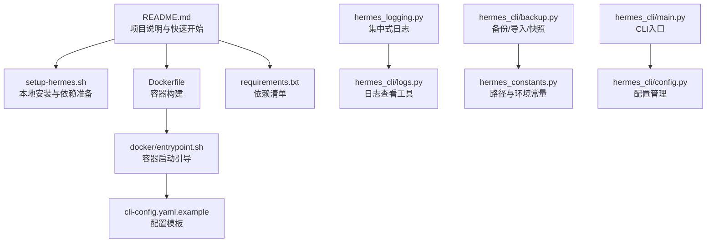
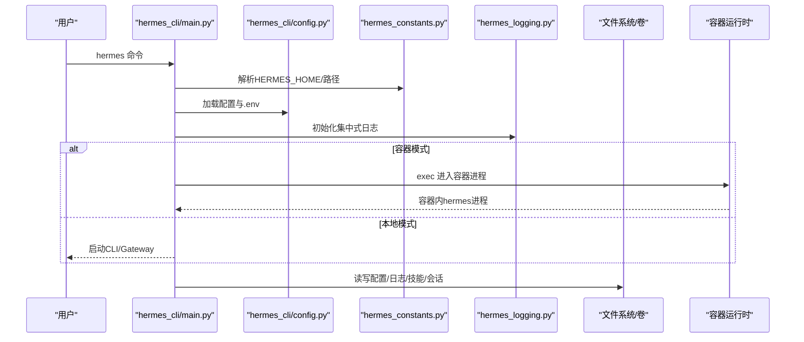
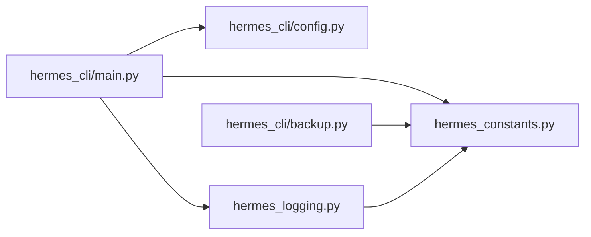

# 部署运维

<cite>
**本文引用的文件**
- [README.md](file://README.md)
- [Dockerfile](file://Dockerfile)
- [docker/entrypoint.sh](file://docker/entrypoint.sh)
- [docker/SOUL.md](file://docker/SOUL.md)
- [requirements.txt](file://requirements.txt)
- [setup-hermes.sh](file://setup-hermes.sh)
- [cli-config.yaml.example](file://cli-config.yaml.example)
- [hermes_logging.py](file://hermes_logging.py)
- [hermes_cli/logs.py](file://hermes_cli/logs.py)
- [hermes_cli/backup.py](file://hermes_cli/backup.py)
- [hermes_constants.py](file://hermes_constants.py)
- [hermes_cli/main.py](file://hermes_cli/main.py)
- [hermes_cli/config.py](file://hermes_cli/config.py)
</cite>

## 目录
1. [简介](#简介)
2. [项目结构](#项目结构)
3. [核心组件](#核心组件)
4. [架构总览](#架构总览)
5. [详细组件分析](#详细组件分析)
6. [依赖关系分析](#依赖关系分析)
7. [性能考虑](#性能考虑)
8. [故障排除指南](#故障排除指南)
9. [结论](#结论)
10. [附录](#附录)

## 简介
本文件面向Hermes Agent的部署与运维，覆盖本地部署、容器化部署、云平台策略与最佳实践、监控与日志管理、故障排除、备份恢复与数据迁移、安全配置与访问控制、性能优化与资源调优、维护更新与版本管理等主题。内容基于仓库中的安装脚本、Docker配置、日志与备份模块、配置示例与常量定义进行系统化整理，帮助用户在不同环境中稳定运行Hermes Agent。

## 项目结构
Hermes Agent采用模块化设计，CLI入口统一调度各子功能；Docker镜像提供容器化运行时；日志与备份模块分别负责可观测性与数据保护；配置系统支持多平台、多后端与多提供商选择。下图展示与部署运维相关的关键文件与职责映射：

图表来源
- [README.md](file://README.md)
- [setup-hermes.sh](file://setup-hermes.sh)
- [Dockerfile](file://Dockerfile)
- [docker/entrypoint.sh](file://docker/entrypoint.sh)
- [cli-config.yaml.example](file://cli-config.yaml.example)
- [requirements.txt](file://requirements.txt)
- [hermes_logging.py](file://hermes_logging.py)
- [hermes_cli/logs.py](file://hermes_cli/logs.py)
- [hermes_cli/backup.py](file://hermes_cli/backup.py)
- [hermes_constants.py](file://hermes_constants.py)
- [hermes_cli/main.py](file://hermes_cli/main.py)
- [hermes_cli/config.py](file://hermes_cli/config.py)

章节来源
- [README.md](file://README.md)
- [setup-hermes.sh](file://setup-hermes.sh)
- [Dockerfile](file://Dockerfile)
- [docker/entrypoint.sh](file://docker/entrypoint.sh)
- [cli-config.yaml.example](file://cli-config.yaml.example)
- [requirements.txt](file://requirements.txt)
- [hermes_logging.py](file://hermes_logging.py)
- [hermes_cli/logs.py](file://hermes_cli/logs.py)
- [hermes_cli/backup.py](file://hermes_cli/backup.py)
- [hermes_constants.py](file://hermes_constants.py)
- [hermes_cli/main.py](file://hermes_cli/main.py)
- [hermes_cli/config.py](file://hermes_cli/config.py)

## 核心组件
- 安装与初始化：通过安装脚本自动检测平台、创建虚拟环境、安装依赖、生成命令软链接，并可选执行交互式setup向导。
- 容器化运行：Dockerfile定义基础镜像、非root用户、系统依赖与Python/Node依赖安装；entrypoint负责将宿主卷挂载到/opt/data并预置必要配置与技能。
- 日志体系：集中式日志初始化、按级别与组件分流、轮转与脱敏格式化、支持实时跟踪与过滤。
- 备份与恢复：完整归档打包、SQLite安全复制、导入校验与覆盖、快速状态快照与清理。
- 配置与环境：统一读取HERMES_HOME，兼容NixOS/容器场景，提供默认目录权限与安全策略。
- CLI入口：统一命令入口，加载.env与配置，早期应用网络偏好（如强制IPv4），并提供容器模式路由。

章节来源
- [setup-hermes.sh](file://setup-hermes.sh)
- [Dockerfile](file://Dockerfile)
- [docker/entrypoint.sh](file://docker/entrypoint.sh)
- [hermes_logging.py](file://hermes_logging.py)
- [hermes_cli/logs.py](file://hermes_cli/logs.py)
- [hermes_cli/backup.py](file://hermes_cli/backup.py)
- [hermes_constants.py](file://hermes_constants.py)
- [hermes_cli/main.py](file://hermes_cli/main.py)
- [hermes_cli/config.py](file://hermes_cli/config.py)

## 架构总览
下图展示从用户命令到容器或本地运行的整体流程，以及日志与备份在运维中的位置：

图表来源
- [hermes_cli/main.py](file://hermes_cli/main.py)
- [hermes_cli/config.py](file://hermes_cli/config.py)
- [hermes_constants.py](file://hermes_constants.py)
- [hermes_logging.py](file://hermes_logging.py)

章节来源
- [hermes_cli/main.py](file://hermes_cli/main.py)
- [hermes_cli/config.py](file://hermes_cli/config.py)
- [hermes_constants.py](file://hermes_constants.py)
- [hermes_logging.py](file://hermes_logging.py)

## 详细组件分析

### 本地部署指南
- 平台检测与依赖安装
  - 自动识别桌面/服务器或Android/Termux环境，使用uv或标准库venv创建Python 3.11虚拟环境。
  - 在Termux环境下使用受限的“termux”包集，其他平台优先使用uv.lock进行哈希校验安装。
- 依赖与可选工具
  - 使用requirements.txt作为便捷参考；生产安装推荐使用pip安装“.[all]”扩展。
  - 可选安装ripgrep以提升文件搜索性能。
- 环境与命令
  - 生成.env与config.yaml示例，创建~/.local/bin/hermes软链接，自动追加PATH（非Termux）。
  - 支持直接运行setup向导完成模型、工具、平台等配置。
- 安全与权限
  - 默认对~/.hermes及其子目录设置严格权限（0700），在NixOS/容器中采用更宽松策略以满足共享与持久化需求。

章节来源
- [setup-hermes.sh](file://setup-hermes.sh)
- [requirements.txt](file://requirements.txt)
- [hermes_cli/config.py](file://hermes_cli/config.py)

### 容器化部署方法
- 镜像构建
  - 基于Debian 13.4，禁用Python缓冲、设置Playwright浏览器缓存路径、安装编译工具、Node/npm、Python依赖。
  - 使用非root用户hermes（UID/GID可由HERMES_UID/HERMES_GID覆盖），确保卷权限一致。
- 启动引导
  - entrypoint.sh负责：
    - 若以root启动，尝试将hermes用户UID/GID与宿主机匹配并修复卷权限，随后以gosu降权执行。
    - 创建必要的子目录（cron、sessions、logs、memories、skills、skins、plans、workspace、home）。
    - 将示例.env与cli-config.yaml复制到卷中（若不存在），并将docker/SOUL.md同步至卷。
    - 调用skills_sync.py同步内置技能，最后执行hermes命令。
- 卷与环境
  - 挂载点为/opt/data，可通过HERMES_HOME覆盖；PLAYWRIGHT_BROWSERS_PATH设为持久化目录。
  - 支持通过环境变量传递UID/GID，便于与宿主机用户映射。

章节来源
- [Dockerfile](file://Dockerfile)
- [docker/entrypoint.sh](file://docker/entrypoint.sh)
- [docker/SOUL.md](file://docker/SOUL.md)

### 云平台部署策略与最佳实践
- 终端后端选择
  - 支持local、ssh、docker、singularity、modal、daytona等多种后端，按需隔离与扩展计算资源。
  - 容器类后端可配置CPU/内存/磁盘配额与持久化策略，避免无界消耗。
- 网络与连通性
  - 提供强制IPv4选项以规避部分服务器IPv6不可达导致的超时问题。
- 平台集成
  - 通过平台工具集（platform_toolsets）为不同消息平台（Telegram、Discord、Slack、WhatsApp、Signal、Home Assistant等）定制能力集合。
- 服务化与守护
  - CLI提供gateway安装/启动/停止/状态管理，适合在云主机上长期运行。

章节来源
- [cli-config.yaml.example](file://cli-config.yaml.example)
- [hermes_constants.py](file://hermes_constants.py)
- [hermes_cli/main.py](file://hermes_cli/main.py)

### 监控与日志管理
- 日志初始化
  - 集中式setup_logging，创建agent.log（INFO+）、errors.log（WARNING+），在gateway模式下额外输出gateway.log（组件级过滤）。
  - 使用轮转处理器与脱敏格式化器，抑制第三方噪声日志。
- 实时与历史
  - hermes logs支持尾随查看、按级别/会话/组件/时间范围过滤、相对时间窗口查询。
- 会话关联
  - 通过线程本地存储注入会话上下文标签，便于跨组件关联排查。

章节来源
- [hermes_logging.py](file://hermes_logging.py)
- [hermes_cli/logs.py](file://hermes_cli/logs.py)

### 故障排除指南
- 常见问题定位
  - 使用hermes logs快速定位错误日志，结合--level/--session/--component/--since筛选。
  - 检查日志文件是否存在、权限是否正确、是否被容器/托管模式限制。
- 容器模式
  - 若容器无法被非root用户发现，entrypoint会提示通过sudo或调整权限；必要时使用HERMES_SKIP_CHMOD跳过权限修正。
- 网络问题
  - 在IPv6受限环境中启用force_ipv4，避免DNS解析卡顿导致的超时。
- 权限与目录
  - 确认~/.hermes及子目录权限；在NixOS/容器中遵循组共享策略。

章节来源
- [hermes_cli/logs.py](file://hermes_cli/logs.py)
- [hermes_cli/main.py](file://hermes_cli/main.py)
- [hermes_constants.py](file://hermes_constants.py)

### 备份恢复策略与数据迁移
- 全量备份
  - hermes backup创建压缩归档，自动排除缓存、Git元数据、临时文件等；对SQLite数据库使用备份API保证一致性。
- 导入恢复
  - hermes import验证zip结构、检测前缀、执行覆盖导入；对存在冲突的现有配置给出确认提示。
- 快速快照
  - state-snapshots保存关键状态文件（state.db、config.yaml、.env、auth.json、定时任务、网关状态等），支持自动清理与恢复。
- 数据迁移
  - README提供从OpenClaw迁移的步骤与选项，支持干跑预览与覆盖策略。

章节来源
- [hermes_cli/backup.py](file://hermes_cli/backup.py)
- [README.md](file://README.md)

### 安全配置与访问控制
- 访问控制
  - 平台侧支持白名单/允许用户/频道策略（如Telegram、Discord、Slack、WhatsApp、Signal、Home Assistant等）。
  - 审批模式（manual/smart/off）与危险命令允许列表（command_allowlist）用于控制高风险操作。
- 凭据与密钥
  - 所有凭据存储在~/.hermes/.env中，默认0600权限；在容器/NixOS中采用更宽松策略以便共享。
- 网络与隐私
  - 强制IPv4、PII脱敏、可选预执行安全扫描（tirith）与网站黑名单。
- 会话与沙箱
  - 终端后端支持容器/SSH隔离；sudo密码可通过环境注入但不建议明文存储。

章节来源
- [cli-config.yaml.example](file://cli-config.yaml.example)
- [hermes_cli/config.py](file://hermes_cli/config.py)
- [hermes_constants.py](file://hermes_constants.py)

### 性能优化与资源调优
- 上下文压缩
  - 自动触发阈值与近期尾部保留比例可调，减少长对话开销。
- 辅助模型
  - 视觉分析、网页提取、上下文压缩等辅助任务可指定低成本Provider/模型，降低主模型负载。
- 终端后端资源
  - 容器后端CPU/内存/磁盘配额与持久化开关，避免资源滥用。
- 日志轮转
  - 控制单文件大小与备份数量，平衡磁盘占用与历史保留。

章节来源
- [cli-config.yaml.example](file://cli-config.yaml.example)
- [hermes_logging.py](file://hermes_logging.py)

### 维护更新与版本管理
- 更新方式
  - 包管理器托管（NixOS/Homebrew）与普通更新命令并行；托管模式下通过包管理器升级。
- 配置迁移
  - 配置系统带版本号与增量环境变量提示，迁移时仅提示新增字段。
- 版本信息
  - CLI入口包含版本与发布日期信息，便于审计与回溯。

章节来源
- [hermes_cli/config.py](file://hermes_cli/config.py)
- [hermes_cli/main.py](file://hermes_cli/main.py)

## 依赖关系分析
- CLI入口依赖配置与常量模块，早期加载.env与网络偏好。
- 日志模块依赖配置读取与脱敏格式化器，按组件分流。
- 备份模块依赖常量中的路径解析与SQLite备份API。
- 容器入口依赖常量中的容器检测与路径解析。

图表来源
- [hermes_cli/main.py](file://hermes_cli/main.py)
- [hermes_cli/config.py](file://hermes_cli/config.py)
- [hermes_constants.py](file://hermes_constants.py)
- [hermes_logging.py](file://hermes_logging.py)
- [hermes_cli/backup.py](file://hermes_cli/backup.py)

章节来源
- [hermes_cli/main.py](file://hermes_cli/main.py)
- [hermes_cli/config.py](file://hermes_cli/config.py)
- [hermes_constants.py](file://hermes_constants.py)
- [hermes_logging.py](file://hermes_logging.py)
- [hermes_cli/backup.py](file://hermes_cli/backup.py)

## 性能考虑
- 日志轮转与脱敏：避免大文件与敏感信息泄露，减少IO与合规风险。
- 上下文压缩：在接近模型上下文上限时自动摘要，降低延迟与成本。
- 辅助模型：将视觉/摘要等任务交给轻量Provider，减轻主模型压力。
- 容器资源：合理设置CPU/内存/磁盘，避免饥饿与抖动。
- IPv4强制：在网络环境不稳定时显著改善连接时延。

## 故障排除指南
- 日志查看
  - 使用hermes logs查看最近日志，结合--level/--component/--since快速定位。
- 权限问题
  - 确认~/.hermes目录权限；容器/NixOS场景下遵循组共享策略。
- 容器可见性
  - 非root用户无法看到root运行的容器时，按提示使用sudo或调整权限。
- 网络超时
  - 在IPv6受限环境启用force_ipv4，或检查DNS解析与代理设置。

章节来源
- [hermes_cli/logs.py](file://hermes_cli/logs.py)
- [hermes_cli/main.py](file://hermes_cli/main.py)
- [hermes_constants.py](file://hermes_constants.py)

## 结论
通过统一的安装脚本、标准化的Docker镜像、完善的日志与备份机制、灵活的配置与平台工具集，Hermes Agent能够在本地与容器环境中稳定运行，并在云平台上实现弹性扩展与安全治理。建议在生产中启用强制IPv4、严格的权限策略、定期备份与快照、以及基于组件的日志过滤，以获得更好的可观测性与可维护性。

## 附录
- 快速命令参考
  - hermes setup：交互式配置
  - hermes gateway install/start/stop/status：网关服务管理
  - hermes logs [-f] [--level/--session/--component/--since]：日志查看
  - hermes backup [--quick]：备份/快速快照
  - hermes import：从备份恢复
  - hermes doctor：诊断配置与依赖
- 关键环境变量
  - HERMES_HOME：Hermes根目录
  - HERMES_UID/HERMES_GID：容器内用户映射
  - HERMES_MANAGED：托管模式标识
  - HERMES_SKIP_CHMOD/HERMES_HOME_MODE：权限策略控制
  - network.force_ipv4：网络偏好

章节来源
- [README.md](file://README.md)
- [hermes_cli/main.py](file://hermes_cli/main.py)
- [hermes_cli/logs.py](file://hermes_cli/logs.py)
- [hermes_cli/backup.py](file://hermes_cli/backup.py)
- [hermes_constants.py](file://hermes_constants.py)
- [cli-config.yaml.example](file://cli-config.yaml.example)