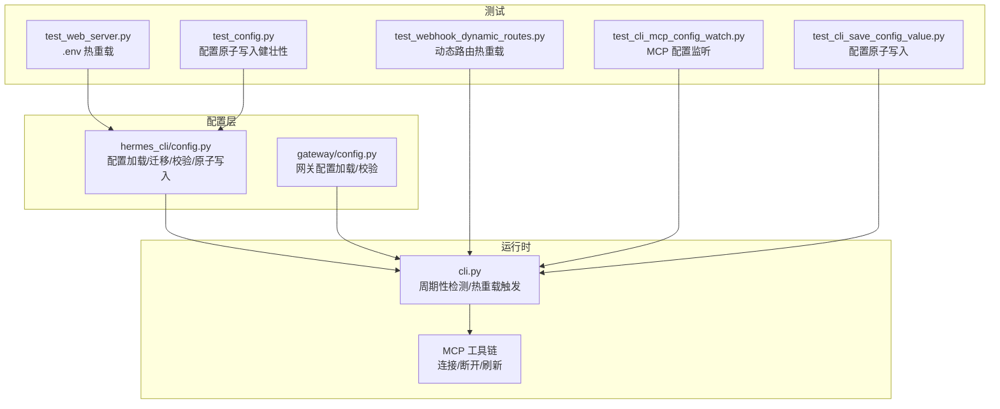
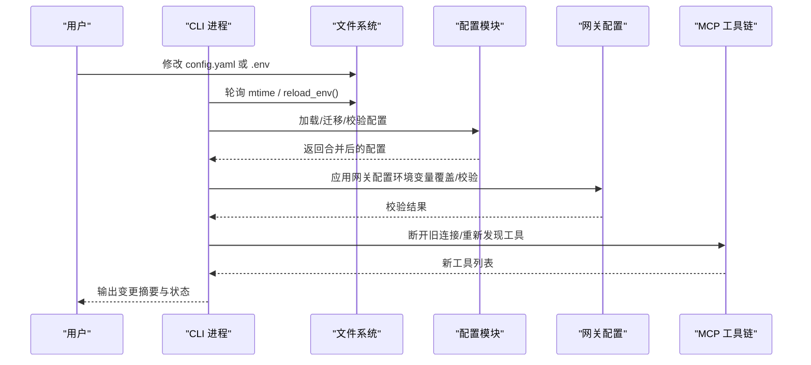
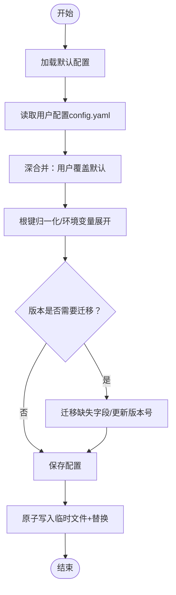
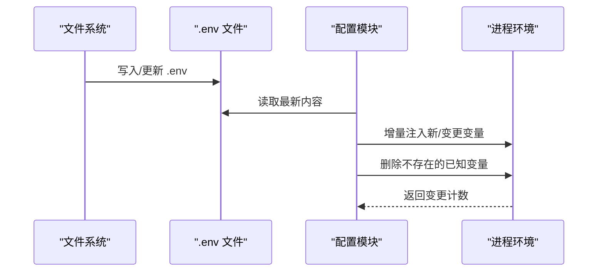
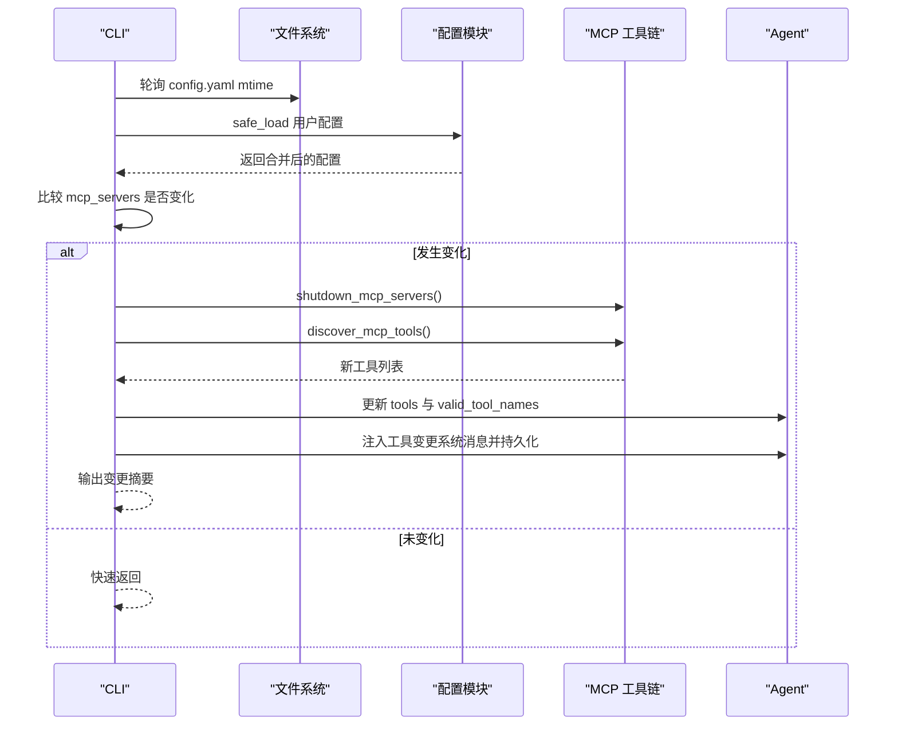
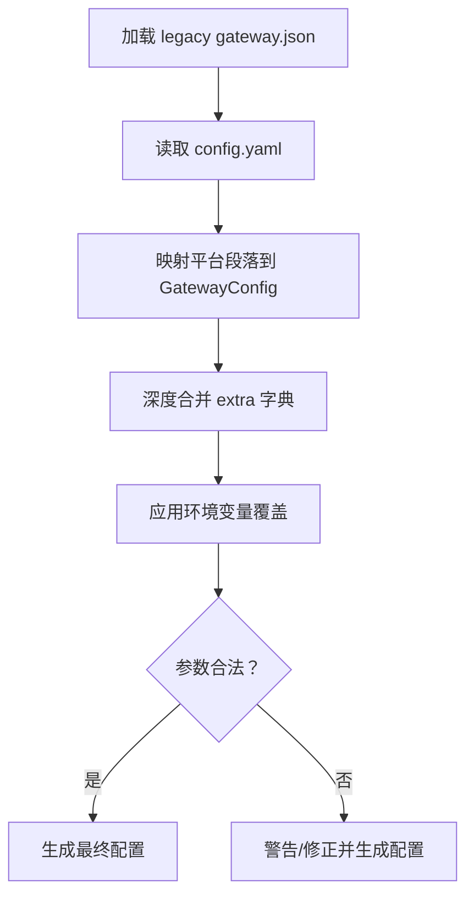
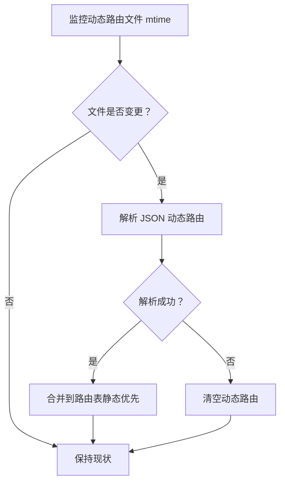
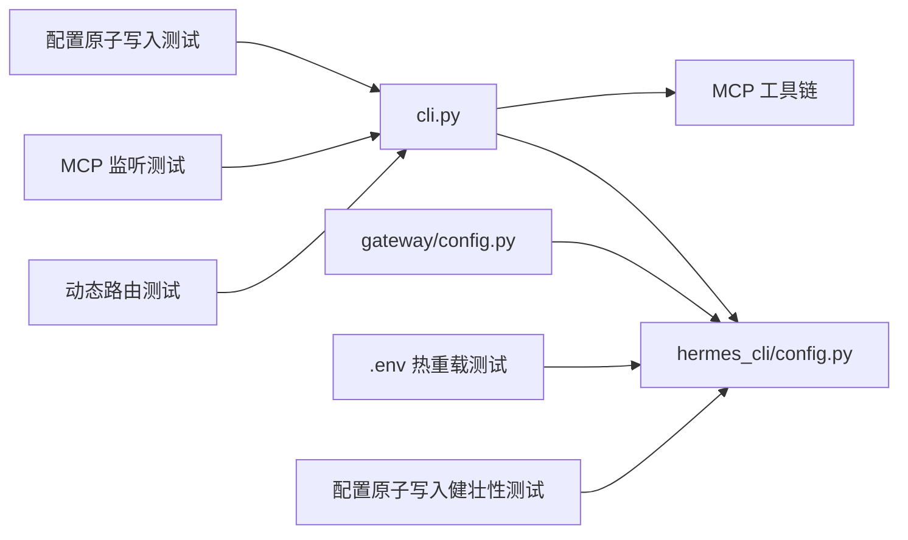

# 动态配置更新

<cite>
**本文引用的文件**
- [cli.py](file://cli.py)
- [hermes_cli/config.py](file://hermes_cli/config.py)
- [gateway/config.py](file://gateway/config.py)
- [tests/gateway/test_webhook_dynamic_routes.py](file://tests/gateway/test_webhook_dynamic_routes.py)
- [tests/cli/test_cli_mcp_config_watch.py](file://tests/cli/test_cli_mcp_config_watch.py)
- [tests/hermes_cli/test_web_server.py](file://tests/hermes_cli/test_web_server.py)
- [tests/cli/test_cli_save_config_value.py](file://tests/cli/test_cli_save_config_value.py)
- [tests/hermes_cli/test_config.py](file://tests/hermes_cli/test_config.py)
</cite>

## 目录
1. [简介](#简介)
2. [项目结构](#项目结构)
3. [核心组件](#核心组件)
4. [架构总览](#架构总览)
5. [详细组件分析](#详细组件分析)
6. [依赖分析](#依赖分析)
7. [性能考虑](#性能考虑)
8. [故障排除指南](#故障排除指南)
9. [结论](#结论)
10. [附录](#附录)

## 简介
本文件系统性阐述 Hermes Agent 的“动态配置更新”机制，重点覆盖以下方面：
- 运行时配置修改的实现原理与工作机制
- 配置热重载的触发条件与更新流程
- 配置验证与错误处理机制
- 配置更新的 API 接口与命令行工具使用方法
- 配置变更对正在运行服务的影响与重启要求
- 配置缓存与同步机制
- 最佳实践与故障排除指南

## 项目结构
围绕动态配置更新的相关模块与测试分布如下：
- hermes_cli/config.py：配置加载、迁移、校验、环境变量重载、原子写入等核心逻辑
- cli.py：CLI 中周期性检测配置变化并触发 MCP 工具链热重载
- gateway/config.py：网关配置加载与校验，支持从 config.yaml 合并平台配置
- 测试用例：覆盖动态路由热重载、MCP 配置监听、.env 热重载、配置原子写入等场景

图表来源
- [hermes_cli/config.py](file://hermes_cli/config.py)
- [cli.py](file://cli.py)
- [gateway/config.py](file://gateway/config.py)
- [tests/gateway/test_webhook_dynamic_routes.py](file://tests/gateway/test_webhook_dynamic_routes.py)
- [tests/cli/test_cli_mcp_config_watch.py](file://tests/cli/test_cli_mcp_config_watch.py)
- [tests/hermes_cli/test_web_server.py](file://tests/hermes_cli/test_web_server.py)
- [tests/cli/test_cli_save_config_value.py](file://tests/cli/test_cli_save_config_value.py)
- [tests/hermes_cli/test_config.py](file://tests/hermes_cli/test_config.py)

章节来源
- [hermes_cli/config.py](file://hermes_cli/config.py)
- [cli.py](file://cli.py)
- [gateway/config.py](file://gateway/config.py)
- [tests/gateway/test_webhook_dynamic_routes.py](file://tests/gateway/test_webhook_dynamic_routes.py)
- [tests/cli/test_cli_mcp_config_watch.py](file://tests/cli/test_cli_mcp_config_watch.py)
- [tests/hermes_cli/test_web_server.py](file://tests/hermes_cli/test_web_server.py)
- [tests/cli/test_cli_save_config_value.py](file://tests/cli/test_cli_save_config_value.py)
- [tests/hermes_cli/test_config.py](file://tests/hermes_cli/test_config.py)

## 核心组件
- 配置加载与迁移
  - 默认配置与深合并策略，确保用户配置覆盖默认值且保留嵌套默认项
  - 环境变量展开与根键归一化（如 provider/base_url 归并到 model 下）
  - 配置版本检查与增量迁移，自动补齐缺失字段并更新版本号
- 环境变量热重载
  - .env 文件变更检测与增量更新，支持新增、更新、删除已知变量
- MCP 工具链热重载
  - 周期性轮询 config.yaml 的 mtime 与 mcp_servers 段落，检测变化后断开旧连接、重新发现工具并刷新 agent 工具列表
- 网关配置加载与校验
  - 支持从 config.yaml 合并平台配置，同时应用环境变量覆盖与参数校验
- 动态路由热重载
  - 基于文件 mtime 的动态路由热重载，支持新增、替换、移除与异常容错

章节来源
- [hermes_cli/config.py](file://hermes_cli/config.py)
- [cli.py](file://cli.py)
- [gateway/config.py](file://gateway/config.py)
- [tests/gateway/test_webhook_dynamic_routes.py](file://tests/gateway/test_webhook_dynamic_routes.py)

## 架构总览
动态配置更新由“检测—校验—应用—通知”闭环构成：
- 检测：CLI 定时轮询 config.yaml；.env 变更通过 reload_env 触发
- 校验：配置迁移与字段校验，网关配置参数合法性检查
- 应用：原子写入配置文件；断开/重连 MCP；刷新会话工具列表；更新运行时参数
- 通知：向用户输出变更摘要与状态

图表来源
- [cli.py](file://cli.py)
- [hermes_cli/config.py](file://hermes_cli/config.py)
- [gateway/config.py](file://gateway/config.py)

## 详细组件分析

### 配置加载与迁移（含原子写入）
- 默认配置与深合并
  - 使用深合并策略将用户配置覆盖默认配置，保留嵌套默认项，避免误删
- 环境变量展开
  - 对字符串中的 ${VAR} 引用进行展开，未解析的引用保持原样以便上层检测
- 根键归一化
  - 将旧版根级 provider/base_url 迁移到 model 子树，清理冗余键
- 配置版本管理
  - 版本号递增时自动补齐缺失字段并保存
- 原子写入
  - 写入采用临时文件 + 替换策略，失败不破坏原文件；CLI 写单个键也走相同路径

图表来源
- [hermes_cli/config.py](file://hermes_cli/config.py)
- [tests/cli/test_cli_save_config_value.py](file://tests/cli/test_cli_save_config_value.py)
- [tests/hermes_cli/test_config.py](file://tests/hermes_cli/test_config.py)

章节来源
- [hermes_cli/config.py](file://hermes_cli/config.py)
- [tests/cli/test_cli_save_config_value.py](file://tests/cli/test_cli_save_config_value.py)
- [tests/hermes_cli/test_config.py](file://tests/hermes_cli/test_config.py)

### 环境变量热重载（.env）
- 变更检测
  - 通过 reload_env 将 .env 中的新变量、变更值增量注入到 os.environ，删除不存在的已知变量
- 容错与一致性
  - 失败不影响现有环境变量，确保运行时稳定

图表来源
- [tests/hermes_cli/test_web_server.py](file://tests/hermes_cli/test_web_server.py)
- [cli.py](file://cli.py)

章节来源
- [tests/hermes_cli/test_web_server.py](file://tests/hermes_cli/test_web_server.py)
- [cli.py](file://cli.py)

### MCP 工具链热重载
- 触发条件
  - CLI 周期性轮询 config.yaml 的 mtime，若变更则读取 mcp_servers 段落对比上次状态，有差异即触发热重载
- 执行流程
  - 断开所有现有 MCP 连接
  - 重新读取 config.yaml 并发现工具
  - 计算新增/移除/重连服务器集合，输出摘要
  - 刷新 agent 的工具定义与名称集合
  - 在会话历史末尾注入系统消息提示工具变更，并持久化会话
- 超时保护
  - 热重载在独立线程中执行，超时（默认 30 秒）后提示部分服务器可能未重连

图表来源
- [cli.py](file://cli.py)

章节来源
- [cli.py](file://cli.py)
- [tests/cli/test_cli_mcp_config_watch.py](file://tests/cli/test_cli_mcp_config_watch.py)

### 网关配置加载与校验
- 数据源优先级
  - 环境变量 > config.yaml > legacy gateway.json > 内置默认
- 平台配置桥接
  - 将 config.yaml 中各平台段落（如 telegram/discord/slack 等）映射到 GatewayConfig 结构，并深度合并 extra 字典以保留遗留默认
- 环境变量覆盖
  - 将部分平台配置映射为对应环境变量，实现运行时覆盖
- 参数校验
  - 对关键字段（如 at_hour/idle_minutes）进行范围校验与默认回退
  - 对空令牌进行告警或禁用平台适配器

图表来源
- [gateway/config.py](file://gateway/config.py)

章节来源
- [gateway/config.py](file://gateway/config.py)

### 动态路由热重载（Webhook 示例）
- 触发条件
  - 监控动态路由文件的 mtime，若文件被更新则重新加载；若文件被删除则清空动态路由
- 行为保证
  - 静态路由优先级高于动态路由
  - 解析失败时保留静态路由并清空动态路由，避免污染

图表来源
- [tests/gateway/test_webhook_dynamic_routes.py](file://tests/gateway/test_webhook_dynamic_routes.py)

章节来源
- [tests/gateway/test_webhook_dynamic_routes.py](file://tests/gateway/test_webhook_dynamic_routes.py)

## 依赖分析
- 组件耦合
  - CLI 依赖配置模块进行配置读取与迁移，依赖 MCP 工具链进行连接管理
  - 网关配置模块依赖配置模块提供的路径与加载函数，并与环境变量交互
- 外部依赖
  - 文件系统（mtime 检测）、YAML/JSON 解析、线程池（MCP 热重载超时控制）

图表来源
- [cli.py](file://cli.py)
- [hermes_cli/config.py](file://hermes_cli/config.py)
- [gateway/config.py](file://gateway/config.py)
- [tests/gateway/test_webhook_dynamic_routes.py](file://tests/gateway/test_webhook_dynamic_routes.py)
- [tests/cli/test_cli_mcp_config_watch.py](file://tests/cli/test_cli_mcp_config_watch.py)
- [tests/hermes_cli/test_web_server.py](file://tests/hermes_cli/test_web_server.py)
- [tests/cli/test_cli_save_config_value.py](file://tests/cli/test_cli_save_config_value.py)
- [tests/hermes_cli/test_config.py](file://tests/hermes_cli/test_config.py)

章节来源
- [cli.py](file://cli.py)
- [hermes_cli/config.py](file://hermes_cli/config.py)
- [gateway/config.py](file://gateway/config.py)
- [tests/gateway/test_webhook_dynamic_routes.py](file://tests/gateway/test_webhook_dynamic_routes.py)
- [tests/cli/test_cli_mcp_config_watch.py](file://tests/cli/test_cli_mcp_config_watch.py)
- [tests/hermes_cli/test_web_server.py](file://tests/hermes_cli/test_web_server.py)
- [tests/cli/test_cli_save_config_value.py](file://tests/cli/test_cli_save_config_value.py)
- [tests/hermes_cli/test_config.py](file://tests/hermes_cli/test_config.py)

## 性能考虑
- 轮询频率与开销
  - CLI 对 config.yaml 的轮询间隔为固定秒级，避免频繁 IO；仅在 mtime 变化时才进行解析与比较
- 热重载超时
  - MCP 热重载在独立线程中执行并设置超时，防止阻塞主循环
- 原子写入
  - 配置写入采用临时文件 + 替换策略，避免部分写入导致的数据损坏，降低崩溃风险

## 故障排除指南
- 配置写入失败
  - 现象：写入抛出异常，原文件保持不变
  - 排查：检查磁盘空间、权限、文件锁定；确认未被其他进程占用
  - 参考测试：配置原子写入健壮性测试
- MCP 热重载超时
  - 现象：提示“MCP 重载超时（30s）”，部分服务器未重连
  - 排查：检查目标 MCP 服务器可达性、网络延迟、认证信息；缩短轮询间隔或提升超时阈值
- .env 变更未生效
  - 现象：修改 .env 后未更新到进程环境
  - 排查：确认调用了 .env 热重载流程；检查变量名是否在已知集合内；确认文件语法正确
- 动态路由异常
  - 现象：动态路由文件解析失败，静态路由仍可用
  - 排查：检查 JSON 语法；确认文件存在且可读；确认 mtime 变化被检测到

章节来源
- [tests/hermes_cli/test_config.py](file://tests/hermes_cli/test_config.py)
- [cli.py](file://cli.py)
- [tests/hermes_cli/test_web_server.py](file://tests/hermes_cli/test_web_server.py)
- [tests/gateway/test_webhook_dynamic_routes.py](file://tests/gateway/test_webhook_dynamic_routes.py)

## 结论
Hermes Agent 的动态配置更新以“最小侵入、高可靠”为目标：
- 通过原子写入与深合并策略保障配置安全与兼容
- 通过 mtime 检测与线程化热重载实现 MCP 工具链的平滑切换
- 通过环境变量覆盖与参数校验增强运行时灵活性与稳定性
- 通过完善的测试覆盖确保关键路径的正确性与鲁棒性

## 附录

### 配置更新 API 与命令行工具
- hermes config
  - 显示当前配置、打开编辑器、设置单项值、检查缺失项、迁移至最新版本、显示路径
- hermes config set <key> <value>
  - 设置指定配置项，内部使用原子写入
- hermes config migrate
  - 自动补齐缺失配置项并更新版本号
- hermes config check
  - 检查缺失的必填/可选环境变量与新配置项
- CLI 内部命令
  - /reload：触发 .env 热重载
  - /reload-mcp：手动触发 MCP 工具链热重载

章节来源
- [hermes_cli/config.py](file://hermes_cli/config.py)
- [cli.py](file://cli.py)