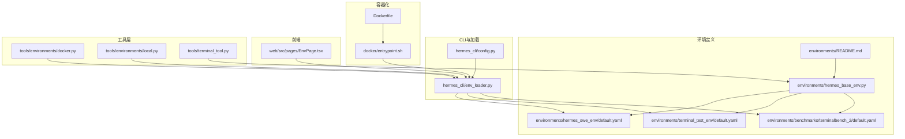
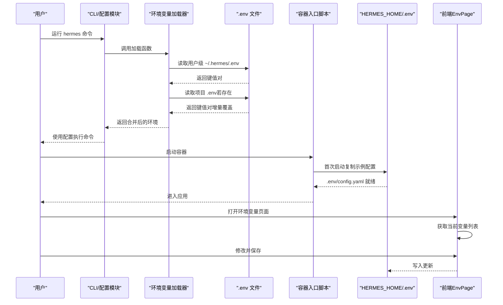
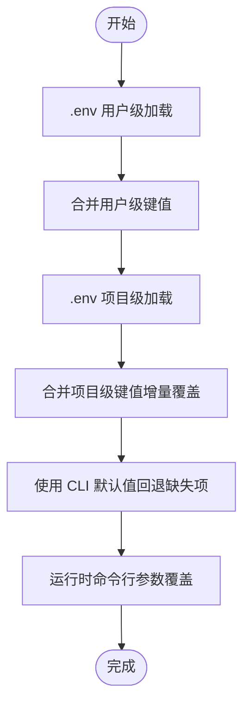
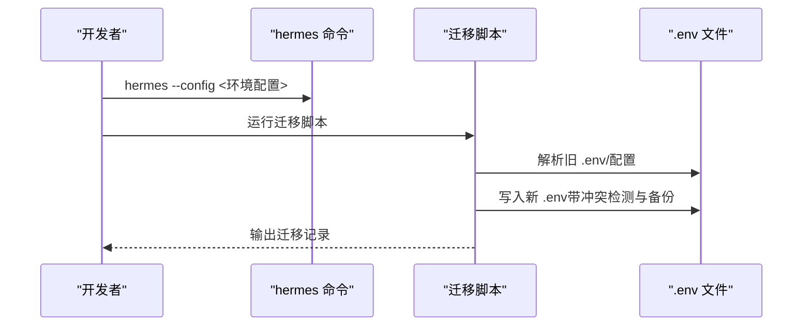
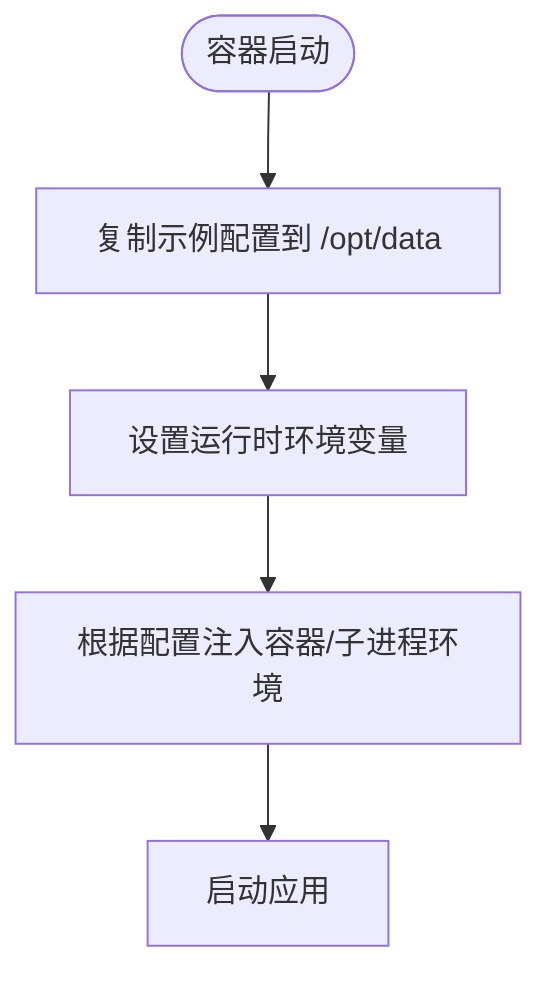
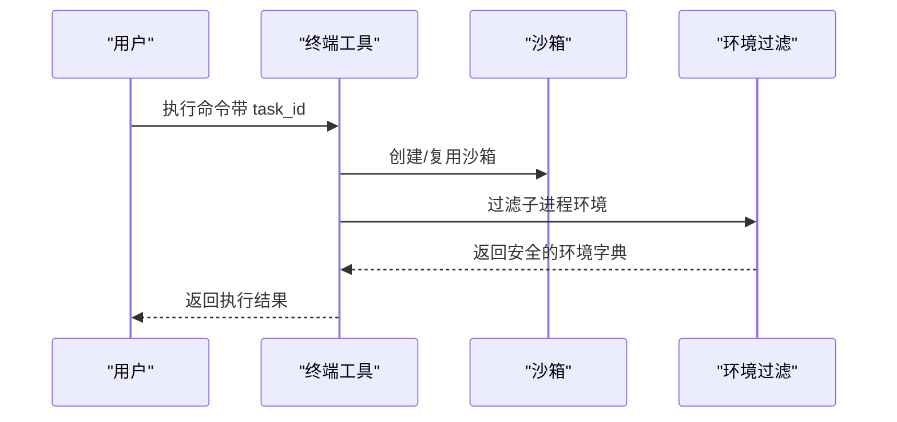
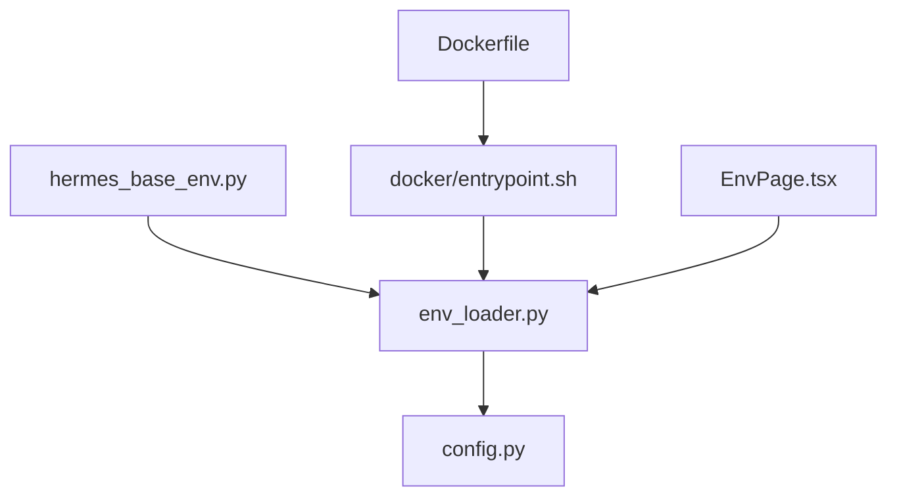

# 多环境配置

<cite>
**本文引用的文件**
- [environments/README.md](file://environments/README.md)
- [environments/hermes_base_env.py](file://environments/hermes_base_env.py)
- [environments/hermes_swe_env/default.yaml](file://environments/hermes_swe_env/default.yaml)
- [environments/terminal_test_env/default.yaml](file://environments/terminal_test_env/default.yaml)
- [environments/benchmarks/terminalbench_2/default.yaml](file://environments/benchmarks/terminalbench_2/default.yaml)
- [hermes_cli/env_loader.py](file://hermes_cli/env_loader.py)
- [hermes_cli/config.py](file://hermes_cli/config.py)
- [Dockerfile](file://Dockerfile)
- [docker/entrypoint.sh](file://docker/entrypoint.sh)
- [web/src/pages/EnvPage.tsx](file://web/src/pages/EnvPage.tsx)
- [tools/environments/docker.py](file://tools/environments/docker.py)
- [tools/environments/local.py](file://tools/environments/local.py)
- [tools/terminal_tool.py](file://tools/terminal_tool.py)
- [optional-skills/migration/openclaw-migration/scripts/openclaw_to_hermes.py](file://optional-skills/migration/openclaw-migration/scripts/openclaw_to_hermes.py)
</cite>

## 目录
1. [简介](#简介)
2. [项目结构](#项目结构)
3. [核心组件](#核心组件)
4. [架构总览](#架构总览)
5. [详细组件分析](#详细组件分析)
6. [依赖关系分析](#依赖关系分析)
7. [性能考量](#性能考量)
8. [故障排查指南](#故障排查指南)
9. [结论](#结论)
10. [附录](#附录)

## 简介
本文件系统性阐述 Hermes Agent 的多环境配置体系，覆盖开发、测试与生产的配置管理策略；解释环境配置的继承与覆盖机制；给出环境特定配置文件的组织结构与命名约定；说明环境切换与配置导入导出方法；总结 CI/CD 中的最佳实践；解释容器化环境中的配置注入与管理方式；并提供多租户场景下的配置隔离与权限控制方案。

## 项目结构
围绕“多环境配置”的关键目录与文件包括：
- environments：Atropos 集成环境与具体环境配置（SWE、终端测试、基准评估等）
- hermes_cli：用户级配置与环境变量加载器
- Dockerfile 与 docker/entrypoint.sh：容器化环境的配置注入与初始化
- web：前端页面用于查看与编辑环境变量
- tools/environments：终端后端与容器环境变量注入逻辑
- optional-skills/migration：从旧系统迁移时的环境变量处理

**图表来源**
- [environments/README.md](file://environments/README.md)
- [environments/hermes_base_env.py](file://environments/hermes_base_env.py)
- [environments/hermes_swe_env/default.yaml](file://environments/hermes_swe_env/default.yaml)
- [environments/terminal_test_env/default.yaml](file://environments/terminal_test_env/default.yaml)
- [environments/benchmarks/terminalbench_2/default.yaml](file://environments/benchmarks/terminalbench_2/default.yaml)
- [hermes_cli/config.py](file://hermes_cli/config.py)
- [hermes_cli/env_loader.py](file://hermes_cli/env_loader.py)
- [Dockerfile](file://Dockerfile)
- [docker/entrypoint.sh](file://docker/entrypoint.sh)
- [web/src/pages/EnvPage.tsx](file://web/src/pages/EnvPage.tsx)
- [tools/environments/docker.py](file://tools/environments/docker.py)
- [tools/environments/local.py](file://tools/environments/local.py)
- [tools/terminal_tool.py](file://tools/terminal_tool.py)

**章节来源**
- [environments/README.md](file://environments/README.md)
- [environments/hermes_base_env.py](file://environments/hermes_base_env.py)
- [hermes_cli/env_loader.py](file://hermes_cli/env_loader.py)
- [hermes_cli/config.py](file://hermes_cli/config.py)
- [Dockerfile](file://Dockerfile)
- [docker/entrypoint.sh](file://docker/entrypoint.sh)
- [web/src/pages/EnvPage.tsx](file://web/src/pages/EnvPage.tsx)
- [tools/environments/docker.py](file://tools/environments/docker.py)
- [tools/environments/local.py](file://tools/environments/local.py)
- [tools/terminal_tool.py](file://tools/terminal_tool.py)

## 核心组件
- 环境基类与配置模型
  - hermes_base_env 提供统一的环境配置模型与运行模式（Phase 1/2），并负责将配置映射到终端后端与工具池大小等运行参数。
- 环境配置文件
  - 各环境目录下的 default.yaml 定义了工具集、最大轮次、令牌长度、终端后端、分词器、数据集、W&B 配置、系统提示等。
- 用户与项目级环境变量加载
  - env_loader 实现用户家目录 ~/.hermes/.env 优先于项目 .env 的加载策略，并对凭证进行清洗与预处理。
- CLI 配置与默认值
  - config.py 定义了大量默认配置项与版本迁移策略，作为 CLI 层的“单点真相”。
- 容器化配置注入
  - Dockerfile 设置运行时环境变量与工作目录；entrypoint.sh 在首次启动时将示例配置复制到卷挂载的 HERMES_HOME。
- 前端环境变量管理
  - EnvPage.tsx 提供获取与保存环境变量的界面与流程。
- 终端后端与容器环境变量注入
  - tools/environments/docker.py 与 tools/environments/local.py 对子进程环境进行过滤与注入，确保敏感信息不泄露。

**章节来源**
- [environments/hermes_base_env.py](file://environments/hermes_base_env.py)
- [environments/hermes_swe_env/default.yaml](file://environments/hermes_swe_env/default.yaml)
- [environments/terminal_test_env/default.yaml](file://environments/terminal_test_env/default.yaml)
- [environments/benchmarks/terminalbench_2/default.yaml](file://environments/benchmarks/terminalbench_2/default.yaml)
- [hermes_cli/env_loader.py](file://hermes_cli/env_loader.py)
- [hermes_cli/config.py](file://hermes_cli/config.py)
- [Dockerfile](file://Dockerfile)
- [docker/entrypoint.sh](file://docker/entrypoint.sh)
- [web/src/pages/EnvPage.tsx](file://web/src/pages/EnvPage.tsx)
- [tools/environments/docker.py](file://tools/environments/docker.py)
- [tools/environments/local.py](file://tools/environments/local.py)

## 架构总览
下图展示了“配置来源—加载顺序—运行时生效”的整体流程，涵盖用户级 .env、项目 .env、CLI 默认配置、容器注入与前端编辑。

**图表来源**
- [hermes_cli/env_loader.py](file://hermes_cli/env_loader.py)
- [docker/entrypoint.sh](file://docker/entrypoint.sh)
- [web/src/pages/EnvPage.tsx](file://web/src/pages/EnvPage.tsx)

## 详细组件分析

### 环境配置文件组织与命名约定
- 目录结构
  - environments/hermes_swe_env/default.yaml：SWE 训练环境默认配置
  - environments/terminal_test_env/default.yaml：终端测试环境默认配置
  - environments/benchmarks/terminalbench_2/default.yaml：TB2 评估环境默认配置
- 命名约定
  - default.yaml 为各环境的默认配置文件
  - 可按需在命令行通过 --config 指定具体配置路径
- 字段类别
  - env.*：工具集、最大轮次、令牌长度、终端后端、分词器、数据集、W&B 名称、系统提示等
  - openai.*：推理服务类型、基础地址、模型名、健康检查等

**章节来源**
- [environments/hermes_swe_env/default.yaml](file://environments/hermes_swe_env/default.yaml)
- [environments/terminal_test_env/default.yaml](file://environments/terminal_test_env/default.yaml)
- [environments/benchmarks/terminalbench_2/default.yaml](file://environments/benchmarks/terminalbench_2/default.yaml)

### 环境配置继承与覆盖机制
- 用户级优先：~/.hermes/.env 优先于项目 .env 加载，且可覆盖未设置的键
- CLI 默认回退：当 .env 缺失或未设置某键时，使用 hermes_cli/config.py 中的 DEFAULT_CONFIG 回退
- 运行时覆盖：命令行参数可覆盖配置文件中的字段（例如模型名、后端类型等）
- 环境变量注入：容器入口脚本会在首次启动时复制示例配置至卷挂载目录，保证持久化

**图表来源**
- [hermes_cli/env_loader.py](file://hermes_cli/env_loader.py)
- [hermes_cli/config.py](file://hermes_cli/config.py)
- [docker/entrypoint.sh](file://docker/entrypoint.sh)

**章节来源**
- [hermes_cli/env_loader.py](file://hermes_cli/env_loader.py)
- [hermes_cli/config.py](file://hermes_cli/config.py)
- [docker/entrypoint.sh](file://docker/entrypoint.sh)

### 环境切换与配置导入导出
- 切换方式
  - 通过命令行 --config 指向不同 default.yaml 或自定义配置文件
  - 通过命令行参数覆盖配置文件中的字段
- 导入导出
  - openclaw_to_hermes 脚本支持解析与写入 .env 文件，实现从旧系统迁移时的键值合并与备份
  - 前端 EnvPage 支持读取与保存环境变量，便于可视化管理

**图表来源**
- [optional-skills/migration/openclaw-migration/scripts/openclaw_to_hermes.py](file://optional-skills/migration/openclaw-migration/scripts/openclaw_to_hermes.py)

**章节来源**
- [optional-skills/migration/openclaw-migration/scripts/openclaw_to_hermes.py](file://optional-skills/migration/openclaw-migration/scripts/openclaw_to_hermes.py)
- [web/src/pages/EnvPage.tsx](file://web/src/pages/EnvPage.tsx)

### CI/CD 环境中的配置管理最佳实践
- 使用环境变量注入
  - 在 CI 系统中通过密钥管理服务注入只读环境变量，避免硬编码
  - 使用 hermes_cli/env_loader 的加载策略，确保用户级 .env 优先，CI 中可仅提供必要键
- 分层配置
  - default.yaml 作为通用默认；针对不同流水线阶段（构建、测试、部署）提供覆盖层
  - 使用命令行参数在流水线中动态覆盖模型名、后端类型等
- 安全与合规
  - 对凭证进行清洗（仅保留 ASCII），避免非预期字符导致请求失败
  - 限制敏感键的传递范围，仅在需要的作业中注入

**章节来源**
- [hermes_cli/env_loader.py](file://hermes_cli/env_loader.py)
- [hermes_cli/config.py](file://hermes_cli/config.py)

### 容器化环境中的配置注入与管理
- Dockerfile
  - 设置运行时环境变量（如 PYTHONUNBUFFERED、PLAYWRIGHT_BROWSERS_PATH）
  - 设定 HERMES_HOME 为卷挂载点，ENTRYPOINT 指向启动脚本
- entrypoint.sh
  - 首次启动时将示例配置复制到卷内，确保配置持久化
  - 支持通过 HERMES_UID/GID 映射宿主用户，提升权限一致性
- 工具层注入
  - tools/environments/docker.py 与 tools/environments/local.py 对子进程环境进行过滤与注入，防止敏感信息泄露

**图表来源**
- [Dockerfile](file://Dockerfile)
- [docker/entrypoint.sh](file://docker/entrypoint.sh)
- [tools/environments/docker.py](file://tools/environments/docker.py)
- [tools/environments/local.py](file://tools/environments/local.py)

**章节来源**
- [Dockerfile](file://Dockerfile)
- [docker/entrypoint.sh](file://docker/entrypoint.sh)
- [tools/environments/docker.py](file://tools/environments/docker.py)
- [tools/environments/local.py](file://tools/environments/local.py)

### 多租户环境下的配置隔离与权限控制
- 任务级隔离
  - tools/terminal_tool.py 通过 task_id 为每个任务创建独立沙箱，确保资源与状态隔离
- 环境变量隔离
  - tools/environments/local.py 对子进程环境进行过滤，阻止敏感键泄露；支持显式白名单 passthrough
- 前端权限
  - EnvPage.tsx 仅允许已登录用户访问与修改其 .env；保存时进行错误提示与成功反馈

**图表来源**
- [tools/terminal_tool.py](file://tools/terminal_tool.py)
- [tools/environments/local.py](file://tools/environments/local.py)

**章节来源**
- [tools/terminal_tool.py](file://tools/terminal_tool.py)
- [tools/environments/local.py](file://tools/environments/local.py)
- [web/src/pages/EnvPage.tsx](file://web/src/pages/EnvPage.tsx)

## 依赖关系分析
- 环境基类依赖
  - hermes_base_env 依赖 dotenv 加载用户级 .env，并将配置映射到终端后端、线程池大小、工具调用解析器等
- CLI 与加载器
  - env_loader 与 config.py 共同构成“用户级 .env + 项目 .env + CLI 默认值”的三层加载链
- 容器化
  - Dockerfile 与 entrypoint.sh 负责将示例配置持久化到卷，确保容器重启后配置可用
- 前端
  - EnvPage.tsx 与后端 API 协作，实现环境变量的读取与保存

**图表来源**
- [environments/hermes_base_env.py](file://environments/hermes_base_env.py)
- [hermes_cli/env_loader.py](file://hermes_cli/env_loader.py)
- [hermes_cli/config.py](file://hermes_cli/config.py)
- [Dockerfile](file://Dockerfile)
- [docker/entrypoint.sh](file://docker/entrypoint.sh)
- [web/src/pages/EnvPage.tsx](file://web/src/pages/EnvPage.tsx)

**章节来源**
- [environments/hermes_base_env.py](file://environments/hermes_base_env.py)
- [hermes_cli/env_loader.py](file://hermes_cli/env_loader.py)
- [hermes_cli/config.py](file://hermes_cli/config.py)
- [Dockerfile](file://Dockerfile)
- [docker/entrypoint.sh](file://docker/entrypoint.sh)
- [web/src/pages/EnvPage.tsx](file://web/src/pages/EnvPage.tsx)

## 性能考量
- 线程池与并发
  - hermes_base_env 根据配置调整工具执行线程池大小，评估环境（如 TB2）建议较大的线程池以支撑高并发任务
- 工具结果预算
  - 通过工具预算配置限制单轮工具输出大小，避免内存与网络压力过大
- 令牌长度与轮次
  - 合理设置最大轮次与令牌长度，平衡推理质量与成本

**章节来源**
- [environments/hermes_base_env.py](file://environments/hermes_base_env.py)
- [environments/benchmarks/terminalbench_2/default.yaml](file://environments/benchmarks/terminalbench_2/default.yaml)

## 故障排查指南
- 环境变量加载异常
  - 检查 ~/.hermes/.env 与项目 .env 是否存在语法错误；确认 hermes_cli/env_loader 的预处理是否正确
- 凭证编码问题
  - 若出现非 ASCII 字符导致的请求失败，确认凭证已被清洗为纯 ASCII
- 容器权限与挂载
  - 确认 /opt/data 权限与 HERMES_UID/GID 映射正确；检查卷挂载是否覆盖了示例配置
- 前端保存失败
  - 查看前端提示与网络请求响应，确认 .env 写入权限与格式

**章节来源**
- [hermes_cli/env_loader.py](file://hermes_cli/env_loader.py)
- [docker/entrypoint.sh](file://docker/entrypoint.sh)
- [web/src/pages/EnvPage.tsx](file://web/src/pages/EnvPage.tsx)

## 结论
Hermes Agent 的多环境配置体系通过“用户级 .env 优先、项目 .env 增量覆盖、CLI 默认回退”的三层加载机制，结合容器化注入与前端可视化管理，实现了灵活、安全、可追溯的配置治理。在 CI/CD 与多租户场景中，建议配合严格的凭证清洗、最小权限注入与任务级隔离策略，确保配置安全与运行稳定。

## 附录
- 关键配置字段参考
  - env.enabled_toolsets/disabled_toolsets：启用/禁用工具集
  - env.max_agent_turns：最大轮次
  - env.max_token_length：令牌长度上限
  - env.terminal_backend：终端后端（local/docker/modal/daytona/ssh/singularity）
  - env.tool_call_parser：Phase 2 工具调用解析器
  - openai.base_url/model_name/server_type：推理服务配置
- 命令行示例
  - 通过 --config 指定环境配置文件
  - 通过命令行参数覆盖模型名、后端类型等

**章节来源**
- [environments/hermes_swe_env/default.yaml](file://environments/hermes_swe_env/default.yaml)
- [environments/terminal_test_env/default.yaml](file://environments/terminal_test_env/default.yaml)
- [environments/benchmarks/terminalbench_2/default.yaml](file://environments/benchmarks/terminalbench_2/default.yaml)
- [hermes_cli/config.py](file://hermes_cli/config.py)