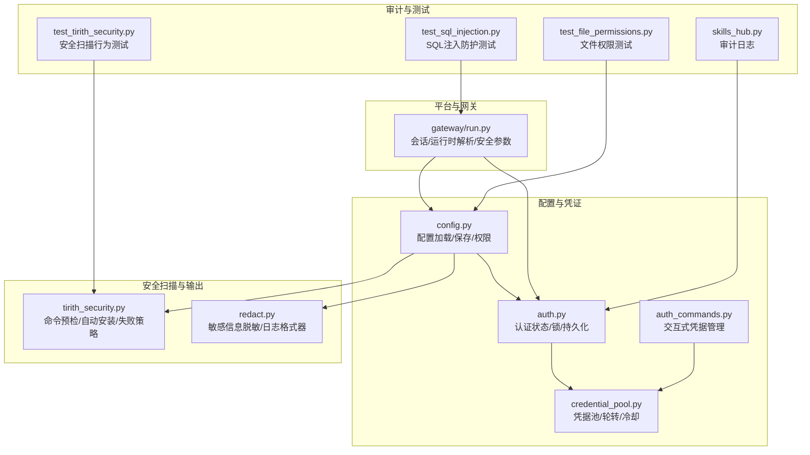
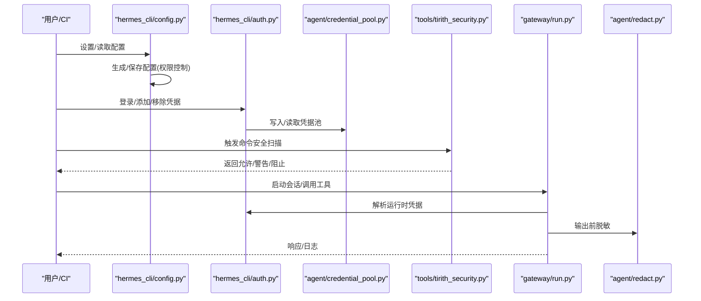
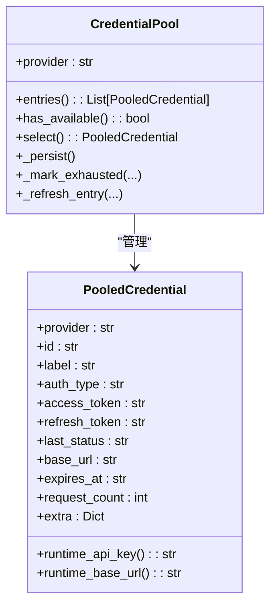
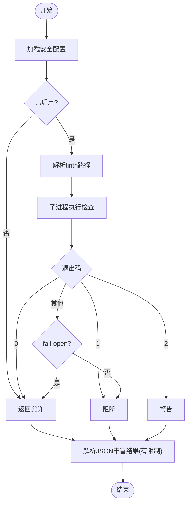
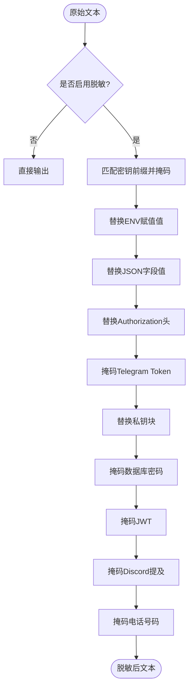
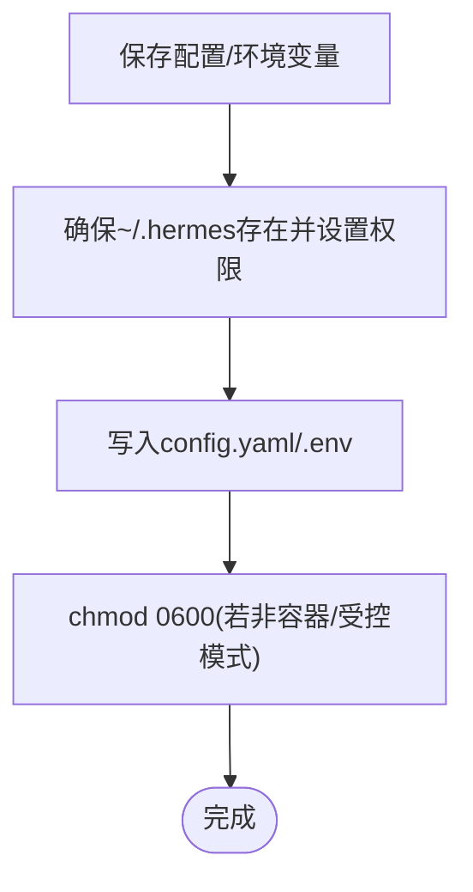
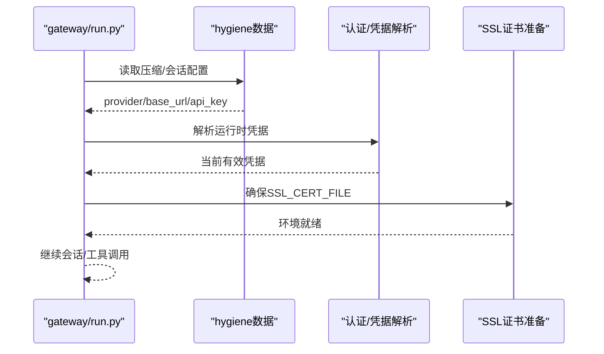
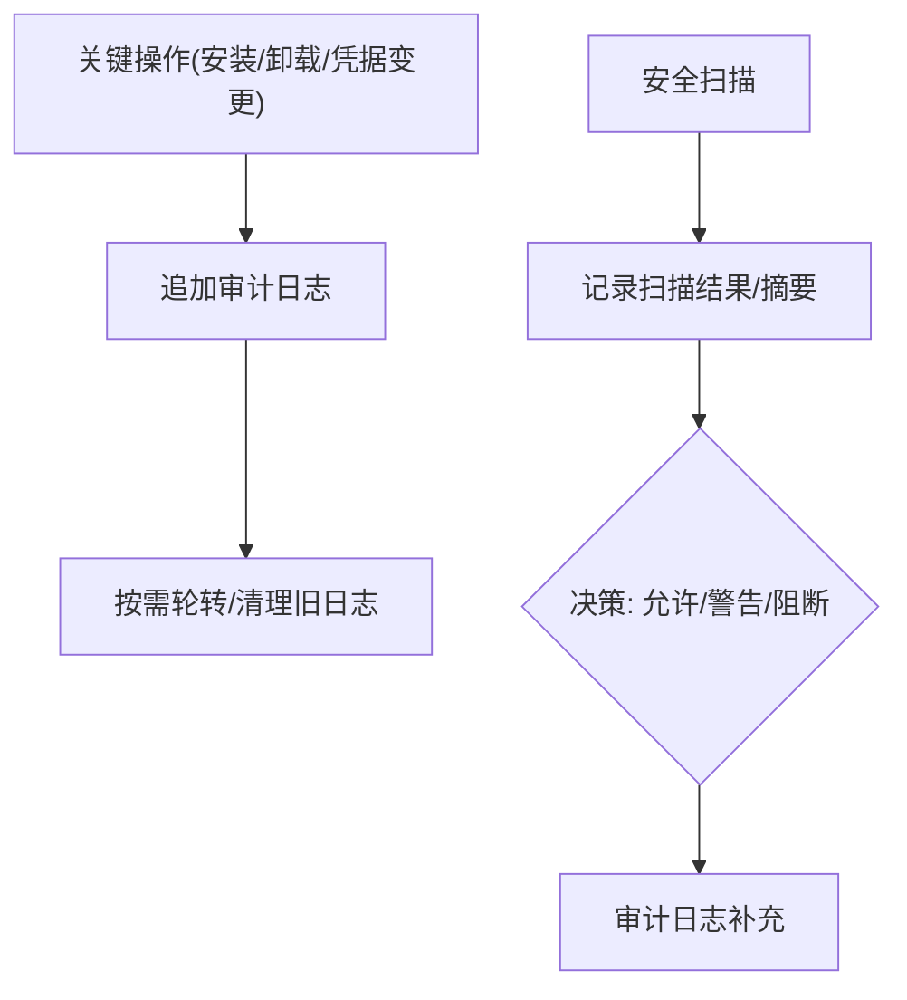
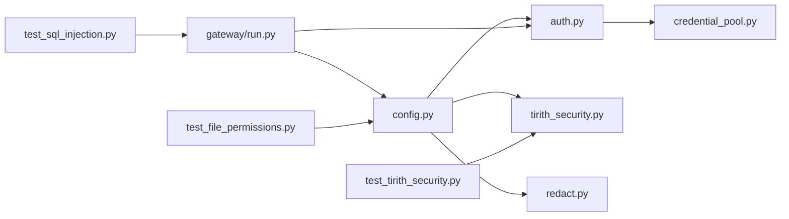

# 安全配置

<cite>
**本文引用的文件**
- [SECURITY.md](file://SECURITY.md)
- [credential_pool.py](file://agent/credential_pool.py)
- [tirith_security.py](file://tools/tirith_security.py)
- [redact.py](file://agent/redact.py)
- [config.py](file://hermes_cli/config.py)
- [auth.py](file://hermes_cli/auth.py)
- [auth_commands.py](file://hermes_cli/auth_commands.py)
- [test_file_permissions.py](file://tests/cron/test_file_permissions.py)
- [test_config.py](file://tests/hermes_cli/test_config.py)
- [test_tirith_security.py](file://tests/tools/test_tirith_security.py)
- [test_sql_injection.py](file://tests/test_sql_injection.py)
- [run.py](file://gateway/run.py)
- [skills_hub.py](file://tools/skills_hub.py)
</cite>

## 目录
1. [简介](#简介)
2. [项目结构](#项目结构)
3. [核心组件](#核心组件)
4. [架构总览](#架构总览)
5. [详细组件分析](#详细组件分析)
6. [依赖分析](#依赖分析)
7. [性能考虑](#性能考虑)
8. [故障排查指南](#故障排查指南)
9. [结论](#结论)
10. [附录](#附录)

## 简介
本文件面向Hermes Agent的安全配置与运维，系统化阐述敏感配置（API密钥、访问令牌、证书）的保护机制，覆盖配置文件权限控制、访问限制、预执行安全扫描、凭据池管理、输出脱敏、以及安全审计与合规建议。文档同时提供安全配置检查清单、注入攻击防护与安全编码实践、泄露检测与应急响应流程，帮助在多租户与容器化场景下实现最小暴露面与可追溯性。

## 项目结构
围绕“安全配置”的关键模块分布如下：
- 配置与凭证：config.py、auth.py、credential_pool.py、auth_commands.py
- 输出与日志安全：redact.py、hermes_logging.py
- 预执行安全扫描：tools/tirith_security.py
- 权限与文件安全：tests/cron/test_file_permissions.py、tests/hermes_cli/test_config.py
- 平台与网关安全：gateway/run.py
- 审计与记录：tools/skills_hub.py
- 注入与安全测试：tests/test_sql_injection.py、tests/tools/test_tirith_security.py

**图表来源**
- [config.py](file://hermes_cli/config.py)
- [auth.py](file://hermes_cli/auth.py)
- [credential_pool.py](file://agent/credential_pool.py)
- [auth_commands.py](file://hermes_cli/auth_commands.py)
- [tirith_security.py](file://tools/tirith_security.py)
- [redact.py](file://agent/redact.py)
- [run.py](file://gateway/run.py)
- [skills_hub.py](file://tools/skills_hub.py)
- [test_tirith_security.py](file://tests/tools/test_tirith_security.py)
- [test_file_permissions.py](file://tests/cron/test_file_permissions.py)
- [test_sql_injection.py](file://tests/test_sql_injection.py)

**章节来源**
- [SECURITY.md](file://SECURITY.md)
- [config.py](file://hermes_cli/config.py)
- [auth.py](file://hermes_cli/auth.py)
- [credential_pool.py](file://agent/credential_pool.py)
- [auth_commands.py](file://hermes_cli/auth_commands.py)
- [tirith_security.py](file://tools/tirith_security.py)
- [redact.py](file://agent/redact.py)
- [run.py](file://gateway/run.py)
- [skills_hub.py](file://tools/skills_hub.py)
- [test_tirith_security.py](file://tests/tools/test_tirith_security.py)
- [test_file_permissions.py](file://tests/cron/test_file_permissions.py)
- [test_sql_injection.py](file://tests/test_sql_injection.py)

## 核心组件
- 凭据池与轮转：支持多来源、多策略的凭据选择与冷却控制，避免单点泄露与配额耗尽。
- 预执行安全扫描：通过tirith对危险命令进行内容级威胁检测，支持失败开/关策略与自动安装。
- 输出脱敏：对日志、工具输出中的密钥、令牌、私钥等进行掩码处理。
- 配置与文件权限：确保~/.hermes目录及config.yaml、.env、auth.json等文件的最小权限。
- 平台与网关安全：会话路由、运行时凭据解析、TLS证书环境准备等。
- 审计与合规：审计日志记录、安全扫描结果、权限变更与凭据操作轨迹。

**章节来源**
- [credential_pool.py](file://agent/credential_pool.py)
- [tirith_security.py](file://tools/tirith_security.py)
- [redact.py](file://agent/redact.py)
- [config.py](file://hermes_cli/config.py)
- [auth.py](file://hermes_cli/auth.py)
- [run.py](file://gateway/run.py)
- [skills_hub.py](file://tools/skills_hub.py)

## 架构总览
Hermes Agent的安全配置由“配置层—凭证层—执行层—审计层”构成，形成从输入到输出的闭环安全控制。

**图表来源**
- [config.py](file://hermes_cli/config.py)
- [auth.py](file://hermes_cli/auth.py)
- [credential_pool.py](file://agent/credential_pool.py)
- [tirith_security.py](file://tools/tirith_security.py)
- [run.py](file://gateway/run.py)
- [redact.py](file://agent/redact.py)

## 详细组件分析

### 凭据池与轮转（Credential Pool）
- 多来源与多策略：支持手动、环境变量、外部文件等多种来源；支持填充优先、轮询、随机、最少使用等策略。
- 冷却与重试：基于HTTP错误码设置冷却时间，避免触发速率限制或配额耗尽；支持刷新失败后的回退与同步。
- 跨进程安全：凭据池持久化于auth.json，配合跨进程文件锁，保证并发一致性。
- 运行时解析：根据provider/base_url/api_key等动态解析当前有效凭据，避免硬编码在配置中。

**图表来源**
- [credential_pool.py](file://agent/credential_pool.py)

**章节来源**
- [credential_pool.py](file://agent/credential_pool.py)
- [auth.py](file://hermes_cli/auth.py)
- [auth_commands.py](file://hermes_cli/auth_commands.py)

### 预执行安全扫描（Tirith）
- 配置项：启用开关、二进制路径、超时、失败策略（fail-open/fail-closed）。
- 自动安装：按平台目标三元组下载发布包，校验SHA-256与可选cosign供应链证明；失败原因持久化并在24小时内抑制重试。
- 执行模型：以子进程方式运行，捕获退出码与JSON丰富结果；异常与超时遵循fail策略。
- 行为约束：发现上限与摘要长度限制，避免过大输出影响性能。

**图表来源**
- [tirith_security.py](file://tools/tirith_security.py)
- [test_tirith_security.py](file://tests/tools/test_tirith_security.py)

**章节来源**
- [tirith_security.py](file://tools/tirith_security.py)
- [test_tirith_security.py](file://tests/tools/test_tirith_security.py)

### 输出脱敏与日志安全（Redact）
- 模式覆盖：API密钥前缀、环境变量赋值、JSON字段、Authorization头、Telegram Bot Token、私钥块、数据库连接串、JWT、Discord提及、电话号码等。
- 日志格式器：统一在日志格式化阶段进行脱敏，避免敏感信息进入日志文件。
- 环境开关：HERMES_REDACT_SECRETS可禁用脱敏，但默认开启。

**图表来源**
- [redact.py](file://agent/redact.py)

**章节来源**
- [redact.py](file://agent/redact.py)

### 配置与文件权限控制
- 目录与文件权限：
  - ~/.hermes目录默认0700（受控模式下为0750），子目录与文件默认0700/0600。
  - 受容器/卷挂载场景影响时可跳过chmod或自定义模式。
- 配置文件写入：
  - 保存config.yaml与.env时强制设置0600权限。
  - 环境变量写入不输出到stdout，且返回元数据避免泄露。
- 容器检测：识别Docker/LXC等容器环境，必要时跳过严格权限以兼容多进程。

**图表来源**
- [config.py](file://hermes_cli/config.py)
- [test_file_permissions.py](file://tests/cron/test_file_permissions.py)
- [test_config.py](file://tests/hermes_cli/test_config.py)

**章节来源**
- [config.py](file://hermes_cli/config.py)
- [test_file_permissions.py](file://tests/cron/test_file_permissions.py)
- [test_config.py](file://tests/hermes_cli/test_config.py)

### 平台与网关安全（Gateway）
- 会话与运行时解析：从hygiene数据与会话配置中解析provider/base_url/api_key，避免硬编码在全局配置中。
- TLS证书：自动检测并设置SSL_CERT_FILE，优先系统默认路径，其次certifi，最后回退常用路径。
- 危险命令审批：approval系统作为核心安全边界，终端命令需经用户确认或自动审批。

**图表来源**
- [run.py](file://gateway/run.py)

**章节来源**
- [run.py](file://gateway/run.py)
- [SECURITY.md](file://SECURITY.md)

### 审计与合规
- 审计日志：记录技能安装/卸载等关键动作，包含时间戳、操作、来源、信任级别、判定与附加信息。
- 安全扫描审计：tirith扫描结果纳入fail-open/fail-closed决策，异常与超时有明确日志提示。
- 合规建议：API密钥仅存放于~/.hermes/.env；生产环境使用容器沙箱；网络暴露需VPN/Tailscale/防火墙；定期轮换凭据与证书。

**图表来源**
- [skills_hub.py](file://tools/skills_hub.py)
- [tirith_security.py](file://tools/tirith_security.py)

**章节来源**
- [skills_hub.py](file://tools/skills_hub.py)
- [tirith_security.py](file://tools/tirith_security.py)
- [SECURITY.md](file://SECURITY.md)

## 依赖分析
- 配置层依赖凭证层：config.py读取/写入配置，auth.py负责认证状态与持久化，credential_pool.py提供运行时凭据解析。
- 执行层依赖扫描与脱敏：tirith_security.py在命令执行前进行安全检查，redact.py在输出阶段进行脱敏。
- 平台层依赖配置与认证：gateway/run.py在启动会话时解析provider/base_url/api_key，并准备TLS证书。
- 测试与验证：test_file_permissions.py验证文件权限，test_tirith_security.py验证扫描行为，test_sql_injection.py验证SQL注入防护。

**图表来源**
- [config.py](file://hermes_cli/config.py)
- [auth.py](file://hermes_cli/auth.py)
- [credential_pool.py](file://agent/credential_pool.py)
- [tirith_security.py](file://tools/tirith_security.py)
- [redact.py](file://agent/redact.py)
- [run.py](file://gateway/run.py)
- [test_file_permissions.py](file://tests/cron/test_file_permissions.py)
- [test_tirith_security.py](file://tests/tools/test_tirith_security.py)
- [test_sql_injection.py](file://tests/test_sql_injection.py)

**章节来源**
- [config.py](file://hermes_cli/config.py)
- [auth.py](file://hermes_cli/auth.py)
- [credential_pool.py](file://agent/credential_pool.py)
- [tirith_security.py](file://tools/tirith_security.py)
- [redact.py](file://agent/redact.py)
- [run.py](file://gateway/run.py)
- [test_file_permissions.py](file://tests/cron/test_file_permissions.py)
- [test_tirith_security.py](file://tests/tools/test_tirith_security.py)
- [test_sql_injection.py](file://tests/test_sql_injection.py)

## 性能考虑
- 凭据池轮询与冷却：合理设置冷却时间与策略，避免频繁刷新与阻塞。
- 扫描超时与失败策略：适度缩短tirith超时，fail-open提升可用性，fail-closed保障安全。
- 脱敏范围与成本：脱敏规则覆盖主要模式，避免对大文本进行过度正则匹配。
- 文件权限与容器：在容器环境中跳过chmod以减少I/O与权限冲突。

[本节为通用指导，无需特定文件引用]

## 故障排查指南
- 配置文件权限问题：
  - 现象：config.yaml/.env权限不足导致读写失败。
  - 排查：确认0600权限；检查容器/受控模式下的umask与目录权限。
  - 参考：[test_file_permissions.py](file://tests/cron/test_file_permissions.py)
- 安全扫描不可用：
  - 现象：tirith未找到或超时。
  - 排查：检查TIRITH_ENABLED/TIRITH_BIN/TIRITH_TIMEOUT；查看fail-open/fail-closed策略；确认自动安装是否成功。
  - 参考：[tirith_security.py](file://tools/tirith_security.py)、[test_tirith_security.py](file://tests/tools/test_tirith_security.py)
- 凭据解析失败：
  - 现象：运行时无法获取有效api_key/base_url。
  - 排查：检查credential_pool策略、冷却状态、刷新逻辑；核对auth.json锁与持久化。
  - 参考：[credential_pool.py](file://agent/credential_pool.py)、[auth.py](file://hermes_cli/auth.py)
- SQL注入防护：
  - 现象：查询构造异常或列名不安全。
  - 排查：确认参数化查询与列名标识符安全。
  - 参考：[test_sql_injection.py](file://tests/test_sql_injection.py)
- 日志泄露：
  - 现象：日志中出现敏感信息。
  - 排查：确认HERMES_REDACT_SECRETS开关；检查RedactingFormatter是否生效。
  - 参考：[redact.py](file://agent/redact.py)

**章节来源**
- [test_file_permissions.py](file://tests/cron/test_file_permissions.py)
- [tirith_security.py](file://tools/tirith_security.py)
- [test_tirith_security.py](file://tests/tools/test_tirith_security.py)
- [credential_pool.py](file://agent/credential_pool.py)
- [auth.py](file://hermes_cli/auth.py)
- [test_sql_injection.py](file://tests/test_sql_injection.py)
- [redact.py](file://agent/redact.py)

## 结论
Hermes Agent通过“配置最小权限、凭据池轮转、预执行扫描、输出脱敏、平台安全加固与审计日志”构建了端到端的安全配置体系。结合fail-open/fail-closed策略与容器化沙箱，可在保证可用性的同时降低泄露风险。建议在生产环境遵循“仅凭据在环境文件、最小权限目录、容器隔离、定期轮换与审计”的最佳实践。

[本节为总结，无需特定文件引用]

## 附录

### 安全配置检查清单
- 配置文件
  - config.yaml/.env权限是否为0600
  - 是否仅存放API密钥于~/.hermes/.env
  - 是否启用redact_secrets
- 凭据管理
  - 凭据池策略是否合理（轮询/最少使用/随机）
  - 冷却与刷新逻辑是否正确
  - 是否定期轮换与清理无效凭据
- 执行安全
  - 是否启用tirith并设置合理超时与失败策略
  - 是否对危险命令进行审批
- 平台与证书
  - 是否正确设置SSL_CERT_FILE
  - 是否使用容器沙箱隔离
- 审计与合规
  - 是否记录关键操作与扫描结果
  - 是否符合组织合规要求（如最小权限、审计留痕）

**章节来源**
- [config.py](file://hermes_cli/config.py)
- [credential_pool.py](file://agent/credential_pool.py)
- [tirith_security.py](file://tools/tirith_security.py)
- [redact.py](file://agent/redact.py)
- [run.py](file://gateway/run.py)
- [SECURITY.md](file://SECURITY.md)