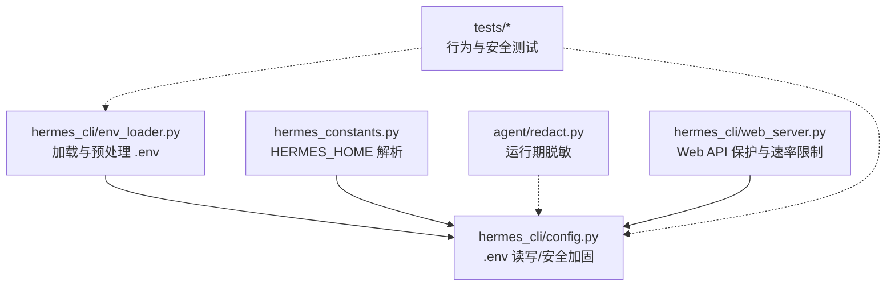
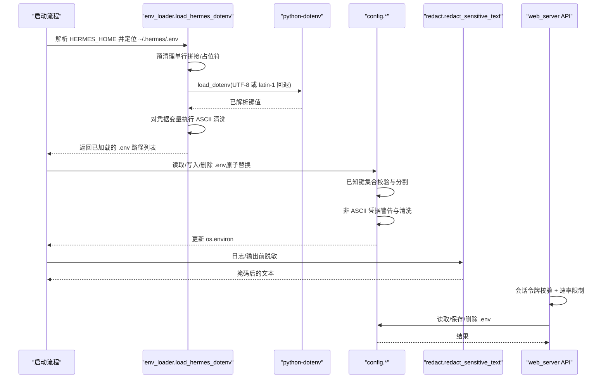
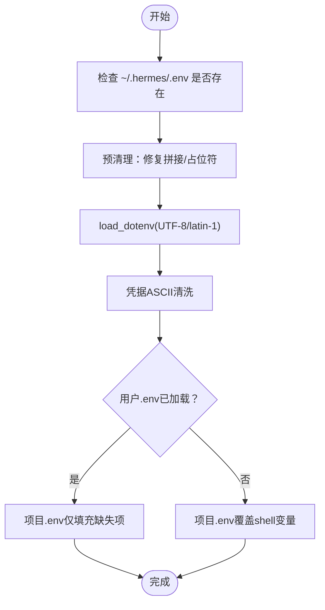
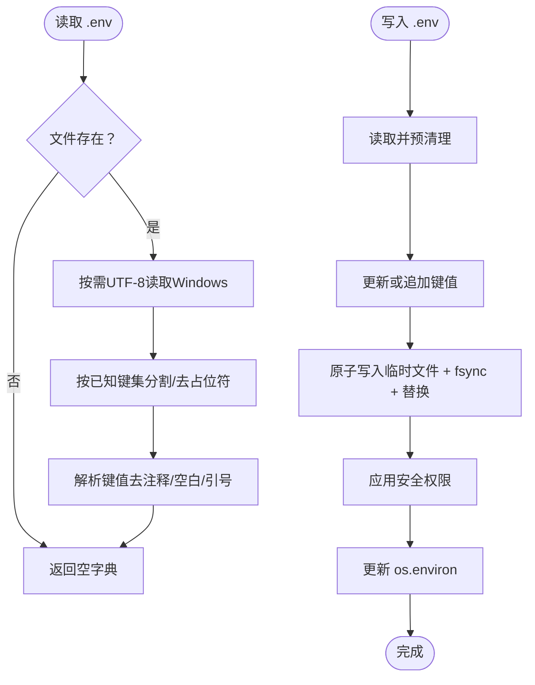
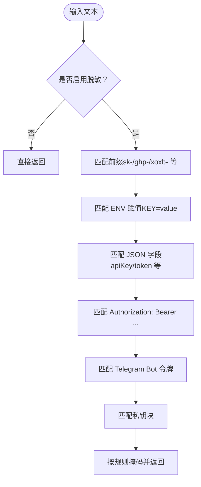
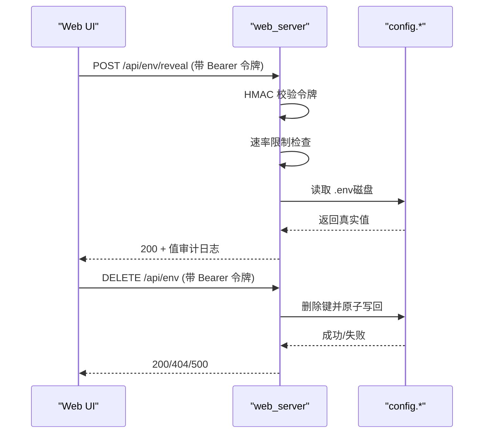
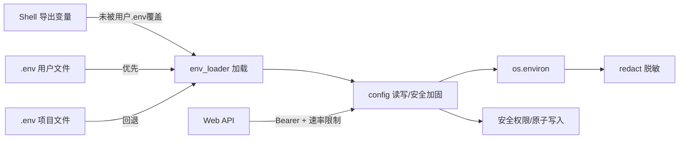

# 环境变量管理

<cite>
**本文引用的文件**
- [hermes_cli/env_loader.py](file://hermes_cli/env_loader.py)
- [hermes_cli/config.py](file://hermes_cli/config.py)
- [hermes_constants.py](file://hermes_constants.py)
- [agent/redact.py](file://agent/redact.py)
- [hermes_cli/web_server.py](file://hermes_cli/web_server.py)
- [tests/hermes_cli/test_env_loader.py](file://tests/hermes_cli/test_env_loader.py)
- [tests/hermes_cli/test_config.py](file://tests/hermes_cli/test_config.py)
- [tests/agent/test_redact.py](file://tests/agent/test_redact.py)
- [scripts/install.ps1](file://scripts/install.ps1)
</cite>

## 目录
1. [简介](#简介)
2. [项目结构](#项目结构)
3. [核心组件](#核心组件)
4. [架构总览](#架构总览)
5. [详细组件分析](#详细组件分析)
6. [依赖关系分析](#依赖关系分析)
7. [性能考量](#性能考量)
8. [故障排查指南](#故障排查指南)
9. [结论](#结论)
10. [附录：环境变量清单与最佳实践](#附录环境变量清单与最佳实践)

## 简介
本文件系统性阐述 Hermes Agent 的环境变量管理系统，涵盖 .env 文件结构与管理策略、API 密钥与平台配置的存储方式、优先级与覆盖机制、安全与访问控制、部署模式差异以及最佳实践。目标是帮助开发者与运维人员在不同环境下正确、安全地配置与使用环境变量。

## 项目结构
围绕环境变量管理的关键模块与文件：
- hermes_cli/env_loader.py：统一加载 .env 的入口，负责预清理、回退编码与凭据清洗。
- hermes_cli/config.py：.env 读写、安全加固、已知键集合并、敏感值 ASCII 校验与警告。
- hermes_constants.py：HERMES_HOME 默认路径解析，决定 .env 文件位置。
- agent/redact.py：运行期日志与输出中的敏感信息脱敏策略。
- hermes_cli/web_server.py：Web UI 对 .env 的增删改查与会话令牌保护。
- 测试用例：验证加载优先级、删除行为、脱敏逻辑等。

**图表来源**
- [hermes_cli/env_loader.py:92-123](file://hermes_cli/env_loader.py#L92-L123)
- [hermes_cli/config.py:2831-3100](file://hermes_cli/config.py#L2831-L3100)
- [hermes_constants.py:11-17](file://hermes_constants.py#L11-L17)
- [agent/redact.py:124-168](file://agent/redact.py#L124-L168)
- [hermes_cli/web_server.py:762-800](file://hermes_cli/web_server.py#L762-L800)

**章节来源**
- [hermes_cli/env_loader.py:1-124](file://hermes_cli/env_loader.py#L1-L124)
- [hermes_cli/config.py:1-200](file://hermes_cli/config.py#L1-L200)
- [hermes_constants.py:1-32](file://hermes_constants.py#L1-L32)

## 核心组件
- .env 加载器（统一入口）
  - 预清理：修复单行拼接的 KEY=VALUE、移除占位符。
  - 编码回退：UTF-8 失败时尝试 latin-1。
  - 凭据清洗：仅对以特定后缀命名的变量进行 ASCII 清洗。
- .env 读写器（持久化与安全）
  - 读取：按行解析，剥离注释与空行，支持 Windows UTF-8 打开。
  - 写入：原子替换，保留权限；自动 ASCII 校验与警告。
  - 删除：按行过滤，原子替换，同步清理 os.environ。
- 常量与路径
  - HERMES_HOME 决定 .env 位置，默认 ~/.hermes。
- 运行期脱敏
  - 按正则匹配掩码 API Key、Token、密码等，支持短令牌全掩码、长令牌前后保留。
- Web API 安全
  - 会话令牌（一次性）保护敏感端点，速率限制防滥用，CORS 仅允许本地回环。

**章节来源**
- [hermes_cli/env_loader.py:18-44](file://hermes_cli/env_loader.py#L18-L44)
- [hermes_cli/env_loader.py:47-90](file://hermes_cli/env_loader.py#L47-L90)
- [hermes_cli/config.py:2831-3100](file://hermes_cli/config.py#L2831-L3100)
- [hermes_constants.py:11-17](file://hermes_constants.py#L11-L17)
- [agent/redact.py:124-168](file://agent/redact.py#L124-L168)
- [hermes_cli/web_server.py:70-115](file://hermes_cli/web_server.py#L70-L115)

## 架构总览
下图展示从启动到运行期的环境变量加载与安全流程：

**图表来源**
- [hermes_cli/env_loader.py:92-123](file://hermes_cli/env_loader.py#L92-L123)
- [hermes_cli/config.py:2831-3100](file://hermes_cli/config.py#L2831-L3100)
- [agent/redact.py:124-168](file://agent/redact.py#L124-L168)
- [hermes_cli/web_server.py:762-800](file://hermes_cli/web_server.py#L762-L800)

## 详细组件分析

### 组件A：.env 加载与优先级
- 行为规则
  - 用户环境（~/.hermes/.env）优先覆盖过时的 shell 导出值。
  - 项目级 .env 作为开发回退：当用户环境存在时仅填充缺失项；若不存在，则覆盖 shell 变量。
- 预处理
  - 单行拼接 KEY=VALUE：按已知键名拆分，避免错误值。
  - 占位符清理：移除形如 KEY=*** 的残留条目。
  - 编码容错：UTF-8 失败回退 latin-1。
  - 凭据清洗：仅对以 _API_KEY/_TOKEN/_SECRET/_KEY 结尾的变量进行 ASCII 清洗。
- 关键实现参考
  - [hermes_cli/env_loader.py:92-123](file://hermes_cli/env_loader.py#L92-L123)
  - [hermes_cli/env_loader.py:47-90](file://hermes_cli/env_loader.py#L47-L90)
  - [tests/hermes_cli/test_env_loader.py:9-33](file://tests/hermes_cli/test_env_loader.py#L9-L33)

**图表来源**
- [hermes_cli/env_loader.py:92-123](file://hermes_cli/env_loader.py#L92-L123)
- [tests/hermes_cli/test_env_loader.py:9-33](file://tests/hermes_cli/test_env_loader.py#L9-L33)

**章节来源**
- [hermes_cli/env_loader.py:92-123](file://hermes_cli/env_loader.py#L92-L123)
- [tests/hermes_cli/test_env_loader.py:9-33](file://tests/hermes_cli/test_env_loader.py#L9-L33)

### 组件B：.env 读写与安全
- 读取
  - Windows 使用 UTF-8 打开，错误字符替换。
  - 解析非注释、非空行，去除引号包裹。
- 写入
  - 原子临时文件写入 + fsync + 替换，保留原权限。
  - 非 ASCII 凭据自动清洗并打印警告。
- 删除
  - 原子替换写回，同时从 os.environ 清理。
- 已知键集
  - OPTIONAL_ENV_VARS + _EXTRA_ENV_KEYS，用于安全分割与覆盖范围限定。
- 关键实现参考
  - [hermes_cli/config.py:2831-3100](file://hermes_cli/config.py#L2831-L3100)
  - [hermes_cli/config.py:2860-2908](file://hermes_cli/config.py#L2860-L2908)
  - [hermes_cli/config.py:2911-2953](file://hermes_cli/config.py#L2911-L2953)
  - [tests/hermes_cli/test_config.py:167-195](file://tests/hermes_cli/test_config.py#L167-L195)

**图表来源**
- [hermes_cli/config.py:2831-3100](file://hermes_cli/config.py#L2831-L3100)
- [hermes_cli/config.py:2860-2908](file://hermes_cli/config.py#L2860-L2908)
- [tests/hermes_cli/test_config.py:167-195](file://tests/hermes_cli/test_config.py#L167-L195)

**章节来源**
- [hermes_cli/config.py:2831-3100](file://hermes_cli/config.py#L2831-L3100)
- [hermes_cli/config.py:2860-2908](file://hermes_cli/config.py#L2860-L2908)
- [tests/hermes_cli/test_config.py:167-195](file://tests/hermes_cli/test_config.py#L167-L195)

### 组件C：运行期脱敏与日志安全
- 触发时机：日志输出、工具结果、网关日志前。
- 规则：
  - 短令牌（<18字符）全掩码；长令牌保留前6后4。
  - 匹配常见密钥名（API_KEY、TOKEN、SECRET 等）及 JSON 字段、授权头、私钥块等。
  - 可通过配置开关关闭（默认开启）。
- 关键实现参考
  - [agent/redact.py:124-168](file://agent/redact.py#L124-L168)
  - [tests/agent/test_redact.py:40-107](file://tests/agent/test_redact.py#L40-L107)

**图表来源**
- [agent/redact.py:124-168](file://agent/redact.py#L124-L168)
- [tests/agent/test_redact.py:40-107](file://tests/agent/test_redact.py#L40-L107)

**章节来源**
- [agent/redact.py:124-168](file://agent/redact.py#L124-L168)
- [tests/agent/test_redact.py:40-107](file://tests/agent/test_redact.py#L40-L107)

### 组件D：Web API 安全与访问控制
- 会话令牌
  - 每次服务启动生成一次性的 Bearer 令牌，注入前端页面，仅合法 UI 可调用受保护端点。
- 速率限制
  - 对 /api/env/reveal 限制每 30 秒最多 5 次请求。
- CORS
  - 仅允许本地回环地址（localhost/127.0.0.1），避免跨站读取/修改配置与密钥。
- 关键实现参考
  - [hermes_cli/web_server.py:70-115](file://hermes_cli/web_server.py#L70-L115)
  - [hermes_cli/web_server.py:762-800](file://hermes_cli/web_server.py#L762-L800)
  - [tests/hermes_cli/test_web_server.py:216-291](file://tests/hermes_cli/test_web_server.py#L216-L291)

**图表来源**
- [hermes_cli/web_server.py:70-115](file://hermes_cli/web_server.py#L70-L115)
- [hermes_cli/web_server.py:762-800](file://hermes_cli/web_server.py#L762-L800)
- [tests/hermes_cli/test_web_server.py:216-291](file://tests/hermes_cli/test_web_server.py#L216-L291)

**章节来源**
- [hermes_cli/web_server.py:70-115](file://hermes_cli/web_server.py#L70-L115)
- [hermes_cli/web_server.py:762-800](file://hermes_cli/web_server.py#L762-L800)
- [tests/hermes_cli/test_web_server.py:216-291](file://tests/hermes_cli/test_web_server.py#L216-L291)

## 依赖关系分析
- 环境变量来源与优先级
  - 用户 .env > 项目 .env（仅在用户 .env 存在时才填充缺失）> Shell 导出值。
- 路径解析
  - HERMES_HOME 决定 .env 位置；Windows 安装脚本会设置该变量以确保路径一致。
- 安全边界
  - .env 读写仅限已知键集合，避免污染无关环境变量。
  - 运行期脱敏贯穿日志与输出，防止泄露。
  - Web API 采用一次性令牌与速率限制，CORS 严格限制。

**图表来源**
- [hermes_cli/env_loader.py:92-123](file://hermes_cli/env_loader.py#L92-L123)
- [hermes_cli/config.py:2831-3100](file://hermes_cli/config.py#L2831-L3100)
- [agent/redact.py:124-168](file://agent/redact.py#L124-L168)
- [hermes_cli/web_server.py:70-115](file://hermes_cli/web_server.py#L70-L115)

**章节来源**
- [hermes_cli/env_loader.py:92-123](file://hermes_cli/env_loader.py#L92-L123)
- [hermes_cli/config.py:2831-3100](file://hermes_cli/config.py#L2831-L3100)
- [agent/redact.py:124-168](file://agent/redact.py#L124-L168)
- [hermes_cli/web_server.py:70-115](file://hermes_cli/web_server.py#L70-L115)

## 性能考量
- 加载阶段
  - 预清理与编码回退成本低，主要为小文件 I/O。
  - 已知键集分割避免误判，复杂度与行数线性相关。
- 写入阶段
  - 原子替换 + fsync 保证一致性，但会带来额外磁盘写入。
  - 非 ASCII 校验与清洗为常数时间操作，影响极小。
- 运行期
  - 正则脱敏在大文本上可能有开销，但仅在日志输出前触发，频率可控。

[本节为通用指导，不直接分析具体文件]

## 故障排查指南
- .env 未生效
  - 检查是否位于 HERMES_HOME 下（默认 ~/.hermes）。
  - 确认用户 .env 是否存在且优先级更高。
  - 参考测试用例验证覆盖行为。
  - 参考：[tests/hermes_cli/test_env_loader.py:9-33](file://tests/hermes_cli/test_env_loader.py#L9-L33)
- 删除 .env 中的键无效
  - 确认键名符合命名规范，文件存在且可写。
  - 删除后应同步从 os.environ 清理。
  - 参考：[tests/hermes_cli/test_config.py:167-195](file://tests/hermes_cli/test_config.py#L167-L195)
- 非 ASCII 凭据导致认证失败
  - 系统会在写入时警告并清洗，重新从提供商复制纯 ASCII 值。
  - 参考：[hermes_cli/config.py:2956-2994](file://hermes_cli/config.py#L2956-L2994)
- Web UI 无法查看真实值
  - 需要正确的会话令牌与速率限制内请求。
  - 参考：[tests/hermes_cli/test_web_server.py:216-291](file://tests/hermes_cli/test_web_server.py#L216-L291)
- Windows 路径与环境变量
  - 安装脚本会设置 HERMES_HOME，确保 .env 位置一致。
  - 参考：[scripts/install.ps1:604-618](file://scripts/install.ps1#L604-L618)

**章节来源**
- [tests/hermes_cli/test_env_loader.py:9-33](file://tests/hermes_cli/test_env_loader.py#L9-L33)
- [tests/hermes_cli/test_config.py:167-195](file://tests/hermes_cli/test_config.py#L167-L195)
- [hermes_cli/config.py:2956-2994](file://hermes_cli/config.py#L2956-L2994)
- [tests/hermes_cli/test_web_server.py:216-291](file://tests/hermes_cli/test_web_server.py#L216-L291)
- [scripts/install.ps1:604-618](file://scripts/install.ps1#L604-L618)

## 结论
Hermes Agent 的环境变量管理通过“用户 .env 优先、项目 .env 回退”的双层策略，结合预清理、编码回退与凭据 ASCII 清洗，确保了稳定性与安全性。运行期脱敏与 Web API 的一次性令牌、速率限制、CORS 限制共同构建了多层防护。遵循本文最佳实践，可在不同部署模式下安全、可靠地管理敏感信息。

[本节为总结，不直接分析具体文件]

## 附录：环境变量清单与最佳实践

### 受支持的环境变量清单（按类别）
- 提供商类（可选）
  - OPENROUTER_API_KEY、GOOGLE_API_KEY/GEMINI_API_KEY、XAI_API_KEY、GLM_API_KEY/ZAI_API_KEY/Z_AI_API_KEY、KIMI_API_KEY/KIMI_CN_API_KEY、ARCEEAI_API_KEY、MINIMAX_API_KEY/MINIMAX_CN_API_KEY、DEEPSEEK_API_KEY、DASHSCOPE_API_KEY、HERMES_QWEN_BASE_URL 等。
- 平台与通道类（可选）
  - TELEGRAM_HOME_CHANNEL、DISCORD_HOME_CHANNEL、SIGNAL_*、FEISHU_*、WECOM_*、WEIXIN_*、QQ_*、MATRIX_*、MATTERMOST_*、BLUEBUBBLES_*、WHATSAPP_* 等。
- 终端与 SSH 类（可选）
  - TERMINAL_ENV、TERMINAL_SSH_KEY、TERMINAL_SSH_PORT 等。
- 必需变量
  - 本项目未定义全局必需变量，具体取决于所选模型与平台。
- 已知额外键（写入 .env 时不受 OPTIONAL_ENV_VARS 限制）
  - OPENAI_*、ANTHROPIC_*、部分平台键等。

**章节来源**
- [hermes_cli/config.py:804-1000](file://hermes_cli/config.py#L804-L1000)
- [hermes_cli/config.py:31-56](file://hermes_cli/config.py#L31-L56)

### 优先级与覆盖机制
- 用户 .env（~/.hermes/.env）优先于项目 .env 与 Shell 导出。
- 项目 .env 仅在用户 .env 不存在时覆盖 Shell 导出。
- 项目 .env 在用户 .env 存在时仅填充缺失项。

**章节来源**
- [hermes_cli/env_loader.py:97-104](file://hermes_cli/env_loader.py#L97-L104)
- [tests/hermes_cli/test_env_loader.py:9-33](file://tests/hermes_cli/test_env_loader.py#L9-L33)

### 安全存储与访问控制
- .env 读写
  - 原子替换 + fsync，保留原权限，防止容器卷权限问题。
  - 非 ASCII 凭据自动清洗并警告。
- 运行期脱敏
  - 日志与输出前脱敏，短令牌全掩码，长令牌前后保留。
- Web 访问控制
  - 一次性会话令牌、速率限制、CORS 仅本地回环。

**章节来源**
- [hermes_cli/config.py:2997-3064](file://hermes_cli/config.py#L2997-L3064)
- [agent/redact.py:124-168](file://agent/redact.py#L124-L168)
- [hermes_cli/web_server.py:70-115](file://hermes_cli/web_server.py#L70-L115)

### 不同部署模式的行为差异
- 标准桌面（Unix）
  - 默认 HERMES_HOME=~/.hermes，.env 位于该目录。
- Windows
  - 安装脚本设置 HERMES_HOME，.env 位置与权限处理适配。
- 容器/自定义路径
  - 通过 HERMES_HOME 指向任意路径，行为与权限保持一致。

**章节来源**
- [hermes_constants.py:11-17](file://hermes_constants.py#L11-L17)
- [scripts/install.ps1:604-618](file://scripts/install.ps1#L604-L618)

### 最佳实践
- 将敏感信息集中存放于 ~/.hermes/.env，并避免提交到版本库。
- 使用纯 ASCII 凭据，避免从富文本编辑器复制导致的 Unicode 字符。
- 定期运行 .env 清理与修复，避免单行拼接与占位符残留。
- 通过 Web UI 修改 .env 时注意速率限制与令牌有效期。
- 在容器或非标准路径部署时，显式设置 HERMES_HOME 并确认权限。

[本节为通用指导，不直接分析具体文件]