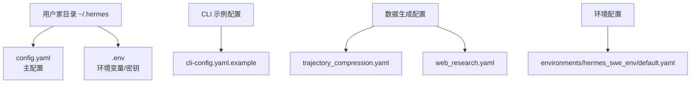
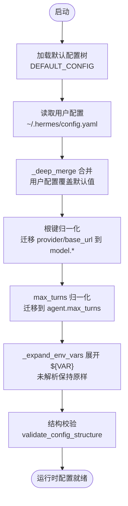
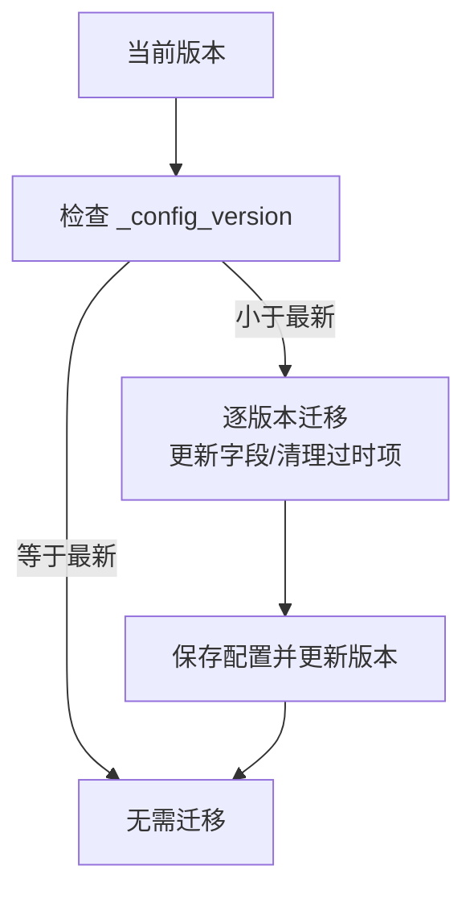

# 配置文件结构

<cite>
**本文档引用的文件**
- [cli-config.yaml.example](file://cli-config.yaml.example)
- [config.py](file://hermes_cli/config.py)
- [trajectory_compression.yaml](file://datagen-config-examples/trajectory_compression.yaml)
- [web_research.yaml](file://datagen-config-examples/web_research.yaml)
- [default.yaml](file://environments/hermes_swe_env/default.yaml)
</cite>

## 目录
1. [简介](#简介)
2. [项目结构](#项目结构)
3. [核心组件](#核心组件)
4. [架构总览](#架构总览)
5. [详细组件分析](#详细组件分析)
6. [依赖分析](#依赖分析)
7. [性能考虑](#性能考虑)
8. [故障排除指南](#故障排除指南)
9. [结论](#结论)
10. [附录](#附录)

## 简介
本文件系统化梳理 Hermes Agent 的配置文件结构与使用方法，重点覆盖主配置文件 config.yaml 的完整结构、字段定义、层次关系与约束条件，并结合 CLI 示例配置 cli-config.yaml.example 提供可操作的参考。文档同时涵盖版本管理、向后兼容策略、配置项之间的依赖关系以及最佳实践建议。

## 项目结构
Hermes Agent 的配置体系由以下几类文件构成：
- 主配置：~/.hermes/config.yaml（运行时生效）
- 环境变量：~/.hermes/.env（密钥与敏感信息）
- CLI 示例配置：cli-config.yaml.example（用于生成初始配置）
- 数据生成配置：datagen-config-examples/*.yaml（轨迹压缩、网页研究等专用配置）
- 环境配置：environments/*/default.yaml（特定环境的工具集与参数）

图表来源
- [config.py:205-211](file://hermes_cli/config.py#L205-L211)
- [cli-config.yaml.example:1-10](file://cli-config.yaml.example#L1-L10)
- [trajectory_compression.yaml:1-20](file://datagen-config-examples/trajectory_compression.yaml#L1-L20)
- [web_research.yaml:1-20](file://datagen-config-examples/web_research.yaml#L1-L20)
- [default.yaml:1-20](file://environments/hermes_swe_env/default.yaml#L1-L20)

章节来源
- [config.py:205-211](file://hermes_cli/config.py#L205-L211)
- [cli-config.yaml.example:1-10](file://cli-config.yaml.example#L1-L10)

## 核心组件
本节概述 config.yaml 的顶层结构与各子系统的职责边界。主配置采用分层设计，通过“默认值 + 用户覆盖”的方式实现灵活扩展。

- 模型配置（model）：选择推理提供方、模型名称、基础端点与令牌限制
- 终端工具（terminal）：本地/远程/容器执行后端、工作目录、超时与资源限制
- 浏览器工具（browser）：会话空闲超时、命令超时、录制与私有地址访问控制
- 压缩配置（compression）：自动上下文压缩阈值、尾部保留比例与保护轮次
- 辅助模型（auxiliary）：视觉分析、网页抽取、压缩摘要等辅助任务的专用模型
- 显示配置（display）：界面风格、工具进度显示、流式输出与皮肤主题
- 语音与听写（stt/tts）：语音转文字与文本转语音的提供方与模型
- 记忆与持久化（memory）：个人笔记与用户画像的字符上限与定期提醒
- 工具集与平台（toolsets/platforms）：按平台定制可用工具集
- 其他子系统：代理行为（agent）、委托（delegation）、安全扫描（security）、网络与日志等

章节来源
- [config.py:341-781](file://hermes_cli/config.py#L341-L781)
- [cli-config.yaml.example:8-890](file://cli-config.yaml.example#L8-L890)

## 架构总览
下图展示配置加载与合并流程：系统先加载默认配置树，再将用户配置进行深合并，随后进行根键归一化与环境变量展开，最终形成运行时配置。

图表来源
- [config.py:2678-2702](file://hermes_cli/config.py#L2678-L2702)
- [config.py:2613-2656](file://hermes_cli/config.py#L2613-L2656)
- [config.py:1952-2071](file://hermes_cli/config.py#L1952-L2071)

章节来源
- [config.py:2678-2702](file://hermes_cli/config.py#L2678-L2702)
- [config.py:1952-2071](file://hermes_cli/config.py#L1952-L2071)

## 详细组件分析

### 模型配置（model）
- 作用：指定默认模型、推理提供方、基础端点与令牌限制
- 关键字段
  - default：默认模型标识（支持 provider/model 路径）
  - provider：推理提供方（auto/openrouter/nous/anthropic/custom 等）
  - base_url：自定义 OpenAI 兼容端点
  - context_length/max_tokens：上下文窗口与单次输出上限（建议不手动设置以自动检测）
- 取值范围与默认
  - provider 支持 auto/openrouter/nous/anthropic/custom 等；当 provider 为 custom 时需提供 base_url
  - context_length 通常由模型元数据自动推断；仅在自定义服务器或代理不可用时手动设置
  - max_tokens 不建议手动设置，除非需要严格限制单次响应长度
- 使用场景
  - 多云/多模型路由：通过 provider 与 base_url 实现跨提供方切换
  - 本地模型：使用 custom + base_url 指向本地推理服务
  - 自动检测：优先保持 context_length 为空，让系统自动探测
- 依赖与约束
  - 当 provider 为 custom 时，必须提供 base_url
  - 若同时存在根级 provider/base_url 且 model.provider/model.base_url 为空，则会回退到根级键作为后备
- 最佳实践
  - 优先使用 auto 或明确的提供方（如 openrouter/nous），避免直接硬编码
  - 本地模型请确保 base_url 正确且可访问
  - 避免同时在根级与 model 下重复设置 provider/base_url

章节来源
- [cli-config.yaml.example:8-66](file://cli-config.yaml.example#L8-L66)
- [config.py:2613-2641](file://hermes_cli/config.py#L2613-L2641)

### 终端工具配置（terminal）
- 作用：控制命令执行的后端与沙箱环境
- 关键字段
  - backend：本地/SSH/Docker/Singularity/Modal/Daytona
  - cwd：工作目录（本地默认当前目录；远端/容器内路径需显式指定）
  - timeout/lifetime_seconds：命令执行超时与会话生命周期
  - container_*：CPU/内存/磁盘与持久化开关
  - docker_*：镜像、挂载、环境转发与卷映射
  - sudo_password：密码注入（明文存储，谨慎使用）
- 取值范围与默认
  - backend 默认 local；容器相关字段默认值见默认配置
  - 容器资源默认 CPU=1、内存=5120MB、磁盘=51200MB、持久化=true
- 使用场景
  - 本地开发：backend=local，cwd=.
  - 远程执行：backend=ssh，配置 ssh_host/ssh_user/ssh_port/ssh_key
  - 隔离执行：backend=docker/singularity/modal/daytona，配合镜像与资源限制
- 依赖与约束
  - 容器后端忽略本地/SSH 的部分字段；SSH 后端需正确配置密钥与免密
  - docker_mount_cwd_to_workspace 默认关闭，出于安全考虑
- 最佳实践
  - 生产环境优先使用容器后端，确保可复现与隔离
  - 仅在必要时开启 docker_mount_cwd_to_workspace
  - 为 sudo_password 设置合理的超时与提示策略

章节来源
- [cli-config.yaml.example:118-247](file://cli-config.yaml.example#L118-L247)
- [config.py:376-413](file://hermes_cli/config.py#L376-L413)

### 浏览器工具配置（browser）
- 作用：浏览器自动化与截图分析的会话管理
- 关键字段
  - inactivity_timeout：无活动超时（秒）
  - command_timeout：浏览器命令超时（秒）
  - record_sessions：是否自动录制会话为视频
  - allow_private_urls：是否允许访问私有/内网地址
  - camofox.managed_persistence：是否启用 Camofox 稳定用户态持久化
- 取值范围与默认
  - 默认 inactivity_timeout=120，command_timeout=30
  - record_sessions 默认关闭
- 使用场景
  - 自动化网页抓取与交互测试
  - 本地反检测浏览（Camofox）
- 依赖与约束
  - 访问私有地址需显式允许
  - 录制功能依赖外部工具与权限
- 最佳实践
  - 在受控环境中启用 record_sessions 以便审计
  - 对于内网/私有地址访问，仅在必要时开启 allow_private_urls

章节来源
- [cli-config.yaml.example:263-269](file://cli-config.yaml.example#L263-L269)
- [config.py:415-426](file://hermes_cli/config.py#L415-L426)

### 压缩配置（compression）
- 作用：自动压缩长对话，释放上下文空间并保留近期上下文
- 关键字段
  - enabled：是否启用自动压缩
  - threshold：触发压缩的上下文使用比例阈值（默认 0.50）
  - target_ratio：保留尾部的比例（默认 0.20，范围 0.10-0.80）
  - protect_last_n：至少保留最近消息轮数（默认 20）
- 取值范围与默认
  - threshold：0.0-1.0；target_ratio：0.10-0.80
  - protect_last_n：正整数
- 使用场景
  - 长对话与多轮任务中防止溢出
  - 保留最终结论与近期交互
- 依赖与约束
  - 与模型上下文长度强相关；建议不手动设置 context_length，交由系统自动探测
- 最佳实践
  - 适度提高 threshold 降低压缩频率，但可能导致溢出
  - 适当增大 protect_last_n 保留更多近期上下文

章节来源
- [cli-config.yaml.example:271-310](file://cli-config.yaml.example#L271-L310)
- [config.py:441-447](file://hermes_cli/config.py#L441-L447)

### 辅助模型（auxiliary）
- 作用：为视觉分析、网页抽取、压缩摘要等侧任务分配专用模型
- 结构
  - vision/web_extract/compression/session_search/skills_hub/approval/mcp/flush_memories
  - 每个任务可独立配置 provider/model/base_url/api_key/timeout 等
- 取值范围与默认
  - provider 支持 auto/openrouter/nous/gemini/ollama-cloud/codex/main
  - timeout/download_timeout 等可根据任务复杂度调整
- 使用场景
  - 视觉分析：浏览器截图理解
  - 网页抽取：页面文本提取与摘要
  - 压缩摘要：长历史压缩
- 依赖与约束
  - 非 OpenRouter/Nous Portal 的提供方实验性，可能不兼容
  - 某些任务对多模态或特定 API 格式有要求
- 最佳实践
  - 为不同任务选择合适提供方与模型
  - 保持默认配置以获得最佳兼容性

章节来源
- [cli-config.yaml.example:312-360](file://cli-config.yaml.example#L312-L360)
- [config.py:476-540](file://hermes_cli/config.py#L476-L540)

### 显示配置（display）
- 作用：控制 CLI/Gateway 的界面与交互体验
- 关键字段
  - compact/tool_progress/streaming：紧凑模式、工具进度级别、流式输出
  - interim_assistant_messages：自然中间状态消息
  - busy_input_mode：忙碌时 Enter 行为（中断/排队）
  - bell_on_complete/show_reasoning：完成提示音与推理展示
  - skin：主题皮肤名称
- 取值范围与默认
  - tool_progress：off/new/all/verbose
  - busy_input_mode：interrupt/queue
  - skin：default/ares/mono/slate 等内置皮肤
- 使用场景
  - 开发调试：verbose 显示完整调用链
  - 生产使用：all/compact 平衡信息量与可读性
- 依赖与约束
  - 与平台显示覆盖（display.platforms）协同
- 最佳实践
  - 通过 /skin 与 /verbose 动态切换
  - 在 Gateway 中启用 interim_assistant_messages 提升可观测性

章节来源
- [cli-config.yaml.example:767-857](file://cli-config.yaml.example#L767-L857)
- [config.py:542-558](file://hermes_cli/config.py#L542-L558)

### 语音与听写（stt/tts）
- 作用：语音转文字与文本转语音
- stt 关键字段
  - enabled/provider/local/openai/mistral：启用、提供方与模型选择
  - local.model/language：模型与语言强制
- tts 关键字段
  - provider/各提供方子段：edge/elevenlabs/openai/xai/mistral/neutts
- 取值范围与默认
  - provider：local/free（edge）、elevenlabs、openai、xai、mistral、neutts（本地）
- 使用场景
  - 语音消息转文字
  - 文本朗读与多语种合成
- 依赖与约束
  - 需要对应提供方的 API 密钥或本地模型
- 最佳实践
  - 本地部署优先考虑 neutts 以减少外部依赖
  - 云端提供方按需选择，注意配额与延迟

章节来源
- [cli-config.yaml.example:690-705](file://cli-config.yaml.example#L690-L705)
- [config.py:570-602](file://hermes_cli/config.py#L570-L602)

### 记忆与持久化（memory）
- 作用：会话间持久化记忆，提升个性化与上下文连续性
- 关键字段
  - memory_enabled/user_profile_enabled：开关
  - memory_char_limit/user_char_limit：字符上限（约 2.75 字符/token）
  - nudge_interval/flush_min_turns：定期提醒与退出/重置时保存记忆
- 取值范围与默认
  - 字符上限与轮次根据实际模型独立估算
- 使用场景
  - 长期协作与知识沉淀
  - 个性化人格与偏好记忆
- 依赖与约束
  - 与 Honcho 集成时为补充而非替代
- 最佳实践
  - 合理设置字符上限，避免过度膨胀
  - 通过 nudge_interval 提醒保存重要信息

章节来源
- [cli-config.yaml.example:361-388](file://cli-config.yaml.example#L361-L388)
- [config.py:644-654](file://hermes_cli/config.py#L644-L654)

### 工具集与平台（toolsets/platforms）
- 作用：按平台定制可用工具集
- 关键字段
  - platform_toolsets：为 cli/telegram/discord/whatsapp/slack/signal/homeassistant/qqbot 指定工具集
  - toolsets：已废弃，仅保留注释
- 取值范围与默认
  - 预设工具集：hermes-cli/hermes-telegram/hermes-discord/hermes-whatsapp/hermes-slack
  - 组合工具集：debugging/safe/all 等
- 使用场景
  - 限制高风险工具（如 terminal）
  - 为不同平台优化工具集
- 依赖与约束
  - 与 hermes tools 交互式配置互补
- 最佳实践
  - 生产环境优先使用受限工具集（safe）
  - 通过 hermes tools 动态调整

章节来源
- [cli-config.yaml.example:507-636](file://cli-config.yaml.example#L507-L636)
- [config.py:1926-1931](file://hermes_cli/config.py#L1926-L1931)

### 其他子系统
- 代理行为（agent）：最大轮次、空闲超时、重启排水时间、推理努力等级等
- 委托（delegation）：子代理的最大迭代、默认工具集与模型/提供方覆盖
- 安全扫描（security）：tirith 扫描、密钥脱敏与网站黑名单
- 网络与日志（network/logging）：IPv4 强制、日志级别与轮转
- 个人化（personalities）：预设人格模板
- 平台特定（discord/telegram/slack/mattermost/whatsapp）：回复模式、提及要求、线程与反应等

章节来源
- [cli-config.yaml.example:457-505](file://cli-config.yaml.example#L457-L505)
- [config.py:347-779](file://hermes_cli/config.py#L347-L779)

## 依赖分析
- 配置版本与迁移
  - _config_version：记录配置结构版本，随新增必填字段递增
  - 迁移流程：检查版本 → 迁移旧键 → 新增缺失字段 → 保存并更新版本号
  - 环境变量迁移：按版本映射新增/清理过时变量
- 结构校验
  - 校验 custom_providers 类型、字段完整性与位置正确性
  - 校验 fallback_model 结构
  - 校验根键误放问题（如 provider/base_url 应置于 model 下）
- 环境变量展开
  - 支持 ${VAR} 占位符，未解析保持原样，便于后续诊断

图表来源
- [config.py:1909-1918](file://hermes_cli/config.py#L1909-L1918)
- [config.py:2143-2570](file://hermes_cli/config.py#L2143-L2570)

章节来源
- [config.py:1909-1918](file://hermes_cli/config.py#L1909-L1918)
- [config.py:2143-2570](file://hermes_cli/config.py#L2143-L2570)

## 性能考虑
- 上下文压缩
  - 适度提高 threshold 与 target_ratio 可减少压缩频率，但需平衡溢出风险
  - 保护最近消息轮次影响压缩强度与内存占用
- 容器资源
  - 合理设置 container_cpu/container_memory/container_disk，避免资源争用
  - 容器持久化可减少初始化开销，但需关注磁盘增长
- 语音与听写
  - 本地模型可降低延迟，但需权衡硬件能力
  - 云端提供方注意并发与配额限制
- 日志与网络
  - 合理的日志级别与轮转大小可降低磁盘压力
  - IPv4 强制在某些网络环境下可改善连接稳定性

## 故障排除指南
- 常见配置问题
  - custom_providers 必须为列表（带 - 前缀），否则报错
  - fallback_model 必须包含 provider 与 model
  - 根级 provider/base_url 应迁移至 model 下，避免冲突
- 结构校验提示
  - 使用 hermes doctor 获取修复建议
  - 通过 print_config_warnings 在启动时看到早期警告
- 环境变量问题
  - .env 文件损坏（拼接或占位符）会被自动清洗
  - 非 ASCII 密钥会在请求前被剥离并发出警告
- 版本迁移
  - 自动迁移旧键（如 stt.model → provider-specific 子段）
  - 清理不再使用的环境变量（如 LLM_MODEL/OPENAI_MODEL）

章节来源
- [config.py:1952-2071](file://hermes_cli/config.py#L1952-L2071)
- [config.py:2074-2141](file://hermes_cli/config.py#L2074-L2141)
- [config.py:2860-2953](file://hermes_cli/config.py#L2860-L2953)

## 结论
Hermes Agent 的配置体系以分层默认 + 用户覆盖为核心，通过严格的结构校验与版本迁移机制保障向后兼容与易用性。建议在生产环境遵循最小权限与隔离原则，合理设置压缩与资源参数，并通过工具集与平台定制满足不同场景需求。

## 附录

### 配置文件示例与最佳实践
- 使用 cli-config.yaml.example 作为模板，复制到 ~/.hermes/config.yaml 并按需修改
- 优先使用 auto 或明确提供方，避免硬编码
- 本地模型请确保 base_url 正确且可访问
- 容器后端默认关闭 cwd 挂载，生产环境谨慎开启
- 语音与听写优先本地部署以降低外部依赖
- 通过 hermes tools 动态调整工具集，生产环境使用受限工具集（safe）

章节来源
- [cli-config.yaml.example:1-890](file://cli-config.yaml.example#L1-L890)

### 数据生成与环境配置参考
- 轨迹压缩配置：trajectory_compression.yaml
  - 适用于批量后处理，目标最大 token 数与摘要目标
  - 保护首尾轮次，使用 OpenRouter 摘要模型
- 网页研究配置：web_research.yaml
  - 工具集：web + file
  - 输出目录与评估间隔
- 环境配置：environments/hermes_swe_env/default.yaml
  - 工具集：terminal + file + web
  - 终端后端：modal
  - 分词器与系统提示

章节来源
- [trajectory_compression.yaml:1-102](file://datagen-config-examples/trajectory_compression.yaml#L1-L102)
- [web_research.yaml:1-47](file://datagen-config-examples/web_research.yaml#L1-L47)
- [default.yaml:1-35](file://environments/hermes_swe_env/default.yaml#L1-L35)