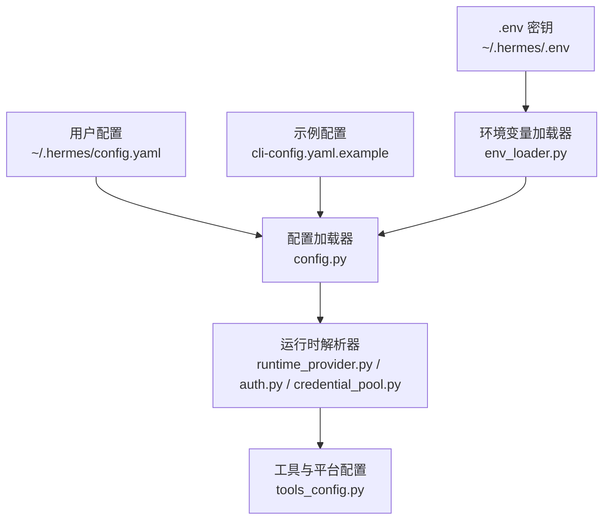
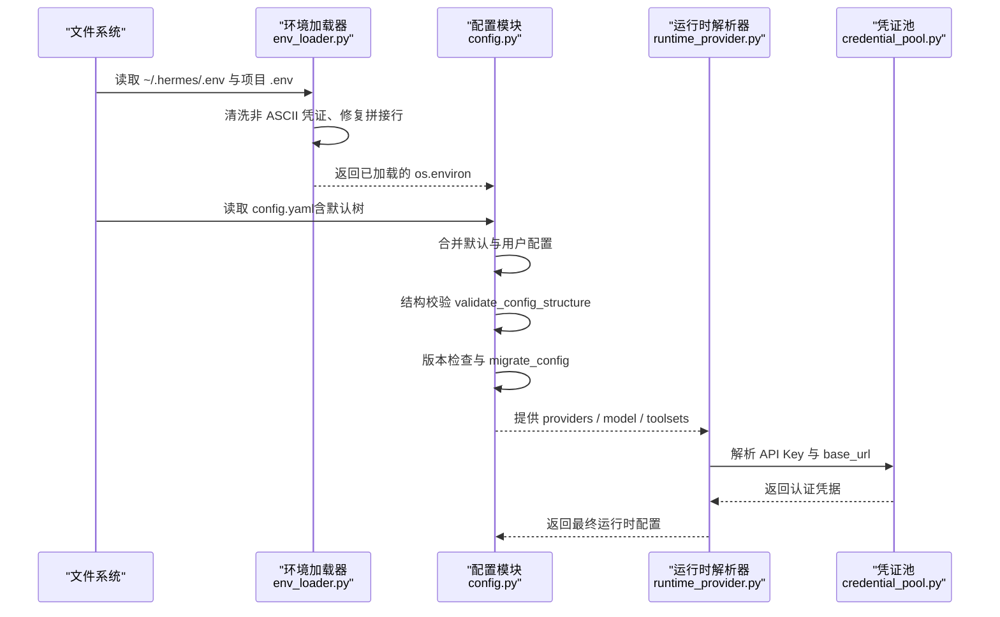
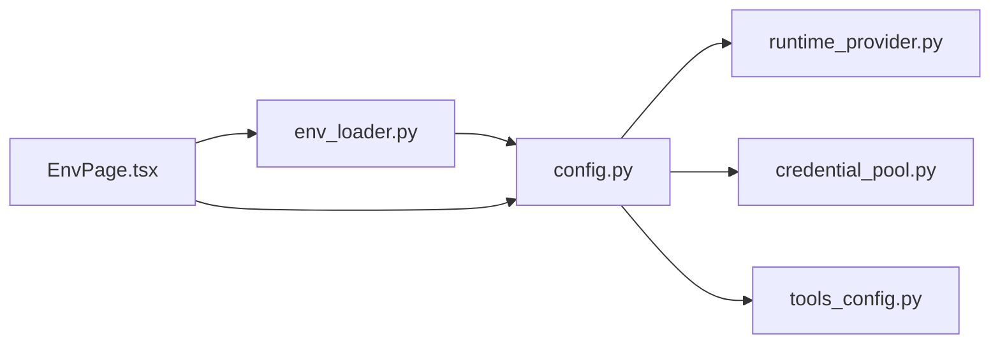

# 配置管理

<cite>
**本文引用的文件**
- [hermes_cli/config.py](file://hermes_cli/config.py)
- [hermes_cli/env_loader.py](file://hermes_cli/env_loader.py)
- [cli-config.yaml.example](file://cli-config.yaml.example)
- [hermes_cli/tools_config.py](file://hermes_cli/tools_config.py)
- [hermes_cli/runtime_provider.py](file://hermes_cli/runtime_provider.py)
- [agent/credential_pool.py](file://agent/credential_pool.py)
- [hermes_cli/auth.py](file://hermes_cli/auth.py)
- [env_loader.py](file://env_loader.py)
- [web/src/pages/EnvPage.tsx](file://web/src/pages/EnvPage.tsx)
- [optional-skills/migration/openclaw-migration/scripts/openclaw_to_hermes.py](file://optional-skills/migration/openclaw-migration/scripts/openclaw_to_hermes.py)
- [tests/hermes_cli/test_config_validation.py](file://tests/hermes_cli/test_config_validation.py)
- [tools/env_passthrough.py](file://tools/env_passthrough.py)
- [website/docs/user-guide/security.md](file://website/docs/user-guide/security.md)
- [website/docs/user-guide/configuration.md](file://website/docs/user-guide/configuration.md)
</cite>

## 目录
1. [简介](#简介)
2. [项目结构](#项目结构)
3. [核心组件](#核心组件)
4. [架构总览](#架构总览)
5. [详细组件分析](#详细组件分析)
6. [依赖关系分析](#依赖关系分析)
7. [性能考量](#性能考量)
8. [故障排查指南](#故障排查指南)
9. [结论](#结论)
10. [附录](#附录)

## 简介
本文件系统化阐述 Hermes Agent 的配置管理系统，覆盖以下主题：
- 配置文件结构与分层（默认模板、用户覆盖、环境变量）
- 环境变量管理策略（加载顺序、清洗、权限与安全）
- 动态配置更新与多环境支持（版本迁移、增量补丁）
- 模型提供商配置、API 密钥管理、工具启用/禁用
- 安全配置最佳实践（敏感信息保护、访问控制、审计）
- 配置继承、覆盖与优先级规则
- 典型配置示例与常见场景
- 配置验证、错误处理与回滚机制
- 配置迁移与备份恢复

## 项目结构
Hermes 配置体系由“配置文件 + 环境变量 + 运行时解析器”三部分组成：
- 用户配置：~/.hermes/config.yaml（主配置）与 ~/.hermes/.env（密钥）
- 示例与默认：cli-config.yaml.example 提供可选的 CLI 行为示例
- 加载器：统一从 .env 与项目 .env 读取并清洗，保证一致性
- 解析器：按优先级合并、校验、迁移与运行时解析

图表来源
- [hermes_cli/config.py](file://hermes_cli/config.py)
- [hermes_cli/env_loader.py](file://hermes_cli/env_loader.py)
- [cli-config.yaml.example](file://cli-config.yaml.example)
- [hermes_cli/runtime_provider.py](file://hermes_cli/runtime_provider.py)
- [hermes_cli/auth.py](file://hermes_cli/auth.py)
- [agent/credential_pool.py](file://agent/credential_pool.py)
- [hermes_cli/tools_config.py](file://hermes_cli/tools_config.py)

章节来源
- [hermes_cli/config.py](file://hermes_cli/config.py)
- [hermes_cli/env_loader.py](file://hermes_cli/env_loader.py)
- [cli-config.yaml.example](file://cli-config.yaml.example)

## 核心组件
- 配置文件与默认值
  - 默认配置树：包含模型、工具集、终端后端、显示、压缩、委托、辅助模型、记忆、网关、日志、网络、安全等键空间
  - 版本字段：_config_version 控制迁移路径
- 环境变量系统
  - 必填/可选清单：REQUIRED_ENV_VARS / OPTIONAL_ENV_VARS
  - 清洗与安全：非 ASCII 凭证剥离、权限加固（0600/0700）、容器检测
  - 跨入口点一致加载：load_hermes_dotenv
- 运行时解析
  - 自定义提供商：providers/custom_providers 合并与去重
  - 凭证池：从模型配置、环境变量、外部源注入
  - 平台工具集：按平台选择工具集与工具参数
- 验证与迁移
  - 结构校验：validate_config_structure
  - 版本迁移：migrate_config（逐版本修复与补丁）
  - 外部迁移：OpenCLAW 到 Hermes 的 .env 与配置迁移脚本

章节来源
- [hermes_cli/config.py](file://hermes_cli/config.py)
- [hermes_cli/env_loader.py](file://hermes_cli/env_loader.py)
- [hermes_cli/runtime_provider.py](file://hermes_cli/runtime_provider.py)
- [agent/credential_pool.py](file://agent/credential_pool.py)
- [hermes_cli/tools_config.py](file://hermes_cli/tools_config.py)

## 架构总览
下图展示配置从磁盘到运行时的完整流程：加载、清洗、合并、校验、迁移、解析。

图表来源
- [hermes_cli/env_loader.py](file://hermes_cli/env_loader.py)
- [hermes_cli/config.py](file://hermes_cli/config.py)
- [hermes_cli/runtime_provider.py](file://hermes_cli/runtime_provider.py)
- [agent/credential_pool.py](file://agent/credential_pool.py)

## 详细组件分析

### 配置文件结构与默认树
- 关键键空间
  - model：provider、base_url、api_key、上下文长度、输出上限等
  - providers / custom_providers：自定义提供商列表与键控字典
  - toolsets / platform_toolsets：按平台启用的工具集
  - terminal：后端（local/ssh/docker/singularity/modal/daytona）、资源限制、持久化、工作目录
  - display / compression / delegation / auxiliary / memory / security / logging / network
- 默认树与版本
  - DEFAULT_CONFIG 包含所有键的默认值与注释
  - _config_version 控制迁移步骤，避免破坏性变更

章节来源
- [hermes_cli/config.py](file://hermes_cli/config.py)
- [cli-config.yaml.example](file://cli-config.yaml.example)

### 环境变量管理策略
- 加载顺序与覆盖
  - ~/.hermes/.env 优先于 shell 导出的同名变量
  - 项目 .env 作为开发回退，仅在用户 .env 缺失时填充缺失项
- 清洗与安全
  - 非 ASCII 凭证剥离（_CREDENTIAL_SUFFIXES）
  - 文件权限加固（0600/0700），容器模式跳过
  - 支持 HERMES_HOME_MODE 与 HERMES_SKIP_CHMOD 覆盖
- 变量分类
  - 提供商类（OPENROUTER_API_KEY、GOOGLE_API_KEY 等）
  - 工具类（FIRECRAWL_API_KEY、TAVILY_API_KEY 等）
  - 平台类（TELEGRAM_BOT_TOKEN、DISCORD_BOT_TOKEN 等）
  - 设置类（HERMES_MAX_ITERATIONS、SUDO_PASSWORD 等）

章节来源
- [hermes_cli/env_loader.py](file://hermes_cli/env_loader.py)
- [hermes_cli/config.py](file://hermes_cli/config.py)

### 动态配置更新与多环境支持
- 版本迁移
  - migrate_config 逐版本修复：如 tool_progress 迁移、timezone 增补、providers 字典化、stt.model 分层迁移等
  - 旧变量清理：如 ANTHROPIC_TOKEN、LLM_MODEL、OPENAI_MODEL 等
- 结构校验
  - validate_config_structure 捕获 YAML 常见格式问题（custom_providers 类型、字段错位等）
- 外部迁移
  - OpenCLAW 到 Hermes 的 .env 与配置迁移脚本，支持冲突检测与备份

章节来源
- [hermes_cli/config.py](file://hermes_cli/config.py)
- [tests/hermes_cli/test_config_validation.py](file://tests/hermes_cli/test_config_validation.py)
- [optional-skills/migration/openclaw-migration/scripts/openclaw_to_hermes.py](file://optional-skills/migration/openclaw-migration/scripts/openclaw_to_hermes.py)

### 模型提供商配置与 API 密钥管理
- 提供商解析
  - runtime_provider 解析 providers/custom_providers，生成运行时可用的 provider 映射
  - 支持 key_env、api_mode、默认模型、上下文长度、速率限制延迟等
- 凭证注入
  - credential_pool 从模型配置、环境变量、外部源注入 API Key
  - auth 解析 API Key 提供商的 base_url 与来源
- 工具集与提供商联动
  - tools_config 将工具集与提供商映射，按需提示配置（如 TTS、Web 搜索）

章节来源
- [hermes_cli/runtime_provider.py](file://hermes_cli/runtime_provider.py)
- [agent/credential_pool.py](file://agent/credential_pool.py)
- [hermes_cli/auth.py](file://hermes_cli/auth.py)
- [hermes_cli/tools_config.py](file://hermes_cli/tools_config.py)

### 工具启用/禁用与平台配置
- 平台工具集
  - platform_toolsets 支持按平台定制工具集（CLI、Telegram、Discord、WhatsApp、Slack、QQ 等）
  - 支持预设组合（hermes-cli、hermes-telegram 等）或自定义组合
- 工具集 UI 与交互
  - tools_config 提供交互式工具集开关与提供商选择
  - web/src/pages/EnvPage.tsx 展示与编辑环境变量（含分组与高级过滤）

章节来源
- [hermes_cli/tools_config.py](file://hermes_cli/tools_config.py)
- [web/src/pages/EnvPage.tsx](file://web/src/pages/EnvPage.tsx)

### 安全配置最佳实践
- 敏感信息保护
  - 环境变量清洗（非 ASCII 凭证剥离）
  - 文件权限加固（0600/0700），容器模式跳过
  - 日志与输出中的敏感信息脱敏（security.redact_secrets）
- 访问控制
  - 平台令牌与允许列表（TELEGRAM_ALLOWED_USERS、DISCORD_ALLOWED_USERS 等）
  - API 服务器鉴权（API_SERVER_KEY）、绑定地址（API_SERVER_HOST）
- 生产部署建议
  - 使用容器后端、限制资源、设置明确允许列表、DM 配对、审查命令白名单、设置 MESSAGING_CWD、非 root 运行、监控日志、定期更新

章节来源
- [website/docs/user-guide/security.md](file://website/docs/user-guide/security.md)
- [website/docs/user-guide/configuration.md](file://website/docs/user-guide/configuration.md)
- [hermes_cli/config.py](file://hermes_cli/config.py)

### 配置继承、覆盖与优先级规则
- 优先级（从高到低）
  1) 用户配置（~/.hermes/config.yaml）
  2) CLI 示例配置（cli-config.yaml.example）
  3) 环境变量（~/.hermes/.env 优先于 shell 导出）
  4) 项目 .env（开发回退）
  5) 默认树（DEFAULT_CONFIG）
- 继承与覆盖
  - 深度合并（_deep_merge）保留嵌套默认值
  - providers 与 custom_providers 的兼容视图（去重、名称/URL 对唯一）
  - 结构校验确保字段不被误放至根层级

章节来源
- [hermes_cli/config.py](file://hermes_cli/config.py)
- [hermes_cli/env_loader.py](file://hermes_cli/env_loader.py)

### 配置验证、错误处理与回滚机制
- 验证
  - validate_config_structure：捕获 YAML 错误、字段错位、类型不符
  - print_config_warnings：启动时打印警告，引导使用 hermes doctor
- 错误处理
  - 环境文件损坏自动修复（_sanitize_env_lines、_sanitize_env_file_if_needed）
  - 迁移失败不影响启动（best-effort）
- 回滚
  - 迁移前可进行备份（openclaw 迁移脚本记录 backup）
  - .env 修复写回原文件，必要时可手动回滚

章节来源
- [hermes_cli/config.py](file://hermes_cli/config.py)
- [tests/hermes_cli/test_config_validation.py](file://tests/hermes_cli/test_config_validation.py)
- [optional-skills/migration/openclaw-migration/scripts/openclaw_to_hermes.py](file://optional-skills/migration/openclaw-migration/scripts/openclaw_to_hermes.py)

### 配置迁移与备份恢复指南
- 内置迁移
  - hermes config migrate：按版本逐步迁移，自动修复与补丁
  - 迁移报告：新增的 env 与 config 条目、警告
- 外部迁移
  - openclaw-to-hermes：合并 .env、迁移配置、冲突检测、备份记录
- 备份与恢复
  - 迁移脚本在执行前可能创建备份文件
  - .env 修复后直接写回原文件；若失败可从备份恢复

章节来源
- [hermes_cli/config.py](file://hermes_cli/config.py)
- [optional-skills/migration/openclaw-migration/scripts/openclaw_to_hermes.py](file://optional-skills/migration/openclaw-migration/scripts/openclaw_to_hermes.py)

## 依赖关系分析
- 配置模块依赖
  - config.py 依赖 hermes_constants（路径与默认值）、yaml、dotenv
  - env_loader.py 依赖 dotenv、config.py 的清洗函数
  - runtime_provider.py 依赖 config.py 的 providers 解析
  - credential_pool.py 依赖 config.py 的模型配置与解析
- UI 与工具
  - web/src/pages/EnvPage.tsx 依赖 API 获取/保存环境变量
  - tools_config.py 依赖 config.py 的工具集注册与平台映射

图表来源
- [hermes_cli/config.py](file://hermes_cli/config.py)
- [hermes_cli/env_loader.py](file://hermes_cli/env_loader.py)
- [hermes_cli/runtime_provider.py](file://hermes_cli/runtime_provider.py)
- [agent/credential_pool.py](file://agent/credential_pool.py)
- [hermes_cli/tools_config.py](file://hermes_cli/tools_config.py)
- [web/src/pages/EnvPage.tsx](file://web/src/pages/EnvPage.tsx)

章节来源
- [hermes_cli/config.py](file://hermes_cli/config.py)
- [hermes_cli/env_loader.py](file://hermes_cli/env_loader.py)
- [hermes_cli/runtime_provider.py](file://hermes_cli/runtime_provider.py)
- [agent/credential_pool.py](file://agent/credential_pool.py)
- [hermes_cli/tools_config.py](file://hermes_cli/tools_config.py)
- [web/src/pages/EnvPage.tsx](file://web/src/pages/EnvPage.tsx)

## 性能考量
- 配置加载
  - 仅在启动时加载与解析，后续通过缓存与上下文变量复用
- 环境变量
  - 一次性清洗与权限加固，避免重复 IO
- 迁移
  - 仅在版本变更时触发，增量补丁减少开销
- 工具与平台
  - 工具集按平台懒加载，避免不必要的初始化

## 故障排查指南
- 启动时报“未知提供商”
  - 使用 hermes doctor 查看结构警告
  - 检查 custom_providers 是否为列表、字段是否缩进正确
- .env 读取异常
  - 检查是否存在拼接的 KEY=VALUE 行，运行 sanitize_env_file 或让加载器自动修复
  - 确认文件权限为 0600
- 迁移失败或配置未生效
  - 查看迁移报告与警告
  - 手动回滚备份文件或重新执行迁移
- 平台无响应或鉴权失败
  - 核对平台令牌与允许列表
  - 检查 API 服务器绑定与鉴权配置

章节来源
- [hermes_cli/config.py](file://hermes_cli/config.py)
- [tests/hermes_cli/test_config_validation.py](file://tests/hermes_cli/test_config_validation.py)

## 结论
Hermes 的配置管理以“默认树 + 用户覆盖 + 环境变量 + 运行时解析”为核心，配合严格的结构校验、版本迁移与安全策略，实现了跨平台、多提供商、可扩展的配置体系。通过清晰的优先级与继承规则，用户可在不同环境中稳定地管理模型、工具与平台能力，并在变更时获得可靠的验证、回滚与迁移支持。

## 附录
- 常用配置键参考
  - 模型：model.provider / model.base_url / model.api_key
  - 工具集：platform_toolsets.{cli, telegram, discord, ...}
  - 终端：terminal.backend / terminal.cwd / terminal.docker_* / terminal.persistent_shell
  - 显示：display.tool_progress / display.platforms
  - 安全：security.redact_secrets / security.tirith_enabled
- 环境变量示例（节选）
  - 提供商：OPENROUTER_API_KEY、GOOGLE_API_KEY、GEMINI_API_KEY、XAI_API_KEY、GLM_API_KEY、ZAI_API_KEY、KIMI_API_KEY、ARCEEAI_API_KEY、MINIMAX_API_KEY、MINIMAX_CN_API_KEY、HF_TOKEN、OLLAMA_API_KEY、XIAOMI_API_KEY、AWS_REGION、AWS_PROFILE
  - 工具：FIRECRAWL_API_KEY、TAVILY_API_KEY、BROWSERBASE_API_KEY、BROWSERBASE_PROJECT_ID、FAL_KEY、TINKER_API_KEY、WANDB_API_KEY、VOICE_TOOLS_OPENAI_KEY、ELEVENLABS_API_KEY、MISTRAL_API_KEY、GITHUB_TOKEN
  - 平台：TELEGRAM_BOT_TOKEN、DISCORD_BOT_TOKEN、SLACK_BOT_TOKEN、SLACK_APP_TOKEN、MATTERMOST_URL、MATTERMOST_TOKEN、MATRIX_HOMESERVER、MATRIX_ACCESS_TOKEN、BLUEBUBBLES_SERVER_URL、BLUEBUBBLES_PASSWORD、QQ_*、API_SERVER_*、WEBHOOK_*

章节来源
- [hermes_cli/config.py](file://hermes_cli/config.py)
- [cli-config.yaml.example](file://cli-config.yaml.example)