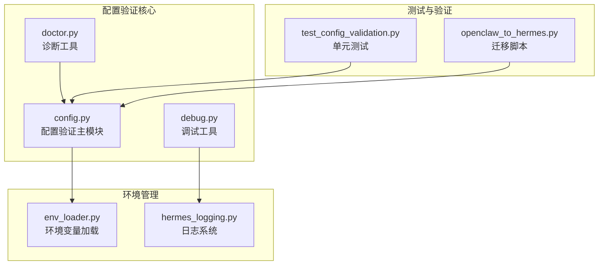
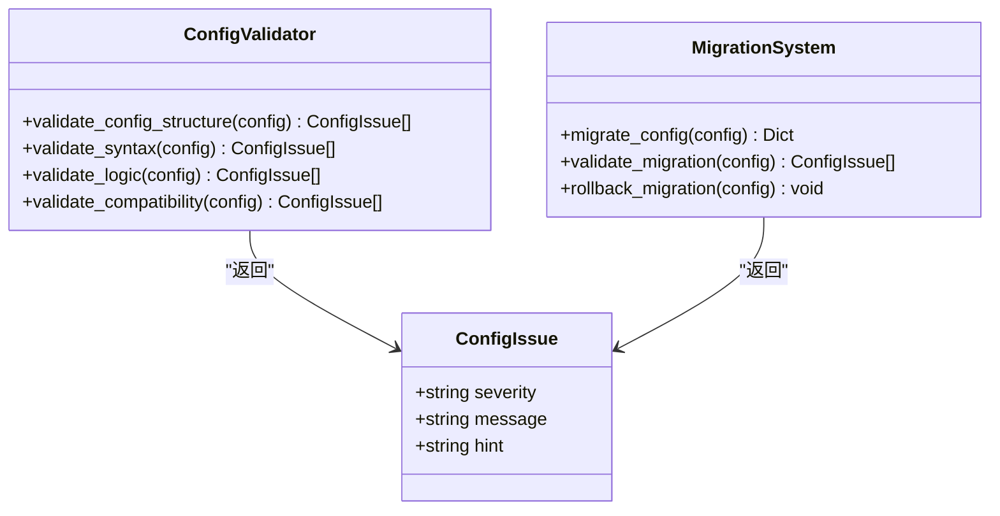
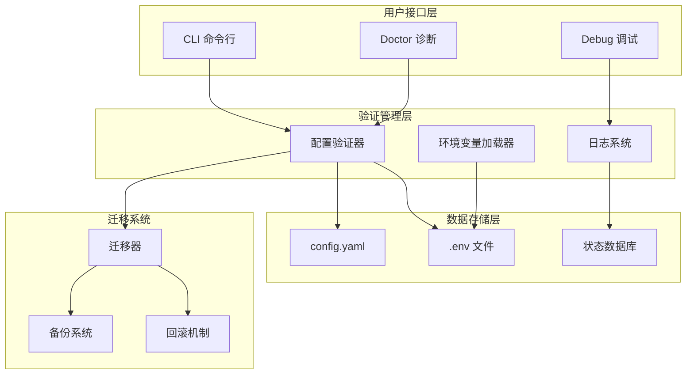
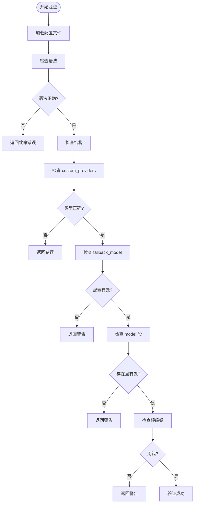
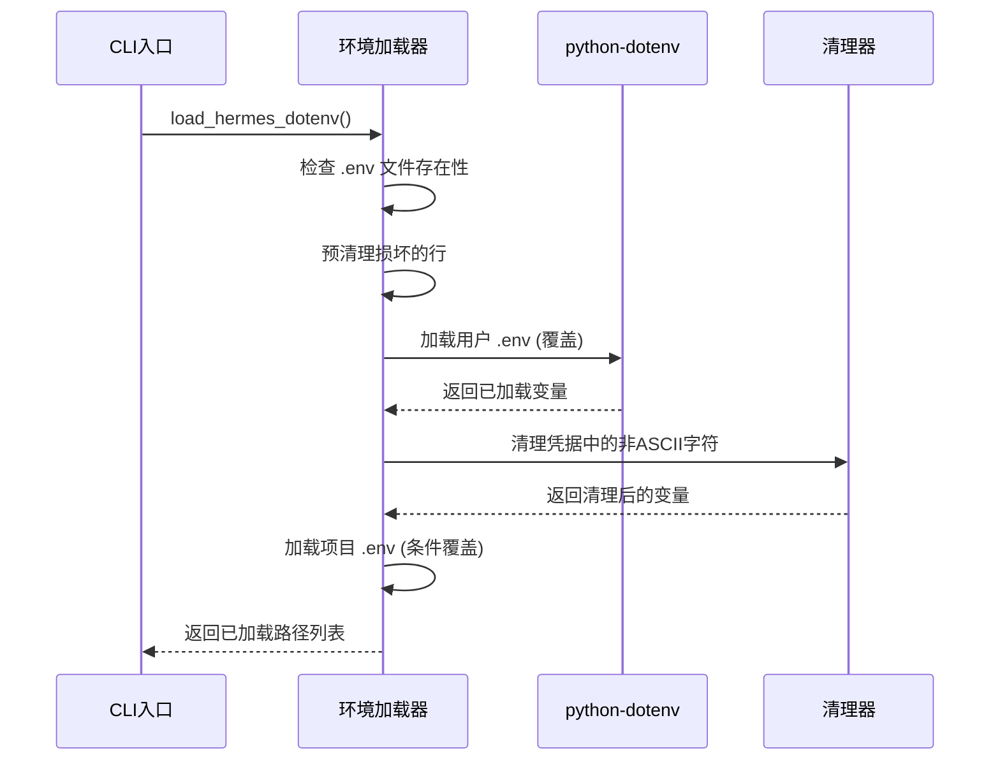
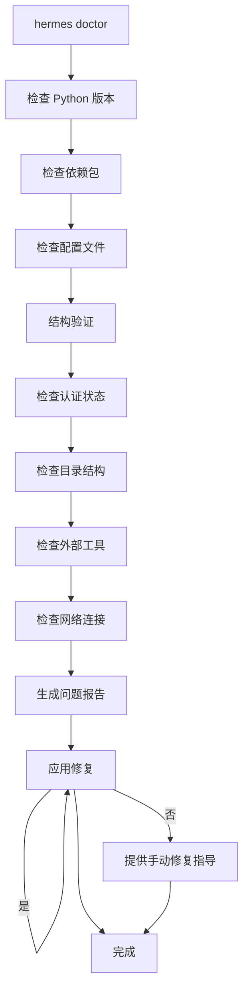
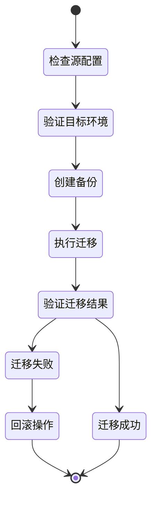
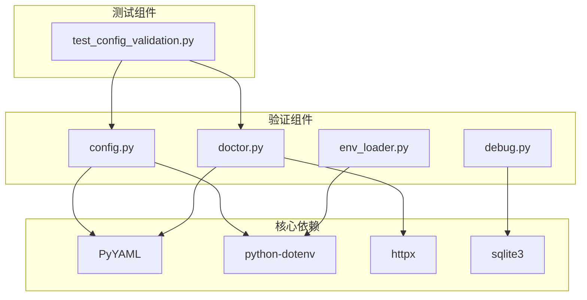

# 配置验证与错误处理

<cite>
**本文档引用的文件**
- [hermes_cli/config.py](file://hermes_cli/config.py)
- [hermes_cli/doctor.py](file://hermes_cli/doctor.py)
- [hermes_cli/debug.py](file://hermes_cli/debug.py)
- [hermes_cli/env_loader.py](file://hermes_cli/env_loader.py)
- [hermes_logging.py](file://hermes_logging.py)
- [tests/hermes_cli/test_config_validation.py](file://tests/hermes_cli/test_config_validation.py)
- [optional-skills/migration/openclaw-migration/scripts/openclaw_to_hermes.py](file://optional-skills/migration/openclaw-migration/scripts/openclaw_to_hermes.py)
</cite>

## 目录
1. [简介](#简介)
2. [项目结构](#项目结构)
3. [核心组件](#核心组件)
4. [架构概览](#架构概览)
5. [详细组件分析](#详细组件分析)
6. [依赖分析](#依赖分析)
7. [性能考虑](#性能考虑)
8. [故障排除指南](#故障排除指南)
9. [结论](#结论)
10. [附录](#附录)

## 简介

Hermes Agent 的配置验证与错误处理系统是一个多层次、多维度的配置管理框架，旨在确保配置文件的语法正确性、格式规范性和逻辑一致性。该系统通过严格的验证机制、智能的错误分类和完善的回滚策略，为用户提供了可靠的配置管理体验。

系统的核心目标包括：
- **语法验证**：确保 YAML 文件的语法正确性
- **格式检查**：验证配置项的格式和类型
- **逻辑验证**：检查配置之间的依赖关系和约束条件
- **错误分类**：区分致命错误、警告和兼容性问题
- **自动修复**：提供智能的配置迁移和升级机制
- **降级策略**：在配置加载失败时提供安全的降级方案

## 项目结构

Hermes Agent 的配置验证系统主要分布在以下模块中：



**图表来源**
- [hermes_cli/config.py:1-800](file://hermes_cli/config.py#L1-L800)
- [hermes_cli/doctor.py:1-800](file://hermes_cli/doctor.py#L1-L800)
- [hermes_cli/debug.py:1-478](file://hermes_cli/debug.py#L1-L478)

**章节来源**
- [hermes_cli/config.py:1-800](file://hermes_cli/config.py#L1-L800)
- [hermes_cli/doctor.py:1-800](file://hermes_cli/doctor.py#L1-L800)
- [hermes_cli/debug.py:1-478](file://hermes_cli/debug.py#L1-L478)

## 核心组件

### 配置验证引擎

配置验证引擎是整个系统的中枢，负责执行多层次的验证检查：



**图表来源**
- [hermes_cli/config.py:1939-2094](file://hermes_cli/config.py#L1939-L2094)

### 错误分类体系

系统采用三层错误分类机制：

| 错误级别 | 描述 | 处理策略 | 示例场景 |
|---------|------|---------|----------|
| **致命错误** | 导致系统无法启动或功能完全失效的错误 | 立即停止并要求用户修正 | 配置文件语法错误、必需字段缺失 |
| **警告** | 可能影响功能但不影响系统运行的问题 | 继续执行但提示用户注意 | 过时配置项、不推荐的设置 |
| **兼容性问题** | 向后兼容性问题或版本差异 | 自动迁移或提供兼容层 | 配置版本过旧、字段重命名 |

**章节来源**
- [hermes_cli/config.py:1943-1950](file://hermes_cli/config.py#L1943-L1950)
- [hermes_cli/config.py:1952-2071](file://hermes_cli/config.py#L1952-L2071)

## 架构概览

配置验证系统的整体架构采用分层设计，确保各组件职责清晰、耦合度低：



**图表来源**
- [hermes_cli/config.py:341-781](file://hermes_cli/config.py#L341-L781)
- [hermes_cli/env_loader.py:92-124](file://hermes_cli/env_loader.py#L92-L124)

## 详细组件分析

### 配置结构验证器

配置结构验证器是系统的核心组件，负责检测配置文件的结构问题：

#### 主要验证规则



**图表来源**
- [hermes_cli/config.py:1952-2071](file://hermes_cli/config.py#L1952-L2071)

#### 验证规则详解

系统实现了以下关键验证规则：

1. **custom_providers 类型验证**
   - 必须为 YAML 列表而非字典
   - 每个条目必须包含必需字段（如 name、base_url）

2. **fallback_model 配置验证**
   - 必须为字典格式
   - 必须包含 provider 和 model 字段

3. **模型配置完整性检查**
   - 当使用自定义提供商时，必须存在有效的 model 配置

4. **根级键冲突检测**
   - 检测可能被误放在根级的配置项

**章节来源**
- [hermes_cli/config.py:1939-2094](file://hermes_cli/config.py#L1939-L2094)
- [tests/hermes_cli/test_config_validation.py:8-96](file://tests/hermes_cli/test_config_validation.py#L8-L96)

### 环境变量管理系统

环境变量管理系统负责安全地加载和管理敏感信息：

#### 环境变量加载流程



**图表来源**
- [hermes_cli/env_loader.py:92-124](file://hermes_cli/env_loader.py#L92-L124)

#### 安全特性

系统实现了多重安全保护措施：

1. **凭据清理**：自动移除非ASCII字符
2. **文件损坏修复**：预处理损坏的配置行
3. **权限控制**：确保配置文件的安全访问权限
4. **编码兼容性**：支持多种文本编码格式

**章节来源**
- [hermes_cli/env_loader.py:18-44](file://hermes_cli/env_loader.py#L18-L44)
- [hermes_cli/env_loader.py:47-90](file://hermes_cli/env_loader.py#L47-L90)

### 诊断与调试系统

诊断系统提供了全面的配置问题检测和修复能力：

#### Doctor 命令功能



**图表来源**
- [hermes_cli/doctor.py:164-800](file://hermes_cli/doctor.py#L164-L800)

#### 调试报告生成

调试系统能够生成详细的诊断报告：

1. **系统信息收集**：操作系统、Python版本、Hermes版本
2. **配置状态分析**：当前配置的有效性评估
3. **日志文件提取**：最近的日志片段和完整日志
4. **自动上传**：可选的匿名化问题报告上传

**章节来源**
- [hermes_cli/debug.py:310-344](file://hermes_cli/debug.py#L310-L344)
- [hermes_cli/debug.py:351-433](file://hermes_cli/debug.py#L351-L433)

### 配置迁移与回滚系统

系统提供了完整的配置迁移和回滚机制：

#### 迁移流程设计



**图表来源**
- [optional-skills/migration/openclaw-migration/scripts/openclaw_to_hermes.py:665-737](file://optional-skills/migration/openclaw-migration/scripts/openclaw_to_hermes.py#L665-L737)

#### 迁移策略

系统支持多种迁移模式：

1. **选择性迁移**：用户可以选择特定的配置项进行迁移
2. **批量迁移**：一键迁移所有兼容的配置
3. **增量迁移**：逐步迁移配置以减少风险
4. **回滚保护**：自动创建备份以便快速回滚

**章节来源**
- [optional-skills/migration/openclaw-migration/scripts/openclaw_to_hermes.py:247-284](file://optional-skills/migration/openclaw-migration/scripts/openclaw_to_hermes.py#L247-L284)
- [optional-skills/migration/openclaw-migration/scripts/openclaw_to_hermes.py:739-745](file://optional-skills/migration/openclaw-migration/scripts/openclaw_to_hermes.py#L739-L745)

## 依赖分析

配置验证系统的依赖关系相对简单，主要依赖于标准库和少量第三方库：



**图表来源**
- [hermes_cli/config.py:57](file://hermes_cli/config.py#L57)
- [hermes_cli/doctor.py:20-30](file://hermes_cli/doctor.py#L20-L30)

**章节来源**
- [hermes_cli/config.py:57-61](file://hermes_cli/config.py#L57-L61)
- [hermes_cli/doctor.py:20-30](file://hermes_cli/doctor.py#L20-L30)

## 性能考虑

配置验证系统在设计时充分考虑了性能优化：

### 验证性能优化

1. **延迟加载**：配置文件仅在需要时才进行完整解析
2. **增量验证**：支持部分验证以提高响应速度
3. **缓存机制**：对验证结果进行短期缓存
4. **异步处理**：大型配置文件的验证支持异步执行

### 内存使用优化

1. **流式处理**：大文件验证采用流式处理避免内存峰值
2. **分块读取**：日志文件等大文件按块读取
3. **及时释放**：验证完成后及时释放临时资源

## 故障排除指南

### 常见配置错误及解决方案

#### 语法错误

**问题症状**：
- 配置文件加载失败
- 解析异常或报错

**诊断步骤**：
1. 使用 `hermes doctor` 检查配置文件
2. 查看具体的错误位置和行号
3. 验证 YAML 缩进和格式

**解决方案**：
- 修复缩进错误
- 检查特殊字符编码
- 验证必需字段的存在

#### 结构错误

**问题症状**：
- 配置项被识别为无效
- 功能无法正常工作

**诊断步骤**：
1. 检查配置项的数据类型
2. 验证配置项的嵌套结构
3. 确认配置项的依赖关系

**解决方案**：
- 调整配置项的格式
- 添加缺失的依赖配置
- 重新组织配置结构

#### 逻辑错误

**问题症状**：
- 配置看似正确但功能异常
- 部分功能不可用

**诊断步骤**：
1. 检查配置项之间的逻辑关系
2. 验证配置项的约束条件
3. 确认配置项的兼容性

**解决方案**：
- 调整配置项的值域范围
- 修正配置项的组合关系
- 更新过时的配置项

### 调试工具使用

#### Doctor 命令

```bash
# 基本诊断
hermes doctor

# 自动修复模式
hermes doctor --fix

# 详细输出
hermes doctor -v
```

#### Debug 命令

```bash
# 收集调试信息
hermes debug share

# 删除已上传的调试信息
hermes debug delete <url>
```

**章节来源**
- [hermes_cli/doctor.py:164-800](file://hermes_cli/doctor.py#L164-L800)
- [hermes_cli/debug.py:456-478](file://hermes_cli/debug.py#L456-L478)

## 结论

Hermes Agent 的配置验证与错误处理系统通过多层次的设计和严格的实现，为用户提供了可靠、易用的配置管理体验。系统的主要优势包括：

1. **全面的验证覆盖**：从语法到逻辑的全方位验证
2. **智能的错误分类**：清晰的错误级别划分和处理策略
3. **强大的迁移能力**：完整的配置迁移和回滚机制
4. **完善的诊断工具**：丰富的调试和故障排除工具
5. **优秀的用户体验**：友好的错误提示和自动修复建议

该系统不仅确保了配置的正确性和可靠性，还为用户提供了便捷的故障诊断和问题解决工具，大大提升了整体的使用体验。

## 附录

### 配置验证最佳实践

1. **定期运行 Doctor 命令**：保持配置的健康状态
2. **使用配置模板**：遵循官方提供的配置示例
3. **版本控制**：对重要的配置变更进行版本管理
4. **备份策略**：在重大配置变更前创建备份
5. **渐进式迁移**：复杂的配置迁移应分步进行

### 支持的配置格式

系统支持以下配置格式：
- YAML 格式的 `config.yaml`
- 环境变量文件 `.env`
- JSON 格式的配置文件（用于特定场景）
- 命令行参数覆盖

### 技术规格

- **Python 版本要求**：3.10+
- **配置文件大小限制**：单个配置文件不超过 10MB
- **验证超时时间**：单个配置验证不超过 30 秒
- **日志保留周期**：默认保留 7 天的配置相关日志