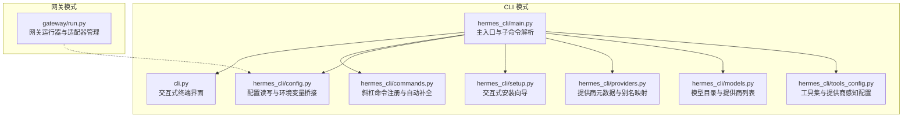
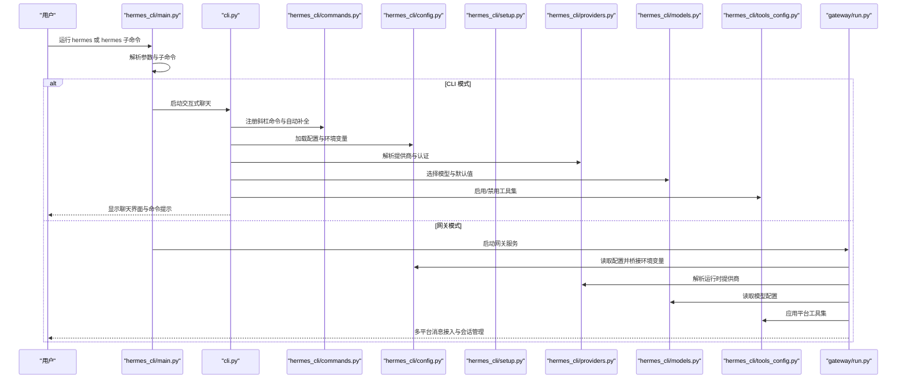
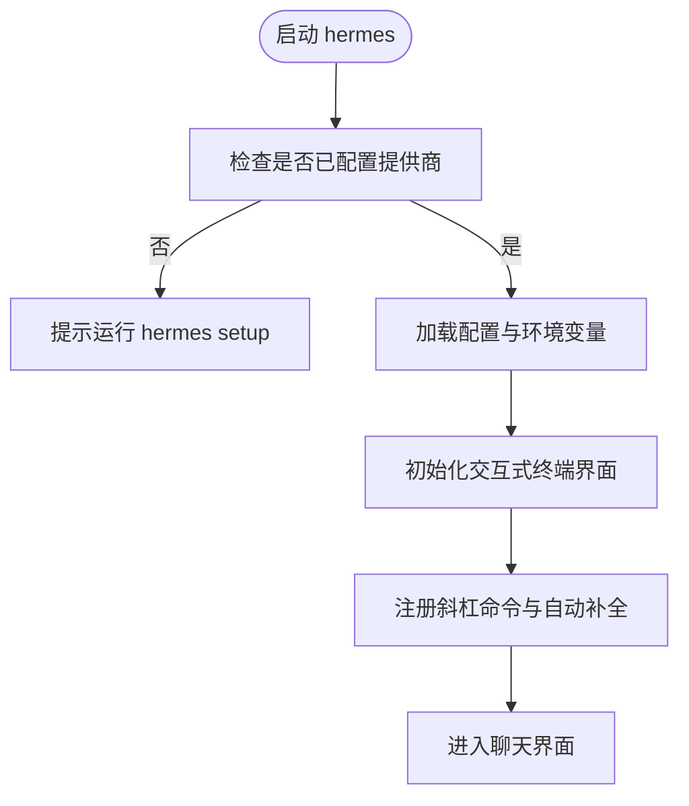
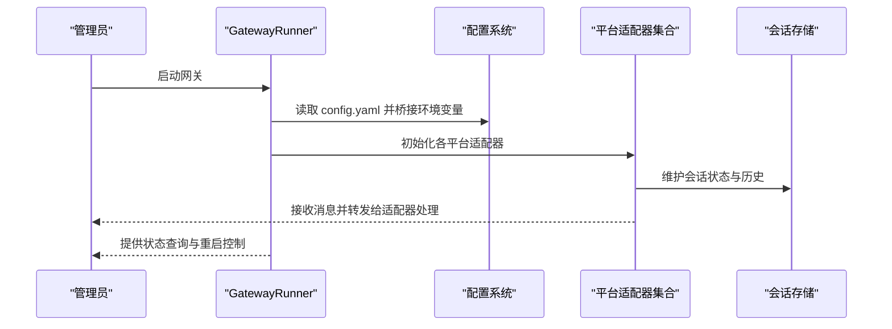
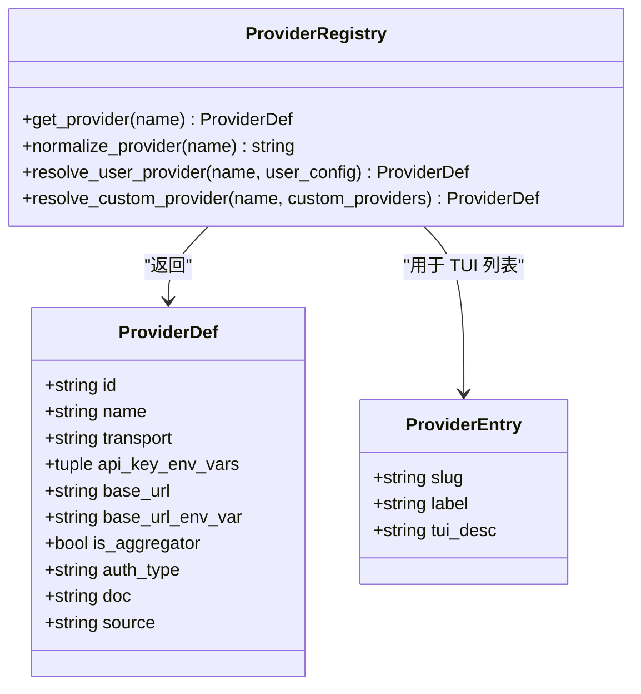
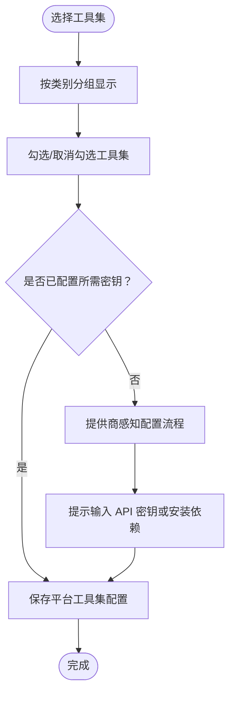
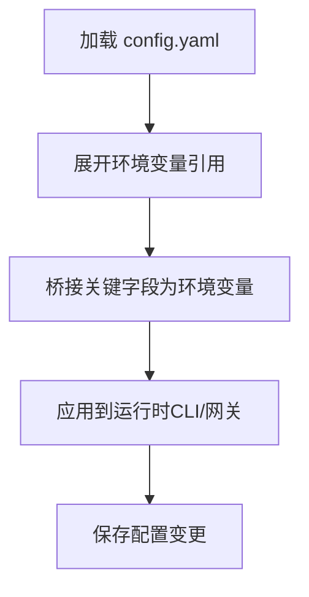
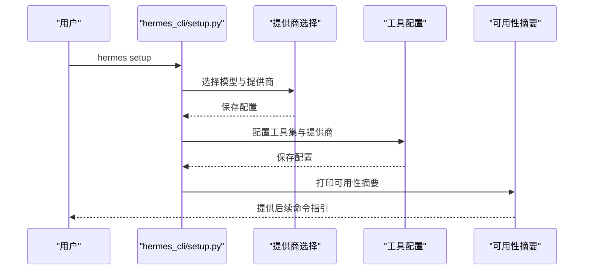
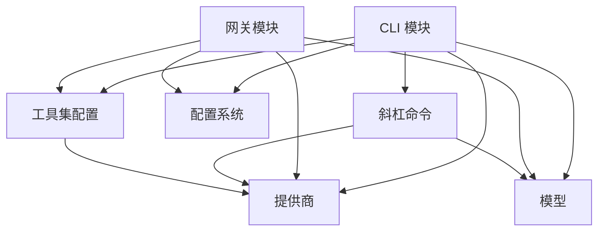

# 快速入门指南

<cite>
**本文档引用的文件**
- [README.md](file://README.md)
- [hermes_cli/main.py](file://hermes_cli/main.py)
- [cli.py](file://cli.py)
- [hermes_cli/commands.py](file://hermes_cli/commands.py)
- [hermes_cli/config.py](file://hermes_cli/config.py)
- [hermes_cli/setup.py](file://hermes_cli/setup.py)
- [hermes_cli/providers.py](file://hermes_cli/providers.py)
- [hermes_cli/models.py](file://hermes_cli/models.py)
- [hermes_cli/tools_config.py](file://hermes_cli/tools_config.py)
- [gateway/run.py](file://gateway/run.py)
</cite>

## 目录
1. [简介](#简介)
2. [项目结构](#项目结构)
3. [核心组件](#核心组件)
4. [架构总览](#架构总览)
5. [详细组件分析](#详细组件分析)
6. [依赖关系分析](#依赖关系分析)
7. [性能考虑](#性能考虑)
8. [故障排除指南](#故障排除指南)
9. [结论](#结论)
10. [附录](#附录)

## 简介
本指南面向首次接触 Hermes Agent 的用户，提供从零开始的完整使用流程：安装、启动 CLI 交互界面、选择 LLM 提供商与模型、配置工具集、设置个性化参数，并通过实际对话示例演示如何进行简单任务查询、工具调用与技能使用。同时说明 CLI 模式与消息网关两种使用模式的区别与适用场景，并提供常用斜杠命令参考与故障排除建议。

## 项目结构
Hermes Agent 采用模块化设计，核心入口分为 CLI 与网关两类运行形态：
- CLI 模式：直接在终端启动交互式聊天界面，适合个人使用与本地开发。
- 网关模式：统一接入多平台（Telegram、Discord、Slack、WhatsApp、Signal 等），实现跨平台消息流转与会话管理。

**图表来源**
- [hermes_cli/main.py:1-120](file://hermes_cli/main.py#L1-L120)
- [cli.py:1-120](file://cli.py#L1-L120)
- [hermes_cli/commands.py:1-120](file://hermes_cli/commands.py#L1-L120)
- [hermes_cli/config.py:1-120](file://hermes_cli/config.py#L1-L120)
- [hermes_cli/setup.py:1-120](file://hermes_cli/setup.py#L1-L120)
- [hermes_cli/providers.py:1-120](file://hermes_cli/providers.py#L1-L120)
- [hermes_cli/models.py:1-120](file://hermes_cli/models.py#L1-L120)
- [hermes_cli/tools_config.py:1-120](file://hermes_cli/tools_config.py#L1-L120)
- [gateway/run.py:1-120](file://gateway/run.py#L1-L120)

**章节来源**
- [README.md:30-84](file://README.md#L30-L84)
- [hermes_cli/main.py:1-120](file://hermes_cli/main.py#L1-L120)

## 核心组件
- 主入口与子命令解析：负责解析 hermes 命令及其子命令（如 hermes、hermes model、hermes tools、hermes config、hermes gateway 等），并根据参数执行相应逻辑。
- 交互式终端界面：提供 TUI 聊天体验，支持多行编辑、斜杠命令自动补全、会话历史、中断重定向与工具输出流式显示。
- 斜杠命令系统：集中定义所有可用命令（如 /new、/model、/tools、/skills、/usage、/insights 等），并在 CLI 与网关中共享。
- 配置系统：统一管理 config.yaml 与 .env，桥接环境变量，支持显示当前配置、设置单项值、编辑配置文件等。
- 安装向导：引导用户完成模型提供商选择、终端后端、代理设置、消息平台连接与工具配置。
- 提供商与模型：内置多家提供商（OpenRouter、Nous Portal、Anthropic、GitHub Copilot、阿里云 DashScope、AWS Bedrock 等）与模型目录，支持别名映射与默认模型选择。
- 工具集配置：按提供商感知的方式启用/禁用工具集（如 Web 搜索、浏览器自动化、终端、文件操作、代码执行、视觉分析、图像生成、TTS、技能、任务规划、记忆、会话搜索、澄清问题、任务委托、定时任务、跨平台消息、RL 训练、智能家居等）。

**章节来源**
- [hermes_cli/main.py:1-120](file://hermes_cli/main.py#L1-L120)
- [cli.py:1-120](file://cli.py#L1-L120)
- [hermes_cli/commands.py:1-120](file://hermes_cli/commands.py#L1-L120)
- [hermes_cli/config.py:1-120](file://hermes_cli/config.py#L1-L120)
- [hermes_cli/setup.py:1-120](file://hermes_cli/setup.py#L1-L120)
- [hermes_cli/providers.py:1-120](file://hermes_cli/providers.py#L1-L120)
- [hermes_cli/models.py:1-120](file://hermes_cli/models.py#L1-L120)
- [hermes_cli/tools_config.py:1-120](file://hermes_cli/tools_config.py#L1-L120)

## 架构总览
下图展示了 CLI 与网关两种模式的运行时关系与关键组件交互：

**图表来源**
- [hermes_cli/main.py:1-120](file://hermes_cli/main.py#L1-L120)
- [cli.py:1-120](file://cli.py#L1-L120)
- [hermes_cli/commands.py:1-120](file://hermes_cli/commands.py#L1-L120)
- [hermes_cli/config.py:1-120](file://hermes_cli/config.py#L1-L120)
- [hermes_cli/setup.py:1-120](file://hermes_cli/setup.py#L1-L120)
- [hermes_cli/providers.py:1-120](file://hermes_cli/providers.py#L1-L120)
- [hermes_cli/models.py:1-120](file://hermes_cli/models.py#L1-L120)
- [hermes_cli/tools_config.py:1-120](file://hermes_cli/tools_config.py#L1-L120)
- [gateway/run.py:1-120](file://gateway/run.py#L1-L120)

## 详细组件分析

### CLI 模式：启动与交互
- 启动流程：hermes 命令默认进入交互式聊天；若未检测到任何提供商配置，将提示先运行 hermes setup 完成首次配置。
- 交互界面：支持多行输入、斜杠命令自动补全、会话历史查看、工具进度显示、流式输出等。
- 关键特性：支持工作树隔离（git 工作树）、资源清理（终端 VM、浏览器会话）、内存提供者关闭钩子等。

**图表来源**
- [hermes_cli/main.py:676-784](file://hermes_cli/main.py#L676-L784)
- [cli.py:535-652](file://cli.py#L535-L652)

**章节来源**
- [hermes_cli/main.py:676-784](file://hermes_cli/main.py#L676-L784)
- [cli.py:535-652](file://cli.py#L535-L652)

### 网关模式：多平台接入
- 运行器：GatewayRunner 负责生命周期管理、适配器启动、消息路由、会话存储、后台任务与重启策略。
- 配置桥接：从 config.yaml 读取配置并桥接到环境变量，确保各平台适配器可正确获取终端、压缩、辅助模型等设置。
- 平台适配：支持 Telegram、Discord、Slack、WhatsApp、Signal、邮件等多种平台，具备配对、权限控制、线程/私聊隔离等功能。

**图表来源**
- [gateway/run.py:554-740](file://gateway/run.py#L554-L740)
- [hermes_cli/config.py:90-220](file://hermes_cli/config.py#L90-L220)

**章节来源**
- [gateway/run.py:554-740](file://gateway/run.py#L554-L740)
- [hermes_cli/config.py:90-220](file://hermes_cli/config.py#L90-L220)

### 模型与提供商选择
- 提供商识别：统一的提供商元数据与别名映射，支持 OpenRouter、Nous Portal、Anthropic、GitHub Copilot、阿里云 DashScope、AWS Bedrock 等。
- 模型目录：内置多家提供商的模型清单，支持默认模型选择与免费模型过滤。
- 运行时解析：根据配置与环境变量解析最终使用的提供商与模型，支持自定义端点与凭据池轮换。

**图表来源**
- [hermes_cli/providers.py:159-430](file://hermes_cli/providers.py#L159-L430)
- [hermes_cli/models.py:525-620](file://hermes_cli/models.py#L525-L620)

**章节来源**
- [hermes_cli/providers.py:159-430](file://hermes_cli/providers.py#L159-L430)
- [hermes_cli/models.py:525-620](file://hermes_cli/models.py#L525-L620)

### 工具集与提供商感知配置
- 工具集分类：Web 搜索与提取、浏览器自动化、终端与进程、文件操作、代码执行、视觉分析、图像生成、混合智能体、文本转语音、技能、任务规划、记忆、会话搜索、澄清问题、任务委托、定时任务、跨平台消息、RL 训练、智能家居等。
- 提供商感知：针对不同工具集（如 TTS、Web、图像生成、浏览器）提供多种提供商选项，自动提示所需 API 密钥或安装步骤。
- 平台工具集：按平台（CLI、Telegram、Discord、Slack、WhatsApp、QQ 等）分别保存启用的工具集，支持默认工具集与插件工具集。

**图表来源**
- [hermes_cli/tools_config.py:44-120](file://hermes_cli/tools_config.py#L44-L120)
- [hermes_cli/tools_config.py:788-800](file://hermes_cli/tools_config.py#L788-L800)

**章节来源**
- [hermes_cli/tools_config.py:44-120](file://hermes_cli/tools_config.py#L44-L120)
- [hermes_cli/tools_config.py:788-800](file://hermes_cli/tools_config.py#L788-L800)

### 配置系统与环境变量桥接
- 配置文件：config.yaml 与 .env 分别存放通用设置与敏感信息；config.yaml 具有更高优先级。
- 环境变量桥接：将 config.yaml 中的关键字段（如终端、压缩、辅助模型、代理超时等）桥接为环境变量，供运行时读取。
- 配置读写：支持显示当前配置、设置单项值、打开编辑器、打印警告与迁移提示等。

**图表来源**
- [hermes_cli/config.py:90-220](file://hermes_cli/config.py#L90-L220)
- [gateway/run.py:90-220](file://gateway/run.py#L90-L220)

**章节来源**
- [hermes_cli/config.py:90-220](file://hermes_cli/config.py#L90-L220)
- [gateway/run.py:90-220](file://gateway/run.py#L90-L220)

### 交互式安装向导
- 步骤：模型与提供商 → 终端后端 → 代理设置 → 消息平台 → 工具配置。
- 自动化：自动检测订阅与可用性，提示缺失的 API 密钥或依赖项；支持快速设置与非交互模式。
- 总结：完成后列出可用工具类别与缺失项，提供后续命令指引。

**图表来源**
- [hermes_cli/setup.py:620-700](file://hermes_cli/setup.py#L620-L700)
- [hermes_cli/setup.py:344-572](file://hermes_cli/setup.py#L344-L572)

**章节来源**
- [hermes_cli/setup.py:620-700](file://hermes_cli/setup.py#L620-L700)
- [hermes_cli/setup.py:344-572](file://hermes_cli/setup.py#L344-L572)

## 依赖关系分析
- CLI 与网关共享命令注册与配置系统，确保命令一致性与跨平台体验。
- 提供商与模型模块为 CLI 与网关提供统一的提供商解析与模型选择能力。
- 工具集配置模块在 CLI 与网关中复用，按平台区分启用的工具集。
- 网关模式通过配置桥接将 config.yaml 的权威设置传递给各平台适配器。

**图表来源**
- [hermes_cli/main.py:1-120](file://hermes_cli/main.py#L1-L120)
- [hermes_cli/commands.py:1-120](file://hermes_cli/commands.py#L1-L120)
- [hermes_cli/config.py:1-120](file://hermes_cli/config.py#L1-L120)
- [hermes_cli/providers.py:1-120](file://hermes_cli/providers.py#L1-L120)
- [hermes_cli/models.py:1-120](file://hermes_cli/models.py#L1-L120)
- [hermes_cli/tools_config.py:1-120](file://hermes_cli/tools_config.py#L1-L120)
- [gateway/run.py:1-120](file://gateway/run.py#L1-L120)

**章节来源**
- [hermes_cli/main.py:1-120](file://hermes_cli/main.py#L1-L120)
- [hermes_cli/commands.py:1-120](file://hermes_cli/commands.py#L1-L120)
- [hermes_cli/config.py:1-120](file://hermes_cli/config.py#L1-L120)
- [hermes_cli/providers.py:1-120](file://hermes_cli/providers.py#L1-L120)
- [hermes_cli/models.py:1-120](file://hermes_cli/models.py#L1-L120)
- [hermes_cli/tools_config.py:1-120](file://hermes_cli/tools_config.py#L1-L120)
- [gateway/run.py:1-120](file://gateway/run.py#L1-L120)

## 性能考虑
- 上下文压缩：当接近模型上下文限制时自动触发压缩，减少 token 使用并保持对话连贯。
- 智能模型路由：对简单问题使用低成本模型，复杂任务切换到更强大的模型，降低总体成本。
- 流式输出：终端与工具输出采用流式渲染，提升响应速度与用户体验。
- 资源隔离：容器与远程后端（Docker、Modal、Singularity、Daytona、SSH）提供资源隔离与持久化选项，避免本地资源占用。

[本节为通用指导，不涉及具体文件分析]

## 故障排除指南
- 首次运行提示未配置提供商：请运行 hermes setup 完成模型与提供商选择，或使用 hermes model 与 hermes tools 进行单项配置。
- 网络连接问题：可启用强制 IPv4（network.force_ipv4）以规避 IPv6 相关超时。
- 平台连接失败：检查对应平台的令牌与配置，必要时重新运行 hermes setup 对应步骤。
- 工具不可用：确认所需 API 密钥是否已配置，或按照提示安装 Node.js 依赖（如浏览器工具）。
- 日志与诊断：使用 hermes doctor 查看配置与依赖状态，或查看 ~/.hermes/logs 下的日志文件定位问题。

**章节来源**
- [hermes_cli/main.py:708-734](file://hermes_cli/main.py#L708-L734)
- [hermes_cli/config.py:770-781](file://hermes_cli/config.py#L770-L781)
- [hermes_cli/tools_config.py:380-451](file://hermes_cli/tools_config.py#L380-L451)
- [README.md:60-63](file://README.md#L60-L63)

## 结论
通过本快速入门指南，您已掌握从安装到首次对话的完整流程，理解了 CLI 与网关两种使用模式的差异与适用场景，并熟悉了核心命令与工具集配置方法。建议在日常使用中结合 hermes doctor 与日志排查常见问题，逐步探索更多斜杠命令与平台功能，以充分发挥 Hermes Agent 的多模态与多平台能力。

[本节为总结性内容，不涉及具体文件分析]

## 附录

### 常用命令与快捷方式
- hermes：启动交互式聊天
- hermes model：选择 LLM 提供商与模型
- hermes tools：配置工具集与提供商
- hermes config：查看/编辑配置
- hermes gateway：启动/停止/状态查看网关
- hermes setup：运行完整安装向导
- hermes doctor：诊断配置与依赖
- hermes update：更新到最新版本

**章节来源**
- [README.md:51-63](file://README.md#L51-L63)

### CLI 与消息网关使用模式对比
- CLI 模式：适合个人本地使用，提供完整的 TUI 体验与斜杠命令。
- 网关模式：适合团队协作与多平台接入，统一管理消息、会话与权限。

**章节来源**
- [README.md:67-84](file://README.md#L67-L84)

### 第一次对话示例（概念性）
- 在 CLI 模式下输入自然语言任务描述，系统根据模型与工具集自动选择合适工具并执行。
- 使用斜杠命令快速切换模型、查看用量、压缩上下文、浏览技能等。
- 在网关模式下，从任意支持的平台发送消息即可触发相同流程。

[本节为概念性说明，不涉及具体文件分析]