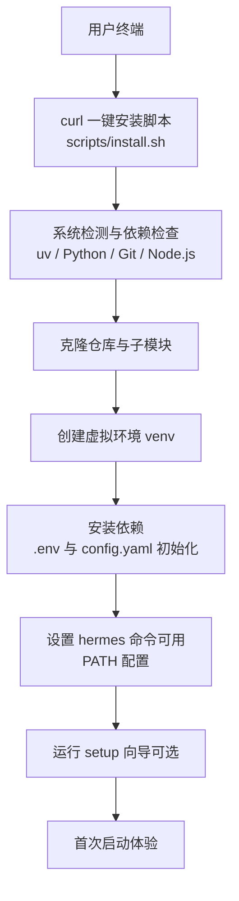
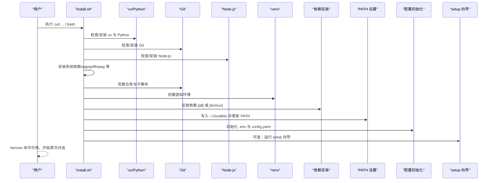
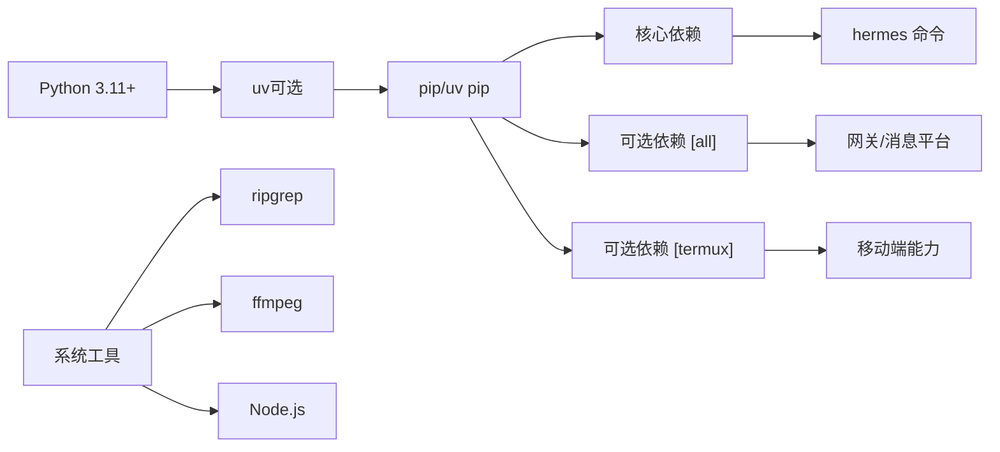

# 快速安装

<cite>
**本文引用的文件**
- [README.md](file://README.md)
- [install.sh](file://scripts/install.sh)
- [install.ps1](file://scripts/install.ps1)
- [install.cmd](file://scripts/install.cmd)
- [setup-hermes.sh](file://setup-hermes.sh)
- [pyproject.toml](file://pyproject.toml)
- [constraints-termux.txt](file://constraints-termux.txt)
- [hermes_constants.py](file://hermes_constants.py)
- [doctor.py](file://hermes_cli/doctor.py)
- [termux.md](file://website/docs/getting-started/termux.md)
</cite>

## 目录
1. [简介](#简介)
2. [项目结构](#项目结构)
3. [核心组件](#核心组件)
4. [架构总览](#架构总览)
5. [详细组件分析](#详细组件分析)
6. [依赖关系分析](#依赖关系分析)
7. [性能考虑](#性能考虑)
8. [故障排查指南](#故障排查指南)
9. [结论](#结论)
10. [附录](#附录)

## 简介
本指南面向希望快速安装并开始使用 Hermes Agent 的用户，覆盖 Linux、macOS、WSL2、Android/Termux 四大平台的一键安装流程与注意事项。内容基于仓库内置的安装脚本与文档，确保从安装到首次启动的完整路径清晰可操作。

## 项目结构
Hermes Agent 提供统一的安装入口，按平台自动选择最佳安装路径：
- Linux/macOS：推荐使用 curl 一键安装脚本，自动处理 uv、Python、虚拟环境、依赖安装、PATH 配置与默认配置生成。
- Windows：不直接支持原生安装，需先安装 WSL2，再在 WSL2 中执行 Linux/macOS 的一键安装命令。
- Android/Termux：通过专门的安装脚本与约束文件，仅安装经测试的 Android 兼容包，避免非 Android 轮子导致的构建失败。

图示来源
- [install.sh:1380-1403](file://scripts/install.sh#L1380-L1403)
- [install.ps1:885-909](file://scripts/install.ps1#L885-L909)

章节来源
- [README.md:30-48](file://README.md#L30-L48)
- [install.sh:1380-1403](file://scripts/install.sh#L1380-L1403)

## 核心组件
- 一键安装脚本（Linux/macOS）：负责系统检测、依赖安装、仓库克隆、虚拟环境与依赖安装、PATH 设置、配置初始化与可选的 setup 向导。
- Windows 安装器（PowerShell）：在 Windows 上安装 uv、Python、Git、Node.js，并在本地或通过 winget/choco/scoop 安装系统依赖，随后完成仓库克隆、虚拟环境与依赖安装、PATH 设置、配置初始化与可选的 gateway 启动。
- WSL2 检测：通过读取 /proc/version 判断是否运行于 WSL 环境，以便在 Linux 平台下区分 WSL 与原生日志。
- Doctor 诊断工具：用于验证安装后环境状态，定位缺失的系统工具、配置文件、API 密钥等常见问题。

章节来源
- [install.sh:1-1403](file://scripts/install.sh#L1-L1403)
- [install.ps1:1-920](file://scripts/install.ps1#L1-L920)
- [hermes_constants.py:171-196](file://hermes_constants.py#L171-L196)
- [doctor.py:164-1149](file://hermes_cli/doctor.py#L164-L1149)

## 架构总览
下图展示从用户执行安装命令到首次启动的关键步骤与交互：

图示来源
- [install.sh:1380-1403](file://scripts/install.sh#L1380-L1403)
- [install.ps1:885-909](file://scripts/install.ps1#L885-L909)

## 详细组件分析

### 一键安装（Linux/macOS）
- 安装入口与平台识别
  - 使用 curl 一键安装脚本，自动识别 Linux、macOS、Android/Termux 与 Windows（提示使用 WSL2）。
  - 在 Windows 检测到时，输出 PowerShell 安装器的调用方式。
- 依赖检查与安装
  - uv：优先使用 uv 进行 Python 版本管理与包安装；若未找到则在线安装。
  - Python：要求 Python 3.11+，找不到时通过 uv 自动安装。
  - Git：如未安装，按发行版提示安装。
  - Node.js：如未安装，按平台自动安装或提示手动安装。
  - 系统依赖：ripgrep（更快的文件搜索）、ffmpeg（TTS/媒体转换），Termux 下通过 pkg 安装，其他平台通过包管理器或可选安装。
- 仓库与子模块
  - 支持 SSH 与 HTTPS 克隆，HTTPS 失败时回退。
  - 子模块初始化（tinker-atropos 等），失败时给出提示。
- 虚拟环境与依赖
  - 在 Linux/macOS 默认使用 uv 创建 venv 并安装依赖；若 uv 锁定文件不可用则回退到 pip。
  - Android/Termux 使用标准库 venv 与 pip，并安装经测试的 [termux] 包集合。
- PATH 与 hermes 命令
  - 在 Linux/macOS 将 ~/.local/bin 加入 PATH，并在该目录创建 hermes 可执行文件的符号链接。
  - 在 Android/Termux 将 $PREFIX/bin 加入 PATH，并在该目录创建 hermes 符号链接。
- 配置初始化
  - 在 ~/.hermes 目录创建必要的子目录与模板文件（.env、config.yaml、SOUL.md）。
- 可选：gateway 服务
  - 若检测到消息平台令牌，询问是否安装 systemd 服务（Linux）或后台运行（其他平台）。
- 可选：setup 向导
  - 安装完成后可直接运行 setup 向导进行 API 密钥与基础配置。

章节来源
- [README.md:30-48](file://README.md#L30-L48)
- [install.sh:159-194](file://scripts/install.sh#L159-L194)
- [install.sh:200-255](file://scripts/install.sh#L200-L255)
- [install.sh:257-299](file://scripts/install.sh#L257-L299)
- [install.sh:301-351](file://scripts/install.sh#L301-L351)
- [install.sh:353-378](file://scripts/install.sh#L353-L378)
- [install.sh:489-660](file://scripts/install.sh#L489-L660)
- [install.sh:685-765](file://scripts/install.sh#L685-L765)
- [install.sh:767-797](file://scripts/install.sh#L767-L797)
- [install.sh:799-904](file://scripts/install.sh#L799-L904)
- [install.sh:1020-1084](file://scripts/install.sh#L1020-L1084)
- [install.sh:1086-1175](file://scripts/install.sh#L1086-L1175)
- [install.sh:1177-1204](file://scripts/install.sh#L1177-L1204)
- [install.sh:1206-1296](file://scripts/install.sh#L1206-L1296)
- [install.sh:1298-1374](file://scripts/install.sh#L1298-L1374)

### Windows（WSL2）安装
- Windows 本机不支持直接安装，需先安装 WSL2。
- 在 WSL2 中执行 Linux/macOS 的一键安装命令，行为与 Linux/macOS 一致。
- Windows 上的 PowerShell 安装器用于在 Windows 侧准备环境（uv、Python、Git、Node.js），并在 Windows 上安装系统依赖（ripgrep、ffmpeg 等），随后在 Windows 文件系统中完成仓库克隆与依赖安装。

章节来源
- [README.md:38-40](file://README.md#L38-L40)
- [install.ps1:1-920](file://scripts/install.ps1#L1-L920)

### Android/Termux 安装
- 专用安装路径
  - 使用标准库 venv 与 pip，安装经测试的 [termux] 包集合，并应用 constraints-termux.txt 约束以保证稳定性。
  - 强制设置 ANDROID_API_LEVEL，避免 Rust/maturin 构建失败。
  - 不安装 tinker-atropos（RL 训练相关），不安装浏览器/WhatsApp 工具链（不在已测试路径内）。
- 手动安装参考
  - 如需更细粒度控制，可参考官方文档中的手动安装步骤与排障建议。

章节来源
- [install.sh:800-840](file://scripts/install.sh#L800-L840)
- [constraints-termux.txt:1-16](file://constraints-termux.txt#L1-L16)
- [termux.md:52-243](file://website/docs/getting-started/termux.md#L52-L243)

### WSL2 检测
- 通过读取 /proc/version 并检查包含 “microsoft” 字样来判断是否运行于 WSL 环境，结果会缓存以避免重复 I/O。
- 该检测用于在 Linux 平台上区分 WSL 与原生日志行为。

章节来源
- [hermes_constants.py:171-196](file://hermes_constants.py#L171-L196)

## 依赖关系分析
- Python 版本与包管理
  - 要求 Python >= 3.11；Linux/macOS 优先使用 uv 管理 Python 与依赖；Windows 使用 uv 或系统 Python。
  - 依赖分组：core、messaging、cron、cli、voice、pty、honcho、mcp、acp、web、rl 等；默认安装 [all]，Android/Termux 使用 [termux]。
- 平台差异
  - Linux/macOS：ripgrep、ffmpeg、Node.js 为可选但强烈建议；浏览器自动化工具需要额外系统依赖。
  - Windows：通过 winget/choco/scoop 安装系统依赖；Node.js 通过 winget 或二进制下载安装。
  - Android/Termux：通过 pkg 安装 clang、rust、make、pkg-config、libffi、openssl 等构建工具与 nodejs、ripgrep、ffmpeg。

图示来源
- [pyproject.toml:39-115](file://pyproject.toml#L39-L115)
- [install.sh:489-660](file://scripts/install.sh#L489-L660)
- [install.ps1:289-406](file://scripts/install.ps1#L289-L406)

章节来源
- [pyproject.toml:1-137](file://pyproject.toml#L1-L137)
- [install.sh:489-660](file://scripts/install.sh#L489-L660)
- [install.ps1:289-406](file://scripts/install.ps1#L289-L406)

## 性能考虑
- 依赖安装性能
  - 优先使用 uv 与锁定文件（uv.lock）进行哈希校验安装，提升一致性与速度；若锁定文件过期则回退到 pip。
  - Android/Termux 使用标准库 venv 与 pip，配合 constraints-termux.txt 保持稳定版本组合。
- 搜索与文件遍历
  - 安装 ripgrep 可显著提升大项目中的文件搜索性能；未安装时将回退到 grep。
- 浏览器自动化
  - Node.js 与 Playwright 的安装可能需要额外系统依赖，按发行版提示安装对应共享库。

章节来源
- [install.sh:180-194](file://scripts/install.sh#L180-L194)
- [install.sh:1086-1175](file://scripts/install.sh#L1086-L1175)
- [install.ps1:289-406](file://scripts/install.ps1#L289-L406)

## 故障排查指南
- hermes 命令不可用
  - Linux/macOS：确认 ~/.local/bin 已加入 PATH，并检查 ~/.local/bin/hermes 是否为正确目标的符号链接。
  - Android/Termux：确认 $PREFIX/bin 已在 PATH 中，并检查 $PREFIX/bin/hermes 符号链接。
  - Windows：确认 hermes.exe 已添加到用户 PATH，并重启终端。
- Python 版本不符
  - 确保 Python 3.11+；Windows 可使用 uv 安装或系统 Python。
- 缺少系统依赖
  - ripgrep：按平台安装（apt/brew/pkg/choco/scoop）。
  - ffmpeg：按平台安装（apt/brew/pkg/choco/scoop）。
  - Node.js：按平台安装（winget/choco/scoop/pkg 或官网二进制）。
- 配置文件缺失
  - ~/.hermes/.env 与 ~/.hermes/config.yaml 由安装脚本创建；若缺失可通过 hermes doctor --fix 或手动创建。
- API 密钥未配置
  - 运行 hermes setup 或在 .env 中添加所需提供商的密钥。
- WSL2 环境识别
  - 若在 WSL2 中运行，请确认 /proc/version 包含 “microsoft”，否则可能影响部分日志与服务行为。
- Android/Termux 特有问题
  - 构建失败：确保 clang、rust、make、pkg-config、libffi、openssl 已安装。
  - ANDROID_API_LEVEL：显式设置后再安装依赖。
  - 浏览器/WhatsApp 工具链：不在已测试路径内，如需可参考官方文档的手动步骤。

章节来源
- [doctor.py:164-1149](file://hermes_cli/doctor.py#L164-L1149)
- [hermes_constants.py:171-196](file://hermes_constants.py#L171-L196)
- [install.sh:1086-1175](file://scripts/install.sh#L1086-L1175)
- [termux.md:185-243](file://website/docs/getting-started/termux.md#L185-L243)

## 结论
通过仓库提供的安装脚本与平台适配逻辑，Hermes Agent 能在主流桌面与移动平台上实现“一键安装”。建议在安装后立即运行 hermes setup 完成 API 密钥与基础配置，并使用 hermes doctor 检查环境健康状况。遇到问题时，可依据本指南与 doctor 输出逐项排查。

## 附录

### 一键安装命令与平台兼容性
- Linux/macOS（推荐）
  - curl -fsSL https://raw.githubusercontent.com/NousResearch/hermes-agent/main/scripts/install.sh | bash
- Windows
  - 先安装 WSL2，然后在 WSL2 中执行上述 Linux/macOS 一键安装命令。
  - 若需在 Windows 侧准备环境，可使用 PowerShell 安装器：irm https://raw.githubusercontent.com/NousResearch/hermes-agent/main/scripts/install.ps1 | iex
- Android/Termux
  - 使用内置安装脚本与约束文件，自动安装 [termux] 包集合。

章节来源
- [README.md:30-40](file://README.md#L30-L40)
- [install.sh:8-14](file://scripts/install.sh#L8-L14)
- [install.ps1:7-12](file://scripts/install.ps1#L7-L12)
- [install.cmd:1-29](file://scripts/install.cmd#L1-L29)

### 安装后的验证与首次启动
- 验证命令
  - hermes：进入交互式 CLI。
  - hermes status：查看配置状态。
  - hermes doctor：诊断环境问题。
- 首次启动
  - 运行 hermes setup 配置 API 密钥与基础选项。
  - 可选：hermes gateway install（Linux）或后台运行（其他平台）以启用消息平台。

章节来源
- [README.md:42-63](file://README.md#L42-L63)
- [install.sh:1298-1374](file://scripts/install.sh#L1298-L1374)
- [install.ps1:824-879](file://scripts/install.ps1#L824-L879)