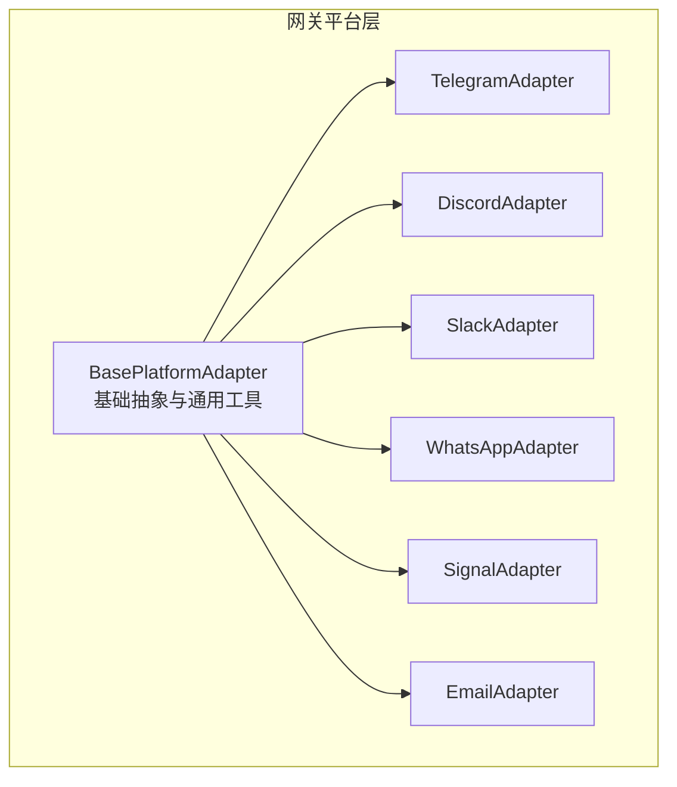
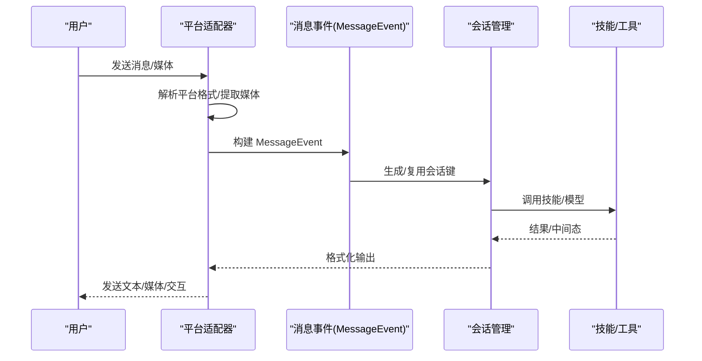
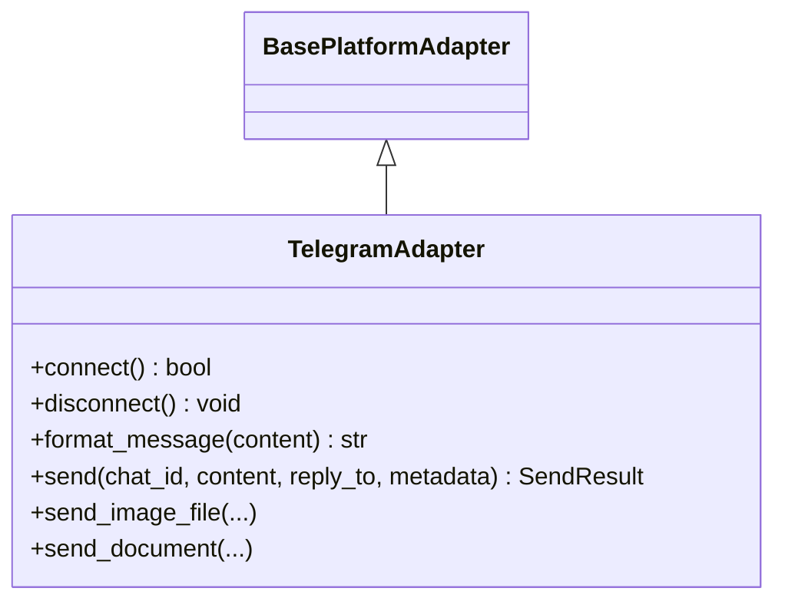
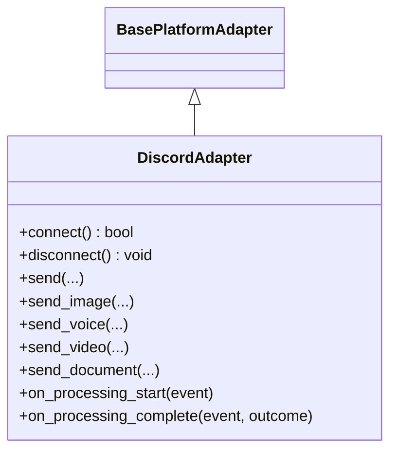
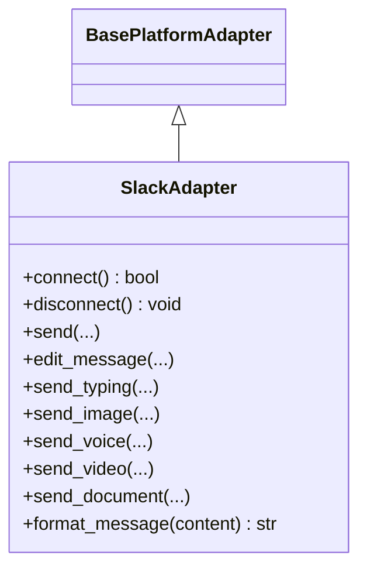
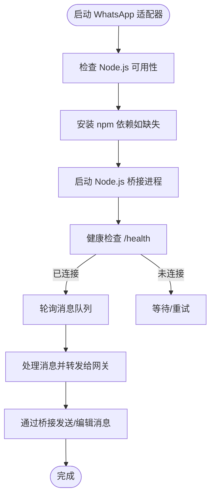
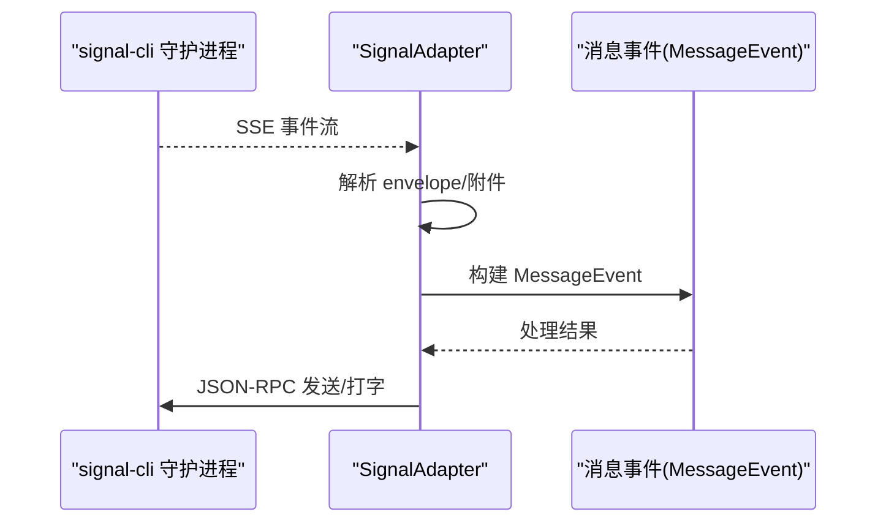
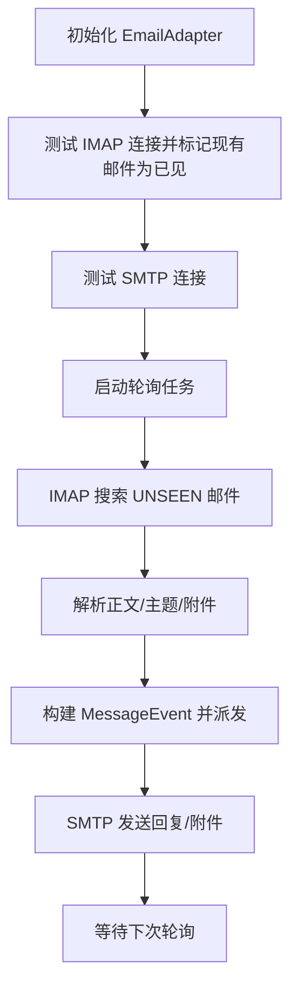
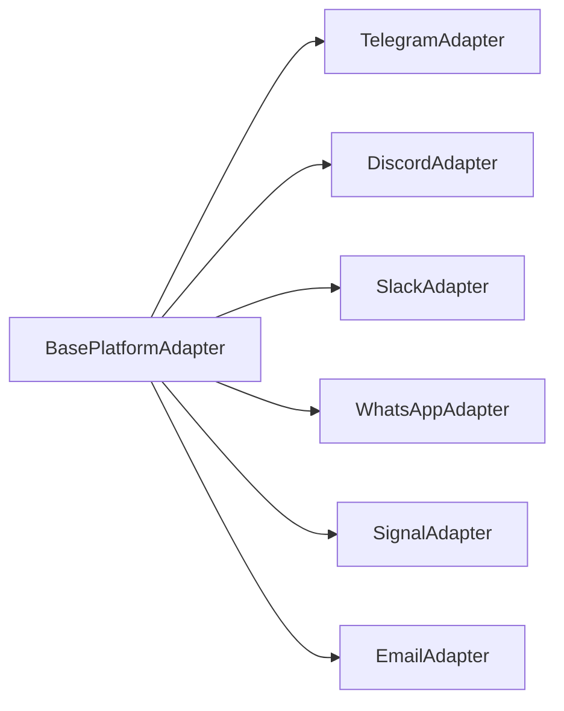

# 支持的平台

<cite>
**本文档引用的文件**
- [gateway/platforms/base.py](file://gateway/platforms/base.py)
- [gateway/platforms/telegram.py](file://gateway/platforms/telegram.py)
- [gateway/platforms/discord.py](file://gateway/platforms/discord.py)
- [gateway/platforms/slack.py](file://gateway/platforms/slack.py)
- [gateway/platforms/whatsapp.py](file://gateway/platforms/whatsapp.py)
- [gateway/platforms/signal.py](file://gateway/platforms/signal.py)
- [gateway/platforms/email.py](file://gateway/platforms/email.py)
- [gateway/platforms/__init__.py](file://gateway/platforms/__init__.py)
</cite>

## 目录
1. [简介](#简介)
2. [项目结构](#项目结构)
3. [核心组件](#核心组件)
4. [架构总览](#架构总览)
5. [详细组件分析](#详细组件分析)
6. [依赖关系分析](#依赖关系分析)
7. [性能考虑](#性能考虑)
8. [故障排除指南](#故障排除指南)
9. [结论](#结论)

## 简介
本文件系统性介绍 Hermes Agent 的平台支持能力与部署实践，覆盖 CLI 终端界面以及主流即时消息平台（Telegram、Discord、Slack、WhatsApp、Signal、Email）。文档重点阐述各平台的部署要求、配置步骤、特色功能、消息同步与会话连续性保障、跨平台一致性体验，并提供平台选择建议与最佳实践。

## 项目结构
平台适配器统一位于 gateway/platforms 目录下，采用“基类 + 多平台适配器”的分层设计：
- 基类定义通用接口、消息事件模型、媒体缓存策略、代理与网络工具等
- 各平台适配器继承基类，实现平台特定的连接、消息处理、发送与编辑、媒体上传等逻辑
- 平台注册入口集中于 __init__.py，便于统一导入与扩展

图表来源
- [gateway/platforms/base.py](file://gateway/platforms/base.py)
- [gateway/platforms/telegram.py](file://gateway/platforms/telegram.py)
- [gateway/platforms/discord.py](file://gateway/platforms/discord.py)
- [gateway/platforms/slack.py](file://gateway/platforms/slack.py)
- [gateway/platforms/whatsapp.py](file://gateway/platforms/whatsapp.py)
- [gateway/platforms/signal.py](file://gateway/platforms/signal.py)
- [gateway/platforms/email.py](file://gateway/platforms/email.py)

章节来源
- [gateway/platforms/__init__.py](file://gateway/platforms/__init__.py)
- [gateway/platforms/base.py](file://gateway/platforms/base.py)

## 核心组件
- 基类与通用工具
  - 消息事件模型：标准化文本、位置、图片、视频、音频、文档、贴纸、命令等类型
  - 发送结果封装：成功/失败、错误信息、是否可重试
  - 文本截断与合并：按平台字符限制进行拆分与拼接，避免截断代码块或表情
  - 媒体缓存：图片/音频/文档本地缓存，支持下载与路径访问
  - 代理与网络：支持 HTTP/SOCKS 代理、网络可达性检测、Telegram 回退 IP 传输
  - 去重与批处理：消息去重、快速消息合并、相册/图片批次聚合
- 平台适配器
  - Telegram：论坛主题、DM Topic、MarkdownV2 转义、Webhook/Polling、回复模式、链接预览控制
  - Discord：Slash 命令、线程自动归档、语音接收（DAVE/E2EE）、反应反馈、允许列表
  - Slack：多工作区、AI Assistant 生命周期事件、Block Kit 按钮审批、mrkdwn 转换
  - WhatsApp：Node.js 桥接、提及模式、自由响应群组、回复前缀、媒体直传
  - Signal：SSE 流式事件、JSON-RPC、打字指示、附件大小限制、自对话过滤
  - Email：IMAP 轮询、SMTP 发送、自动邮件识别、附件缓存、主题与引用链

章节来源
- [gateway/platforms/base.py](file://gateway/platforms/base.py)

## 架构总览
平台适配器通过统一的基类接口与消息事件模型，实现“接收—处理—发送”的闭环。媒体资源统一走本地缓存，确保工具链（如视觉/语音）稳定访问；平台特定能力通过适配器扩展点实现。

图表来源
- [gateway/platforms/base.py](file://gateway/platforms/base.py)
- [gateway/platforms/telegram.py](file://gateway/platforms/telegram.py)
- [gateway/platforms/discord.py](file://gateway/platforms/discord.py)
- [gateway/platforms/slack.py](file://gateway/platforms/slack.py)
- [gateway/platforms/whatsapp.py](file://gateway/platforms/whatsapp.py)
- [gateway/platforms/signal.py](file://gateway/platforms/signal.py)
- [gateway/platforms/email.py](file://gateway/platforms/email.py)

## 详细组件分析

### Telegram 平台
- 部署要求
  - 安装依赖：python-telegram-bot
  - 配置：Bot Token、可选自定义 base_url/base_file_url
  - 网络：支持代理（HTTP/SOCKS），Telegram 回退 IP 传输
  - 可选：Webhook 模式（TELEGRAM_WEBHOOK_URL/PORT/SECRET）
- 特色功能
  - 论坛主题与 DM Topic：按名称映射 thread_id，持久化到配置
  - MarkdownV2：转义与清理，避免格式污染
  - 图片/相册/媒体批处理：减少多次回合中断
  - 链接预览控制：禁用/启用
  - Polling/Webhook 自适应：网络异常自动重连
- 配置要点
  - extra.dm_topics：配置 DM 主题映射
  - HERMES_TELEGRAM_* 环境变量：连接池、超时、回退 IP
  - TELEGRAM_PROXY/TELEGRAM_WEBHOOK_*：网络与部署模式

图表来源
- [gateway/platforms/base.py](file://gateway/platforms/base.py)
- [gateway/platforms/telegram.py](file://gateway/platforms/telegram.py)

章节来源
- [gateway/platforms/telegram.py](file://gateway/platforms/telegram.py)

### Discord 平台
- 部署要求
  - 安装依赖：discord.py
  - 配置：Bot Token、Intents（消息内容、私聊、服务器消息、语音状态）
  - 可选：代理（DISCORD_PROXY）
- 特色功能
  - Slash 命令：/ask、/reset、/status、/stop
  - 线程自动归档：支持 60/1440/4320/10080 分钟
  - 语音接收：DAVE/E2EE 解密、Opus 解码、静音检测、PCM→WAV
  - 反馈反应：处理中/完成/失败
  - 允许列表：用户名/ID 白名单解析
- 配置要点
  - DISCORD_ALLOWED_USERS：授权用户
  - DISCORD_PROXY：代理
  - DISCORD_IGNORE_NO_MENTION：忽略未提及消息（兼容多代理共享频道）

图表来源
- [gateway/platforms/base.py](file://gateway/platforms/base.py)
- [gateway/platforms/discord.py](file://gateway/platforms/discord.py)

章节来源
- [gateway/platforms/discord.py](file://gateway/platforms/discord.py)

### Slack 平台
- 部署要求
  - 安装依赖：slack-bolt、slack_sdk
  - 配置：SLACK_BOT_TOKEN、SLACK_APP_TOKEN（Socket Mode）
  - 多工作区：支持逗号分隔多个 Bot Token
- 特色功能
  - Socket Mode：事件流式推送
  - AI Assistant 生命周期事件：assistant_thread_started/context_changed
  - Block Kit 按钮审批：一次性/会话/总是/拒绝
  - mrkdwn 转换：标准 Markdown → Slack 格式
  - 线程广播：reply_broadcast 控制
  - 打字指示：assistant.threads.setStatus（需权限）
- 配置要点
  - platforms.slack.extra.reply_broadcast：回复广播
  - platforms.slack.extra.dm_top_level_threads_as_sessions：DM 顶级线程作为独立会话
  - SIGNAL_GROUP_ALLOWED_USERS：群组白名单（环境变量）

图表来源
- [gateway/platforms/base.py](file://gateway/platforms/base.py)
- [gateway/platforms/slack.py](file://gateway/platforms/slack.py)

章节来源
- [gateway/platforms/slack.py](file://gateway/platforms/slack.py)

### WhatsApp 平台
- 部署要求
  - Node.js 环境可用
  - 桥接脚本：默认位于 scripts/whatsapp-bridge/bridge.js
  - 会话目录：默认在 hermes 数据目录下的 platforms/whatsapp/session
- 特色功能
  - 桥接模式：Node.js 子进程负责 Web 客户端，Python 侧负责消息编排
  - 提及模式：正则匹配触发机器人响应
  - 自由响应群组：无需提及即可回复
  - 媒体直传：图片/视频/文档通过桥接发送
  - 打字指示：通过桥接上报
- 配置要点
  - bridge_script/bridge_port/session_path：桥接参数
  - WHATSAPP_MENTION_PATTERNS/WHATSAPP_FREE_RESPONSE_CHATS：行为控制
  - WHATSAPP_REPLY_PREFIX：回复前缀透传

图表来源
- [gateway/platforms/whatsapp.py](file://gateway/platforms/whatsapp.py)

章节来源
- [gateway/platforms/whatsapp.py](file://gateway/platforms/whatsapp.py)

### Signal 平台
- 部署要求
  - signal-cli 守护进程：HTTP 模式运行（127.0.0.1:8080）
  - 环境变量：SIGNAL_HTTP_URL、SIGNAL_ACCOUNT
- 特色功能
  - SSE 事件流：实时接收消息
  - JSON-RPC：发送文本/媒体、打字指示
  - 自对话过滤：防止 Note to Self 回环
  - 附件缓存：自动识别图片/音频/文档并缓存
  - 健康监控：空闲检测与强制重连
- 配置要点
  - SIGNAL_GROUP_ALLOWED_USERS：群组白名单
  - ignore_stories：忽略动态消息
  - 必要时设置 SIGNAL_HTTP_URL 与 SIGNAL_ACCOUNT

图表来源
- [gateway/platforms/signal.py](file://gateway/platforms/signal.py)

章节来源
- [gateway/platforms/signal.py](file://gateway/platforms/signal.py)

### Email 平台
- 部署要求
  - 环境变量：EMAIL_IMAP_HOST/PORT、EMAIL_SMTP_HOST/PORT、EMAIL_ADDRESS、EMAIL_PASSWORD
  - 可选：EMAIL_POLL_INTERVAL、EMAIL_ALLOWED_USERS
- 特色功能
  - IMAP 轮询：UNSEEN 标记避免重复处理
  - SMTP 发送：自动设置 In-Reply-To/References，保持主题链
  - 自动邮件识别：跳过 noreply/自动化邮件
  - 附件缓存：图片/文档本地缓存
- 配置要点
  - platforms.email.extra.skip_attachments：跳过附件下载
  - EMAIL_* 系列环境变量：服务器与凭据
  - 自动跳过已见 UID，上限保护内存占用

图表来源
- [gateway/platforms/email.py](file://gateway/platforms/email.py)

章节来源
- [gateway/platforms/email.py](file://gateway/platforms/email.py)

## 依赖关系分析
- 平台适配器对基类的强依赖：统一的消息事件、发送结果、媒体缓存与网络工具
- 平台间共享能力
  - 文本截断与合并：避免平台字符限制导致的截断
  - 媒体缓存：图片/音频/文档本地化，提升工具链稳定性
  - 去重与批处理：降低抖动与重复处理
- 第三方库依赖
  - Telegram：python-telegram-bot
  - Discord：discord.py
  - Slack：slack-bolt、slack_sdk
  - WhatsApp：Node.js 桥接（外部）
  - Signal：signal-cli 守护进程（外部）
  - Email：标准库（email、imaplib、smtplib）

图表来源
- [gateway/platforms/base.py](file://gateway/platforms/base.py)
- [gateway/platforms/telegram.py](file://gateway/platforms/telegram.py)
- [gateway/platforms/discord.py](file://gateway/platforms/discord.py)
- [gateway/platforms/slack.py](file://gateway/platforms/slack.py)
- [gateway/platforms/whatsapp.py](file://gateway/platforms/whatsapp.py)
- [gateway/platforms/signal.py](file://gateway/platforms/signal.py)
- [gateway/platforms/email.py](file://gateway/platforms/email.py)

章节来源
- [gateway/platforms/base.py](file://gateway/platforms/base.py)
- [gateway/platforms/__init__.py](file://gateway/platforms/__init__.py)

## 性能考虑
- 连接池与超时
  - Telegram：可调连接池大小、读写超时
  - Discord：Opus 加载失败不影响运行，但会禁用语音播放
  - Slack：多工作区客户端复用
- 媒体处理
  - 缓存命中率：图片/音频/文档本地缓存，减少重复下载
  - 附件大小限制：Signal 100MB，避免大文件阻塞
- 网络与代理
  - 支持 HTTP/SOCKS 代理，Telegram 回退 IP 传输增强稳定性
- 轮询与事件
  - Email 使用 IMAP 轮询，合理设置轮询间隔
  - Slack/Signal 使用事件流，降低轮询开销

## 故障排除指南
- Telegram
  - Polling 冲突：多个实例同时运行会话冲突，需停止其他实例后重启
  - 网络错误：自动指数退避重连，超过阈值后致命错误重启
  - Webhook：确认端口与证书，验证 SECRET_TOKEN
- Discord
  - 语音：Opus 未加载会禁用播放；检查系统库路径
  - 反馈反应：权限不足时静默失败
- Slack
  - 多工作区：确保每个 Token 对应正确团队
  - assistant.threads.setStatus：权限不足时降级为反应
- WhatsApp
  - 桥接：Node.js 依赖、端口占用、会话目录权限
  - 自动重连：若长时间未连接，检查日志并重新配对
- Signal
  - SSE 空闲：健康监控强制重连
  - 附件过大：超过 100MB 将被拒绝
- Email
  - 轮询异常：IMAP/SMTP 凭据错误或网络问题
  - 自动邮件：被识别为自动化邮件将被跳过

章节来源
- [gateway/platforms/telegram.py](file://gateway/platforms/telegram.py)
- [gateway/platforms/discord.py](file://gateway/platforms/discord.py)
- [gateway/platforms/slack.py](file://gateway/platforms/slack.py)
- [gateway/platforms/whatsapp.py](file://gateway/platforms/whatsapp.py)
- [gateway/platforms/signal.py](file://gateway/platforms/signal.py)
- [gateway/platforms/email.py](file://gateway/platforms/email.py)

## 结论
Hermes Agent 的平台适配体系以统一基类为核心，结合各平台特性实现一致的用户体验与强大的扩展能力。通过媒体缓存、消息批处理、去重与网络工具，平台间实现了较好的消息同步与会话连续性。部署时建议优先评估网络与第三方服务可用性，结合业务场景选择合适平台，并遵循各平台的安全与配置最佳实践。