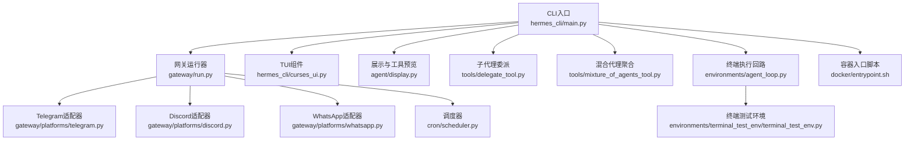
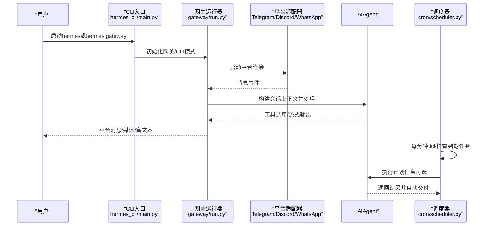
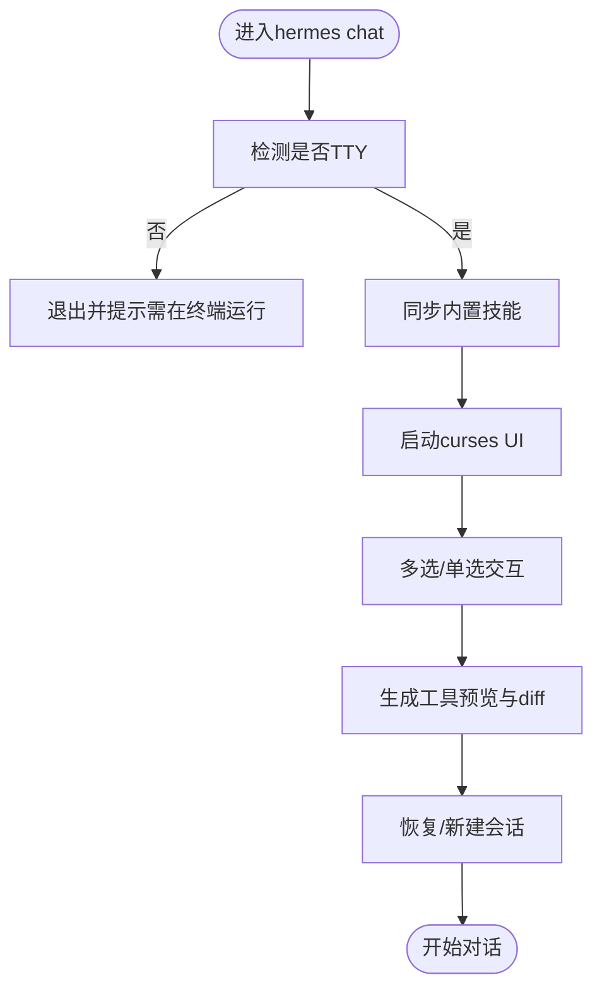
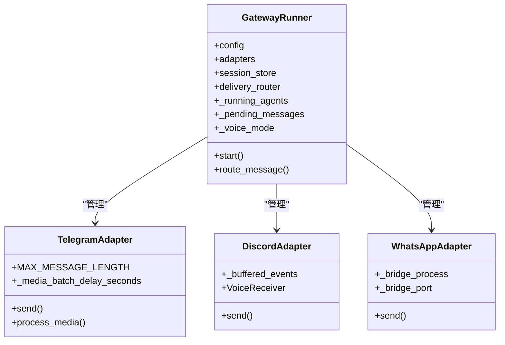
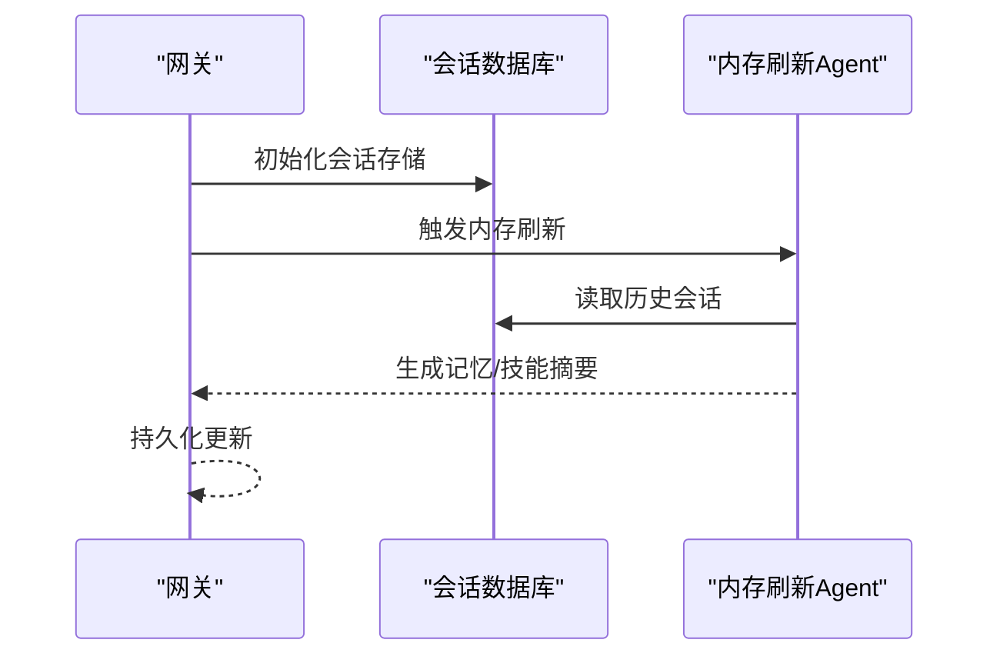
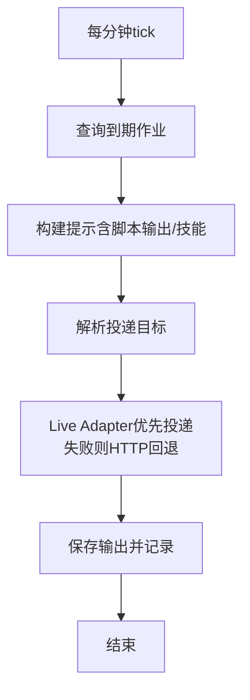
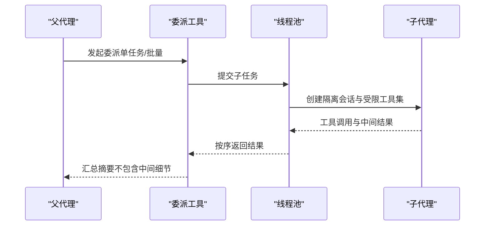
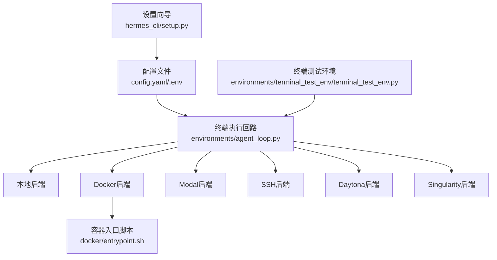
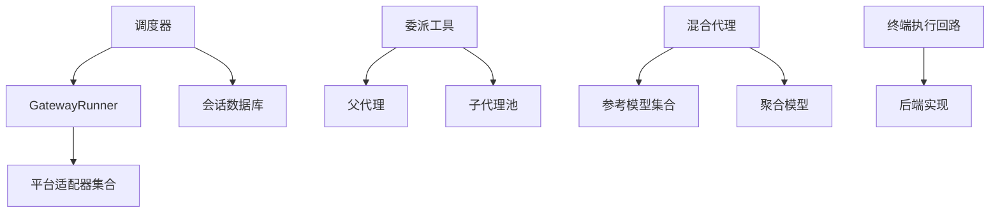

# 核心特性

<cite>
**本文引用的文件**
- [README.md](file://README.md)
- [hermes_cli/main.py](file://hermes_cli/main.py)
- [gateway/run.py](file://gateway/run.py)
- [cron/scheduler.py](file://cron/scheduler.py)
- [gateway/platforms/telegram.py](file://gateway/platforms/telegram.py)
- [gateway/platforms/discord.py](file://gateway/platforms/discord.py)
- [gateway/platforms/whatsapp.py](file://gateway/platforms/whatsapp.py)
- [hermes_cli/curses_ui.py](file://hermes_cli/curses_ui.py)
- [agent/display.py](file://agent/display.py)
- [tools/delegate_tool.py](file://tools/delegate_tool.py)
- [tools/mixture_of_agents_tool.py](file://tools/mixture_of_agents_tool.py)
- [environments/agent_loop.py](file://environments/agent_loop.py)
- [environments/terminal_test_env/terminal_test_env.py](file://environments/terminal_test_env/terminal_test_env.py)
- [docker/entrypoint.sh](file://docker/entrypoint.sh)
- [hermes_cli/setup.py](file://hermes_cli/setup.py)
</cite>

## 目录
1. [引言](#引言)
2. [项目结构](#项目结构)
3. [核心组件](#核心组件)
4. [架构总览](#架构总览)
5. [详细组件分析](#详细组件分析)
6. [依赖关系分析](#依赖关系分析)
7. [性能考量](#性能考量)
8. [故障排查指南](#故障排查指南)
9. [结论](#结论)
10. [附录](#附录)

## 引言
本文件面向Hermes Agent的六大核心特性进行系统化说明：1）实时终端界面与全TUI支持；2）多平台部署能力（CLI、Telegram、Discord、WhatsApp等）；3）内置学习循环与自主技能创建；4）定时自动化调度系统；5）子代理并行处理能力；6）跨平台运行环境支持。我们将从技术实现、使用场景与配置要点三个维度展开，并解释这些特性如何协同工作，形成端到端的智能自动化体验。

## 项目结构
Hermes Agent采用模块化分层设计：
- CLI入口与交互：通过hermes_cli/main.py提供命令行交互、会话管理、TUI组件等。
- 网关与平台适配：gateway/run.py负责生命周期管理与消息路由，各平台适配器位于gateway/platforms/下。
- 调度与自动化：cron/scheduler.py提供基于文件锁的周期任务执行与交付。
- 子代理与并行：tools/delegate_tool.py与tools/mixture_of_agents_tool.py分别实现子代理委派与混合代理聚合。
- 终端与显示：agent/display.py与hermes_cli/curses_ui.py提供工具预览、TUI反馈与本地编辑快照。
- 运行环境：environments/agent_loop.py与environments/terminal_test_env/terminal_test_env.py支撑多后端终端执行与测试验证。
- 部署与跨平台：docker/entrypoint.sh与hermes_cli/setup.py提供容器化与多后端终端配置。

图表来源
- [hermes_cli/main.py:1-800](file://hermes_cli/main.py#L1-L800)
- [gateway/run.py:1-800](file://gateway/run.py#L1-L800)
- [cron/scheduler.py:1-800](file://cron/scheduler.py#L1-L800)
- [gateway/platforms/telegram.py:1-200](file://gateway/platforms/telegram.py#L1-L200)
- [gateway/platforms/discord.py:1-200](file://gateway/platforms/discord.py#L1-L200)
- [gateway/platforms/whatsapp.py:1-200](file://gateway/platforms/whatsapp.py#L1-L200)
- [hermes_cli/curses_ui.py:1-200](file://hermes_cli/curses_ui.py#L1-L200)
- [agent/display.py:1-200](file://agent/display.py#L1-L200)
- [tools/delegate_tool.py:1-200](file://tools/delegate_tool.py#L1-L200)
- [tools/mixture_of_agents_tool.py:1-200](file://tools/mixture_of_agents_tool.py#L1-L200)
- [environments/agent_loop.py:1-200](file://environments/agent_loop.py#L1-L200)
- [environments/terminal_test_env/terminal_test_env.py:1-200](file://environments/terminal_test_env/terminal_test_env.py#L1-L200)
- [docker/entrypoint.sh:1-72](file://docker/entrypoint.sh#L1-L72)

章节来源
- [README.md:1-179](file://README.md#L1-L179)
- [hermes_cli/main.py:1-800](file://hermes_cli/main.py#L1-L800)
- [gateway/run.py:1-800](file://gateway/run.py#L1-L800)

## 核心组件
- 实时终端界面与全TUI支持：CLI通过curses_ui与display模块提供多选清单、工具预览、差异渲染与本地编辑快照，结合run_agent中的展示逻辑，形成流畅的交互体验。
- 多平台部署能力：gateway/run.py统一管理平台适配器，Telegram、Discord、WhatsApp等适配器分别封装各自的消息收发、媒体处理与线程/话题支持。
- 内置学习循环与自主技能创建：README明确提及“内置学习循环”“Agent-curated memory”“自主技能创建”，并通过会话数据库与工具集集成实现跨会话检索与记忆沉淀。
- 定时自动化调度系统：cron/scheduler.py以文件锁保证并发安全，解析投递目标，支持脚本前置数据采集与技能加载，自动交付至任一平台。
- 子代理并行处理能力：tools/delegate_tool.py支持单任务与批量子代理委派，限制工具集与深度，提供进度回调与中断传播；tools/mixture_of_agents_tool.py实现多模型参考与聚合合成。
- 跨平台运行环境支持：environments/agent_loop.py提供可复用的工具调用回路；docker/entrypoint.sh与hermes_cli/setup.py支持Docker、Modal、SSH、Daytona、Singularity等多种后端。

章节来源
- [README.md:14-26](file://README.md#L14-L26)
- [hermes_cli/curses_ui.py:1-200](file://hermes_cli/curses_ui.py#L1-L200)
- [agent/display.py:1-200](file://agent/display.py#L1-L200)
- [gateway/run.py:554-800](file://gateway/run.py#L554-L800)
- [gateway/platforms/telegram.py:121-200](file://gateway/platforms/telegram.py#L121-L200)
- [gateway/platforms/discord.py:1-200](file://gateway/platforms/discord.py#L1-L200)
- [gateway/platforms/whatsapp.py:103-200](file://gateway/platforms/whatsapp.py#L103-L200)
- [cron/scheduler.py:1-800](file://cron/scheduler.py#L1-L800)
- [tools/delegate_tool.py:1-200](file://tools/delegate_tool.py#L1-L200)
- [tools/mixture_of_agents_tool.py:1-200](file://tools/mixture_of_agents_tool.py#L1-L200)
- [environments/agent_loop.py:1-200](file://environments/agent_loop.py#L1-L200)
- [docker/entrypoint.sh:1-72](file://docker/entrypoint.sh#L1-L72)
- [hermes_cli/setup.py:1083-1209](file://hermes_cli/setup.py#L1083-L1209)

## 架构总览
Hermes Agent的运行由CLI入口启动，进入交互或网关模式。在网关模式下，GatewayRunner统一调度各平台适配器，接收消息事件并交由AIAgent处理；在CLI模式下，run_agent流程驱动工具调用回路，结合TUI与展示模块提供即时反馈。调度器独立于主流程，按分钟tick检查到期任务并执行。子代理与混合代理作为工具扩展，分别用于复杂任务分解与多模型聚合。

图表来源
- [hermes_cli/main.py:676-784](file://hermes_cli/main.py#L676-L784)
- [gateway/run.py:554-800](file://gateway/run.py#L554-L800)
- [cron/scheduler.py:1-800](file://cron/scheduler.py#L1-L800)

章节来源
- [hermes_cli/main.py:676-784](file://hermes_cli/main.py#L676-L784)
- [gateway/run.py:554-800](file://gateway/run.py#L554-L800)
- [cron/scheduler.py:1-800](file://cron/scheduler.py#L1-L800)

## 详细组件分析

### 特性一：实时终端界面与全TUI支持
- 技术实现
  - CLI多选清单与键盘导航：curses_ui提供多选清单、单选列表与状态栏，兼容无curses终端的数字列表回退。
  - 工具预览与差异渲染：agent/display.py提供工具调用预览长度控制、皮肤感知的颜色与Emoji、本地编辑快照与diff渲染。
  - 会话与进度反馈：CLI入口在聊天模式中解析会话、注入更新检查与技能同步，并将TTY保护与非交互检测前置。
- 使用场景
  - 配置工具集与技能：通过curses_ui的多选清单快速勾选启用/禁用。
  - 观察工具调用过程：在CLI中查看工具预览与diff，便于调试与审计。
  - 交互式选择会话：支持按名称或ID恢复历史会话。
- 配置要点
  - 工具预览最大长度可通过配置项设置，0表示不限制。
  - 皮肤引擎影响工具前缀字符与颜色方案。
  - TTY保护确保非交互管道不触发需要终端输入的命令。

图表来源
- [hermes_cli/main.py:676-784](file://hermes_cli/main.py#L676-L784)
- [hermes_cli/curses_ui.py:1-200](file://hermes_cli/curses_ui.py#L1-L200)
- [agent/display.py:1-200](file://agent/display.py#L1-L200)

章节来源
- [hermes_cli/main.py:676-784](file://hermes_cli/main.py#L676-L784)
- [hermes_cli/curses_ui.py:1-200](file://hermes_cli/curses_ui.py#L1-L200)
- [agent/display.py:1-200](file://agent/display.py#L1-L200)

### 特性二：多平台部署能力（CLI、Telegram、Discord、WhatsApp等）
- 技术实现
  - 网关统一入口：gateway/run.py初始化平台配置、会话存储、语音模式持久化、钩子系统与后台任务集合。
  - 平台适配器：Telegram/Discord/WhatsApp适配器分别处理消息格式、媒体缓存、线程/话题、提及与回复模式、语音接收等。
  - 会话键解析与消息批处理：支持长文本拆分合并、图片相册缓冲、线程ID映射与DM话题管理。
- 使用场景
  - 在Telegram/Discord/WhatsApp等平台与Agent对话，支持图片、音频、视频与文档的富媒体传递。
  - 在CLI中直接进行交互，适合开发调试与轻量使用。
- 配置要点
  - 平台启用与配置项（如回复模式、链接预览、提及模式）在适配器中读取。
  - 会话键遵循约定格式，支持DM与thread的thread_id传递。
  - 语音模式持久化与自动TTS抑制在网关侧维护。

图表来源
- [gateway/run.py:554-800](file://gateway/run.py#L554-L800)
- [gateway/platforms/telegram.py:121-200](file://gateway/platforms/telegram.py#L121-L200)
- [gateway/platforms/discord.py:1-200](file://gateway/platforms/discord.py#L1-L200)
- [gateway/platforms/whatsapp.py:103-200](file://gateway/platforms/whatsapp.py#L103-L200)

章节来源
- [gateway/run.py:554-800](file://gateway/run.py#L554-L800)
- [gateway/platforms/telegram.py:121-200](file://gateway/platforms/telegram.py#L121-L200)
- [gateway/platforms/discord.py:1-200](file://gateway/platforms/discord.py#L1-L200)
- [gateway/platforms/whatsapp.py:103-200](file://gateway/platforms/whatsapp.py#L103-L200)

### 特性三：内置学习循环与自主技能创建
- 技术实现
  - 会话数据库：网关与调度器均初始化SQLite会话数据库，支持会话搜索与消息持久化。
  - 记忆与检索：README强调“Agent-curated memory”“跨会话检索”，结合会话搜索工具与会话ID管理实现。
  - 技能系统：CLI入口在启动时同步内置技能，技能安装/配置通过命令行工具完成。
- 使用场景
  - 自动记忆沉淀：在网关重启前后，通过内存刷新流程保存记忆与技能改进。
  - 跨会话检索：利用会话数据库进行历史检索与摘要，提升上下文连续性。
- 配置要点
  - 会话数据库路径与可用性在网关与调度器中分别初始化。
  - 记忆刷新与技能自举在网关侧有专门流程，避免丢失上下文。

图表来源
- [gateway/run.py:743-800](file://gateway/run.py#L743-L800)
- [README.md:14-26](file://README.md#L14-L26)

章节来源
- [gateway/run.py:743-800](file://gateway/run.py#L743-L800)
- [README.md:14-26](file://README.md#L14-L26)

### 特性四：定时自动化调度系统
- 技术实现
  - 文件锁tick：cron/scheduler.py以文件锁保证同一时间仅一个tick执行，避免重复任务。
  - 投递目标解析：支持origin、特定平台、通道名解析与E2EE房间的Live Adapter优先投递。
  - 脚本与技能：支持前置数据采集脚本与技能加载，构建带执行指导的系统提示，最终自动交付。
  - 超时与静默：支持基于活动的超时监控，允许“[SILENT]”抑制交付。
- 使用场景
  - 日常报告、夜间备份、每周审计等自然语言任务，无人值守执行。
  - 将外部数据采集与LLM分析整合为单一调度单元。
- 配置要点
  - 作业脚本路径受白名单限制，防止任意路径执行。
  - 投递目标支持平台别名与人类可读标签解析。
  - 可通过环境变量与配置覆盖脚本超时与包装响应行为。

图表来源
- [cron/scheduler.py:1-800](file://cron/scheduler.py#L1-L800)

章节来源
- [cron/scheduler.py:1-800](file://cron/scheduler.py#L1-L800)

### 特性五：子代理并行处理能力
- 技术实现
  - 委派工具：tools/delegate_tool.py支持单任务与批量子代理委派，限制工具集与深度，提供进度回调与中断传播。
  - 并发控制：默认最多3个并发子代理，使用线程池执行，结果按输入顺序排序。
  - 深度限制：最大深度为2，防止递归委派链。
  - 混合代理：tools/mixture_of_agents_tool.py并行调用多个前沿模型，再由最强聚合模型合成最终回答。
- 使用场景
  - 复杂重构、多文件改写等需要推理与判断的任务，委派给子代理并汇总结果。
  - 数学证明、复杂分析等需要多模型协作的任务，使用混合代理方法。
- 配置要点
  - 最大并发数与每子代理迭代上限可通过配置与环境变量调整。
  - 子代理继承父代理的认证与凭证池，支持限流轮换。

图表来源
- [tools/delegate_tool.py:1-200](file://tools/delegate_tool.py#L1-L200)
- [tools/delegate_tool.py:293-634](file://tools/delegate_tool.py#L293-L634)
- [tools/mixture_of_agents_tool.py:1-200](file://tools/mixture_of_agents_tool.py#L1-L200)

章节来源
- [tools/delegate_tool.py:1-200](file://tools/delegate_tool.py#L1-L200)
- [tools/delegate_tool.py:293-634](file://tools/delegate_tool.py#L293-L634)
- [tools/mixture_of_agents_tool.py:1-200](file://tools/mixture_of_agents_tool.py#L1-L200)

### 特性六：跨平台运行环境支持
- 技术实现
  - 终端执行回路：environments/agent_loop.py提供通用工具调用回路，支持不同后端（本地、Docker、Modal、SSH、Daytona、Singularity）。
  - 测试环境：environments/terminal_test_env/terminal_test_env.py内置训练与评估任务，验证终端与文件工具链。
  - 容器入口：docker/entrypoint.sh负责首次启动时的目录结构、配置文件复制与特权降级。
  - 设置向导：hermes_cli/setup.py提供终端后端选择与资源参数配置，覆盖Docker、Modal、SSH、Daytona、Singularity等。
- 使用场景
  - 开发阶段使用本地后端，生产或评测使用Docker/Modal等隔离后端。
  - HPC场景使用Singularity，远程服务器使用SSH后端。
- 配置要点
  - 后端类型与镜像/资源参数在配置中声明，必要时通过环境变量覆盖。
  - Modal与Daytona需要对应凭据，SSH需要主机与用户信息。

图表来源
- [hermes_cli/setup.py:1083-1209](file://hermes_cli/setup.py#L1083-L1209)
- [environments/agent_loop.py:1-200](file://environments/agent_loop.py#L1-L200)
- [docker/entrypoint.sh:1-72](file://docker/entrypoint.sh#L1-L72)
- [environments/terminal_test_env/terminal_test_env.py:1-200](file://environments/terminal_test_env/terminal_test_env.py#L1-L200)

章节来源
- [hermes_cli/setup.py:1083-1209](file://hermes_cli/setup.py#L1083-L1209)
- [environments/agent_loop.py:1-200](file://environments/agent_loop.py#L1-L200)
- [docker/entrypoint.sh:1-72](file://docker/entrypoint.sh#L1-L72)
- [environments/terminal_test_env/terminal_test_env.py:1-200](file://environments/terminal_test_env/terminal_test_env.py#L1-L200)

## 依赖关系分析
- 组件耦合
  - 网关与平台适配器：GatewayRunner持有适配器实例并统一调度；平台适配器依赖基类接口与消息格式。
  - 调度器与网关：调度器通过会话数据库与环境变量与网关共享上下文；优先使用运行中的适配器进行投递。
  - 子代理与委派工具：委派工具在父代理上下文中创建子代理，继承认证与工具集，通过回调与中断传播保持一致性。
- 外部依赖
  - 平台SDK：Telegram/Discord/WhatsApp适配器依赖对应Python库。
  - 云服务：Modal、Daytona、OpenRouter等需要相应凭据与网络访问。
  - 终端后端：Docker/SSH/Singularity需要相应运行时与权限。

图表来源
- [gateway/run.py:554-800](file://gateway/run.py#L554-L800)
- [cron/scheduler.py:1-800](file://cron/scheduler.py#L1-L800)
- [tools/delegate_tool.py:1-200](file://tools/delegate_tool.py#L1-L200)
- [tools/mixture_of_agents_tool.py:1-200](file://tools/mixture_of_agents_tool.py#L1-L200)
- [environments/agent_loop.py:1-200](file://environments/agent_loop.py#L1-L200)

章节来源
- [gateway/run.py:554-800](file://gateway/run.py#L554-L800)
- [cron/scheduler.py:1-800](file://cron/scheduler.py#L1-L800)
- [tools/delegate_tool.py:1-200](file://tools/delegate_tool.py#L1-L200)
- [tools/mixture_of_agents_tool.py:1-200](file://tools/mixture_of_agents_tool.py#L1-L200)
- [environments/agent_loop.py:1-200](file://environments/agent_loop.py#L1-L200)

## 性能考量
- 并发与线程池
  - 子代理委派默认并发3，线程池大小影响吞吐；过小会导致排队等待。
  - 终端执行回路的工具线程池可动态调整，满足高并发评估任务。
- I/O与锁
  - 调度器使用文件锁避免重复执行；平台适配器使用批处理减少消息拆分带来的多次往返。
- 资源隔离
  - Docker/Modal/Daytona/Singularity提供更强隔离，但引入额外网络与启动开销；本地后端最简但风险最高。

## 故障排查指南
- CLI无法在非TTY运行
  - 现象：提示需要交互终端。
  - 排查：确认stdin为TTY；避免通过管道或非交互子进程调用。
- 平台连接失败
  - 现象：平台适配器初始化或发送失败。
  - 排查：检查平台凭据、网络连通性与代理设置；查看适配器错误日志。
- 调度器未执行
  - 现象：作业未触发。
  - 排查：确认tick锁文件未被占用；检查作业到期时间与投递目标解析。
- 子代理阻塞或卡死
  - 现象：委派任务长时间无响应。
  - 排查：检查并发数与每子代理迭代上限；确认工具集未被过度限制；查看回调与中断传播。
- 终端后端不可用
  - 现象：工具执行失败或被禁用。
  - 排查：根据后端类型检查运行时与凭据；必要时切换到本地后端验证。

章节来源
- [hermes_cli/main.py:53-68](file://hermes_cli/main.py#L53-L68)
- [gateway/platforms/telegram.py:1-200](file://gateway/platforms/telegram.py#L1-L200)
- [gateway/platforms/discord.py:1-200](file://gateway/platforms/discord.py#L1-L200)
- [gateway/platforms/whatsapp.py:1-200](file://gateway/platforms/whatsapp.py#L1-L200)
- [cron/scheduler.py:1-800](file://cron/scheduler.py#L1-L800)
- [tools/delegate_tool.py:1-200](file://tools/delegate_tool.py#L1-L200)
- [hermes_cli/setup.py:1083-1209](file://hermes_cli/setup.py#L1083-L1209)

## 结论
Hermes Agent通过六大核心特性实现了从交互体验到自动化执行的完整闭环：实时TUI与多平台消息通道提供一致的人机交互；内置学习循环与技能系统增强长期能力；调度系统将复杂任务自动化；子代理与混合代理提升推理与执行效率；跨平台运行环境保障在不同硬件与云服务上的稳定部署。这些特性相互配合，为用户提供端到端的智能自动化体验。

## 附录
- 快速参考
  - CLI命令：hermes、hermes gateway、hermes cron、hermes setup、hermes doctor等。
  - 平台命令：/model、/personality、/skills、/compress、/usage、/insights等在CLI与消息平台通用。
- 文档与社区
  - 官方文档站点与贡献指南见README中的链接。

章节来源
- [README.md:67-108](file://README.md#L67-L108)
- [hermes_cli/main.py:1-800](file://hermes_cli/main.py#L1-L800)