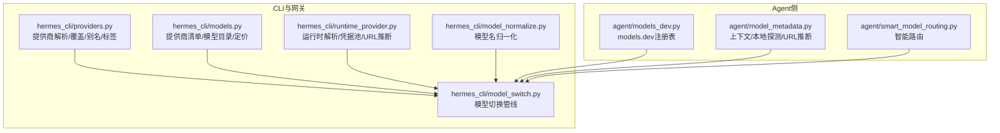
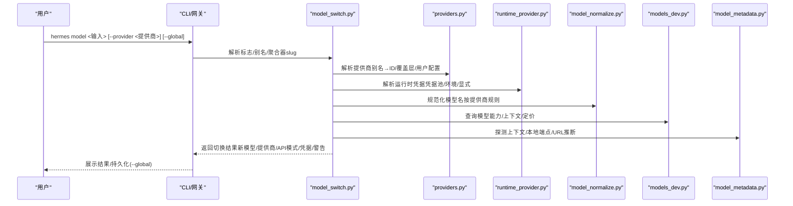
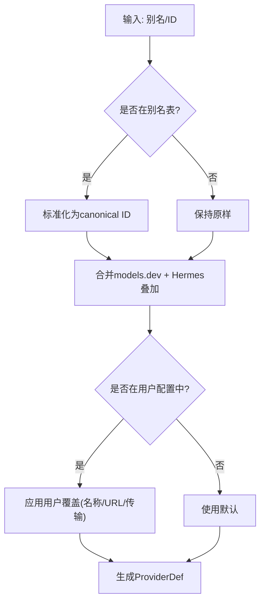
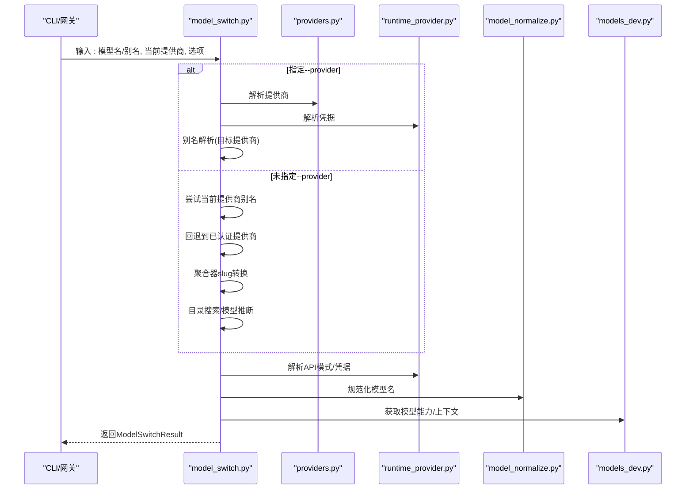
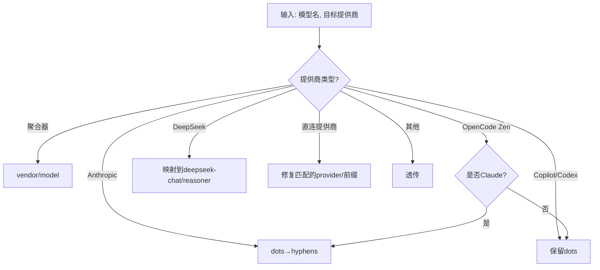
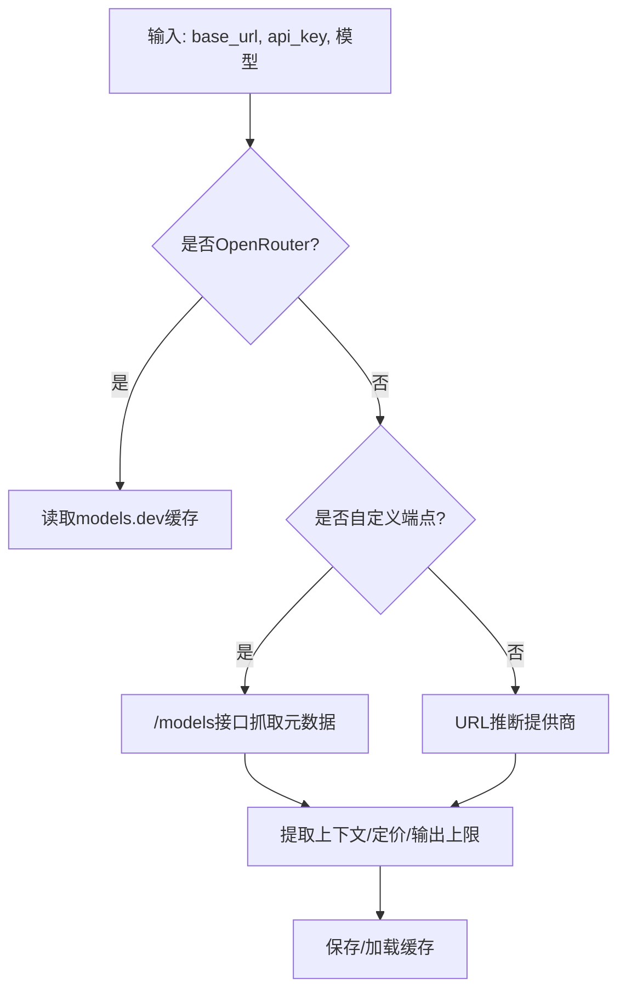
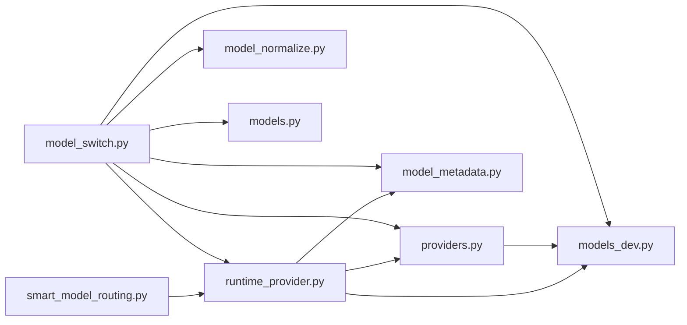

# 模型提供商

<cite>
**本文引用的文件**
- [providers.py](file://hermes_cli/providers.py)
- [model_switch.py](file://hermes_cli/model_switch.py)
- [models.py](file://hermes_cli/models.py)
- [runtime_provider.py](file://hermes_cli/runtime_provider.py)
- [model_normalize.py](file://hermes_cli/model_normalize.py)
- [smart_model_routing.py](file://agent/smart_model_routing.py)
- [model_metadata.py](file://agent/model_metadata.py)
- [models_dev.py](file://agent/models_dev.py)
</cite>

## 目录
1. [简介](#简介)
2. [项目结构](#项目结构)
3. [核心组件](#核心组件)
4. [架构总览](#架构总览)
5. [详细组件分析](#详细组件分析)
6. [依赖关系分析](#依赖关系分析)
7. [性能考量](#性能考量)
8. [故障排查指南](#故障排查指南)
9. [结论](#结论)
10. [附录](#附录)

## 简介
本章节面向Hermes Agent的模型提供商体系，系统性介绍支持的LLM提供商与模型选择机制，覆盖Nous Portal、OpenRouter（200+模型）、Xiaomi MiMo、z.ai/GLM、Kimi/Moonshot、MiniMax、Hugging Face、OpenAI等主流与特色提供商。文档重点阐述：
- 提供商解析与别名映射
- 模型切换流程与智能路由
- 成本与能力元数据来源
- hermes model 命令使用与自定义端点配置
- 不同提供商的特点对比、性能评估与价格参考
- 最佳实践与性能调优建议

## 项目结构
围绕“模型提供商”的核心代码分布在以下模块：
- hermes_cli/providers.py：提供商身份与覆盖层（Hermes叠加）定义、别名、显示标签、传输协议映射、用户自定义提供商解析
- hermes_cli/models.py：提供商清单、模型目录、免费/付费过滤、定价表格式化、OpenRouter快照与实时抓取
- hermes_cli/model_switch.py：CLI与网关共享的模型切换管线，含别名解析、凭据解析、模型规范化、元数据查询、结果封装
- hermes_cli/runtime_provider.py：运行时提供商解析，含凭据池、环境变量、默认URL、API模式推断、自定义端点检测
- hermes_cli/model_normalize.py：按提供商规范归一化模型名称（聚合器/Anthropic/Copilot/OpenCode等）
- agent/smart_model_routing.py：基于消息复杂度的“廉价-强力”模型智能路由
- agent/model_metadata.py：模型上下文长度探测、本地服务器识别、URL到提供商推断、缓存与错误解析
- agent/models_dev.py：models.dev注册表集成（提供商与模型的丰富元数据），离线/磁盘缓存/网络拉取

图示来源
- [providers.py:1-584](file://hermes_cli/providers.py#L1-L584)
- [models.py:1-800](file://hermes_cli/models.py#L1-L800)
- [model_switch.py:1-800](file://hermes_cli/model_switch.py#L1-L800)
- [runtime_provider.py:1-800](file://hermes_cli/runtime_provider.py#L1-L800)
- [model_normalize.py:1-408](file://hermes_cli/model_normalize.py#L1-L408)
- [smart_model_routing.py:1-196](file://agent/smart_model_routing.py#L1-L196)
- [model_metadata.py:1-800](file://agent/model_metadata.py#L1-L800)
- [models_dev.py:1-587](file://agent/models_dev.py#L1-L587)

章节来源
- [providers.py:1-584](file://hermes_cli/providers.py#L1-L584)
- [models.py:516-599](file://hermes_cli/models.py#L516-L599)
- [model_switch.py:1-800](file://hermes_cli/model_switch.py#L1-L800)
- [runtime_provider.py:1-800](file://hermes_cli/runtime_provider.py#L1-L800)
- [model_normalize.py:1-408](file://hermes_cli/model_normalize.py#L1-L408)
- [smart_model_routing.py:1-196](file://agent/smart_model_routing.py#L1-L196)
- [model_metadata.py:1-800](file://agent/model_metadata.py#L1-L800)
- [models_dev.py:1-587](file://agent/models_dev.py#L1-L587)

## 核心组件
- 提供商解析与覆盖层
  - 合并models.dev目录、Hermes叠加元数据与用户配置，生成统一的ProviderDef
  - 支持别名映射（如openai→openrouter、glm/z.ai→zai、kimi→kimi-for-coding等）
  - 显示标签覆盖（如nous→Nous Portal、xiaomi→Xiaomi MiMo等）
  - 传输协议→API模式映射（openai_chat→chat_completions；anthropic_messages→anthropic_messages；codex_responses→codex_responses）

- 模型切换管线
  - 解析--provider与--global标志
  - 别名解析（短名→vendor/family或bare）
  - 凭据解析（凭据池/环境变量/显式参数）
  - 模型名规范化（按提供商要求转换）
  - 元数据查询（能力、上下文、定价）
  - 结果封装（返回新模型、提供商、API模式、凭据、警告等）

- 运行时解析
  - 自动检测本地端点与模型
  - 从凭据池选择可用凭据
  - 推断API模式（chat_completions/codex_responses/anthropic_messages/bedrock_converse）
  - 支持自定义端点与环境变量覆盖

- 智能路由
  - 基于消息复杂度与关键词启发式，自动选择“廉价模型”以降低成本
  - 可配置阈值（字符数、词数、换行数、代码块、URL等）
  - 与主模型形成签名差异，便于可观测与回溯

- 元数据与上下文探测
  - models.dev作为权威来源（离线/磁盘缓存/网络）
  - OpenRouter模型元数据缓存与定价表格式化
  - 本地服务器类型识别（Ollama/LM Studio/vLLM/llama.cpp）
  - 上下文长度探测与错误解析（提取实际上下限、输出上限）

章节来源
- [providers.py:159-430](file://hermes_cli/providers.py#L159-L430)
- [model_switch.py:411-760](file://hermes_cli/model_switch.py#L411-L760)
- [runtime_provider.py:660-800](file://hermes_cli/runtime_provider.py#L660-L800)
- [smart_model_routing.py:62-196](file://agent/smart_model_routing.py#L62-L196)
- [model_metadata.py:443-568](file://agent/model_metadata.py#L443-L568)
- [models_dev.py:1-587](file://agent/models_dev.py#L1-L587)

## 架构总览
下图展示了hermes model命令在CLI与网关中的执行路径，以及与各模块的交互。

图示来源
- [model_switch.py:411-760](file://hermes_cli/model_switch.py#L411-L760)
- [providers.py:527-584](file://hermes_cli/providers.py#L527-L584)
- [runtime_provider.py:660-800](file://hermes_cli/runtime_provider.py#L660-L800)
- [model_normalize.py:295-402](file://hermes_cli/model_normalize.py#L295-L402)
- [models_dev.py:554-587](file://agent/models_dev.py#L554-L587)
- [model_metadata.py:479-568](file://agent/model_metadata.py#L479-L568)

## 详细组件分析

### 组件A：提供商解析与别名映射
- 身份来源与合并顺序
  - models.dev目录（109+提供商，含基础URL、环境变量、文档链接、模型元数据）
  - Hermes叠加（传输类型、认证模式、聚合器标记、额外环境变量、基础URL覆盖）
  - 用户配置（providers/custom_providers字段）
- 别名与显示标签
  - openai→openrouter（走聚合器）
  - glm/z.ai/z-ai/zhipu→zai
  - x-ai/x.ai/grok→xai
  - kimi/kimi-coding/kimi-coding-cn/moonshot→kimi-for-coding
  - minimax-china/minimax_cn→minimax-cn
  - claude/claude-code→anthropic
  - github/github-copilot/github-copilot-acp→github-copilot/copilot-acp
  - ai-gateway/aigateway/vercel-ai-gateway→vercel
  - opencode-zen/zen→opencode
  - go/opencode-go-sub→opencode-go
  - kilo/kilocode/kilo-gateway→kilo
  - deep-seek→deepseek
  - dashscope/aliyun/qwen/alibaba-cloud→alibaba
  - gemini-cli/gemini-oauth→google-gemini-cli
  - hf/hugging-face/huggingface-hub→huggingface
  - mimo/xiaomi-mimo→xiaomi
  - aws/amazon-bedrock→bedrock
  - arcee-ai/arceeai→arcee
  - 本地别名：lmstudio/lm-studio/lm_studio→虚拟local概念
  - ollama→虚拟local（裸“ollama”=本地；“ollama-cloud”=云）
- 显示标签覆盖
  - nous→Nous Portal
  - openai-codex→OpenAI Codex
  - copilot-acp→GitHub Copilot ACP
  - xiaomi→Xiaomi MiMo
  - local→Local endpoint
  - bedrock→AWS Bedrock
  - ollama-cloud→Ollama Cloud

图示来源
- [providers.py:179-273](file://hermes_cli/providers.py#L179-L273)
- [providers.py:303-376](file://hermes_cli/providers.py#L303-L376)
- [providers.py:434-524](file://hermes_cli/providers.py#L434-L524)

章节来源
- [providers.py:1-584](file://hermes_cli/providers.py#L1-L584)

### 组件B：模型切换与智能路由
- 别名解析
  - MODEL_ALIASES：短名→(vendor,family)映射（如sonnet→anthropic/claude-sonnet）
  - resolve_alias：在当前提供商目录中查找匹配模型（聚合器需vendor/model前缀）
  - DIRECT_ALIASES：精确映射（model/provider/base_url），可绕过目录解析
- 切换管线
  - --provider存在：解析目标提供商→凭据→别名→自动检测（若未指定模型）
  - 无--provider：先尝试当前提供商别名→回退到已认证提供商→聚合器slug转换→目录搜索→最后按模型推断提供商
  - 凭据解析：优先运行时解析（resolve_runtime_provider），支持凭据池、环境变量、显式参数
  - 模型规范化：normalize_model_for_provider（按提供商规则转换）
  - 元数据：get_model_info/get_model_capabilities（models.dev）
  - API模式：determine_api_mode（基于提供商/URL推断）
- 智能路由
  - choose_cheap_model_route：当消息简单且不包含复杂关键词/代码块/URL时，返回“廉价模型”路由
  - resolve_turn_route：根据路由配置与主模型，决定本次对话使用的模型/运行时

图示来源
- [model_switch.py:411-760](file://hermes_cli/model_switch.py#L411-L760)
- [providers.py:527-584](file://hermes_cli/providers.py#L527-L584)
- [runtime_provider.py:660-800](file://hermes_cli/runtime_provider.py#L660-L800)
- [model_normalize.py:295-402](file://hermes_cli/model_normalize.py#L295-L402)
- [models_dev.py:554-587](file://agent/models_dev.py#L554-L587)

章节来源
- [model_switch.py:1-800](file://hermes_cli/model_switch.py#L1-L800)
- [smart_model_routing.py:62-196](file://agent/smart_model_routing.py#L62-L196)

### 组件C：模型名规范化与API模式推断
- 归一化规则
  - 聚合器（OpenRouter/Nous/AI Gateway/Kilo）→vendor/model
  - Anthropic→dots→hyphens（native API）
  - Copilot/Copilot ACP/OpenAI Codex→保留dots
  - OpenCode Zen：Claude用hyphen，其他保留dots
  - DeepSeek→仅接受“deepseek-chat”“deepseek-reasoner”
  - 直连提供商→修复匹配的provider/前缀（如zai/glm-5.1→glm-5.1）
- API模式推断
  - 基于提供商→传输→API模式映射
  - URL启发式（api.openai.com→codex_responses；api.anthropic.com→anthropic_messages；bedrock-runtime→bedrock_converse）
  - 运行时解析进一步修正（如OpenRouter自定义端点、Anthropic SDK路径拼接）

图示来源
- [model_normalize.py:295-402](file://hermes_cli/model_normalize.py#L295-L402)
- [providers.py:403-430](file://hermes_cli/providers.py#L403-L430)
- [runtime_provider.py:38-50](file://hermes_cli/runtime_provider.py#L38-L50)

章节来源
- [model_normalize.py:1-408](file://hermes_cli/model_normalize.py#L1-L408)
- [providers.py:291-430](file://hermes_cli/providers.py#L291-L430)
- [runtime_provider.py:38-50](file://hermes_cli/runtime_provider.py#L38-L50)

### 组件D：元数据与上下文探测
- models.dev集成
  - 离线快照/磁盘缓存/网络拉取（1小时内存缓存）
  - 提供商与模型的丰富元数据（能力、上下文、最大输出、成本、模态、知识截止等）
- OpenRouter模型元数据
  - 定时缓存与实时抓取，格式化定价表
- 本地端点探测
  - 本地主机/容器内DNS/私有地址识别
  - 服务器类型识别（Ollama/LM Studio/vLLM/llama.cpp）
  - Ollama上下文长度查询（Modelfile参数优先于GGUF）
- 错误解析
  - 从错误信息提取上下文上限与可用输出令牌数

图示来源
- [models_dev.py:207-249](file://agent/models_dev.py#L207-L249)
- [model_metadata.py:479-568](file://agent/model_metadata.py#L479-L568)
- [model_metadata.py:310-367](file://agent/model_metadata.py#L310-L367)

章节来源
- [models_dev.py:1-587](file://agent/models_dev.py#L1-L587)
- [model_metadata.py:1-800](file://agent/model_metadata.py#L1-L800)

### 组件E：hermes model命令与自定义端点
- 命令语法
  - hermes model <模型名或别名> [--provider <提供商>] [--global]
  - 支持Unicode破折号兼容（iOS/Telegram）
- 别名与聚合器
  - 使用MODEL_ALIASES与聚合器vendor/model转换
  - DIRECT_ALIASES用于精确映射（model/provider/base_url）
- 自定义端点
  - 在config.yaml中配置providers/custom_providers
  - 支持key_env/env变量注入API密钥
  - 运行时解析会检测凭据池与环境变量，必要时自动填充“no-key-required”

章节来源
- [model_switch.py:261-301](file://hermes_cli/model_switch.py#L261-L301)
- [model_switch.py:179-221](file://hermes_cli/model_switch.py#L179-L221)
- [runtime_provider.py:268-427](file://hermes_cli/runtime_provider.py#L268-L427)

## 依赖关系分析
- 模块耦合
  - model_switch.py高度依赖providers.py（解析提供商）、runtime_provider.py（解析凭据）、model_normalize.py（模型名）、models_dev.py（模型元数据）、model_metadata.py（上下文探测）
  - providers.py与models.py共同维护提供商清单与模型目录
  - smart_model_routing.py与runtime_provider.py协作实现按消息复杂度的路由
- 外部依赖
  - models.dev注册表（离线/磁盘缓存/网络）
  - OpenRouter模型元数据（缓存与实时抓取）
  - 本地HTTP客户端（探测端点、查询模型列表、上下文长度）

图示来源
- [model_switch.py:1-800](file://hermes_cli/model_switch.py#L1-L800)
- [providers.py:1-584](file://hermes_cli/providers.py#L1-L584)
- [runtime_provider.py:1-800](file://hermes_cli/runtime_provider.py#L1-L800)
- [model_normalize.py:1-408](file://hermes_cli/model_normalize.py#L1-L408)
- [models_dev.py:1-587](file://agent/models_dev.py#L1-L587)
- [model_metadata.py:1-800](file://agent/model_metadata.py#L1-L800)
- [models.py:1-800](file://hermes_cli/models.py#L1-L800)
- [smart_model_routing.py:1-196](file://agent/smart_model_routing.py#L1-L196)

章节来源
- [model_switch.py:1-800](file://hermes_cli/model_switch.py#L1-L800)
- [providers.py:1-584](file://hermes_cli/providers.py#L1-L584)
- [runtime_provider.py:1-800](file://hermes_cli/runtime_provider.py#L1-L800)
- [model_normalize.py:1-408](file://hermes_cli/model_normalize.py#L1-L408)
- [models_dev.py:1-587](file://agent/models_dev.py#L1-L587)
- [model_metadata.py:1-800](file://agent/model_metadata.py#L1-L800)
- [models.py:1-800](file://hermes_cli/models.py#L1-L800)
- [smart_model_routing.py:1-196](file://agent/smart_model_routing.py#L1-L196)

## 性能考量
- 缓存策略
  - models.dev：1小时内存缓存 + 磁盘缓存（离线可用）
  - OpenRouter模型元数据：定时缓存，失败时回退快照
  - 本地端点元数据：每5分钟缓存一次，避免频繁探测
- 上下文探测
  - 默认从models.dev与OpenRouter获取；本地端点通过/models接口抓取，必要时再探测Ollama上下文
- 智能路由
  - 低成本分支仅在消息简单时触发，避免对复杂任务产生副作用
  - 配置阈值可调，平衡成本与质量

## 故障排查指南
- 提供商解析失败
  - 检查别名是否正确（如openai→openrouter、kimi→kimi-for-coding）
  - 使用hermes doctor检查配置问题
- 凭据解析失败
  - 确认凭据池、环境变量、显式参数是否正确
  - 对于OpenRouter，区分OPENROUTER_API_KEY与OPENAI_API_KEY
- 模型名不匹配
  - 使用normalize_model_for_provider确保符合目标提供商API格式
  - 聚合器需vendor/model格式；Anthropic需dots→hyphens
- 上下文不足或输出受限
  - 通过错误解析提取实际上下文上限与可用输出令牌数
  - 适当降低max_tokens或压缩历史
- 本地端点无法识别
  - 确认base_url指向正确端口与路径
  - 使用detect_local_server_type确认服务器类型

章节来源
- [model_switch.py:474-534](file://hermes_cli/model_switch.py#L474-L534)
- [runtime_provider.py:660-800](file://hermes_cli/runtime_provider.py#L660-L800)
- [model_normalize.py:295-402](file://hermes_cli/model_normalize.py#L295-L402)
- [model_metadata.py:626-695](file://agent/model_metadata.py#L626-L695)

## 结论
Hermes Agent的模型提供商体系以models.dev为核心，结合Hermes叠加层与用户配置，实现了对多提供商、多模型的统一解析与切换。通过别名映射、模型名规范化、运行时凭据解析与智能路由，系统在易用性、成本控制与性能之间取得良好平衡。推荐用户：
- 优先使用聚合器（OpenRouter/Nous）以获得更广模型覆盖
- 针对特定任务选择合适提供商（如Claude适合推理、Gemini适合多模态）
- 启用智能路由以降低日常简单任务的成本
- 正确配置凭据与自定义端点，确保稳定与安全

## 附录

### 支持的提供商与特点概览
- OpenRouter（200+模型）
  - 特点：聚合多家模型，支持变体后缀（:free/:extended/:fast）
  - 适用：多模型对比、快速切换
- Nous Portal
  - 特点：订阅制，MiMo等模型可选；免费模型有限制
  - 适用：需要稳定推理与工具调用
- Xiaomi MiMo
  - 特点：支持pro/omni/flash系列
  - 适用：长上下文与多模态任务
- Z.AI/GLM
  - 特点：中文场景强，GLM系列
  - 适用：中文对话与代码
- Kimi/Moonshot
  - 特点：长上下文，适合大文档处理
  - 适用：研究、写作、分析
- MiniMax
  - 特点：国内API，支持M2/M2.5/M2.7
  - 适用：中文任务与合规要求
- Hugging Face
  - 特点：开源模型丰富（20+）
  - 适用：开源场景与评测
- OpenAI
  - 特点：生态成熟，工具调用能力强
  - 适用：通用Agent工作流
- 其他提供商
  - Anthropic（Claude系列）
  - GitHub Copilot/Copilot ACP
  - Google AI Studio/Gemini
  - DeepSeek（DeepSeek-V3、R1、Coder）
  - Alibaba DashScope（Qwen系列）
  - Vercel AI Gateway（200+模型）
  - AWS Bedrock（Claude、Nova、Llama、DeepSeek）
  - Arcee AI（Trinity系列）
  - Ollama Cloud（云托管开源模型）

章节来源
- [models.py:532-559](file://hermes_cli/models.py#L532-L559)
- [providers.py:44-153](file://hermes_cli/providers.py#L44-L153)

### 模型切换最佳实践
- 优先使用聚合器（OpenRouter/Nous）进行模型探索与对比
- 对需要稳定性的任务，固定提供商与模型版本
- 启用智能路由，将简单任务分流至低成本模型
- 配置凭据池与环境变量，减少重复输入
- 使用hermes model命令进行可视化选择与验证

### 性能调优建议
- 合理设置上下文长度与max_tokens，避免频繁截断
- 对本地端点启用凭据池与URL缓存
- 使用聚合器时关注变体后缀，选择适合任务的变体
- 定期刷新models.dev缓存，确保元数据最新