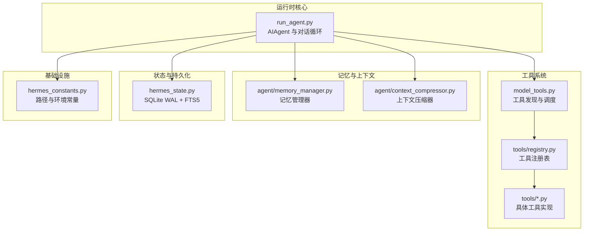
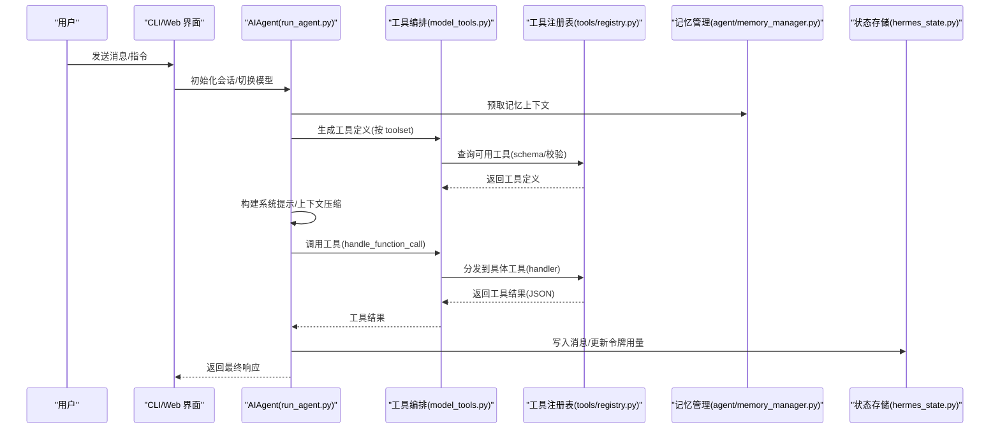
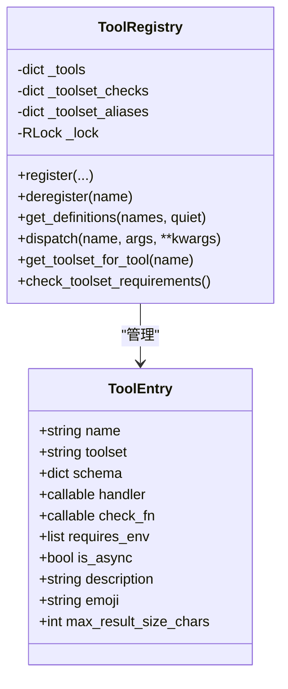
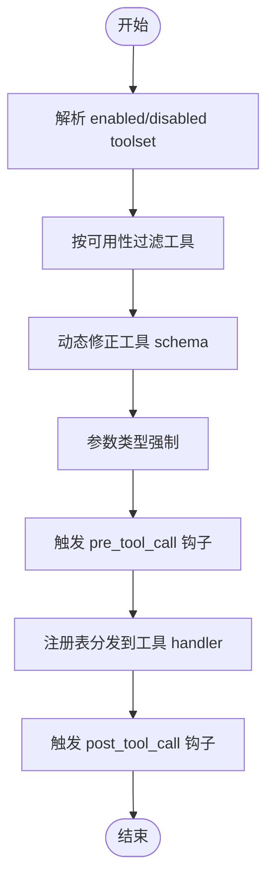
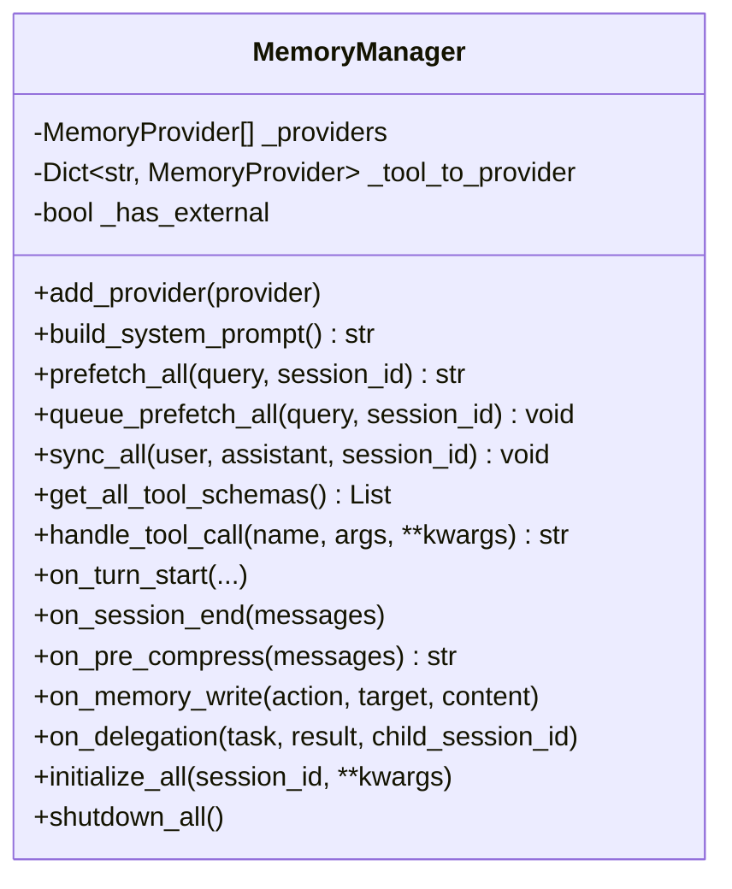
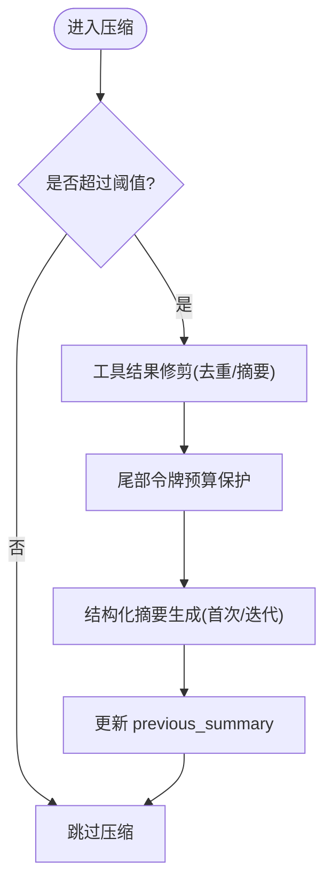
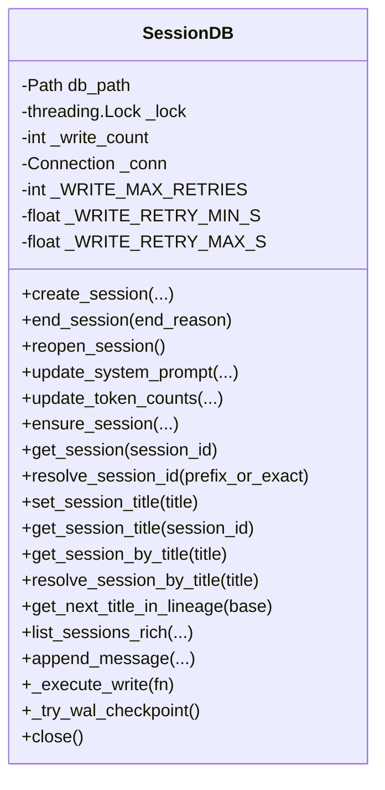
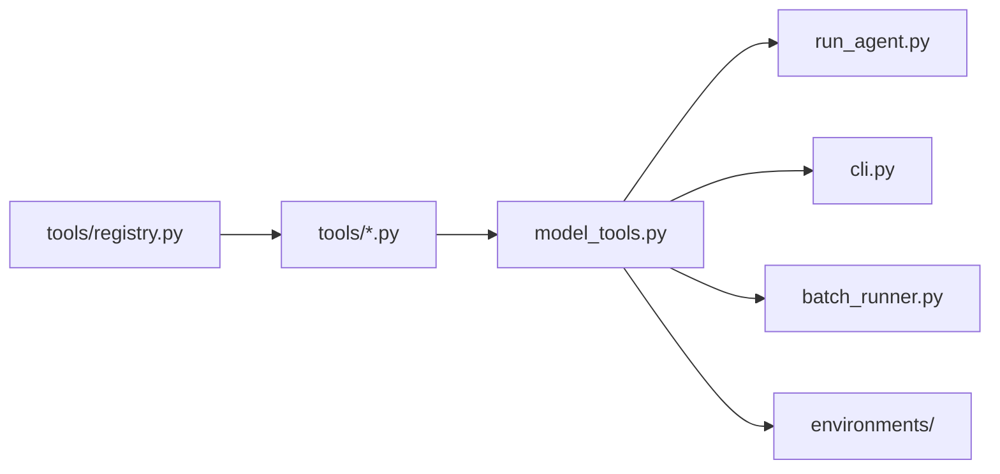

# 项目介绍

<cite>
**本文引用的文件**
- [README.md](file://README.md)
- [HERMES_AGENT_KNOWLEDGE_BASE.md](file://HERMES_AGENT_KNOWLEDGE_BASE.md)
- [AGENTS.md](file://AGENTS.md)
- [hermes_constants.py](file://hermes_constants.py)
- [hermes_state.py](file://hermes_state.py)
- [agent/memory_manager.py](file://agent/memory_manager.py)
- [agent/context_compressor.py](file://agent/context_compressor.py)
- [tools/registry.py](file://tools/registry.py)
- [model_tools.py](file://model_tools.py)
- [run_agent.py](file://run_agent.py)
</cite>

## 目录
1. [引言](#引言)
2. [项目结构](#项目结构)
3. [核心组件](#核心组件)
4. [架构总览](#架构总览)
5. [详细组件分析](#详细组件分析)
6. [依赖关系分析](#依赖关系分析)
7. [性能考量](#性能考量)
8. [故障排查指南](#故障排查指南)
9. [结论](#结论)
10. [附录](#附录)

## 引言
Hermes Agent 是由 Nous Research 开发的“自学习 AI 代理”框架，其核心愿景是打造一个具备“内置学习回路”的智能体：它能够从经验中创建并改进技能，持续沉淀知识，跨会话检索过往对话，形成对用户的深度建模；同时，它提供跨平台部署能力、强大的工具系统、完善的记忆管理机制，并以研究就绪的姿态支持轨迹生成与强化学习训练。Hermes Agent 不仅适合个人日常使用，也适用于多平台消息网关、终端后端、容器化与云端部署，以及复杂任务的并行子代理协作。

## 项目结构
Hermes Agent 采用模块化分层组织，围绕“代理内核 + 工具编排 + 记忆与上下文 + 网关与平台适配 + 插件生态”展开。核心文件与职责概览如下：
- 运行时核心：run_agent.py 提供 AIAgent 类与对话循环，串联模型调用、工具调度、上下文压缩与记忆注入。
- 工具系统：tools/registry.py 作为中央注册表，tools/*.py 实现具体工具，model_tools.py 负责工具发现与调度。
- 记忆与上下文：agent/memory_manager.py 管理内置与外部记忆提供者，agent/context_compressor.py 提供自动上下文压缩。
- 状态与持久化：hermes_state.py 基于 SQLite WAL + FTS5，提供会话与消息的持久化与全文检索。
- 常量与路径：hermes_constants.py 提供统一的 HERMES_HOME 解析、路径兼容与环境探测。
- 文档与开发指南：README.md、HERMES_AGENT_KNOWLEDGE_BASE.md、AGENTS.md 提供快速入门、架构说明与开发指引。

图示来源
- [run_agent.py:1-200](file://run_agent.py#L1-L200)
- [model_tools.py:1-563](file://model_tools.py#L1-L563)
- [tools/registry.py:1-483](file://tools/registry.py#L1-L483)
- [agent/memory_manager.py:1-374](file://agent/memory_manager.py#L1-L374)
- [agent/context_compressor.py:1-800](file://agent/context_compressor.py#L1-L800)
- [hermes_state.py:1-800](file://hermes_state.py#L1-L800)
- [hermes_constants.py:1-295](file://hermes_constants.py#L1-L295)

章节来源
- [README.md:14-26](file://README.md#L14-L26)
- [HERMES_AGENT_KNOWLEDGE_BASE.md:47-79](file://HERMES_AGENT_KNOWLEDGE_BASE.md#L47-L79)
- [AGENTS.md:11-64](file://AGENTS.md#L11-L64)

## 核心组件
- 自学习回路与技能系统：Hermes Agent 通过“构建时文档爬取自动化”生成技能，结合记忆系统的“检索-反思-整合”三阶段学习循环，实现长期记忆与知识积累，支持跨会话的持续改进。
- 工具系统：基于 AST 自动发现的工具注册机制，零配置扩展；工具按 toolset 分组，支持启用/禁用与动态刷新；工具参数类型强制与 schema 对齐，降低模型幻觉风险。
- 记忆管理：内置 MemoryManager 统一编排内置与外部记忆提供者，支持预取检索、回合同步、工具路由与生命周期钩子，确保上下文隔离与一致性。
- 上下文压缩：ContextCompressor 采用“工具结果修剪 + 结构化摘要 + 尾部预算保护”的策略，迭代更新摘要，兼顾任务连续性与成本控制。
- 状态持久化：SessionDB 基于 SQLite WAL + FTS5，提供并发读写、全文检索、标题唯一性与令牌用量统计，支持会话拆分与父会话链追踪。
- 跨平台部署：CLI、Web UI、消息网关（Telegram/ Discord/Slack/WhatsApp/Signal 等）统一入口；支持 Docker/SSH/Modal/Daytona/Singularity 等终端后端，实现弹性与低占用运行。

章节来源
- [README.md:14-26](file://README.md#L14-L26)
- [HERMES_AGENT_KNOWLEDGE_BASE.md:182-206](file://HERMES_AGENT_KNOWLEDGE_BASE.md#L182-L206)
- [AGENTS.md:82-126](file://AGENTS.md#L82-L126)
- [agent/context_compressor.py:188-310](file://agent/context_compressor.py#L188-L310)
- [hermes_state.py:115-161](file://hermes_state.py#L115-L161)

## 架构总览
Hermes Agent 的运行时由“代理内核 + 工具编排 + 记忆与上下文 + 状态持久化 + 平台网关”构成。代理内核负责对话循环与工具调度，工具系统通过注册表集中管理与动态发现，记忆与上下文模块提供检索与压缩能力，状态持久化保障会话与消息的可靠存储，平台网关则将代理能力暴露到多平台消息通道。

图示来源
- [run_agent.py:63-110](file://run_agent.py#L63-L110)
- [model_tools.py:196-316](file://model_tools.py#L196-L316)
- [tools/registry.py:258-310](file://tools/registry.py#L258-L310)
- [agent/memory_manager.py:178-220](file://agent/memory_manager.py#L178-L220)
- [hermes_state.py:355-401](file://hermes_state.py#L355-L401)

章节来源
- [AGENTS.md:82-126](file://AGENTS.md#L82-L126)
- [HERMES_AGENT_KNOWLEDGE_BASE.md:80-91](file://HERMES_AGENT_KNOWLEDGE_BASE.md#L80-L91)

## 详细组件分析

### 组件A：工具注册与发现（tools/registry.py）
- 设计要点
  - 通过 AST 静态分析自动发现工具模块，无需手动维护导入列表。
  - ToolRegistry 单例集中管理工具元数据、可用性检查与动态刷新。
  - 支持工具集别名、工具集可用性检查、工具 schema 动态过滤与去重。
- 关键流程
  - discover_builtin_tools() 导入所有自注册工具模块。
  - get_definitions() 基于 enabled/disabled toolset 过滤并返回 OpenAI 格式工具定义。
  - dispatch() 将工具调用路由到对应 handler，支持异步桥接与错误格式化。

图示来源
- [tools/registry.py:76-124](file://tools/registry.py#L76-L124)
- [tools/registry.py:176-253](file://tools/registry.py#L176-L253)

章节来源
- [tools/registry.py:41-74](file://tools/registry.py#L41-L74)
- [tools/registry.py:258-310](file://tools/registry.py#L258-L310)

### 组件B：工具编排与调度（model_tools.py）
- 设计要点
  - 三 loop 异步桥接：主线程持久 loop、工作线程独立 loop、运行中 loop 的线程池兜底，统一 sync→async 调用。
  - 工具定义动态生成：按 toolset 启用/禁用过滤，动态修正 execute_code 与 browser_navigate 的 schema 交叉引用。
  - 参数类型强制：根据 JSON Schema 对字符串类型的数字/布尔进行安全转换，减少模型输出误差。
- 关键流程
  - get_tool_definitions()：解析 toolset，合并可用工具，生成最终工具定义列表。
  - handle_function_call()：参数类型强制、预/后置插件钩子、路由到注册表分发。

图示来源
- [model_tools.py:196-316](file://model_tools.py#L196-L316)
- [model_tools.py:421-534](file://model_tools.py#L421-L534)

章节来源
- [model_tools.py:39-126](file://model_tools.py#L39-L126)
- [model_tools.py:334-419](file://model_tools.py#L334-L419)

### 组件C：记忆管理（agent/memory_manager.py）
- 设计要点
  - 双提供者模型：内置提供者始终注册，最多允许一个外部提供者，防止冲突与 schema 膨胀。
  - 上下文围栏：对检索到的记忆进行清洗与围栏包裹，避免模型将检索内容误判为用户输入。
  - 生命周期钩子：支持回合开始、会话结束、上下文压缩前、委托完成等事件通知。
- 关键流程
  - add_provider()：注册提供者并建立工具名→提供者映射。
  - prefetch_all()/queue_prefetch_all()：聚合检索上下文并后台预取。
  - sync_all()/handle_tool_call()：回合同步与工具调用路由。

图示来源
- [agent/memory_manager.py:83-154](file://agent/memory_manager.py#L83-L154)
- [agent/memory_manager.py:249-330](file://agent/memory_manager.py#L249-L330)

章节来源
- [agent/memory_manager.py:1-81](file://agent/memory_manager.py#L1-L81)
- [agent/memory_manager.py:356-374](file://agent/memory_manager.py#L356-L374)

### 组件D：上下文压缩（agent/context_compressor.py）
- 设计要点
  - 工具结果修剪：对旧工具结果进行“信息性摘要”替换，保留关键细节，减少冗余。
  - 结构化摘要：采用“目标/进展/决策/已解决/待办/文件/剩余工作/关键上下文”模板，支持首次与迭代更新两种模式。
  - 尾部预算保护：基于令牌预算而非固定消息数保护最新内容，提升压缩效果与任务连续性。
- 关键流程
  - should_compress()：判断是否超过阈值，含抗抖动保护。
  - _prune_old_tool_results()：去重与摘要替换。
  - _generate_summary()：结构化摘要生成与失败冷却处理。

图示来源
- [agent/context_compressor.py:310-331](file://agent/context_compressor.py#L310-L331)
- [agent/context_compressor.py:336-469](file://agent/context_compressor.py#L336-L469)
- [agent/context_compressor.py:545-756](file://agent/context_compressor.py#L545-L756)

章节来源
- [agent/context_compressor.py:188-310](file://agent/context_compressor.py#L188-L310)

### 组件E：状态持久化（hermes_state.py）
- 设计要点
  - WAL 模式 + 随机抖动重试：打破 SQLite 确定性退避的车队效应，支持高并发写入。
  - FTS5 全文检索：自动触发器同步，支持跨会话检索与标题唯一性约束。
  - 会话拆分与链式追踪：通过 parent_session_id 支持压缩后的会话拆分与父子关系。
- 关键流程
  - _execute_write()：带锁与随机抖动的写事务封装。
  - _try_wal_checkpoint()：被动检查点，避免 WAL 无限增长。
  - create_session()/end_session()/update_token_counts()：会话生命周期与用量统计。

图示来源
- [hermes_state.py:115-161](file://hermes_state.py#L115-L161)
- [hermes_state.py:164-215](file://hermes_state.py#L164-L215)
- [hermes_state.py:355-501](file://hermes_state.py#L355-L501)

章节来源
- [hermes_state.py:138-159](file://hermes_state.py#L138-L159)

### 组件F：路径与环境常量（hermes_constants.py）
- 设计要点
  - get_hermes_home()：统一 HERMES_HOME 解析，支持 Docker/自定义部署与 profile 隔离。
  - display_hermes_home()：用户友好显示路径，避免硬编码 ~/.hermes。
  - 环境探测：is_termux()/is_wsl()/is_container() 提供运行环境识别。
- 应用场景
  - 工具/记忆/配置/日志等路径均通过 get_hermes_home() 解析，确保多实例隔离与容器内持久化。

章节来源
- [hermes_constants.py:11-17](file://hermes_constants.py#L11-L17)
- [hermes_constants.py:94-112](file://hermes_constants.py#L94-L112)
- [hermes_constants.py:161-221](file://hermes_constants.py#L161-L221)

## 依赖关系分析
- 依赖链
  - tools/registry.py（无依赖，被所有工具文件导入）
  - tools/*.py（导入 tools/registry，调用 registry.register()）
  - model_tools.py（导入 tools/registry，触发工具发现）
  - run_agent.py/cli.py/batch_runner.py/environments/（导入 model_tools 与 agent/*）

图示来源
- [HERMES_AGENT_KNOWLEDGE_BASE.md:80-91](file://HERMES_AGENT_KNOWLEDGE_BASE.md#L80-L91)
- [AGENTS.md:68-78](file://AGENTS.md#L68-L78)

章节来源
- [HERMES_AGENT_KNOWLEDGE_BASE.md:80-91](file://HERMES_AGENT_KNOWLEDGE_BASE.md#L80-L91)
- [AGENTS.md:68-78](file://AGENTS.md#L68-L78)

## 性能考量
- 异步桥接与事件循环
  - 三 loop 架构避免“事件循环已关闭”错误，缓存的异步客户端（如 httpx/AsyncOpenAI）在工具执行期间保持有效，减少 GC 与重建开销。
- SQLite 并发写入
  - 随机抖动重试与被动检查点策略，打破确定性退避的车队效应，显著降低高并发写入下的阻塞与冻结。
- 上下文压缩
  - 工具结果修剪与结构化摘要减少传输与计算成本；尾部预算保护确保最新交互的完整性，避免频繁压缩导致的任务中断。
- 路径与环境探测
  - 统一路径解析与环境识别，减少 IO 错误与配置漂移带来的性能损耗。

章节来源
- [model_tools.py:39-126](file://model_tools.py#L39-L126)
- [hermes_state.py:164-215](file://hermes_state.py#L164-L215)
- [agent/context_compressor.py:310-331](file://agent/context_compressor.py#L310-L331)

## 故障排查指南
- 网络与 DNS
  - 若遇到 IPv6 解析问题，可通过配置强制优先 IPv4，或添加公共 DNS 服务器以恢复连通性。
- 系统权限与守护进程
  - 在 root 用户下使用 systemctl --user 可能出现权限问题，建议直接以 Python 启动网关进程。
- 工具可用性
  - 使用 hermes tools 与 hermes skills 检查工具集与技能启用状态；若工具报错，确认 API 密钥与环境变量配置。
- 会话与状态
  - 使用 hermes status 与 /usage 检查会话状态与令牌用量；必要时执行 /compress 或 /new 重置会话以缓解上下文膨胀。

章节来源
- [README.md:38-41](file://README.md#L38-L41)
- [HERMES_AGENT_KNOWLEDGE_BASE.md:351-390](file://HERMES_AGENT_KNOWLEDGE_BASE.md#L351-L390)

## 结论
Hermes Agent 以“自学习回路 + 工具系统 + 记忆与上下文 + 状态持久化 + 跨平台网关”为核心，构建了可研究、可扩展、可部署的智能体框架。其在工具自动发现、异步桥接、SQLite 并发写入、上下文压缩与记忆管理等方面的技术创新，使其在长上下文、多模态交互与大规模部署场景中具备显著优势。对于不同技术背景的用户，Hermes Agent 提供 CLI、Web UI 与消息网关等多种入口，既满足个人日常使用，也能支撑企业级与研究级应用。

## 附录
- 快速定位参考
  - 项目定位与特性：[README.md:14-26](file://README.md#L14-L26)
  - 架构与文件依赖链：[HERMES_AGENT_KNOWLEDGE_BASE.md:47-91](file://HERMES_AGENT_KNOWLEDGE_BASE.md#L47-L91)
  - 开发与贡献指南：[AGENTS.md:11-64](file://AGENTS.md#L11-L64)