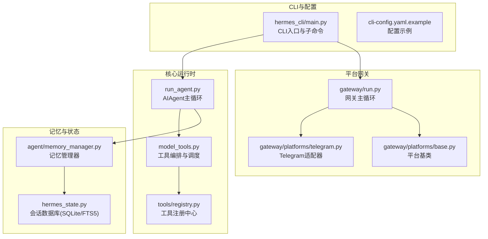
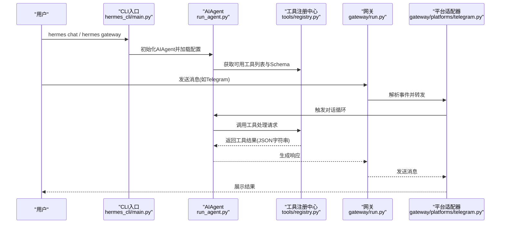
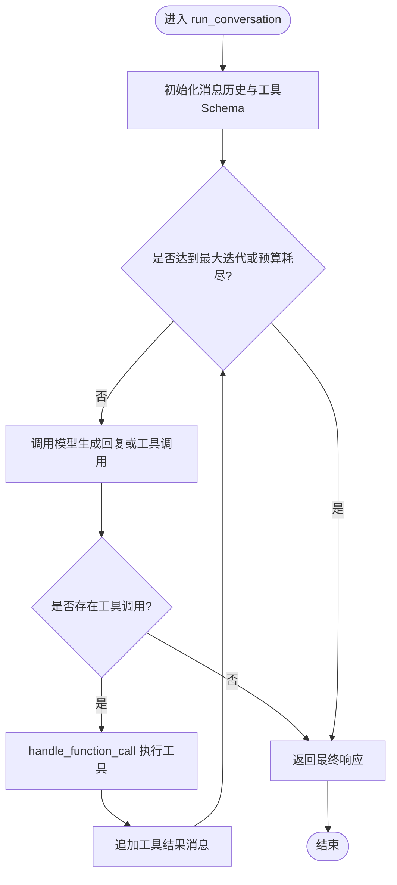
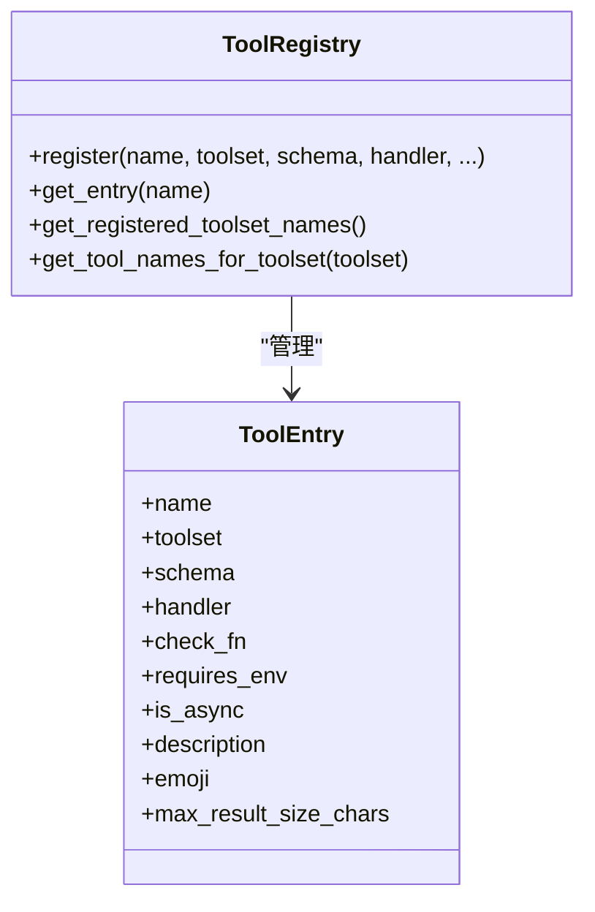
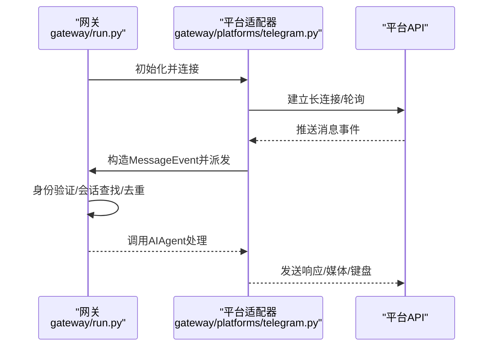
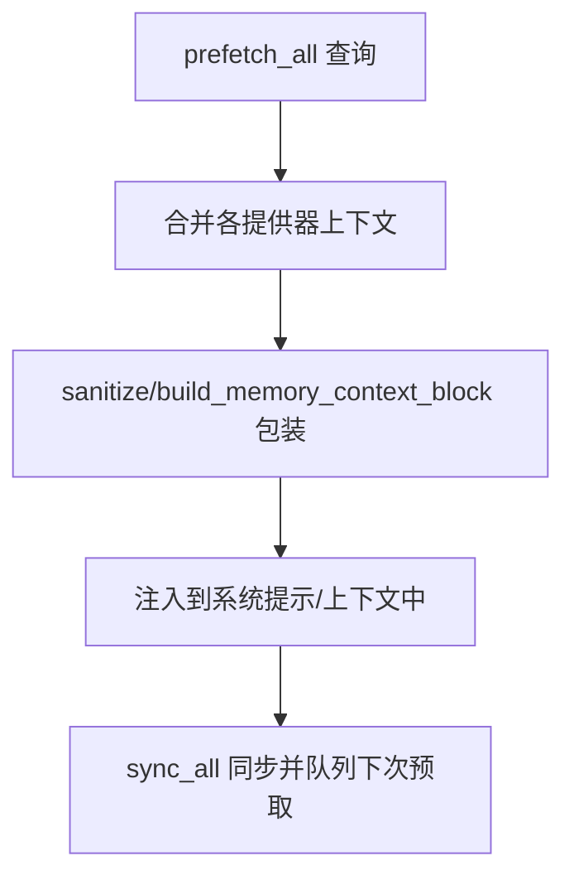
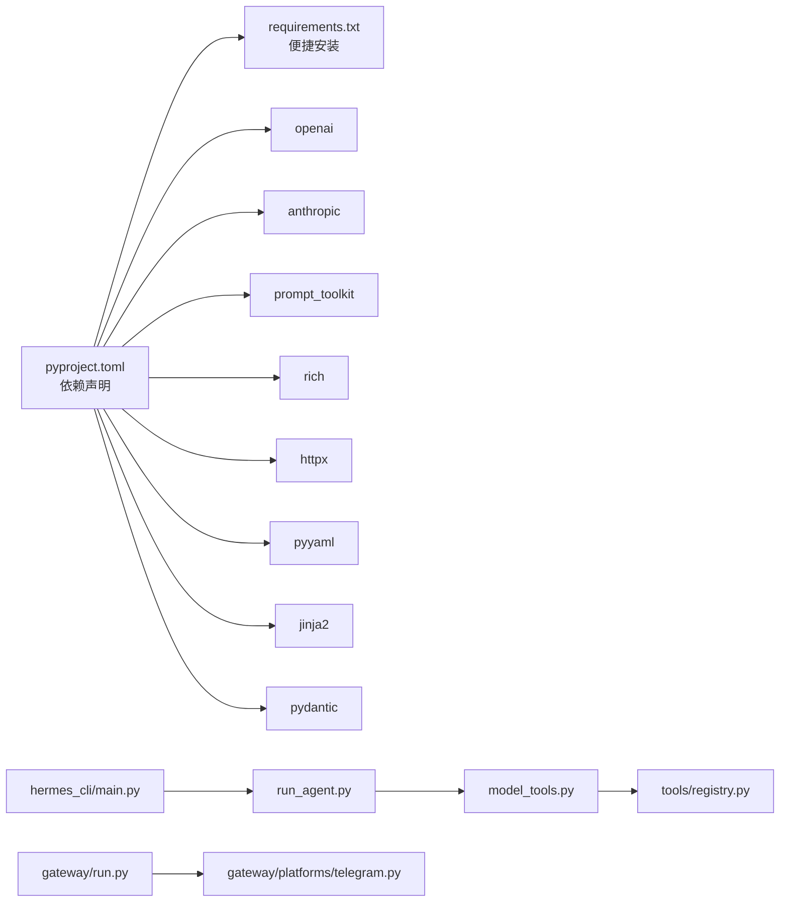

# 项目概述

<cite>
**本文档引用的文件**
- [README.md](file://README.md)
- [AGENTS.md](file://AGENTS.md)
- [HERMES_AGENT_KNOWLEDGE_BASE.md](file://HERMES_AGENT_KNOWLEDGE_BASE.md)
- [pyproject.toml](file://pyproject.toml)
- [requirements.txt](file://requirements.txt)
- [run_agent.py](file://run_agent.py)
- [agent/memory_manager.py](file://agent/memory_manager.py)
- [gateway/run.py](file://gateway/run.py)
- [hermes_cli/main.py](file://hermes_cli/main.py)
- [tools/registry.py](file://tools/registry.py)
- [gateway/platforms/telegram.py](file://gateway/platforms/telegram.py)
- [gateway/platforms/ADDING_A_PLATFORM.md](file://gateway/platforms/ADDING_A_PLATFORM.md)
- [cli-config.yaml.example](file://cli-config.yaml.example)
</cite>

## 目录
1. [简介](#简介)
2. [项目结构](#项目结构)
3. [核心组件](#核心组件)
4. [架构总览](#架构总览)
5. [详细组件分析](#详细组件分析)
6. [依赖关系分析](#依赖关系分析)
7. [性能考量](#性能考量)
8. [故障排查指南](#故障排查指南)
9. [结论](#结论)
10. [附录](#附录)

## 简介
Hermes Agent 是由 Nous Research 开发的“自学习”AI智能体框架，具备以下核心愿景与优势：
- 自学习能力：从经验中创建并改进技能，持续优化使用过程中的表现
- 多平台部署：CLI、Telegram、Discord、Slack、WhatsApp、Signal、Home Assistant 等统一网关接入
- 智能工具系统：55+内置工具，支持终端、文件、浏览器、图像生成、语音合成、定时任务等
- 记忆管理：内置会话数据库与可插拔记忆提供器，结合 Honcho 实现跨会话用户建模
- 模型路由与弹性：支持 OpenAI、Anthropic、OpenRouter、Nous Portal、Google Gemini、Xiaomi MiMo、Arcee、Bedrock 等多家模型与自定义端点
- 可观测与可观测性：轨迹保存、令牌用量估算、洞察报告、上下文压缩与流式输出

与其他AI助手相比，Hermes 的独特之处在于：
- 将“学习回路”内建于框架：技能自动生成与改进、记忆的周期性提醒与沉淀
- 统一的网关与平台抽象：一次配置，多平台复用；平台适配器遵循统一接口
- 强大的工具注册与编排：基于AST自动发现工具，零配置扩展
- 高并发与稳定性：SQLite WAL + 随机抖动退避、三线程/异步桥接、防断管道输出

## 项目结构
项目采用模块化分层设计，围绕“Agent核心循环 + 工具系统 + 网关平台 + CLI配置”的主线展开：

**图示来源**
- [run_agent.py:1-200](file://run_agent.py#L1-L200)
- [model_tools.py:1-200](file://model_tools.py#L1-L200)
- [tools/registry.py:1-200](file://tools/registry.py#L1-L200)
- [gateway/run.py:1-200](file://gateway/run.py#L1-L200)
- [gateway/platforms/telegram.py:1-200](file://gateway/platforms/telegram.py#L1-L200)
- [hermes_cli/main.py:1-200](file://hermes_cli/main.py#L1-L200)
- [agent/memory_manager.py:1-200](file://agent/memory_manager.py#L1-L200)

**章节来源**
- [AGENTS.md:11-80](file://AGENTS.md#L11-L80)
- [HERMES_AGENT_KNOWLEDGE_BASE.md:47-91](file://HERMES_AGENT_KNOWLEDGE_BASE.md#L47-L91)

## 核心组件
- AIAgent 主循环：负责与模型交互、工具调用、上下文压缩与会话管理
- 工具注册与编排：通过AST自动发现工具，集中注册与调度
- 网关平台：统一的消息平台接入，支持 Telegram、Discord、Slack、WhatsApp 等
- CLI 子命令与配置：提供 setup、gateway、model、tools、skills 等管理命令
- 记忆管理：内置会话数据库与可插拔记忆提供器，支持 Honcho 用户建模

**章节来源**
- [AGENTS.md:82-126](file://AGENTS.md#L82-L126)
- [AGENTS.md:182-219](file://AGENTS.md#L182-L219)
- [HERMES_AGENT_KNOWLEDGE_BASE.md:182-227](file://HERMES_AGENT_KNOWLEDGE_BASE.md#L182-L227)

## 架构总览
Hermes 采用“核心循环 + 工具编排 + 平台网关 + CLI配置”的分层架构。核心循环在 run_agent.py 中实现，工具系统通过 tools/registry.py 动态发现与注册，网关在 gateway/run.py 中统一调度各平台适配器，CLI 在 hermes_cli/main.py 中提供交互与配置入口。

**图示来源**
- [hermes_cli/main.py:676-784](file://hermes_cli/main.py#L676-L784)
- [run_agent.py:63-110](file://run_agent.py#L63-L110)
- [tools/registry.py:56-74](file://tools/registry.py#L56-L74)
- [gateway/run.py:1-200](file://gateway/run.py#L1-L200)
- [gateway/platforms/telegram.py:121-200](file://gateway/platforms/telegram.py#L121-L200)

## 详细组件分析

### AIAgent 主循环与工具编排
- AIAgent 提供简洁的聊天接口与完整对话接口，内部维护迭代预算、上下文压缩与错误分类
- 工具编排通过 model_tools.py 调用工具注册中心，按工具Schema动态生成函数调用参数
- 工具注册中心基于 AST 静态分析自动发现工具模块，减少配置负担

**图示来源**
- [run_agent.py:63-110](file://run_agent.py#L63-L110)
- [tools/registry.py:56-74](file://tools/registry.py#L56-L74)

**章节来源**
- [AGENTS.md:82-126](file://AGENTS.md#L82-L126)
- [AGENTS.md:182-219](file://AGENTS.md#L182-L219)

### 工具系统与注册中心
- 工具文件在导入时调用 registry.register() 进行注册，注册中心统一收集工具Schema与处理器
- discover_builtin_tools 通过 AST 分析自动发现工具模块，无需手动维护清单
- 工具处理器必须返回 JSON 字符串，便于统一序列化与传输

**图示来源**
- [tools/registry.py:76-200](file://tools/registry.py#L76-L200)

**章节来源**
- [AGENTS.md:182-219](file://AGENTS.md#L182-L219)
- [HERMES_AGENT_KNOWLEDGE_BASE.md:182-227](file://HERMES_AGENT_KNOWLEDGE_BASE.md#L182-L227)

### 网关平台与消息适配
- 网关统一加载配置并通过工厂方法创建各平台适配器，支持 Telegram、Discord、Slack、WhatsApp 等
- 平台适配器遵循统一基类接口，负责接收/发送消息、媒体处理、线程/话题管理、重连与限流
- 新平台接入遵循“添加平台清单”，确保授权映射、会话来源、工具路由、状态展示等集成点完备

**图示来源**
- [gateway/run.py:1-200](file://gateway/run.py#L1-L200)
- [gateway/platforms/telegram.py:121-200](file://gateway/platforms/telegram.py#L121-L200)
- [gateway/platforms/ADDING_A_PLATFORM.md:10-54](file://gateway/platforms/ADDING_A_PLATFORM.md#L10-L54)

**章节来源**
- [gateway/platforms/ADDING_A_PLATFORM.md:1-314](file://gateway/platforms/ADDING_A_PLATFORM.md#L1-L314)

### 记忆管理与会话存储
- MemoryManager 负责整合内置与外部记忆提供器，构建系统提示、预取上下文与同步/队列预取
- 会话数据库使用 SQLite WAL + FTS5 全文检索，并采用随机抖动退避应对高并发写入
- 记忆上下文以围栏标签包裹，防止模型将回忆内容误认为用户输入

**图示来源**
- [agent/memory_manager.py:83-200](file://agent/memory_manager.py#L83-L200)

**章节来源**
- [HERMES_AGENT_KNOWLEDGE_BASE.md:207-214](file://HERMES_AGENT_KNOWLEDGE_BASE.md#L207-L214)

### CLI 与配置体系
- hermes_cli/main.py 提供完整的子命令入口，支持 setup、gateway、model、tools、skills 等
- 配置示例文件 cli-config.yaml.example 覆盖模型、工具集、平台工具集、会话重置策略、流式输出、记忆、MCP 等关键选项
- 支持按平台定制工具集（如 hermes-telegram、hermes-discord），以及复合工具集（如 debugging、safe）

**章节来源**
- [hermes_cli/main.py:676-784](file://hermes_cli/main.py#L676-L784)
- [cli-config.yaml.example:514-636](file://cli-config.yaml.example#L514-L636)

## 依赖关系分析

**图示来源**
- [pyproject.toml:13-37](file://pyproject.toml#L13-L37)
- [requirements.txt:5-37](file://requirements.txt#L5-L37)
- [run_agent.py:63-110](file://run_agent.py#L63-L110)
- [model_tools.py:1-200](file://model_tools.py#L1-L200)
- [tools/registry.py:1-200](file://tools/registry.py#L1-L200)
- [hermes_cli/main.py:1-200](file://hermes_cli/main.py#L1-L200)
- [gateway/run.py:1-200](file://gateway/run.py#L1-L200)
- [gateway/platforms/telegram.py:1-200](file://gateway/platforms/telegram.py#L1-L200)

**章节来源**
- [pyproject.toml:1-137](file://pyproject.toml#L1-L137)
- [requirements.txt:1-37](file://requirements.txt#L1-L37)

## 性能考量
- 上下文压缩：当接近模型上下文阈值时自动压缩中间回合，保留最近尾部与关键摘要，降低令牌成本
- SQLite 写入退避：采用随机抖动退避打破确定性车队效应，提升高并发写入稳定性
- 异步桥接：在 CLI/Gateway/子代理三种场景间统一同步→异步桥接，避免阻塞与死锁
- 工具结果持久化：工具结果可持久化并受回合预算控制，避免无限增长

**章节来源**
- [cli-config.yaml.example:288-311](file://cli-config.yaml.example#L288-L311)
- [HERMES_AGENT_KNOWLEDGE_BASE.md:135-159](file://HERMES_AGENT_KNOWLEDGE_BASE.md#L135-L159)
- [run_agent.py:170-200](file://run_agent.py#L170-L200)

## 故障排查指南
- 网关启动失败：检查 SSL 证书自动检测逻辑与平台依赖是否满足
- 平台连接异常：确认平台令牌/密钥配置、允许用户白名单、重连与限流策略
- 工具不可用：检查工具注册中心是否正确发现模块、环境变量是否满足要求
- 会话数据库锁定：关注 SQLite 写入退避与并发控制策略
- CLI 无交互：确保 TTY 可用，非交互场景需使用 hermes setup 或相关命令

**章节来源**
- [gateway/run.py:36-73](file://gateway/run.py#L36-L73)
- [gateway/platforms/telegram.py:86-90](file://gateway/platforms/telegram.py#L86-L90)
- [tools/registry.py:56-74](file://tools/registry.py#L56-L74)
- [HERMES_AGENT_KNOWLEDGE_BASE.md:135-159](file://HERMES_AGENT_KNOWLEDGE_BASE.md#L135-L159)
- [hermes_cli/main.py:53-68](file://hermes_cli/main.py#L53-L68)

## 结论
Hermes Agent 通过“自学习回路 + 统一网关 + 智能工具系统 + 记忆管理”的架构设计，实现了跨平台、可扩展、可观测的AI智能体框架。其独特的工具自动发现、平台适配器标准化、上下文压缩与高并发写入策略，使其在复杂任务与多平台部署场景中具备显著优势。对于初学者，可通过 CLI 快速上手；对于开发者，框架提供了完善的扩展点与测试体系，便于二次开发与深度定制。

## 附录

### 快速开始指南
- 安装：使用官方安装脚本一键安装，支持 Linux、macOS、WSL2 与 Android Termux
- 首次运行：source ~/.bashrc 后执行 hermes，进入交互式 CLI
- 基本配置：hermes setup 启动配置向导，或直接编辑 ~/.hermes/config.yaml 与 .env
- 模型切换：hermes model 选择提供商与模型，支持 OpenAI、Anthropic、OpenRouter、Nous Portal、Google Gemini 等
- 平台接入：hermes gateway 启动网关，支持 Telegram、Discord、Slack、WhatsApp、Signal、Home Assistant 等
- 工具与技能：hermes tools 与 hermes skills 管理工具集与技能

**章节来源**
- [README.md:30-63](file://README.md#L30-L63)
- [README.md:67-84](file://README.md#L67-L84)

### 支持的平台与模型
- 平台：CLI、Telegram、Discord、Slack、WhatsApp、Signal、Home Assistant、Matrix、Mattermost、DingTalk、Feishu、BlueBubbles、Email 等
- 模型：OpenAI、Anthropic、OpenRouter、Nous Portal、Google Gemini、Xiaomi MiMo、Arcee、Bedrock、Hugging Face、ZhiPu AI/GLM、Kimi/Moonshot、MiniMax、Ollama、LM Studio、vLLM、llama.cpp 等

**章节来源**
- [README.md:16-26](file://README.md#L16-L26)
- [cli-config.yaml.example:13-42](file://cli-config.yaml.example#L13-L42)