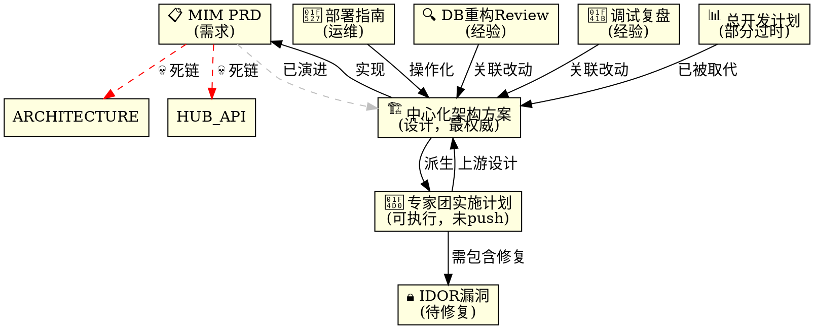

# MIM 知识库地图

> 最后更新：2026-07-18 · 状态：V1 开工前文档盘点

## 文档总览与引用关系

```
┌─────────────────────────────────────────────────────────────┐
│                    MIM 文档体系                              │
├─────────────────────────────────────────────────────────────┤
│                                                             │
│  📋 docs/requirements/mim-prd.md                           │
│     产品需求规格说明书 (v1.0, 2026-07-12)                    │
│     └─ 定义：用户是谁、功能有哪些、非功能需求                 │
│     └─ ⚠️ 引用了 2 个不存在的文件（ARCHITECTURE.md,        │
│            HUB-API.md）——死链，需清理                        │
│                                                             │
│  🏗️ docs/design/mim-centralized-runtime-architecture.md    │
│     中心化架构 + 运行时守护者方案 (Qoder, 2026-07)           │
│     └─ 地位：**当前权威设计文档**                            │
│     └─ §1 背景：8 台机器都直连 MySQL/MQTT → 安全风险         │
│     └─ §2 目标：Desktop 只连一条 WS 到中心                   │
│     └─ §3 已拍板决策 (D1-D5)                                │
│     └─ §4 现状盘点：已有资产 vs 真正缺口                      │
│     └─ §5 详细设计 (hub_bridge/daemon/handler/前端/DB)       │
│     └─ §12 5 个开放问题待 CC 定案                            │
│     └─ ⚠️ 与其他文档无交叉引用                               │
│                                                             │
│  📐 docs/plan/mim-v1-expert-team-implementation.md          │
│     专家团实施需求书 (Qoder, 2026-07)                        │
│     └─ 地位：**可执行任务拆分** — 5 个任务包                  │
│     └─ §2 接口契约（并行的前提）                              │
│     └─ §3 任务包 A-E (文件、需求、禁区、DoD)                 │
│     └─ §4 执行波次 (前置→A∥B→C∥D→E)                        │
│     └─ §7 明确不做清单（防越界）                              │
│     └─ ⚠️ 仍在 QODER 本地，未 push 到 GitLab                │
│                                                             │
│  🔧 website/docs/winpeek/mim-message-center-setup.md        │
│     消息中心部署指南 (运维文档)                               │
│     └─ 8 台机器怎么配 center_url                             │
│     └─ 主/备中心 + 6 台客户端的配置步骤                       │
│                                                             │
│  🔍 website/docs/winpeek/code-review-mim-db-refactor.md     │
│     DB 连接重构 Code Review 闭环 (2026-07-18)                │
│     └─ QODER 审查 + CC 修复 + 复查验证                       │
│     └─ 经验教训供后续 agent 参考                              │
│                                                             │
│  🐛 website/docs/winpeek/debug-vite-config-leva-zustand.md  │
│     leva/zustand 调试复盘 (2026-07-18)                       │
│     └─ 4 次失败 → 回退的完整时间线                            │
│     └─ Windows npm 语法问题的规避方法                         │
│                                                             │
│  🔒 docs/plan/mim-idor-security-issues.md                   │
│     转发层 4 个 IDOR 安全漏洞记录                             │
│     └─ M1-M3: uid 参数信任客户端                               │
│     └─ M4: token 走 URL 查询参数                               │
│     └─ 待 V1 实现时一并修复                                    │
│                                                             │
│  📊 docs/plan/README.md                                     │
│     WinPeek 开发总体规划 (v2.0, 2026-07-12)                  │
│     └─ 4 Agent 分工、架构总览、时间线                          │
│     └─ ⚠️ MIM 部分已过时（写于中心化方案之前）                  │
│                                                             │
└─────────────────────────────────────────────────────────────┘
```

## 引用关系图



## 阅读顺序（新 Agent 入职）

| 顺序 | 文档 | 为什么 |
|------|------|--------|
| 1 | `mim-prd.md` | 先知道"做什么" |
| 2 | `mim-centralized-runtime-architecture.md` | 知道"怎么做"（最权威） |
| 3 | `mim-v1-expert-team-implementation.md` | 知道"谁做哪块"（Qoder 本地） |
| 4 | `mim-message-center-setup.md` | 运维参考 |
| 5 | `code-review-mim-db-refactor.md` | 避坑经验 |
| 6 | `debug-vite-config-leva-zustand.md` | 避坑经验 |
| 7 | `mim-idor-security-issues.md` | 安全注意事项 |

## 文档健康检查

| 文档 | 状态 | 问题 |
|------|:--:|------|
| `mim-prd.md` | 🟡 | 时间戳 7-12，架构已演进；2 个死链 |
| `mim-centralized-runtime-architecture.md` | 🟢 | 内容准确，§12 开放问题待定 |
| `mim-v1-expert-team-implementation.md` | 🔴 | **未 push**，仅在 QODER 本地 |
| `mim-message-center-setup.md` | 🟢 | 无问题 |
| `code-review-mim-db-refactor.md` | 🟢 | 闭环已归档 |
| `debug-vite-config-leva-zustand.md` | 🟢 | 闭环已归档 |
| `mim-idor-security-issues.md` | 🟡 | 已记录，待修复时消耗 |
| `docs/plan/README.md` | 🔴 | MIM 部分严重过时（无中心化、无 daemon） |

## 明显缺失

| 缺失项 | 类型 | 优先级 |
|--------|------|:--:|
| **测试计划** — 单元/E2E/手工验收的完整用例 | 新文档 | 🔴 |
| **UI 交互规格** — 多身份切换、两步新建智能体、本机运行时区块的界面行为 | 新文档 | 🔴 |
| **文件关系图** — `gateway/winpeek_hub/` 6 个模块 + `tools/winpeek_tools.py` + daemon + 前端的依赖关系 | 新文档 | 🟡 |
| **V1 集成验收 Checklist** | 补充到实施计划书 | 🟡 |

## 代码 ↔ 文档交叉索引

| 代码文件 | 对应文档章节 |
|---------|-------------|
| `gateway/winpeek_hub/db.py` | 架构 §4.1, Review 文档 |
| `gateway/winpeek_hub/chat.py` | PRD §4, 架构 §4.1, Review 文档 |
| `gateway/winpeek_hub/identity.py` | PRD §3, 架构 §4.1, Review 文档 |
| `gateway/winpeek_hub/mqtt_adapter.py` | PRD §5, 架构 §2 |
| `gateway/winpeek_hub/hub_bridge.py` | 架构 §4.2-G1, §5.1, 计划书 包B |
| `gateway/winpeek_hub/hub.py` | 架构 §4.1 |
| `tools/winpeek_tools.py` | 架构 §4.1, 计划书 包A, IDOR 文档 |
| `apps/winpeek_injector/daemon.py` | 架构 §5.2, 计划书 包C |
| `apps/desktop/.../mim/index.tsx` | 架构 §5.4, 计划书 包D, Debug 复盘 |
| `hermes_cli/web_server.py` | 架构 §4.1 (Hub 自动加载), 计划书 R2 |
| `tui_gateway/server.py` | 计划书 包A |
| `hermes_cli/dashboard_auth/middleware.py` | 计划书 R2 |
