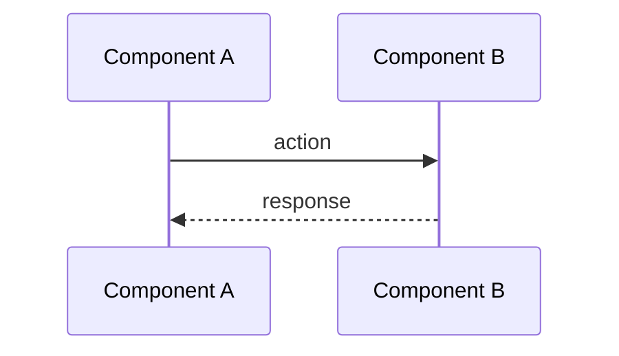

# [type]: 标题

> 📍 [返回总索引](../../README.md)

## Summary

（一句话说清楚：什么问题、影响是什么）

---

## Problem Frame

（展开描述：上下文、触发条件、影响范围、为什么需要修）

---

## Requirements

- R1. （可验证的需求，编号）
- R2.
- R3.

---

## Key Technical Decisions

- （设计决策，为什么选这个方案而不是别的）
- （如果涉及架构变更，说明理由）

---

## High-Level Technical Design

（流程图 / 时序图 / 架构图 —— 必填）

---

## Implementation Units

### U1. 标题

**Goal:** （这个单元要达成什么）

**Requirements:** R1, R2

**Dependencies:** None | U1

**Files:**
- `path/to/file.py`
- `tests/path/to/test.py`

**Approach:**
- （实现思路，步骤化）

**Patterns to follow:**
- （参考已有代码模式）

**Test scenarios:**
- （每个场景一句话）

**Verification:** （怎么验证这个单元做对了）

### U2. 标题

（同上结构）

---

## Scope Boundaries

### In Scope
- （本期要做的事情）

### Out of Scope
- （明确不做的事情）

### Deferred to Follow-Up
- （下期再做）

---

## Risks & Mitigations

- Risk: （可能出问题的地方）。Mitigation: （怎么防范）

---

## Sources & Research

- （引用的问题截图、日志、代码路径、已有文档）

---

## Verification Strategy

- （列出要跑的测试 / 要检查的验证步骤）
