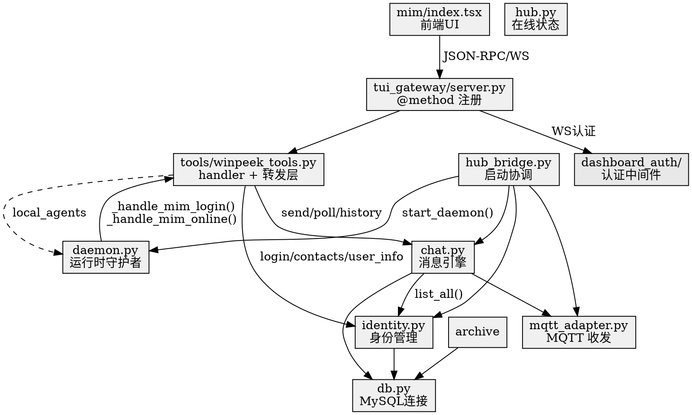

# MIM 代码文件关系图

## 分层依赖

```
┌─ 前端 ────────────────────────────────────────────┐
│ apps/desktop/src/app/winpeek/mim/index.tsx         │
│   └─ useGatewayRequest → JSON-RPC (WS)             │
├─ RPC 注册层 ──────────────────────────────────────┤
│ tui_gateway/server.py                              │
│   └─ @method 注册 → 转发到 tools 层 handler         │
├─ 工具层 ──────────────────────────────────────────┤
│ tools/winpeek_tools.py                             │
│   ├─ _mim_center_call() — 转发层 (R1: 禁改)        │
│   ├─ _handle_mim_login / send / poll / contacts    │
│   ├─ _handle_mim_online / history / user_info      │
│   └─ (包A新增) runtime_report / local_agents       │
├─ Hub 内核 ────────────────────────────────────────┤
│ gateway/winpeek_hub/                               │
│   ├─ hub_bridge.py  — 启动协调 (包B 改动)          │
│   ├─ identity.py    — 身份注册/登录 (MySQL)        │
│   ├─ chat.py        — 消息引擎 (MySQL + 内存队列)  │
│   ├─ mqtt_adapter.py — MQTT 收发                   │
│   ├─ hub.py         — 在线状态 (nodes.json)        │
│   ├─ archive.py     — 消息归档                     │
│   ├─ routing.py     — 跨平台路由                   │
│   └─ tenant.py      — 多租户                       │
├─ 公共 DB 层 ──────────────────────────────────────┤
│ gateway/winpeek_hub/db.py                          │
│   └─ get_conn() → pymysql (仅中心模式 import)      │
├─ Daemon ──────────────────────────────────────────┤
│ apps/winpeek_injector/daemon.py                    │
│   └─ 发现 → 注册 → 心跳 (全部走转发入口，无直连)   │
├─ 认证层 ──────────────────────────────────────────┤
│ hermes_cli/web_server.py                           │
│ hermes_cli/dashboard_auth/middleware.py             │
└────────────────────────────────────────────────────┘
```

## 模块依赖



## 代码 ↔ 文档交叉索引

| 代码文件 | 对应文档 |
|---------|---------|
| `db.py` | 架构 §4.1, DB 重构 Review |
| `chat.py` | PRD §4, 架构 §4.1, DB 重构 Review |
| `identity.py` | PRD §3, 架构 §4.1, DB 重构 Review |
| `mqtt_adapter.py` | PRD §5, 架构 §2 |
| `hub_bridge.py` | 架构 §4.2-G1, §5.1, 实施计划书 包B |
| `hub.py` | 架构 §4.1 |
| `tools/winpeek_tools.py` | 架构 §4.1, 实施计划书 包A, IDOR 文档 |
| `daemon.py` | 架构 §5.2, 实施计划书 包C |
| `mim/index.tsx` | 架构 §5.4, 实施计划书 包D |
| `web_server.py` | 架构 §4.1 (Hub 加载), 实施计划书 R2 |
| `tui_gateway/server.py` | 实施计划书 包A |
| `middleware.py` | 实施计划书 R2 |
